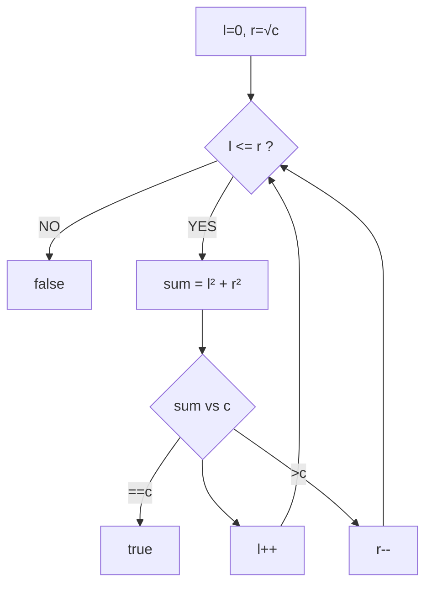

# 平方数之和（Sum of Square Numbers）

> LeetCode 633 · ⭐⭐ · 双指针

---

## 01. 题目描述

判断是否存在整数 a,b 使 `a² + b² = c`。

**示例**：
```
输入：c = 5  → true  (1² + 2² = 5)
输入：c = 3  → false
```

---

## 02. 题目分析

### 2.1 朴素思路

暴力枚举 a ∈ [0, √c]，检查 c-a² 是否为完全平方数 → O(√c)。

### 2.2 双指针优化



与 A005 盛最多水的容器同一框架——用双指针替代暴力枚举的 O(N²)。

### 2.3 正确性

当 `l²+r² < c` 时，任何含有当前 l 的组合都不可能等于 c（因为 r 已是最大可能值）→ 放弃 l。

---

## 03. 代码

**Java**：
```java
public boolean judgeSquareSum(int c) {
    long l = 0, r = (long) Math.sqrt(c);
    while (l <= r) {
        long sum = l * l + r * r;
        if (sum == c) return true;
        if (sum < c) l++;
        else r--;
    }
    return false;
}
```

**Python**：
```python
def judgeSquareSum(self, c: int) -> bool:
    l, r = 0, int(c ** 0.5)
    while l <= r:
        s = l * l + r * r
        if s == c: return True
        if s < c: l += 1
        else: r -= 1
    return False
```

**C++**：
```cpp
bool judgeSquareSum(int c) {
    long l=0, r=sqrt(c);
    while(l<=r){ long s=l*l+r*r; if(s==c) return true; if(s<c) l++; else r--; }
    return false;
}
```

**复杂度**：O(√c)/O(1)。

---

## 04. 总结

| 核心启示 | 说明 |
|---------|------|
| 双指针替代暴力 | 把 O(N²) 枚举优化为 O(N) |
| 正确性 | `sum<c → l++` 是安全的（r已达最大） |
| 与盛水容器相似 | 同一框架：根据 sum 与 target 的关系决定移动方向 |

**相关题目**：[A005 盛水容器](../07.数组算法题/005.盛最多水的容器.md)、[123 反转字符串](123.反转字符串.md)
