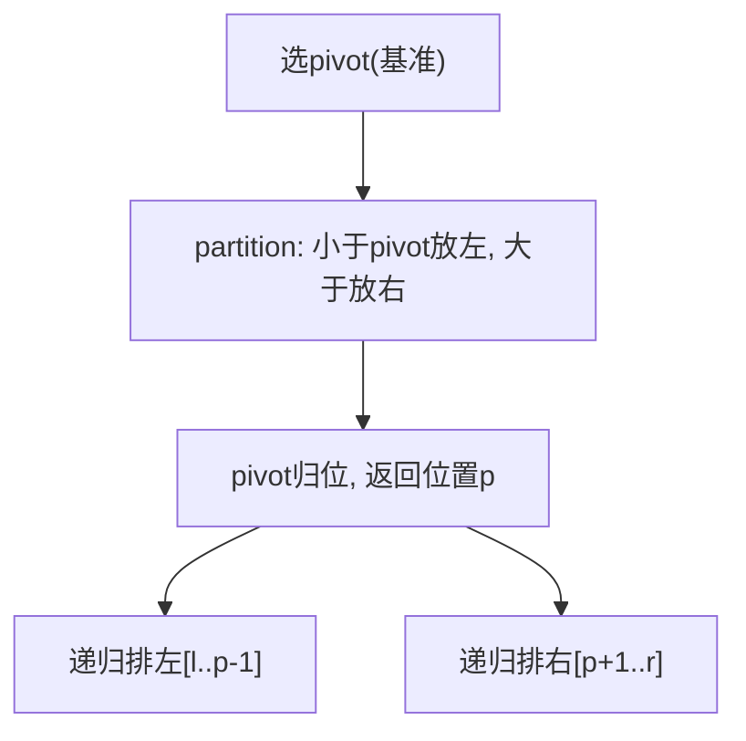

# 快速排序（Quick Sort）

> 手写必考 · ⭐⭐ · 分区+递归
>
> 平均 O(NlogN)，最坏 O(N²)。Java `Arrays.sort()` 对基本类型用双轴快排。理解 partition 就理解了快排。

---

## 01. 题目

手写快速排序。

---

## 02. 题目分析

### 2.1 核心思想



### 2.2 partition 手推

```
数组 [5, 3, 8, 4, 2], pivot=2(r=4)
i=l=0, j遍历:

j=0: a[0]=5 > pivot → 跳过
j=1: a[1]=3 > pivot → 跳过
j=2: a[2]=8 > pivot → 跳过
j=3: a[3]=4 > pivot → 跳过
swap(a[i],a[r]): swap(0,4) → [2,3,8,4,5]
pivot归位到i=0

左: 空  右: [3,8,4,5]
```

```
数组 [3, 1, 2, 5, 4], pivot=4(r=4)
i=0,j=0: a[0]=3 ≤ 4 → swap(0,0), i=1
i=1,j=1: a[1]=1 ≤ 4 → swap(1,1), i=2
i=2,j=2: a[2]=2 ≤ 4 → swap(2,2), i=3
i=3,j=3: a[3]=5 > 4 → 跳过
swap(a[i],a[r]): swap(3,4) → [3,1,2,4,5]
pivot=4归位到i=3
```

---

## 03. 代码

**Java**：
```java
void quickSort(int[] nums, int l, int r) {
    if (l >= r) return;
    int p = partition(nums, l, r);
    quickSort(nums, l, p - 1);
    quickSort(nums, p + 1, r);
}
int partition(int[] nums, int l, int r) {
    int pivot = nums[r], i = l;
    for (int j = l; j < r; j++)
        if (nums[j] <= pivot) swap(nums, i++, j);
    swap(nums, i, r); return i;
}
void swap(int[] a, int i, int j) { int t = a[i]; a[i] = a[j]; a[j] = t; }
```

**Python**：
```python
def quickSort(self, nums, l, r):
    if l >= r: return
    p = self.partition(nums, l, r)
    self.quickSort(nums, l, p-1)
    self.quickSort(nums, p+1, r)

def partition(self, nums, l, r):
    pivot, i = nums[r], l
    for j in range(l, r):
        if nums[j] <= pivot: nums[i], nums[j] = nums[j], nums[i]; i += 1
    nums[i], nums[r] = nums[r], nums[i]
    return i
```

**C++**：
```cpp
int partition(vector<int>& a, int l, int r) {
    int pivot = a[r], i = l;
    for (int j = l; j < r; j++) if (a[j] <= pivot) swap(a[i++], a[j]);
    swap(a[i], a[r]); return i;
}
void quickSort(vector<int>& a, int l, int r) {
    if (l >= r) return; int p = partition(a, l, r);
    quickSort(a, l, p-1); quickSort(a, p+1, r);
}
```

**复杂度**：O(NlogN)平均 / O(N²)最坏，O(logN)栈。

---

## 04. 优化方向与三大排序对比

| 优化 | 方法 | 解决的问题 |
|------|------|---------|
| 随机pivot | `swap(r, rand(l,r))` | 有序数组退化为O(N²) |
| 三数取中 | `median(l,m,r)` | 克服有序和逆序 |
| 三路快排 | 小于/等于/大于三个区 | 大量重复元素时O(N) |
| 小数组切插入排序 | `r-l < threshold` 时用插排 | 小数组递归开销大 |

| | 快排 | 归并 | 堆排 |
|------|:---:|:---:|:---:|
| 时间 | O(NlogN) | O(NlogN) | O(NlogN) |
| 空间 | O(logN) | O(N) | O(1) |
| 稳定 | 否 | **是** | 否 |
| 随机访问 | 需要 | 需要 | 需要(建堆) |

**相关**：[134 归并排序](134.归并排序.md)、[A011 荷兰国旗(三路快排)](../07.数组算法题/011-A-颜色分类.md)
