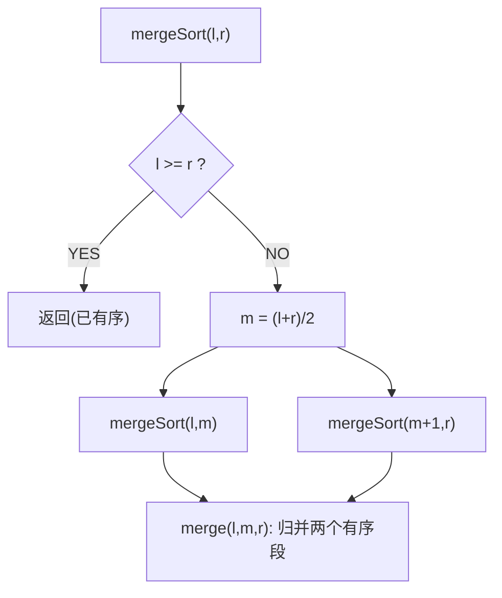

# 归并排序（Merge Sort）

> 手写必考 · ⭐⭐ · 分治+合并
>
> 稳定排序，O(NlogN)。天然适合链表排序和外排序。逆序对计数问题就是归并排序的变形。

---

## 01. 题目

手写归并排序。

---

## 02. 题目分析

### 2.1 分治三步



### 2.2 merge 手推

```
左子数组 [2,8]   右子数组 [3,5]
         i=0            j=0

① 2≤3 → tmp=[2], i=1
② 8>3 → tmp=[2,3], j=1
③ 8>5 → tmp=[2,3,5], j=2(右空)
④ 复制剩余: tmp=[2,3,5,8]
```

---

## 03. 代码

**Java**：
```java
void mergeSort(int[] nums, int l, int r) {
    if (l >= r) return;
    int m = l + (r - l) / 2;
    mergeSort(nums, l, m);
    mergeSort(nums, m + 1, r);
    merge(nums, l, m, r);
}
void merge(int[] nums, int l, int m, int r) {
    int[] tmp = new int[r - l + 1];
    int i = l, j = m + 1, k = 0;
    while (i <= m && j <= r)
        tmp[k++] = nums[i] <= nums[j] ? nums[i++] : nums[j++];
    while (i <= m) tmp[k++] = nums[i++];
    while (j <= r) tmp[k++] = nums[j++];
    System.arraycopy(tmp, 0, nums, l, tmp.length);
}
```

**Python**：
```python
def mergeSort(self, nums, l, r):
    if l >= r: return
    m = (l + r) // 2
    self.mergeSort(nums, l, m)
    self.mergeSort(nums, m + 1, r)
    tmp, i, j = [], l, m + 1
    while i <= m and j <= r:
        if nums[i] <= nums[j]: tmp.append(nums[i]); i += 1
        else: tmp.append(nums[j]); j += 1
    tmp.extend(nums[i:m+1]); tmp.extend(nums[j:r+1])
    nums[l:r+1] = tmp
```

**C++**：
```cpp
void merge(vector<int>& a,int l,int m,int r){ vector<int>t(r-l+1); int i=l,j=m+1,k=0; while(i<=m&&j<=r) t[k++]=a[i]<=a[j]?a[i++]:a[j++]; while(i<=m)t[k++]=a[i++]; while(j<=r)t[k++]=a[j++]; copy(t.begin(),t.end(),a.begin()+l); }
void mergeSort(vector<int>& a,int l,int r){ if(l>=r) return; int m=l+(r-l)/2; mergeSort(a,l,m);mergeSort(a,m+1,r); merge(a,l,m,r); }
```

**复杂度**：O(NlogN)/O(N)。稳定。

---

## 04. 归并 vs 快排

| | 归并 | 快排 |
|------|:---:|:---:|
| 分治顺序 | 先分后合 | 先partition再分 |
| 原地 | 否(需tmp) | 是 |
| 稳定 | **是** | 否 |
| 链表 | **天然适合** | 不适合 |
| 外排序 | **可以** | 不可以 |
| 逆序对 | **可以统计** | 不能 |

### 归并的应用

- **逆序对统计**：在 merge 时 `a[i] > a[j] → cnt += m-i+1`
- **链表排序**：链表的归并 = O(1)空间（断链+合并）
- **外排序**：内存装不下时，分段排+归并

---

## 05. 总结

| 核心启示 | 说明 |
|---------|------|
| 分治后归并 | 先递归拆分成最小单元，再回溯合并 |
| `a[i]<=a[j]` | `<=` 保证稳定性 |
| 逆序对 | `a[i] > a[j]` 时 `cnt += m-i+1` |

**相关**：[133 快速排序](133.快速排序.md)、[136 逆序对](136.数组中的逆序对.md)
