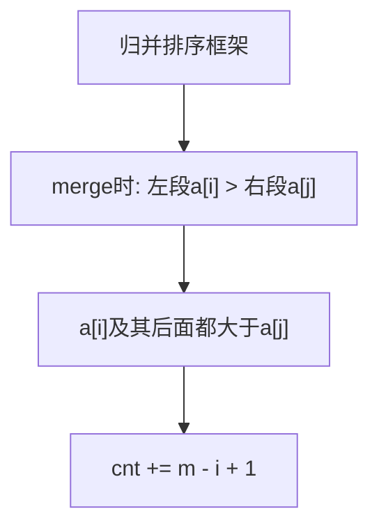

# 数组中的逆序对（Reverse Pairs）

> 剑指 Offer 51 · ⭐⭐⭐ · 归并统计

---

## 01. 题目描述

数组中 `i < j` 且 `a[i] > a[j]` 称为一个逆序对。统计总数。

```
输入：[7,5,6,4]
输出：5
解释：(7,5)(7,6)(7,4)(5,4)(6,4)
```

---

## 02. 题目分析

### 2.1 暴力 O(N²)

双重循环比较 → 超时。

### 2.2 归并统计 O(NlogN)



**为什么 `cnt += m-i+1`？**

```
左段已有序: [5,7,8,9]    右段已有序: [1,3,4,6]
              i=0                   j=0

a[0]=5 > a[j]=1 → 5,7,8,9 都 > 1 → cnt += 4-0 = 4
i=0不变, a[0]=5 vs a[j=1]=3: 5>3 → cnt += 4  → 总8
a[0]=5 vs a[j=2]=4: 5>4 → cnt += 4 → 总12
a[0]=5 vs a[j=3]=6: 5<6 → tmp[k++]=5, i=1
...
```

### 2.3 手推

```
[7, 5, 6, 4]

split: [7,5] [6,4]
↓
[7],[5]: merge: 7>5 → cnt=1, tmp=[5,7]
[6],[4]: merge: 6>4 → cnt=2, tmp=[4,6]
↓
[5,7],[4,6]: merge:
  i=0(5) vs j=0(4): 5>4 → cnt+=2-0=2, cnt=4, tmp=[4]
  i=0(5) vs j=1(6): 5<6 → tmp=[4,5], i=1
  i=1(7) vs j=1(6): 7>6 → cnt+=2-1=1, cnt=5, tmp=[4,5,6]
  i=1(7): tmp=[4,5,6,7]

cnt=5
```

---

## 03. 代码

**Java**：
```java
int cnt = 0;
public int reversePairs(int[] nums) {
    mergeSort(nums, 0, nums.length - 1);
    return cnt;
}
void mergeSort(int[] a, int l, int r) {
    if (l >= r) return;
    int m = l + (r - l) / 2;
    mergeSort(a, l, m); mergeSort(a, m + 1, r);
    merge(a, l, m, r);
}
void merge(int[] a, int l, int m, int r) {
    int[] tmp = new int[r - l + 1];
    int i = l, j = m + 1, k = 0;
    while (i <= m && j <= r) {
        if (a[i] <= a[j]) tmp[k++] = a[i++];
        else { tmp[k++] = a[j++]; cnt += m - i + 1; }  // 关键！
    }
    while (i <= m) tmp[k++] = a[i++];
    while (j <= r) tmp[k++] = a[j++];
    System.arraycopy(tmp, 0, a, l, tmp.length);
}
```

**Python**：
```python
def reversePairs(self, nums: List[int]) -> int:
    self.cnt = 0
    def merge(l, m, r):
        tmp, i, j = [], l, m + 1
        while i <= m and j <= r:
            if nums[i] <= nums[j]: tmp.append(nums[i]); i += 1
            else: tmp.append(nums[j]); j += 1; self.cnt += m - i + 1
        tmp.extend(nums[i:m+1]); tmp.extend(nums[j:r+1])
        nums[l:r+1] = tmp
    def mergeSort(l, r):
        if l >= r: return
        m = (l + r) // 2
        mergeSort(l, m); mergeSort(m + 1, r)
        merge(l, m, r)
    mergeSort(0, len(nums) - 1)
    return self.cnt
```

**C++**：
```cpp
int reversePairs(vector<int>& nums) {
    int cnt = 0;
    function<void(int,int)> ms = [&](int l,int r){ if(l>=r) return; int m=l+(r-l)/2; ms(l,m);ms(m+1,r);
        vector<int> t(r-l+1); int i=l,j=m+1,k=0;
        while(i<=m&&j<=r){ if(nums[i]<=nums[j]) t[k++]=nums[i++]; else{ t[k++]=nums[j++]; cnt+=m-i+1; } }
        while(i<=m) t[k++]=nums[i++]; while(j<=r) t[k++]=nums[j++]; move(t.begin(),t.end(),nums.begin()+l);
    };
    ms(0,nums.size()-1); return cnt;
}
```

**复杂度**：O(NlogN)/O(N)。

---

## 04. 总结

| 核心启示 | 说明 |
|---------|------|
| `cnt += m-i+1` | 左段a[i]及其后面的数都构成逆序对 |
| 归并变形 | 归并排序 + 一行统计 = 逆序对计数 |
| 树状数组 | 也可解此题，O(NlogN) |

**相关**：[134 归并排序](134.归并排序.md)
