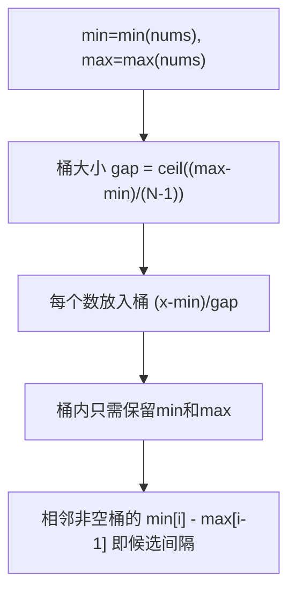

# 最大间距（Maximum Gap）

> LeetCode 164 · ⭐⭐⭐ · 桶排序 O(N)

---

## 01. 题目描述

求无序数组中排序后相邻元素的最大差值。要求 O(N)。

```
输入：[3,6,9,1]
输出：3  (排序后 [1,3,6,9]，最大间隔=3)
```

---

## 02. 题目分析

### 2.1 为什么必须用桶？

排序法 O(NlogN) 不满足要求。桶排序 O(N)。

### 2.2 桶排序原理



### 2.3 为什么 `(max-min)/(N-1)` 是最小桶大小？

N 个数均匀分布在 [min, max]，每个间隔至少 `(max-min)/(N-1)`。桶内元素的最大差值不会超过这个值——所以**最大间距一定出现在桶之间**。

---

## 03. 代码

**Java**：
```java
public int maximumGap(int[] nums) {
    if (nums.length < 2) return 0;
    int n = nums.length;
    int min = Integer.MAX_VALUE, max = Integer.MIN_VALUE;
    for (int x : nums) { min = Math.min(min, x); max = Math.max(max, x); }
    if (min == max) return 0;

    // 桶大小 = ceil((max-min)/(n-1))
    int gap = Math.max(1, (max - min) / (n - 1));
    int size = (max - min) / gap + 1;
    int[] bMin = new int[size], bMax = new int[size];
    Arrays.fill(bMin, Integer.MAX_VALUE); Arrays.fill(bMax, Integer.MIN_VALUE);

    // 入桶
    for (int x : nums) {
        int i = (x - min) / gap;
        bMin[i] = Math.min(bMin[i], x);
        bMax[i] = Math.max(bMax[i], x);
    }

    // 计算相邻桶的最大间距
    int ans = 0, prev = min;
    for (int i = 0; i < size; i++) {
        if (bMin[i] == Integer.MAX_VALUE) continue;  // 空桶跳过
        ans = Math.max(ans, bMin[i] - prev);
        prev = bMax[i];
    }
    return ans;
}
```

**Python**：
```python
def maximumGap(self, nums: List[int]) -> int:
    if len(nums) < 2: return 0
    n = len(nums)
    mn, mx = min(nums), max(nums)
    if mn == mx: return 0

    gap = max(1, (mx - mn) // (n - 1))
    size = (mx - mn) // gap + 1
    bMin = [float('inf')] * size; bMax = [float('-inf')] * size

    for x in nums:
        i = (x - mn) // gap
        bMin[i] = min(bMin[i], x); bMax[i] = max(bMax[i], x)

    ans, prev = 0, mn
    for i in range(size):
        if bMin[i] == float('inf'): continue
        ans = max(ans, bMin[i] - prev)
        prev = bMax[i]
    return ans
```

**C++**：
```cpp
int maximumGap(vector<int>& nums) {
    if (nums.size() < 2) return 0;
    int n = nums.size();
    auto [mn, mx] = minmax_element(nums.begin(), nums.end());
    if (*mn == *mx) return 0;

    int gap = max(1, (*mx - *mn) / (n - 1));
    int size = (*mx - *mn) / gap + 1;
    vector<int> bMin(size, INT_MAX), bMax(size, INT_MIN);

    for (int x : nums) { int i = (x - *mn) / gap; bMin[i] = min(bMin[i], x); bMax[i] = max(bMax[i], x); }

    int ans = 0, prev = *mn;
    for (int i = 0; i < size; i++) {
        if (bMin[i] == INT_MAX) continue;
        ans = max(ans, bMin[i] - prev); prev = bMax[i];
    }
    return ans;
}
```

**复杂度**：O(N)时间，O(N)空间。

---

## 04. 总结

| 核心启示 | 说明 |
|---------|------|
| 桶大小 | `(max-min)/(N-1)` 保证最大间距在桶间 |
| 只存min/max | 桶内不需要全排序，只需最值 |
| 空桶跳过 | 相邻非空桶的 `min[i]-max[i-1]` |
| O(N)排序 | 桶/计数/基数排序可突破 O(NlogN) |

**相关**：[136 逆序对](136.数组中的逆序对.md)
