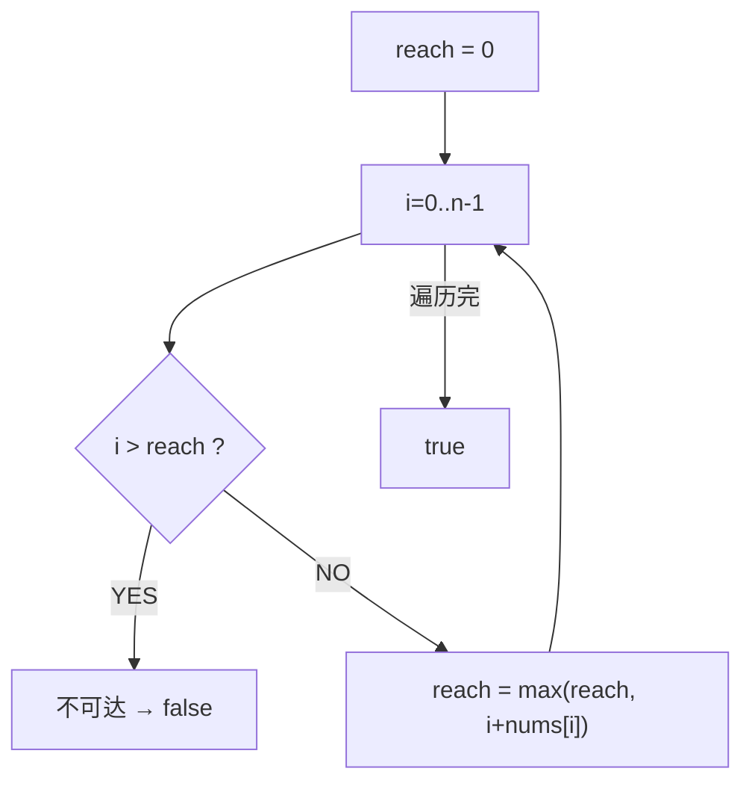

# 跳跃游戏（Jump Game）

> LeetCode 55 · ⭐⭐ · 贪心

## 01. 题目

数组每个元素表示最大跳跃长度。判断能否从0跳到末尾。`[2,3,1,1,4]` → true。

## 02. 题目分析



**贪心选择**：每一步维护"当前能到达的最远位置"。若 `i > reach` 说明跳不到 i。

```
nums=[2,3,1,1,4]
i=0: reach=max(0,0+2)=2
i=1: reach=max(2,1+3)=4 ≥ n-1 → true
```

## 03. 代码

**Java**：
```java
public boolean canJump(int[] nums) {
    int reach = 0;
    for (int i = 0; i < nums.length; i++) {
        if (i > reach) return false;
        reach = Math.max(reach, i + nums[i]);
    }
    return true;
}
```

**Python**：
```python
def canJump(self, nums):
    reach = 0
    for i, n in enumerate(nums):
        if i > reach: return False
        reach = max(reach, i + n)
    return True
```

**C++**：
```cpp
bool canJump(vector<int>& nums) {
    int reach=0;
    for(int i=0;i<nums.size();i++){ if(i>reach) return false; reach=max(reach,i+nums[i]); }
    return true;
}
```

**复杂度**：O(N)/O(1)。

## 04. 总结

| 核心 | 说明 |
|------|------|
| `reach` | 维护当前能到达的最远下标 |
| `i > reach` | 无法到达当前位置→失败 |
| 贪心正确性 | 每次都选能跳最远的 |

**相关**：[150 跳跃II](150.跳跃游戏II.md)
