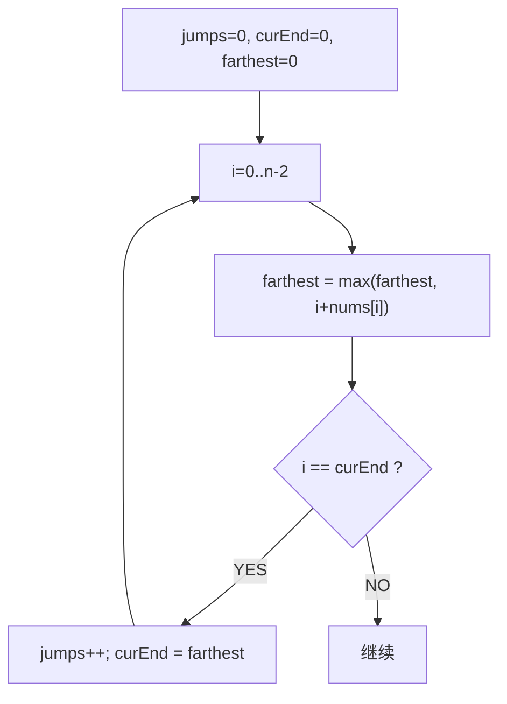

# 跳跃游戏 II（Jump Game II）

> LeetCode 45 · ⭐⭐ · 贪心

## 01. 题目

求最少跳跃次数到达末尾。`[2,3,1,1,4]` → 2（0→1→4）。

## 02. 题目分析



**curEnd**：当前跳跃能覆盖的最远边界。当 i 到达 curEnd 时，必须再跳一次。

```
nums=[2,3,1,1,4]
i=0: farthest=2, i==curEnd(0) → jumps=1, curEnd=2
i=1: farthest=4, i≠curEnd → 继续
i=2: farthest=4, i==curEnd(2) → jumps=2, curEnd=4 ≥ n-1 → 结束
```

## 03. 代码

**Java**：
```java
public int jump(int[] nums) {
    int jumps = 0, curEnd = 0, farthest = 0;
    for (int i = 0; i < nums.length - 1; i++) {
        farthest = Math.max(farthest, i + nums[i]);
        if (i == curEnd) { jumps++; curEnd = farthest; }
    }
    return jumps;
}
```

**Python**：
```python
def jump(self, nums):
    jumps = cur_end = farthest = 0
    for i in range(len(nums) - 1):
        farthest = max(farthest, i + nums[i])
        if i == cur_end: jumps += 1; cur_end = farthest
    return jumps
```

**C++**：
```cpp
int jump(vector<int>& nums) {
    int jumps=0, curEnd=0, farthest=0;
    for(int i=0;i<nums.size()-1;i++){ farthest=max(farthest,i+nums[i]); if(i==curEnd){ jumps++; curEnd=farthest; } }
    return jumps;
}
```

**复杂度**：O(N)/O(1)。

## 04. L001 vs L002

| | L001 能否到达 | L002 最少步数 |
|------|:---:|:---:|
| 返回值 | bool | int |
| 关键变量 | reach | jumps+curEnd+farthest |
| 额外条件 | — | `i==curEnd` 触发跳跃 |

**相关**：[149 跳跃游戏](149.跳跃游戏.md)
