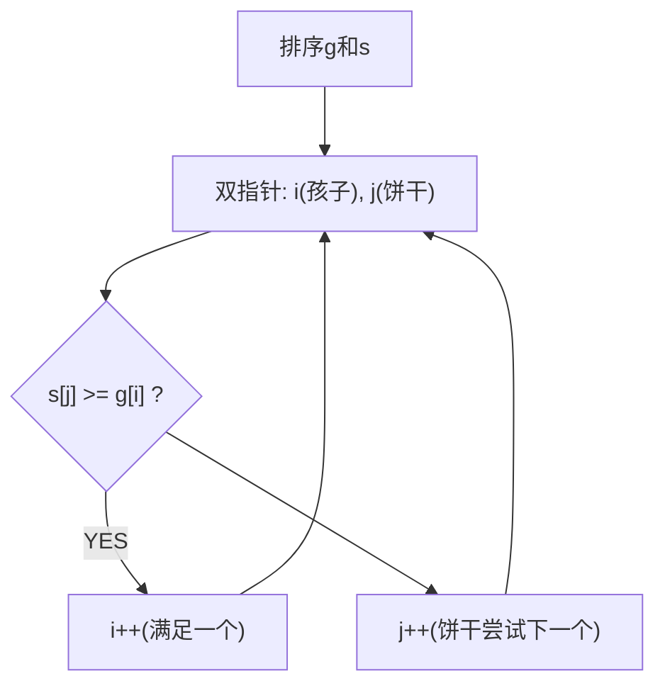

# 分发饼干（Assign Cookies）

> LeetCode 455 · ⭐ · 排序+贪心

## 01. 题目

每个孩子有胃口 `g[i]`，每块饼干有大小 `s[j]`。`s[j]≥g[i]` 时满足该孩子。最多满足几个？

`g=[1,2,3], s=[1,1]` → 1。

## 02. 题目分析



**贪心策略**：最小饼干满足最小胃口的孩子。

## 03. 代码

**Java**：
```java
public int findContentChildren(int[] g, int[] s) {
    Arrays.sort(g); Arrays.sort(s);
    int i = 0;
    for (int j = 0; i < g.length && j < s.length; j++)
        if (s[j] >= g[i]) i++;
    return i;
}
```

**Python**：
```python
def findContentChildren(self, g, s):
    g.sort(); s.sort(); i = 0
    for x in s:
        if i < len(g) and x >= g[i]: i += 1
    return i
```

**C++**：
```cpp
int findContentChildren(vector<int>& g, vector<int>& s) {
    sort(g.begin(),g.end()); sort(s.begin(),s.end());
    int i=0; for(int j=0;i<g.size()&&j<s.size();j++) if(s[j]>=g[i]) i++;
    return i;
}
```

**复杂度**：O(NlogN)/O(1)。

## 04. 总结

**贪心核心**：排序 → 最小匹配最小。O(NlogN)。

**相关**：[154 合并区间](154.合并区间.md)
