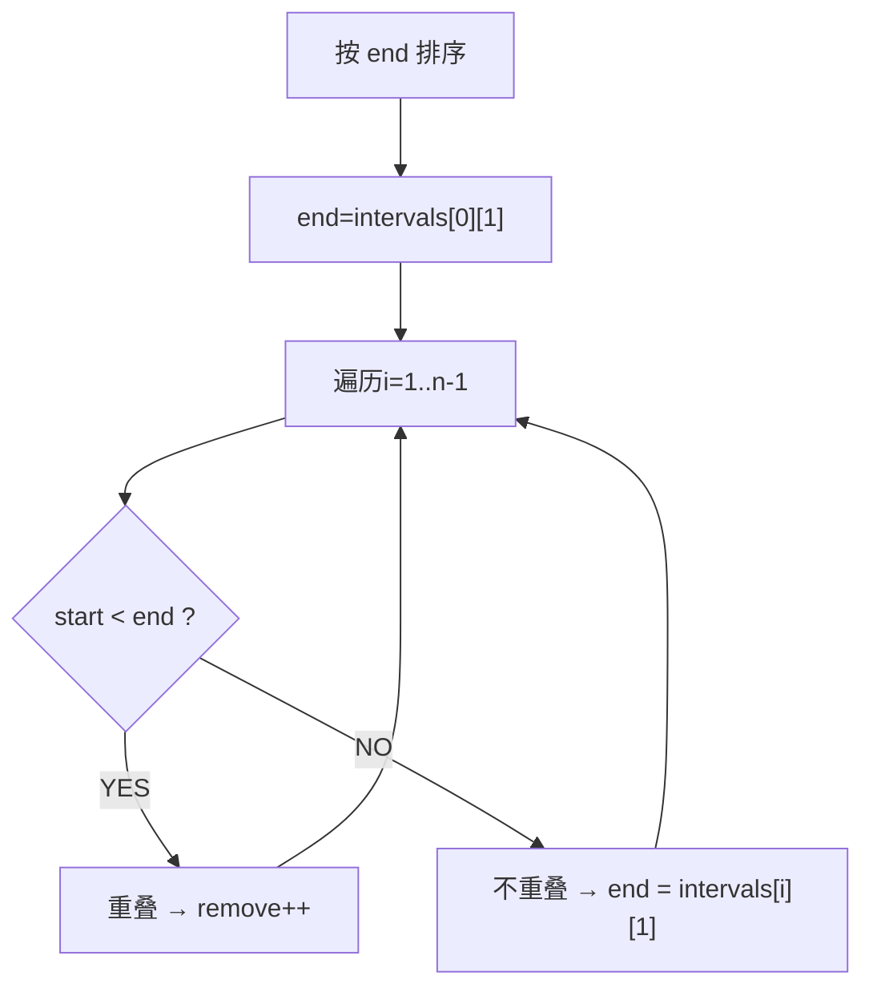

# 无重叠区间（Non-overlapping Intervals）

> LeetCode 435 · ⭐⭐ · 区间调度贪心

## 01. 题目

最少移除几个区间使剩余不重叠。`[[1,2],[2,3],[3,4],[1,3]]` → 1（移除[1,3]）。

## 02. 题目分析



**为什么按 end 排序？** 选择最早结束的区间，为后面的区间留下最多空间——这是区间调度问题的标准贪心策略。

## 03. 代码

**Java**：
```java
public int eraseOverlapIntervals(int[][] intervals) {
    Arrays.sort(intervals, (a, b) -> a[1] - b[1]);
    int end = intervals[0][1], remove = 0;
    for (int i = 1; i < intervals.length; i++) {
        if (intervals[i][0] < end) remove++;
        else end = intervals[i][1];
    }
    return remove;
}
```

**Python**：
```python
def eraseOverlapIntervals(self, intervals):
    intervals.sort(key=lambda x: x[1])
    end, cnt = intervals[0][1], 0
    for s, e in intervals[1:]:
        if s < end: cnt += 1
        else: end = e
    return cnt
```

**C++**：
```cpp
int eraseOverlapIntervals(vector<vector<int>>& ins) {
    sort(ins.begin(),ins.end(),[](auto&a,auto&b){return a[1]<b[1];});
    int end=ins[0][1],cnt=0;
    for(int i=1;i<ins.size();i++){ if(ins[i][0]<end) cnt++; else end=ins[i][1]; }
    return cnt;
}
```

**复杂度**：O(NlogN)/O(1)。

## 04. 区间三题对比

| | 无重叠(152) | 引爆气球(153) | 合并区间(154) |
|------|:---:|:---:|:---:|
| 排序 | end | end | **start** |
| 条件 | `start < end` | `start > end` | `start <= end` |
| 操作 | 跳过计数 | 新箭 | 合并取max end |

**核心**：L152/L153 按 end 贪心，L154 按 start 排以便从前向后合并。

**相关**：[153 引爆气球](153.用最少数量的箭引爆气球.md)、[154 合并区间](154.合并区间.md)
