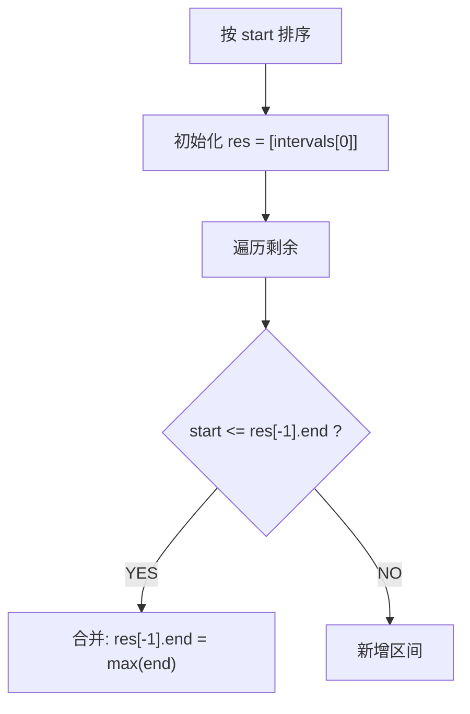

# 合并区间（Merge Intervals）

> LeetCode 56 · ⭐⭐ · 排序+贪心

## 01. 题目

`[[1,3],[2,6],[8,10],[15,18]]` → `[[1,6],[8,10],[15,18]]`

## 02. 分析



**与 L152/L153 不同**：按 **start** 排序（不是 end），因为需要从前向后合并。

## 03. 代码

**Java**：
```java
public int[][] merge(int[][] intervals) {
    Arrays.sort(intervals, (a, b) -> a[0] - b[0]);
    List<int[]> res = new ArrayList<>();
    for (int[] in : intervals) {
        if (res.isEmpty() || res.get(res.size() - 1)[1] < in[0])
            res.add(in);
        else
            res.get(res.size() - 1)[1] = Math.max(res.get(res.size() - 1)[1], in[1]);
    }
    return res.toArray(new int[res.size()][]);
}
```

**Python**：
```python
def merge(self, intervals):
    intervals.sort(key=lambda x: x[0])
    res = [intervals[0]]
    for s, e in intervals[1:]:
        if s > res[-1][1]: res.append([s, e])
        else: res[-1][1] = max(res[-1][1], e)
    return res
```

**C++**：
```cpp
vector<vector<int>> merge(vector<vector<int>>& ins) {
    sort(ins.begin(),ins.end());
    vector<vector<int>> res;
    for(auto& in:ins){ if(res.empty()||res.back()[1]<in[0]) res.push_back(in); else res.back()[1]=max(res.back()[1],in[1]); }
    return res;
}
```

**复杂度**：O(NlogN)/O(N)。

**相关**：[152 无重叠区间](152.无重叠区间.md)
