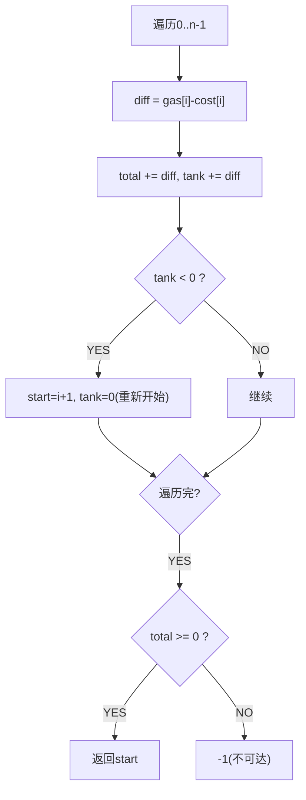

# 加油站（Gas Station）

> LeetCode 134 · ⭐⭐ · 贪心

## 01. 题目

环形路线，`gas[i]` 加油量，`cost[i]` 消耗量。找能绕一圈的起点。

`gas=[1,2,3,4,5], cost=[3,4,5,1,2]` → 3。

## 02. 题目分析



**核心**：若从 A 出发到不了 B，则 A~B 之间任一点出发也到不了 B。所以直接跳过这段。

## 03. 代码

**Java**：
```java
public int canCompleteCircuit(int[] gas, int[] cost) {
    int total = 0, tank = 0, start = 0;
    for (int i = 0; i < gas.length; i++) {
        int diff = gas[i] - cost[i];
        total += diff; tank += diff;
        if (tank < 0) { start = i + 1; tank = 0; }
    }
    return total >= 0 ? start : -1;
}
```

**Python**：
```python
def canCompleteCircuit(self, gas, cost):
    total = tank = start = 0
    for i in range(len(gas)):
        diff = gas[i] - cost[i]
        total += diff; tank += diff
        if tank < 0: start = i + 1; tank = 0
    return start if total >= 0 else -1
```

**C++**：
```cpp
int canCompleteCircuit(vector<int>& gas, vector<int>& cost) {
    int total=0,tank=0,start=0;
    for(int i=0;i<gas.size();i++){ int diff=gas[i]-cost[i]; total+=diff; tank+=diff; if(tank<0){ start=i+1; tank=0; } }
    return total>=0?start:-1;
}
```

**复杂度**：O(N)/O(1)。

## 04. 总结

| 核心 | 说明 |
|------|------|
| `total` | 总油量差，`total>=0` 才有解 |
| `tank` | 当前段剩余油量，<0 则重置 |
| 贪心 | 跳过不可达的段 |

**相关**：[157 摆动序列](157.摆动序列.md)
