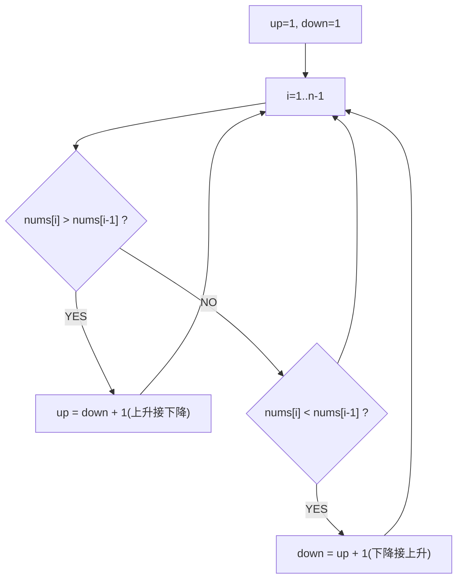

# 摆动序列（Wiggle Subsequence）

> LeetCode 376 · ⭐⭐ · 贪心 / DP

## 01. 题目

最长的交替增减子序列长度。`[1,7,4,9,2,5]` → 6（全部交替）。`[1,17,5,10,13,15,10,5,16,8]` → 7。

## 02. 题目分析



**核心**：`up` 以上升结尾的最长摆动，`down` 以下降结尾的最长摆动。

```
nums=[1,7,4,9,2,5]
i=1: 7>1 → up=down+1=2
i=2: 4<7 → down=up+1=3
i=3: 9>4 → up=down+1=4
i=4: 2<9 → down=up+1=5
i=5: 5>2 → up=down+1=6
→ max(up,down)=6
```

## 03. 代码

**Java**：
```java
public int wiggleMaxLength(int[] nums) {
    if (nums.length < 2) return nums.length;
    int up = 1, down = 1;
    for (int i = 1; i < nums.length; i++) {
        if (nums[i] > nums[i - 1]) up = down + 1;
        else if (nums[i] < nums[i - 1]) down = up + 1;
    }
    return Math.max(up, down);
}
```

**Python**：
```python
def wiggleMaxLength(self, nums):
    up = down = 1
    for i in range(1, len(nums)):
        if nums[i] > nums[i-1]: up = down + 1
        elif nums[i] < nums[i-1]: down = up + 1
    return max(up, down)
```

**C++**：
```cpp
int wiggleMaxLength(vector<int>& nums) {
    int up=1,down=1;
    for(int i=1;i<nums.size();i++){ if(nums[i]>nums[i-1]) up=down+1; else if(nums[i]<nums[i-1]) down=up+1; }
    return max(up,down);
}
```

**复杂度**：O(N)/O(1)。

## 04. 总结

| 核心 | 说明 |
|------|------|
| 双状态DP | `up` 和 `down` 交替更新 |
| 贪心 | 相邻相等不更新（忽略平台） |
| 空间优化 | O(N)→O(1) |

**相关**：[149 跳跃游戏](149.跳跃游戏.md)
