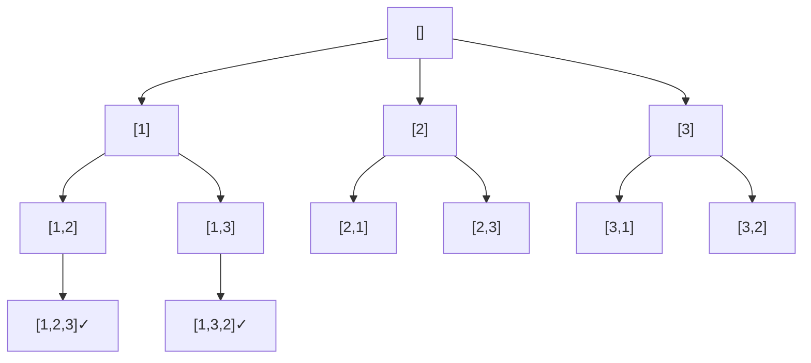

# 全排列（Permutations）

> LeetCode 46 · ⭐⭐ · 回溯模板

## 01. 题目

`[1,2,3]` → `[[1,2,3],[1,3,2],[2,1,3],[2,3,1],[3,1,2],[3,2,1]]`

## 02. 题目分析

### 回溯决策树



### 回溯通用模板

```java
void backtrack(路径, 选择列表) {
    if (终止条件) { 收集结果; return; }
    for (选择 : 选择列表) {
        做选择;
        backtrack(路径, 新选择列表);
        撤销选择;
    }
}
```

## 03. 代码

**Java**：
```java
List<List<Integer>> res = new ArrayList<>();
public List<List<Integer>> permute(int[] nums) {
    backtrack(nums, new ArrayList<>(), new boolean[nums.length]);
    return res;
}
void backtrack(int[] nums, List<Integer> path, boolean[] used) {
    if (path.size() == nums.length) { res.add(new ArrayList<>(path)); return; }
    for (int i = 0; i < nums.length; i++) {
        if (used[i]) continue;
        path.add(nums[i]); used[i] = true;
        backtrack(nums, path, used);
        path.remove(path.size() - 1); used[i] = false;
    }
}
```

**Python**：
```python
def permute(self, nums):
    res = []
    def dfs(path, used):
        if len(path) == len(nums): res.append(path[:]); return
        for i, n in enumerate(nums):
            if not used[i]: used[i] = True; path.append(n); dfs(path, used); path.pop(); used[i] = False
    dfs([], [False]*len(nums)); return res
```

**C++**：
```cpp
vector<vector<int>> permute(vector<int>& nums) {
    vector<vector<int>> res; vector<int> path; vector<bool> used(nums.size());
    function<void()> dfs=[&]{ if(path.size()==nums.size()){ res.push_back(path); return; }
        for(int i=0;i<nums.size();i++){ if(used[i]) continue; used[i]=true; path.push_back(nums[i]); dfs(); path.pop_back(); used[i]=false; } };
    dfs(); return res;
}
```

**复杂度**：O(N·N!)/O(N)。

## 04. 回溯题型对比

| 类型 | used/start | 特点 |
|------|:---:|------|
| 全排列(159) | `used[]`数组 | 顺序重要 |
| 子集(161) | `start`索引 | 每步收集 |
| 组合(165) | `start`索引 | 固定长度 |

**相关**：[160 全排列II](160.全排列II.md)、[161 子集](161.子集.md)
