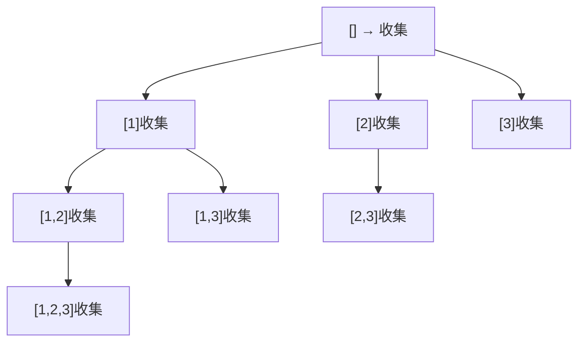

# 子集（Subsets）

> LeetCode 78 · ⭐⭐ · 回溯 / 位运算

## 01. 题目

`[1,2,3]` → `[[],[1],[2],[1,2],[3],[1,3],[2,3],[1,2,3]]`

## 02. 分析

与全排列的区别：①用 `start` 控制不回头 ②**每步都收集结果**。



## 03. 代码

**Java**：
```java
List<List<Integer>> res = new ArrayList<>();
public List<List<Integer>> subsets(int[] nums) { backtrack(nums,0,new ArrayList<>()); return res; }
void backtrack(int[] nums, int start, List<Integer> path) {
    res.add(new ArrayList<>(path));           // 每步收集
    for (int i = start; i < nums.length; i++) {
        path.add(nums[i]); backtrack(nums, i+1, path); path.remove(path.size()-1);
    }
}
```

**Python**：
```python
def subsets(self, nums):
    res = []
    def dfs(start, path): res.append(path[:]); [dfs(i+1, path+[nums[i]]) for i in range(start, len(nums))]
    dfs(0, [])
    return res
```

**C++**：
```cpp
vector<vector<int>> subsets(vector<int>& nums) { vector<vector<int>> res; vector<int> path;
    function<void(int)> dfs=[&](int s){ res.push_back(path);
        for(int i=s;i<nums.size();i++){ path.push_back(nums[i]); dfs(i+1); path.pop_back(); } };
    dfs(0); return res; }
```

**复杂度**：O(N·2^N)/O(N)。

## 04. 回溯三类对比

| | 全排列 | 子集 | 组合 |
|------|:---:|:---:|:---:|
| 收集时机 | path.size()==n | **每步** | path.size()==k |
| 循环起点 | 0(start无效) | start | start |
| used | 需要 | 不需要 | 不需要 |

**相关**：[162 子集II](162.子集II.md)、[165 组合](165.组合.md)
