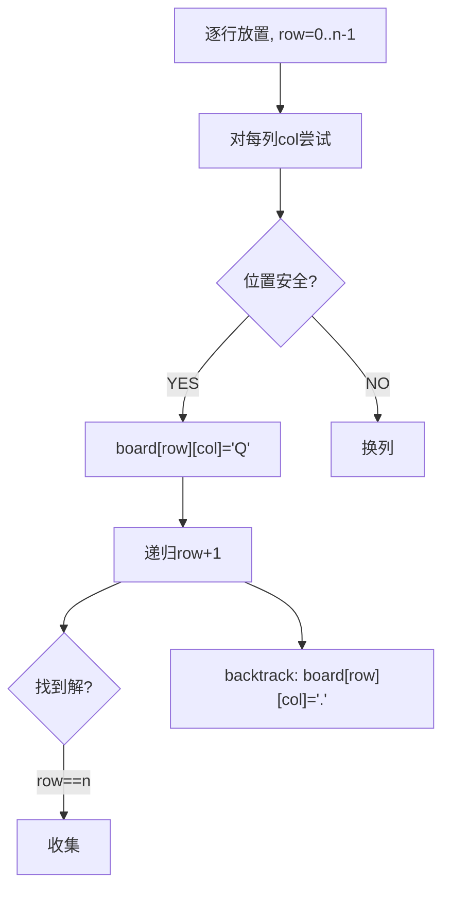

# N 皇后（N-Queens）

> LeetCode 51 · ⭐⭐⭐ · 回溯+约束

## 01. 题目

n×n 棋盘放 n 个皇后，不能同行/同列/同对角线。n=4 有 2 种方案。

## 02. 题目分析



**约束检测**：只需检查上方、左上对角、右上对角（下方还没放）。

## 03. 代码

**Java**：
```java
public List<List<String>> solveNQueens(int n) {
    List<List<String>> res = new ArrayList<>();
    char[][] board = new char[n][n];
    for (char[] row : board) Arrays.fill(row, '.');
    backtrack(res, board, 0);
    return res;
}
void backtrack(List<List<String>> res, char[][] b, int row) {
    if (row == b.length) { List<String> list = new ArrayList<>(); for (char[] r : b) list.add(new String(r)); res.add(list); return; }
    for (int col = 0; col < b.length; col++) {
        if (!valid(b, row, col)) continue;
        b[row][col] = 'Q'; backtrack(res, b, row + 1); b[row][col] = '.';
    }
}
boolean valid(char[][] b, int row, int col) {
    for (int i = 0; i < row; i++) if (b[i][col] == 'Q') return false; // 同列
    for (int i=row-1,j=col-1; i>=0&&j>=0; i--,j--) if(b[i][j]=='Q') return false; // 左上
    for (int i=row-1,j=col+1; i>=0&&j<b.length; i--,j++) if(b[i][j]=='Q') return false; // 右上
    return true;
}
```

**Python**：
```python
def solveNQueens(self, n):
    res, b = [], [['.']*n for _ in range(n)]
    def valid(r, c):
        for i in range(r):
            if b[i][c]=='Q': return False
            if c-(r-i)>=0 and b[i][c-(r-i)]=='Q': return False
            if c+(r-i)<n and b[i][c+(r-i)]=='Q': return False
        return True
    def dfs(r):
        if r==n: res.append([''.join(row) for row in b]); return
        for c in range(n):
            if valid(r,c): b[r][c]='Q'; dfs(r+1); b[r][c]='.'
    dfs(0); return res
```

**复杂度**：O(N!)/O(N²)。

**相关**：[170 解数独](170.解数独.md)
