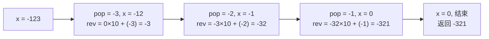

# P001 整数反转

> LeetCode 7 · ⭐ · 数学模拟 · 溢出判断

## 01. 题目描述

给定一个 32 位有符号整数 `x`，返回 `x` 翻转后的数字。若翻转后超出 `[-2³¹, 2³¹-1]`，返回 0。

```
输入：x = 123
输出：321

输入：x = -123
输出：-321

输入：x = 120
输出：21
```

| 约束 | 值 |
|:---|:---|
| 范围 | `-2³¹ ≤ x ≤ 2³¹-1` |
| 溢出 | 直接返回 0 |

## 02. 题目分析

### 2.1 核心公式

逐位取模 + 拼接：`rev = rev * 10 + x % 10`，然后 `x /= 10`。



### 2.2 唯一难点：溢出判断

Java 中 `Integer.MAX_VALUE = 2147483647`，`Integer.MIN_VALUE = -2147483648`。

**正向溢出**：`rev > MAX/10`，或 `rev == MAX/10 && pop > 7`。
**负向溢出**：`rev < MIN/10`，或 `rev == MIN/10 && pop < -8`。

### 2.3 溢出手推验证

以 `x = 1534236469` 为例（恰好会溢出）：

| 步 | x | pop | rev (上一步) | rev > MAX/10? | rev×10+pop | 溢出? |
|:---:|:---:|:---:|:---:|:---:|:---|:---:|
| 1 | 153423646 | 9 | 0 | 否 | 9 | 否 |
| 2 | 15342364 | 6 | 9 | 否 | 96 | 否 |
| … | … | … | … | … | … | … |
| 9 | 1 | 4 | 964632435 | `964632435 > 214748364` ✅ | — | **是，返回 0** |

## 03. 解法一：逐位反转 + 溢出检查

### Java

```java
public int reverse(int x) {
    int rev = 0;
    while (x != 0) {
        int pop = x % 10;
        x /= 10;
        // 正向溢出
        if (rev > Integer.MAX_VALUE / 10 || (rev == Integer.MAX_VALUE / 10 && pop > 7))
            return 0;
        // 负向溢出
        if (rev < Integer.MIN_VALUE / 10 || (rev == Integer.MIN_VALUE / 10 && pop < -8))
            return 0;
        rev = rev * 10 + pop;
    }
    return rev;
}
```

### Python

```python
def reverse(self, x: int) -> int:
    rev = 0
    INT_MAX, INT_MIN = 2**31 - 1, -2**31
    while x != 0:
        # Python 中负数取模规则不同，统一处理
        if x > 0:
            pop = x % 10
        else:
            pop = x % -10  # 保持符号一致
        x = (x - pop) // 10 if x > 0 else (x + abs(pop)) // 10
        if rev > INT_MAX // 10 or (rev == INT_MAX // 10 and pop > 7):
            return 0
        if rev < INT_MIN // 10 or (rev == INT_MIN // 10 and pop < -8):
            return 0
        rev = rev * 10 + pop
    return rev

# 简化版（利用 Python 大整数不溢出，最后再判）
def reverse_simple(self, x: int) -> int:
    sign = -1 if x < 0 else 1
    rev = int(str(abs(x))[::-1]) * sign
    return rev if -2**31 <= rev <= 2**31 - 1 else 0
```

### C++

```cpp
int reverse(int x) {
    int rev = 0;
    while (x != 0) {
        int pop = x % 10;
        x /= 10;
        if (rev > INT_MAX / 10 || (rev == INT_MAX / 10 && pop > 7)) return 0;
        if (rev < INT_MIN / 10 || (rev == INT_MIN / 10 && pop < -8)) return 0;
        rev = rev * 10 + pop;
    }
    return rev;
}
```

## 04. 复杂度分析

| 指标 | 值 |
|:---|:---|
| 时间 | O(log₁₀N)，约 10 次迭代 |
| 空间 | O(1) |

## 05. 题型总结

| 相关题 | 区别 |
|------|------|
| [P002 回文数](202.回文数.md) | 反转一半 + 不用判溢出 |
| A019 字符串相乘 | 大数乘法模拟 |
| A020 字符串转整数 | 自动机处理前缀 + 溢出 |

---

**核心公式**：`rev = rev * 10 + pop`。溢出时机：`rev > MAX/10` 时无论 pop 多少都会溢出。
