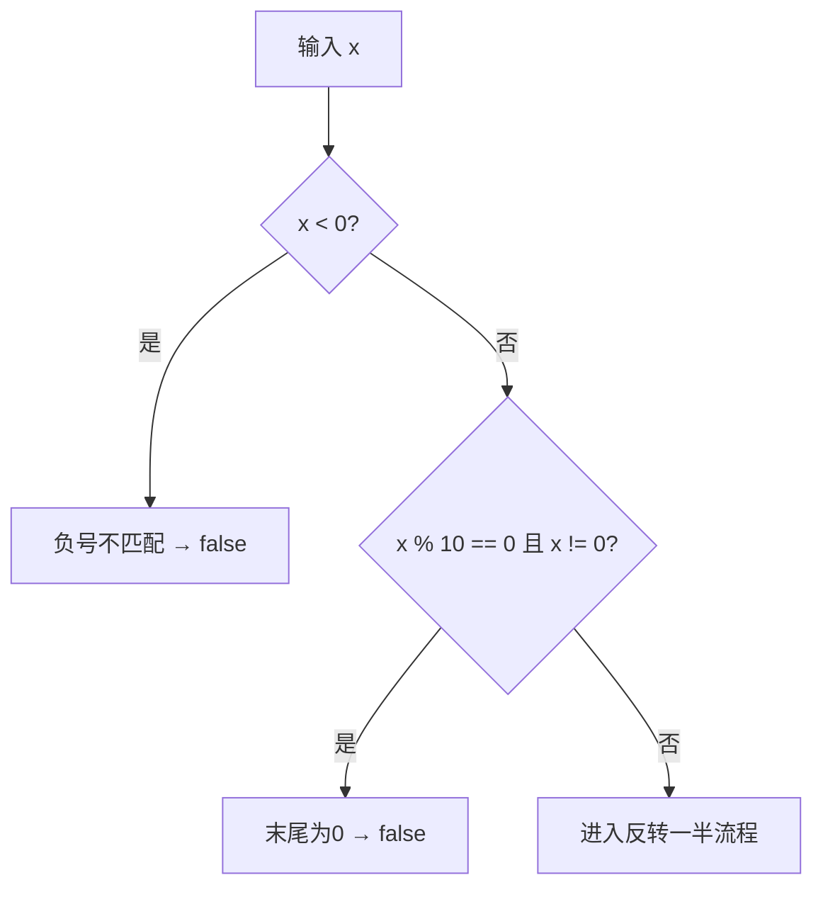
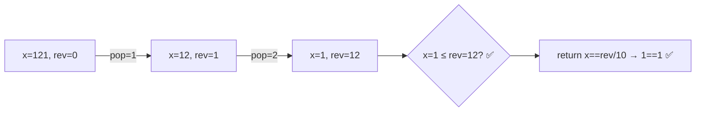

# P002 回文数

> LeetCode 9 · ⭐ · 反转一半 · 数字直觉

## 01. 题目描述

判断一个整数是否是回文数（正序倒序相同）。**不能转为字符串**。

```
输入：121  →  true
输入：-121 →  false（负号不匹配）
输入：10   →  false（末尾为 0 的非零数不可能是回文）
```

| 约束 | 值 |
|:---|:---|
| 范围 | `-2³¹ ≤ x ≤ 2³¹-1` |
| 要求 | 不使用额外字符串空间 |

## 02. 题目分析

### 2.1 核心洞察

回文 = 反转数字是否等于原数。P001 中我们做了**全反转**，但这里只需**反转一半**——与 P001 相同的思路但更巧妙。

**为什么可以只反转一半？**
- 当原数 `x ≤ 反转值 rev` 时，证明已经过半
- 最终比较：偶数位 `x == rev`，奇数位 `x == rev/10`

### 2.2 提前排除



### 2.3 反转一半流程



## 03. 手推演示

以 `x = 12321`（奇数位）为例：

| 步 | x | rev | x > rev? | 操作 |
|:---:|:---:|:---:|:---:|------|
| 初始 | 12321 | 0 | ✅ | — |
| 1 | 1232 | 1 | ✅ | pop=1, x/=10, rev=0×10+1 |
| 2 | 123 | 12 | ✅ | pop=2, x/=10, rev=1×10+2 |
| 3 | 12 | 123 | ❌（x≤rev） | 停止 |

结果：`x == rev/10` → `12 == 12` ✅

以 `x = 1221`（偶数位）为例：

| 步 | x | rev | x > rev? | 操作 |
|:---:|:---:|:---:|:---:|------|
| 初始 | 1221 | 0 | ✅ | — |
| 1 | 122 | 1 | ✅ | pop=1 |
| 2 | 12 | 12 | ❌（x≤rev） | 停止 |

结果：`x == rev` → `12 == 12` ✅

## 04. 解法一：反转一半

### Java

```java
public boolean isPalindrome(int x) {
    // 提前排除：负数、末尾为0的非零数
    if (x < 0 || (x % 10 == 0 && x != 0)) return false;

    int rev = 0;
    while (x > rev) {
        rev = rev * 10 + x % 10;
        x /= 10;
    }
    // 偶数位: x == rev, 奇数位: x == rev/10
    return x == rev || x == rev / 10;
}
```

### Python

```python
def isPalindrome(self, x: int) -> bool:
    if x < 0 or (x % 10 == 0 and x != 0):
        return False

    rev = 0
    while x > rev:
        rev = rev * 10 + x % 10
        x //= 10
    return x == rev or x == rev // 10
```

### C++

```cpp
bool isPalindrome(int x) {
    if (x < 0 || (x % 10 == 0 && x != 0)) return false;

    int rev = 0;
    while (x > rev) {
        rev = rev * 10 + x % 10;
        x /= 10;
    }
    return x == rev || x == rev / 10;
}
```

## 05. 解法对比

| 解法 | 时间 | 空间 | 说明 |
|------|:---:|:---:|------|
| 转字符串+双指针 | O(N) | O(N) | 最简单但不合题意 |
| 全反转 | O(logN) | O(1) | 可能溢出，需判溢 |
| **反转一半** | O(logN) | O(1) | 不溢出，最优 |

## 06. P001 与 P002 对比

| 维度 | P001 整数反转 | P002 回文数 |
|------|:---:|:---:|
| 反转范围 | 全部 | 一半 |
| 溢出风险 | 有，需判溢 | 无（x > rev 自然停止） |
| 符号处理 | 有负号 | 负数直接排除 |
| 末尾零 | 自然处理(→0) | 需提前排除 |

## 07. 复杂度与总结

| 指标 | 值 |
|:---|:---|
| 时间 | O(log₁₀N)，约 5 次迭代 |
| 空间 | O(1) |

**本质**：数字回文的判定可以"不翻完"——只需对比一半，即避开了溢出问题。

---

**相关**：[P001 整数反转](201.整数反转.md) · [P004 字符串相加](204.字符串相加.md) · [121 验证回文串](../15.双指针算法题/121.验证回文串.md)
