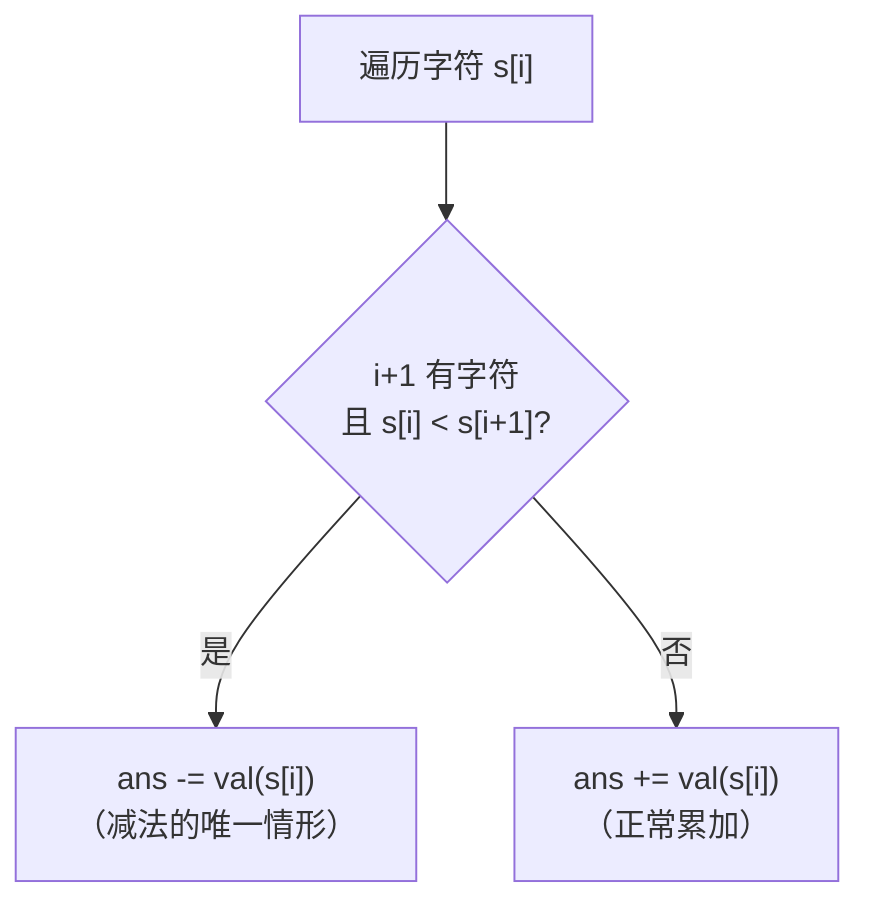

# P003 罗马数字转整数

> LeetCode 13 · ⭐ · 规则模拟 · 哈希表

## 01. 题目描述

给定一个罗马数字字符串 `s`，返回对应的整数值。

| 罗马数字 | I | V | X | L | C | D | M |
|:---:|:---:|:---:|:---:|:---:|:---:|:---:|:---:|
| 值 | 1 | 5 | 10 | 50 | 100 | 500 | 1000 |

**特殊规则**：小数字在大数字左边时做减法。
```
I 在 V/X 左边 → IV(4), IX(9)
X 在 L/C 左边 → XL(40), XC(90)
C 在 D/M 左边 → CD(400), CM(900)
```

```
输入：s = "LVIII" → 58（L=50, V=5, III=3）
输入：s = "MCMXCIV" → 1994（M=1000, CM=900, XC=90, IV=4）
```

## 02. 题目分析

### 2.1 规则统一

**为什么映射表只需要 7 个字符？** 因为特殊值（IV/IX/XL等）本质上就是"小数字在大左边 = 减法"这条规则的表达式。

核心决策逻辑：



### 2.2 手推验证

以 `s = "MCMXCIV"` 为例：

| i | 字符 | 值 | s[i+1] | 比较 | 操作 | ans |
|:---:|:---:|:---:|:---:|:---:|:---:|:---:|
| 0 | M | 1000 | C(100) | 1000 > 100 | +1000 | 1000 |
| 1 | C | 100 | M(1000) | **100 < 1000** | **-100** | 900 |
| 2 | M | 1000 | X(10) | 1000 > 10 | +1000 | 1900 |
| 3 | X | 10 | C(100) | **10 < 100** | **-10** | 1890 |
| 4 | C | 100 | I(1) | 100 > 1 | +100 | 1990 |
| 5 | I | 1 | V(5) | **1 < 5** | **-1** | 1989 |
| 6 | V | 5 | — | — | +5 | **1994** |

只有 3 次减法（CM=900, XC=90, IV=4），其余全是加法。完美吻合。

## 03. 解法一：逐位比较（三语）

### Java

```java
public int romanToInt(String s) {
    Map<Character, Integer> map = new HashMap<>();
    map.put('I', 1); map.put('V', 5);  map.put('X', 10);
    map.put('L', 50); map.put('C', 100); map.put('D', 500);
    map.put('M', 1000);

    int ans = 0, n = s.length();
    for (int i = 0; i < n; i++) {
        int cur = map.get(s.charAt(i));
        if (i + 1 < n && cur < map.get(s.charAt(i + 1))) {
            ans -= cur;  // 唯一减法的情形
        } else {
            ans += cur;
        }
    }
    return ans;
}
```

### Python

```python
def romanToInt(self, s: str) -> int:
    d = {'I': 1, 'V': 5, 'X': 10, 'L': 50, 'C': 100, 'D': 500, 'M': 1000}
    ans = 0
    for i in range(len(s)):
        cur = d[s[i]]
        if i + 1 < len(s) and cur < d[s[i + 1]]:
            ans -= cur
        else:
            ans += cur
    return ans
```

### C++

```cpp
int romanToInt(string s) {
    unordered_map<char, int> m = {{'I',1},{'V',5},{'X',10},{'L',50},
                                   {'C',100},{'D',500},{'M',1000}};
    int ans = 0;
    for (int i = 0; i < s.size(); i++) {
        int cur = m[s[i]];
        if (i + 1 < s.size() && cur < m[s[i + 1]]) ans -= cur;
        else ans += cur;
    }
    return ans;
}
```

## 04. 解法对比

| 解法 | 时间 | 空间 | 说明 |
|------|:---:|:---:|------|
| 逐位比较 | O(N) | O(1) | 最优，单一规则覆盖所有特例 |
| 预处理双字符 | O(N) | O(1) | 枚举 IV/IX/XL 等，代码冗长 |

## 05. 复杂度与总结

| 指标 | 值 |
|:---|:---|
| 时间 | O(N) |
| 空间 | O(1)，7对映射 |

**本质**：罗马数字的"小左大右=减法"规则是精心设计的——每个字符最多被它右边第一个更大字符"吸收"，不会产生嵌套歧义。

---

**相关**：[P001 整数反转](201.整数反转.md) · [P004 字符串相加](204.字符串相加.md)
