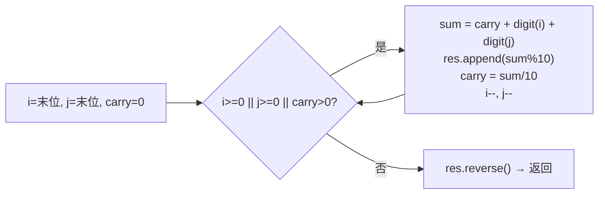

# P004 字符串相加

> LeetCode 415 · ⭐ · 大数模拟加法 · 进位双指针

## 01. 题目描述

给定两个非负整数字符串 `num1` 和 `num2`，返回它们的和（字符串），**不能使用 BigInteger**。

```
输入：num1 = "11", num2 = "123"
输出："134"

输入：num1 = "456", num2 = "77"
输出："533"
```

| 约束 | 值 |
|:---|:---|
| 长度 | `1 ≤ len ≤ 10⁴` |
| 内容 | 仅含 `'0'~'9'`，无前导零 |

## 02. 题目分析

### 2.1 核心公式

模拟竖式加法：从最低位开始，逐位相加，`carry` 进位。

```
   num1[i]  (当前位，无则 0)
 + num2[j]  (当前位，无则 0)
 + carry    (来自上一位)
───────────
   sum      → 当前位 = sum % 10，进位 = sum / 10
```

### 2.2 从右向左的流程



### 2.3 手推演示

以 `"456" + "77"` 为例：

| 步 | i | j | a[i] | b[j] | carry(上) | sum | 当前位 | carry(新) | res |
|:---:|:---:|:---:|:---:|:---:|:---:|:---:|:---:|:---:|:---:|
| 1 | 2 | 1 | 6 | 7 | 0 | 13 | 3 | 1 | "3" |
| 2 | 1 | 0 | 5 | 7 | 1 | 13 | 3 | 1 | "33" |
| 3 | 0 | -1 | 4 | 0 | 1 | 5 | 5 | 0 | "335" |
| 4 | -1 | -1 | 0 | 0 | 0 | 0 | — | — | 结束 |

反转后：`"335"` → `"533"` ✅

## 03. 解法一：双指针 + 进位模拟

### Java

```java
public String addStrings(String a, String b) {
    StringBuilder sb = new StringBuilder();
    int i = a.length() - 1, j = b.length() - 1, carry = 0;

    while (i >= 0 || j >= 0 || carry > 0) {
        int sum = carry;
        if (i >= 0) sum += a.charAt(i--) - '0';
        if (j >= 0) sum += b.charAt(j--) - '0';
        sb.append(sum % 10);
        carry = sum / 10;
    }
    return sb.reverse().toString();
}
```

### Python

```python
def addStrings(self, a: str, b: str) -> str:
    i, j, carry, res = len(a) - 1, len(b) - 1, 0, []

    while i >= 0 or j >= 0 or carry:
        s = carry
        if i >= 0:
            s += ord(a[i]) - 48
            i -= 1
        if j >= 0:
            s += ord(b[j]) - 48
            j -= 1
        res.append(str(s % 10))
        carry = s // 10

    return ''.join(reversed(res))
```

### C++

```cpp
string addStrings(string a, string b) {
    int i = a.size() - 1, j = b.size() - 1, carry = 0;
    string res;

    while (i >= 0 || j >= 0 || carry) {
        int sum = carry;
        if (i >= 0) sum += a[i--] - '0';
        if (j >= 0) sum += b[j--] - '0';
        res += (sum % 10) + '0';
        carry = sum / 10;
    }
    reverse(res.begin(), res.end());
    return res;
}
```

## 04. 复杂度与总结

| 指标 | 值 |
|:---|:---|
| 时间 | O(max(m, n)) |
| 空间 | O(max(m, n))，结果字符串 |

**本质**：大数运算的核心模板。掌握这个，字符串相乘（A019）、链表两数相加（B013）都迎刃而解。

| 相关题 | 联系 |
|------|------|
| [A019 字符串相乘](../07.数组算法题/019-A-字符串相乘.md) | 多了一层累加，依然竖式模拟 |
| [B013 两数相加](../08.链表算法题/013-B-两数相加.md) | 链表版大数加法 |
| [P001 整数反转](201.整数反转.md) | 都有"逐位+进位"思想 |
