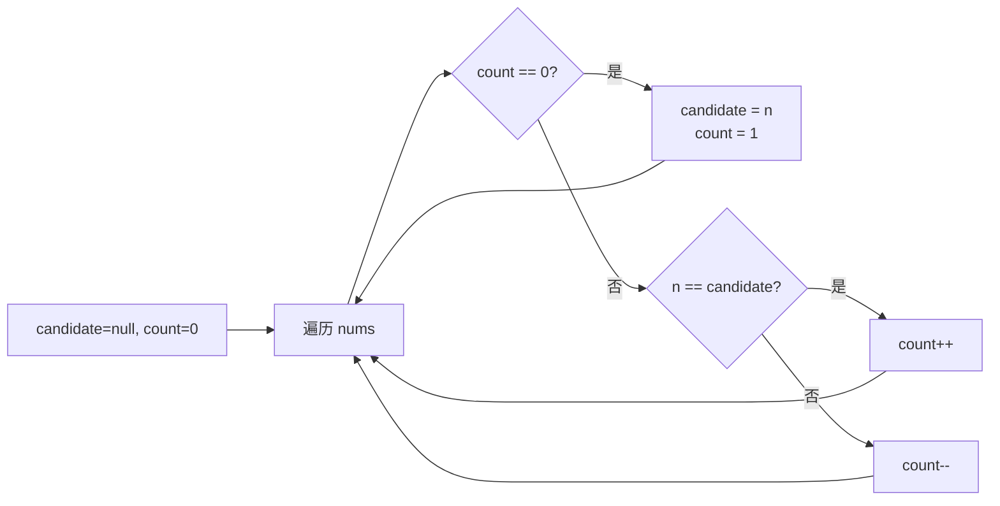

# P005 多数元素

> LeetCode 169 · ⭐ · Boyer-Moore 投票算法

## 01. 题目描述

给定大小为 `n` 的数组，找出**出现次数超过 ⌊n/2⌋** 的多数元素。题目保证多数元素一定存在。

```
输入：[3, 2, 3]       → 3
输入：[2, 2, 1, 1, 1, 2, 2] → 2
```

| 约束 | 值 |
|:---|:---|
| n | `1 ≤ n ≤ 5×10⁴` |
| 元素范围 | `-10⁹ ≤ nums[i] ≤ 10⁹` |
| 保证 | 多数元素一定存在（> n/2） |

## 02. 题目分析

### 2.1 三种思路对比

| 解法 | 时间 | 空间 | 思路 |
|------|:---:|:---:|------|
| 哈希计数 | O(N) | O(N) | 统计频率，找最大 |
| 排序取中 | O(NlogN) | O(1) | 中位数一定是多数元素 |
| **Boyer-Moore** | O(N) | O(1) | 不同元素两两抵消 |

### 2.2 Boyer-Moore 核心思想

如果多数元素数量 > n/2，那么用多数元素去"消灭"其他元素后，必然还有剩余。



## 03. 手推验证

以 `nums = [2,2,1,1,1,2,2]` 为例：

| 步 | n | count | candidate | 操作 | 说明 |
|:---:|:---:|:---:|:---:|:---:|------|
| 初始 | — | 0 | — | — | — |
| 1 | 2 | 1 | 2 | count==0→设候选 | 2 成为候选 |
| 2 | 2 | 2 | 2 | n==candidate→count++ | 2 又一票 |
| 3 | 1 | 1 | 2 | n≠candidate→count-- | 1 抵消一票 |
| 4 | 1 | 0 | 2 | n≠candidate→count-- | 1 再抵消，count=0 |
| 5 | 1 | 1 | 1 | count==0→设候选 | 1 成为新候选 |
| 6 | 2 | 0 | 1 | n≠candidate→count-- | 2 抵消一票，count=0 |
| 7 | 2 | 1 | 2 | count==0→设候选 | 2 重新成为候选 |

最终 `candidate = 2`，确实是多数元素 ✅。

**为什么正确？** 因为多数元素数量 > n/2，假设有 m 个多数和 k 个少数，m > k。少数最多消灭 k 个多数，剩余 m-k > 0 个多数必定存活。

## 04. 解法一：Boyer-Moore 投票

### Java

```java
public int majorityElement(int[] nums) {
    int candidate = 0, count = 0;
    for (int n : nums) {
        if (count == 0) {
            candidate = n;
        }
        count += (n == candidate) ? 1 : -1;
    }
    return candidate;
}
```

### Python

```python
def majorityElement(self, nums: List[int]) -> int:
    candidate = count = 0
    for n in nums:
        if count == 0:
            candidate = n
        count += 1 if n == candidate else -1
    return candidate
```

### C++

```cpp
int majorityElement(vector<int>& nums) {
    int candidate = 0, count = 0;
    for (int n : nums) {
        if (count == 0) candidate = n;
        count += (n == candidate) ? 1 : -1;
    }
    return candidate;
}
```

## 05. 解法二：分治法

对于不完全确定多数元素是否存在的场景，可用分治：

```java
private int majorityRec(int[] nums, int l, int r) {
    if (l == r) return nums[l];
    int m = l + (r - l) / 2;
    int left = majorityRec(nums, l, m);
    int right = majorityRec(nums, m + 1, r);
    if (left == right) return left;
    int lcnt = count(nums, l, r, left), rcnt = count(nums, l, r, right);
    return lcnt > rcnt ? left : right;
}
```

## 06. 题型扩展

### Boyer-Moore 泛化：求出现次数 > ⌊n/3⌋ 的元素

LeetCode 229：最多 2 个候选，同时维护 `c1,c2,cnt1,cnt2`：

```java
public List<Integer> majorityElement229(int[] nums) {
    int c1 = 0, c2 = 0, cnt1 = 0, cnt2 = 0;
    for (int n : nums) {
        if (n == c1) cnt1++;
        else if (n == c2) cnt2++;
        else if (cnt1 == 0) { c1 = n; cnt1 = 1; }
        else if (cnt2 == 0) { c2 = n; cnt2 = 1; }
        else { cnt1--; cnt2--; }
    }
    // 第二遍验证
    cnt1 = cnt2 = 0;
    for (int n : nums) {
        if (n == c1) cnt1++;
        else if (n == c2) cnt2++;
    }
    List<Integer> res = new ArrayList<>();
    if (cnt1 > nums.length / 3) res.add(c1);
    if (cnt2 > nums.length / 3) res.add(c2);
    return res;
}
```

## 07. 复杂度与总结

| 解法 | 时间 | 空间 |
|------|:---:|:---:|
| 哈希 | O(N) | O(N) |
| 排序取中 | O(NlogN) | O(1) |
| **Boyer-Moore** | O(N) | O(1) |

**本质**：多数元素的"数量优势"让它可以存活到最后。"不同元素互相抵消"是数学定理，不是直觉。

---

**相关**：[P006 前缀积](206.除自身以外数组的乘积.md) · [O005 位运算次数统计](../21.位运算算法题/195.位1的个数.md)
