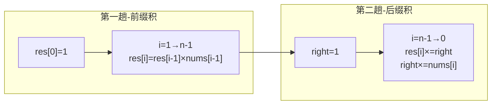

# P006 除自身以外数组的乘积

> LeetCode 238 · ⭐⭐ · 前缀积 + 后缀积 · 空间 O(1)

## 01. 题目描述

给定整数数组 `nums`，返回数组 `answer`，其中 `answer[i]` = `nums` 中除 `nums[i]` 外全部元素的乘积。**不能使用除法**，时间复杂度 O(N)。

```
输入：[1, 2, 3, 4]
输出：[24, 12, 8, 6]
解释：24=2×3×4, 12=1×3×4, 8=1×2×4, 6=1×2×3
```

| 约束 | 值 |
|:---|:---|
| n | `2 ≤ n ≤ 10⁵` |
| 乘积 | 保证 32 位 |
| 禁止 | 除法运算 |
| 要求 | O(N) 时间 |

## 02. 题目分析

### 2.1 核心公式

`answer[i] = (nums[0]×...×nums[i-1]) × (nums[i+1]×...×nums[n-1])`

即 **左侧乘积 × 右侧乘积**。

### 2.2 两趟遍历流程



### 2.3 手推演示

以 `nums = [1, 2, 3, 4]` 为例：

**第一趟（前缀积）**：

| i | 公式 | res[i] |
|:---:|------|:---:|
| 0 | — | 1 |
| 1 | res[0]×nums[0] = 1×1 | 1 |
| 2 | res[1]×nums[1] = 1×2 | 2 |
| 3 | res[2]×nums[2] = 2×3 | 6 |

此时 `res = [1, 1, 2, 6]`，分别存了左侧积（相当于 `[×, 1, 1×2, 1×2×3]`）。

**第二趟（后缀积）**，`right` 从右往左累计：

| i | right | res[i] ×= right | right ×= nums[i] | res |
|:---:|:---:|:---:|:---:|:---|
| 3 | 1 | 6×1 = **6** | 1×4 = 4 | [1,1,2,**6**] |
| 2 | 4 | 2×4 = **8** | 4×3 = 12 | [1,1,**8**,6] |
| 1 | 12 | 1×12 = **12** | 12×2 = 24 | [1,**12**,8,6] |
| 0 | 24 | 1×24 = **24** | 24×1 = 24 | [**24**,12,8,6] |

最终 `[24, 12, 8, 6]` ✅

## 03. 解法一：前缀积 + 后缀积（三语）

### Java

```java
public int[] productExceptSelf(int[] nums) {
    int n = nums.length;
    int[] res = new int[n];

    // 第一趟：前缀积
    res[0] = 1;
    for (int i = 1; i < n; i++) {
        res[i] = res[i - 1] * nums[i - 1];
    }

    // 第二趟：后缀积
    int right = 1;
    for (int i = n - 1; i >= 0; i--) {
        res[i] *= right;
        right *= nums[i];
    }
    return res;
}
```

### Python

```python
def productExceptSelf(self, nums: List[int]) -> List[int]:
    n = len(nums)
    res = [1] * n

    # 第一趟：前缀积
    for i in range(1, n):
        res[i] = res[i - 1] * nums[i - 1]

    # 第二趟：后缀积
    right = 1
    for i in range(n - 1, -1, -1):
        res[i] *= right
        right *= nums[i]
    return res
```

### C++

```cpp
vector<int> productExceptSelf(vector<int>& nums) {
    int n = nums.size();
    vector<int> res(n, 1);

    // 第一趟：前缀积
    for (int i = 1; i < n; i++)
        res[i] = res[i - 1] * nums[i - 1];

    // 第二趟：后缀积
    int right = 1;
    for (int i = n - 1; i >= 0; i--) {
        res[i] *= right;
        right *= nums[i];
    }
    return res;
}
```

## 04. 前缀积思想扩展

`前缀和` / `前缀积` / `前缀异或` 是同一个模板：

```java
// 前缀和
prefix[i] = prefix[i-1] + nums[i]
// 前缀积
prefix[i] = prefix[i-1] * nums[i]
// 前缀异或
prefix[i] = prefix[i-1] ^ nums[i]
```

| 相关题 | 变体 |
|------|------|
| A014 和为K的子数组 | 前缀和 + 哈希 |
| E016 路径总和III | 树上前缀和 |
| O001 只出现一次的数字 | 异或的前缀思想 |

## 05. 复杂度与总结

| 指标 | 值 |
|:---|:---|
| 时间 | O(N)，两趟遍历 |
| 空间 | O(1)，输出数组不计 |

**本质**：左右分治的思想——无法直接"除 self"，就拆成"左侧 × 右侧"。两趟扫描分别积累一个方向的乘积。

---

**相关**：[P005 多数元素](205.多数元素.md) · [P007 下一个排列](207.下一个排列.md)
