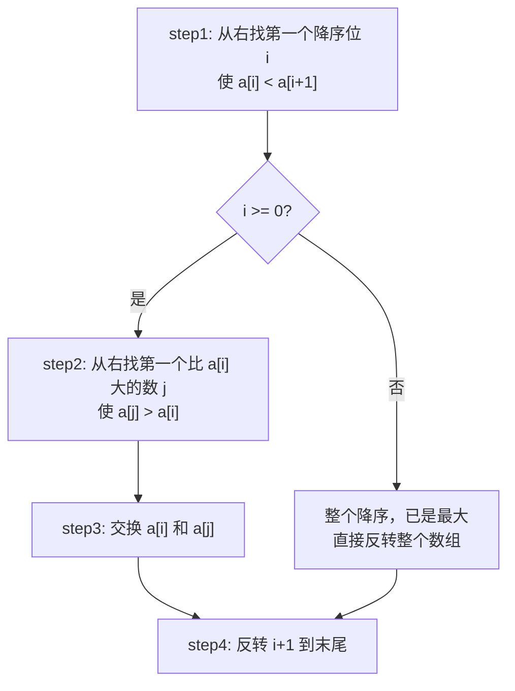

# P007 下一个排列

> LeetCode 31 · ⭐⭐ · 字典序 · 原地操作

## 01. 题目描述

将数组原地重排为字典序中的**下一个更大的排列**。若已是最大排列，则返回最小排列。

```
输入：[1, 2, 3] → [1, 3, 2]
输入：[3, 2, 1] → [1, 2, 3]  （已是最大，返回最小）
输入：[1, 1, 5] → [1, 5, 1]
```

## 02. 题目分析

### 2.1 四步法



### 2.2 手推验证

以 `[1, 2, 3, 0, 2, 1]` 为例：

| 步骤 | 数组 | 说明 |
|:---:|------|------|
| 初始 | `[1, 2, 3, 0, 2, 1]` | — |
| **step1** | 从右找满足 `a[i] < a[i+1]` 的 i | i=3：`a[3]=0 < a[4]=2` ✅ |
| 标记 | `[1, 2, 3, [0], 2, 1]` | i=3 |
| **step2** | 从右找 `a[j] > a[3]=0` | j=5：a[5]=1>0 × → j=4：a[4]=2>0 ✅ |
| **step3** | 交换 i,j | `[1, 2, 3, 2, 0, 1]` |
| **step4** | 反转 i+1 到末尾 | `[:4]` 不变 + `reverse([0,1])` = `[1,0]` → `[1, 2, 3, 2, 1, 0]` |

最终 `[1, 2, 3, 2, 1, 0]` ✅

## 03. 解法一：四步法（三语）

### Java

```java
public void nextPermutation(int[] nums) {
    int n = nums.length;

    // step1: 找第一个降序位 i
    int i = n - 2;
    while (i >= 0 && nums[i] >= nums[i + 1]) i--;

    if (i >= 0) {
        // step2: 找右边比 a[i] 大的最小数 j
        int j = n - 1;
        while (nums[j] <= nums[i]) j--;
        // step3: 交换
        swap(nums, i, j);
    }

    // step4: 反转 i+1 到末尾
    reverse(nums, i + 1, n - 1);
}

private void swap(int[] a, int i, int j) {
    int t = a[i]; a[i] = a[j]; a[j] = t;
}

private void reverse(int[] a, int l, int r) {
    while (l < r) swap(a, l++, r--);
}
```

### Python

```python
def nextPermutation(self, nums: List[int]) -> None:
    n = len(nums)

    # step1
    i = n - 2
    while i >= 0 and nums[i] >= nums[i + 1]:
        i -= 1

    if i >= 0:
        # step2
        j = n - 1
        while nums[j] <= nums[i]:
            j -= 1
        # step3
        nums[i], nums[j] = nums[j], nums[i]

    # step4
    nums[i + 1:] = reversed(nums[i + 1:])
```

### C++

```cpp
void nextPermutation(vector<int>& nums) {
    int n = nums.size(), i = n - 2;
    while (i >= 0 && nums[i] >= nums[i + 1]) i--;

    if (i >= 0) {
        int j = n - 1;
        while (nums[j] <= nums[i]) j--;
        swap(nums[i], nums[j]);
    }
    reverse(nums.begin() + i + 1, nums.end());
}
```

## 04. 为什么四步法正确？

- **step1**：右侧降序说明已达"最大子排列"，需要从前面的位置（i）增大
- **step2**：选比 a[i] 大的最小数 j，保证增量最小（下一个）
- **step3**：交换后 i 位置变大
- **step4**：i 右侧变为升序（最小排列），整体取最小增量

## 05. 复杂度与总结

| 指标 | 值 |
|:---|:---|
| 时间 | O(N)，最多扫描两次 |
| 空间 | O(1)，原地 |

**本质**：字典序不是随机的——它在字典中按"升序"排列。下一个排列 = 在某个位置"进位"，然后让后面的部分变为最小。

| 相关题 | 联系 |
|------|------|
| [M001 全排列](全排列.md) | 回溯生成所有排列 |
| [P005 多数元素](205.多数元素.md) | 数学思维 |
