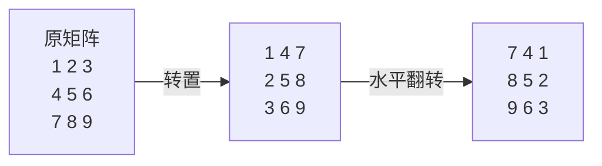

# P008 旋转图像

> LeetCode 48 · ⭐⭐ · 矩阵变换 · 转置 + 水平翻转

## 01. 题目描述

将 n×n 矩阵**原地顺时针旋转 90°**。

```
输入：[[1,2,3],[4,5,6],[7,8,9]]
输出：[[7,4,1],[8,5,2],[9,6,3]]
```

## 02. 题目分析

### 2.1 分解为两步

顺时针 90° = **转置** + **水平翻转**（每行反转）。



验证：`(i,j) → (j,i) → (j, n-1-i)` = 顺时针 90° 的目标位置。

### 2.2 旋转方向的数学推导

| 操作 | 公式 | 物理含义 |
|------|------|------|
| 转置 | `(i,j) → (j,i)` | 沿主对角线对折 |
| 水平翻转 | `(i,j) → (i, n-1-j)` | 沿垂直中线镜像 |
| **顺时针90°** | `(i,j) → (j, n-1-i)` | 转置 + 水平翻转 |
| 逆时针90° | `(i,j) → (n-1-j, i)` | 转置 + 垂直翻转 |

## 03. 手推演示

以 4×4 为例：

```
原矩阵：
[ 1  2  3  4]
[ 5  6  7  8]
[ 9 10 11 12]
[13 14 15 16]

转置后（对角线对折）：
[ 1  5  9 13]
[ 2  6 10 14]
[ 3  7 11 15]
[ 4  8 12 16]

水平翻转后（顺时针90°）：
[13  9  5  1]
[14 10  6  2]
[15 11  7  3]
[16 12  8  4]
```

## 04. 解法一：转置 + 水平翻转（三语）

### Java

```java
public void rotate(int[][] matrix) {
    int n = matrix.length;

    // 转置：j 从 i+1 开始，只交换上半三角
    for (int i = 0; i < n; i++) {
        for (int j = i + 1; j < n; j++) {
            int tmp = matrix[i][j];
            matrix[i][j] = matrix[j][i];
            matrix[j][i] = tmp;
        }
    }

    // 水平翻转：每行只交换前 n/2 列
    for (int i = 0; i < n; i++) {
        for (int j = 0; j < n / 2; j++) {
            int tmp = matrix[i][j];
            matrix[i][j] = matrix[i][n - 1 - j];
            matrix[i][n - 1 - j] = tmp;
        }
    }
}
```

### Python

```python
def rotate(self, matrix: List[List[int]]) -> None:
    n = len(matrix)

    # 转置
    for i in range(n):
        for j in range(i + 1, n):
            matrix[i][j], matrix[j][i] = matrix[j][i], matrix[i][j]

    # 水平翻转
    for i in range(n):
        matrix[i].reverse()
```

### C++

```cpp
void rotate(vector<vector<int>>& m) {
    int n = m.size();

    for (int i = 0; i < n; i++)
        for (int j = i + 1; j < n; j++)
            swap(m[i][j], m[j][i]);

    for (int i = 0; i < n; i++)
        reverse(m[i].begin(), m[i].end());
}
```

## 05. 解法二：一次性旋转（四数轮换）

也可以不分解，直接旋转四个角——每次处理一圈：

```java
public void rotate(int[][] m) {
    int n = m.length;
    for (int i = 0; i < n / 2; i++) {
        for (int j = i; j < n - 1 - i; j++) {
            int tmp = m[i][j];
            m[i][j] = m[n - 1 - j][i];
            m[n - 1 - j][i] = m[n - 1 - i][n - 1 - j];
            m[n - 1 - i][n - 1 - j] = m[j][n - 1 - i];
            m[j][n - 1 - i] = tmp;
        }
    }
}
```

但两步法更直观、更易记。

## 06. 复杂度与总结

| 指标 | 值 |
|:---|:---|
| 时间 | O(N²) |
| 空间 | O(1)，原地 |

**本质**：矩阵旋转不是"换个视角看"——而是两个原子操作（转置 + 翻转）的复合。

| 所有旋转 | 公式 | 操作 |
|------|------|------|
| 顺时针 90° | `(j, n-1-i)` | 转置 + 水平翻转 |
| 逆时针 90° | `(n-1-j, i)` | 转置 + 垂直翻转 |
| 180° | `(n-1-i, n-1-j)` | 水平 + 垂直翻转 |

---

**相关**：[P009 螺旋矩阵](209.螺旋矩阵.md) · [P010 搜索二维矩阵II](210.搜索二维矩阵II.md)
