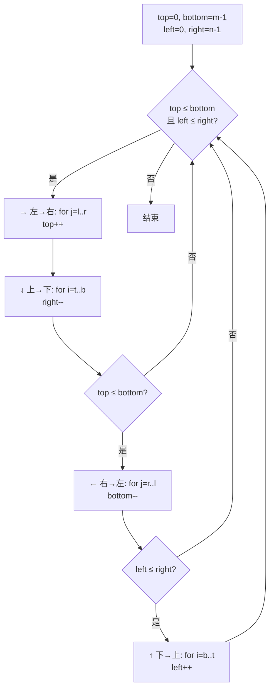

# P009 螺旋矩阵

> LeetCode 54 · ⭐⭐ · 四边界法 · 边界控制

## 01. 题目描述

按**顺时针螺旋顺序**返回 m×n 矩阵的所有元素。

```
输入：[[1,2,3],[4,5,6],[7,8,9]]
输出：[1,2,3,6,9,8,7,4,5]

输入：[[1,2,3,4],[5,6,7,8],[9,10,11,12]]
输出：[1,2,3,4,8,12,11,10,9,5,6,7]
```

## 02. 题目分析

### 2.1 核心公式

维护四个边界 `top, bottom, left, right`。每走完一条边就向中心缩进一步。



### 2.2 关键陷阱：单行/单列处理

中间的两条边（← 和 ↑）需要 `if` 判边界，防止重复遍历。

**为什么需要 if？** 当只剩一行/列时，→ 和 ← 会遍历同一行。

以 `[[1,2,3,4]]` 为例：
- `→` 遍历 `[1,2,3,4]`，top++, top > bottom
- `↓` 跳过（top > bottom）
- `←` 需要 `if(top≤bottom)` 判否 → **跳过** ✅

## 03. 手推演示

以 `[[1,2,3],[4,5,6],[7,8,9]]` 为例：

| 步 | 方向 | 区间 | 输出 | 边界收缩 | t:b:l:r |
|:---:|:---:|------|------|------|:---:|
| 0 | — | — | [] | — | 0:2:0:2 |
| 1 | → | l→r | [1,2,3] | t++ | 1:2:0:2 |
| 2 | ↓ | t→b | [1,2,3,6,9] | r-- | 1:2:0:1 |
| 3 | ← | r→l | [1,2,3,6,9,8,7] | b-- | 1:1:0:1 |
| 4 | ↑(判) | b→t | [1,2,3,6,9,8,7,4] | l++ | 1:1:1:1 |
| 5 | →(判) | l→r | [1,2,3,6,9,8,7,4,5] | — | 2:1:1:1 |

最终 `[1,2,3,6,9,8,7,4,5]` ✅

## 04. 解法一：四边界收缩（三语）

### Java

```java
public List<Integer> spiralOrder(int[][] matrix) {
    List<Integer> res = new ArrayList<>();
    int top = 0, bottom = matrix.length - 1;
    int left = 0, right = matrix[0].length - 1;

    while (top <= bottom && left <= right) {
        // → 左到右
        for (int j = left; j <= right; j++) res.add(matrix[top][j]);
        top++;

        // ↓ 上到下
        for (int i = top; i <= bottom; i++) res.add(matrix[i][right]);
        right--;

        // ← 右到左（判边界）
        if (top <= bottom) {
            for (int j = right; j >= left; j--) res.add(matrix[bottom][j]);
            bottom--;
        }

        // ↑ 下到上（判边界）
        if (left <= right) {
            for (int i = bottom; i >= top; i--) res.add(matrix[i][left]);
            left++;
        }
    }
    return res;
}
```

### Python

```python
def spiralOrder(self, matrix: List[List[int]]) -> List[int]:
    res = []
    top, bottom = 0, len(matrix) - 1
    left, right = 0, len(matrix[0]) - 1

    while top <= bottom and left <= right:
        # → 左到右
        for j in range(left, right + 1):
            res.append(matrix[top][j])
        top += 1

        # ↓ 上到下
        for i in range(top, bottom + 1):
            res.append(matrix[i][right])
        right -= 1

        # ← 右到左
        if top <= bottom:
            for j in range(right, left - 1, -1):
                res.append(matrix[bottom][j])
            bottom -= 1

        # ↑ 下到上
        if left <= right:
            for i in range(bottom, top - 1, -1):
                res.append(matrix[i][left])
            left += 1

    return res
```

### C++

```cpp
vector<int> spiralOrder(vector<vector<int>>& m) {
    vector<int> res;
    int t = 0, b = m.size() - 1, l = 0, r = m[0].size() - 1;

    while (t <= b && l <= r) {
        for (int j = l; j <= r; j++) res.push_back(m[t][j]);
        t++;
        for (int i = t; i <= b; i++) res.push_back(m[i][r]);
        r--;
        if (t <= b) {
            for (int j = r; j >= l; j--) res.push_back(m[b][j]);
            b--;
        }
        if (l <= r) {
            for (int i = b; i >= t; i--) res.push_back(m[i][l]);
            l++;
        }
    }
    return res;
}
```

## 05. 复杂度与总结

| 指标 | 值 |
|:---|:---|
| 时间 | O(m×n) |
| 空间 | O(1)，输出不计 |

**本质**：螺旋遍历 = 四个方向的边界逐渐向中心收缩。"判边界 if"是关键，防止单行/列重复。

**相关**：[P008 旋转图像](208.旋转图像.md) · [P010 搜索二维矩阵II](210.搜索二维矩阵II.md) · 螺旋矩阵 II（生成版，LeetCode 59）
