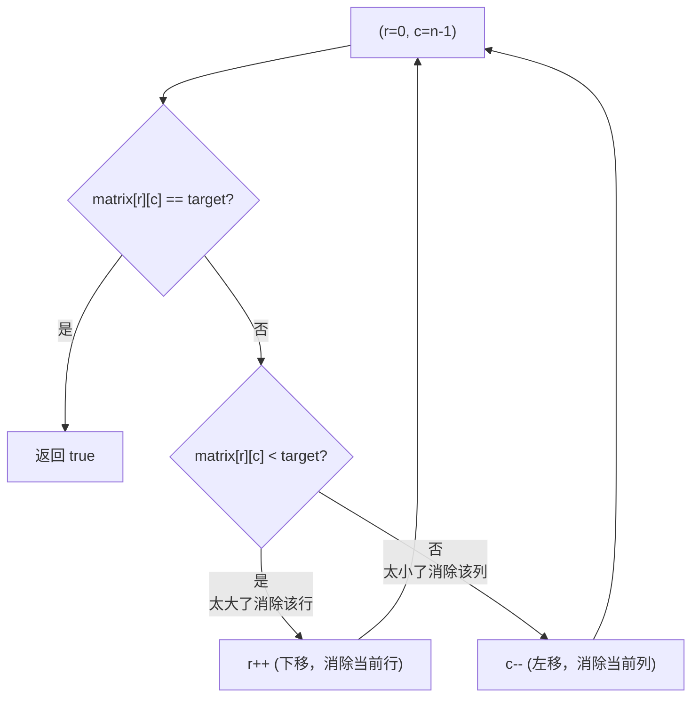

# P010 搜索二维矩阵 II

> LeetCode 240 · ⭐⭐ · Z字形搜索 · O(m+n)

## 01. 题目描述

在一个 m×n 矩阵中搜索 target。**每行升序、每列升序**。

```
输入：
[[1,  4,  7,  11, 15],
 [2,  5,  8,  12, 19],
 [3,  6,  9,  16, 22],
 [10, 13, 14, 17, 24],
 [18, 21, 23, 26, 30]]
target = 5 → true
target = 20 → false
```

## 02. 题目分析

### 2.1 为什么从右上角开始？

右上角 `matrix[0][n-1]` 是**一个天然的决策点**：
- 它所在行的左侧全部 < 它
- 它所在列的下方全部 > 它



### 2.2 手推演示

以搜索 `target = 5`：

| 步 | r | c | 当前值 | 比较 | 操作 | 消除 |
|:---:|:---:|:---:|:---:|:---:|:---:|------|
| 1 | 0 | 4 | 15 | 15 > 5 | c-- | 第 4 列 |
| 2 | 0 | 3 | 11 | 11 > 5 | c-- | 第 3 列 |
| 3 | 0 | 2 | 7 | 7 > 5 | c-- | 第 2 列 |
| 4 | 0 | 1 | 4 | 4 < 5 | r++ | 第 0 行 |
| 5 | 1 | 1 | 5 | **5 == 5** | — | **找到！** |

以搜索 `target = 20`：

| 步 | r | c | 当前值 | 比较 | 操作 |
|:---:|:---:|:---:|:---:|:---:|:---:|
| 1 | 0 | 4 | 15 | 15 < 20 | r++ |
| 2 | 1 | 4 | 19 | 19 < 20 | r++ |
| 3 | 2 | 4 | 22 | 22 > 20 | c-- |
| 4 | 2 | 3 | 16 | 16 < 20 | r++ |
| 5 | 3 | 3 | 17 | 17 < 20 | r++ |
| 6 | 4 | 3 | 26 | 26 > 20 | c-- |
| 7 | 4 | 2 | 23 | 23 > 20 | c-- |
| 8 | 4 | 1 | 21 | 21 > 20 | c-- |
| 9 | 4 | 0 | 18 | 18 < 20 | r++ |

r=5 越界 → false。

每次比较消除**一整行或一整列**，最多 m+n 步。

## 03. 解法一：右上角 Z 字搜索（三语）

### Java

```java
public boolean searchMatrix(int[][] matrix, int target) {
    int r = 0, c = matrix[0].length - 1;

    while (r < matrix.length && c >= 0) {
        int cur = matrix[r][c];
        if (cur == target) return true;
        if (cur < target) r++;   // 当前行太小 → 下移
        else               c--;  // 当前列太大 → 左移
    }
    return false;
}
```

### Python

```python
def searchMatrix(self, matrix: List[List[int]], target: int) -> bool:
    r, c = 0, len(matrix[0]) - 1

    while r < len(matrix) and c >= 0:
        cur = matrix[r][c]
        if cur == target:
            return True
        if cur < target:
            r += 1
        else:
            c -= 1
    return False
```

### C++

```cpp
bool searchMatrix(vector<vector<int>>& m, int target) {
    int r = 0, c = m[0].size() - 1;

    while (r < m.size() && c >= 0) {
        int cur = m[r][c];
        if (cur == target) return true;
        if (cur < target) r++;
        else              c--;
    }
    return false;
}
```

## 04. 解法对比

| 解法 | 时间 | 空间 | 说明 |
|------|:---:|:---:|------|
| 暴力搜索 | O(mn) | O(1) | 无视行列有序条件 |
| 逐行二分 | O(mlogn) | O(1) | 有序条件用了一半 |
| **Z字搜索** | **O(m+n)** | O(1) | 充分利用行列有序 |

### 为什么 O(m+n) 是最优？

每次比较消除一行或一列，共 m 行 + n 列需要消除，所以最坏 m+n 步。

## 05. 复杂度与总结

| 指标 | 值 |
|:---|:---|
| 时间 | O(m+n) |
| 空间 | O(1) |

**本质**：不要"搜索整个二维空间"——利用每个位置作为"剪枝锚点"。右上角的特殊地位可以同时回答"该往左还是往下"的问题。

| 矩阵搜索题型 | 解法 | 条件 |
|------|------|------|
| 全局升序 + 行首>行尾 | 全局二分 O(log(mn)) | LeetCode 74 |
| 行列各自升序 | **Z字搜索 O(m+n)** | LeetCode 240 |
| 无特殊条件 | 暴力 O(mn) | — |

---

**相关**：[P008 旋转图像](208.旋转图像.md) · [P009 螺旋矩阵](209.螺旋矩阵.md) · [E013 验证二叉搜索树](../11.二叉树算法题/078.验证二叉搜索树.md)
