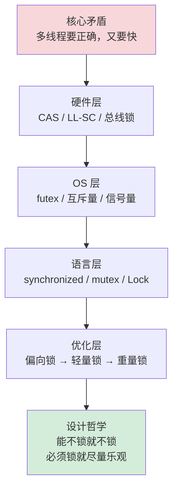
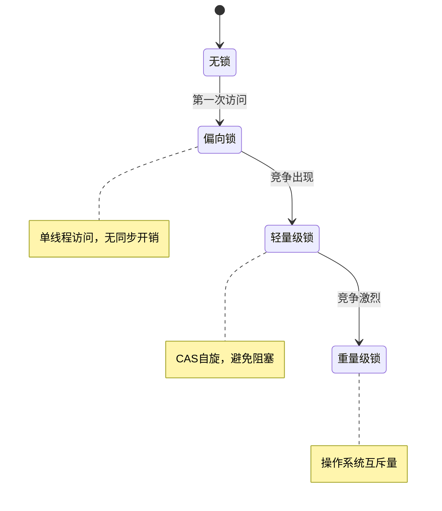
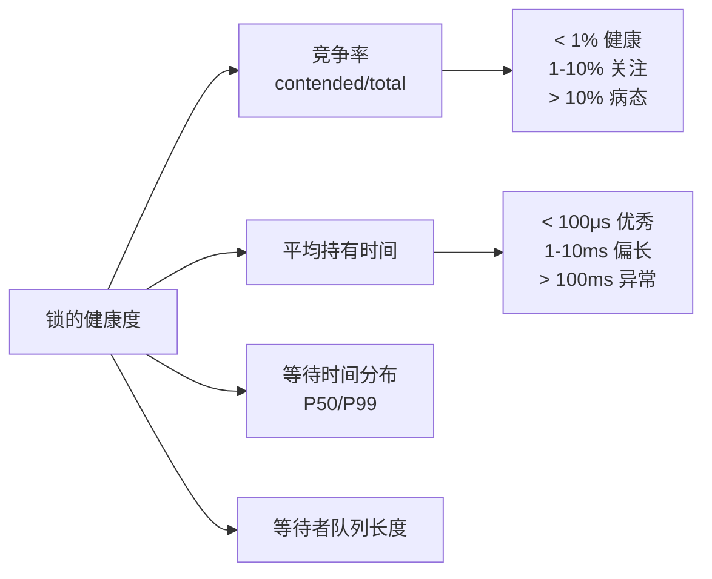
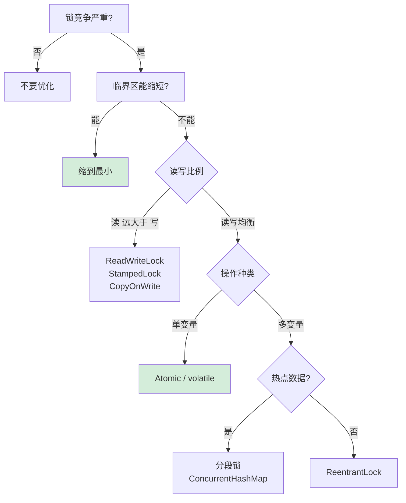

# 18.锁核心设计和思想

> 📍 **本篇位置**：第 3 卷 · 并发之道 · 第 8 篇
> 🎯 **核心矛盾**：**并发安全 vs 性能** —— 互斥保护数据正确，但每一次"等"都是吞吐的敌人
> 🧭 **设计灵魂**：锁不是一个东西，而是一个**层叠的栈**——硬件原子指令 → OS 互斥量 → 语言层抽象 → 优化升级
> 🌐 **跨语言覆盖**：Java(synchronized / ReentrantLock) · C++(std::mutex / atomic) · Go(sync.Mutex) · Pthread(POSIX)
> 🔗 **延伸阅读**：← [17.并发编程安全设计](./17.并发编程安全设计.md) · → [19.并发上下文切换原理](./19.并发上下文切换原理.md) · → [20.理解CAS设计由来](./20.理解CAS设计由来.md)



---

#### 目录介绍
- [1.锁基础概念](#1锁基础概念)
  - [1.1 锁的作用](#11-锁的作用)
  - [1.2 为何需要锁](#12-为何需要锁)
  - [1.3 核心思想](#13-核心思想)
  - [1.4 锁的理解](#14-锁的理解)
- [2.锁类型分类](#2锁类型分类)
  - [2.1 按策略分类](#21-按策略分类)
  - [2.2 按独占分类](#22-按独占分类)
  - [2.3 按实现分类](#23-按实现分类)
  - [2.4 按重入分类](#24-按重入分类)
  - [2.5 按公平分类](#25-按公平分类)
  - [2.6 Java特有锁](#26-java特有锁)
  - [2.7 按粒度分类](#27-按粒度分类)
  - [2.8 按功能分类](#28-按功能分类)
- [3.锁核心逻辑](#3锁核心逻辑)
  - [3.1 解决原子性](#31-解决原子性)
  - [3.2 解决可见性](#32-解决可见性)
  - [3.3 等待策略](#33-等待策略)
- [4.锁底层原理](#4锁底层原理)
  - [4.1 硬件原子指令](#41-硬件原子指令)
  - [4.2 内存可见性](#42-内存可见性)
  - [4.3 操作系统锁](#43-操作系统锁)
  - [4.4 锁慢物理根源](#44-锁慢物理根源)
  - [4.5 锁原理总结](#45-锁原理总结)
- [5.锁架构设计](#5锁架构设计)
  - [5.1 锁设计问题](#51-锁设计问题)
  - [5.2 锁分层架构](#52-锁分层架构)
  - [5.3 编译期消除](#53-编译期消除)
  - [5.4 偏向优化](#54-偏向优化)
  - [5.5 用户态快路径](#55-用户态快路径)
  - [5.6 自适应自旋](#56-自适应自旋)
  - [5.7 内核态阻塞](#57-内核态阻塞)
  - [5.8 唤醒策略](#58-唤醒策略)
  - [5.9 锁粒度设计](#59-锁粒度设计)


## 1.锁基础概念

### 1.1 锁的作用

当满足以下三个条件时，**数据竞争（Data Race）** 必然出现：

1. **共享**：多个执行体（线程/进程/CPU核）访问同一块内存
2. **可变**：至少有一个执行体在写
3. **无序**：访问之间没有 happens-before 关系

**锁** 是用于多线程编程的同步机制，用于保护共享资源，避免数据竞争和并发访问导致的问题。提供了多种锁的实现，包括互斥锁、读写锁、条件变量等。

### 1.2 为何需要锁

在多线程环境中，多个线程可能同时访问或修改共享资源（如全局变量、数据结构等）。如果没有同步机制，可能会导致以下问题：

1. **数据竞争**： 多个线程同时修改同一数据，导致数据不一致或程序行为异常。
2. **竞态条件**： 程序的执行结果依赖于线程的执行顺序，导致不可预测的行为。

线程锁通过确保同一时间只有一个线程可以访问共享资源来解决这些问题。

### 1.3 核心思想

锁的核心思想可以用一句话概括：

> **通过序列化对共享资源的访问，将并发问题降维为顺序问题。**

更细化地看：

| 思想层面 | 内容 |
|---------|------|
| 并发控制 | 将并行执行的临界区**串行化**，消除交错执行的不确定性 |
| 资源管理 | 锁是一种**许可证**，持有者可进入临界区，未持有者必须等待 |
| 内存可见性 | 锁的获取/释放隐含**内存屏障**，确保临界区内的修改对后续持有者可见 |
| 抽象封装 | 将底层硬件原子指令封装为高层语义，让程序员不需要关心缓存一致性协议 |

### 1.4 锁的理解

抛开所有编程语言，锁要解决的本质问题只有一个：

> **多个执行体争抢同一资源时，如何保证在任意时刻只有一个执行体在操作该资源。**

这个问题的根源在于**时间**——如果所有操作都是瞬时完成的（零耗时），就不需要锁。正因为操作需要时间，操作过程中就可能被其他执行体打断或交错，产生**中间状态的暴露**。

用最朴素的类比：一间厕所只能一个人用。锁的本质就是**门上的那把锁**——进去的人锁门，其他人在外面等，用完了开门出来，下一个人进去。

但计算机世界比物理世界复杂得多，因为：
1. **"锁门"这个动作本身也不是瞬时的**——可能两个人同时伸手去锁
2. **没有"物理实体"来阻挡**——CPU 只认 0 和 1，没有物理门
3. **观察者效应**——CPU 缓存导致不同核"看到"的内存值不同

所以锁的核心设计原理归结为两个基本问题：

> **问题一：如何实现一个不可分割的"占有"动作（原子性）**
> **问题二：如何让所有参与者看到一致的"占有"状态（可见性）**

## 2.锁类型分类

### 2.1 按策略分类

| 分类 | 核心思想 | 实现 | 适用场景 |
|------|---------|------|---------|
| **悲观锁** | 假设冲突频繁，先加锁再操作 | Mutex、RWLock、synchronized | 写多/冲突频繁 |
| **乐观锁** | 假设冲突罕见，先操作再检测冲突 | CAS、版本号、MVCC | 读多写少/冲突罕见 |

**悲观锁 vs 乐观锁的本质区别**：

- 悲观锁：先获取**独占权**，再修改数据
- 乐观锁：先修改数据，在**提交时验证**是否有冲突，冲突则重试

```
悲观锁：                          乐观锁：
Lock()                           old = Load(data)
  data = modify(data)             new = modify(old)
Unlock()                          if CAS(data, old, new) == false:
                                    retry
```

### 2.2 按独占分类

| 分类 | 并发度 | 实现 |
|------|-------|------|
| **独占锁（Exclusive Lock）** | 同一时刻只有一个持有者 | Mutex、ReentrantLock |
| **共享锁（Shared Lock）** | 允许多个读者同时持有 | RWLock 的读锁 |
| **意向锁（Intention Lock）** | 表示对子资源加锁的意向 | 数据库 IS/IX 锁 |

### 2.3 按实现分类

| 分类 | 等待方式 | 开销 | 适用场景 |
|------|---------|------|---------|
| **自旋锁（Spinlock）** | 忙等（循环 CAS） | CPU 空转，但无上下文切换 | 临界区极短（<1μs），中断上下文 |
| **互斥锁（Mutex）** | 阻塞挂起（futex） | 上下文切换（~1μs），但不浪费 CPU | 临界区较长，通用场景 |
| **混合锁（Adaptive）** | 先自旋后阻塞 | 平衡两者 | 大多数现代实现 |

### 2.4 按重入分类

| 分类 | 行为 | 实现原理 |
|------|------|---------|
| **可重入锁（Reentrant）** | 同一线程可重复获取 | 维护 owner_tid + 递归计数器 |
| **不可重入锁（Non-reentrant）** | 同一线程重复获取会死锁 | 不记录 owner |

```cpp
// 可重入锁伪代码
void reentrant_lock(lock_t *l) {
  if (l->owner == current_thread()) {
    l->count++;  // 递归计数+1
    return;
  }
  // 正常获取锁...
  l->owner = current_thread();
  l->count = 1;
}
```

### 2.5 按公平分类

| 分类 | 行为 | 吞吐量 | 尾延迟 |
|------|------|--------|-------|
| **非公平锁** | 新来的线程直接 CAS 抢锁，失败再排队 | 高（减少上下文切换） | 高（可能饥饿） |
| **公平锁** | 严格 FIFO，新来的必须排队 | 低 | 低（无饥饿） |

**非公平锁为什么吞吐量更高**？
```
公平锁：
  线程A释放 → 唤醒队首线程B → B 从内核态恢复(~1μs) → B获得锁
  这 1μs 锁是空闲的，无人使用

非公平锁：
  线程A释放 → 线程C(刚到)直接CAS抢到 → C 立即执行临界区
  B 被唤醒后发现锁被抢，重新排队
  结果：锁的空闲窗口被 C 利用了
```

### 2.6 Java特有锁

Java `synchronized` 在 JVM 中有**四个级别**的锁升级：

```
                    偏向锁 (Biased Locking)
                       │ 出现第二个线程竞争
                       ▼
                    轻量级锁 (Lightweight / Thin Lock)
                       │ CAS 自旋失败超过阈值
                       ▼
                    重量级锁 (Heavyweight / Fat Lock)
                       │
                       ▼
                    (mutex + 内核态挂起)
```

其流程是：



> 偏向锁（Biased Locking）

**思想**：统计表明大多数锁在整个生命周期中只被**同一个线程**获取。偏向锁消除了这种情况下的所有同步开销。

```
Mark Word (64-bit object header):
┌────────────────────────────────────────────────┐
│ Thread ID (54bit) │ Epoch(2) │ Age(4) │ 1│0│1 │ ← 偏向锁标记
└────────────────────────────────────────────────┘

首次获取：CAS 将 Thread ID 写入 Mark Word
后续获取：只需比较 Thread ID == 当前线程？
  → 是：直接进入，无任何原子操作
  → 否：撤销偏向（Stop-the-World），升级为轻量级锁
```

**JDK 15+ 默认禁用偏向锁**（JEP 374），因为现代应用中单线程锁的场景减少，偏向锁撤销的 STW 开销反而成为负担。

> 轻量级锁

```
线程栈帧中分配 Lock Record:
┌──────────────┐       ┌──────────────┐
│ Lock Record  │       │ Object Header│
│ ┌──────────┐ │       │ ┌──────────┐ │
│ │displaced │ │←─CAS─→│ │Mark Word │ │
│ │mark word │ │       │ │→Lock Rec │ │
│ └──────────┘ │       │ └──────────┘ │
└──────────────┘       └──────────────┘

获取：CAS 将 Mark Word 替换为指向 Lock Record 的指针
释放：CAS 将 displaced mark word 写回

全程用户态 CAS，无系统调用
```

> 重量级锁

轻量级锁 CAS 失败超过阈值后膨胀为重量级锁——分配 `ObjectMonitor` 结构：

```c
struct ObjectMonitor {
  volatile markWord _header;     // 保存原始 Mark Word
  ObjectMonitor* _next;
  volatile Thread* _owner;       // 当前持有者
  volatile int _count;           // 重入计数
  ObjectWaiter* _EntryList;      // 阻塞等待队列
  ObjectWaiter* _WaitSet;        // wait() 等待队列
  volatile int _waiters;
  // ...
};
```

最终通过 `pthread_mutex` + `pthread_cond`（Linux）或 `WaitForSingleObject`（Windows）进入内核态。

### 2.7 按粒度分类

| 粒度 | 示例 | 并发度 | 开销 |
|------|------|-------|------|
| **粗粒度** | 全局一把大锁 | 低 | 简单 |
| **细粒度** | 每个桶一把锁（ConcurrentHashMap） | 高 | 复杂、死锁风险 |
| **分段锁** | 将数据分 N 段，每段一把锁 | 中高 | 中等 |
| **无锁** | CAS + 重试 | 最高 | 编程困难 |

### 2.8 按功能分类

| 类型 | 描述 | 实现 |
|------|------|------|
| **读写锁** | 读共享写独占 | `pthread_rwlock`, `std::shared_mutex` |
| **顺序锁（SeqLock）** | 写者不阻塞，读者通过版本号检测一致性 | Linux 内核 `seqlock_t` |
| **RCU** | 读零开销，写延迟回收 | Linux 内核 `rcu_read_lock` |
| **条件变量** | 锁 + 等待/通知机制 | `pthread_cond`, `std::condition_variable` |
| **信号量** | 允许 N 个并发 | `sem_t`, `std::counting_semaphore` |
| **递归锁** | 同线程可递归获取 | `std::recursive_mutex` |
| **分布式锁** | 跨进程/机器互斥 | Redis RedLock, ZooKeeper, etcd |

## 3.锁核心逻辑

**锁 = 硬件原子指令（保证只有一个人抢到）+ 内存屏障（保证所有人看到一致状态）+ 等待策略（没抢到的人自旋或睡眠）。**

### 3.1 解决原子性

锁的根本问题是：多个线程同时伸手去"抢"一个资源，如何保证只有一个人抢到。

这依赖 CPU 提供的**硬件原子指令**，一条指令完成"读取旧值 + 写入新值"，中间不可被打断：

```
CAS(addr, expected, desired):
  原子地：
    if (*addr == expected)
      *addr = desired → 成功（我抢到了）
    else
      → 失败（别人已经抢了）
```

x86 是 `LOCK CMPXCHG`，ARM 是 `LDXR/STXR`（LL/SC）。没有硬件支持，纯软件无法高效实现互斥。

### 3.2 解决可见性

现代 CPU 每个核有自己的缓存，写入可能暂存在 Store Buffer 中，其他核看不到。

锁的获取和释放隐含**内存屏障**：

- **Acquire（加锁时）**：强制刷新失效队列，后续读写不能重排到加锁之前
- **Release（解锁时）**：强制刷出 Store Buffer，之前的写对其他核可见

```
                acquire barrier
                     ↓
             ╔═══ 临界区 ═══╗    这段内的修改
             ╚═══════════════╝    在 release 时
                     ↓              对所有核可见
                release barrier
```

没有内存屏障，即使 CAS 成功拿到锁，临界区内的数据修改也可能对其他线程**不可见**。

### 3.3 等待策略

| 策略 | 做法 | 适用 |
|------|------|------|
| 自旋 | 循环 CAS 重试（忙等） | 临界区极短（< 1μs） |
| 阻塞 | 系统调用挂起线程，让出 CPU | 临界区较长 |
| 混合 | 先自旋几轮，超限再阻塞 | 大多数现代实现 |

现代锁（如 Linux futex、Java synchronized）都是**混合策略**：

```
CAS 尝试 ── 成功 → 进入（零系统调用）
   │
   失败
   │
短暂自旋 ── 等到 → 进入
   │
   超限
   │
futex_wait → 内核挂起，让出 CPU
```

无竞争时一条 CAS 指令（几纳秒）搞定，有竞争才付出系统调用的代价（几微秒）。

## 4.锁底层原理

### 4.1 硬件原子指令

CPU 执行 `counter++` 实际是三步：

```
1. LOAD   [counter] → 寄存器    // 读
2. ADD    寄存器, 1              // 改
3. STORE  寄存器 → [counter]    // 写
```

两个核同时执行这三步，步骤会交错，结果就错了。锁的目标：**让这三步对外表现为不可分割的一步**。

硬件原子指令——一切锁的基石。纯软件做不到"不可分割"，必须靠 CPU 硬件。CPU 提供了**一条指令完成读+判断+写**的能力。

> x86: `LOCK CMPXCHG`（Compare-And-Swap）

```asm
; 原子地：如果 [rdi] == eax，则 [rdi] = ecx
LOCK CMPXCHG [rdi], ecx
```

`LOCK` 前缀做了什么？

**早期 x86（奔腾之前）**：直接**锁定整条内存总线**，其他所有核的所有内存操作都被阻塞。简单粗暴，代价极高。

**现代 x86**：不再锁总线，而是利用**缓存一致性协议（MESI）锁定单条缓存行**：

```
Core 0 执行 LOCK CMPXCHG：
  1. 将目标缓存行的状态从 S(Shared)/I(Invalid) → M(Modified)
  2. 向所有其他核发送 Invalidate 消息
  3. 等待所有核回复 Acknowledge（此时其他核无法访问该行）
  4. 在独占状态下完成 读→比较→写
  5. 操作完成，其他核可以重新请求该缓存行
```

粒度从"锁整条总线"缩小到"锁 64 字节缓存行"，性能提升巨大。

> ARM: LL/SC（Load-Linked / Store-Conditional）

ARM 走了完全不同的路线，不锁任何东西，靠**检测干扰**：

```asm
retry:
  LDXR  w0, [x1]       ; Load-Exclusive: 读取，并在本核标记"我在监视这个地址"
  ADD   w0, w0, #1
  STXR  w2, w0, [x1]   ; Store-Exclusive: 尝试写入
                        ;   如果自 LDXR 以来没有其他核碰过这个缓存行 → 写入成功(w2=0)
                        ;   如果被碰过 → 写入失败(w2=1)
  CBNZ  w2, retry       ; 失败就重来
```

**检测机制**：LDXR 时 CPU 在内部设置一个"Exclusive Monitor"标记。如果其他核写了同一缓存行，MESI 协议发来 Invalidate 消息，Monitor 被清除，STXR 就知道"被干扰了"。

**x86 CAS vs ARM LL/SC 本质差异**：

| | CAS | LL/SC |
|---|---|---|
| 判断依据 | 值没变就算没人碰 | 缓存行有没有被碰过 |
| ABA 问题 | 有（A→B→A 检测不到） | 无（只要被碰过就失败） |
| 锁的代价 | 独占缓存行期间阻塞他人 | 不阻塞，失败重试 |

### 4.2 内存可见性

内存可见性——光有原子性不够，还保证**内存可见性**。这依赖**内存屏障（Memory Barrier / Fence）。

假设 Core 0 在锁保护下写了 `data = 42`，Core 1 获取锁后读 `data`，能保证读到 42 吗？

**不一定**。因为现代 CPU 有两个"缓冲区"会延迟数据的传播：

```
Core 0 写入路径:
  寄存器 → Store Buffer → L1 Cache → L2 → L3 → 内存
           ↑
           写入可能暂存在这里，其他核看不到

Core 1 读取路径:
  内存 → L3 → L2 → L1 Cache → Invalidate Queue → 寄存器
                                ↑
                                失效消息可能堆积在这里，还没处理
```

**Store Buffer**：CPU 为了不等缓存行独占就能继续执行，先把写操作暂存。其他核此时读不到。

**Invalidate Queue**：收到"你的缓存行失效了"的消息后，为了不打断流水线，先放队列里稍后处理。导致本核仍然读到旧值。

**内存屏障（Memory Barrier）** 就是强制清空这些缓冲区：

```
acquire 屏障（加锁时）：
  - 强制处理 Invalidate Queue（确保读到最新值）
  - 禁止后续读写被重排到屏障之前。相当于一个**单向屏障**，后面的操作不能跑到前面

release 屏障（解锁时）：
  - 强制刷出 Store Buffer（确保写入对他人可见）
  - 禁止之前读写被重排到屏障之后
```

在 x86 上，`LOCK` 前缀指令天然包含 **full barrier**（既 flush Store Buffer 又处理 Invalidate Queue），所以 x86 的锁实现相对简单。

在 ARM 上，需要显式插入屏障指令（`DMB`），LL/SC 本身不带屏障语义。

### 4.3 操作系统锁

从原子指令到操作系统锁——Futex

有了原子指令和内存屏障，就能实现最简单的**自旋锁**：

```c
void lock(int *L) {
  while (CAS(L, 0, 1) != 0)  // 抢不到就一直转
    ;
}
void unlock(int *L) {
  *L = 0;  // 释放（带 release 语义）
}
```

**问题**：等待时 CPU 100% 空转，浪费电和算力。

**解决**：等不到就去**睡觉**，让操作系统把 CPU 给别人用。这就需要内核帮忙。

Linux Futex 的设计

```
用户态                                     内核态
┌──────────────────┐                ┌──────────────────┐
│ CAS 快速路径      │                │ 等待队列           │
│ 无竞争时零系统调用  │                │ (哈希表, 按地址索引) │
│                  │   futex_wait   │                  │
│ 竞争时 ──────────│───────────────→│ 挂起线程到队列     │
│                  │   futex_wake   │                  │
│         ←────────│───────────────│ 唤醒队列头线程     │
└──────────────────┘                └──────────────────┘
```

**完整的 mutex 实现（三态）**：

```c
// 状态编码：0=空闲, 1=被占无等待者, 2=被占有等待者

void lock(atomic_int *state) {
  // 快速路径：无竞争
  if (CAS(state, 0, 1) == 0)
    return;                          // 一条指令搞定

  // 慢速路径：有竞争
  while (XCHG(state, 2) != 0)       // 标记为"有等待者"
    futex_wait(state, 2);            // 值仍为2则睡眠
}

void unlock(atomic_int *state) {
  if (XCHG(state, 0) == 2)          // 旧值=2说明有人在等
    futex_wake(state, 1);            // 唤醒一个
  // 旧值=1说明没人等，不需要系统调用
}
```

**为什么需要三个状态？**

两个状态（0/1）无法区分"有人等"和"没人等"。如果只有两态：

- 解锁时不知道要不要调 `futex_wake`
- 总是调 → 无竞争时也做系统调用，慢
- 不调 → 等待者永远醒不过来

三态把"有人在等"编码进锁变量本身，让解锁操作能做出正确决策。

### 4.4 锁慢物理根源


即使锁的逻辑完美，物理上还有一个瓶颈——**缓存一致性通信开销**。

```
4 个核争抢同一把锁（同一缓存行）:

时刻1: Core0 CAS 成功 → 缓存行状态: Core0=M, 其他=I
       (发送 3 次 Invalidate, 等待 3 次 Ack)

时刻2: Core0 解锁 → Core1 CAS → 缓存行从 Core0 传到 Core1
       (1 次 Cache-to-Cache transfer, ~40ns on same NUMA node)

时刻3: Core1 解锁 → Core2 CAS → 缓存行弹到 Core2

每次锁传递 = 一次跨核缓存行迁移 ≈ 40-200ns（取决于NUMA距离）
```

在 64 核服务器上，如果所有核争抢同一把锁，缓存行在核间疯狂弹跳，吞吐量可能还不如单核。

**MCS Lock 的解决方案**：

```
传统锁：所有人盯着同一个变量自旋（同一缓存行）
         Core0  Core1  Core2  Core3
           ↘     ↓     ↓     ↙
           [  lock variable  ]     ← 一条缓存行被4核争抢

MCS Lock：每人在自己的变量上自旋（不同缓存行）
  Core0: spin on [node0.locked]  ← Core0 的 L1 缓存
  Core1: spin on [node1.locked]  ← Core1 的 L1 缓存
  Core2: spin on [node2.locked]  ← Core2 的 L1 缓存

  解锁时只写后继的 node.locked → 只有一次跨核通信
```

### 4.5 锁原理总结


```
层级5  语言层    std::mutex / synchronized / sync.Mutex
                 封装为 RAII / monitor / 语法糖
                    │
层级4  OS 层     futex = 用户态CAS快路径 + 内核态等待队列
                 三态设计: 空闲/被占无等待/被占有等待
                    │
层级3  可见性    内存屏障 (acquire/release)
                 flush Store Buffer + 处理 Invalidate Queue
                    │
层级2  原子性    CAS (x86 LOCK CMPXCHG) / LL-SC (ARM LDXR/STXR)
                 锁缓存行 / 检测干扰
                    │
层级1  硬件      MESI 缓存一致性协议
                 Invalidate + Acknowledge + Cache-to-Cache Transfer
                    │
层级0  物理      总线仲裁 / 互联网络 / 晶体管
```

每一层解决一个问题：

- **物理层**：电信号如何传播
- **MESI**：多核缓存如何保持一致
- **原子指令**：如何不可分割地读-改-写
- **内存屏障**：如何让修改对其他核可见
- **Futex**：如何在无竞争时零开销、有竞争时不浪费 CPU
- **语言层**：如何让程序员安全易用

**一句话**：锁 = CPU 提供原子指令保证"只有一个人抢到" + 内存屏障保证"所有人看到一致状态" + 操作系统提供"抢不到就睡觉"的能力。三者缺一不可。

## 5.锁架构设计

### 5.1 锁设计问题

锁不只是一个"加锁/解锁"的 API，它是一个**分层决策系统**，每一层回答一个问题：

```
Q1: 能不能不加锁？         → 编译器/JIT 层（锁消除）
Q2: 能不能合并锁？         → 编译器/JIT 层（锁粗化）
Q3: 是不是只有一个线程用？  → 偏向锁（零开销进入）
Q4: 竞争激不激烈？         → 自旋 or 阻塞？
Q5: 等了多久？             → 自适应调整自旋次数
Q6: 自旋失败了？           → 进内核挂起
Q7: 怎么唤醒？公平还是抢占？ → 等待队列策略
```

好的锁架构就是：**在每个决策点选择当前场景下开销最小的路径。**

### 5.2 锁分层架构

```
┌─────────────────────────────────────────────┐
│         应用层 (Application)                  │
│  synchronized / std::mutex / Lock            │
├─────────────────────────────────────────────┤
│         语言运行时 (Runtime / JVM / libc)      │
│  Lock 升级/降级、自适应自旋、锁消除、锁粗化     │
├─────────────────────────────────────────────┤
│         操作系统 (OS Kernel)                   │
│  futex / WaitForSingleObject / 等待队列        │
├─────────────────────────────────────────────┤
│         硬件 (CPU + 内存系统)                   │
│  CAS / LL-SC / MESI / 内存屏障 / Store Buffer  │
└─────────────────────────────────────────────┘
```

锁架构完整分层架构

```
┌──────────────────────────────────────────────────────────┐
│ 第一层：编译期消除                                         │
│  "这把锁根本不需要存在"                                    │
│  ┌──────────┐  ┌──────────┐                              │
│  │ 锁消除    │  │ 锁粗化    │                              │
│  │ Elision  │  │Coarsening│                              │
│  └──────────┘  └──────────┘                              │
├──────────────────────────────────────────────────────────┤
│ 第二层：偏向/偏斜优化                                      │
│  "只有一个人用，记住他"                                    │
│  ┌──────────────────┐                                    │
│  │ 偏向锁 / TLS 快路径 │                                    │
│  └──────────────────┘                                    │
├──────────────────────────────────────────────────────────┤
│ 第三层：用户态快路径                                       │
│  "试一下 CAS，能拿就拿"                                   │
│  ┌──────────────────┐                                    │
│  │ CAS / 原子操作      │                                    │
│  └──────────────────┘                                    │
├──────────────────────────────────────────────────────────┤
│ 第四层：自适应自旋                                         │
│  "再等等，可能马上就好"                                    │
│  ┌──────────────────┐                                    │
│  │ 自旋 N 次           │                                    │
│  │ N 根据历史动态调整    │                                    │
│  └──────────────────┘                                    │
├──────────────────────────────────────────────────────────┤
│ 第五层：内核态阻塞                                         │
│  "真等不到了，让出 CPU"                                    │
│  ┌──────────────────┐                                    │
│  │ futex / 内核等待队列  │                                    │
│  └──────────────────┘                                    │
├──────────────────────────────────────────────────────────┤
│ 第六层：唤醒策略                                           │
│  "释放锁后叫醒谁"                                         │
│  ┌──────────┐  ┌──────────┐  ┌──────────┐               │
│  │ 公平排队   │  │ 非公平抢占 │  │ 反锁护送  │               │
│  └──────────┘  └──────────┘  └──────────┘               │
└──────────────────────────────────────────────────────────┘
```

### 5.3 编译期消除

**原理**：编译器/JIT 通过**逃逸分析**发现，被锁保护的对象根本不会被其他线程访问，那这把锁就是多余的。

```java
// 原始代码
public String concat(String a, String b) {
  StringBuffer sb = new StringBuffer();  // sb 是局部变量
  sb.append(a);   // append 内部有 synchronized
  sb.append(b);   // append 内部有 synchronized
  return sb.toString();
}

// JIT 逃逸分析后：sb 不逃逸出方法 → 不可能被其他线程看到
// 优化结果：所有 synchronized 被删除
public String concat(String a, String b) {
  StringBuffer sb = new StringBuffer();
  sb.append(a);   // 直接调用，无锁
  sb.append(b);   // 直接调用，无锁
  return sb.toString();
}
```

**开销：零。锁直接不存在了。**

锁粗化（Lock Coarsening）**原理**：连续多次对同一对象加锁解锁，合并为一次。

```
优化前：                            优化后：
lock()                             lock()
  list.add(a)                        list.add(a)
unlock()                             list.add(b)
lock()                               list.add(c)
  list.add(b)                      unlock()
unlock()
lock()
  list.add(c)
unlock()

// 3次加锁解锁 → 1次
```

每次加锁解锁即使是无竞争 CAS 也要几纳秒 + 内存屏障。合并后只付出一次代价。

### 5.4 偏向优化

偏向优化——为"只有一个人用"而生。**统计事实**：大多数锁在整个生命周期中，自始至终只被同一个线程获取。

偏向锁的思想：**第一次加锁时记住线程 ID，后续该线程再来就直接放行，连 CAS 都不做。**

```
对象头 (Mark Word, 64 bit):
┌──────────────────────────────────────────────┐
│ Thread ID (54 bit) │ Epoch │ Age │ Bias│ Tag │
│ 线程A的ID           │       │     │  1  │ 01  │
└──────────────────────────────────────────────┘

线程A 第一次加锁：CAS 写入自己的 Thread ID → 成功
线程A 后续加锁：  比较 Thread ID == 自己？→ 是 → 直接进入
                  开销 = 一次普通内存读 + 一次比较
                  没有原子操作，没有内存屏障，没有缓存行竞争

线程B 来了：
  发现 Thread ID ≠ 自己 → 撤销偏向（需要 Stop-The-World）
  升级为轻量级锁
```

**代价**：偏向撤销需要暂停偏向线程（STW），在多线程竞争频繁的现代应用中，这个代价反而成为负担。所以 JDK 15 默认禁用了偏向锁。

**设计启示**：偏向锁体现了一个架构思想——**为统计上最常见的路径做极致优化，罕见路径可以慢。**

类似思想在其他系统中也存在：

| 系统 | "偏向"思想 |
|------|-----------|
| Linux Per-CPU 变量 | 每个核操作自己的副本，写时零竞争 |
| Thread-Local Storage | 每个线程独享一份数据 |
| CPU 分支预测 | 记住"上次跳了"，下次预测还跳 |

### 5.5 用户态快路径

这是所有现代锁架构最关键的一层。

```c
// glibc pthread_mutex_lock 快速路径
if (atomic_cas(&mutex->state, UNLOCKED, LOCKED) == UNLOCKED) {
  return;  // 一条 CAS 指令，几纳秒，零系统调用
}
// ... 进入慢速路径
```

**为什么这一层如此重要？**

实际应用中，无竞争加锁占 **90%以上**。如果每次加锁都进内核（几微秒），性能差 1000 倍。用户态 CAS 把这 90% 的场景压缩到几纳秒。

```
性能量级对比：
  用户态 CAS:        ~5 ns     (1x)
  用户态 CAS 失败重试: ~50 ns    (10x)
  系统调用 futex:     ~5000 ns  (1000x)
```

### 5.6 自适应自旋

CAS 失败后，不立刻进内核，先自旋一会儿。但自旋多久？

> 固定次数自旋（早期方案）

```c
for (int i = 0; i < 1000; i++) {
  if (CAS(&lock, 0, 1) == 0) return;
  cpu_relax();  // PAUSE 指令，降低功耗+避免流水线惩罚
}
futex_wait(...);  // 超限，进内核
```

问题：1000 次合适吗？临界区短的锁可能只需要 10 次，临界区长的锁自旋 10000 次也是浪费。

> 自适应自旋（现代方案）

**根据历史结果动态调整自旋次数**：

```
如果上次自旋成功拿到锁 → 说明锁竞争不激烈，临界区短
  → 增加自旋次数（下次多等等）

如果上次自旋失败进了内核 → 说明锁竞争激烈，临界区长
  → 减少自旋次数（下次早点去睡）

如果锁从未被自旋成功获取 → 可能持有者在做 IO
  → 直接跳过自旋，立刻进内核
```

JVM HotSpot 的自适应自旋还会考虑**锁持有者当前的状态**：

```
持有者正在运行中（在 CPU 上）→ 值得自旋（他很快会释放）
持有者被挂起了（不在 CPU 上）→ 不要自旋（他自己都在等别的东西）
```

### 5.7 内核态阻塞

自旋超限后，调用 `futex(WAIT)` 进入内核：

```
用户态                           内核态

线程执行 futex_wait              
  ↓                            
系统调用陷入内核                  
  ↓                            
                               检查 *addr 是否仍是预期值
                                 │
                          ┌──────┴──────┐
                          │ 值已变（锁释放了） │ 不已变（锁仍被占）
                          │ return EAGAIN │ │
                          └──────────────┘ │
                                           ▼
                               将当前线程从"运行队列"移到"等待队列"
                                           │
                                           ▼
                               调用 schedule() 切换到其他线程
                               当前线程进入 TASK_INTERRUPTIBLE 状态
                               CPU 执行其他线程的代码
```

**内核等待队列的数据结构**：

```
futex 全局哈希表:

hash(用户态锁地址) → bucket
                      │
                      ▼
              ┌─── spinlock ───┐
              │   waiter 链表    │
              │  ┌──────────┐  │
              │  │ thread_A  │  │
              │  │ thread_B  │  │
              │  │ thread_C  │  │
              │  └──────────┘  │
              └────────────────┘
```

为什么用哈希表？因为系统中可能有成千上万个 futex 变量（每个 mutex 一个），不可能为每个变量维护一个独立的等待队列。用哈希表按地址索引，空间换时间。

### 5.8 唤醒策略


这一层决定了锁的**公平性和吞吐量**。

> 策略一：公平（FIFO）

```
等待队列：[线程A(最早)] → [线程B] → [线程C(最晚)]

释放锁 → 唤醒线程A（队首）

线程D（刚到）→ 必须排到队尾，即使锁现在是空的
```

优点：无饥饿，尾延迟低。
缺点：吞吐量低。原因：

```
时间线：
持有者释放锁 → futex_wake → 唤醒线程A → A 从内核态恢复(~5μs) → A拿到锁
               ↑                    ↑
               这段时间锁是空闲的      A 还在恢复中
               但没人能用它            浪费了 5μs
```

> 策略二：非公平（抢占式）

```
释放锁 → 唤醒线程A（队首）

线程D（刚到）→ 直接 CAS 尝试抢锁
  如果在 A 恢复之前抢到了 → D 进入临界区，A 醒来后重新排队
  如果没抢到 → D 排队
```

优点：**锁的空闲窗口被利用了**，吞吐量高。
缺点：线程A可能反复被插队 → 饥饿。

```
时间线对比：

公平：  释放 → [空闲5μs] → A拿到 → A执行
非公平：释放 → D抢到 → D执行 → A拿到 → A执行
               ↑
               空闲窗口被 D 利用
```

> 策略三：反锁护送（Lock Convoy 问题与解决）

**Lock Convoy**：一种性能退化现象。

```
场景：10个线程争抢一把锁，临界区很短

正常情况：每个线程快速进出，互相自旋等待

异常情况：持有锁的线程被 OS 调度器抢占了（时间片用完）
  → 其他 9 个线程全部进入内核等待
  → 持有者恢复后释放锁 → 唤醒一个
  → 被唤醒者执行完释放 → 唤醒下一个
  → ...逐个串行唤醒，本来可以自旋解决的变成了 9 次上下文切换

这个"排队逐个唤醒"的现象就叫 Lock Convoy
```

解决方案：
- **唤醒后不保证立即拿锁**，让被唤醒者先自旋尝试，减少串行化
- **Windows SRWLock** 的做法：唤醒时一次唤醒所有等待者，让他们自由竞争

### 5.9 锁粒度设计

粒度设计——一把锁保护多大范围。这是架构层面最关键的决策。从粗到细的频谱

```
粗粒度                                           细粒度
  │                                                │
  ▼                                                ▼
全局大锁         对象级锁       分段锁        每元素锁      无锁
(一把锁保护一切)  (每对象一把)   (分N段各一把)  (每节点/桶一把) (CAS)

BKL(Linux 2.x)   Java sync     ConcurrentHashMap  跳表       atomic
Python GIL       C++ mutex     (JDK7: 16段)      链表        lock-free queue

简单              ↕             ↕               复杂
低并发            ↕             ↕               高并发
无死锁风险         ↕             ↕               死锁风险高
```

## 09.锁的演进史

锁不是被一次性发明的，它是几十年硬件、操作系统、语言运行时博弈的产物。理解这条演进路径，能让你在面对一个具体锁实现时，准确说出它"为什么是现在这个样子"。

### 9.1 第一代：纯软件互斥Dekker/Peterson

最早的互斥算法不依赖任何硬件支持，仅靠普通读写：

```c
// Peterson 算法（双线程版）
int flag[2] = {0, 0};
int turn = 0;

void enter(int self) {
    int other = 1 - self;
    flag[self] = 1;             // 我想进
    turn = other;                // 但你优先
    while (flag[other] && turn == other);   // 等他不要或不该他
}

void exit(int self) {
    flag[self] = 0;
}
```

**优点**：无需特殊指令，理论纯净。
**致命缺陷**：依赖严格的顺序一致性内存模型——在现代乱序 CPU 上**直接失效**！必须配合内存屏障，反而比硬件 CAS 更慢。

历史地位：理论奠基者，工程已退役。

### 9.2 第二代：自旋锁Test-and-Set

硬件支持原子指令后，锁的实现从理论走向实用：

```c
// TAS 自旋锁
volatile int lock = 0;

void acquire() {
    while (test_and_set(&lock)) {
        // 死循环空转直到拿到锁
    }
}
```

**问题**：`test_and_set` 每次都写缓存行 → 持续触发 MESI 协议 → 缓存行在多核间疯狂弹跳。

### 9.3 第三代：TTAS + 退避

针对 TAS 的缓存抖动问题：

```c
// TTAS：先读后写
void acquire() {
    while (true) {
        while (lock) {}                  // 先纯读自旋（缓存命中，不写）
        if (!test_and_set(&lock)) return;  // 再尝试 TAS
    }
}
```

进一步加入**指数退避**：

```c
void acquire() {
    int delay = 1;
    while (true) {
        while (lock) {}
        if (!test_and_set(&lock)) return;
        for (int i = 0; i < delay; i++) cpu_pause();  // 退避
        delay = min(delay * 2, MAX_DELAY);
    }
}
```

### 9.4 第四代：MCS / CLH 队列锁

退避策略治标不治本——多核高争抢下仍然抖动严重。MCS 锁（Mellor-Crummey & Scott, 1991）做了革命性设计：**每个等待者在自己的本地变量上自旋**。

```
传统自旋锁：              MCS 锁：
所有线程死盯一个变量       每个线程死盯自己节点的 locked 标志

  ┌─────────┐               线程 A → ┌──┐
  │ lock=1  │←───── 全部     线程 B → ┌──┐  ← B 自旋自己的
  └─────────┘                        └──┘
                              线程 C → ┌──┐  ← C 自旋自己的
                                      └──┘
缓存行弹跳 N 次             A 释放时只通知 B，缓存行只动 1 次
```

CLH 是 MCS 的变种，**自旋前驱节点的状态而非自己**，便于隐式队列管理。Java AQS 就是基于 CLH 变体。

### 9.5 第五代：futex / 两阶段锁

纯自旋锁在长临界区下浪费 CPU。Linux 2.6 引入 **futex（Fast Userspace muTEX）**——结合用户态 CAS 与内核态阻塞：

```
无争抢时：完全用户态 CAS，零系统调用
有争抢时：futex_wait 陷入内核，加入等待队列
释放时：futex_wake 唤醒等待者
```

这是现代 `pthread_mutex` 与 Java `ReentrantLock` 的实际底盘。

### 9.6 第六代：分级锁与JVM锁优化

JDK 6 之前 `synchronized` 是重量级锁，性能堪忧。JDK 6 引入分级膨胀：

```
无锁 → 偏向锁 → 轻量级锁 → 重量级锁
       (单线程)    (低争抢/CAS)    (高争抢/futex)
       
只能升不能降，避免抖动
```

JDK 15 后偏向锁被废弃（维护成本超过收益），但**两阶段思想**留下了：先用户态尝试，失败再陷入内核。

### 9.7 演进规律

```
驱动力          → 解决方案              → 留下的设计模式
─────────────────────────────────────────────────────
无硬件支持      → 软件互斥算法          → 内存屏障概念诞生
缓存行弹跳      → TTAS + 退避          → 优先读再写
公平性需求      → MCS/CLH 队列锁        → AQS 框架基石
长临界区浪费    → futex                → 两阶段锁通用范式
低争抢场景      → 偏向锁、自适应自旋    → 自适应同步思想
```

每一代锁解决的都是上一代的痛点，但都**保留了之前的优势**——这是工程演进的典型模式。理解这条主线，看懂 90% 的锁实现细节。

## 10.锁的工程陷阱

### 10.1 陷阱清单

锁的"会用"和"用对"之间，相隔一千个生产事故：

| 陷阱 | 现象 | 根因 |
|------|------|------|
| 锁顺序不一致 | 偶发死锁 | 多锁多线程，加锁顺序冲突 |
| 锁粒度过大 | 吞吐量低 | 临界区包含 IO/网络 |
| 锁粒度过小 | 复合操作不原子 | 多个原子操作 ≠ 复合原子 |
| 锁对象可变 | 加锁失效 | 锁字段被重新赋值 |
| 锁字符串字面量 | 全局意外共享 | JVM 字符串拘留池 |
| 锁包装类 | 加锁失效 | `Integer.valueOf` 自动装箱 |
| 假共享 | 性能突降 | 缓存行 64 字节 |
| 锁重入误用 | 状态不一致 | 误以为不可重入 |
| 中断丢失 | 线程僵死 | `synchronized` 不响应中断 |
| 持锁等待外部资源 | 雪崩 | 锁里调外部 RPC |

### 10.2 经典反模式

**反模式 1：在锁里做 IO**

```java
// 反例：5s 的锁等待
synchronized(this) {
    response = httpClient.get(url);  // 锁住整个类，所有方法停摆
    cache.put(key, response);
}

// 正例：先 IO 再加锁
response = httpClient.get(url);
synchronized(this) {
    cache.put(key, response);
}
```

**反模式 2：双重检查锁定（DCL）的旧错误写法**

```java
// 错误：未加 volatile，可能拿到未构造完成对象
private static Singleton instance;

public static Singleton get() {
    if (instance == null) {
        synchronized(Singleton.class) {
            if (instance == null) {
                instance = new Singleton();  // 三步走，可能被重排序
            }
        }
    }
    return instance;
}

// 正确：必须 volatile
private static volatile Singleton instance;

// 更优：枚举单例（JVM 保证）
public enum Singleton { INSTANCE; }

// 或：静态内部类懒加载
private static class Holder {
    static final Singleton INSTANCE = new Singleton();
}
```

**反模式 3：锁可变对象**

```java
// 反例：锁字段被重新赋值后，新老线程锁不同对象
private Object lock = new Object();

void reset() {
    lock = new Object();   // 灾难：原本的锁失效
}

// 正例：锁字段必须 final
private final Object lock = new Object();
```

**反模式 4：锁字符串字面量**

```java
// 反例：JVM 字符串池让所有 "config" 共享同一个锁
synchronized("config") { ... }   // 别的代码 synchronized("config") 也会争同一锁

// 正例：用专属对象
private final Object configLock = new Object();
synchronized(configLock) { ... }
```

### 10.3 死锁的检测与预防

**预防：全局锁顺序**

```java
// 给每个锁一个全局编号
class OrderedLock {
    static AtomicLong NEXT_ID = new AtomicLong();
    final long id = NEXT_ID.getAndIncrement();
    final ReentrantLock lock = new ReentrantLock();
}

// 多锁场景：始终按 id 升序加锁
void transfer(Account a, Account b, int amount) {
    OrderedLock first  = a.lock.id < b.lock.id ? a.lock : b.lock;
    OrderedLock second = a.lock.id < b.lock.id ? b.lock : a.lock;
    first.lock(); try {
        second.lock(); try {
            // 业务逻辑
        } finally { second.unlock(); }
    } finally { first.unlock(); }
}
```

**检测：tryLock 超时探测**

```java
if (lock.tryLock(100, TimeUnit.MILLISECONDS)) {
    try { ... } finally { lock.unlock(); }
} else {
    // 超时：可能死锁，记录日志、降级、重试
    log.warn("possible deadlock detected");
}
```

**事后排查**：JVM `jstack` 或 `kill -3` 触发线程 dump，JVM 会自动检测并打印 `Found one Java-level deadlock`。

### 10.4 工程纪律

```
1. 加锁前问三遍："必须共享吗？"
2. 加锁时只做最小必要的事
3. 锁的字段必须 final
4. 多锁场景必须有全局顺序
5. 优先用 try-with-resources/try-finally
6. 优先 ConcurrentHashMap 等并发容器，而非自己加锁的 HashMap
7. 优先 BlockingQueue 等阻塞队列，而非 wait/notify
8. 关键路径上的锁，必须有压测数据验证
```

锁是工具，不是目的。**最好的锁是没有锁**——通过不可变、消息传递、ThreadLocal 等机
制从根本上消除共享，永远比写出"完美的锁"更稳。

## 锁的内核实现：用户态到内核态

理解锁的真正成本，需要追到操作系统层面。一把"看似简单"的 mutex 背后，其实是一个跨越用户态/内核态、跨越多 CPU 缓存的复杂状态机。

### Linux futex：现代锁的基石

`futex`（Fast User-space muTEX）是 Linux 2.5.7 引入的关键原语，是 NPTL 线程库、glibc pthread_mutex、Java 内置锁的共同底层。

```
futex 的核心思想："只在必要时陷入内核"

用户态                           内核态

线程执行 futex_wait              
  ↓                            
系统调用陷入内核                  
  ↓                            
                               检查 *addr 是否仍是预期值
                                 │
                          ┌──────┴──────┐
                          │ 值已变（锁释放了） │ 不已变（锁仍被占）
                          │ return EAGAIN │ │
                          └──────────────┘ │
                                           ▼
                               将当前线程从"运行队列"移到"等待队列"
                                           │
                                           ▼
                               调用 schedule() 切换到其他线程
                               当前线程进入 TASK_INTERRUPTIBLE 状态
                               CPU 执行其他线程的代码
```

**futex 的精妙之处**：

1. **无争抢时零内核介入**：仅 CAS 一次，约 10ns
2. **争抢时按需陷入**：只在 `futex_wait/wake` 时进入内核
3. **内核维护等待队列**：而不是用户态自旋耗 CPU
4. **支持优先级继承**：避免优先级反转（`PI_FUTEX`）

### glibc pthread_mutex多模式

Linux 上一把 mutex 在不同模式下行为完全不同：

| 模式 | 行为 | 典型场景 |
|------|------|---------|
| `PTHREAD_MUTEX_NORMAL` | 死锁不检测，重入崩溃 | 普通互斥 |
| `PTHREAD_MUTEX_RECURSIVE` | 同线程可重入 | 递归调用 |
| `PTHREAD_MUTEX_ERRORCHECK` | 检查所有错误使用 | 调试构建 |
| `PTHREAD_MUTEX_ADAPTIVE_NP` | 自适应自旋后再 futex | 临界区极短 |
| `PRIO_INHERIT` | 优先级继承 | 实时系统 |
| `ROBUST` | 持锁线程崩溃可恢复 | 跨进程共享 |

每种模式背后是不同的 futex 调用组合，使用错误会导致**性能下降数倍乃至死锁**。

### Java synchronized的JVM实现

JVM 上 `synchronized` 不仅是 futex 的简单封装，还在用户态做了大量优化：

```
对象头 Mark Word（64 位 JVM, 8 字节）：

锁状态        bits 分布
无锁           [hash:31][age:4][biased:1][lock:2 = 01]
偏向锁         [thread:54][epoch:2][age:4][biased:1=1][lock:2=01]
轻量级锁       [ptr_to_lock_record:62][lock:2=00]
重量级锁       [ptr_to_monitor:62][lock:2=10]
GC 标记         [           ][lock:2=11]
```

**升级路径**（不可逆）：

```
无锁 ──第一次加锁──> 偏向锁 ──第二个线程介入──> 轻量级锁 ──自旋失败──> 重量级锁
       (CAS 写入             (撤销偏向，CAS              (调用 OS 内核
        线程 ID)              替换为锁记录指针)            futex_wait)
```

**为什么不可逆**？降级需要全 STW 的安全点扫描，成本远高于"接受偶尔的过度升级"。

JDK 15 之后偏向锁默认禁用——Java 现代生态中竞争激烈，偏向锁的撤销开销已经超过了它带来的收益。

## 锁的跨语言对比

不同语言对"锁"这个概念的设计取舍体现了它们的核心哲学。

### Go：不鼓励锁，鼓励 channel

```go
// Go 风格：通过 channel 传递所有权
type Counter struct {
    ops chan func(*int)
}

func (c *Counter) Inc() {
    c.ops <- func(v *int) { *v++ }
}

// 后台 goroutine 串行处理所有操作，无需锁
func (c *Counter) run() {
    var v int
    for op := range c.ops {
        op(&v)
    }
}
```

Go 的格言："**Don't communicate by sharing memory; share memory by communicating**"。但在 Go 标准库中，`sync.Mutex` 仍然广泛使用——理想很好，现实仍然需要锁。

### Rust：所有权消除大部分锁

```rust
// 编译期保证：T 必须被 Mutex 包装才能跨线程共享
fn share_data(data: Arc<Mutex<Vec<i32>>>) {
    let cloned = Arc::clone(&data);
    thread::spawn(move || {
        let mut guard = cloned.lock().unwrap();
        guard.push(42);
        // guard 离开作用域时自动 unlock（RAII）
    });
}

// 反例：编译期就拒绝
fn bad(data: Vec<i32>) {
    thread::spawn(|| { data.push(42); }); 
    // ❌ 编译错误：Vec<i32> 没有 Sync
}
```

Rust 的设计：**让"加锁"成为类型系统的一部分**——你拿到 `MutexGuard<T>` 才能访问 `T`，guard 的生命周期就是临界区，编译期就能消除"忘记 unlock"和"未锁直接访问"两类经典 Bug。

### Erlang/Elixir：Actor模型无锁

```elixir
defmodule Counter do
  def start, do: spawn(fn -> loop(0) end)

  defp loop(n) do
    receive do
      {:inc, from} -> 
        send(from, {:ok, n+1})
        loop(n+1)
      {:get, from} -> 
        send(from, n)
        loop(n)
    end
  end
end
```

Erlang 的 Actor 模型让"共享状态"在语言层面就不存在——每个进程私有数据，只通过消息传递交互。**根本上消除了对锁的需求**。

### 跨语言对比表

| 语言 | 锁的地位 | 主要替代方案 | 检查时机 |
|------|---------|------------|---------|
| C | 必备工具 | 无 | 运行时 |
| C++ | 标准库提供 | RAII、原子类型 | 部分编译期（move 语义） |
| Java | 一等公民 | JUC、CompletableFuture | 运行时 |
| Go | 二线选择 | channel | 运行时（race detector） |
| Rust | 类型系统组件 | 所有权 + Send/Sync | 编译期 |
| Erlang/Elixir | 不存在 | Actor + 不可变 | 不需要 |

**这张表的本质是"信任工程师 vs 信任编译器"的光谱**——越靠右，越倾向于把并发安全外包给编译器；越靠左，越依赖工程师的纪律。选语言其实就是选这条光谱上的位置。

## 案例驱动的锁深度剖析

前面把锁的"形式"（互斥锁、读写锁、自旋、可重入）都讲清楚了，但工程师真正会被问到的是："**生产环境的锁问题，怎么发现、怎么定位、怎么修复？**"——这一章用三个真实事故串起来。

### 案例：synchronized(String)隐形死锁

**场景**：某支付系统按订单号加锁，初版代码看似无懈可击：

```java
public void process(String orderId) {
    synchronized (orderId) {     // ❌ 致命：String 是从字符串池来的
        // 处理订单
    }
}
```

**事故现象**：

- 订单 A（"12345"）和订单 B（"67890"）应该互不影响
- 但生产环境出现"订单 A 在等订单 B 的锁"——明明锁的是不同字符串

**根因**：`String.intern()` 把字面量字符串放进字符串常量池，**多个调用拿到的是同一个对象**。如果系统中有 `"12345"` 字面量，业务代码 `synchronized("12345")` 锁的就是和那个字面量同一个对象。

**修复**：

```java
// 方案1：用 Striped 锁条带（Guava）
private final Striped<Lock> stripes = Striped.lock(64);

public void process(String orderId) {
    Lock lock = stripes.get(orderId);
    lock.lock();
    try {
        // 处理订单
    } finally {
        lock.unlock();
    }
}

// 方案2：用专门的对象池
private final Map<String, Object> lockObjects = new ConcurrentHashMap<>();
Object lock = lockObjects.computeIfAbsent(orderId, k -> new Object());
synchronized (lock) { ... }
```

**学到了什么**：

> **锁对象必须是稳定且唯一的**。不要用 `String`、`Integer`（自动装箱缓存 -128~127）、`Boolean.TRUE` 这类可能"撞车"的对象做锁。**这是 Java 锁的 Top3 隐藏陷阱**。

### 案例：ReentrantLock忘unlock雪崩

**场景**：某交易系统每隔几小时整个集群无响应，重启后正常，循环往复。

**根因代码**：

```java
private final ReentrantLock lock = new ReentrantLock();

public void execute() {
    lock.lock();
    try {
        riskyOperation();        // ← 偶尔抛 RuntimeException
    } catch (Exception e) {
        log.error(...);
        return;                   // ❌ 直接 return，没 unlock
    }
    lock.unlock();                // ← 永远到不了
}
```

**事故链条**：


**修复**：

```java
public void execute() {
    lock.lock();
    try {
        riskyOperation();
    } finally {
        lock.unlock();           // ✅ 永远在 finally 里释放
    }
}
```

**进一步深化**：为什么 `synchronized` 不会有这个问题？

```
synchronized 是 JVM 字节码层面的 monitorenter / monitorexit
  → JVM 保证：方法异常退出时，monitor 自动释放

ReentrantLock 是普通 Java 对象
  → JVM 不知道它是一把锁
  → 异常时不会自动释放
```

**学到了什么**：

| 锁类型 | 异常自动释放？ | 推荐写法 |
|--------|---------------|----------|
| synchronized | ✅ 自动 | 直接用 |
| ReentrantLock | ❌ 必须手动 | `lock.lock(); try { ... } finally { lock.unlock(); }` |
| C++ std::mutex | 手动 | 用 `std::lock_guard`（RAII） |
| Rust Mutex | 自动 | 离开作用域即释放（drop trait） |

**ReentrantLock 比 synchronized 灵活，但代价是必须更小心**。这是"工具更强 vs 出错更易"的经典权衡。

### 案例：读写锁的"写者饥饿"

**场景**：某缓存系统读 QPS 50 万、写 QPS 100。设计上读写比 5000:1，按理说 `ReadWriteLock` 是绝配。但生产中发现写操作经常 30 秒才能完成。

**根因**：默认的 `ReentrantReadWriteLock` 是**非公平的**，新读者可以"插队"到等待中的写者前面：

```
时刻 T0: 5个读者持锁
时刻 T1: 1个写者来等
时刻 T2: 10个新读者来 → 直接拿到锁（不公平）
时刻 T3: 5个老读者释放 → 写者还在等（因为 T2 那 10 个读者还在）
... 写者无限期饥饿
```

**修复方式三选一**：

```java
// 方案1：公平模式
new ReentrantReadWriteLock(true);   // 写者按 FIFO 顺序

// 方案2：StampedLock（Java 8+）
StampedLock stamped = new StampedLock();
long stamp = stamped.tryOptimisticRead();   // 乐观读，不阻塞
data = read();
if (!stamped.validate(stamp)) {
    stamp = stamped.readLock();              // 升级为悲观读
    try { data = read(); } finally { stamped.unlockRead(stamp); }
}

// 方案3：CopyOnWrite（写极少时的极致方案）
CopyOnWriteArrayList<...>          // 读零锁，写复制整个数组
```

**学到了什么**：

> **读写锁不是"读多写少"的银弹**。非公平模式下写者会饥饿，公平模式下读吞吐量大幅下降——必须根据具体读写比选模式或换 StampedLock/CoW。**没有任何并发原语是"配置好就能用"的**。

## 锁的可观测性与调优实战

### 锁竞争的观测

**Java 工具链**：

```bash
# 1. jstack - 看 BLOCKED 链
jstack <pid> | grep -A 5 BLOCKED

# 2. JFR (Java Flight Recorder)
jcmd <pid> JFR.start name=lock duration=60s filename=lock.jfr
jcmd <pid> JFR.stop name=lock
# 在 JMC 中分析 "Java Monitor Blocked" / "Java Thread Park"

# 3. async-profiler - 火焰图定位
./profiler.sh -e lock -d 30 <pid>
```

**Linux 内核工具**：

```bash
# 1. /proc/<pid>/status 看 voluntary_ctxt_switches
# 2. perf lock - 内核锁竞争
sudo perf lock record -a -- sleep 10
sudo perf lock report

# 3. eBPF 工具
sudo bpftrace -e 'kprobe:mutex_lock { @[comm] = count(); }'
```

### 锁性能的衡量指标



### 锁优化的五条决策树



**核心原则**：**先缩临界区，再选锁类型，最后才考虑无锁化**——80% 的锁优化只需第一步。

## 锁设计的未来方向

### 硬件辅助：Intel TSX事务内存

**HTM（Hardware Transactional Memory）** 让 CPU 直接支持"乐观事务"：

```cpp
if (_xbegin() == _XBEGIN_STARTED) {
    // 临界区，硬件自动检测冲突
    counter++;
    _xend();
} else {
    // 冲突时回退到普通锁
    mutex.lock();
    counter++;
    mutex.unlock();
}
```

**优势**：无冲突时几乎零成本（硬件直接放行）。
**劣势**：缓存行级冲突检测，业务复杂时回退率高。Intel TSX 因 bug 多次禁用，目前主要在数据库引擎用。

### OS辅助：Linux futex2与Robust Mutex

```
futex (fast userspace mutex):
  无竞争时：用户态 CAS 完成（~10ns）
  有竞争时：陷入内核 futex_wait（~1μs）

Robust Mutex（pthread）:
  线程持锁时崩溃 → 内核自动检测 → 通知后续等待者"锁的拥有者死了"
  → 等待者可以"接管"锁继续执行
```

### 语言层抽象：结构化锁

JDK 21 的 `ScopedValue` + 结构化并发：

```java
final ScopedValue<Connection> CONN = ScopedValue.newInstance();

ScopedValue.where(CONN, getConnection())
    .run(() -> {
        // 此作用域内 CONN.get() 拿到的是绑定的连接
        // 离开作用域自动释放
        doWork();
    });
```

**结构化锁 vs 传统锁**：

| 维度 | 传统 ReentrantLock | 结构化锁/ScopedValue |
|------|--------------------|----------------------|
| 生命周期 | 手动 lock/unlock | 自动绑定到代码块 |
| 异常安全 | 必须 try-finally | 天然安全 |
| 可读性 | 锁分散 | 锁与作用域对齐 |
| 调试 | 需要 jstack 追 | 作用域即可见 |

## 一句话终极总结

> **锁的本质，是用"物理上的串行"模拟"逻辑上的不变量保持"**——CPU 缓存、流水线、编译器优化让你的代码"不按顺序"执行，而锁强制把临界区压成一条不可打断的时间线，让外界永远观察不到中间状态。
> 锁的演化史就是一部"如何在串行的代价和并发的诱惑之间反复横跳"的历史：从粗粒度到细粒度，从悲观到乐观，从语言级到类型级，从运行时到编译期，从同步到结构化——每一代都在解决上一代留下的"锁好难用"的问题。**真正的并发高手不是用锁更熟练的人，而是设计上让锁消失的人**——不可变、消息传递、所有权——让"需要保护的临界区"在架构层面就不存在，这才是终极功夫。
