# 21.异步和同步的设计

> 📍 **本篇位置**：第 3 卷 · 并发之道 · 第 11 篇（范式篇起点）
> 🎯 **核心矛盾**：**写代码的直觉是同步 vs IO/网络的现实是异步** —— 让程序员"想着同步、跑着异步"是 50 年范式演进的目标
> 🧭 **设计灵魂**：异步范式四代演化——**回调地狱 → Promise/Future → async/await → 协程**；本质都是把"等待"从线程上剥离
> 🌐 **跨语言覆盖**：JS(callback → Promise → async/await) · Java(Future → CompletableFuture → 虚拟线程) · C#(Task / async-await 鼻祖) · Kotlin(suspend 协程) · Rust(Future + .await)
> 🔗 **延伸阅读**：← [20.理解CAS设计由来](./20.理解CAS设计由来.md) · → [22.单线程模型的思想](./22.单线程模型的思想.md) · → [23.协程核心设计思想](./23.协程核心设计思想.md)

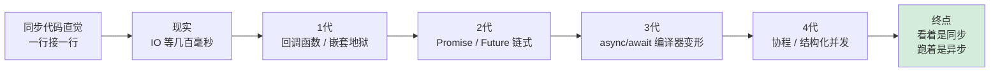

---

#### 目录介绍
- [01.基础概念介绍](#01基础概念介绍)
  - [1.1 先看个案例](#11-先看个案例)
  - [1.2 为何要同步异步](#12-为何要同步异步)
  - [1.3 异步应用需求](#13-异步应用需求)
  - [1.4 异步编程总结](#14-异步编程总结)
- [02.两种不同世界观](#02两种不同世界观)
  - [2.1 同步编程模型](#21-同步编程模型)
  - [2.2 异步编程模型](#22-异步编程模型)
  - [2.3 适用场景](#23-适用场景)
  - [2.4 模型流程图](#24-模型流程图)
  - [2.5 两者本质差异](#25-两者本质差异)
  - [2.6 代码直观感受](#26-代码直观感受)
- [03.技术原理解析](#03技术原理解析)
  - [3.1 同步底层实现](#31-同步底层实现)
  - [3.2 异步底层实现](#32-异步底层实现)
  - [3.3 将异步转同步](#33-将异步转同步)
- [04.技术演变历史](#04技术演变历史)
  - [4.1 原始同步时代](#41-原始同步时代)
  - [4.2 多线程同步时代](#42-多线程同步时代)
  - [4.3 回调地狱时代](#43-回调地狱时代)
  - [4.4 串行执行](#44-串行执行)
  - [4.5 现代异步语法糖](#45-现代异步语法糖)
- [05.多语言设计思想](#05多语言设计思想)
  - [5.1 Java演进路径](#51-java演进路径)
  - [5.2 C++演进路径](#52-c演进路径)
  - [5.3 javaScript设计](#53-javascript设计)
- [06.技术架构设计](#06技术架构设计)
  - [6.1 异步编程模型](#61-异步编程模型)
  - [6.2 异步任务生命周期](#62-异步任务生命周期)
  - [6.3 线程模型设计](#63-线程模型设计)
- [07.平台实现方案](#07平台实现方案)
  - [7.1 Web端实现](#71-web端实现)
  - [7.2 Android端实现](#72-android端实现)
  - [7.3 iOS端实现](#73-ios端实现)


  
## 01.基础概念介绍

### 1.1 先看个案例

一个经典例子：餐厅点餐。想象你在一家餐厅，有两种不同的工作模式：

> **同步（Synchronous）模式：像“固执的厨师”**

**场景**：餐厅只有一个厨师，而且他非常“固执”。

1.  **顾客A点了一份牛排**。厨师接到订单，**开始煎牛排**。在牛排煎好的这5分钟里，他什么都不做，就站在炉子前等着。
2.  **顾客B进来点了一份沙拉**。但厨师正在煎牛排，无法接单。顾客B只能干等着。
3.  **5分钟后**，牛排好了，厨师打包给顾客A。
4.  **现在**，厨师才回头处理顾客B的沙拉，开始切蔬菜。同样，切菜的时候他也不能做别的事。

**结果**：效率极低！即使煎牛排、等水烧开这种不需要一直盯着的事情，厨师也被“阻塞”住了。整个餐厅的吞吐量（单位时间服务的顾客数）非常低。

> **异步（Asynchronous）模式：像“高效的后厨团队”**

**场景**：餐厅有一个**协调员（事件循环）** 和一个**后厨团队**。

1.  **顾客A点了一份牛排**。协调员记下订单，交给厨师A。**厨师A把牛排放入煎锅后，不需要傻站着等**，而是告诉协调员：“牛排还在煎，煎好了叫我”。然后厨师A就可以去处理其他任务。
2.  **顾客B，几乎同时，点了一份沙拉**。协调员立即将沙拉订单交给**空闲的厨师B**。厨师B开始做沙拉。
3.  **这时，牛排煎好了**，锅里的计时器“叮”了一声（这是一个**事件**或**回调**）。协调员收到通知，安排厨师A回来把牛排装盘，送给顾客A。
4.  **沙拉的食材也准备好了**，厨师B完成沙拉，送出。

**结果**：效率极高！协调员（事件循环）不断接收新任务（点餐）和完成通知（“叮”声），并分配给空闲的资源（厨师）。在等待的“空档期”，系统没有被阻塞，而是去处理其他任务。

### 1.2 为何需要同步异步

为什么需要这两种设计？映射到编程世界：

*   **顾客** = 用户请求
*   **厨师** = CPU/线程（计算资源）
*   **煎牛排、煮水** = **I/O操作**（比如读取硬盘文件、等待网络响应、查询数据库）。这些操作的特点是需要等待，但不需要CPU一直参与。
*   **协调员** = **事件循环（Event Loop）**
*   **“叮”声通知** = **回调函数（Callback）** 或 **Promise/Await的解析**

**核心原因：CPU速度 vs. I/O速度的“天文级”差距**

*   **CPU执行一条指令**：约需要 **0.3纳秒**
*   **从内存读取1MB数据**：约需要 **300微秒**（比CPU慢1000倍）
*   **从SSD硬盘读取1MB数据**：约需要 **1毫秒**（比CPU慢300万倍）
*   **从网络请求一个数据包**：约需要 **100毫秒**（比CPU慢3亿倍！）

**所以，同步模式的问题在于**：当你的程序需要从硬盘读一个文件（等待1毫秒）时，CPU这个“超级跑车”却被迫踩下刹车，**空转等待**，这是对计算资源的巨大浪费。

**异步模式的价值在于**：在等待I/O结果的漫长“1毫秒”里，CPU这个“超级跑车”可以掉头去执行其他成百上千个任务的计算。当I/O完成后，再回来处理。这样就极大地提升了CPU的利用率和系统的整体吞吐量。

### 1.3 异步应用需求

为什么需要同步异步技术方案。在现代应用开发中，同步和异步操作是核心技术概念，直接影响应用的性能、用户体验和系统稳定性。

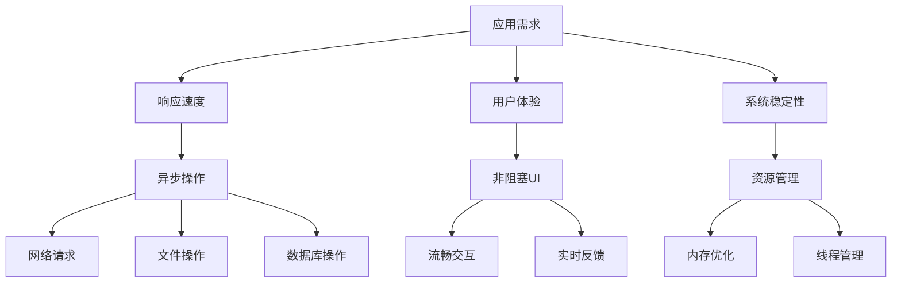

### 1.4 异步编程总结

程序里面所有的任务，可以分成两类：同步任务（synchronous）和异步任务（asynchronous）。

1. 同步任务是那些没有被引擎挂起、在主线程上排队执行的任务。只有前一个任务执行完毕，才能执行后一个任务。
2. 异步任务是那些被引擎放在一边，不进入主线程、而进入任务队列的任务。只有引擎认为某个异步任务可以执行了，该任务（采用回调函数的形式）才会进入主线程执行。排在异步任务后面的代码，不用等待异步任务结束会马上运行，也就是说，异步任务不具有“堵塞”效应。

## 02.两种不同世界观

### 2.1 同步编程模型

同步编程：**“顺序执行”的直觉模型**。代码执行流程与人类阅读顺序一致，一步完成再执行下一步。

```python
# 经典的同步模式 - 符合直觉
print("开始任务")
data = read_file("large_file.txt")  # 阻塞点：程序在这里"停止"等待
processed_data = process(data)      # 前一步完成才执行这一步
result = send_to_network(processed_data)  # 可能再次阻塞
print("任务完成，结果:", result)
```

**思维模型**：像**厨师独自做菜** - 洗菜 → 切菜 → 炒菜 → 装盘，必须按顺序进行。

特点是简单直观，但可能阻塞主线程。

适用场景：快速操作、UI更新、简单计算。

### 2.2 异步编程模型

异步编程：**“事件驱动”的响应模型**。遇到需要等待的操作时，不阻塞主线，而是注册回调，后续通过事件通知继续。

```javascript
// 典型的异步模式 - 基于回调
console.log("开始任务");

readFile("large_file.txt", (error, data) => {
    // 这是回调函数，文件读取完成后才执行
    process(data, (processed) => {
        // 又一个回调
        sendToNetwork(processed, (result) => {
            console.log("任务完成，结果:", result);
        });
    });
});

console.log("我可以做其他事情..."); // 不会等待文件读取
```

**思维模型**：像**餐厅厨师团队** - 主厨安排任务：A洗菜、B切菜、C炒菜，主厨不等待，继续安排其他订单。

### 2.3 适用场景

| 场景类型 | 同步操作 | 异步操作 |
|----------|----------|----------|
| 网络请求 | ❌ 阻塞UI | ✅ 推荐 |
| 文件读写 | ⚠️ 小文件可用 | ✅ 大文件推荐 |
| 数据库操作 | ⚠️ 简单查询 | ✅ 复杂操作推荐 |
| UI更新 | ✅ 主线程必须 | ❌ 不适用 |
| 计算密集 | ❌ 阻塞UI | ✅ 后台处理 |

### 2.4 模型流程图

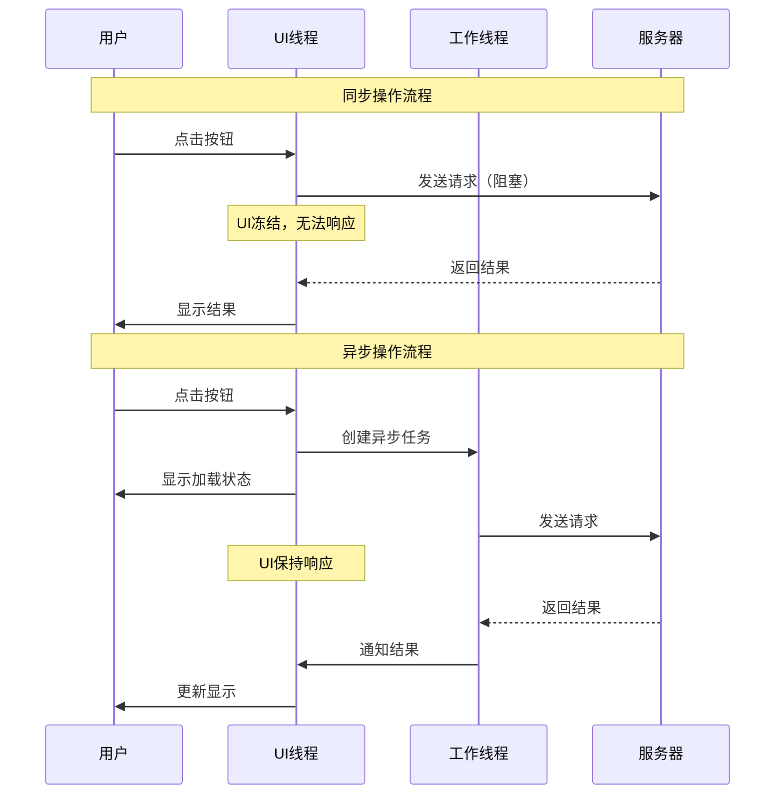

### 2.5 两者本质差异

| 特性 | **同步（Synchronous）** | **异步（Asynchronous）** |
| :--- | :--- | :--- |
| **核心思想** | **顺序执行，阻塞等待** | **并发执行，非阻塞回调** |
| **编程模型** | 简单、直观，符合人类线性思维 | 复杂，基于事件、回调或Promise |
| **资源利用** | 差。线程在I/O等待时被挂起，浪费内存和CPU调度资源 | 优。**用极少的线程（甚至单线程）处理海量I/O** |
| **性能特点** | 延迟低（对于单个任务），但吞吐量低 | 延迟可能稍高（由于调度），但**吞吐量极高** |
| **复杂度** | 业务逻辑简单，并发控制复杂 | 并发简单，业务逻辑可能复杂 |
| **调试难度** | 堆栈清晰，易于跟踪 | 堆栈断裂，调试困难 |
| **适用场景** | **CPU密集型任务**（计算复杂，I/O少）、简单的客户端应用 | **I/O密集型任务**（高并发网络请求、文件操作）、服务器后端 |
| **比喻** | **单车道堵车**：一辆车抛锚，后面全堵死 | **立交桥**：一个方向堵车，不影响其他方向 |

### 2.6 代码直观感受

假设一个程序要依次读取3个网络文件。我们来看看使用同步机制和使用异步机制分别效率怎么样？如下所示：

**同步代码（Python示例）**：

```python
import time

def read_file_sync():
    start = time.time()
    
    # 模拟读取3个网络文件，每个耗时1秒
    data1 = read_from_network()  # 阻塞1秒，CPU基本空闲
    data2 = read_from_network()  # 再阻塞1秒
    data3 = read_from_network()  # 再阻塞1秒
    
    end = time.time()
    print(f"同步读取总耗时: {end - start:.2f} 秒")  # 输出约 3.00 秒

# 总耗时 ≈ 1+1+1 = 3秒。大量时间在“等待”中被浪费。
```

**异步代码（Python asyncio示例）**：

```python
import asyncio
import time

async def read_file_async():
    start = time.time()
    # 同时发起3个读取请求，不等待
    task1 = read_from_network_async()
    task2 = read_from_network_async()
    task3 = read_from_network_async()
    
    # 等待它们全部完成（在等待期间，事件循环可以处理其他任务）
    results = await asyncio.gather(task1, task2, task3)
    
    end = time.time()
    print(f"异步读取总耗时: {end - start:.2f} 秒")  # 输出约 1.01 秒！

# 总耗时 ≈ max(1, 1, 1) = 1秒。三个请求的等待时间被“重叠”了。
```

**同步**是为了**代码的简单性**和**逻辑的清晰性**。在不需要高并发的场景下，它是更优选择。

**异步**是为了**极致的资源利用率**和**高并发吞吐量**。在面对成千上万个并发I/O请求（如一个流行的Web服务器）时，它是必不可少的技术。

## 03.技术原理解析

### 3.1 同步底层实现

要理解同步为何"卡"，必须从最底层一路追到内核。**先问一个问题：当一个线程调用 `read()` 阻塞在那里时，操作系统到底在做什么？**

**探索过程：从用户态一路深入内核**

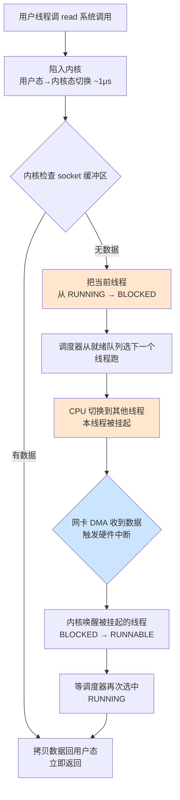

**核心机制三件套**：

```java
// Java 同步IO的底层原理
public class SynchronousExample {
    public void readData() {
        InputStream input = socket.getInputStream();
        byte[] buffer = new byte[1024];
        int bytesRead = input.read(buffer);   // 触发上面流程图
        processData(buffer, bytesRead);
    }
}
```

**1) 线程状态机：阻塞的本质是"被踢出 CPU"**

Linux 内核里线程有 7 种状态，同步阻塞涉及其中 4 种：

```
TASK_RUNNING        →  正在 CPU 上跑 / 在就绪队列等
TASK_INTERRUPTIBLE  →  可中断阻塞（read/recv 默认走这里、可被信号唤醒）
TASK_UNINTERRUPTIBLE→  不可中断阻塞（磁盘 IO、ps 看到 D 状态）
TASK_DEAD           →  线程结束
```

你写的 `read()` 阻塞，本质就是内核把 `task_struct->state` 改成 `TASK_INTERRUPTIBLE`，然后从就绪队列里摘掉。

**2) 上下文切换的真实代价**

```
直接成本（CPU 周期）          ：1~5 μs
间接成本（缓存失效）         ：10~100 μs（L1/L2/TLB 全废）
极端情况（Cgroup 限流）：可能高到毫秒级
```

这就是为什么 1 万个连接**不能**用 1 万个同步线程——光切换就吃光 CPU。

**3) 内存代价**：每个 Java 线程默认 1MB 栈（`-Xss`），10000 线程 = 10GB 栈。这是单纯的内存账单，与 CPU 无关。

**一句话**：同步阻塞 = **"我占着这个线程的所有资源（CPU 时间片、寄存器、栈、TLB），只为等一个网卡中断"**——本质上是用昂贵的并发单元做廉价的等待工作。

### 3.2 异步底层实现

异步底层的灵魂只有一句话：**把"等待"从线程上剥离，挂到一个内核数据结构里**。线程不再被阻塞，而是去做别的事；等数据到了，内核再通知线程回来取。

**探索过程：IO 多路复用三代演进**

要理解 `epoll` 为什么牛，得先看它前两代是怎么被淘汰的：

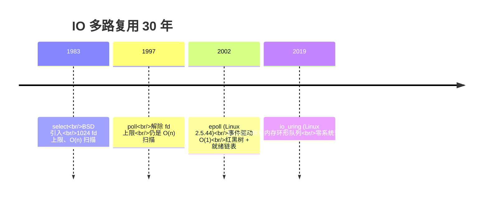

**三代核心数据结构对比**：

```
select/poll：每次调用都把【全部 fd 集合】拷给内核 → 内核轮询 → 拷回结果
            问题：1万 fd 每次拷 1万次、O(n) 扫描

epoll：内核维护红黑树管理所有 fd + 就绪链表存"已就绪"
      epoll_ctl(ADD)  → 注册一次（O(logN)）
      epoll_wait()   → 只返回就绪 fd（O(1)）
      问题：仍是"内核通知用户去读"——读还是要陷一次内核

io_uring：用户态和内核共享两个 ring buffer（SQ/CQ）
        提交请求不陷内核、完成通知不陷内核
        问题：心智复杂、生态尚在成长
```

**事件循环骨架**：

```python
# 事件循环 = 调度器 + epoll + 就绪队列
class EventLoop:
    def __init__(self):
        self.ready_tasks = []        # 就绪任务（用户态队列）
        self.epoll = select.epoll()  # 内核态 fd 监视器
        self.fd_to_callback = {}     # fd → 回调函数

    def run_forever(self):
        while True:
            # 1) 跑完所有就绪任务（CPU 工作）
            while self.ready_tasks:
                self.ready_tasks.pop(0).execute()

            # 2) 一次性问内核：哪些 IO 准备好了？
            #    阻塞 1ms 或直到有事件，期间 CPU 让给别人
            events = self.epoll.poll(timeout=0.001)

            # 3) 把内核报告的就绪 fd 对应回调放回队列
            for fd, event_mask in events:
                self.ready_tasks.append(self.fd_to_callback[fd])
```

**关键反直觉点**

- **异步 ≠ 不阻塞**：事件循环本身在 `epoll_wait` 里**也是阻塞**的——但这个阻塞**只阻塞一个线程**，不阻塞业务任务。
- **异步 ≠ 多线程**：单线程 + epoll 完全可以撑 10 万连接。Redis、Nginx Worker、Node.js 都是单线程异步。
- **异步是"被通知"，不是"主动轮询"**：如果是 `while True: try_read()`，那叫**忙等**，比同步还差。

**操作系统支持矩阵**：

| 系统 | API | 触发模式 | 核心数据结构 |
|------|-----|---------|------------|
| Linux 2.6+ | `epoll` | LT/ET | 红黑树 + 就绪链表 |
| Linux 5.1+ | `io_uring` | 完成事件 | 共享 SQ/CQ ring |
| BSD/macOS | `kqueue` | 多种过滤器 | kevent 链表 |
| Windows | `IOCP` | 完成端口 | 完成队列 |
| Solaris | `event ports` | LT | 端口队列 |

**一句话**：异步底层的本质是**"用一个内核数据结构（epoll 红黑树 / IOCP 完成队列）替代成千上万个线程的阻塞状态"**——把昂贵的线程从"等待"中解放出来，还给业务计算。

### 3.3 将异步转同步

**为什么要做这件事？** —— 异步在性能上是最优解，但在某些场景下**心智代价无法承受**：

- 主线程要拿子线程的最终结果统一处理（比如 main 函数等所有任务跑完）
- 同步代码中嵌入了一段异步 API，但调用方期望同步语义
- 测试代码需要等异步操作完成才能 assert

**核心矛盾**：异步是"事件回来时通知我"，同步是"我现在就要结果"。要在两者间架桥，**唯一的办法就是：让当前线程主动停下来等"通知"**。这就是"异步转同步"的本质。

**七种方式的本质拆解**

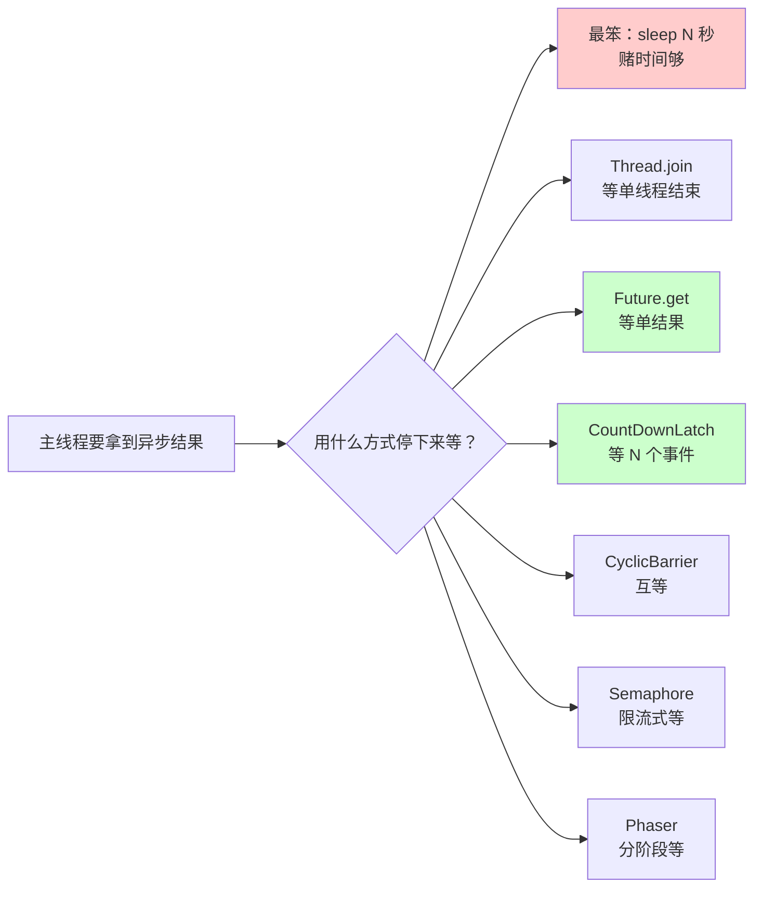

**逐一拆解原理**：

**①  Thread.sleep(N)**

```java
new Thread(asyncTask).start();
Thread.sleep(5000);   // 赌 5 秒够
useResult();
```

**原理**：当前线程主动 `TIMED_WAITING`。**致命缺陷**：你不知道子任务实际多久。生产代码绝不能用，但单元测试偶尔能见。

**②  Thread.join()**

```java
Thread t = new Thread(asyncTask);
t.start();
t.join();             // 内部 wait()，子线程结束时 notify()
useResult();
```

**原理**：JDK 实现是 `while(isAlive()) wait(0)`——子线程退出时会 `notifyAll`。**只能等单个 Thread**，无法等异步框架的回调。

**③  Future.get() / CompletableFuture.join()**

```java
Future<String> f = executor.submit(asyncTask);
String result = f.get();   // AQS 共享锁、tryAcquireShared 直到 state=COMPLETED
```

**原理**：`FutureTask` 内部用 AQS 实现。完成时 `set(result)` → `finishCompletion()` → 唤醒所有 `awaitDone` 的等待线程。**这是最常用的方式**，是"异步转同步"的标准答案。

**④  CountDownLatch（一对多）**

```java
CountDownLatch latch = new CountDownLatch(N);
for (int i = 0; i < N; i++)
    executor.submit(() -> { doWork(); latch.countDown(); });
latch.await();   // 等 N 次 countDown
```

**原理**：AQS 共享模式，`state` 初始 = N，`countDown` 是 `state--`，归零时唤醒所有 await 线程。**一次性、不可重置**。

**⑤  CyclicBarrier（多对多互等）**

```java
CyclicBarrier barrier = new CyclicBarrier(N, () -> mergeResults());
for (...) executor.submit(() -> { phase1(); barrier.await(); phase2(); });
```

**原理**：`ReentrantLock` + `Condition`。每个线程到达点 `count--`，最后一个触发 `signalAll` 并执行屏障动作。**可重置、可循环使用**。

**⑥  Semaphore（限流）**

```java
Semaphore sem = new Semaphore(0);
asyncTask.onComplete(() -> sem.release());
sem.acquire();   // 等许可
```

**原理**：AQS 共享锁、许可数 = state。release 后许可可重复使用——这是它和 CountDownLatch 最大的区别。

**⑦  Phaser（分阶段）**

```java
Phaser phaser = new Phaser(N);
for (...) {
    phaser.arriveAndAwaitAdvance();   // 阶段 1 同步点
    phaser.arriveAndAwaitAdvance();   // 阶段 2 同步点
}
```

**原理**：JDK 7 加入，相当于"可动态增减参与者的 CyclicBarrier"。

**横向对比表**：

| 方式 | 等待对象 | 可重用 | 灵活度 | 推荐度 |
|------|---------|--------|--------|--------|
| sleep | 时间 | ❌ | ⭐ | 仅测试 |
| join | 单线程 | ❌ | ⭐⭐ | 简单场景 |
| Future.get | 单异步任务 | ❌ | ⭐⭐⭐⭐ | **首选** |
| CountDownLatch | N 个事件 | ❌ | ⭐⭐⭐⭐ | **多任务等待** |
| CyclicBarrier | N 个线程互等 | ✅ | ⭐⭐⭐⭐ | 分阶段计算 |
| Semaphore | 限流 + 信号 | ✅ | ⭐⭐⭐⭐⭐ | 资源控制 |
| Phaser | 动态分阶段 | ✅ | ⭐⭐⭐⭐⭐ | 复杂多阶段 |

**CountDownLatch vs CyclicBarrier 的灵魂区别**

- **CountDownLatch**："裁判等运动员"——一个（或多个）裁判等所有运动员到齐，**不可逆**。
- **CyclicBarrier**："运动员互等"——所有人到齐了一起出发，**可循环**。

**关键告诫**：异步转同步本质是"放弃异步收益、换取代码直觉"。**线上高并发服务慎用**——一旦同步等待点过多，就退化回了线程阻塞模型。

## 04.技术演变历史

### 4.1 原始同步时代

阶段1：原始同步时代（1990s以前）。**技术背景**：单进程/单线程模型

```c
// C语言的同步网络编程
int main() {
    int server_fd = socket(AF_INET, SOCK_STREAM, 0);
    bind(server_fd, ...);
    listen(server_fd, 5);
    
    while(1) {
        // 同步accept：没有连接时就阻塞等待
        int client_fd = accept(server_fd, ...);
        
        // 为每个客户端创建新进程（重量级）
        if (fork() == 0) {
            handle_client(client_fd);  // 同步处理
            exit(0);
        }
    }
}
```

**痛点**：一个客户端阻塞，整个进程挂起，无法处理其他连接。

### 4.2 多线程同步时代

阶段2：多线程同步时代（1990s-2000s初）。**解决方案**：为每个连接创建线程

```java
// Java多线程同步模型
public class ThreadPerConnectionServer {
    public static void main(String[] args) throws IOException {
        ServerSocket serverSocket = new ServerSocket(8080);
        
        while (true) {
            // 仍然同步accept
            Socket clientSocket = serverSocket.accept();
            
            // 但为每个连接创建新线程
            new Thread(() -> {
                handleRequest(clientSocket);  // 线程内仍同步处理
            }).start();
        }
    }
}
```

**进步**：解决了并发问题

**新问题**：线程创建/销毁成本高，内存消耗大（线程栈大小通常1-2MB）

### 4.3 回调地狱时代

阶段3：回调地狱时代（2000s中后期）。**Node.js的解决方案**：单线程 + 异步回调

如果有多个异步操作，就存在一个流程控制的问题：如何确定异步操作执行的顺序，以及如何保证遵守这种顺序。

```javascript
// Node.js 的异步回调模式
const http = require('http');

http.createServer((req, res) => {
    // 异步读取文件，不阻塞事件循环
    fs.readFile('large_file.txt', (err, data) => {
        if (err) {
            res.end('Error');
            return;
        }
        
        // 异步数据库查询
        db.query('SELECT ...', (err, results) => {
            // 又一个回调
            processResults(results, (processed) => {
                res.end(processed);
            });
        });
    });
}).listen(8080);
```

再来看一个典型案例，假设有6个异步任务，`async`函数非常耗时，每次执行需要1秒才能完成，然后再调用回调函数。如何让她们按照顺序执行，伪代码是这样的：

```javascript
function async(arg, callback) {
  console.log('参数为 ' + arg +' , 1秒后返回结果');
  setTimeout(function () { callback(arg * 2); }, 1000);
}

function final(value) {
  console.log('完成: ', value);
}

async(1, function (value) {
  async(2, function (value) {
    async(3, function (value) {
      async(4, function (value) {
        async(5, function (value) {
          async(6, final);
        });
      });
    });
  });
});
// 参数为 1 , 1秒后返回结果
// 参数为 2 , 1秒后返回结果
// 参数为 3 , 1秒后返回结果
// 参数为 4 , 1秒后返回结果
// 参数为 5 , 1秒后返回结果
// 参数为 6 , 1秒后返回结果
// 完成:  12
```

上面代码中，六个回调函数的嵌套，不仅写起来麻烦，容易出错，而且难以维护。

**优势**：高并发，资源消耗小

**问题**：**回调地狱（Callback Hell）**，错误处理复杂，代码难以阅读

### 4.4 串行执行

可以编写一个流程控制函数，让它来控制异步任务，一个任务完成以后，再执行另一个。这就叫串行执行。

```javascript
var items = [ 1, 2, 3, 4, 5, 6 ];
var results = [];

function async(arg, callback) {
  console.log('参数为 ' + arg +' , 1秒后返回结果');
  setTimeout(function () { callback(arg * 2); }, 1000);
}

function final(value) {
  console.log('完成: ', value);
}

function series(item) {
  if(item) {
    async( item, function(result) {
      results.push(result);
      return series(items.shift());
    });
  } else {
    return final(results[results.length - 1]);
  }
}

series(items.shift());
```

上面代码中，函数`series`就是串行函数，它会依次执行异步任务，所有任务都完成后，才会执行`final`函数。`items`数组保存每一个异步任务的参数，`results`数组保存每一个异步任务的运行结果。

注意，上面的写法需要六秒，才能完成整个脚本。

### 4.5 现代异步语法糖

阶段4：现代异步语法糖（2010s至今）。

**解决方案**：用同步的写法实现异步的逻辑。比如：JavaScript `async/await`

```javascript
async function handleRequest() {
    try {
        // 类似同步的直观写法
        const data = await fs.promises.readFile('file.txt');
        const result = await db.query('SELECT ...');
        const processed = await processData(result);
        return processed;
    } catch (error) {
        // 统一的错误处理
        console.error('处理失败:', error);
    }
}
```

**核心原理**：**状态机转换**

```javascript
// async/await 的近似编译结果
function handleRequest() {
    return new Promise((resolve, reject) => {
        // 状态机实现
        const stateMachine = {
            state: 0,
            steps: [
                async () => { /* 步骤1 */ },
                async () => { /* 步骤2 */ }, 
                async () => { /* 步骤3 */ }
            ],
            run: function() {
                this.steps
                    .then(() => {
                        this.state++;
                        if (this.state < this.steps.length) {
                            this.run();
                        } else {
                            resolve();
                        }
                    })
                    .catch(reject);
            }
        };
        stateMachine.run();
    });
}
```

## 05.多语言演变

线程级并发 vs 事件驱动并发

| 特性 | 多线程同步模型 | 事件驱动异步模型|
|------|---------------------|--------------------------|
| **并发单位** | 线程 (Thread) | 任务 (Task) |
| **内存开销** | 大 (每线程1-2MB栈) | 小 (约5KB每任务) |
| **上下文切换** | 内核参与，成本高 | 用户态切换，成本低 |
| **CPU密集型** | 优 (可利用多核) | 差 (需要工作线程) |
| **I/O密集型** | 良 (线程池优化) | 优 (原生非阻塞) |
| **代码复杂度** | 中 (需要同步控制) | 中 (避免阻塞事件循环) |


### 5.1 Java演进路径

Java 的异步演进 25 年，每一步都是**被工程痛点逼出来的**——这条线索能讲清楚"为什么 Java 21 终于又回到了"同步代码风格""。

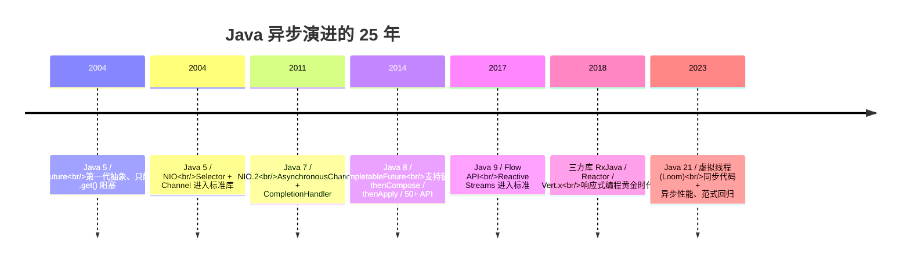

**4 个关键演进阶段的设计动机**

**阶段 1：Future（2004）—— 异步初体验，但被 .get() 卡死**

```java
Future<String> f = executor.submit(() -> httpGet(url));
String result = f.get();   // ❌ 阻塞 + 无法链式 + 无组合
```

**痛点**：只能阻塞等结果，无法组合多个 Future、无法回调。**和"异步"一词的初衷违背**。

**阶段 2：CompletableFuture（2014）—— 终于能链式了**

```java
CompletableFuture
    .supplyAsync(() -> fetchUser(id))
    .thenCompose(user -> fetchOrders(user))   // 嵌套 CF 自动展平
    .thenApply(orders -> render(orders))
    .exceptionally(ex -> fallback(ex))         // 异常处理
    .thenAccept(System.out::println);
```

**核心创新**：
- `thenCompose` = monad 风格 flatMap，避免 `Future<Future<T>>` 嵌套
- `thenCombine / allOf / anyOf` 实现并行组合
- 内部基于 `ForkJoinPool.commonPool` 调度

**仍存在的问题**：50+ API 学习曲线陡峭、堆栈断裂调试难、回调地狱降级版（变成 `.then().then().then()` 链）。

**阶段 3：响应式编程（2017+）—— RxJava / Reactor 接管**

```java
// Reactor 风格、Spring WebFlux 标配
Mono.fromCallable(() -> fetchUser(id))
    .flatMap(user -> webClient.get().uri("/orders/{id}", user.id()).retrieve())
    .timeout(Duration.ofSeconds(3))
    .retry(2)
    .subscribe();
```

**优势**：声明式、背压、丰富的算子（map/filter/window/buffer/groupBy）
**代价**：心智模型陡峭、调试链路非常恶心、栈追踪和业务调用栈完全脱钩

**阶段 4：虚拟线程 / Project Loom（2023）—— 范式回归**

```java
// Java 21 虚拟线程：写同步代码，享异步性能
try (var executor = Executors.newVirtualThreadPerTaskExecutor()) {
    IntStream.range(0, 1_000_000).forEach(i -> {
        executor.submit(() -> {
            // 看起来是同步阻塞、JVM 在 IO 处自动挂起虚拟线程
            String response = httpClient.send(req, ofString()).body();
            db.save(response);
        });
    });
}   // 100 万虚拟线程、约几百 MB 内存
```

**核心机制**：
- 虚拟线程在 IO 阻塞时**自动挂起到堆**，平台线程被释放去跑其他虚拟线程
- JVM 在 `BlockingQueue.take` / `Socket.read` / `LockSupport.park` 等所有阻塞点插桩
- M:N 调度——百万虚拟线程跑在几十个 ForkJoinPool 平台线程上

**这是 Java 异步编程的范式转折**：**不再让程序员显式写异步**，让 JVM 在阻塞点自动"切换协程"。代码看起来回到了 2004 年的同步风格，但性能是 CompletableFuture 级别。

**演进规律总结**：

```
Future（2004）   →  能异步、不能组合
CompletableFuture（2014）→  能组合、心智重
Reactive（2017）→  能背压、调试难
Loom（2023）   →  写同步、跑异步、回归直觉
```

**这不是巧合**——所有主流语言都在向同一个方向收敛：**"看着同步、跑着异步"**。

### 5.2 C++演进路径

C++ 的异步演进是一部**从无到有再到统一**的奋斗史，每一步都是被工程痛点逼出来的：

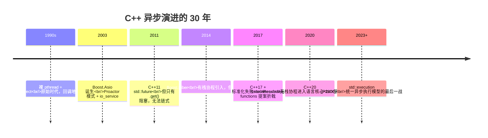

**核心矛盾：C++ 异步为什么这么难产？**

```
  Java/C# → 有运行时 → 异步可以“内置” Task/Future/Scheduler
  JavaScript → 有事件循环 → async/await 一句就包后
  C++ → 零成本抽象 + 无运行时 → 谁来提供调度器？
        但不提供调度器、那个人都要重造轮子
```

这就是为什么 C++20 协程**只定义协议、不带调度器**——给所有人留出最大灵活度，代价是入门曲线陡峭。

```cpp
// C++20 协程：编译器把这段代码改写成状态机
Task<Response> handleRequest(Request req) {
    auto data    = co_await readDatabase(req.id);     // 挂起点1
    auto enriched = co_await enrichWithCache(data);   // 挂起点2
    auto resp    = co_await callDownstream(enriched); // 挂起点3
    co_return resp;
}

// 应用者还需要自己定义 Task<T> 类型、promise_type、awaiter……
// 或者使用三方库：folly::coro / cppcoro / unifex
```

**关键工程权衡**：

| 方案 | 适合场景 | 代价 |
|------|---------|------|
| **裸 std::thread + future** | 简单后台任务 | 无链式、无组合 |
| **Boost.Asio** | 网络服务器 | 仍以回调/协程双模式存在 |
| **C++20 coroutines + 自研 Task** | 高性能服务（如游戏、HFT）| 学习曲线陡峭 |
| **std::execution (C++26)** | 未来标准 | 还在演化中 |

**一句话总结**：**C++ 异步的难，本质上是“语言不替你做选择”的代价**——其他语言把调度器塞进运行时，C++ 把这个权利还给开发者。

### 5.3 javaScript设计

为了解决单线程的局限性，JavaScript 引入了**异步编程模型**和**事件循环（Event Loop）**机制。

事件循环是 JavaScript 实现异步编程的核心机制，它由以下部分组成：

1. **调用栈（Call Stack）**：用于存储同步任务的执行上下文。
2. **任务队列（Task Queue）**：用于存储异步任务的回调函数。
3. **事件循环**：不断检查调用栈是否为空，如果为空，则将任务队列中的回调函数推入调用栈执行。

JavaScript 运行时，除了一个正在运行的主线程，引擎还提供一个任务队列（task queue），里面是各种需要当前程序处理的异步任务。（实际上，根据异步任务的类型，存在多个任务队列。为了方便理解，这里假设只存在一个队列。）

首先，主线程会去执行所有的同步任务。等到同步任务全部执行完，就会去看任务队列里面的异步任务。如果满足条件，那么异步任务就重新进入主线程开始执行，这时它就变成同步任务了。等到执行完，下一个异步任务再进入主线程开始执行。一旦任务队列清空，程序就结束执行。

异步任务的写法通常是回调函数。一旦异步任务重新进入主线程，就会执行对应的回调函数。如果一个异步任务没有回调函数，就不会进入任务队列，也就是说，不会重新进入主线程，因为没有用回调函数指定下一步的操作。

JavaScript 引擎怎么知道异步任务有没有结果，能不能进入主线程呢？答案就是引擎在不停地检查，一遍又一遍，只要同步任务执行完了，引擎就会去检查那些挂起来的异步任务，是不是可以进入主线程了。

这种循环检查的机制，就叫做事件循环（Event Loop）。定义是：“事件循环是一个程序结构，用于等待和发送消息和事件（a programming construct that waits for and dispatches events or messages in a program）”。

## 06.技术架构设计

### 6.1 异步编程模型

不同语言提供了 5 个当级不同的异步抽象，**它们不是"同一个东西的不同名字"**，而是抽象层级逐渐升高的演化阶梯。

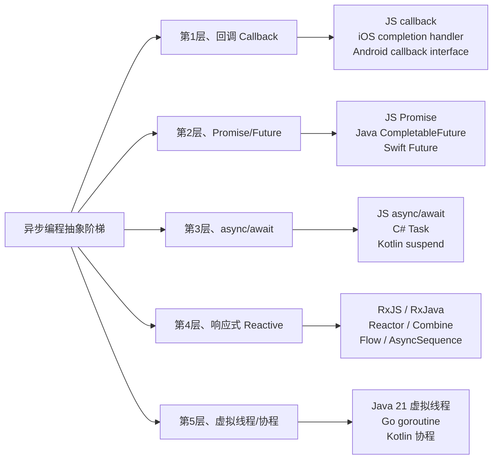

**五层其实是“抽象代价 vs 使用成本”的吃什表**：

| 抽象层级 | 使用者心智重量 | 调试难度 | 运行时代价 |
|---------|----------------|---------|----------|
| Callback | 高（控制反转） | 难（堆栈断） | 低 |
| Promise | 中（链式） | 中 | 低 |
| async/await | 低（看似同步） | 低 | 低（状态机） |
| Reactive | 高（响应式思维） | 高（背压、调度器） | 低 |
| 虚拟线程 | 极低（同步代码） | 低 | 中（JVM 帮你调度） |

**这里有个反直觉看点**：Reactive 的抽象并不比 async/await 高一等，反而是**另一个路线**——面向"流"、适合背压场景；而 虚拟线程/协程 是"让使用者完全不感知异步"的终极进化。

**一个逻辑判断讲重点**：选择哪个抽象，首要看你的场景是“事件驱动”还是“任务驱动”：
- **请求-响应型**（HTTP、RPC）→ async/await 或虚拟线程
- **事件流**（kafka消费、UI 事件、实时推送）→ Reactive
- **CPU 密集 + 背后任务**→ 原始 Future / Worker Pool


### 6.2 异步任务生命周期

异步任务不是"提交→完成"两点式状态，生产环境必须考虑七个状态转换。**并且不同语言的 Future 设计在这些状态上取舍完全不同**：

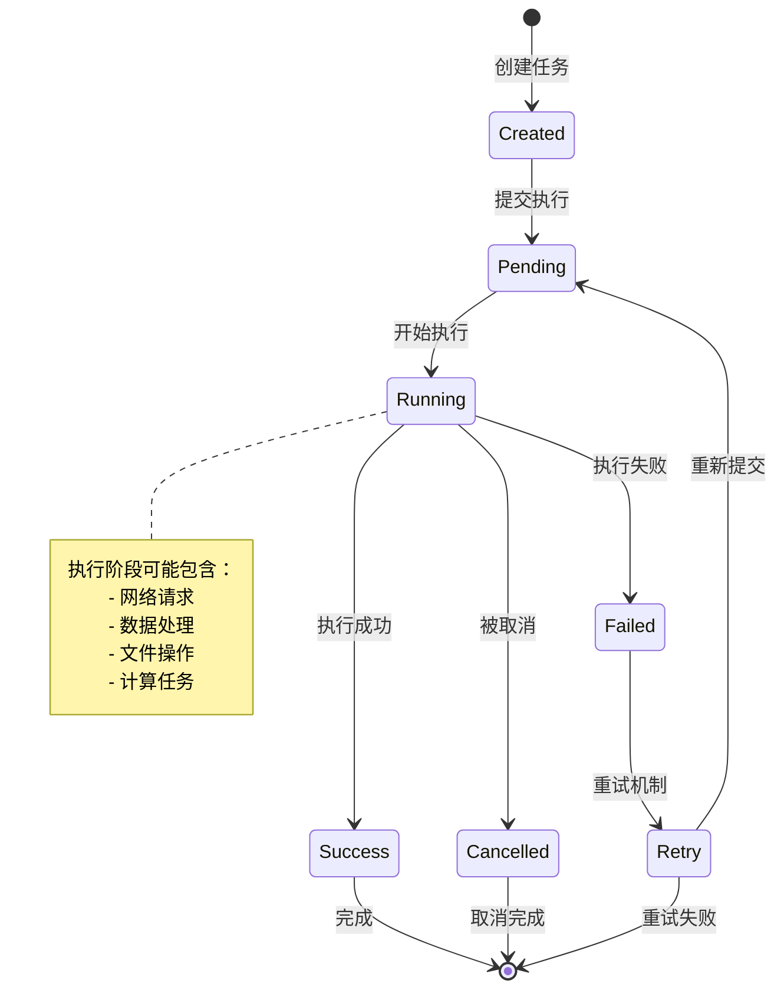

**三个生命周期设计难点**

**难点① 取消传播**——取消一个上游任务、下游怎么办？

```kotlin
// Kotlin 结构化并发：取消自动传播
val job = scope.launch {
    val a = async { fetchA() }
    val b = async { fetchB() }
    process(a.await(), b.await())
}
job.cancel()   // a 、 b 、 process 都被取消
```

```java
// Java CompletableFuture：取消不传播，是个陕阱
CompletableFuture<A> a = supplyAsync(() -> fetchA());
CompletableFuture<B> b = supplyAsync(() -> fetchB());
CompletableFuture<C> c = a.thenCombine(b, this::merge);
c.cancel(true);   // ❌ 只能取消 c、上游 a/b 还在跑
```

**难点② 重试语义**——重试不是"再调一次"，而是要面对 4 个问题：
```
什么错误该重试？      →  只重试可重试错误（超时、503）
重试间隔多久？         →  指数退避 + jitter、避免雪崩
重试多少次？           →  总超时控制、不是次数控制
下游怎么那？             →  重试期间下游该等还是快失败？
```

**难点③ 超时层级**——调用链上每一线都要超时、超时必须递减：

```
Client 超时 = 5秒
  └ Service A 超时 = 4秒（留一秒给自己处理）
      └ Service B 超时 = 3秒
          └ DB 超时 = 2秒
```

如果底层超时设得比上层长、上层已经超时了、底层还在推底层调、**这是微服务雪崩的主因之一**。Spring Cloud Gateway、Sentinel、Resilience4j 都是在系统化解决这个问题。


### 6.3 线程模型设计

为什么需要"主线程 + 多个后台线程池"的抽象？这是被**"不同任务会互相伤害"**逼出来的设计。

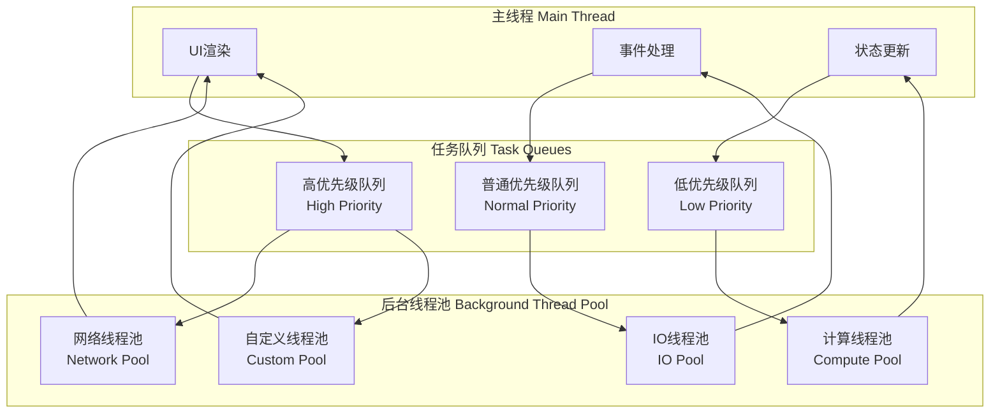

**为什么不能全部走一个线程池？——三大隔离原理**

**隔离原理①｜CPU 密集 vs IO 密集不能混**

```
IO 密集场景       →  线程数 = CPU 核数 × (1 + 等待时间/计算时间)
                       →  一般 50~200 个线程
CPU 密集场景      →  线程数 = CPU 核数 (或 + 1)
                       →  一般 8~16 个线程
```

混用后果：IO 任务占满线程池在等网络、CPU 任务能跑起来、反之亦然。**谁都坚持不了多久**。

**隔离原理②｜优先级隔离**

如果高/低优先级任务在同一个队列，调度器只能 FIFO 或 LIFO、重要任务会被不重要任务起锁。

**隔离原理③｜业务隔离**

订单服务和下载服务共用一个线程池、下载状态不佳时会压到订单。“舱壁隔离”（Bulkhead Pattern）是微服务高可用的黄金设计。

**跨平台主线程位置对比**：

| 平台 | 主线程名称 | 能做什么 | 不能做什么 |
|------|-----------|---------|-----------|
| **浏览器** | UI / Main Thread | DOM 操作、事件处理 | 默认不能做 CPU 计算 |
| **Android** | Looper Main | UI 更新、生命周期回调 | 严禁 IO、大计算 |
| **iOS** | DispatchQueue.main | UIKit 调用、动画 | 严禁 IO、大计算 |
| **Node.js** | Event Loop | 业务逻辑 + IO 调度 | 不能 CPU 密集 |
| **默认 JVM** | main | 启动启动 | 什都能做、但不推荐阻塞 |

**跨平台黄金原则**：
```
主线程只做“调度 + 接受用户交互 + 输出结果”，重活顶全部去后台。
```

这是"主线程保护原则"。违反这个原则 = UI 卡顿 / ANR / 服务不响应。


## 07.平台实现方案

### 7.1 Web端实现

Web 是异步范式**演进最极致的平台**——从 1995 年 JavaScript 诞生的那一天起、它就是单线程、必须异步。

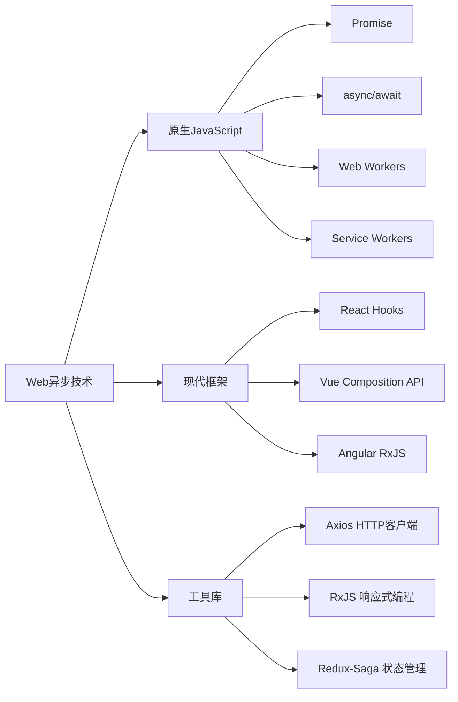

**核心机制探索：事件循环的微任务/宏任务**

这是 Web 异步最反直觉、也是面试重点考察点：

```javascript
console.log(1);
setTimeout(() => console.log(2), 0);   // 宏任务
Promise.resolve().then(() => console.log(3));   // 微任务
console.log(4);
// 输出顺序：1 → 4 → 3 → 2  （不是 1→4→2→3）
```

**为什么微任务在宏任务之前？**

```
HTML5 规范定义事件循环单个 tick 的运行顺序：
  1) 宏任务队列取 1 个跑
  2) 跑完后、清空全部微任务队列
  3) 渲染（需要的话）
  4) 进入下一个 tick
```

这个设计是被**交互平滑性**逼出来的——微任务优先保证了 Promise 链能一口气跑完，不会被用户输入 / setTimeout / I/O 事件插中间。

**Web Worker vs Service Worker 到底区别在哪？**

| 维度 | Web Worker | Service Worker |
|------|------------|----------------|
| 用途 | CPU 密集卸载 | 网络代理 + 离线缓存 |
| 生命周期 | 跟随页面 | 独立于页面、能后台唤醒 |
| 网络拦截 | ❌ | ✅ fetch event |
| 项目个数 | 任意 | 一个源只能一个 |
| 主要代表应用 | 加密、图片处理、解压缩 | PWA 、推送、离线应用 |

**实践上需注意**：React 的 useEffect / useState 并不是异步机制本身、而是在演习十上层推进到了渲染同步；真正的异步还是靠 fetch / Promise / async-await。


### 7.2 Android端实现

Android 的异步史是一部**"渡继不抱作"**的路线。

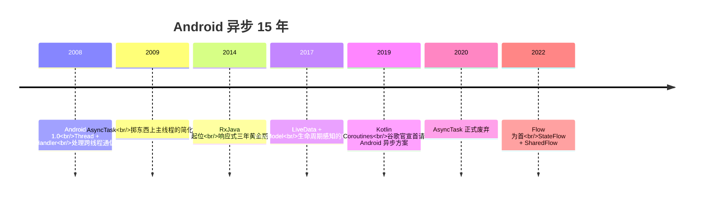

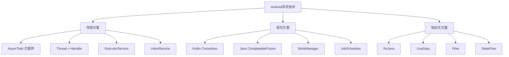

**核心探索：为什么 AsyncTask 被邀废弃？**

AsyncTask 在 2009 年代表走了 Android 异步，11 年后都邀废弃、背后是一连串设计责任。

**问题①：Activity 被泄露**
```java
// AsyncTask 拈为内部类，隐式护住外部 Activity 引用
class MyTask extends AsyncTask<Void, Void, Void> {
    @Override protected Void doInBackground(Void... v) {
        Thread.sleep(60_000);   // 1 分钟后 Activity 早跳转了、但这里抨身
        return null;
    }
}
// Activity 被 Task 隐式包装、不被 GC、OOM
```

**问题②：onPostExecute 后 Activity 已销毁**
```java
@Override protected void onPostExecute(Void v) {
    textView.setText("完成");   // textView 已销毁、报 NullPointerException
}
```

**问题③：默认 SerialExecutor 串行**

4.0+ AsyncTask 默认变为串行执行、需要 `executeOnExecutor(THREAD_POOL_EXECUTOR)` 才能并发。这是很多人默默中招的陕阱。

**Kotlin 协程如何一错万予解决的？**
```kotlin
class MyActivity : AppCompatActivity() {
    override fun onCreate(savedInstanceState: Bundle?) {
        lifecycleScope.launch {   // ✅ 绑定生命周期
            val data = withContext(Dispatchers.IO) { fetchData() }
            textView.text = data   // 在主线程、不需手动切
        }
    }
    // Activity 销毁、lifecycleScope 自动取消子协程、本香靕洩漏
}
```

**三层改进**：
1. **lifecycleScope** 解决销毁不取消
2. **withContext(Dispatchers.IO)** 隔离线程池
3. **顺式代码** 避免回调地狱


### 7.3 iOS端实现

iOS 的异步代表者 GCD（Grand Central Dispatch）是**同类设计中的黄金标准**——远超越其他平台。

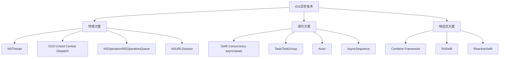

**核心探索：GCD 的设计赪越**

2009 年 GCD 发布时、Linux 还在用 pthread、Windows 还在用 ThreadPool API。GCD 提出了一个革命性理念：

```
你不该管理线程、你只该提交"块"。
```

```objective-c
// 则不提线程、只提任务、调试器自动干
DispatchQueue.global(qos: .userInitiated).async {
    let data = heavyCompute()
    DispatchQueue.main.async {
        self.label.text = data   // 过渡到主线程
    }
}
```

**GCD 核心创新**：

- **Quality of Service (QoS)**——你只说优先级、不说线程数
- **主队列 唯一**——主线程是全局唯一、事件串行
- **串行队列 vs 并发队列**——默认串行、需明确指定才并发
- **低事务优先级反转**——高 QoS 任务提升肩负低 QoS 任务优先级

**Swift Concurrency（2021）高于 GCD 何处？**

```swift
// GCD 风格
func fetchUser(id: Int, completion: @escaping (User?, Error?) -> Void) {
    DispatchQueue.global().async {
        // 背后跱跱反转、默默能护住 self
    }
}

// Swift async/await 风格
func fetchUser(id: Int) async throws -> User {
    let profile = try await fetchProfile(id)
    let friends = try await fetchFriends(id)
    return User(profile: profile, friends: friends)
}

// 结构化并发
async let p = fetchProfile(id)   // 并发起动
async let f = fetchFriends(id)
let user = User(profile: try await p, friends: try await f)
```

**三层进化**：

1. **语法层**：async/await 取代闭包陕阱
2. **安全层**：Actor 保证并发安全（类 Erlang）
3. **结构化层**：TaskGroup / async let 保证子任务不泄漏

这是**迄今为止设计最完备的平台异步模型**。


### 7.4 异步编程最佳实践总结

**避免回调地狱**

嵌套回调是异步编程的经典反模式。解决方案包括：
- 使用 Promise/Future 链式调用
- 使用 async/await 语法糖
- 使用响应式编程框架（RxJava/RxSwift）

**错误处理**

异步代码中的错误处理比同步代码更复杂：
- 回调模式：通过错误回调参数传递
- Promise模式：通过 `.catch()` 或 `.onError()` 处理
- async/await模式：使用标准的 try-catch 语法

**取消和超时**

异步任务应该支持取消和超时机制：
- 使用取消令牌（CancellationToken）
- 设置合理的超时时间
- 资源清理和释放

**线程安全**

异步回调可能在不同线程执行：
- UI操作必须在主线程
- 共享状态需要同步保护
- 使用线程安全的数据结构

## 08.经典陷阱与反模式

四代异步范式中每一代都留下了独有的工程坑。**不知道这些坑，就只能在生产环境复习它们。**

### 陷阱①｜回调中的异常黑洞

```javascript
// ❌ 回调里抛出的异常会被默默吞掉
setTimeout(() => {
    throw new Error("报错了");   // 主调用栈看不见这个错误
}, 1000);

try { /* 调用 setTimeout */ } catch(e) {
    // 这里永远不会被触发
}
```

**根因**：回调被事件循环重新触发时，**调用栈已经丢失**——异常无路可抛。

**对策**：每个回调都要 `try/catch`，错误必须**显式传递**给上层（callback 第一参数 / Promise.reject）。这就是为什么 Node.js 形成了 `(err, data)` 的 callback 约定。

### 陷阱②｜Promise 链断裂

```javascript
// ❌ 默默吞掉错误的 Promise
fetchUser(id).then(user => {
    saveToDb(user);   // 没有 return！后面的 .catch 捕不到它的错误
}).catch(handleError);

// ✅ 正确写法
fetchUser(id).then(user => {
    return saveToDb(user);   // return Promise、形成完整链路
}).catch(handleError);
```

**根因**：忘记 `return` Promise 让链路在中间断裂。**这是从回调时代过渡到 Promise 时代最常见的过渡期错误。**

### 陷阱③｜async/await串行误用

```javascript
// ❌ 看似并发、实际串行 —— 总耗时 = sum、不是 max
async function loadAll() {
    const a = await fetchA();   // 等 a 结束
    const b = await fetchB();   // 才开始 b
    const c = await fetchC();   // 才开始 c
    return [a, b, c];
}

// ✅ 真正并发
async function loadAll() {
    const [a, b, c] = await Promise.all([
        fetchA(), fetchB(), fetchC()
    ]);
    return [a, b, c];
}
```

**根因**：`await` 是**顺序点**——`await x` 之前不能开始 `await y`。要并发就必须**先全部启动 Promise**，再 `Promise.all` 等待。

这是 async/await 最大的认知陷阱：**写起来像同步，让人忘了它本质是异步**。

### 陷阱④｜CompletableFuture静默丢异常

```java
// ❌ 异步任务里报错、不调 .get() / .join() 你看不见
CompletableFuture.runAsync(() -> {
    throw new RuntimeException("隐藏失败");
});
// 主线程照跑，你不会知道这里报错了

// ✅ 必须加 .exceptionally / whenComplete
CompletableFuture.runAsync(() -> { ... })
    .exceptionally(ex -> { log.error("失败", ex); return null; });
```

**根因**：`CompletableFuture` 默认**吞掉异常**——只有调用 `.get()` 时才会抛出。生产环境无人 `.get()` 的 fire-and-forget 任务，错误就**永远沉默**。

**对策**：所有 CompletableFuture 末端都必须挂 `.exceptionally` 或 `.handle`。Spring Boot 提供 `AsyncUncaughtExceptionHandler` 兜底。

### 陷阱⑤｜虚拟线程pin灾难Java 21

```java
// ❌ 在虚拟线程里调 synchronized、虚拟线程被“pin”在平台线程上不能让出
Thread.startVirtualThread(() -> {
    synchronized(lock) {
        httpClient.send(req);   // 默默接了个平台线程、点亡虚拟线程优势
    }
});

// ✅ 用 ReentrantLock 代替 synchronized
ReentrantLock lock = new ReentrantLock();
lock.lock();
try { httpClient.send(req); } finally { lock.unlock(); }
```

**根因**：JVM 在 `synchronized` 块和 native 方法里**禁止虚拟线程让出**——会把虚拟线程绑（pin）到平台线程上。整批虚拟线程退化成几十个平台线程，性能不升反降。

JDK 24 (JEP 491) 已修复 `synchronized` 的 pin 问题，但 native 调用仍然 pin。

---

## 09.一句话总结

> **异步编程 50 年的演进，本质是把“等待”从“占用线程”逐步剥离到“占用对象”、再剥离到“占用一个状态”的过程。**

三层认知：

```
表层抽象：callback → Promise → async/await → 协程 —— 语法设计变迁
中层抽象：加入 continuation 作为一等公民 —— “后续要做的事”被抱为对象
底层抽象：用 “事件循环 + 状态机”替换“OS 线程阻塞” —— 原本会被隔离的 IO 推迟被重新云集
```

终极建议：

- **新项目**：直接用 async/await（或对应语言的协程），**不要再回到回调时代**；
- **老项目**：渐进迁移——回调外包成 Promise 是低成本第一步；
- **理解一切**：不论是 Promise / Future / Task / Continuation，**它们都是同一个东西的不同名字**——“一个还没完成的值”。

---

## 📎 延伸阅读

- **前一篇**：[20.理解CAS设计由来](./20.理解CAS设计由来.md)（共享内存派的终极武器，对照本篇消息派/异步派）
- **下一篇**：[22.单线程模型的思想](./22.单线程模型的思想.md)（异步范式的极致——干脆只用一个线程）
- **深度延伸**：[23.协程核心设计思想](./23.协程核心设计思想.md)（async/await 背后的状态机机制）
- **范式分流**：[24.Actor与CSP并发模型](./24.Actor与CSP并发模型.md)（不共享内存的另一派）


