# 2.3 对象和函数访问原理

> 📍 **本篇位置**：第 2 卷 · 运行时模型 · 第 3 篇（卷扛鼎之作）
> 🎯 **核心矛盾**：**多态的灵活 vs 调用的高效** —— 一次方法调用要在编译期 / 链接期 / 运行期 三个时刻间分配工作
> 🧭 **设计灵魂**：所有 OOP 语言都靠**虚方法表（vtable）+ 内联缓存（IC）** 把动态分派降到接近静态调用——背后是 CPU 分支预测的胜利
> 🌐 **跨语言覆盖**：Java(invokevirtual + JIT 内联) · C++(vtable 多重继承复杂化) · Swift(Witness Table for 协议) · Go(interface 双指针) · JavaScript(V8 Hidden Class + IC)
> 🔗 **延伸阅读**：← [08.对象创建流程原理](./08.对象创建流程原理.md) · → [04.泛型设计灵魂思想](./04.泛型设计灵魂思想.md) · → [31.内存模型技术设计](./31.内存模型技术设计.md)

---

#### 目录介绍
- [1.对象访问概述](#1对象访问概述)
  - [1.1 访问机制概述](#11-访问机制概述)
  - [1.2 为何设计访问机制](#12-为何设计访问机制)
  - [1.3 解决什么问题](#13-解决什么问题)
  - [1.4 访问基本定义](#14-访问基本定义)
  - [1.5 历史背景与发展](#15-历史背景与发展)
- [2.核心思想与理念](#2核心思想与理念)
  - [2.1 多态访问机制](#21-多态访问机制)
  - [2.2 内存抽象模型](#22-内存抽象模型)
  - [2.3 运行时多态](#23-运行时多态)
  - [2.4 性能与灵活性平衡](#24-性能与灵活性平衡)
- [3.内存访问机制](#3内存访问机制)
  - [3.0 内存访问的通用三问](#30-内存访问的通用三问)
  - [3.1 三级地址模型](#31-三级地址模型)
  - [3.2 引用机制设计](#32-引用机制设计)
  - [3.3 内存布局设计](#33-内存布局设计)
  - [3.4 地址计算原理](#34-地址计算原理)
- [5.函数调用机制](#5函数调用机制)
  - [5.0 函数调用的通用骨架七步](#50-函数调用的通用骨架七步)
  - [5.1 调用本质分析](#51-调用本质分析)
  - [5.2 栈帧设计原理](#52-栈帧设计原理)
  - [5.3 虚函数调用机制](#53-虚函数调用机制)
  - [5.4 调用性能优化](#54-调用性能优化)
- [6.内联函数机制](#6内联函数机制)
  - [6.0 内联的通用三问](#60-内联的通用三问)
  - [6.1 内联设计动机](#61-内联设计动机)
  - [6.2 内联实现原理](#62-内联实现原理)
  - [6.3 跨语言内联对比](#63-跨语言内联对比)
  - [6.4 内联性能分析](#64-内联性能分析)
- [7.跨语言访问机制](#7跨语言访问机制)
  - [7.1 Java 访问机制](#71-java-访问机制)
  - [7.2 C++ 访问机制](#72-c-访问机制)
  - [7.3 JavaScript 访问机制](#73-javascript-访问机制)
  - [7.4 Go 访问机制](#74-go-访问机制)
  - [7.5 Rust 访问机制](#75-rust-访问机制)
  - [7.6 Python 访问机制](#76-python-访问机制)
  - [7.7 七语言访问机制全景对照表](#77-七语言访问机制全景对照表)
  - [7.8 统一翻译表 JVM ↔ V8 ↔ Go ↔ C++ ↔ Rust](#78-统一翻译表-jvm--v8--go--c--rust)
- [8.一句话总结与七字真言](#8一句话总结与七字真言)

## 1. 案例引入

> 💡 **语言无关声明**：本章所有讨论的访问机制原理——封装、可见性、字段偏移、虚函数分派、内联缓存、JIT 内联——**对 C / C++ / Java / Go / Rust / Python / JavaScript 等所有主流语言一视同仁**。各语言只是把这些机制用不同的语法、不同的实现位置（编译器/链接器/JIT/解释器）落地。具体差异见第 7 章，但**通用骨架不变**。

### 1.1 五语言同构的"封装事故"

**场景设定**：你正在为一家银行设计一个账户类型，里面只有一个 `balance` 表示余额，再加一个 `withdraw(amount)` 方法表示取款。看似不到 10 行代码，**但全球任何一个开发团队、任何一种语言**，都会在这几行里撞到完全相同的设计抉择。

下面把同一个场景用五种语言写一遍，**注意它们解决"封装"这件事的武器各不相同，但试图解决的矛盾完全一致**：

```java
// Java：用关键字 private 把字段藏在类内
class BankAccount {
    private double balance;                  // 外部看不见
    public void withdraw(double a) { balance -= a; }
}
```

```c
// C：没有 class，但用"头文件只暴露不透明指针 + 函数"模拟封装
// account.h
typedef struct BankAccount BankAccount;      // 不透明类型，外部不知字段
void account_withdraw(BankAccount* a, double amount);

// account.c（实现文件，对外不可见）
struct BankAccount { double balance; };      // 真实定义只在 .c 里
void account_withdraw(BankAccount* a, double amount) { a->balance -= amount; }
```

```cpp
// C++：private 关键字 + 头文件 / Pimpl 习语
class BankAccount {
private:
    double balance;
public:
    void withdraw(double a) { balance -= a; }
};
```

```go
// Go：没有 private 关键字，靠"首字母大小写"决定可见性
package bank
type BankAccount struct {
    balance float64                          // 小写开头 → 仅包内可见
}
func (a *BankAccount) Withdraw(amt float64) { a.balance -= amt }  // 大写开头 → 包外可见
```

```rust
// Rust：默认私有，pub 关键字显式公开，模块系统更细粒度
pub struct BankAccount {
    balance: f64,                            // 默认 private to module
}
impl BankAccount {
    pub fn withdraw(&mut self, amt: f64) { self.balance -= amt; }
}
```

```javascript
// JavaScript：ES2022 之前只能靠约定（_balance），现在有真正的 # 私有字段
class BankAccount {
    #balance = 0;                            // # 开头 → 引擎级私有，外部根本看不见
    withdraw(a) { this.#balance -= a; }
}
```

**五种语言、六种语法**，做的是**完全同一件事**——

> **封装的本质是：让调用方失去"绕过"的能力**——把易变的实现细节关进笼子，对外只露出稳定的契约。

只是各家"建笼子"的工具不同：

| 语言 | 封装武器 | 检查时机 | 能不能被绕过 |
|---|---|---|---|
| C | 头文件不暴露结构定义 | 编译期（看不到字段就用不到） | 能（拿到指针强转） |
| C++ | `private` 关键字 | 编译期 | 能（`reinterpret_cast`） |
| Java | `private` 修饰符 | 编译期 + 运行时（反射另说） | 较难（反射受模块系统约束） |
| Go | 标识符大小写 | 编译期 | 几乎不能（`unsafe` 例外） |
| Rust | `pub` 可见性 + 模块系统 | 编译期 | 几乎不能（`unsafe` 例外） |
| JS | `#` 私有字段 | 引擎级（连名字都拿不到） | **零绕过**（不存在的钥匙） |

**但不管哪种语言**，这段代码的背后藏着**所有语言都要回答的 3 个根本问题**：

- 业务方写代码时是直接 `account.balance -= 1000`，还是必须 `account.withdraw(1000)`？
- 取款逻辑明天可能要加日志、加风控、加并发锁，**改动会扩散到多远**？
- CPU 真正执行 `account.balance` 这一行时，**走了哪条指令路径**？

这三个问题分别对应了**编程便利性**、**软件可维护性**、**运行时性能**——它们正是访问机制设计中的三股拉扯力量。如果你是语言设计者，你该如何设计访问？

### 1.2 直接访问的代价

先看第一种写法。把 `balance` 暴露为 public，所有调用方都直接读写：

```java
class BankAccount {
    public double balance;        // 直接暴露
}

// 调用方 1：转账模块
account.balance -= 1000;

// 调用方 2：充值模块
account.balance += 500;

// 调用方 3：手续费模块
account.balance -= account.balance * 0.001;
```

**这种写法 CPU 最喜欢**——一条 `mov [obj+offset], value` 指令就完成了，没有方法调用、没有栈帧、没有任何中间层，性能拉满。但它埋了三颗雷：

- **雷一：业务规则失守**。负数取款？余额变负？没人守门，全靠调用方自觉。
- **雷二：修改成本爆炸**。某天产品说"取款要写日志"，你要去改 100 个调用点，漏掉一个就是事故。
- **雷三：并发不安全**。多个线程同时 `balance -= xxx`，少一笔扣款都可能出现。

**小结**（基于上面三颗雷）：直接访问换来的是**指令级的最快**，付出的是**演化能力的最慢**——任何一次业务变更都会被放大到所有调用点。

### 1.3 间接访问的价值

再看第二种写法。把 `balance` 设为 private，所有修改必须经过 `withdraw` 方法：

```java
class BankAccount {
    private double balance;

    public void withdraw(double amount) {
        if (amount <= 0) throw new IllegalArgumentException("金额必须为正");
        if (amount > balance) throw new IllegalArgumentException("余额不足");
        balance -= amount;
    }
}
```

表面上多了 1 次方法调用、2 次条件判断，CPU 多走了七八条指令。但请观察当**业务变更**到来时发生了什么：

```java
// 第二天产品说：取款要写日志 + 风控
public void withdraw(double amount) {
    if (amount <= 0) throw new IllegalArgumentException("金额必须为正");
    if (amount > balance) throw new IllegalArgumentException("余额不足");
    riskControl.check(this, amount);   // 新增：风控
    balance -= amount;
    auditLog.write(this, amount);      // 新增：日志
}
// 100 个调用方：完全不需要改一行代码
```

这就是封装的真正价值——**变更被锁在了一个文件里**。再看下一年要加并发安全：把方法变 `synchronized` 即可，调用方依然零感知。

**小结**（基于上面这次真实变更演练）：间接访问的本质不是"加几行检查"，而是**把易变的实现细节关进笼子，对外只露出稳定的契约**——你付的是几条指令的钱，买回来的是无限次未来变更的免疫力。

### 1.4 引出核心矛盾

把 1.2 和 1.3 放在一起看，核心矛盾就赤裸裸地浮出来了：

| 维度 | 直接访问（1.2） | 间接访问（1.3） |
|------|---------------|---------------|
| **CPU 指令数** | 1 条 mov | 7-10 条（call+检查+ret） |
| **演化成本** | 改一处=改 100 处 | 改一处=改 1 处 |
| **业务安全** | 全靠自觉 | 由方法守门 |
| **并发安全** | 难以加锁 | 一行 synchronized 解决 |

看得出，这不是"哪种更好"的问题——**它们各自最优的维度恰好相反**。这就是访问机制设计的根本矛盾：

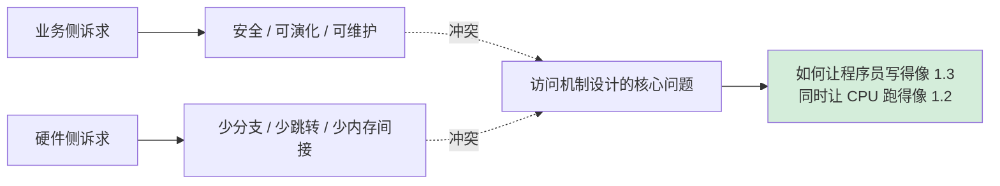

**接下来全文要回答的就是这一个问题**：现代编程语言用了哪些设计——从 vtable 到内联缓存，从访问修饰符到 JIT 内联——把"语义上的间接访问"翻译成"运行时近乎直接的内存读写"。

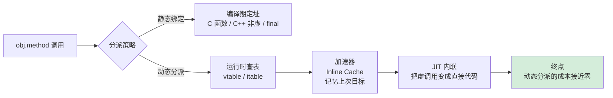

## 2. 访问模型设计哲学

### 2.1 核心设计原则

回到第 1 章那个银行账户案例，我们已经看到"直接 vs 间接"两种写法的拉扯。但现实工程中的访问设计远不止两种选择，这一节我们把多年来工业界沉淀下来的设计经验拆开看。

**先看一段反例代码**——一个真实项目里曾经出现过的设计：

```java
class Order {
    public List<Item> items;            // 1. 直接暴露集合
    public Map<String, String> attrs;   // 2. 又一个直接暴露的容器
    int internalId;                     // 3. 包内可见
    static int counter;                 // 4. 全局可改的静态变量

    public void update(Item i) {
        items.add(i);
        counter++;
        // 没有任何不变量保护
    }
}
```

这个类暴露了 4 个不同维度的访问入口，每个调用方都能用不同的方式访问 Order 内部状态。结果是什么？**任何一次重构都举步维艰**——因为你不知道有多少地方用了哪个入口。

**从这个反例中能提炼出三条设计准则**：

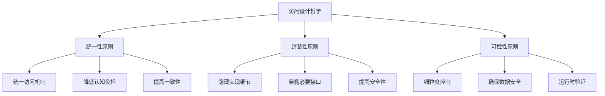

- **统一性原则**：上面的 Order 之所以难维护，根源是 4 种访问方式混用。统一意味着"读字段也好、调方法也好、走属性也好，调用方看到的形态一致"——这就是为什么 Kotlin/Swift 都引入 property，让外界看起来像字段、内部却是方法。
- **封装性原则**：`items.add()` 这种调用绕过了 Order 类，直接动了它的 List。封装的本质是**让调用方失去"绕过"的能力**——只能从你设计好的入口进。
- **可控性原则**：`counter++` 这种全局可写让任何线程都能改它。可控意味着**每一次访问都有清晰的责任主体**，越界时能定位到人。

**小结**（基于反例与三条准则）：访问设计的灵魂不是"加几个 private 关键字"，而是**主动地把对象的状态变更收拢到可控的少数路径上**——统一性收拢形态，封装性收拢入口，可控性收拢责任。后续所有机制都是这三条原则的具体落地。

### 2.2 访问模型演进

访问模型经历了从原始直接到智能优化的演进历程：

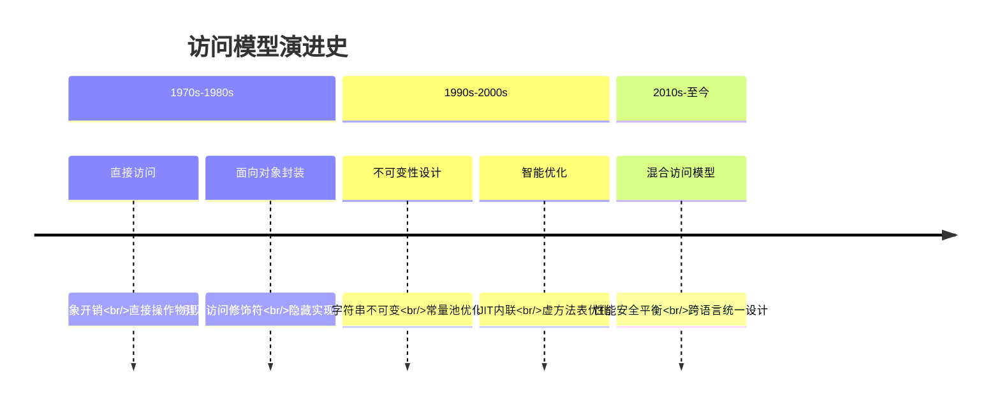

**演进动力**：性能需求驱动直接访问，安全性需求驱动间接访问，现代系统需要两者平衡。

### 2.3 直接访问模型

**先看一段真实的 C 代码**——这是 Linux 内核中常见的访问模式：

```c
int* array = malloc(100 * sizeof(int));
array[50] = 42;            // 一条 mov 指令搞定
int v = *(array + i);      // 指针算术，CPU 一条指令
```

这段代码编译出来的汇编只有一条核心指令：

```
mov [base + index*4], 42   ; 一条指令直达内存
```

**对比之下**，如果用 Java 访问数组 `array[50]`，JVM 会做：① 检查 array 是否为 null；② 检查 50 是否越界；③ 计算地址；④ 读写。**多了 3 步**。


**为什么 Linux 内核、嵌入式驱动、高频交易系统都选择了 C 这种直接访问？**——因为它们对每一纳秒都敏感。一个网络包处理函数被调用每秒上千万次，省下的每一条指令都是真金白银。

**但同样这种模式也带来了真实的事故**：

- **2014 年 OpenSSL Heartbleed 漏洞**：根因就是直接指针访问没做边界检查，攻击者能读出服务器内存里的密钥。
- **微软统计 70% 的安全漏洞**来自 C/C++ 内存安全问题——指针越界、悬空指针、use-after-free。

**有了真实案例做支撑，我们再来总结**：

- **设计优势**：性能最优（CPU 直接访问内存，无额外指令开销）；精确控制（完全控制内存布局，支持底层系统编程）；编译器优化空间大（内联、循环展开、向量化）。
- **设计风险**：安全性低（缓冲区溢出、悬空指针、内存泄漏）；错误易发（指针算术错误、类型转换错误）。
- **适用场景**：系统编程（操作系统、驱动）、性能关键型应用（数据库引擎、游戏引擎）、嵌入式系统。

**小结**（基于汇编对比 + 真实漏洞案例）：直接访问模型把"硬件能力"完整暴露给程序员——你拿到的是一把锋利无比的刀，能切最快的菜，也能切到自己。它的存在意义不是"过时"，而是**有意保留给最懂硬件、最在意性能、最愿意承担安全责任的少数场景**。

### 2.4 间接访问模型

继续上一节的对比。如果说 C 的数组访问是"裸奔"，那 Java 的数组访问就是"穿着护甲"。

**先看 Java 同样的访问代码做了什么**：

```java
int v = array[50];
```

这一行编译成字节码后，JVM 会执行：

```
1. 检查 array 是否为 null   → NullPointerException
2. 检查 50 是否在 [0, len)  → ArrayIndexOutOfBoundsException
3. 计算实际地址             → base + 50*4
4. 读取内存
```

**除了运行时检查，还多了一层抽象起了什么作用？看一个真实场景**。一个 Web 应用服务了 1 年后，GC 调优需要将 G1GC 换成 ZGC，这意味着堆上的对象会被移动位置。**如果是直接访问模式**，所有指向它们的指针都会变成野指针；**但在 Java 间接访问下**，上层代码零修改——因为上层拿到的是引用（句柄），物理地址变不变是 JVM 内部的事。


**这一层间接抽象交换来了三件事**：

1. **内存安全**：自动边界检查、空引用检查，Heartbleed 那类漏洞从语言层面被杰绝v
2. **自动管理**：GC 能移动、重排对象位置，上层代码不受影响
3. **运行时灵活**：反射、动态代理、热更新都依赖这层间接

**付出的代价也很具体**。还是那一行 `array[50]`：

```
直接访问（1 个 CPU 周期）：mov eax, [base+200]
间接访问（3-5 个 CPU 周期）：
  ├─ 引用检查  1 周期
  ├─ 地址解析  1-2 周期
  ├─ 边界检查  1 周期
  └─ 实际访问  1 周期
```

这反射出一个常被忽视的事实：**Java 这些年为什么不断调优 GC**？因为间接访问本身不贵，贵的是背后的运行时生态（GC、JIT、边界检查消除）。JIT 的重要使命之一就是：**能证明的检查全部去掉**，剩下的就是接近裸访问的速度。

**小结**（基于 GC 场景 + 周期量化）：间接访问不是"为安全而加几个 if"，而是**主动在调用方与真实内存之间插一层运行时**，让所有低层变换（GC移动、序列化、反射、热更新）都发生在这层之下、不打扰业务代码。付的几个周期买的是**运行时的可进化能力**。

### 2.5 混合访问模型

**问题引入**：不是所有代码路径都一样重要。在一个动辄处理上亿请求的服务里，**99% 的调用是蛮干活的常规逻辑**，**1% 的调用是热点重要路径**（比如订单序列化、定时批处理内循环）。**为了那 1% 犹豫不决是否换语言**，肯定不理智。

现代语言给出的答案是：**在统一语言内，提供两档访问能力**，调用方选择适合自己场景的那一档。

**实例 1：C++ 智能指针**——同一个指针两档访问：

```cpp
template<typename T>
class SmartPointer {
    T* raw_ptr;
    ControlBlock* ctrl;
public:
    T& safe_access() {                   // 安全档：业务代码用
        if (!raw_ptr || ctrl->is_deleted())
            throw std::runtime_error("Invalid");
        return *raw_ptr;
    }
    T& fast_access() noexcept {          // 性能档：热点循环用
        return *raw_ptr;
    }
};
```

**实例 2：Java 中的两档访问**：

```java
// 安全档：常规业务
List<Order> orders = new ArrayList<>();
orders.get(i);                           // 有边界检查

// 性能档：紧凑反序列化、嵌入式场景
Unsafe unsafe = ...;
unsafe.getInt(buffer, offset);          // 跳过边界检查、直接读内存
```

**实例 3：Rust 的哲学**——默认安全，需要性能时显式写 `unsafe { ... }` 块，让 Code Review 的注意力集中到这几十行，而不是全项目几十万行。Rust 是把"两档"明明白白写进语言关键字的语言：

```rust
let v = vec![1, 2, 3];
let x = v[2];              // 安全档：编译期+运行期边界检查
let y = unsafe { *v.get_unchecked(2) };  // 性能档：显式声明放弃检查
```

**实例 4：Go 的混合姿态**——Go 没有 `unsafe` 关键字（但有 `unsafe` 包），更偏向"用接口实现安全档、用 `unsafe.Pointer` 偶尔逃逸到性能档"：

```go
b := []byte{1, 2, 3, 4}
x := b[2]                                        // 安全：有 bounds check
p := (*int32)(unsafe.Pointer(&b[0]))             // 性能：直接 reinterpret
```

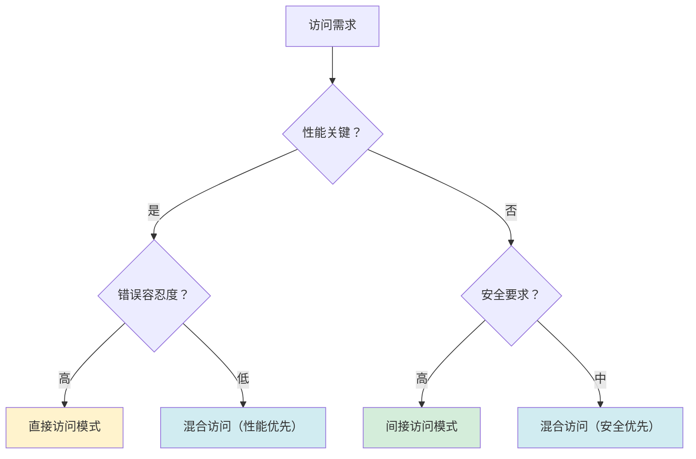

**小结**（基于三语言实例）：混合访问模型的本质不是"可以两档中都跳"，而是**让默认路径保证安全、让脱险路径显式可见**。程序员不会“不小心”写快路，只有“有意识”地选择。在 1% 的热点取性能，在 99% 的代码里拿安全。

### 2.6 模型决策树

**三个模型看过了，选哪个？**这不是一个拍脑问题，有明确的决策路径。

**先看三个真实项目的选型过程**：

- **案例 A：一家高频交易公司** —— 交易引擎需要微秒级响应，选择 C++ 裸指针（直接访问）+ 严格代码评审 + Sanitizer。宁愿多开 5 个代码评审会，也要赢那 100ns。
- **案例 B：某电商商家后台** —— 财务、订单、权限多人协作，选 Java（间接访问）+ Spring。快 100ns 没意义，不出事才重要。
- **案例 C：某游戏引擎** —— 热闹逻辑用 C++ 裸指针，脚本逻辑用 Lua（混合），听起来“充满妥协”，实际是**各路径严格取优**。

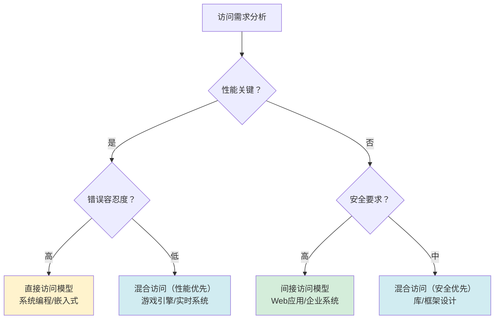

**三个模型的二维坐标**：


**小结**（基于三个项目选型 + 坐标图）：模型选择不是"哪个最好"，而是**你愿意为什么费甚么价**。选直接访问，就付出代码评审、内存安全工具、训练成本；选间接访问，就付出 GC 调优、运行时开销；选混合，就付出架构复杂性。**能意识到代价在哪里，比记住决策树重要得多**。

## 3. 内存访问机制

### 3.0 内存访问的通用三问

无论你写的是 C、Java、Go、Rust 还是 JavaScript，**任何语言运行时在访问"一个对象的字段"时，都必须回答以下三个问题**——区别只在**何时回答**、**由谁回答**、**回答得严不严**：

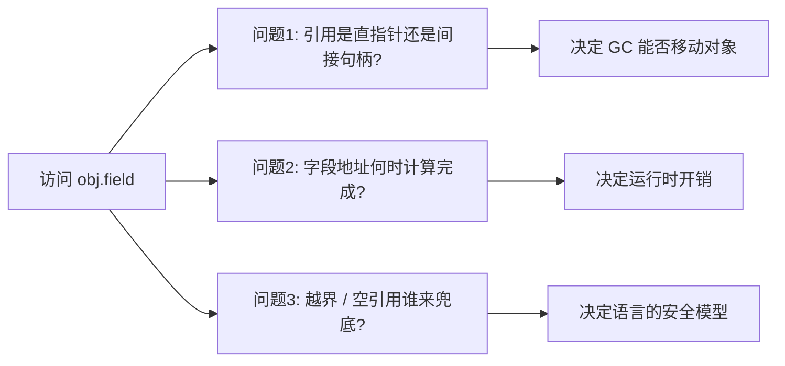

**问题 1：引用是"直接指针"还是"间接句柄"？**

- **直接指针**（C/C++/Go/Rust、HotSpot JVM 默认）：变量里直接存对象的物理地址，访问一次 load 完成。
- **间接句柄**（早期 JVM 实现、句柄式 GC）：变量存"句柄表索引"，先查表再访问对象，多一次寻址。
- **取舍**：直接指针快，但 GC 移动对象时要更新所有引用；句柄慢，但 GC 可以自由移动。

**问题 2：字段地址何时计算完成？**

| 何时计算 | 代表语言 | 机制 |
|---|---|---|
| **编译期完全确定** | C/C++/Rust 的非虚字段 | 偏移量被烧到指令的立即数里：`mov [rax+8], ...` |
| **链接期确定** | C 的全局变量、C++ 静态成员 | 链接器填地址 |
| **类加载期确定** | Java 字段访问 | JVM 在解析 `putfield` 时一次性填好偏移 |
| **首次执行时确定** | JavaScript 属性访问 | Hidden Class + Inline Cache 现学现用 |
| **每次访问都计算** | Python `obj.x`（无优化） | 走 `__dict__` 哈希表 |

**越靠左的语言越快，越靠右的语言越灵活**——这就是静态语言 vs 动态语言性能差距的最根本来源。

**问题 3：越界 / 空引用谁来兜底？**

| 兜底者 | 代表 | 后果 |
|---|---|---|
| **CPU 兜底** | C/C++ 解引用空指针 | SIGSEGV，进程崩溃，但读非空野指针不报错→静默错误 |
| **语言运行时兜底** | Java/Go/C# 字段访问 | NullPointerException / nil panic，可被 catch |
| **类型系统兜底** | Rust `Option<T>` | 编译期就必须解构，根本不存在"空指针访问" |
| **无人兜底** | C 数组越界 | 未定义行为，可能任何事都发生 |

**小结**：所有语言的"内存访问机制"，本质都是在**这三问的不同答案矩阵**里挑了一个组合。**没有最优组合，只有适合场景的组合**——后面几节的"三级地址 / 引用强度 / 内存布局"都是这三问的具体落地。

---

### 3.1 三级地址模型

**先看一个真实的系统崩溃案例**：2018 年某云服务商因内存管理错误，导致多个虚拟机互相访问对方内存，造成数据泄露和系统崩溃。**根因**：虚拟地址空间隔离失效。

**再看一个性能优化案例**：Linux 内核通过大页（Huge Pages）减少页表查找次数，将数据库查询性能提升 30%。**原理**：减少地址转换的层级。

**从这两个案例中，我们能理解三级地址模型的设计动机**：

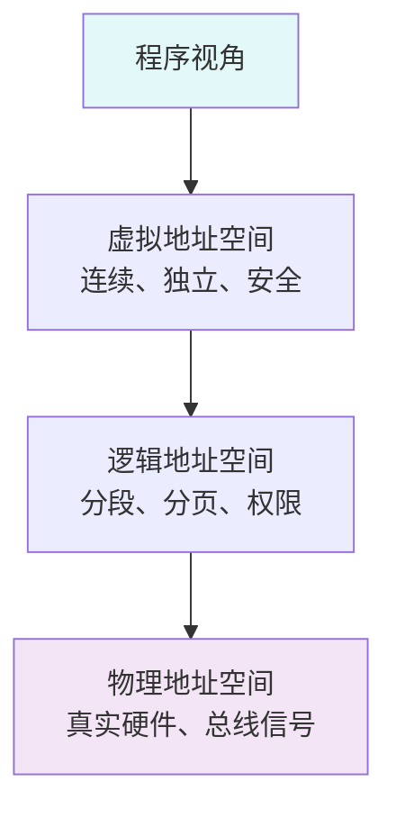

**这个三层抽象解决了三个真实问题**：

1. **解决内存碎片**：程序看到连续线性空间，无需关心物理内存被分割成多少块
2. **解决进程隔离**：每个进程有独立地址空间，A 进程无法访问 B 进程内存
3. **解决硬件差异**：程序不依赖具体内存布局，可在不同机器间移植

**地址转换流程**：
```
虚拟地址 → MMU转换 → 逻辑地址 → 页表查询 → 物理地址
    ↓           ↓           ↓           ↓
程序可见    权限检查    分段分页    硬件访问
```

**设计哲学**（基于上面两个案例）：
- **抽象分层**：每层解决特定问题，上层无需关心下层细节（如程序员不用管物理内存碎片）
- **安全隔离**：虚拟地址空间为每个进程提供独立内存视图（防止云服务商案例中的内存泄露）
- **硬件抽象**：程序无需关心物理内存布局和硬件特性（实现跨平台兼容）

**设计优势**（基于实际效果）：
- **内存保护**：每个进程有独立地址空间，防止非法访问（云服务商案例的教训）
- **内存共享**：不同进程可共享相同物理内存（只读/写时复制），提升性能
- **简化编程**：程序看到连续线性地址空间，无需管理物理内存碎片（大页优化的基础）

---

### 3.2 引用机制设计

**先看一个内存泄漏的真实案例**：某电商系统因循环引用导致 100GB 内存泄漏，系统运行 3 天后崩溃。**根因**：订单对象与物流对象互相强引用，GC 无法回收。

**再看一个缓存优化案例**：某图片处理应用使用软引用缓存缩略图，当内存紧张时自动释放，既保证性能又防止 OOM。

**从这两个案例中，我们能理解引用强度设计的意义**：

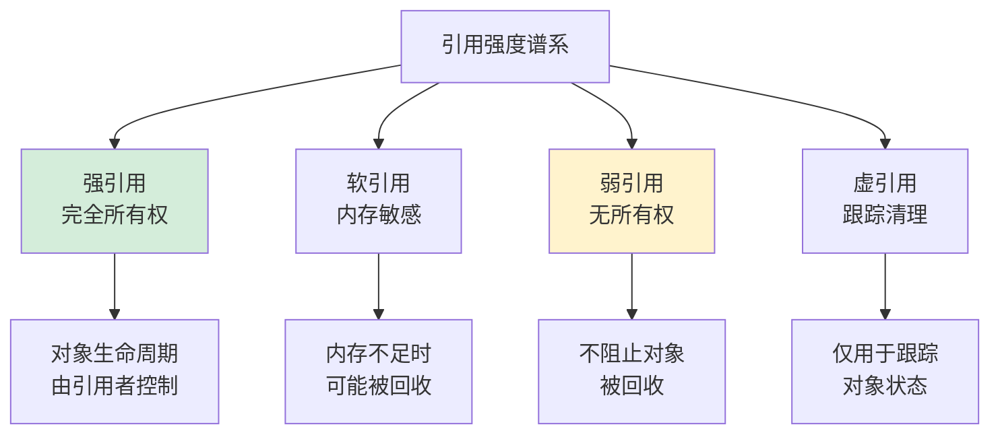

**引用类型设计哲学**（基于案例需求）：通过不同引用强度实现内存管理的灵活性和安全性平衡。

**引用强度对比**（解决实际问题）：

| 引用类型 | 所有权 | 阻止GC | 使用场景 | 解决案例 |
|---------|--------|--------|----------|----------|
| **强引用** | 完全 | 是 | 核心业务对象 | 订单、用户等核心数据 |
| **软引用** | 部分 | 内存不足时否 | 缓存、临时数据 | 图片缓存案例 |
| **弱引用** | 无 | 否 | 监听器、观察者模式 | 防止内存泄漏案例 |
| **虚引用** | 无 | 否 | 资源清理跟踪 | 文件句柄清理 |

**设计原理**（从问题到方案）：
- **生命周期管理**：通过引用强度控制对象存活时间（解决内存泄漏问题）
- **内存优化**：软引用在内存紧张时自动释放，优化内存使用（解决缓存优化问题）
- **解耦设计**：弱引用避免循环引用，实现对象间松耦合（解决电商系统案例）

**跨语言实现**：
- **Java**：`StrongReference`、`SoftReference`、`WeakReference`、`PhantomReference`
- **C++**：`std::shared_ptr`（强引用）、`std::weak_ptr`（弱引用）
- **Python**：引用计数 + 弱引用字典（`weakref` 模块）
- **JavaScript**：自动垃圾回收，`WeakRef`/`WeakMap` 提供弱引用

```cpp
// 引用机制的本质：控制对象生命周期
std::shared_ptr<Object> strong = std::make_shared<Object>();  // 强引用
std::weak_ptr<Object> weak = strong;                          // 弱引用

if (auto locked = weak.lock()) {  // 提升为强引用，安全访问
    locked->doSomething();
}
```

---

### 3.3 内存布局设计

**先看一个性能优化案例**：某游戏引擎通过对象池复用对象，将内存分配时间从 1ms 降到 0.1ms。**原理**：对象在池中连续存储，CPU 缓存命中率提升。

**再看一个内存对齐案例**：某数据库系统因结构体未对齐，在 ARM 处理器上性能下降 40%。**解决**：添加 `__attribute__((aligned(8)))` 后性能恢复。

**从这两个案例中，我们能理解内存布局设计的重要性**：

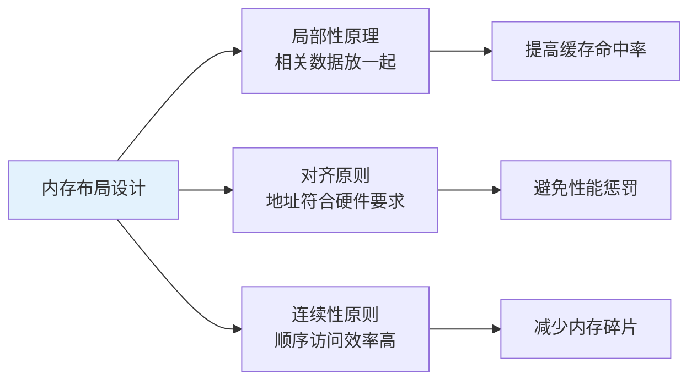

**对象内存布局**（基于硬件特性）：

```
+------------------+ ← 对象起始地址
| 对象头           | ← 类型指针、GC标记、锁信息
+------------------+
| 成员变量1        | ← 按声明顺序或大小排列
+------------------+
| 成员变量2        |
+------------------+
| 填充字节         | ← 内存对齐补齐
+------------------+
```

**关键设计决策**（解决实际问题）：

1. **对齐与填充**：硬件要求数据地址是特定值的倍数（如 8 字节对齐），编译器插入填充字节满足对齐要求（解决 ARM 性能问题）
2. **连续存储**：数组和结构体采用连续内存，便于通过 `基址 + 偏移` 快速定位（提升游戏引擎性能）
3. **对象头设计**：存储类型信息、GC 标记、同步锁，是运行时管理对象的元数据
4. **栈与堆分离**：局部变量在栈（快速、生命周期短），动态对象在堆（灵活、可控生命周期）
5. **指针压缩优化**：64 位 JVM 用 32 位偏移表示对象指针，节省 50% 引用内存（解决大内存应用问题）

### 3.4 地址计算原理

**核心思想**：通过数学公式将复杂的物理地址抽象为简单的逻辑寻址。

**基础公式**：`目标地址 = 基址 + 偏移量 × 元素大小`


**三种寻址模式**：

| 模式 | 公式 | 典型场景 |
|------|------|---------|
| **绝对寻址** | 直接给出地址 | 全局变量、静态变量 |
| **基址+偏移** | base + offset | 数组、对象成员 |
| **基址+变址×倍率** | base + index × scale | 数组下标访问 |

**先看一个真实场景**：一个程序要访问数组的第 50 个元素，CPU 实际执行了什么？

```
直接寻址（C 风格）：
  mov eax, [base + 200]   ← 1 条指令，200=50*4

间接寻址（Java 风格）：
  1. 检查 base 是否为 null
  2. 检查 50 是否在 [0, len)
  3. 计算 base + 200
  4. mov eax, [result]
```

**再看硬件支持**：现代 CPU 专门为寻址设计了复杂指令格式：

```nasm
; x86 的灵活寻址模式
mov eax, [rbx + rsi*4 + 8]   ; base + index*scale + displacement

; ARM 的预索引寻址
ldr x0, [x1, #16]!           ; 先加偏移再加载，并更新基址
```

**从这两个例子中，我们能提炼出地址计算的设计价值**：

- **统一寻址**：所有内存访问使用相同的计算模型，程序员只需掌握一种模式
- **硬件友好**：CPU 提供专用寻址指令，编译器能生成最优代码
- **编译优化空间**：常量偏移可在编译期计算完成，运行时零开销

**小结**（基于汇编对比 + CPU 指令集）：地址计算不是简单的加法，而是**硬件与编译器协同设计的精密机制**——既给程序员统一的抽象，又让 CPU 能高效执行。

```cpp
// 地址计算的本质
struct Point { int x; int y; };  // x 偏移=0, y 偏移=4
Point arr[100];

arr[50].y = 42;
// 编译器生成：mov [arr + 50*8 + 4], 42
//             基址  变址 倍率 偏移
```


## 4. 访问权限控制

**先看一个真实的安全事故**：2017 年 Equifax 数据泄露，攻击者利用 Apache Struts 的访问控制漏洞，获取了 1.47 亿用户数据。**根因**：一个本应 private 的方法被意外暴露为 public。

**再看一个重构案例**：某电商系统要把订单金额从 double 改为 BigDecimal 防止精度丢失。如果所有模块都直接访问 `order.amount`，需要改 200 个文件；如果通过 `getAmount()` 方法访问，只需改 1 个文件。

**从这两个案例中，我们能提炼出权限设计的核心理念**：

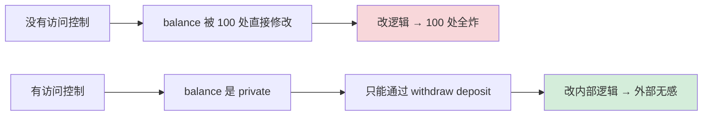

**设计目标层次**：

1. **安全性**：防止未授权访问和恶意操作（Equifax 教训）
2. **封装性**：隐藏实现细节，提供清晰接口（重构案例）
3. **可维护性**：便于重构和扩展
4. **性能平衡**：在安全和性能之间取衡

**本质总结**：访问控制是**通过限制可见性来降低系统复杂度**——对外暴露最小接口（契约），对内保护不变量（正确性）。

### 4.2 权限级别体系

**权限级别金字塔**：

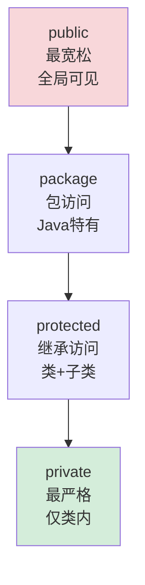

**权限范围对比**：

| 权限 | 类内 | 同包 | 子类 | 全局 | 典型用途 |
|------|------|------|------|------|---------|
| **private** | ✅ | ❌ | ❌ | ❌ | 内部状态、辅助方法 |
| **protected** | ✅ | ✅ | ✅ | ❌ | 模板方法、抽象接口 |
| **package** | ✅ | ✅ | ❌ | ❌ | 包内协作、隐藏实现 |
| **public** | ✅ | ✅ | ✅ | ✅ | 公开 API、外部接口 |

### 4.3 权限实现机制

不同语言选择了不同的权限检查时机，体现出不同的设计哲学：

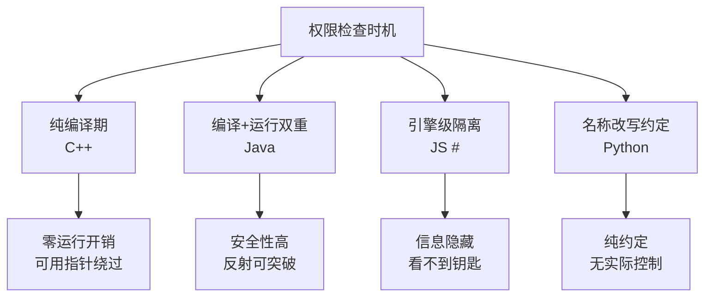

> 1.C++：纯编译期检查，零运行时开销

C++ 的访问控制**完全在编译期完成**，编译后的二进制中没有任何访问权限信息：

```cpp
class Foo {
 private:
    int secret = 42;
};

Foo f;
f.secret;  // 编译错误：'secret' is private

// 但在二进制层面，secret 就是对象偏移量0处的一个int
// 用指针算术可以直接访问（未定义行为，但能"工作"）：
int* p = reinterpret_cast<int*>(&f);
*p;  // 42，绕过了访问控制
```

**编译器的实现**：

```
1. 解析类定义，记录每个成员的访问级别（AST上的标记）
2. 在名称查找（name lookup）阶段，检查访问者的上下文：
   - 当前函数属于哪个类？
   - 当前类与目标类的继承关系？
   - 是否是 friend？
3. 如果访问违规 → 编译错误
4. 如果合法 → 生成与无访问控制完全相同的机器码

→ 运行时开销：零。完全是编译器在做静态分析。
```

friend 的实现也很简单——编译器在检查访问权限时，额外查一下目标类的 friend 列表。

> 2.Java：编译期 + 运行时双重检查

**编译期**：javac 像 C++ 一样做静态检查。

**运行时**：JVM 在以下场景做额外检查——

```
// 反射访问
Field f = Account.class.getDeclaredField("balance");
f.get(account);  // IllegalAccessException（运行时检查）

f.setAccessible(true);  // 关闭检查（Java 9+ 受模块系统限制）
f.get(account);  // 成功
```

**字节码层面**：

```
每个字段/方法在 .class 文件中有 access_flags：

ACC_PUBLIC    = 0x0001
ACC_PRIVATE   = 0x0002
ACC_PROTECTED = 0x0004
ACC_STATIC    = 0x0008
...

JVM 在链接（linking）阶段验证这些标志：
1. 类加载时：检查类的访问权限
2. 方法调用时：检查方法的访问权限
3. 字段访问时：检查字段的访问权限

违规 → 抛出 IllegalAccessError（不是编译错误，是运行时异常）
```

为什么 Java 需要运行时检查？因为 Java 支持**动态加载**——一个类可能在编译时还不存在，无法在编译期完成所有检查。

> 3.JavaScript `#` 私有字段：引擎级隔离

```javascript
class Foo {
    #x = 10;
    getX() { return this.#x; }
}
```

V8 引擎实现：

```
1. #x 不是普通的字符串属性名
2. 引擎为每个类的 #x 生成一个唯一的内部 Symbol（类似UUID）
3. 只有类定义的词法作用域内才知道这个 Symbol
4. 外部代码无法构造这个 Symbol → 无法访问

本质：不是"检查你有没有权限"，而是"你根本不知道钥匙长什么样"
```

这和 C++/Java 的"我知道名字但被拒绝"不同——JS 私有字段是**信息隐藏**而非**访问控制**。

### 4.4 跨语言权限对比

**核心总结**：访问权限的设计原理是**通过限制可见性来降低系统复杂度**。

**各语言设计对比**（七语言全景）：

| 语言 | 可见性单位 | 检查时机 | 安全强度 | 可绕过性 | 实现机制 |
|---|---|---|---|---|---|
| **C** | 翻译单元（static） | 编译期 | 低 | 高（强转指针） | 链接器符号可见性 |
| **C++** | 类 + friend | 编译期 | 低 | 高（`reinterpret_cast`） | 名称查找规则 |
| **Java** | 类 + 包 + 模块（Java 9+） | 编译 + 运行 | 高 | 中（`setAccessible`） | `access_flags` 字节码标志 |
| **Go** | **包**（首字母大小写决定） | 编译期 | 中-高 | 难（需 `unsafe`） | 编译器在符号导出表中过滤 |
| **Rust** | **模块**（pub / pub(crate) / pub(super)） | 编译期 | 高 | 几乎不能（需 `unsafe`） | 模块系统 + 借用检查器 |
| **JS `#`** | 类 | 引擎级 | 最高 | 零 | 内部 Symbol 隔离 |
| **Python** | 无（仅约定 `_x` / `__x`） | 无 | 零 | 零 | 名称改写（`__x` → `_ClassName__x`） |

**特别说明 Go 的可见性设计**——它不是用关键字而是用**标识符的首字母大小写**来决定可见性：

```go
package account
type BankAccount struct {
    Balance  float64    // 大写开头 → exported（包外可见）
    owner    string     // 小写开头 → unexported（仅包内可见）
}
func (a *BankAccount) Withdraw(amt float64) {}   // 大写 → 包外可调
func (a *BankAccount) check() {}                 // 小写 → 包内私有
```

这种设计的**好处是契约 100% 显而易见**：你不需要去类的定义里翻找 `private/public` 标签，只看名字就知道。**代价是改名即破坏 API**——把 `balance` 改成 `Balance` 是一次 ABI 变更。

**Rust 的模块可见性**——比所有语言都更细粒度：

```rust
mod account {
    pub struct BankAccount {
        balance: f64,                // 默认：仅 account 模块可见
        pub(crate) audit_log: Vec<String>,  // 整个 crate 可见
        pub(super) parent_ref: u32,         // 上一级模块可见
        pub interest_rate: f64,              // 完全公开
    }
}
```

**设计哲学差异**：

- **C**：可见性是"链接级"的，函数加 `static` 关键字就只在本文件可见，否则全局符号
- **C++**：信任程序员，性能为上，"不要为你不使用的东西付费"
- **Java**：企业级安全，多重检查，适合大型系统；Java 9 模块系统补足了"包不够用"的痛点
- **Go**：用**最简单的语法**（大小写）做最强的承诺——可见性从代码风格层面就一目了然
- **Rust**：把可见性当作**类型系统的一部分**，配合借用检查器实现"编译期安全 + 零运行时开销"
- **JS**：动态语言的变革，从约定走向引擎级隔离
- **Python**："我们都是成年人"，只靠约定，保持语言简洁

**本质揭示**：所有语言在**"谁能看到什么"这个维度上建立边界**，区别只是**边界什么时候、由谁、以多严格的方式去守护**——这正是 §3.0 通用三问中"问题 3：谁来兜底"在 OOP 维度上的具体表现。

## 5. 函数调用机制

### 5.0 函数调用的通用骨架七步

**不管你用哪种语言，一次函数调用在底层都做了同样的七件事**——区别只在**谁做**（编译器/JIT/解释器/虚拟机）、**在什么时候做**（编译期/链接期/运行期）、**做得多不多事**（要不要 GC barrier、要不要 type check、要不要 JIT hook）：


**七步骨架在五大语言中的"承担者"**：

| 步骤 | C/C++ | Java（JVM） | Go | JavaScript（V8） | Python（CPython） |
|---|---|---|---|---|---|
| ① 传参数 | 编译器按 ABI 填寄存器/栈 | 字节码 `invokeXxx` 用操作数栈 | 编译器按 Go ABI 填寄存器（Go 1.17+） | JIT 生成机器码或解释器读字节码 | 解释器构造 `PyFrameObject` 的 fastlocals |
| ② 压返回地址 | CPU 的 `call` 指令 | JVM 在 Frame 中记录 returnPC | CPU `CALL` | CPU `call`（JIT） / VM bookkeeping | CPython 在 frame 链表里串好 |
| ③ 建栈帧 | `push rbp; sub rsp, N` | JVM 申请 Frame（含 局部变量表 + 操作数栈） | runtime 检查栈是否够，需要则触发栈复制 | V8 申请 `JSFrame` | 申请 `PyFrameObject` |
| ④ 执行函数体 | 机器码顺序执行 | JIT 编译成机器码 or 解释器 | 机器码 | 机器码 or 字节码 | 解释器逐字节码执行 |
| ⑤ 设置返回值 | 放 `rax` / `xmm0` | 压回 caller 的操作数栈顶 | 多返回值走寄存器或栈 | 放 V8 Result 槽 | 写入 caller frame |
| ⑥ 销栈帧 | `leave; ret` | 弹出 Frame | runtime 缩栈或保持 | 释放 JSFrame | 释放 PyFrameObject |
| ⑦ 跳回调用点 | CPU `ret` | 字节码 `return*` | CPU `RET` | CPU `ret` | 解释器 `dispatch` 跳回上一帧 |

**这张表想说明的最重要一件事**：

> **函数调用不是某种语言特有的"语法"，而是一台抽象计算机器必须实现的协议**——只要你的语言支持"调用即返回"的嵌套语义，你就必须实现这七步。区别只是**把这七步藏到哪一层**。

- C 把七步全暴露给程序员（必要时可手写汇编）
- Java/JS 把七步藏在虚拟机里，业务代码只能写到第 ④ 步的"函数体"
- Python 把七步藏在解释器里，性能代价是 C 的 10-100 倍

**后面 §5.1-§5.4 讨论的所有具体机制——栈帧布局、虚函数分派、调用约定、优化技术——都是在回答这七步如何更高效地实现**。

---

### 5.1 调用本质分析

**函数调用的本质**：程序控制流的有序转移和状态保护机制。

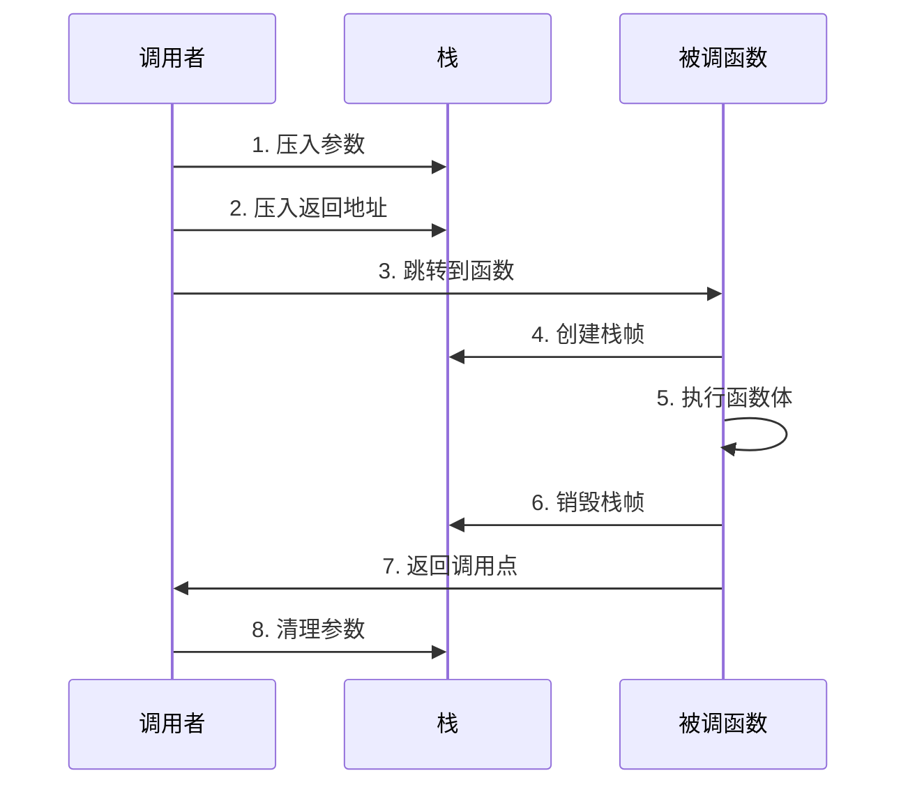

**先看一个真实的系统崩溃案例**：2019 年某电商系统因递归调用过深导致栈溢出，双十一期间服务中断 2 小时。**根因**：订单处理递归深度失控，栈空间耗尽。

**再看一个性能优化案例**：某编译器通过优化调用约定，将函数调用开销从 15 周期降到 8 周期，性能提升 45%。

**从这两个案例中，我们能提炼出函数调用的设计哲学**：


**设计哲学四原则**（基于案例教训）：

1. **状态隔离**：每个函数调用有独立执行环境，互不干扰（防止电商系统案例中的调用链污染）
2. **可恢复性**：调用完成后能精准回到调用点继续执行（保证程序流程的正确性）
3. **传递统一**：标准化的参数传递与返回机制（调用约定）（实现性能优化案例中的效率提升）
4. **性能权衡**：在安全性、灵活性和速度之间动态平衡（栈空间 vs 调用开销的权衡）

**生命周期五阶段**：
```
准备阶段 → 调用阶段 → 执行阶段 → 返回阶段 → 清理阶段
   ↓         ↓         ↓         ↓         ↓
参数准备   控制转移   函数执行   结果返回   状态恢复
```

### 5.2 栈帧设计原理

**先看一个真实的系统崩溃案例**：2019 年某电商系统因递归调用过深导致栈溢出，双十一期间服务中断 2 小时。**根因**：订单处理递归深度失控，栈空间耗尽。

> 🌐 **跨语言旁注**：栈帧设计是所有语言的共性话题，深度讨论见下一篇《04.函数调用栈与栈帧设计》。本节只点出与"访问机制"直接相关的部分。

**这个案例引出了栈设计的核心问题**：如何在有限的栈空间中实现无限深度的函数调用？

```mermaid
graph TD
    A[高地址] --> B[参数区<br/>caller 压入]
    B --> C[返回地址<br/>call 指令压入]
    C --> D[保存的帧指针<br/>old rbp]
    D --> E[局部变量区<br/>函数内部变量]
    E --> F[临时存储区<br/>表达式计算]
    F --> G[低地址 rsp]
    
    style C fill:#fff3cd
    style D fill:#fff3cd
```

**再看一个性能优化案例**：某编译器通过优化调用约定，将函数调用开销从 15 周期降到 8 周期，性能提升 45%。

**从这两个案例中，我们能理解栈帧的四大设计原则**：

1. **LIFO 原则**：后进先出，与函数调用嵌套天然契合（解决递归深度问题）
2. **状态封装**：每个栈帧包含完整的执行上下文（参数、返回点、局部变量）（保证调用隔离）
3. **地址相对化**：通过 `rbp + offset` 寻址，与栈位置解耦（实现栈帧复用）
4. **自动管理**：编译器自动生成 prologue/epilogue 代码，无需手动管理（提升开发效率）

**栈帧生命周期**（汇编级本质）：

```nasm
; 函数序言 (Prologue)
push rbp           ; 保存调用者的帧指针
mov  rbp, rsp      ; 建立新帧指针
sub  rsp, N        ; 为局部变量预留空间

; ... 函数体 ...

; 函数尾声 (Epilogue)
mov  rsp, rbp      ; 恢复栈指针
pop  rbp           ; 恢复调用者帧指针
ret                ; 跳转回返回地址
```

**栈溢出防护**：操作系统在栈底设置 guard page（保护页），访问时触发页错误，避免静默损坏堆内存。

### 5.3 虚函数调用机制

**核心问题**：编译时不知道具体类型，运行时如何调用正确的函数？

```mermaid
flowchart LR
    A[obj.foo 调用] --> B[读取 obj 第一字<br/>vptr]
    B --> C[读取 vptr+offset<br/>函数地址]
    C --> D[call 该地址]
    
    style A fill:#e3f2fd
    style D fill:#d4edda
```

**vtable 机制本质**：

```
对象内存布局：               vtable（类级别共享）：
+--------+                  +---------+
| vptr   | --------------> | foo 地址 |  ← 偏移 0
+--------+                  +---------+
| field1 |                  | bar 地址 |  ← 偏移 8
+--------+                  +---------+
| field2 |                  | baz 地址 |  ← 偏移 16
+--------+                  +---------+
```

**四大设计原则**：
1. **间接调用**：通过函数指针表实现动态绑定
2. **类型携带**：对象内嵌 vptr，永远知道自己是谁
3. **继承兼容**：子类 vtable 前缀与父类一致，多态安全
4. **最小开销**：仅多 1-2 次内存读取 + 间接跳转

**跨语言虚调用对比**：

| 语言 | 实现机制 | 单次开销 | 优化手段 |
|------|---------|---------|---------|
| **C++** | vptr + vtable | 2 次 load + 间接 jump | 去虚化（devirtualization） |
| **Java** | invokevirtual + vtable | 同 C++ | JIT 推测性内联 |
| **Go** | itab 双指针 | 间接 call | 接口缓存 |
| **Swift** | Witness Table | 间接 call | 协议表优化 |
| **JS V8** | Hidden Class + IC | IC 命中=1 次比较 | 单态/多态 IC |

**性能代价**：虚调用比静态调用多 1-2 个周期，最大代价是**不友好于 CPU 分支预测**——目标地址要从内存读取，无法预先准备。

### 5.4 调用性能优化

**调用开销分解**：

```
一次函数调用总开销 = 参数传递 + 控制转移 + 栈帧管理 + 清理返回
            ≈ 1-2      + 1-3     + 4-6     + 1-2
            ≈ 7-13 个 CPU 周期
```

**优化策略全景**：

```mermaid
graph TB
    A[函数调用优化] --> B[静态优化]
    A --> C[动态优化]
    
    B --> B1[函数内联<br/>消除调用本身]
    B --> B2[尾调用优化<br/>复用当前栈帧]
    B --> B3[寄存器传参<br/>避免压栈]
    
    C --> C1[JIT 推测性内联<br/>基于运行时类型]
    C --> C2[内联缓存<br/>记忆调用目标]
    C --> C3[去虚化<br/>final/未被覆写]
    
    style B1 fill:#d4edda
    style C2 fill:#d4edda
```

**各优化手段的收益**：

| 优化手段 | 节省周期 | 适用场景 | 实现者 |
|---------|---------|---------|--------|
| **函数内联** | 全部调用开销 | 小函数、热点函数 | 编译器 / JIT |
| **尾调用优化** | 栈帧创建 | 递归函数末尾调用 | 编译器 |
| **寄存器传参** | 参数压栈 | 参数 ≤4（x86）/≤6（x64） | 调用约定 |
| **PGO** | 分支预测优化 | 频繁调用路径 | 编译器 + Profile |

> 内联是其中最强大的优化手段，下一章详细讨论。

## 6. 内联函数机制

### 6.0 内联的通用三问

在讨论各语言的 `inline` / `#[inline]` / JIT 内联之前，先把所有语言都要面对的三个根本问题摆出来：

```mermaid
flowchart TD
    Q1[问题1: 为什么要内联?] --> A1[消除调用开销 + 打开后续优化大门]
    Q2[问题2: 什么时候该内联?] --> A2[函数体小 / 调用频繁 / 类型可知]
    Q3[问题3: 由谁决定内联?] --> A3[程序员 / 编译器 / JIT / 三者博弈]
```

**问题 1：为什么要内联？——不是为了省那几条指令**

| 真正价值 | 说明 |
|---|---|
| 消除调用开销 | 省去 ~7-13 个 CPU 周期（参数传递 + 栈帧 + 跳转） |
| **打开优化大门**（更重要） | 内联后编译器看到了被调函数的"内部"，可以做常量传播、死代码消除、循环融合、向量化等跨函数优化 |
| 减少寄存器压力 | 调用约定要求 caller-saved 寄存器在调用前压栈，内联后可省 |

**问题 2：什么时候该内联？——成本/收益的拉锯**

- ✅ **该内联**：函数体 < 10 行、调用频繁、类型在调用点已知
- ❌ **不该内联**：函数体 > 200 行、递归、调用点很少（节省的开销 < 代码膨胀的 I-Cache 代价）

**问题 3：由谁决定内联？——各语言的哲学分歧**

| 决定者 | 代表语言 | 哲学 |
|---|---|---|
| **程序员显式建议** | C/C++ `inline` / Rust `#[inline]` | 信任程序员对热点的判断 |
| **程序员强制要求** | Kotlin `inline fun` / Rust `#[inline(always)]` | 内联是语义的一部分（如内联 Lambda 避免装箱） |
| **编译器自动决策** | Go / Swift / Rust 默认 | 编译器有最完整的 IR 视野 |
| **JIT 运行时决策** | Java HotSpot / JS V8 / .NET RyuJIT | JIT 知道**实际**的类型和热度，能做静态编译器做不到的"推测性内联" |
| **完全不内联** | Python（CPython）/ 多数解释器 | 解释执行没有"内联"的概念 |

**JIT 的杀手锏**：能内联**虚函数**！静态编译器看到 `animal.speak()` 时不知道是 Cat 还是 Dog，只能调虚表；JIT 在统计 10000 次调用都是 Cat 后，可以"赌"它就是 Cat，直接把 `Cat::speak` 内联进来——猜错了就去优化（deoptimize）退回去。

**小结**：所有语言关于内联的设计，都是在"**程序员表达力**、**编译器自动化**、**运行时智能**"三角中找平衡点。理解这三问，下面具体讨论 C++/Java/Rust/Kotlin 的差异就有了统一坐标系。

---

### 6.1 内联设计动机

**先看一个真实的性能瓶颈案例**：某高频交易系统因函数调用开销过大，导致交易延迟超标。**分析**：一个简单的 `add(a, b)` 函数，有用工作只有 1 条加法指令，但调用开销却有 7-8 条指令。

**再看一个代码维护案例**：某大型项目因过度使用宏函数，导致代码难以调试和维护。**教训**：宏函数虽然零开销，但破坏了代码结构和调试能力。

**从这两个案例中，我们能理解内联设计的根本动机**：

```mermaid
flowchart TD
    A[调用 add a b 的真实开销] --> B[1. 参数传递]
    B --> C[2. 保存现场]
    C --> D[3. call 跳转]
    D --> E[4. 建立栈帧]
    E --> F[5. 执行 return a+b<br/>真正有用的业务]
    F --> G[6. 销毁栈帧]
    G --> H[7. ret 返回]
    H --> I[8. 恢复现场]
    
    style F fill:#d4edda
    style B fill:#fff3cd
    style C fill:#fff3cd
    style D fill:#fff3cd
    style E fill:#fff3cd
    style G fill:#fff3cd
    style H fill:#fff3cd
    style I fill:#fff3cd
```

**根本动机**（基于性能瓶颈案例）：消除函数调用开销，同时保留函数的抽象能力——**让程序员写得像函数，让 CPU 跑得像内联代码**。

**核心观察**：对于小函数，调用开销远大于函数本身计算量。内联的核心思想是：**把函数体直接嵌入调用点，消除调用/返回的全部开销**。
对于**小函数**，调用开销远大于函数本身计算量。内联的核心思想是：**把函数体直接嵌入调用点，消除调用/返回的全部开销**。

### 6.2 内联实现原理

**三大设计价值**：

```mermaid
graph TB
    A[内联的价值链] --> B[性能价值与抽象价值兼得]
    A --> C[函数调用完全消失]
    A --> D[打开后续优化大门]
    
    D --> D1[常量传播]
    D --> D2[死代码消除]
    D --> D3[循环向量化]
    D --> D4[寄存器分配优化]
```

**1）编译器内联的完整流程**：

```
源码:
  inline int square(int x) { return x * x; }
  int b = square(5);

内联展开（IR 中）:
  b = 5 * 5         ← 函数体复制到调用点

常量折叠（后续优化）:
  b = 25            ← 编译期直接算出结果

机器码:
  mov [b], 25       ← 连计算都消失了
```

**2）真正价值：不是省几条指令，是打开优化大门**

```
没有内联时：
void process(int x) {
    int y = transform(x);   ← 编译器不知道 transform 做了什么
    if (y > 0) { ... }      ← 无法判断 y 范围
}

内联 transform 后：
void process(int x) {
    int y = x * 2 + 1;      ← 编译器看到了实现
    if (y > 0) { ... }      ← 如果 x>=0，y 必>0，可消除分支
}
```

**3）编译器决策模型**（成本-收益）：

```mermaid
graph LR
    A[决策模型] --> B[收益]
    A --> C[成本]
    
    B --> B1[消除调用开销]
    B --> B2[暴露优化机会]
    B --> B3[减少寄存器压力]
    
    C --> C1[代码膨胀]
    C --> C2[I-Cache 压力]
    C --> C3[编译时间]
```

决策伪代码：
```
if (函数体 < 10行)        → 几乎总是内联
if (函数体 > 200行)       → 不内联
if (递归函数)              → 不内联或有限展开
if (调用在热路径)         → 倾向内联（PGO 指导）
```

**4）JIT 内联——比静态编译更聪明**

JIT 拥有静态编译器没有的优势：**运行时信息**。

```
animal.speak()  ← 统计运行10000次，9999次是 Cat

JIT 生成推测性内联代码：

  if (animal.class == Cat) {       ← 类型守卫
      // Cat::speak 函数体直接内联（快速路径）
      printf("meow");
  } else {
      animal.speak();  ← 慢速路径：走虚表
  }

→ 如果假设不成立 → 去优化（deoptimize）退回解释执行
→ JIT 能内联虚函数！静态编译器做不到
```

### 6.3 跨语言内联对比

**内联机制跨语言全景**：

| 语言 | 关键字 | 语义 | 实际内联决策者 |
|------|--------|------|----------------|
| **C/C++** | `inline` | 建议 | 编译器（GCC/Clang/MSVC） |
| **C++** | `constexpr` | 编译期求值 | 编译器（必须可内联） |
| **Java** | 无 | - | JIT（HotSpot C2） |
| **JavaScript** | 无 | - | JIT（V8 TurboFan） |
| **Kotlin** | `inline` | **强制** | 编译器（保证内联 Lambda） |
| **Rust** | `#[inline]` | 建议 | LLVM 后端 |
| **Rust** | `#[inline(always)]` | 强制 | LLVM（强制内联） |
| **Go** | 无 | - | Go 编译器自动决策 |

**三大设计哲学**：

```mermaid
flowchart TB
    A[内联哲学] --> B[C++ 学派<br/>程序员建议+编译器决策]
    A --> C[Java/JS 学派<br/>完全交给 JIT]
    A --> D[Kotlin 学派<br/>语义需要才强制]
    
    B --> B1[静态编译可控性强]
    C --> C1[运行时数据更准]
    D --> D1[Lambda 零成本抽象]
```

### 6.4 内联性能分析

**副作用：代码膨胀（Code Bloat）**

```
void bigFunc() { /* 200行代码 */ }

如果被内联到 100 个调用点：
→ 200 × 100 = 20000 行代码膨胀
→ 可执行文件剧增
→ I-Cache 命中率下降
→ 性能反而变差！
```

**内联使用经验法则**：

| 函数体大小 | 内联决策 |
|----------|---------|
| < 10 行（~50 IR 指令） | 几乎总是内联 |
| 10-50 行 | 看调用频率和热点度 |
| > 50 行 | 通常不内联（单调用点除外） |

**内联失败的典型场景**：

```
❌ 递归函数 → 无限展开
❌ 函数指针调用 → 地址不确定
❌ 虚函数（静态编译器） → 类型不确定
❌ 跨翻译单元 → 看不到函数体（LTO 可解决）
```

**本质总结**：内联函数 = **用编译器的力量，让你写函数但不付函数调用的代价**。真正价值不是省几条指令，而是**打破函数边界，给编译器暴露更大的优化视野**。

## 7. 跨语言访问机制

> 🧭 **本章导读**：前面 §2-§6 讨论的是"通用骨架"，本章把骨架填上各语言的肉。每一节都按"**核心机制 → 内存布局图 → 一段对照代码 → 与通用骨架的对应关系**"四段式展开。

### 7.1 Java 访问机制

**核心机制**：Java 通过**句柄（Handle）**或**直接指针（Direct Pointer）**两种方式访问对象，HotSpot 选择了直接指针方式以追求性能。

```mermaid
graph LR
    A[栈上 obj 引用] --> B[堆中对象]
    B --> C[对象头<br/>Klass Pointer]
    C --> D[方法区<br/>类元数据]
    D --> E[vtable<br/>方法入口表]
    
    style A fill:#e3f2fd
    style E fill:#d4edda
```

**两种访问方式对比**：

| 方式 | 访问路径 | 优势 | 劣势 |
|------|---------|------|------|
| **句柄方式** | 引用→句柄池→对象 | GC 友好（移动对象不改引用） | 多一次间接寻址 |
| **直接指针**（HotSpot） | 引用→对象 | 访问快 | GC 移动需更新所有引用 |

**方法调用机制**：

```java
// 字段访问：编译期确定偏移量
account.balance = 100;       // putfield 指令 + 字段偏移
                             // 等价于：[obj_addr + balance_offset] = 100

// 方法调用：通过 vtable 实现多态
animal.speak();              // invokevirtual 指令
                             // 1. 读取 obj 的 Klass Pointer
                             // 2. Klass 中查 vtable
                             // 3. vtable[speak_index] → 实际函数地址
                             // 4. 调用该地址
```

**HotSpot 的优化**：JIT 在热点路径用**类型守卫 + 内联缓存**把动态分派降到接近直接调用的开销。

### 7.2 C++ 访问机制

**核心机制**：C++ 对象访问的核心是**编译时确定偏移量**，运行时只做地址计算和虚表查询。

```mermaid
graph TB
    A[obj.field 访问] --> A1[编译期: 计算 field 偏移]
    A1 --> A2[运行期: load base+offset]
    
    B[obj.method 调用] --> B1{是否 virtual}
    B1 -->|否| C1[静态分派<br/>编译期定址 call]
    B1 -->|是| C2[动态分派<br/>vptr → vtable → call]
    
    style C1 fill:#d4edda
    style C2 fill:#fff3cd
```

**三大访问机制**：

1. **成员变量访问**：编译期计算字段偏移量
   ```cpp
   struct Foo { int a; double b; };  // a 偏移=0, b 偏移=8
   foo.b = 3.14;
   // 编译为：mov [foo_addr + 8], 3.14
   ```

2. **虚函数调用**：通过对象内嵌的 vptr 找 vtable
   ```cpp
   class Base { virtual void foo(); };
   class Derived : public Base { void foo() override; };
   Base* p = new Derived();
   p->foo();  // vptr → vtable → Derived::foo()
   ```

3. **多重继承**：对象包含多个 vptr，指针转换需调整偏移量（thunk）
   ```cpp
   class A {};  class B {};
   class C : public A, public B {};
   // C 对象布局：[A 子对象 | B 子对象]
   // (B*)c_ptr 需要加上 sizeof(A) 的偏移
   ```

**C++ 设计哲学**："不要为你不使用的东西付费"——非虚函数零开销，虚函数仅为多态付费。

### 7.3 JavaScript 访问机制

**核心机制**：JavaScript 对象访问基于 V8 的**隐藏类（Hidden Class / Shape）**和**内联缓存（Inline Cache, IC）**，让动态语言达到接近静态语言的访问效率。

```mermaid
flowchart LR
    A[obj.x 第一次访问] --> B[查找 obj 的 Shape]
    B --> C[Shape 中查 x 的偏移]
    C --> D[读取 obj base+offset]
    D --> E[IC 缓存 Shape+offset]
    
    F[obj.x 后续访问] --> G{Shape 是否相同}
    G -->|是 单态| H[直接用缓存偏移<br/>1 次比较+1 次 load]
    G -->|否 多态| I[退化为字典查找]
    
    style H fill:#d4edda
    style I fill:#fff3cd
```

**三大核心技术**：

1. **隐藏类（Hidden Class）**：V8 为每种对象结构生成一个 Shape，记录属性名→偏移的映射。相同结构的对象共享同一 Shape。

   ```javascript
   const a = { x: 1, y: 2 };  // Shape S0: {x:0, y:8}
   const b = { x: 3, y: 4 };  // 共享 Shape S0
   // 访问 a.x 和 b.x 用相同的偏移
   ```

2. **内联缓存（IC）**：调用点缓存上次访问的 Shape 和偏移：
   - **单态 IC**：所有访问对象 Shape 相同 → 最快路径
   - **多态 IC**：少数几种 Shape → 多次比较
   - **多形 IC**：超过阈值 → 退化为慢速字典查找

3. **原型链查找**：访问不存在的属性时，沿 `__proto__` 链向上查找，这是 JS 最昂贵的访问路径。

**性能陷阱**：动态添加/删除属性会破坏 Shape 共享，导致 IC 失效，这是 JS 性能优化的核心点。

### 7.4 Go 访问机制

**核心机制**：Go 的对象访问比 C++/Java 更扁平——没有继承、没有 vtable 嵌入对象，**所有"多态"统一通过 interface（接口）实现**，背后是 `itab` 双指针机制。

```mermaid
flowchart LR
    A[var w io.Writer = file] --> B[interface 值<br/>= 两个指针]
    B --> C1[*itab<br/>类型 + 方法表]
    B --> C2[*data<br/>具体对象]
    C1 --> D[itab.fun 0 = File.Write 地址]
    style C1 fill:#fff3cd
    style C2 fill:#d4edda
```

**Go 的三大访问机制**：

1. **结构体字段访问**：和 C 一样，编译期算偏移
   ```go
   type Point struct { X, Y int32 }
   p := Point{1, 2}
   // 访问 p.Y 编译为：mov [p_addr + 4], ...
   ```

2. **接口方法调用**：通过 itab 双指针
   ```go
   var w io.Writer = os.Stdout
   w.Write([]byte("hi"))
   // 1. 从 w 中取 *itab
   // 2. 从 itab.fun[0] 取得 Write 函数地址
   // 3. 调用该地址
   // → 比 C++ 虚函数多一次间接，但 itab 是 type+interface 对的全局缓存
   ```

3. **逃逸分析**：决定对象在栈还是堆
   ```go
   func makePoint() *Point {
       p := Point{1, 2}     // 看似栈对象
       return &p            // 编译器发现地址逃逸 → 自动改到堆上
   }
   ```

**Go 哲学**：用**最简单的对象模型**（结构体 + 接口）做最实用的事。**没有继承**意味着没有多重继承的 thunk 复杂性，**接口隐式实现**意味着零侵入设计——但**接口方法调用比静态调用多一次间接寻址**，这是简单性的代价。

### 7.5 Rust 访问机制

**核心机制**：Rust 同时提供**两种多态机制**——编译期单态化（zero-cost）和运行时 trait object（动态分派），由程序员显式选择。

```mermaid
flowchart TB
    A[Rust 的多态] --> B[泛型 impl Trait<br/>编译期单态化]
    A --> C[dyn Trait<br/>运行时 vtable]
    B --> B1[每种类型生成独立机器码<br/>零运行时开销, 但代码膨胀]
    C --> C1[fat pointer = data + vtable<br/>1 次间接, 灵活]
    style B fill:#d4edda
    style C fill:#fff3cd
```

**1. 单态化泛型**——零成本抽象的核心：

```rust
fn print<T: Display>(x: T) { println!("{}", x); }

print(42_i32);     // 编译器生成 print::<i32> 的专版
print("hi");       // 又生成 print::<&str> 的专版
// → 没有任何运行时分派，每个版本都是直接调用
```

**2. trait object（`dyn Trait`）**——运行时多态：

```rust
let shapes: Vec<Box<dyn Shape>> = vec![
    Box::new(Circle { r: 1.0 }),
    Box::new(Square { side: 2.0 }),
];
for s in &shapes {
    s.area();   // 通过 vtable 间接调用
}

// Box<dyn Shape> 在内存里是 fat pointer：
// +---------+---------+
// | data ptr| vtable  |
// +---------+---------+
// vtable 在 .rodata 段全局共享，每种实现一份
```

**3. 字段访问**——和 C++ 一样的编译期偏移，**但有借用检查器保护**：

```rust
struct Account { balance: f64 }
let acc = Account { balance: 100.0 };
// 编译期：偏移 0
// 借用检查器：保证不会有两个 &mut 同时存在 → 编译期消除数据竞争
```

**Rust 哲学**：**"不付的代价才是零成本"**——默认编译期单态化（无运行时开销），需要异构集合才用 `dyn Trait`，且每次显式写 `dyn` 关键字，让性能成本可见。

### 7.6 Python 访问机制

**核心机制**：Python 把 **"灵活性最大化"** 当作一等公民——所有属性查找走**字典 + MRO（方法解析顺序）**，慢但极其灵活。

```mermaid
flowchart LR
    A[obj.x 访问] --> B[查 obj.__dict__]
    B --> C{找到?}
    C -->|是| D[返回]
    C -->|否| E[查 type obj .__mro__]
    E --> F{遍历继承链}
    F -->|找到 descriptor| G[调 __get__]
    F -->|普通属性| H[返回]
    F -->|没找到| I[调 __getattr__]
    style B fill:#fff3cd
    style E fill:#fff3cd
```

**1. 字段访问的真实开销**：

```python
class Account:
    def __init__(self, b):
        self.balance = b

acc = Account(100)
acc.balance     # 等价于：
                # 1. type(acc).__mro__ 链查找 descriptor
                # 2. 没有 → 查 acc.__dict__["balance"]
                # 3. 返回值
                # → 比 C 的字段访问慢 10-100 倍
```

**2. 方法调用 = 属性查找 + 调用**：

```python
acc.withdraw(10)
# 实际执行：
#   bound_method = acc.withdraw     ← 属性查找（同上）
#   bound_method(10)                ← 函数调用
```

**3. `__slots__` 优化**——告别字典：

```python
class Account:
    __slots__ = ['balance']         # 显式声明字段
    def __init__(self, b):
        self.balance = b
# → 字段存储改为 C 数组，访问从"哈希查表"变成"偏移寻址"
# → 内存 -40%，访问速度 +30%
```

**Python 哲学**：**默认灵活，需要快时显式优化**——`__slots__`、`@property`、Cython、PyPy JIT 都是为了在 1% 的热点处换回性能，99% 的代码继续享受动态灵活性。

### 7.7 七语言访问机制全景对照表

| 维度 | C | C++ | Java | Go | Rust | JavaScript | Python |
|---|---|---|---|---|---|---|---|
| **字段地址确定** | 编译期偏移 | 编译期偏移 | 类加载期偏移 | 编译期偏移 | 编译期偏移 | Shape + IC | `__dict__` 哈希 |
| **多态机制** | 无（函数指针手动） | vtable（虚函数） | invokevirtual + vtable | itab 双指针 | dyn vtable 或单态化 | Hidden Class + IC | MRO + 字典 |
| **类型信息携带** | 无 | RTTI（可选） | Klass Pointer（强制） | 接口里的 *type | 单态化无 / dyn 有 | Shape（演化中） | `type()` 全程可查 |
| **典型字段访问开销** | 1 cycle | 1 cycle | 1-2 cycle | 1 cycle | 1 cycle | 1-3 cycle（IC 命中） | 50-100 cycle |
| **典型方法调用** | 1 call | 静态 1 / 虚 2-3 | 1-3 cycle（JIT 后） | 2-3 cycle | 静态 1 / dyn 2 | 1-3 cycle | 200+ cycle |
| **可见性单位** | 翻译单元 | 类 + friend | 类 + 包 + 模块 | 包（大小写） | 模块（细粒度 pub） | 类（# 字段） | 仅约定 |
| **优化手段** | 编译器优化 | 去虚化 / LTO / constexpr | JIT 内联 / 逃逸分析 / 去虚化 | 内联 / 逃逸分析 | LLVM 单态化 / LTO | TurboFan 推测内联 | `__slots__` / PyPy JIT |

### 7.8 统一翻译表 JVM ↔ V8 ↔ Go ↔ C++ ↔ Rust

不同语言术语长得不一样，但讲的常常是同一件事。下面这张表帮你"打通任督二脉"：

| 概念 | JVM | V8 | Go runtime | C++ | Rust |
|---|---|---|---|---|---|
| **类型描述符** | Klass | Map / Shape | _type | type_info（RTTI） | TypeId（仅 reflect） |
| **方法分派表** | vtable in Klass | DescriptorArray | itab.fun[] | vtable | vtable in trait object |
| **字段元信息** | InstanceKlass.fields | DescriptorArray | rtype.fields | offsetof 编译期 | 编译期布局 |
| **对象头** | _mark + _klass | Map ptr | typePtr + GC bits | vptr（如有虚函数） | 无（除非 trait object） |
| **调用缓存** | InlineCacheBuffer | FeedbackVector + IC | 无（itab 是全局表） | 无 | 无 |
| **代码内联** | C2 IR inline | TurboFan inline | gc inline | Compiler / LTO | LLVM inline pass |
| **去虚化** | CHA + 守卫 | Map check + 推测 | 编译器有限做 | LTO + final | 单态化天然零虚 |
| **反射访问** | java.lang.reflect | Reflect API | reflect 包 | RTTI + 库 | std::any / TypeId 受限 |

**这张表的实用价值**：你在读 JVM 文档看到 `vtable`，在读 V8 文档看到 `FeedbackVector`，在读 Go 源码看到 `itab`——**它们解决的是同一个问题：让动态分派快到接近静态调用**。

### 7.9 跨语言访问机制对比总结

**跨语言访问机制全景对比**：

```mermaid
flowchart TB
    A[访问机制设计谱系] --> B[静态分派<br/>编译期定址]
    A --> C[半静态分派<br/>vtable 查表]
    A --> D[动态分派<br/>运行时学习]
    
    B --> B1[C 函数<br/>C++ 非虚<br/>final / static]
    C --> C1[C++ 虚函数<br/>Java invokevirtual<br/>Swift Witness Table]
    D --> D1[JS Hidden Class+IC<br/>JIT 推测性内联<br/>Self/Smalltalk PIC]
    
    style B1 fill:#d4edda
    style C1 fill:#fff3cd
    style D1 fill:#d1ecf1
```

**核心设计对比表**（完整七语言版见 §7.7）：

| 维度 | C | C++ | Java | Go | Rust | JavaScript | Python |
|---|---|---|---|---|---|---|---|
| **字段访问** | 编译期偏移 | 编译期偏移 | 编译期偏移 | 编译期偏移 | 编译期偏移 | Shape + IC | 字典哈希 |
| **多态实现** | 函数指针手动 | vtable | invokevirtual + vtable | itab 双指针 | dyn vtable / 单态化 | Hidden Class + IC | MRO 字典链 |
| **类型信息** | 无 | RTTI 可选 | Klass 强制 | 接口含 *type | 单态化无 / dyn 有 | Shape 运行时演化 | 全程可查 |
| **典型开销** | 1 cycle | 1-2 cycle | 1-3 cycle | 1-2 cycle | 0-2 cycle | IC 命中 1-3 cycle | 50-200 cycle |
| **优化手段** | 编译器优化 | 去虚化 / LTO | JIT 内联 / 逃逸分析 | 内联 / 逃逸分析 | 单态化 / LTO | TurboFan 推测 | `__slots__` / PyPy |

**通用设计灵魂**：

所有 OOP 语言的访问机制都在解决同一个核心矛盾——**多态的灵活 vs 调用的高效**：

```
设计共识 = vtable + Inline Cache
              ↓                ↓
         结构上的快         统计上的快
       （查表代替查找）   （记忆上次结果）
              ↓
       现代 CPU 上的胜利：
       动态分派的成本接近静态调用
```

**三大演进趋势**：

1. **静态化**：能在编译期确定的就在编译期确定（去虚化、final、模板）
2. **预测化**：运行时数据指导优化（PGO、JIT 推测性内联、IC）
3. **分层化**：解释 → 基础编译 → 优化编译 → 去优化的多层架构

---

## 8. 一句话总结与七字真言

### 8.1 一句话总结

> **对象和函数的访问机制**，本质是在**多态的灵活**与**调用的高效**之间寻找平衡。
> 所有现代 OOP 语言的答案惊人地一致：**vtable 提供结构上的快，Inline Cache 提供统计上的快，JIT 内联打破虚调用的性能边界**——背后是 CPU 分支预测和缓存的胜利。

### 8.2 七字真言

1. **封装即剥夺绕过能力**——不是加 `private`，是让调用方"想绕都没路"。
2. **偏移决定一切**——字段访问的本质是 `base + offset`，越早算定越快。
3. **多态靠表+缓存**——vtable 是结构上的快，IC 是统计上的快，两者缺一不可。
4. **JIT 内联破虚墙**——静态编译器无法内联虚函数，JIT 可以（用类型守卫赌一把）。
5. **可见性是大语义**——它决定演化成本，不只是"能不能调用"。
6. **零成本只对没用的**——Rust 的"零成本抽象"本质是"只为你用的付费"。
7. **动态语言靠预测**——V8 / TurboFan / PyPy 的灵魂都是"赌大概率"。

### 8.3 七字真言的五语言映射

| 真言 | C/C++ 落地 | Java 落地 | Go 落地 | Rust 落地 | JS/Python 落地 |
|---|---|---|---|---|---|
| ① 封装即剥夺 | private + Pimpl | private + 模块 | 小写标识符 | pub 可见性 | `#x` / `_x` |
| ② 偏移决定一切 | 编译期 offsetof | 类加载期填充 | 编译期 | 编译期 | Shape + IC |
| ③ 多态靠表+缓存 | vtable | vtable + JIT IC | itab 全局表 | dyn vtable | Hidden Class + IC |
| ④ JIT 内联破虚墙 | 无 JIT（LTO 去虚化） | C2 推测内联 | 编译器有限去虚 | 单态化天然零虚 | TurboFan 推测 |
| ⑤ 可见性是大语义 | static / extern | private/package/module | 大小写 | pub(crate/super) | # 引擎隔离 |
| ⑥ 零成本只对没用的 | C 哲学 | 不适用（有 GC/JIT） | 不适用（有 GC） | Rust 灵魂 | 不适用 |
| ⑦ 动态语言靠预测 | 不适用 | JIT 推测 | 不适用 | 不适用 | V8 / PyPy 灵魂 |

### 8.4 语言无关声明

> 本章所有讨论的**访问机制原理**——封装、可见性、偏移寻址、虚函数分派、内联缓存、JIT 内联、单态化——**对 C / C++ / Java / Go / Rust / Python / JavaScript / Swift / Kotlin 等所有主流语言都成立**。各家语言只是在"**何时确定偏移**"、"**谁来分派多态**"、"**谁来兜底访问错误**"三个维度上做了不同的权衡。理解了通用骨架，再去看任何一门具体语言的实现，都只是"骨架上挂不同的肉"。

## 🔗 延伸阅读

- ← [08.对象创建流程原理](./08.对象创建流程原理.md)：对象是如何被创建的
- → [04.泛型设计灵魂思想](./04.泛型设计灵魂思想.md)：另一种"延迟决定"的设计
- → [10.反射与元编程核心设计](./10.反射与元编程核心设计.md)：访问机制的极致延伸
- → [31.内存模型技术设计](./31.内存模型技术设计.md)：内存访问的底层基础
