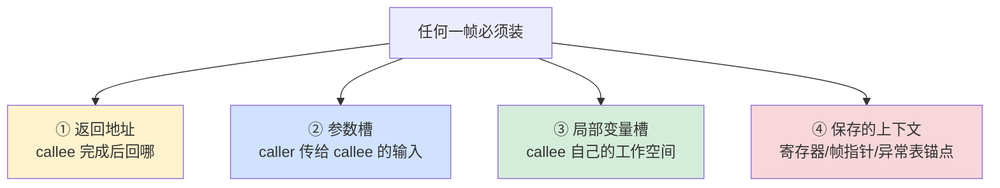
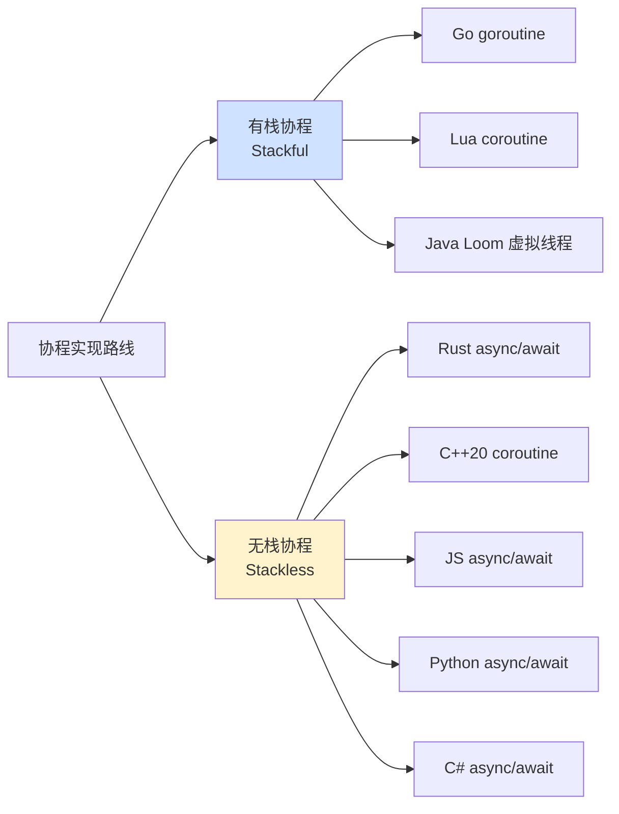
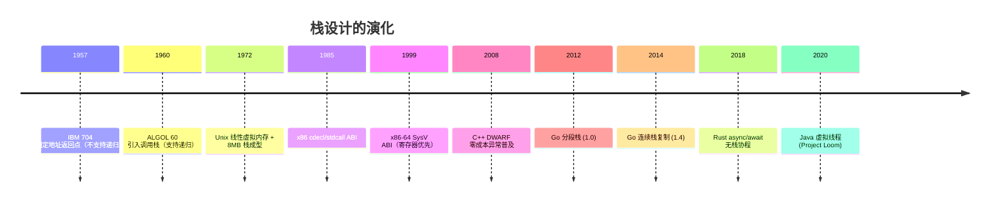
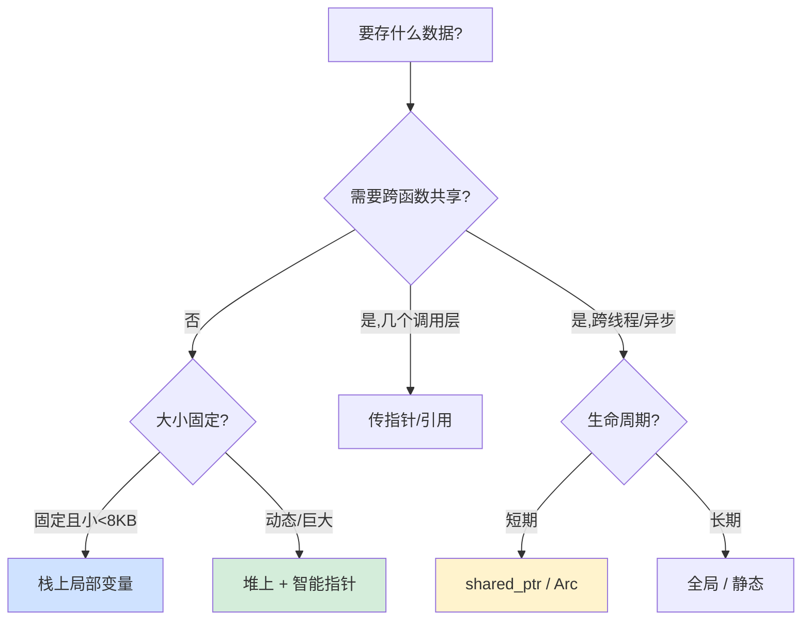

# 2.4 函数栈帧原理

> 📍 **本篇位置**：第 2 卷 · 运行时模型 · 第 4 篇
> 🎯 **核心矛盾**：**函数调用看起来是"我喊你、你回我"的简单逻辑，但 CPU 只懂 jmp，它根本不知道"回到哪里"——所有"调用即返回"的魔法，都是栈这个数据结构做出来的精密戏法**
> 🧭 **设计灵魂**：调用栈不是"语法糖"，而是**计算机科学最伟大的硬件-软件协议之一**——它把"嵌套的调用关系"翻译成"线性的内存增长"，让递归、参数传递、局部变量、异常展开、调试回溯全部成为可能
> 🌐 **跨平台覆盖**：x86-64 SysV ABI / Windows x64 ABI / ARM64 AAPCS · JVM 栈帧 · V8 / Python frame · Go goroutine 分段栈
> 🔗 **延伸阅读**：← [2.3 对象和函数访问原理](./2.3.对象和函数访问原理.md) · → [2.5 字节码与虚拟机执行原理](./2.5.字节码与虚拟机执行原理.md) · → [2.8 异常机制设计原理](./2.8.异常机制设计原理.md) · → [4.x 内存布局](../04.内存的真相/) · → [3.x 协程与栈切换](../03.并发的设计/)

---

> 上一章我们看到了"对象与函数访问"如何被解析成偏移量。但当我们真正运行起来后，一连串问题随之而来：**为什么函数能层层调用又层层返回？参数到底是怎么传过去的？为什么递归过深会栈溢出？为什么在 C 里返回局部变量地址是大忌？**
>
> 这些看似各自独立的问题，其实都指向一个核心数据结构——**调用栈（Call Stack）**。本章从一个工作中遇到的"诡异栈溢出"案例出发，剖开调用栈和栈帧的内部构造，理解 ABI 这个"无形契约"。

### 目录介绍

- [00.真实事故引入](#00真实事故引入)
  - [0.1 四语言同构的栈溢出事故](#01-四语言同构的栈溢出事故)
  - [0.2 灵魂三问](#02-灵魂三问)
  - [0.3 本篇的探索路径](#03-本篇的探索路径)
  - [0.4 问题价值分析](#04-问题价值分析)
- [01.栈的诞生原理](#01栈的诞生原理)
  - [1.0 栈的通用必要性](#10-栈的通用必要性)
  - [1.1 早期无栈调用](#11-早期无栈调用)
  - [1.2 栈调用关系](#12-栈调用关系)
  - [1.3 SP/BP/PC协作](#13-spbpc协作)
  - [1.4 栈为什么向"低地址"增长](#14-栈为什么向低地址增长)
  - [1.5 Linux默认栈为何是8MB](#15-linux默认栈为何是8mb)
- [02.栈帧解剖原理](#02栈帧解剖原理)
  - [2.0 栈帧的通用四要素](#20-栈帧的通用四要素)
  - [2.1 栈帧内部结构](#21-栈帧内部结构)
  - [2.2 局部变量定位](#22-局部变量定位)
  - [2.3 返回局部变量地址是大坑](#23-返回局部变量地址是大坑)
  - [2.4 栈对齐原理](#24-栈对齐原理)
- [03.调用约定原理](#03调用约定原理)
  - [3.1 ABI定义](#31-abi定义)
  - [3.2 传参演进](#32-传参演进)
  - [3.3 三大主流 ABI 对比](#33-三大主流-abi-对比)
  - [3.4 caller-saved vs callee-saved](#34-caller-saved-vs-callee-saved)
  - [3.5 可变参数函数的暗坑](#35-可变参数函数的暗坑)
- [04.栈展开：异常如何穿透多层函数](#04栈展开异常如何穿透多层函数)
  - [4.1 异常抛出时栈上发生了什么](#41-异常抛出时栈上发生了什么)
  - [4.2 DWARF异常机制](#42-dwarf异常机制)
  - [4.3 RAII由栈展开机制保证](#43-raii由栈展开机制保证)
  - [4.4 跨语言边界抛异常的灾难](#44-跨语言边界抛异常的灾难)
- [05.尾调用优化原理](#05尾调用优化原理)
  - [5.1 尾调用的本质：调用即跳转](#51-尾调用的本质调用即跳转)
  - [5.2 TCO尾调用优化：复用栈帧](#52-tco尾调用优化复用栈帧)
  - [5.3 哪些语言强制TCO哪些不支持](#53-哪些语言强制tco哪些不支持)
  - [5.4 手动改造：把递归变成迭代](#54-手动改造把递归变成迭代)
- [06.协程与分段栈：栈的现代演化](#06协程与分段栈栈的现代演化)
  - [6.1 协程为什么需要"自己的栈"](#61-协程为什么需要自己的栈)
  - [6.2 三种协程栈策略](#62-三种协程栈策略)
    - [6.2.1 大栈方案（C++ Boost.Coroutine 早期）](#621-大栈方案c-boostcoroutine-早期)
    - [6.2.2 分段栈（Go 1.0-1.3）](#622-分段栈go-10-13)
    - [6.2.3 连续栈（Go 1.4+，Rust async 启发）](#623-连续栈go-14rust-async-启发)
  - [6.3 协程切换本质：保存SP+PC](#63-协程切换本质保存sppc)
  - [6.3.5 有栈协程 vs 无栈协程：现代分水岭](#635-有栈协程-vs-无栈协程现代分水岭)
  - [6.4 栈的现代演化时间线](#64-栈的现代演化时间线)
- [07.经典陷阱与生产级反模式](#07经典陷阱与生产级反模式)
  - [7.1 陷阱一：栈上巨型局部变量](#71-陷阱一栈上巨型局部变量)
  - [7.2 陷阱二：返回栈地址](#72-陷阱二返回栈地址)
  - [7.3 陷阱三：alloca/VLA隐藏炸弹](#73-陷阱三allocavla隐藏炸弹)
  - [7.4 陷阱四：递归过深无终止条件](#74-陷阱四递归过深无终止条件)
  - [7.5 陷阱五：跨线程访问栈对象](#75-陷阱五跨线程访问栈对象)
  - [7.6 陷阱六：协程假设栈地址固定](#76-陷阱六协程假设栈地址固定)
  - [7.7 陷阱七：长函数栈帧](#77-陷阱七长函数栈帧)
  - [7.8 跨语言陷阱速查表](#78-跨语言陷阱速查表)
- [08.一句话总结](#08一句话总结)
  - [8.1 三层认知阶梯](#81-三层认知阶梯)
  - [8.2 栈帧设计的决策树](#82-栈帧设计的决策树)
  - [8.3 七字真言](#83-七字真言)
  - [8.4 七字真言的五语言映射](#84-七字真言的五语言映射)
  - [8.5 语言无关声明](#85-语言无关声明)
  - [8.6 与下篇的承接](#86-与下篇的承接)

---

## 00.真实事故引入

> 💡 **语言无关声明**：本章讨论的栈帧、ABI、栈展开、尾调用、协程栈等机制，对 **C / C++ / Java / Go / Rust / Python / JavaScript** 等所有支持函数调用嵌套的语言都成立。各语言只是把同一套机制实现在不同层（OS 线程栈 / JVM 栈 / goroutine 栈 / Python frame 链 / V8 JSFrame），但**只要有"调用即返回"语义，就有栈这个数据结构**。

### 0.1 四语言同构的"栈溢出事故"

**先看一个跨语言通用现象**：**只要语言有调用栈，深递归 × 大局部就会爆**——区别只在栈大小、增长策略和报错形式。下面是同一类事故在四种语言里的真实表现：

```cpp
// 1. C++：递归扫描连通域（图像处理）
void floodFill(int x, int y, Image& img) {
    char buffer[1024 * 1024];   // 栈上 1MB 局部缓冲
    floodFill(x+1, y, img);
}
// 4K 图像递归 8 层 → SIGSEGV
// 错误：Segmentation fault
```

```java
// 2. Java：深嵌套 JSON 解析（递归下降）
List<Object> parse(JsonNode node) {
    return node.children().stream()
               .map(this::parse)               // 递归
               .collect(Collectors.toList());
}
// 攻击者构造 10000 层嵌套 JSON → 栈溢出
// 错误：java.lang.StackOverflowError
```

```go
// 3. Go：单 goroutine 深递归（理论场景，Go 会自动扩栈）
func recurse(n int) int {
    var buf [10 * 1024]byte    // 10KB 栈上局部
    if n == 0 { return 0 }
    return recurse(n - 1) + int(buf[0])
}
// 递归 100000 层时，goroutine 栈反复翻倍扩展到 1GB 后
// 错误：runtime: goroutine stack exceeds 1000000000-byte limit
```

```python
# 4. Python：递归解析嵌套字典
def walk(node):
    if isinstance(node, dict):
        return {k: walk(v) for k, v in node.items()}
    return node

# 默认递归上限 1000 层就报错
# 错误：RecursionError: maximum recursion depth exceeded
```

**四种语言的报错形式不一样**：

| 语言 | 报错形式 | 栈大小 | 扩张策略 |
|---|---|---|---|
| C/C++ | SIGSEGV（直接段错误） | OS 默认 8MB | 不扩，撞 guard page 即崩 |
| Java | StackOverflowError（可 catch） | JVM 默认 1MB / 线程 | 不扩，到上限抛异常 |
| Go | runtime panic | 初始 2KB / goroutine | **自动翻倍**到 1GB 上限 |
| Rust | abort / SIGSEGV | 同 C | 同 C |
| Python | RecursionError（可 catch） | 默认 1000 帧逻辑深度 | 不扩，到 `sys.getrecursionlimit()` 抛错 |
| JS（V8） | RangeError: Maximum call stack | 大约 10-15000 帧 | 不扩 |

**但本质都是同一件事**：

> **每次函数调用都要在栈上分配一个栈帧**——只要栈帧里有大数组、或者调用深度过深，栈空间就会耗尽。**栈不是无限的**，这是所有支持嵌套调用的语言的共同物理事实。

下面以 C++ 为例展开，因为它最接近物理硬件，能让我们看到栈"真实长什么样"。其他语言只是把这套机制包了一层抽象。

### 0.1.1 C++ 案例细节

某次我维护一个图像处理服务，里面有一段递归扫描连通域的代码（典型的 flood fill 算法）：

```cpp
void floodFill(int x, int y, Image& img) {
    if (x < 0 || x >= img.w || y < 0 || y >= img.h) return;
    if (img.visited[y][x]) return;
    img.visited[y][x] = true;
    
    char buffer[1024 * 1024];   // 1 MB 局部缓冲（用于颜色比较）
    // ... 业务逻辑 ...
    
    floodFill(x+1, y, img);
    floodFill(x-1, y, img);
    floodFill(x, y+1, img);
    floodFill(x, y-1, img);
}
```

这段代码在测试用的小图（100×100）上跑得很好。**线上换成 4K 图（3840×2160）后，递归不到 10 层就 segfault**。

**第一反应**：是不是数组越界？是不是图像数据损坏？

但用 `gdb` 拉下来 core 看，崩溃位置是 `floodFill` 入口的第一条指令——**SP 寄存器指向的地址在物理内存里"不存在"**。

```
(gdb) bt
#0  0x00007fff in floodFill (...)
(gdb) info registers rsp
rsp 0x7ffe00000ff8     ← 已经远低于栈段起始
(gdb) p $rsp - <栈底>
$1 = -8388608          ← 已经溢出 8MB 栈
```

**根因**：那个不起眼的 `char buffer[1024 * 1024]` 是栈上 1MB 局部数组。Linux 默认线程栈是 8MB，**8 层递归就吃光了**。

**修复方案**：

```cpp
void floodFill(int x, int y, Image& img) {
    // ... 边界检查 ...
    auto buffer = std::make_unique<char[]>(1024 * 1024);   // 改到堆上
    // ...
}
```

或者更彻底地把递归改成迭代（用显式队列）。问题立刻消失。

### 0.2 灵魂三问

这次事故让我反复追问三个问题：

1. **为什么 Linux 默认栈只有 8MB？为什么不能"按需扩展"？** —— 栈到底是被谁分配的？为什么不像堆那样可以无限增长？
2. **如果我把 `char buffer[1024*1024]` 改成 `int x; int y; int z;` 几个普通局部变量，递归 10 万层都没事——这两者凭什么差距如此之大？** —— 栈帧到底"长"什么样？局部变量为什么按"数量"几乎不耗栈？
3. **为什么 `return &local_var;` 在 C 里是大坑，但在 Java / Go 里却毫无问题？** —— 同样是局部变量，凭什么在不同语言里命运迥异？

如果你能回答这三个问题，你就理解了**为什么调用栈是"语言抽象"和"硬件现实"的最重要桥梁**。

### 0.3 本篇的探索路径


### 0.4 问题价值分析

读到这里你可能会想：调用栈不就是"栈数据结构 + push/pop"吗？至于花一整章？

我想抛三个**几乎每个工程师都见过、却很少有人能解释清楚**的问题：

1. **为什么 64 位机器上 `long` 类型参数和 `int` 类型参数的传递成本一样？** —— 这是 SysV ABI 把前 6 个整型参数全放寄存器的设计。
2. **为什么 `printf("%d", x)` 这样的可变参数函数，在 ARM 上和 x86 上的实现差异巨大？** —— ARM AAPCS 强制可变参数走栈，x86 SysV 部分走寄存器。
3. **为什么 Go 的 goroutine 默认只用 2KB 栈，却能承载百万协程？而 Java 线程默认 1MB 栈，几千个就吃光内存？** —— Go 用了**分段栈 / 连续栈复制**这个革命性设计。

如果你能答出第 1 题，你理解了**寄存器传参的演化逻辑**；
如果你能答出第 2 题，你理解了**ABI 不是"实现细节"而是"硬协议"**；
如果你能答出第 3 题，你理解了**协程时代栈设计的根本性变革**。

这一章我们就要把这三个谜底，连同它们背后的整套设计哲学，**让你亲手推导出来**。

---

## 01.栈的诞生原理

要理解栈帧设计，先回到一个根本问题：**计算机为什么必须有"栈"这个东西？**

### 1.0 栈的通用必要性

**先说结论**：**只要一门语言支持"函数调用嵌套"（包括递归），它的运行时就必须有某种"栈结构"**——无论这门语言长什么样、跑在哪种硬件上、解释还是编译。

**为什么必须？看一个反证**：

```
设想一门没有"栈"的语言：
  main() 调 A()，A 调 B()，B 调 C()
  
  问题 1：B 返回时，CPU 怎么知道要回到 A 中的哪一行？
          → 必须有地方记录"返回地址"
          
  问题 2：A 还没返回，它的局部变量 x 必须留着
          但 B 也用 x → A 的 x 和 B 的 x 怎么共存？
          → 必须有"分层存储"
          
  问题 3：递归 fib(10) 同一个函数被嵌套调用 10 次
          → 10 份独立的局部变量，10 份独立的返回点
          → 必须支持"激活记录"的多份共存
          
所有这些需求 + LIFO 的天然契合 = 调用栈
```

**五大语言的"栈"长什么样**：

| 语言 | 栈在哪里 | 单位 | 大小 |
|---|---|---|---|
| **C / C++ / Rust** | OS 分配的线程栈（连续虚拟内存） | 物理硬件栈帧（x86 SysV） | 默认 8MB |
| **Java** | JVM 自己维护的"JVM 栈"（每方法一帧） | JVM Frame（含局部变量表、操作数栈） | 默认 1MB |
| **Go** | runtime 管理的 goroutine 栈（可动态扩展） | Go 栈帧（紧凑布局） | 初始 2KB，可翻倍到 1GB |
| **Python** | 解释器维护的 `PyFrameObject` 链表 | PyFrameObject（含 fastlocals、stack） | 逻辑上 1000 帧（可调） |
| **JavaScript V8** | V8 维护的 JSFrame（物理上仍在线程栈上） | JSFrame（含 receiver、参数、寄存器） | 取决于宿主 |

**这张表的核心观察**：

> **"栈"在 C 里是 CPU 寄存器（rsp）指向的真实内存；在 Java 里是 JVM 的数据结构；在 Python 里是解释器的链表。物理形式各异，但抽象意义完全相同——保存函数调用的激活记录**。

理解这点，下面 §1.1-1.5 用 x86-64 讲的所有细节，**对其他语言的虚拟栈也是同构成立**——只是把"硬件寄存器"换成"虚拟机的栈指针字段"。

---

### 1.1 早期无栈调用

回到 1950 年代——那时还没有"栈"这个概念。最早的程序员（包括冯·诺依曼本人）用的是**固定地址保存返回点**：

```assembly
# 早期 IBM 704 的子程序调用（约 1957 年）
        TSX SUB1, 4        # 跳转到 SUB1，把"返回地址"存入寄存器 4
        ...

SUB1:   STX SUB1_RET       # 把返回地址保存到固定地址 SUB1_RET
        ...                # 子程序逻辑
        TRA *SUB1_RET      # 跳回返回地址
SUB1_RET: 0                # 这里存放返回地址
```

**这种设计有一个致命缺陷——不支持递归**！

```
设 SUB1 调用自己：
  第一次进入：SUB1_RET = 主程序中的返回点 A
  第二次进入：SUB1_RET = SUB1 中的返回点 B（覆盖了 A！）
  第二次返回：跳到 B，正确
  第一次返回：试图跳到 SUB1_RET = B，但 B 已经被执行过 → 死循环
```

**早期程序员只能避免递归**——所以 1950s 的算法书几乎不写递归算法。直到 1960 年 ALGOL 60 第一次原生支持递归，背后的支柱就是——**栈**。

### 1.2 栈调用关系

ALGOL 60 委员会（包括 Dijkstra）做了一个决定性的设计：

> **每次函数调用，把当前的"上下文"（返回地址、局部变量、参数）打包推到一个 LIFO 数据结构上；返回时弹出。**

这就是**调用栈**。它的精妙之处在于：

```
LIFO 顺序天然契合函数调用嵌套的数学结构：
  main 调用 A     → 栈：[main]
  A 调用 B        → 栈：[main, A]
  B 调用 C        → 栈：[main, A, B]
  C 返回到 B      → 栈：[main, A, B] → 弹出 C，回到 B
  B 返回到 A      → 栈：[main, A]
  ...

→ 任意深度嵌套都能正确解开
→ 同一个函数的多个"激活记录"（递归）可以共存
→ 用单一指针（SP）就能管理整个调用关系
```

**这是计算机科学最美的"硬件-软件契约"之一**——CPU 只需要提供一个 SP 寄存器和 push/pop 指令，软件就能在上面构建出任意复杂的函数嵌套。

### 1.3 SP/BP/PC协作

要让"栈"真正运转起来，CPU 需要三个核心寄存器：

| 寄存器 | x86-64 名称 | 作用 |
|---|---|---|
| **SP** (Stack Pointer) | `rsp` | 指向栈顶——下一次 push 写入的位置 |
| **BP** (Base Pointer) | `rbp` | 指向当前栈帧的"锚点"——访问参数和局部变量的基准 |
| **PC** (Program Counter) | `rip` | 指向下一条要执行的指令 |

**它们的协作过程**（以 `caller → callee` 的调用为例）：

```assembly
# === caller 端 ===
caller:
    ...
    push  arg2              # 参数 2 入栈（旧式栈传参）
    push  arg1              # 参数 1 入栈
    call  callee            # ★ 关键：把 PC（返回地址）压栈，然后跳转

# === callee 端 ===
callee:
    push  rbp               # 保存 caller 的 BP
    mov   rbp, rsp          # 把 BP 指向当前栈顶（建立新帧）
    sub   rsp, 32           # 给局部变量预留 32 字节
    ...                     # 函数体
    leave                   # 等价于 mov rsp, rbp; pop rbp（拆除栈帧）
    ret                     # 弹出返回地址 → 跳回 caller
```

**`call` 指令在硬件层做了两件事**：

1. 把当前 `rip` 压栈（这就是"返回地址"）
2. 把 `rip` 设为目标函数地址

**`ret` 指令做相反的事**：

1. 弹出栈顶到 `rip`
2. CPU 自动从这个新 `rip` 继续执行

这就是 §1.1 提到的"硬件-软件契约"——CPU 提供 `call`/`ret` 这两条指令，软件得到自动维护的调用栈。

### 1.4 栈为什么向"低地址"增长

打开任何一本系统编程书，都会告诉你"栈向低地址增长"。但**为什么？**

这是一个被无数初学者忽视的设计选择。**根因是历史**：

```
1970 年代的 PDP-11 内存布局（6502、Intel 8086 都借鉴此布局）：

  高地址 ┌─────────────────┐
         │ 栈              │  ← 从高往低增长
         │       ↓         │
         │                 │
         │       ↑         │
         │ 堆              │  ← 从低往高增长
         │                 │
         │ BSS（未初始化）  │
         │ Data（已初始化） │
         │ Text（代码）    │
  低地址 └─────────────────┘
```

**为什么栈和堆"对着长"？**

```
内存有限的年代（比如 PDP-11 只有 64KB），无法预知"程序需要多少栈、多少堆"
让它们从两端向中间生长：
  栈用得多 → 堆只能少
  堆用得多 → 栈只能少
  当两者相遇 → out of memory
  
这是"动态共享一段固定内存"的最优策略
```

**今天 64 位虚拟地址空间高达 256TB**，这个限制本应消失。但**所有 CPU 的 push 指令仍然定义为"SP -= N"**——这是 50 年的硬件惯性，无法更改。

### 1.5 Linux默认栈为何是8MB

这是 §0.2 第一问。打开 `ulimit -s` 你会看到：

```bash
$ ulimit -s
8192     # KB → 8MB
```

**为什么是 8MB？**

```
栈不能像堆那样"按需 mmap"——因为：
  1. 栈的扩张要求"连续地址空间"（CPU 的 SP 是一个寄存器，不能跨越不连续区域）
  2. 栈访问极频繁（每次函数调用），如果每次都检查"够不够"会让函数调用变慢 1000 倍
  3. 栈一旦开始用，就不能"挪走"（指针会失效）

所以 Linux 的策略是：
  启动时为每个线程预留一段连续虚拟地址（默认 8MB）
  实际物理页按需分配（用 page fault 触发）
  栈底设置 guard page（保护页）：访问到就 SIGSEGV
```

**8MB 这个数字本身**：是 1990 年代根据"绝大多数程序栈深度 < 100, 每帧 < 80KB"经验定的。今天对 99% 程序绰绰有余，但**遇到深递归 + 大局部数组**（如 §0.1）就崩。

**修改方法**：`ulimit -s unlimited`（或在代码中调 `pthread_attr_setstacksize`）。但**记住：栈大就不能开很多线程**——10000 个线程 × 1MB = 10GB 虚拟内存，物理内存可能扛不住。

---

## 02.栈帧解剖原理

理解了栈本身，我们来看**单个栈帧**的内部结构。

### 2.0 栈帧的通用四要素

**所有语言的栈帧，不管物理形式多么不同，都必须装下这四样东西**——少一样都做不到"调用即返回 + 局部变量隔离"：



**四语言栈帧布局对照**：

```
x86-64 SysV（C/C++/Rust）：       JVM Frame（Java）：
+-----------------+                +-----------------------+
| caller-saved 区 |                | Local Variable Table  | ← ③ 局部变量
+-----------------+                +-----------------------+
| 第7+参数         | ← ② 参数      | Operand Stack         | ← 表达式计算槽
+-----------------+                +-----------------------+
| 返回地址 rip     | ← ①           | Frame Data (常量池引用)|
+-----------------+                +-----------------------+
| 保存的 rbp       | ← ④           | Return PC + Saved PC  | ← ① + ④
+-----------------+                +-----------------------+
| callee-saved 区 | ← ④
+-----------------+
| 局部变量         | ← ③
+-----------------+

CPython PyFrameObject：             V8 JSFrame：
+-----------------------+           +------------------+
| f_back（上一帧指针）  | ← ④       | Marker（帧类型）  | ← ④
+-----------------------+           +------------------+
| f_code（字节码对象）  |           | Function         |
+-----------------------+           +------------------+
| f_lasti（PC）         | ← ①       | Context          |
+-----------------------+           +------------------+
| f_localsplus（fast）  | ← ③+②    | Receiver         |
+-----------------------+           +------------------+
| value stack（操作数） |           | Arguments        | ← ②
+-----------------------+           +------------------+
                                    | Saved FP, Saved PC| ← ① + ④
                                    +------------------+
                                    | Local Variables  | ← ③
                                    +------------------+
```

**核心观察**：

> **栈帧 = 返回信息 + 参数 + 局部变量 + 上下文锚点**——四要素缺一不可。物理布局千变万化（x86 寄存器/JVM 字段/Python 对象），抽象本质完全相同。

**这解释了为什么各语言"栈溢出"的根因都一样**：栈帧太大（局部变量多）× 调用深度太深 = 栈空间耗尽。下面 §2.1-2.4 用 x86-64 展开细节，**结论对所有语言通用**。

---

### 2.1 栈帧内部结构

以一个典型 x86-64 函数为例：

```c
int foo(int a, int b) {
    int local1 = a + b;
    int local2 = a * b;
    char buffer[64];
    return local1 + local2;
}
```

它的栈帧布局（按地址从高到低）：

```
高地址 ┌───────────────────┐
       │ 调用者保存的寄存器 │  ← caller-saved，调用前 caller 保存
       ├───────────────────┤
       │ 第 7 个及以上参数  │  ← 前 6 个参数在寄存器，超出的走栈
       ├───────────────────┤
       │ 返回地址（rip）    │  ← call 指令自动压入
       ├───────────────────┤
       │ caller 的 rbp     │  ← push rbp
       ├───────────────────┤  ← 当前 rbp 指向这里
       │ 被调用者保存寄存器 │  ← callee-saved（rbx, r12-r15 等）
       ├───────────────────┤
       │ local1 (4字节)    │  ← rbp - 4
       │ local2 (4字节)    │  ← rbp - 8
       │ buffer[64]        │  ← rbp - 72
       │ ...               │
       │ 局部变量区        │
       ├───────────────────┤
       │ 临时 / 编译器保留 │
       ├───────────────────┤  ← rsp 指向这里（栈顶）
低地址 └───────────────────┘
```

**关键观察**：

1. **rbp 是"锚点"**——访问参数用 `rbp + N`，访问局部变量用 `rbp - N`
2. **局部变量在栈上是"挨着排列的"**——和数组一样连续布局
3. **整个栈帧的大小在编译期就确定了**——除非用 alloca 或 VLA

**这解释了 §0.2 第二问**：

```
3 个 int 局部变量：栈帧增加 12 字节
1MB char 数组：    栈帧增加 1048576 字节（1MB）
                   差距 ≈ 87000 倍

→ 真正吃栈的是"局部数组"和"大对象"，不是"变量个数"
```

### 2.2 局部变量定位

继续上面的 `foo` 函数，编译后的汇编：

```assembly
foo:
    push    rbp
    mov     rbp, rsp
    sub     rsp, 80              ; 分配 80 字节局部变量空间
    
    mov     [rbp-4], edi         ; 参数 a 存到 [rbp-4]（也可能直接用寄存器）
    mov     [rbp-8], esi         ; 参数 b 存到 [rbp-8]
    
    ; int local1 = a + b
    mov     eax, [rbp-4]
    add     eax, [rbp-8]
    mov     [rbp-12], eax        ; local1 = eax
    
    ; int local2 = a * b
    mov     eax, [rbp-4]
    imul    eax, [rbp-8]
    mov     [rbp-16], eax        ; local2 = eax
    
    ; return local1 + local2
    mov     eax, [rbp-12]
    add     eax, [rbp-16]
    
    leave                        ; mov rsp, rbp; pop rbp
    ret
```

**核心洞察**：编译器把"局部变量名"翻译成了 **`[rbp - 偏移]`** 这种相对寻址。变量名在编译后**完全消失**——CPU 只看到偏移量。

### 2.3 返回局部变量地址是大坑

§0.2 第三问。看这段经典 C 错误代码：

```c
char* danger() {
    char buf[64];
    sprintf(buf, "hello");
    return buf;            // ← 返回栈上局部变量地址
}

int main() {
    char* p = danger();
    printf("%s", p);       // ← 可能打印乱码、可能 segfault、可能"看起来正确"
}
```

**根因**：

```
danger 返回时，它的栈帧"逻辑上"已经销毁
（rsp 已经回退，buf 所占的内存可以被下次函数调用复用）

但 buf 这块物理内存还在那里——它的"内容"还没被覆盖
直到下一个函数调用进来，把这片内存当作自己的栈帧使用
buf 的内容就被覆盖了
  
→ 这就是 use-after-return（UAR）漏洞
→ AddressSanitizer 专门检测这类问题
```

**为什么 Java 和 Go 没这个问题？**

```
Java：所有对象都在堆上分配（new 出来的）
       局部变量只是指向堆对象的"引用"
       函数返回引用 = 返回堆对象的指针 → 永不悬空

Go：编译器做"逃逸分析"
     发现某变量地址被外部引用 → 自动改到堆上分配
     用户感知不到，编译器替你处理
     
C/C++：没有 GC、没有逃逸分析（C++ 也没有，要靠程序员自觉）
        所以"返回局部变量地址"必须程序员自己规避
```

这是语言哲学的根本差异——**C 把内存管理的全部责任交给程序员；Java/Go 把它收回给运行时**。

### 2.4 栈对齐原理

打开任何 x86-64 编译器的输出，你会发现**SP 总是 16 字节对齐**：

```
sub rsp, 80     ; 80 = 16 × 5 ✓
sub rsp, 32     ; 32 = 16 × 2 ✓
sub rsp, 8      ; 罕见——通常会写成 sub rsp, 16
```

**为什么必须 16 字节对齐？**

根因是 **SSE/AVX 指令**——这些指令需要 16/32 字节对齐的内存来高效操作。SysV AMD64 ABI 强制规定：**调用 `call` 前 SP 必须 16 字节对齐**。

```
进入函数时：
  call 已经压了 8 字节返回地址
  → rsp 变成 [16k - 8] 形式
  
push rbp 后：rsp 变成 [16k - 16]，重新对齐
sub rsp, ??: ?? 必须是 16 的倍数（如 80），保持对齐
```

**违反对齐**会怎样？大多数情况下程序还能跑，但**遇到 SSE 指令立刻 SIGBUS / SIGSEGV**。无数库的 bug 报告都是这个根因。

---

## 03.调用约定原理

如果说栈帧是"骨骼"，那 **ABI（Application Binary Interface，应用二进制接口）** 就是函数间的"血液循环"——它规定了**参数怎么传、寄存器谁负责保存、返回值怎么放**。

### 3.1 ABI定义

看一个跨编译器场景：

```c
// 用 GCC 编译的 libfoo.so
int foo(int a, int b);

// 用 Clang 编译的 main.c
extern int foo(int a, int b);
int main() { return foo(1, 2); }
```

它们怎么"对话"？答案是——**两边都遵守同一个 ABI**（SysV AMD64 ABI on Linux）。ABI 规定：

- `a` 放在 `rdi`，`b` 放在 `rsi`
- 返回值放在 `rax`
- 调用方负责保存 `rdi/rsi/rdx/rcx/r8/r9/rax/r10/r11`
- 被调方负责保存 `rbx/rbp/rsp/r12-r15`

**只要双方遵守 ABI，就能链接、调用、互通**——这就是"二进制兼容"的本质。

### 3.2 传参演进

**早期 x86（32 位）的 cdecl 约定**：

```assembly
; 调用 foo(1, 2, 3)
push 3
push 2
push 1
call foo
add  esp, 12       ; 调用方清栈
```

**所有参数都走栈**——简单，但慢。每个参数都是一次内存写。

**x86-64 SysV ABI 改为寄存器优先**：

| 参数序号 | 整型 / 指针 | 浮点 |
|---|---|---|
| 1 | rdi | xmm0 |
| 2 | rsi | xmm1 |
| 3 | rdx | xmm2 |
| 4 | rcx | xmm3 |
| 5 | r8 | xmm4 |
| 6 | r9 | xmm5 |
| 7+ | 走栈 | 走栈 |

**为什么 6 个？** 这是 1999 年 AMD 设计 x86-64 时的精心选择：

```
统计大量真实代码：
  90% 函数参数 ≤ 4 个
  99% 函数参数 ≤ 6 个
  → 6 个寄存器覆盖 99% 场景
  
寄存器太少：大部分函数仍要走栈，浪费
寄存器太多：影响通用寄存器分配（x86-64 一共只有 16 个 GPR）
```

**性能对比**：

```
栈传参 6 个 int：6 次内存写 + 6 次内存读 ≈ 30ns
寄存器传参：     0 次内存访问           ≈ 0.3ns

→ 寄存器传参快 100 倍
```

这就是 §0.4 第一题的答案——**SysV ABI 把前 6 个整型参数全放寄存器，所以 `int` 和 `long` 传递成本相同**（都占一个 64 位寄存器）。

### 3.3 三大主流 ABI 对比

| ABI | 用于 | 整型寄存器 | 浮点寄存器 | 调用方清栈？ |
|---|---|---|---|---|
| **SysV AMD64** | Linux/macOS x64 | rdi,rsi,rdx,rcx,r8,r9 | xmm0-7 | 是 |
| **Microsoft x64** | Windows x64 | rcx,rdx,r8,r9（仅 4 个）| xmm0-3 | 是 + 32 字节 shadow space |
| **AArch64 AAPCS** | ARM64 | x0-x7（8 个）| v0-v7 | 是 |

**有趣的是 Microsoft x64 ABI 有 "32 字节 shadow space"**——调用方必须为前 4 个参数预留栈空间，即使参数已经在寄存器里。**为什么？**

```
方便调试器和栈展开器
方便被调函数把寄存器参数"溢出"到固定位置
方便可变参数函数（va_args）统一访问
```

这是 Microsoft 在"性能"与"调试友好性"之间的权衡。

### 3.4 caller-saved vs callee-saved

**问题**：函数 `foo` 调用 `bar`。foo 当前正在使用 rax 存一个重要值。bar 可能也用 rax。**谁负责保存 rax？**

ABI 把 16 个寄存器分成两类：

| 类型 | 含义 | x86-64 SysV |
|---|---|---|
| **caller-saved**（易失寄存器）| 调用方负责保存 | rax, rcx, rdx, rsi, rdi, r8-r11 |
| **callee-saved**（保留寄存器）| 被调方负责保存 | rbx, rbp, r12-r15 |

**协议**：

```
caller-saved（如 rax）：
  - foo 在调 bar 前如果还要用，必须自己 push 保存
  - bar 内部可以随便用，不用恢复
  
callee-saved（如 rbx）：
  - foo 不用管
  - bar 如果要用，必须先 push 保存，返回前 pop 恢复
```

**为什么要分两类？** 这是性能优化：

```
全 caller-saved：每次函数调用，调用方都要保存所有用的寄存器（开销大）
全 callee-saved：被调函数即使只用一个寄存器，也得保存整个上下文（开销大）

折中：把寄存器按"使用频率"分配
  - 频繁用的（如累加器 rax）→ caller-saved（被调函数随便用，调用方按需保存）
  - 长期值（循环计数器 rbx、栈指针 rbp）→ callee-saved（一次保存、长期使用）
```

这就是**为什么编译器优化到极致后，简单函数调用只有几纳秒开销**——99% 寄存器不需要保存。

### 3.5 可变参数函数的暗坑

§0.4 第二题。看一段简单代码：

```c
printf("Hello %s, you are %d years old", name, age);
```

`printf` 是可变参数函数（variadic）——参数个数未定。**它怎么找到 `name` 和 `age`？**

**x86-64 SysV 的实现**：

```c
// va_list 是一个结构体，记录寄存器和栈区
typedef struct {
    unsigned int gp_offset;      // 已使用的整型寄存器字节数
    unsigned int fp_offset;      // 已使用的浮点寄存器字节数
    void *overflow_arg_area;     // 栈上参数起始
    void *reg_save_area;         // 寄存器保存区起始
} va_list[1];

// va_start 把所有寄存器参数"溢出"到栈上的 reg_save_area
// va_arg 根据当前偏移取下一个参数
```

**ARM64 AAPCS 的处理完全不同**——**所有可变参数强制走栈**，不走寄存器。

```c
// ARM 上调用：
printf(fmt, a, b, c, d, e);
// fmt   → x0
// a,b,c,d,e → 全部走栈（不进 x1-x7）
```

**为什么 ARM 要这么设计？**

```
ARM 设计者认为：
  可变参数函数需要"统一遍历"参数
  如果一部分在寄存器、一部分在栈，va_arg 实现复杂
  全部走栈 → va_arg 就是"指针递增"，简单可靠
```

**这导致什么后果？** **不能假设可变参数函数是 "ABI-compatible" 的**：

```c
// 这段代码在 x86 上正确，在 ARM64 上 segfault
int sum(int n, ...);
sum(3, 1, 2, 3);  // 在 ARM 上你以为参数在寄存器，实际全在栈
```

**铁律**：**永远不要"假装"一个普通函数是可变参数函数，反之亦然**——它们的 ABI 路径不同。

---

## 04.栈展开：异常如何穿透多层函数

到目前为止我们看到的都是"正常"的调用-返回。但还有一类情况：**异常**——某个深层函数抛出，要"跳过"中间所有函数，直接回到某个 try 块。

这个过程叫**栈展开（stack unwinding）**。它是异常机制的物理基础（详细内容见 [2.8 异常机制设计原理](./2.8.异常机制设计原理.md)）。

### 4.1 异常抛出时栈上发生了什么

```cpp
void deep() {
    File f("a.txt");
    throw std::runtime_error("error");   // 这里抛
}

void mid() {
    Lock lock(mutex);
    deep();
}

int main() {
    try {
        mid();
    } catch (const std::exception& e) {  // 这里接
        std::cerr << e.what();
    }
}
```

**抛出时**：

```
1. throw 表达式构造异常对象
2. 运行时查找最近的 catch 块（main 中的 try）
3. 从当前栈帧开始，逐层向上"展开"：
   - deep 帧：调用 File 的析构函数（关闭文件）
   - mid 帧：调用 Lock 的析构函数（释放锁）
4. 跳到 main 中的 catch 块
```

**关键点**：**栈展开必须精确地知道"每一帧有哪些对象需要析构"**——这就是表驱动异常机制的工作。

### 4.2 DWARF异常机制

现代 C++ 编译器用**表驱动方式**实现异常：

```
编译器生成两份产物：
  1. 正常代码（happy path）：和没有异常一样的指令
  2. 异常表（.eh_frame 段）：
     - 每个函数的栈帧布局
     - 每个 try 块对应的 catch 列表
     - 每个对象的析构函数
     这张表只在异常发生时才被读取
```

**这就是"零成本异常"的真相**：

```
没有异常时：表里的数据完全没被加载到 CPU
   → happy path 性能 = 没有异常机制的代码

抛出异常时：运行时去解析 .eh_frame，回溯栈帧
   → 慢，可能是普通调用的 100 倍
   → 但异常本来就应该罕见
```

**对比 Java 的实现**：JVM 用类似的 try-catch 表，但因为 JIT 能内联，性能略有差异。

**对比早期 SJLJ（setjmp/longjmp）实现**：

```
SJLJ：
  每次进入 try 块：setjmp（保存所有寄存器到 jmp_buf）
  每次离开 try 块：从全局链表移除
  → 即使没有异常，也有 setjmp 开销
  → 不是"零成本"
```

**这就是为什么现代 GCC/Clang 都改用 DWARF 表驱动**——只为"罕见路径"付代价。

### 4.3 RAII由栈展开机制保证

C++ 的 RAII（Resource Acquisition Is Initialization）能正确工作，**完全依赖栈展开机制**：

```cpp
{
    std::lock_guard<std::mutex> lk(mtx);   // 构造时加锁
    do_work_might_throw();
}                                          // 析构时解锁——异常也保证执行
```

**反观 Go 和 Java**：

```go
// Go 用 defer 显式标记
func work() {
    mtx.Lock()
    defer mtx.Unlock()  // panic 时也会执行
    doWork()
}
```

```java
// Java 用 try-with-resources 或 finally
try (Lock lk = mutex.acquire()) {
    doWork();
}  // 自动调用 lk.close()
```

**三种语言的本质都是同一件事**：**让"清理逻辑"绑定到"栈帧"，由展开机制保证执行**。

### 4.4 跨语言边界抛异常的灾难

如果你写过 JNI，可能遇到过这个谜题：

```cpp
// C++ 函数被 JNI 调用
extern "C" JNIEXPORT void JNICALL Java_Foo_bar(JNIEnv* env, jobject obj) {
    throw std::runtime_error("oops");  // ★ 异常穿过 JVM 边界
}
```

**结果**：JVM 整体崩溃，core dump，不是 Java 异常。

**根因**：

```
C++ 异常用 .eh_frame 表展开
JVM 的栈帧没有 .eh_frame 表（它是 JIT 生成的）
栈展开器找不到处理器 → terminate() → abort
```

**铁律**：**异常不能跨越语言/ABI 边界**。在 JNI、Cgo、Python C 扩展中，必须在 C/C++ 层 catch 所有异常，转换成对方语言的错误码或异常。

---

## 05.尾调用优化原理

### 5.1 尾调用的本质：调用即跳转

观察这两段代码的差异：

```c
// 非尾递归
int fact(int n) {
    if (n <= 1) return 1;
    return n * fact(n - 1);     // ← 调用后还要做乘法，不是尾调用
}

// 尾递归
int fact_tail(int n, int acc) {
    if (n <= 1) return acc;
    return fact_tail(n - 1, n * acc);   // ← 调用就是返回，是尾调用
}
```

**尾调用的特征**：函数 A 在最后一步调用函数 B（可能是自己），调用 B 之后没有任何其他工作。

**这意味着 A 的栈帧已经"用完了"——它的所有局部变量在调 B 之前就计算好了，B 不需要 A 留下任何东西**。

### 5.2 TCO尾调用优化：复用栈帧

聪明的编译器会做这件事：

```
正常实现 fact_tail(1000, 1)：
  fact_tail(1000, 1)
    → fact_tail(999, 1000)
      → fact_tail(998, 999000)
        → ... 
          → fact_tail(0, ...)
  栈深度：1000 层 → 大量栈帧

TCO 后：
  把 fact_tail(N-1, N*acc) 编译成：
    SP 不增加，直接修改参数寄存器，jmp 到函数开头
  栈深度：永远 1 层
```

**核心机制**：

```assembly
; 不开启 TCO 时
fact_tail:
    ...
    call fact_tail        ; 压栈、跳转
    ret

; 开启 TCO 时
fact_tail:
    ...
    jmp  fact_tail        ; 直接跳转，不压栈！
```

**TCO 把"递归"变成了"循环"**——栈帧复用，深度永远是 O(1)。

### 5.3 哪些语言强制TCO哪些不支持

| 语言 | TCO 支持 | 原因 |
|---|---|---|
| **Scheme** | ✅ 标准要求 | 函数式语言，递归是基本结构 |
| **Erlang** | ✅ 标准要求 | 进程内消息处理常用尾递归 |
| **Haskell** | ✅ 标准要求 | 纯函数式 |
| **OCaml/F#** | ✅ 默认开启 | ML 系传统 |
| **C/C++** | ⚠️ 编译器视情况 | -O2 通常会做，但不保证 |
| **Rust** | ⚠️ rustc 通常做 | 不在语言规范里 |
| **Java** | ❌ 不做 | JVM 设计上不允许（异常栈追踪要求保留所有帧）|
| **Python** | ❌ 故意不做 | Guido 认为"循环更可读"|
| **JavaScript** | ⚠️ ES6 规范要求，但 V8 没实现 | 政治原因——担心调试体验 |

**Java 不做 TCO 的根因**：

```
Throwable.getStackTrace() 是 Java 核心 API
TCO 后栈帧消失 → 异常追踪丢失中间帧
违反"异常给出完整调用链"的承诺
```

**Python 不做 TCO 的根因**（来自 Guido 的博客）：

```
1. 调试器依赖完整栈
2. 程序员"看到"递归更直观，但 Python 默认栈深 1000，递归一深就报错
3. 强制改成迭代，反而能让程序员意识到"我在做什么"
```

这是语言哲学的差异——**TCO 是性能优化，但损失了调试可观测性**。

### 5.4 手动改造：把递归变成迭代

如果你的语言不支持 TCO（Java/Python/JS），又必须用递归思想，**用显式栈手动改造**：

```python
# 原递归
def factorial(n):
    if n <= 1: return 1
    return n * factorial(n - 1)

# 改成迭代（显式栈）
def factorial_iter(n):
    result = 1
    for i in range(2, n + 1):
        result *= i
    return result

# 复杂场景：用栈数据结构模拟递归
def dfs_iter(root):
    stack = [root]
    while stack:
        node = stack.pop()
        process(node)
        for child in node.children:
            stack.append(child)
```

**§0.1 那个 floodFill 事故**就应该这样改：

```cpp
void floodFill(int sx, int sy, Image& img) {
    std::stack<std::pair<int,int>> s;
    s.push({sx, sy});
    while (!s.empty()) {
        auto [x, y] = s.top(); s.pop();
        if (oob(x,y) || img.visited[y][x]) continue;
        img.visited[y][x] = true;
        s.push({x+1, y}); s.push({x-1, y});
        s.push({x, y+1}); s.push({x, y-1});
    }
}
```

栈深度从 "图像像素数" 降到 "队列长度"——再大的图也不会爆栈。

---

## 06.协程与分段栈：栈的现代演化

### 6.1 协程为什么需要"自己的栈"

线程切换是 OS 级别的事——OS 会保存所有寄存器、TLB、内核栈。**协程是用户态的"轻量线程"**，它需要类似的能力但要更快。

核心问题：**当协程 A 暂停（yield）、协程 B 继续时，A 的局部变量、调用栈在哪里？**

答案是——**每个协程有自己的栈**。

```
线程模型：
  N 个线程 → N 份独立栈（每份默认 1MB）
  共享地址空间，但栈互相独立

协程模型：
  M 个协程 → M 份独立"协程栈"
  每份多大？这是关键问题
```

### 6.2 三种协程栈策略

### 6.2.1 大栈方案（C++ Boost.Coroutine 早期）

```
每个协程预分配 1MB 栈（和线程一样）
→ 简单，但 100 万协程要 1TB 内存——不可行
```

### 6.2.2 分段栈（Go 1.0-1.3）

```
每个协程初始分配 8KB 栈
当栈不够时，分配新的"段"，链表串起来
→ 协程多但单协程栈小
→ 问题："hot split"——递归在段边界反复分配/释放，性能崩塌
```

### 6.2.3 连续栈（Go 1.4+，Rust async 启发）

§0.4 第三题的答案。**Go 1.4 引入了革命性的"连续栈复制"机制**：

```
每个协程初始分配 2KB 连续栈
栈不够时：
  1. 分配 2 倍大的新栈（4KB）
  2. 把旧栈内容 memcpy 到新栈
  3. 修正所有指向栈的指针（这是难点！）
  4. 释放旧栈
→ 始终保持栈连续
→ 没有"段边界"问题
```

**为什么 Go 能做到，C 做不到？**

```
栈复制需要修正指针：
  局部变量 x 在旧栈地址 0x1000
  栈复制后 x 在新栈地址 0x5000
  所有指向 x 的指针（&x）都要改

Go：编译器知道每个栈帧的指针布局（GC 元信息）→ 可以精确修正
C：编译器不跟踪指针布局 → 无法做到
```

**这就是 Go 能轻松开 100 万 goroutine 的根因**：

```
2KB × 100 万 = 2GB（可接受）
Java：1MB × 100 万 = 1TB（不可能）
```

### 6.3 协程切换本质：保存SP+PC

不管哪种栈策略，**协程切换的核心动作都是同一个**：

```assembly
; 假设当前协程 A 切到 B
; 保存 A 的上下文
mov [coro_A.rsp], rsp        ; 保存栈顶
mov [coro_A.rbp], rbp        ; 保存基址
mov [coro_A.pc], <return_label>  ; 保存返回点
; ... 保存其他 callee-saved 寄存器

; 恢复 B 的上下文
mov rsp, [coro_B.rsp]
mov rbp, [coro_B.rbp]
jmp [coro_B.pc]
```

**协程切换 ≈ 30-100 条指令 ≈ 50-100ns**。
**线程切换 ≈ 1-5 微秒**（要进内核、清 TLB）。
**差距 50-100 倍**——这就是协程为什么是高并发的"屠龙刀"。

### 6.3.5 有栈协程 vs 无栈协程：现代分水岭

§6.2 讨论的是"协程**怎么分配栈**"。但还有一个更根本的分歧——**协程到底要不要"独立的栈"？** 这把所有现代语言的协程方案分成了两大流派：



**有栈协程（Stackful）**：每个协程拥有完整的、独立的调用栈，可以在**任意函数任意深度**挂起。

```go
// Go：在任何深度调用 yield/channel 操作都能挂起
func deep() {
    inner()  // 5 层调用之后
}
func inner() {
    ch <- 42   // 这里挂起，整个调用链状态保留在 goroutine 栈上
}
```

**无栈协程（Stackless）**：协程不持有完整栈，**只有标记为 `async` 的函数才能挂起**，挂起点的状态被编译器转换成"状态机对象"存到堆上。

```rust
// Rust：只有 .await 才挂起，且必须在 async 函数里
async fn deep() {
    inner().await;  // 只有 inner 必须是 async fn，否则无法 await
}
async fn inner() {
    socket.read().await;
    // 编译器把这个函数变成一个 Future 状态机：
    // enum InnerFuture {
    //     Start,
    //     AwaitingRead { socket_fut: ... },
    //     Done,
    // }
}
```

**两大流派的本质差异**：

| 维度 | 有栈（Go/Lua/Loom） | 无栈（Rust/C++20/JS/Python/C#） |
|---|---|---|
| **挂起点** | 任意深度 | 仅 `async`/`await` 标记处 |
| **状态存储** | 独立调用栈（堆上分配） | 编译生成的状态机对象（堆上） |
| **栈空间** | 初始 2KB+，可增长 | 仅状态机大小（几十字节） |
| **切换开销** | 保存 SP+PC+寄存器（~50ns） | 函数调用 + 状态机派发（更轻） |
| **可组合性** | 任意函数互相调用 | "颜色函数"问题（async 传染） |
| **栈追踪** | 完整可见 | 状态机内部不透明 |
| **代表 hello world** | `go f()` | `f().await` |

**"函数颜色"问题**——无栈协程的痛点：

```rust
async fn a() { b().await; }     // 蓝色（async）
fn b() { c(); }                  // 红色（sync）—— 这里不能 await
async fn c() { d().await; }     // 蓝色
// b 是 sync 函数，里面无法直接调用 c().await
// 必须把 b 也改成 async fn b()
// → 一处异步，处处异步 → "颜色"传染
```

**Go 的有栈方案没有这个问题**——`go f()` 起协程，函数内部任何同步调用都能挂起，**蓝色和红色函数可以自由互调**。

**为什么会有这两种流派？哲学差异**：

- **有栈派（Go/Loom）**：信奉 "异步应当透明"——程序员写同步代码，运行时偷偷做异步切换
- **无栈派（Rust/C++）**：信奉 "异步成本应当可见"——`await` 是显式的，编译器零运行时开销

**性能/资源对比**：

```
Go goroutine：内存 2KB+，1000 万个 ≈ 20 GB（可行）
Rust Future：状态机平均 100-500 字节，1000 万个 ≈ 5 GB（更省）
Java Thread（旧）：1 MB / 个，1000 万个 ≈ 10 TB（完全不可行）
Java Virtual Thread（Loom）：和 Go 类似，几 KB / 个
```

**这就是为什么 Rust async 和 Go goroutine 同样能扛 C10M（千万级并发），但走的是完全不同的技术路线**。

### 6.4 栈的现代演化时间线



**Java 的"虚拟线程"（Java 21 GA）走了和 Go 类似的路线**——用栈复制让百万级线程成为可能，但仍保留"看起来像线程"的 API。

---

## 07.经典陷阱与生产级反模式

### 7.1 陷阱一：栈上巨型局部变量

**症状**：递归不深就 segfault，或者多线程开多了就崩。

**铁律**：

```c
// ❌ 错误
void bad() {
    char buf[1024 * 1024];   // 栈上 1MB
}

// ✅ 正确
void good() {
    auto buf = std::make_unique<char[]>(1024 * 1024);   // 堆上 1MB
}
```

### 7.2 陷阱二：返回栈地址

```c
// ❌ 经典错误
char* greet() {
    char msg[64] = "hello";
    return msg;            // 悬空指针！
}

// ✅ 正确（C 风格）
char* greet() {
    char* msg = malloc(64);
    strcpy(msg, "hello");
    return msg;            // 调用方负责 free
}

// ✅ 现代 C++ 风格
std::string greet() {
    return "hello";        // RVO 优化，零拷贝
}
```

### 7.3 陷阱三：alloca/VLA隐藏炸弹

C99 引入了 VLA（变长数组）和 `alloca`：

```c
void process(int n) {
    char buf[n];           // VLA，栈上分配 n 字节
    // ...
}

process(1024 * 1024 * 100);  // 100 MB → 立刻栈溢出
```

**问题**：编译器在编译期不知道 n 多大，无法警告。**铁律**：禁用 VLA 和 alloca（C++ 不允许 VLA，Linux 内核 4.20 后禁止 VLA）。

### 7.4 陷阱四：递归过深无终止条件

```python
def parse_json(node):
    if isinstance(node, list):
        return [parse_json(item) for item in node]
    return node

# 攻击者构造 1 万层嵌套 JSON → Python 栈溢出
```

**修复**：

```python
import sys
sys.setrecursionlimit(50000)   # 治标

# 治本：改成迭代
def parse_json_iter(root):
    stack = [(root, [], 'root')]
    # ... 显式栈实现 ...
```

**生产级 JSON 解析器**（如 Jackson、simdjson）都有"最大嵌套深度"限制，默认 1000-10000。

### 7.5 陷阱五：跨线程访问栈对象

```cpp
void parent() {
    int local = 42;
    std::thread t([&local] {           // 引用捕获栈对象
        std::cout << local;
    });
    // 没 join，parent 立刻返回 → local 被销毁
    t.detach();
}
```

**铁律**：**跨线程共享必须是堆对象或全局对象**。栈对象的生命周期绑定函数调用，不可跨线程。

### 7.6 陷阱六：协程假设栈地址固定

Go 的栈复制机制有一个反直觉的后果：

```go
// ❌ 危险
func bad() {
    x := 42
    addr := uintptr(unsafe.Pointer(&x))  // 把栈地址转成 uintptr
    
    growStack()   // 这里可能触发栈复制
    
    // 现在 &x 已经是新地址，但 addr 还是旧地址！
    *(*int)(unsafe.Pointer(addr)) = 100  // 写到了释放的内存
}
```

**铁律**：**Go 中绝对不要把栈地址转成 uintptr**——`unsafe.Pointer` 会被 GC 跟踪并修正，`uintptr` 不会。

### 7.7 陷阱七：长函数栈帧

```java
public void hugeFunction() {
    int[] cache = new int[100000];   // Java 数组在堆上，但帧仍要存引用
    // 1000 行业务代码，无数局部变量
}
```

虽然 Java 数组在堆上，但**每个局部变量、每个临时计算结果都占栈空间**。一个 5000 行的函数可能让栈帧达到几十 KB。**100 个这样的线程嵌套调用 → 直接吃掉默认 1MB 栈**。

**铁律**：**单函数不超过 200 行，单帧不超过 4KB**。这是工业经验值。

### 7.8 跨语言陷阱速查表

把 §7.1-7.7 的所有陷阱按**语言 × 陷阱**重新组织，方便速查：

| 陷阱 | C/C++ | Java | Go | Rust | Python | JS |
|---|---|---|---|---|---|---|
| **栈上巨型局部变量** | 🔴 经典坑 | ⚠️ 大数组在堆，但深度仍受限 | ⚠️ Go 自动扩，但有上限 | 🔴 同 C | ✅ 全在堆 | ✅ 全在堆 |
| **返回栈地址** | 🔴 use-after-return | ✅ 引用指向堆 | ✅ 逃逸分析 | 🟡 借用检查器在编译期阻止 | ✅ 全在堆 | ✅ 全在堆 |
| **VLA / alloca** | 🔴 隐藏炸弹 | N/A | N/A | N/A | N/A | N/A |
| **深递归无终止** | 🔴 segfault | ⚠️ StackOverflowError | ⚠️ panic（栈到 1GB 上限） | 🔴 segfault | ⚠️ RecursionError | ⚠️ RangeError |
| **跨线程访问栈对象** | 🔴 数据竞争+UAF | ⚠️ 需 volatile/sync | ⚠️ 需 channel/mutex | ✅ 编译期阻止（Send/Sync） | ⚠️ GIL 简化但仍有问题 | N/A（单线程） |
| **协程假设栈地址固定** | 🟡 stackful 协程有此风险 | ⚠️ Loom 虚拟线程同样问题 | 🔴 栈复制陷阱 | ✅ 无栈，状态机在堆上 | ✅ 无栈 | ✅ 无栈 |
| **长函数栈帧** | 🔴 直接溢出 | 🔴 局部变量过多 | ⚠️ 触发栈扩展 | 🔴 同 C | ⚠️ 帧对象大 | ⚠️ JSFrame 大 |
| **跨语言抛异常** | 🔴 JNI/FFI 边界崩溃 | 🔴 JNI 抛 C++ 异常 | 🔴 Cgo 边界 | 🔴 FFI 必须用 catch_unwind | N/A | N/A |
| **TCO 假设** | 🟡 -O2 通常做但不保证 | 🔴 JVM 不做 | 🟡 部分支持 | 🟡 LLVM 通常做 | 🔴 故意不做 | 🔴 V8 没实现 |

**图例**：🔴 = 严重陷阱  ⚠️ = 需要注意  🟡 = 部分支持  ✅ = 语言层面规避  N/A = 不适用

**几条通用铁律**（适用所有语言）：

1. **栈不是无限的**——再聪明的运行时也有上限（Go 1GB / Java 1MB / Python 1000 帧）
2. **大数据用堆，不用栈**——任何语言都遵守
3. **跨边界（线程/协程/语言）传递时，栈对象的生命周期是核心风险点**
4. **优化（TCO、内联、栈复制）会让栈追踪和指针失效**——调试器、断点、地址敏感代码都要小心

---

## 08.一句话总结

### 8.1 三层认知阶梯

```
第一层（知其然）：会写函数、知道有栈、看过 stack overflow
  ↓
第二层（知其所以然）：理解栈帧布局、ABI 协议、栈展开机制、TCO 原理
  ↓
第三层（知其将所以然）：能根据 ABI 写出跨语言互通代码、能优化栈帧布局、能选择合适的栈策略（线程 vs 协程 vs 分段栈）
```

读完本章后，你应该能回答开头§0.4 提出的三个问题：

1. **为什么 long 和 int 参数传递成本一样？** → SysV AMD64 ABI 把前 6 个整型参数全放 64 位寄存器，类型不影响传递路径。
2. **为什么 ARM 上可变参数和 x86 不同？** → AAPCS 强制可变参数全部走栈以简化 va_arg 实现，x86 SysV 走"溢出寄存器到栈"的混合方案。
3. **为什么 Go 能开百万 goroutine？** → 连续栈复制：初始 2KB 栈、按需翻倍、用 GC 元信息修正所有栈指针，单协程平均内存 < 4KB。

### 8.2 栈帧设计的决策树



### 8.3 七字真言

1. **栈是契约不是数据结构**——ABI 规定的所有保存协议必须严格遵守。
2. **栈帧大小看局部数组**——3 个 int 不耗栈，1 个大数组立刻爆栈。
3. **永不返回栈上地址**——C 里返回 `&local` 是 use-after-return。
4. **递归深度看栈大小**——Linux 默认 8MB，每帧 80 字节就只能 10 万层。
5. **TCO 是奢侈品**——Java/Python/JS 不做，必须自己改成迭代。
6. **异常零成本只在 happy path**——抛出时慢 100 倍。
7. **协程选连续栈**——分段栈的 hot split 是性能毒药。

### 8.4 七字真言的五语言映射

| 真言 | C/C++ 落地 | Java 落地 | Go 落地 | Rust 落地 | Python/JS 落地 |
|---|---|---|---|---|---|
| ① 栈是契约不是数据结构 | SysV AMD64 ABI | JVM 内部 Frame 规范 | Go ABIInternal | LLVM 后端 ABI | Python C API frame 协议 |
| ② 栈帧大小看局部数组 | 栈上 `char[N]` 直接撑爆 | 数组在堆，但局部引用过多仍累积 | 触发栈翻倍扩张 | 同 C，但有 `Vec` 习惯用堆 | 全在堆，但 Frame 对象本身也占空间 |
| ③ 永不返回栈上地址 | use-after-return 经典坑 | ✅ 引用全堆，天然免疫 | ✅ 逃逸分析自动改堆 | ✅ 借用检查器编译期阻止 | ✅ 对象全在堆 |
| ④ 递归深度看栈大小 | OS 默认 8MB | JVM 默认 1MB | 初始 2KB → 1GB 上限 | 同 C | Python 1000 帧 / JS ~10000 帧 |
| ⑤ TCO 是奢侈品 | -O2 通常做 | ❌ 不做（栈追踪要求） | 🟡 部分做 | 🟡 LLVM 通常做 | ❌ 故意不做 |
| ⑥ 异常零成本只在 happy path | DWARF 表驱动 | JVM exception table | panic 表驱动 | DWARF + catch_unwind | Python 异常较廉价 / JS try-catch 有开销 |
| ⑦ 协程选连续栈 | Boost.Coroutine（有栈） / C++20（无栈） | Loom 虚拟线程（连续栈） | Go 1.4+ 连续栈 | async（无栈状态机） | async（无栈状态机） |

### 8.5 语言无关声明

> 本章所有讨论的**调用栈与栈帧机制**——栈的诞生、栈帧四要素、ABI 调用约定、栈展开、尾调用优化、协程栈策略——**对所有支持函数嵌套调用的语言（C / C++ / Java / Go / Rust / Python / JavaScript / Kotlin / Swift / C# 等）一视同仁**。各语言只是在以下三个维度上做了不同选择：
>
> 1. **栈的物理形式**：CPU 寄存器（rsp）/ JVM Frame / PyFrameObject / JSFrame / goroutine 栈
> 2. **栈的扩展策略**：固定大小（C/Java）/ 动态翻倍（Go）/ 链表式（Python）
> 3. **协程的栈持有方式**：有栈（Go/Loom）/ 无栈（Rust/C++/JS/Python/C#）
>
> 理解了**通用骨架**（四要素 + 七步调用），再看任何一门具体语言的栈实现，就只是"骨架上挂不同的肉"。

### 8.6 与下篇的承接

本篇我们解决了"**函数调用在物理上是怎么实现的**"。但有一个更基础的问题没有回答——**程序员写的高级语言代码（Java/Python/Lua）凭什么能在 CPU 上跑？CPU 只懂机器码，它怎么"读懂" `for i in range(10):` 这种东西？**

答案是——**虚拟机和字节码**。CPU 不懂高级语言，但它可以执行另一段代码（虚拟机），让虚拟机去"假装"成一台懂得高级语言的 CPU。

下一篇 [2.5 字节码与虚拟机执行原理](./2.5.字节码与虚拟机执行原理.md) 我们将剖开这个"逻辑 CPU"——**字节码长什么样、解释器如何工作、栈式 VM 和寄存器式 VM 各自的取舍**。

---

## 🔗 延伸阅读

- 同卷上篇：[2.3 对象和函数访问原理](./2.3.对象和函数访问原理.md)
- 同卷下篇：[2.5 字节码与虚拟机执行原理](./2.5.字节码与虚拟机执行原理.md) ｜ [2.8 异常机制设计原理](./2.8.异常机制设计原理.md)
- 内存视角：[4.x 虚拟内存与地址空间](../04.内存的真相/) ｜ [4.x 内存对齐与缓存局部性](../04.内存的真相/)
- 并发视角：[3.x 协程与栈切换](../03.并发的设计/) ｜ [3.x 上下文切换](../03.并发的设计/)
- 经典文献：
  - *System V AMD64 ABI*（最权威的 x86-64 调用约定规范）
  - *DWARF Debugging Information Format*（栈展开和异常的基础）
  - *Goroutines and Continuous Stacks*（Go 团队博客，2014）
  - *Project Loom: Virtual Threads in Java*（Brian Goetz, JEP 444）

