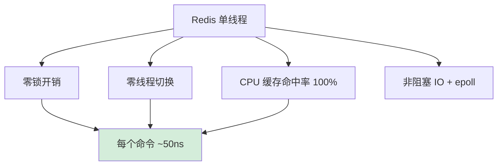
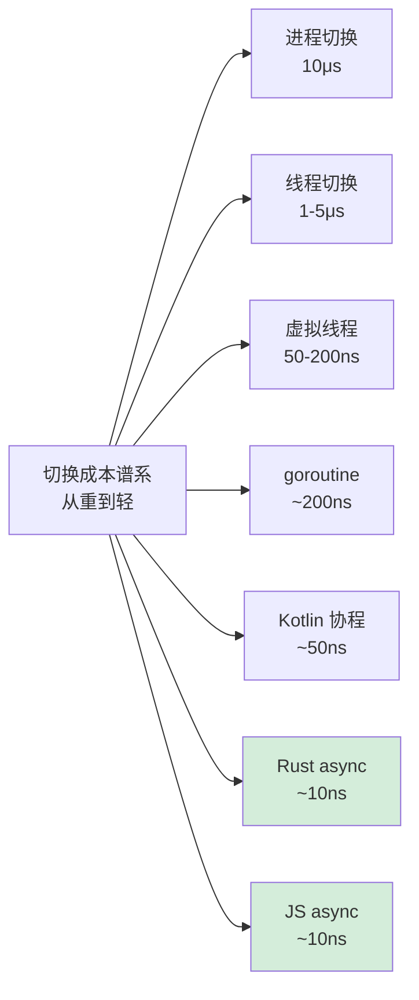

# 19.并发上下文切换原理

> 📍 **本篇位置**：第 3 卷 · 并发之道 · 第 9 篇
> 🎯 **核心矛盾**：**多线程吞吐 vs 切换开销** —— 切换太多，CPU 大半时间在"换衣服"而不是干活
> 🧭 **设计灵魂**：上下文切换 = **保存寄存器 + 切换页表 + 刷新 TLB + 缓存失效**；它的真实成本远不止"几微秒"，而在切换后的"冷启动"
> 🌐 **跨语言覆盖**：Linux(task_struct + 内核态切换) · Java(平台线程 = 内核线程) · Go(goroutine 用户态切换 ≈ 200ns) · Kotlin 协程(无系统切换 ≈ 几十 ns) · Win32(纤维 Fiber)
> 🔗 **延伸阅读**：← [18.锁核心设计和思想](./18.锁核心设计和思想.md) · → [23.协程核心设计思想](./23.协程核心设计思想.md) · → [25.线程池的设计思想](./25.线程池的设计思想.md)


---

#### 目录介绍
- [1.上下文切换由来](#1上下文切换由来)
  - [1.1 从独占到共享](#11-从独占到共享)
  - [1.2 演进的路线](#12-演进的路线)
  - [1.3 上下文由来](#13-上下文由来)
  - [1.4 核心概念](#14-核心概念)
- [2.两类上下文切换](#2两类上下文切换)
  - [2.1 进程级切换](#21-进程级切换)
  - [2.2 线程级切换](#22-线程级切换)
  - [2.3 切换过程的完整流程](#23-切换过程的完整流程)
- [3.切换设计思想](#3切换设计思想)
  - [3.1 设计演进](#31-设计演进)
  - [3.2 抢占式vs协作式调度](#32-抢占式vs协作式调度)
  - [3.3 调度算法的演进](#33-调度算法的演进)
- [4.切换核心原理](#4切换核心原理)
  - [4.1 切换时机](#41-切换时机)
  - [4.2 切换的硬件支持](#42-切换的硬件支持)
  - [4.3 内核态切换的伪代码](#43-内核态切换的伪代码)
- [5.各语言差异](#5各语言差异)
  - [5.1 C/C++实现](#51-cc实现)
  - [5.2 Java实现](#52-java实现)
  - [5.3 JavaScript实现](#53-javascript实现)
  - [5.4 Go实现](#54-go实现)
  - [5.5 性能开销量化](#55-性能开销量化)
- [6.上下文切换的优化实践](#6上下文切换的优化实践)
  - [6.1 减少切换次数的策略](#61-减少切换次数的策略)
  - [6.2 降低切换开销的技术](#62-降低切换开销的技术)
  - [6.3 各平台监控切换的方法](#63-各平台监控切换的方法)
- [7.协程与无栈协程设计](#7协程与无栈协程设计)
  - [7.1 有栈协程vs无栈协程](#71-有栈协程vs无栈协程)
  - [7.2 各语言协程实现对比](#72-各语言协程实现对比)
  - [7.3 协程切换伪代码](#73-协程切换伪代码)


## 1.上下文切换由来

### 1.1 从独占到共享

> 1.批处理时代（1950s-1960s）

最早的计算机是**独占式**的：一个程序从头跑到尾，CPU、内存、IO全归它用。问题很明显——CPU在等IO（磁带、打孔卡）时完全空转，利用率极低，可能只有10%-20%。

> 2. 多道程序设计（1960s）

为了解决CPU空转问题，IBM OS/360引入了**多道程序设计**：内存中同时装入多个程序，当程序A等IO时，切换到程序B执行。这是上下文切换的**最原始形态**——不过当时还没有"上下文"这个正式概念，只是简单地保存/恢复程序计数器和几个寄存器。

> 3. 分时系统（1960s-1970s）

Multics和Unix的出现带来了**分时（Time-sharing）**思想：每个用户程序分配一个**时间片（time slice）**，时间片到了就强制切换。核心矛盾正式浮出水面：

> **物理CPU是有限的，但逻辑上的并发任务是无限的。**

解决这个矛盾的唯一方式就是**时分复用**——在一个CPU上快速交替执行多个任务，每次交替就需要完整地保存当前任务的执行状态、恢复下一个任务的执行状态。这就是**上下文切换（Context Switch）** 的正式由来。

### 1.2 演进的路线

1960年代，计算机从批处理演进到分时共享，核心矛盾是：**CPU只有一个（或少数几个），但需要同时服务多个任务**。解决方案就是让CPU在多个任务间快速切换，每个任务运行一小段时间片（time slice），造成"同时运行"的假象。

演进路线：

- **批处理** → 一个任务跑完才跑下一个，无需切换
- **分时系统**（Multics, Unix）→ 多任务交替，需要保存/恢复执行状态
- **多线程** → 同一进程内多个执行流共享地址空间，切换更轻量
- **协程/绿色线程** → 用户态切换，进一步降低开销

### 1.3 上下文由来

一个程序执行到一半被打断，将来要**从断点处精确恢复**，就必须记住它当时的全部执行状态。这些状态就叫"上下文"：

| 状态 | 内容 | 为什么必须保存 |
|------|------|--------------|
| **程序计数器（PC/IP）** | 下一条要执行的指令地址 | 恢复后要从正确位置继续 |
| **栈指针（SP）** | 当前栈顶位置 | 函数调用链、局部变量都在栈上 |
| **通用寄存器** | 计算中间结果 | r0-r15/rax-r15等保存着运算状态 |
| **状态寄存器（FLAGS）** | 进位、零、溢出等标志 | 影响条件跳转的正确性 |
| **页表基址（CR3）** | 虚拟地址→物理地址映射 | 进程有独立地址空间 |
| **浮点/SIMD寄存器** | 浮点和向量运算状态 | 科学计算、图形处理等依赖 |

如果少保存任何一项，恢复后程序行为就会**不可预测地出错**。

### 1.4 核心概念

"上下文"就是**让一个执行流在被中断后能够完全恢复执行所需的全部状态**：

| 层级 | 内容 |
|------|------|
| **CPU寄存器** | 通用寄存器、程序计数器(PC/IP)、栈指针(SP)、帧指针(FP/BP)、状态寄存器(FLAGS) |
| **浮点/SIMD状态** | FPU寄存器、SSE/AVX寄存器（x86上通过FXSAVE/XSAVE保存） |
| **内存映射** | 页表基址寄存器（x86的CR3），TLB缓存 |
| **内核栈** | 每个线程/进程有独立的内核栈 |
| **调度元数据** | 优先级、时间片剩余、调度策略等 |

## 2.两类上下文切换

### 2.1 进程级切换

```
保存进程A的所有寄存器 → 保存A的页表指针(CR3) → 刷新TLB → 
加载进程B的页表指针 → 恢复B的所有寄存器 → 跳转到B的PC继续执行
```

代价最大的是**TLB失效**——切换页表后，TLB中缓存的虚拟→物理地址映射全部作废，后续内存访问会产生大量TLB miss，导致性能严重下降。

### 2.2 线程级切换

同一进程内的线程**共享地址空间**，不需要切换页表和刷新TLB：

```
保存线程A的寄存器 → 切换内核栈 → 恢复线程B的寄存器 → 跳转执行
```

这也是为什么多线程编程比多进程编程在切换开销上更有优势。

### 2.3 切换过程的完整流程

**疑惑**：操作系统内核在进行上下文切换时，到底做了哪些事情？整个流程是怎样的？

**答疑**：以Linux为例，当时钟中断触发调度时，完整的流程如下：

```
用户态进程A正在运行
    ↓
时钟中断触发（硬件）
    ↓
CPU自动保存A的 PC/SP/FLAGS 到A的内核栈（硬件完成）
    ↓
跳转到中断处理程序（内核态）
    ↓
保存A的剩余寄存器到task_struct（软件完成）
    │
    ├─ 保存通用寄存器: rax, rbx, rcx, rdx, rsi, rdi, r8-r15
    ├─ 保存浮点/SIMD状态: XSAVE指令保存FPU/SSE/AVX寄存器
    ├─ 保存段寄存器: fs, gs（线程局部存储TLS基址）
    │
    ↓
调度器选择下一个任务B
    │
    ├─ CFS调度器：选择vruntime最小的进程
    ├─ 实时调度器：选择最高优先级的就绪进程
    │
    ↓
切换地址空间（仅进程切换时）
    │
    ├─ 加载B的页表基址到CR3
    ├─ TLB自动失效（或使用PCID优化避免全量刷新）
    │
    ↓
恢复B的寄存器状态
    ↓
iret返回用户态，B从断点处继续执行
```

**关键细节**：

1. **内核栈切换**：每个线程/进程都有独立的内核栈，切换时需要将内核栈指针（TSS中的SP0）指向B的内核栈
2. **TLB优化**：现代CPU支持PCID（Process Context ID），给TLB条目打标签，避免进程切换时全量刷新
3. **懒保存浮点状态**：如果B不使用浮点运算，可以延迟保存/恢复FPU寄存器（Linux使用Eager FPU策略更安全）

**移动端的特殊考量**：

| 平台 | 特殊处理 |
|------|---------|
| Android | 切换时需要考虑Binder驱动的线程池状态，ART虚拟机的GC安全点 |
| iOS | 切换与GCD（Grand Central Dispatch）的线程池调度协作，Quality of Service等级影响调度优先级 |

## 3.切换设计思想

### 3.1 设计演进

```
内核态线程切换（重）
    ↓ 开销太大
用户态线程/协程（轻）
    ↓ 需要配合异步IO
M:N混合调度（Go/Java虚拟线程）
    ↓ 进一步优化
事件驱动/状态机（JS/Rust async）
    ↓ 编译器参与
无栈协程（零分配，编译时转状态机）
```

核心设计思想：

1. **分治**：将"保存/恢复全部CPU状态"这个重操作，按需裁剪到最小集合
2. **分层**：内核管物理资源，运行时管逻辑并发，语言管抽象模型
3. **协作优于抢占**：能协作式调度（yield/await）就不用时钟中断抢占，减少不必要的切换
4. **减少共享**：从共享内存（需要锁）→ 消息传递（CSP/Actor），从根源上减少切换引起的竞争

### 3.2 抢占式vs协作式调度

**疑惑**：为什么有些系统用抢占式调度，有些用协作式调度？哪种更好？

**答疑**：两种调度方式各有适用场景，本质区别在于"谁决定让出CPU"。

| 维度 | 抢占式调度 | 协作式调度 |
|------|-----------|-----------|
| 决定者 | OS内核（时钟中断触发） | 任务自身（主动yield/await） |
| 公平性 | 高（任何任务都不能霸占CPU） | 低（恶意任务可以不让出） |
| 延迟确定性 | 好（实时系统必备） | 差（取决于任务何时让出） |
| 切换开销 | 高（涉及内核态切换） | 低（用户态即可完成） |
| 典型场景 | OS线程（Linux/Windows） | 协程（Go/Kotlin/JS async） |

**论证——现代系统的融合趋势**：

实际系统往往是混合的。例如Go的goroutine调度：
- **协作式**：在函数调用时插入检查点（Go 1.14之前）
- **抢占式**：基于信号的异步抢占（Go 1.14+，解决了goroutine长时间不调用函数导致无法被抢占的问题）

```
Go调度器的演进:
  Go 1.0:  纯协作式 → goroutine不调用函数就永远不会被切换
  Go 1.2:  函数调用时检查抢占标志
  Go 1.14: 基于SIGURG信号的异步抢占 → 即使在纯计算循环中也能被抢占
```

### 3.3 调度算法的演进

| 算法 | 时代 | 核心思想 | 优缺点 |
|------|------|---------|--------|
| FCFS | 1950s | 先到先服务 | 简单但不公平，短任务可能等很久 |
| RR (Round Robin) | 1960s | 固定时间片轮转 | 公平但时间片选择困难 |
| 优先级调度 | 1970s | 按优先级选择 | 可能饥饿，需要老化机制 |
| MLFQ | 1980s | 多级反馈队列 | 动态调整优先级，适应不同类型任务 |
| CFS (Linux) | 2007 | 完全公平，红黑树管理vruntime | 接近理想公平性，O(log n)调度 |
| EAS (Android) | 2017 | 能量感知调度 | 考虑大小核和功耗，适合移动设备 |

**CFS的核心原理**：每个进程维护一个"虚拟运行时间"（vruntime），调度器总是选择vruntime最小的进程运行。高优先级进程的时钟跑得慢（vruntime增长慢），自然获得更多CPU时间。

```
CFS调度器的核心数据结构:

红黑树 (按vruntime排序):
         [vruntime=100]
        /              \
  [vruntime=50]    [vruntime=150]
      /      \
[vruntime=30] [vruntime=70]

调度决策: 总是选最左节点(vruntime最小) → O(1)
插入/删除: O(log n)
```

## 4.切换核心原理

### 4.1 切换时机

| 触发条件 | 类型 | 说明 |
|----------|------|------|
| **时间片耗尽** | 抢占式 | 时钟中断触发，调度器决定切换 |
| **系统调用阻塞** | 自愿 | read/write/sleep/mutex_lock等，主动让出CPU |
| **中断处理返回** | 抢占式 | 中断处理完后检查是否需要调度 |
| **高优先级任务就绪** | 抢占式 | 实时任务被唤醒，抢占当前任务 |
| **yield** | 自愿 | 主动让出（如sched_yield、Java的Thread.yield） |

### 4.2 切换的硬件支持

上下文切换不仅是软件行为，CPU硬件提供了关键支持：

| 硬件机制 | 作用 | 平台 |
|----------|------|------|
| TSS（Task State Segment） | 保存任务的SP0（内核栈指针）等关键状态 | x86 |
| PCID | 给TLB条目打进程标签，避免进程切换时全量刷TLB | x86 (Haswell+) |
| ASID | 地址空间标识符，类似PCID | ARM |
| FXSAVE/XSAVE | 批量保存/恢复浮点和SIMD寄存器 | x86 |
| TTBR0/TTBR1 | 页表基址寄存器，用户态/内核态分离 | ARM |

**ARM架构的特殊设计**：

ARM使用双页表基址（TTBR0存用户态页表，TTBR1存内核态页表），进程切换时只需更新TTBR0，内核页表不变。配合ASID（8-16位标签），TLB可以同时缓存多个进程的映射，大幅减少切换开销。

这对Android/iOS设备尤为重要——移动设备频繁切换前后台App，ASID机制避免了每次切换都刷新TLB。

### 4.3 内核态切换的伪代码

以下是简化的Linux `context_switch` 核心逻辑：

```c
// 简化的Linux上下文切换核心逻辑
void context_switch(struct task_struct *prev, struct task_struct *next) {
    // 1. 切换地址空间（仅进程切换时需要）
    if (next->mm != prev->mm) {
        // 加载新进程的页表
        load_cr3(next->mm->pgd);
        // 如果支持PCID，不需要刷新TLB
        if (!cpu_has_pcid) {
            flush_tlb();
        }
    }
    
    // 2. 切换内核栈和寄存器
    switch_to(prev, next);
    // switch_to 是一段汇编代码，核心操作：
    //   push prev的callee-saved寄存器到prev的内核栈
    //   保存prev的RSP到prev->thread.sp
    //   加载next->thread.sp到RSP
    //   pop next的callee-saved寄存器
    //   ret（跳转到next上次被切换时的下一条指令）
    
    // 3. 恢复浮点/SIMD状态
    if (next->thread.fpu_state) {
        xrstor(next->thread.fpu_state);
    }
}
```

**精妙之处**：`switch_to` 函数中的 `ret` 指令，返回地址是next上次被切换走时压入栈的地址——也就是next上次 `switch_to` 之后的那条指令。这样next就从上次被打断的地方精确恢复执行。


## 5.各语言差异

### 5.1 C/C++实现

C/C++：直接映射OS线程

```cpp
// C++ std::thread → pthread → OS内核线程
// 上下文切换完全由操作系统内核完成
std::thread t([]{ /* ... */ });
// 线程切换 = 内核态 context_switch()
```

C/C++的线程是1:1模型（一个语言线程对应一个内核线程），切换开销完全取决于OS。


### 5.2 Java实现

```java
// Java线程 = OS原生线程（HotSpot实现）
// 切换时除了OS寄存器，JVM还需要处理：
// - JIT编译后的本地栈帧
// - GC安全点（safepoint）检查
// - monitor锁状态
Thread t = new Thread(() -> { /* ... */ });
```

Java 21引入了**虚拟线程（Virtual Thread）**，采用M:N模型：

- 大量虚拟线程映射到少量平台线程
- 虚拟线程阻塞时，JVM在用户态将其"卸载"，换另一个虚拟线程上来
- 本质上是**用户态上下文切换**，避免了内核态切换的开销

### 5.3 JavaScript实现

JavaScript：单线程 + 事件循环（无传统切换）

```javascript
// JS是单线程模型，没有传统意义的上下文切换
// 通过事件循环(event loop) + 回调/Promise/async-await实现并发
async function fetchData() {
    const data = await fetch(url);  // 不阻塞线程，注册回调
    process(data);                   // 回调时从这里继续
}
```

JS的"切换"发生在**协作式调度**层面：

- async/await的suspend/resume由引擎（V8）管理
- 不涉及CPU寄存器保存，而是保存**闭包+执行位置**
- 本质是**状态机转换**，编译器将async函数拆分成多段

### 5.4 Go实现

Go：goroutine（用户态调度）

```go
// goroutine = 用户态轻量级线程
// Go运行时实现M:N调度（M个goroutine映射到N个OS线程）
go func() { /* ... */ }()
```

Go的上下文切换极其轻量：

- 只保存少量寄存器（PC、SP和少数callee-saved）
- goroutine栈初始只有几KB（OS线程通常1-8MB）
- 调度器在用户态运行，无需陷入内核

### 5.5 性能开销量化

| 切换类型 | 典型耗时 | 主要开销来源 |
|----------|---------|-------------|
| 进程切换 | 3-10μs | TLB刷新 + 缓存失效 + 寄存器保存 |
| 线程切换 | 1-5μs | 寄存器保存 + 内核态切换 |
| goroutine切换 | ~200ns | 少量寄存器 + 用户态调度 |
| 协程/虚拟线程 | 50-200ns | 栈帧保存 + 调度 |
| JS async切换 | ~10ns | 状态机跳转（无真正的栈切换） |

**隐性开销**往往比直接开销更大：

- **CPU缓存污染**：切换后的任务访问的数据不在L1/L2/L3缓存中
- **TLB miss**：进程切换后虚拟地址翻译变慢
- **分支预测器失效**：新任务的分支模式不同

上下文切换的本质：**在有限的物理执行资源上，通过时分复用支持逻辑上的并发，代价是保存和恢复执行状态**。整个技术演进的方向就是不断降低这个代价——从进程到线程到协程到状态机，保存的状态越来越少，切换越来越快，最终趋向于零开销抽象。


## 6.上下文切换的优化实践

### 6.1 减少切换次数的策略

**疑惑**：既然上下文切换有开销，如何在实际工程中减少不必要的切换？

**答疑**：核心原则是"让线程有事可做，减少阻塞等待"。

**策略一：线程池复用**

```java
// 错误：为每个任务创建线程，任务完成后线程销毁
for (Request req : requests) {
    new Thread(() -> handle(req)).start();  // 大量线程创建/销毁 + 大量切换
}

// 正确：线程池复用，线程数量可控
ExecutorService pool = Executors.newFixedThreadPool(
    Runtime.getRuntime().availableProcessors()  // 线程数 ≈ CPU核心数
);
for (Request req : requests) {
    pool.submit(() -> handle(req));
}
```

**策略二：无锁编程减少阻塞切换**

```java
// 有锁：线程获取不到锁就阻塞 → 触发上下文切换
synchronized (lock) {
    counter++;
}

// 无锁：CAS自旋，不触发阻塞
AtomicInteger counter = new AtomicInteger(0);
counter.incrementAndGet();  // 底层CAS，失败重试，不阻塞
```

**策略三：批量处理减少调度次数**

```go
// 不好：频繁channel通信，每次可能触发goroutine切换
for _, item := range items {
    ch <- item  // 每个item一次通信
}

// 更好：批量发送，减少通信和切换次数
batch := make([]Item, 0, 100)
for _, item := range items {
    batch = append(batch, item)
    if len(batch) >= 100 {
        ch <- batch
        batch = batch[:0]
    }
}
```

### 6.2 降低切换开销的技术

| 技术 | 原理 | 适用场景 |
|------|------|---------|
| CPU亲和性（affinity） | 将线程绑定到特定CPU核心，避免跨核切换导致缓存失效 | 高性能服务器 |
| 自旋锁（spinlock） | 短时间等待时自旋而非阻塞，避免切换 | 临界区极短的场景 |
| 用户态调度 | 协程/虚拟线程在用户态切换，不陷入内核 | 高并发IO密集 |
| NUMA感知调度 | 优先调度到数据所在的NUMA节点 | 多处理器服务器 |

**CPU亲和性示例**：

```c
// Linux: 将线程绑定到CPU 0
cpu_set_t cpuset;
CPU_ZERO(&cpuset);
CPU_SET(0, &cpuset);
pthread_setaffinity_np(pthread_self(), sizeof(cpuset), &cpuset);
```

```java
// Android: 将关键线程绑定到大核
// 通过设置线程的cgroup实现
String tid = String.valueOf(Process.myTid());
// 写入 /dev/cpuctl/top-app/tasks 将线程放入top-app分组
```

### 6.3 各平台监控切换的方法

**Linux/Android**：

```bash
# 查看进程的上下文切换次数
cat /proc/<pid>/status | grep ctxt
# voluntary_ctxt_switches:    1234   (自愿切换：IO阻塞等)
# nonvoluntary_ctxt_switches: 567    (抢占切换：时间片耗尽)

# 实时监控
vmstat 1    # 查看系统级切换次数(cs列)
pidstat -w  # 查看进程级切换次数
```

**macOS/iOS**：

```bash
# Instruments的System Trace工具
# 或使用命令行
sudo dtrace -n 'sched:::on-cpu { @[execname] = count(); }' -c 'sleep 5'
```

**Java**：

```java
// 通过JMX监控线程状态
ThreadMXBean tmx = ManagementFactory.getThreadMXBean();
ThreadInfo[] threads = tmx.dumpAllThreads(false, false);
for (ThreadInfo ti : threads) {
    // BLOCKED状态的线程频繁切换
    if (ti.getThreadState() == Thread.State.BLOCKED) {
        System.out.println("Blocked: " + ti.getThreadName() + 
            " on " + ti.getLockName());
    }
}
```


## 7.协程与无栈协程设计

### 7.1 有栈协程vs无栈协程

**疑惑**：同样是协程，为什么Go的goroutine和Kotlin的协程设计完全不同？

**答疑**：协程分为两大流派，核心区别在于如何保存暂停时的执行状态。

| 维度 | 有栈协程（Stackful） | 无栈协程（Stackless） |
|------|---------------------|---------------------|
| 代表 | Go goroutine、Java虚拟线程 | Kotlin suspend、Rust async、JS async |
| 状态保存 | 独立的协程栈（初始2-8KB） | 编译器生成的状态机对象 |
| 挂起点 | 任意位置（任意函数内都能暂停） | 只能在suspend/await标记处暂停 |
| 内存开销 | 每个协程需要独立栈空间 | 只需一个状态机对象（通常很小） |
| 实现复杂度 | 运行时需要栈管理和切换 | 编译器在编译期完成转换 |

**有栈协程的工作原理**：

```
Goroutine A                    Goroutine B
┌──────────┐                 ┌──────────┐
│ 栈帧: f3 │                 │ 栈帧: g2 │
│ 栈帧: f2 │   ←切换→       │ 栈帧: g1 │
│ 栈帧: f1 │                 │ 栈帧: g0 │
└──────────┘                 └──────────┘
   SP_A ──→ 保存               SP_B ──→ 恢复
```

**无栈协程的工作原理**：

```kotlin
// 编译前
suspend fun fetchData(): String {
    val a = networkCall1()     // 挂起点1
    val b = networkCall2(a)    // 挂起点2
    return a + b
}

// 编译后（简化）：编译器将其转换为状态机
class FetchDataStateMachine : Continuation<String> {
    var state = 0
    var a: String? = null
    var b: String? = null
    
    fun resumeWith(result: Result<String>) {
        when (state) {
            0 -> { state = 1; networkCall1(this) }  // 启动，调用到挂起点1
            1 -> { a = result; state = 2; networkCall2(a, this) }  // 恢复，到挂起点2
            2 -> { b = result; completion.resume(a + b) }  // 完成
        }
    }
}
```

### 7.2 各语言协程实现对比

| 语言 | 协程类型 | 调度方式 | 栈大小 | 最大并发数 |
|------|---------|---------|--------|----------|
| Go | 有栈 | M:N，运行时调度 | 初始2KB，动态增长 | 百万级 |
| Java 21 | 有栈（虚拟线程） | M:N，JVM调度 | 按需分配 | 百万级 |
| Kotlin | 无栈 | 协作式，编译时转换 | 无独立栈 | 千万级 |
| Rust | 无栈 | Future + 执行器 | 无独立栈 | 千万级 |
| JavaScript | 无栈 | 事件循环 | 无独立栈 | 取决于内存 |
| Swift | 无栈 | async/await + 运行时 | 无独立栈 | 百万级 |
| C++20 | 无栈 | co_await + 调度器 | 编译器分配帧 | 取决于调度器 |

### 7.3 协程切换伪代码

**Go goroutine切换**：

```go
// Go运行时调度器伪代码（简化）
func schedule() {
    // G = goroutine, M = 机器线程, P = 处理器（逻辑CPU）
    gp := findRunnable()  // 从本地队列/全局队列/其他P偷取一个可运行的G
    
    // 切换到gp的上下文
    // 保存当前G的SP/PC到G.sched
    // 恢复gp.sched中的SP/PC
    // 只需要保存少量callee-saved寄存器
    gogo(&gp.sched)
}

// goroutine主动让出
func Gosched() {
    // 保存当前goroutine状态到G.sched
    mcall(gosched_m)
    // mcall切换到g0栈（调度器栈）执行gosched_m
    // gosched_m将当前G放入全局队列，调用schedule()选择下一个G
}
```

**Java虚拟线程切换**：

```java
// JVM虚拟线程挂起时的简化逻辑
// 当虚拟线程执行阻塞操作（如socket.read）时：
//   1. JVM检测到阻塞
//   2. 将虚拟线程的栈帧从平台线程的栈上"拷贝"到堆中（unmount）
//   3. 平台线程去执行其他虚拟线程
//   4. 阻塞完成时，将栈帧从堆"恢复"到某个平台线程的栈上（mount）

// 伪代码
void virtualThreadPark() {
    // 保存虚拟线程的栈帧到堆
    StackChunk chunk = freezeFrames(currentCarrierThread);
    virtualThread.continuation = chunk;
    
    // 从平台线程上卸载
    currentCarrierThread.setVirtualThread(null);
    
    // 平台线程去调度下一个就绪的虚拟线程
    scheduleNext(currentCarrierThread);
}
```

**Rust async切换（状态机）**：

```rust
// Rust编译器将async fn转换为实现Future trait的状态机
// async fn fetch() -> String {
//     let a = step1().await;
//     let b = step2(a).await;
//     format!("{}{}", a, b)
// }

// 编译后的伪代码
enum FetchFuture {
    Start,
    WaitingStep1 { step1_future: Step1Future },
    WaitingStep2 { a: String, step2_future: Step2Future },
    Done,
}

impl Future for FetchFuture {
    fn poll(self: Pin<&mut Self>, cx: &mut Context) -> Poll<String> {
        loop {
            match self.state {
                Start => {
                    self.state = WaitingStep1 { step1_future: step1() };
                }
                WaitingStep1 { ref mut step1_future } => {
                    match step1_future.poll(cx) {
                        Poll::Ready(a) => {
                            self.state = WaitingStep2 { a, step2_future: step2(a) };
                        }
                        Poll::Pending => return Poll::Pending,  // 让出控制权
                    }
                }
                WaitingStep2 { ref a, ref mut step2_future } => {
                    match step2_future.poll(cx) {
                        Poll::Ready(b) => return Poll::Ready(format!("{}{}", a, b)),
                        Poll::Pending => return Poll::Pending,
                    }
                }
            }
        }
    }
}
// 零开销抽象：没有堆分配，没有虚函数调用，状态机在栈上
```

**核心总结**：

```
技术演进方向:
  进程切换(~10μs) → 线程切换(~1-5μs) → 有栈协程(~200ns)
  → 无栈协程/状态机(~10ns) → 零开销抽象(编译期消除)

保存状态越来越少:
  全部CPU状态 → callee-saved寄存器 → SP/PC → 状态机字段 → 编译期优化掉
```

## 上下文切换观测与调优实战

理论讲清了，但工程现场怎么发现"切换成了瓶颈"、怎么定位、怎么解决？这章给出一套可落地的手册。

### 1. 上下文切换的真实成本测算

教科书上说"线程切换 1-5μs"，但实际值取决于工作集大小：

```
直接成本（CPU 寄存器与栈保存）:        ~1μs
间接成本（缓存失效后冷启动）:          ~10-100μs

工作集越大，间接成本越高：
  L1 命中（32KB）:        1-4 cycles
  L2 命中（256KB-1MB）:   10-15 cycles
  L3 命中（几十 MB）:     40-80 cycles
  Memory 访问:            200-300 cycles
  TLB miss:               额外 10-100 cycles
```

**真实数据**（典型 Linux x86_64 服务器）：

| 场景 | 单次切换成本 |
|------|-------------|
| 同一 CPU 上、热缓存 | ~1.5μs |
| 跨 CPU、温缓存 | ~5-10μs |
| 跨 NUMA 节点 | ~15-30μs |
| 跨进程切换（含 TLB 刷新） | ~3-15μs |
| 内核上下文切换（页表切换） | ~1-3μs（PCID 优化后） |

### 2. 切换风暴的观测工具

#### 系统级：vmstat 与 sar

```bash
# 关注 cs 列（context switches per second）
$ vmstat 1
procs -----------memory---------- ---swap-- -----io---- --system-- ----cpu-----
 r  b   swpd   free   buff  cache   si   so    bi    bo   in   cs us sy id wa
 5  0      0 100000 200000 800000    0    0     0     0 5000 50000 30 60 10  0
                                                              ↑
                                                   每秒 5 万次切换 = 异常

# 健康基线参考：
# < 1万/s: 正常
# 1-10万/s: 偏高，需关注
# > 10万/s: 通常已是瓶颈
```

#### 进程级：pidstat

```bash
# -w 显示自愿与非自愿切换
$ pidstat -w -p <pid> 1
   PID    cswch/s  nvcswch/s  Command
  1234    1500.00     50.00   java
            ↑           ↑
       自愿切换     非自愿切换
       （IO/锁等）  （时间片用完/被抢占）
```

**判断技巧**：

- `cswch/s` 高 → 锁竞争或 IO 等待频繁
- `nvcswch/s` 高 → 线程数 >> CPU 数，调度抢占严重
- 两者都高 → 典型的"线程过多"问题

#### 调用栈级：perf sched

```bash
# 记录所有调度事件
sudo perf sched record -a sleep 10
sudo perf sched latency

# 查看哪些函数最容易触发切换
sudo perf record -e sched:sched_switch -g -p <pid>
sudo perf report
```

#### Java 专用：JFR + Async Profiler

```bash
# JFR 记录线程上下文切换
java -XX:StartFlightRecording=filename=app.jfr,duration=60s ...

# Async Profiler 显示锁竞争热点
./profiler.sh -e lock -d 30 <pid>
```

### 3. 常见切换风暴的模式与解决

#### 模式一：线程数远超 CPU 数

```
症状: nvcswch/s 极高，CPU 利用率却上不去
根因: 时间片切换占用了大量 CPU
解决:
  - 用线程池约束并发数（Java 中 ForkJoinPool.commonPool 默认 = CPU 数）
  - 改用异步/协程减少线程总数
  - 调整 CPU affinity 减少跨核迁移
```

#### 模式二：锁竞争剧烈

```
症状: cswch/s 高，特定锁的 contention 数据爆炸
根因: 临界区设计不合理，多个线程频繁排队
解决:
  - 锁分段（如 ConcurrentHashMap 的桶锁）
  - 锁降级（写少读多 → ReadWriteLock）
  - 无锁化（CAS、ThreadLocal、Per-CPU 数据）
  - 批量化（合并多次小操作为一次大操作）
```

#### 模式三：阻塞 IO 占用线程

```
症状: 大量线程 sleep 在 IO，仅少数 RUNNING
根因: 同步阻塞 IO 模型下，线程数 = 连接数
解决:
  - 切到 NIO/异步 IO，复用少量线程
  - Netty / io_uring / epoll 多路复用
  - 协程方案（Go goroutine、Kotlin coroutine、Java Loom）
```

#### 模式四：Notify 风暴

```
症状: 周期性 cswch 尖峰
根因: notifyAll() 唤醒所有等待者，但只有一个能拿到锁
解决:
  - 用 Condition 替代 Object.wait，多条件分类等待
  - 准确的 notify() 替代 notifyAll()
  - 用 Disruptor 等无锁队列代替"生产者-消费者+notify"
```

### 4. 容器化场景的特殊问题

容器/K8s 环境下，CPU 限制带来新的切换问题：

```
场景: K8s Pod 限制 CPU = 2 cores
      JVM 默认线程池大小可能 = 主机 CPU 数（如 64）
      实际可用 = 2

后果: 64 个线程争抢 2 核 → 严重的非自愿切换
      CPU throttling 进一步加剧问题

解决:
  -XX:ActiveProcessorCount=2  # 显式告诉 JVM
  ForkJoinPool 使用 = 容器分配的核数
  避免在容器内开"无限大"线程池
```

### 5. 调优三原则

```
原则一：先观测，再行动
  没有 vmstat / pidstat 数据，所有"优化"都是猜测

原则二：减少切换次数 > 优化单次切换成本
  线程数 ↓ > 锁优化 > 协程化 > 异步化

原则三：让 CPU 干活，不让 CPU 切换
  CPU 利用率高、切换少 → 健康
  CPU 利用率低、切换多 → 病态（必须优化）
```

### 6.上下文切换不可避免

无论如何优化，只要有"并发执行 > CPU 数"的需求，上下文切换就不可避免。但优秀的工程实践能把切换成本压到最低：

```
理想模型:
  - 线程数 ≈ CPU 核心数
  - 用协程/状态机承载万级并发
  - 锁极少且粒度极小
  - IO 全部异步化
  - 关键路径上的数据局部性极佳

→ CPU 利用率 80%+，cswch/s < 1 万/s，吞吐量逼近硬件极限
```

这就是高性能并发系统的"圣杯"——**让 CPU 永远在做有用功，而不是在切换**。

## 案例驱动：生产事故看切换

前面把"原理"和"工具"讲透了。这一章用三个真实生产事故，把切换的隐形成本具象化。

### 案例：8核跑5000线程吞吐量反降

**场景**：某互联网公司 2016 年用 Tomcat 跑业务，配置：

```xml
<Connector ... maxThreads="5000" ... />
```

**事故现象**：把服务从 4 核迁到 8 核机器后，**吞吐量不升反降**（从 8000 QPS 掉到 5500）。CPU 利用率 95%，但其中 60% 是 sys 时间。

**根因诊断**：

```bash
$ vmstat 1
 r  b   swpd   free   buff  cache   si   so    bi    bo    in     cs  us  sy  id
12  0      0 ...                                          80000 250000  35  60   5
                                                                  ↑
                                                          每秒 25 万次切换！
```

```mermaid
flowchart LR
    A[8 核 CPU] --> B[5000 个 Tomcat 线程]
    B --> C[每核要"轮流喂"<br/>625 个线程]
    C --> D[每个线程一个时间片<br/>10ms]
    D --> E[每核每秒切换<br/>~3 万次]
    E --> F[60% CPU 花在切换<br/>实际干活 35%]
    style F fill:#f8d7da
```

**修复方案**：

```xml
<!-- 方案1：把 maxThreads 调到合理范围 -->
<Connector maxThreads="200" ... />

<!-- 方案2：迁移到 NIO/Reactor（Netty/Undertow） -->
<!-- 方案3：升级到虚拟线程（Tomcat 11+ 支持 Loom） -->
```

修复后：CPU 利用率从 95% 掉到 50%，但 QPS 升到 12000——**少做无用功反而干得更多**。

**学到了什么**：

> **线程数不是"越多越好"**。当线程数 >> CPU 核数时，时间片轮转的开销会吃掉大部分 CPU——这就是经典的"过度并发陷阱"。**理想线程数 ≈ 核数 × (1 + 等待时间/计算时间)**。

### 案例：Redis单线程吊打多线程

**反直觉数据**：单线程的 Redis 能撑 10 万 QPS，但很多多线程数据库在同样硬件上才 5 万。

**Redis 的设计哲学**：



**关键洞察**：**纯内存操作场景下，多线程的代价（锁 + 切换）远大于收益（并行）**。Redis 把所有命令放在一个事件循环里串行执行，因为：

```
锁的成本：       100-300ns（无竞争时的 lock/unlock）
切换的成本：     1-5μs（线程切换）
缓存重建成本：   10-100μs（缓存冷启动）

vs.

Redis 单条命令： 50-200ns（纯内存）
```

**对比表**：

| 工作负载 | 单线程更优 | 多线程更优 |
|---------|-----------|-----------|
| 纯内存计算 | ✅ | ❌ |
| 含磁盘 IO | ❌ | ✅ |
| 含网络 IO | ❌ | ✅ |
| 大量小操作 | ✅ | ❌ |
| 少量大操作 | ❌ | ✅ |

**Redis 6.0 的妥协**：网络 IO 部分引入多线程（解析协议），但**命令执行依然单线程**——精准把多线程用在该用的地方。

**学到了什么**：**"多线程一定比单线程快"是一个普遍误解**。能否并行的本质是"任务之间是否独立、是否有 IO 等待"——理解工作负载，再选并发模型。

### 案例：goroutine从1万到100万

**场景**：某 Go 团队最初用线程池模式（10 个 worker goroutine 抢一个任务队列），后来改为"每个连接一个 goroutine"——直接撑起百万长连接。

**对比**：

```go
// 模式1：传统线程池思维（10 个 worker）
const workers = 10
tasks := make(chan Task, 1000)
for i := 0; i < workers; i++ {
    go func() {
        for t := range tasks { handle(t) }
    }()
}

// 模式2：Go 原生思维（每连接一个 goroutine）
for {
    conn, _ := listener.Accept()
    go handleConnection(conn)   // ← 不限量启动 goroutine
}
```

**性能对比**：

| 指标 | 模式1（10 worker） | 模式2（百万 goroutine） |
|------|-------------------|------------------------|
| 内存 | 10 × 8MB = 80MB（OS 线程栈） | 100万 × 2KB = 2GB（goroutine 栈）|
| 切换 | 内核态切换（μs 级） | 用户态切换（~200ns）|
| 编程模型 | 阻塞队列 + 线程池 | 直接 goroutine + channel |
| 最大并发 | 1 万左右就饱和 | 100 万轻松 |

**Go 切换的轻量秘密**：

```
OS 线程切换 (1-5μs):
  - 保存全部寄存器
  - 切换内核栈
  - 进入内核态
  - 调度器选下一个
  - 返回用户态

Goroutine 切换 (~200ns):
  - 保存少量 callee-saved 寄存器
  - 切换 goroutine 栈指针
  - 用户态调度器选下一个
  - 直接跳转
  - 完全不进内核
```

**学到了什么**：

> **轻量级用户态调度，是过去 10 年并发编程最重要的范式革命**。Go 的 goroutine、Kotlin 的 coroutine、Java 21 的虚拟线程都是这个方向——**它们不是"加快了线程"，而是从根本上换了"线程"这个抽象的实现成本**。

## 跨语言切换成本全景对比



**关键观察**：从进程到 Rust async，**切换成本下降了 1000 倍**。这意味着同样的硬件，现代并发模型能承载 1000 倍的并发任务。

| 维度 | 内核线程 | 虚拟线程/goroutine | Rust async/JS async |
|------|---------|--------------------|--------------------|
| 状态保存 | 全部寄存器 + 内核栈 | 少量寄存器 + 用户栈 | 状态机字段 |
| 调度器 | OS 内核 | 语言运行时 | 编译期生成 |
| 阻塞点 | 任意系统调用 | 任意系统调用 | 仅 await 处 |
| 心智模型 | 共享内存 | CSP/共享内存 | Future/Promise |
| 适合场景 | 通用 | IO 密集（网络/文件） | 极致 IO 密集 |

## 一句话终极总结

> **上下文切换的本质，是"在有限的物理执行资源上，通过时分复用支持逻辑上的并发，代价是保存和恢复执行状态"**——这个代价从 1960s 的进程切换（10μs+）到 2020s 的 async 状态机（10ns），下降了三个数量级，但永远不可能为零。
> 整个并发演化史，就是工程师与"切换成本"斗争的历史：减少切换次数（线程池）、降低单次成本（用户态调度）、把切换抽象掉（编译期状态机）、彻底消除（事件驱动）。**优秀的并发系统不是没有切换，而是切换被精准地用在该用的地方**——计算时全速跑、IO 时立刻让出、唤醒时缓存仍热。**让 CPU 永远在做有用功，而不是在换衣服**——这就是高性能并发的圣杯。
