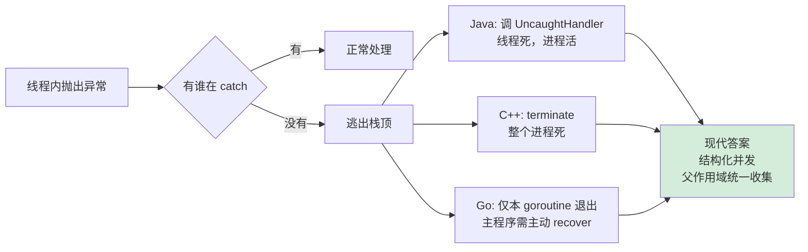
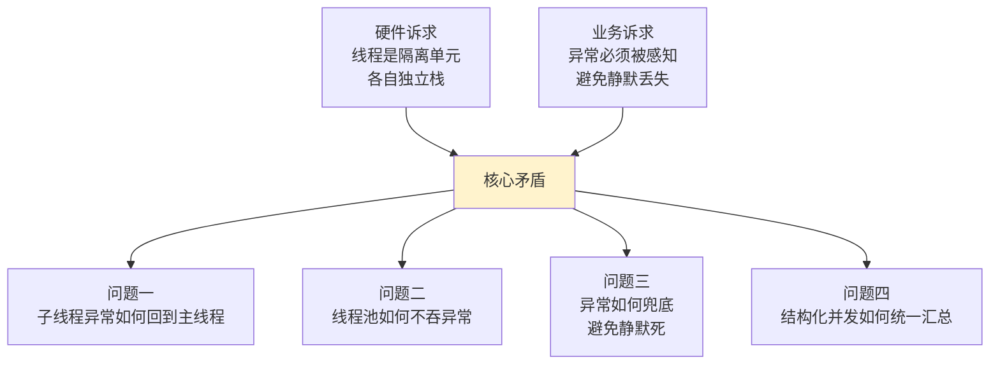
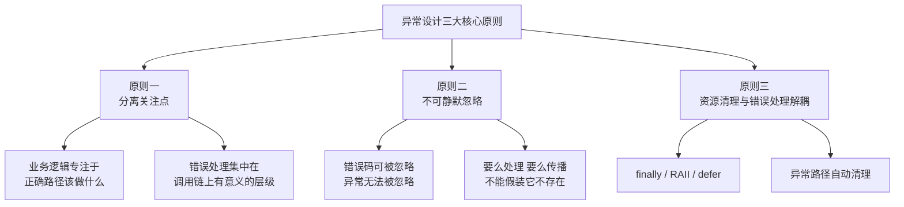
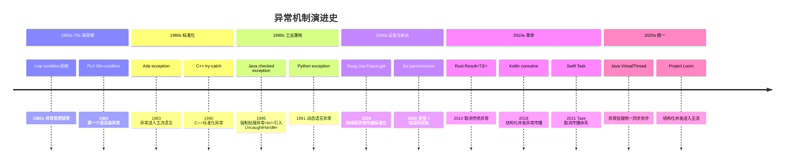
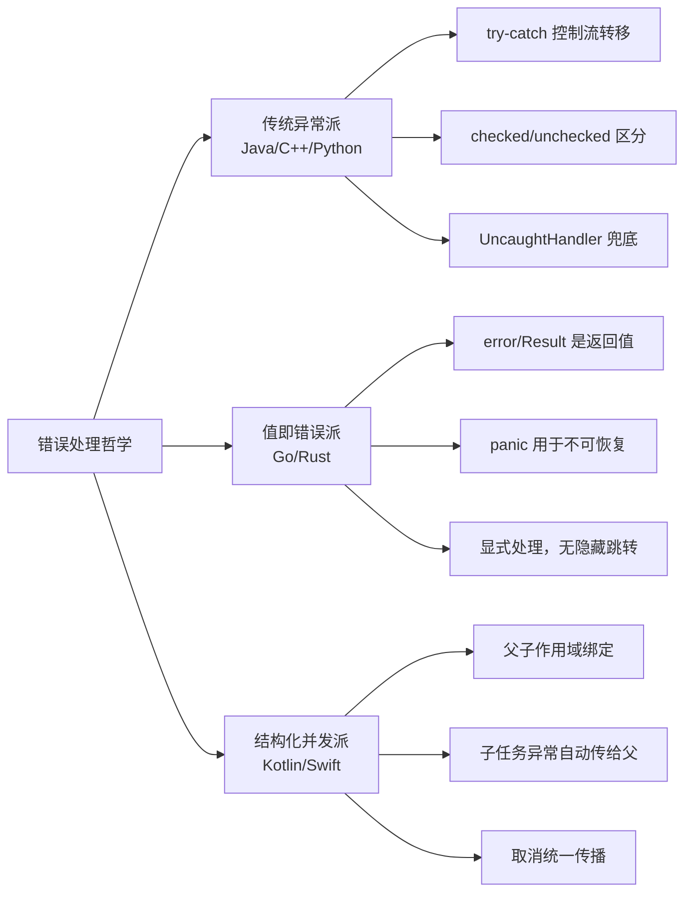
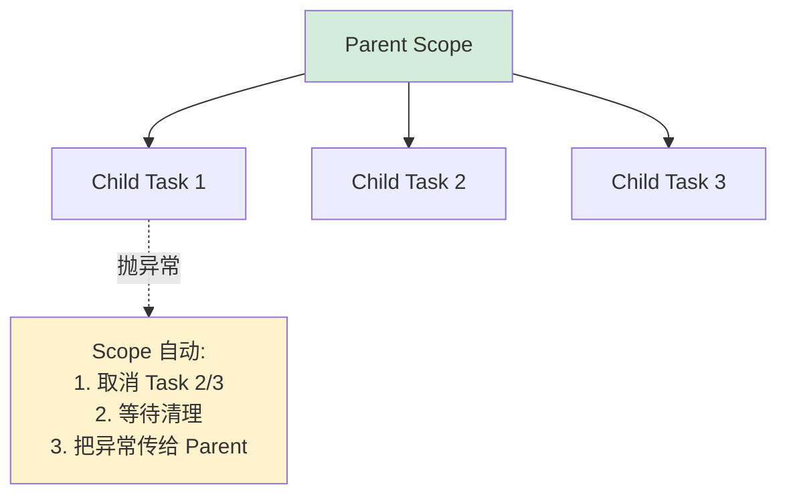
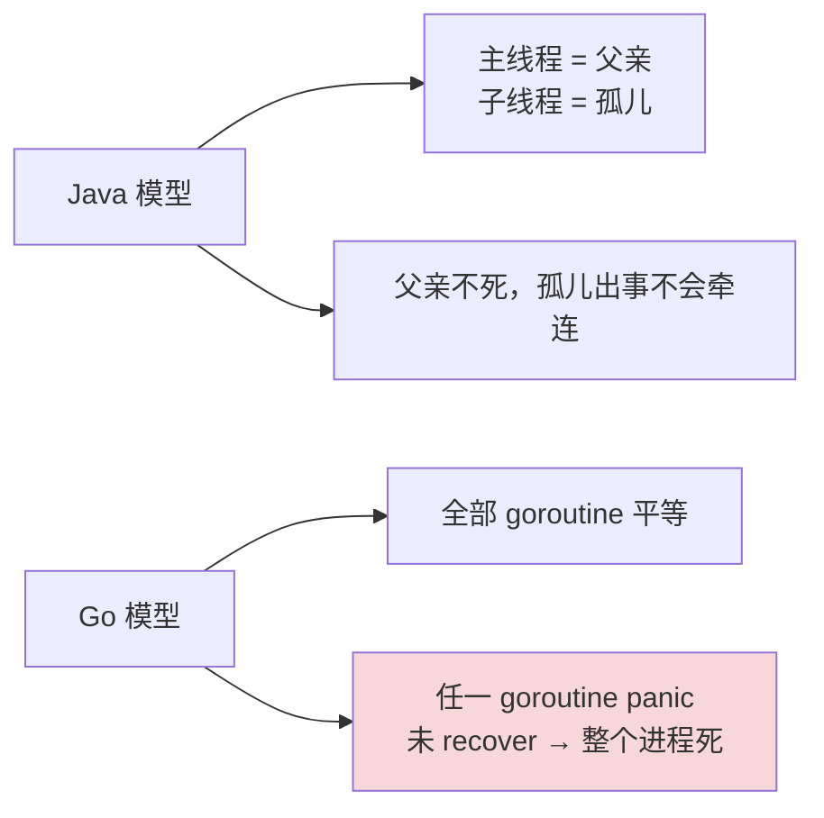
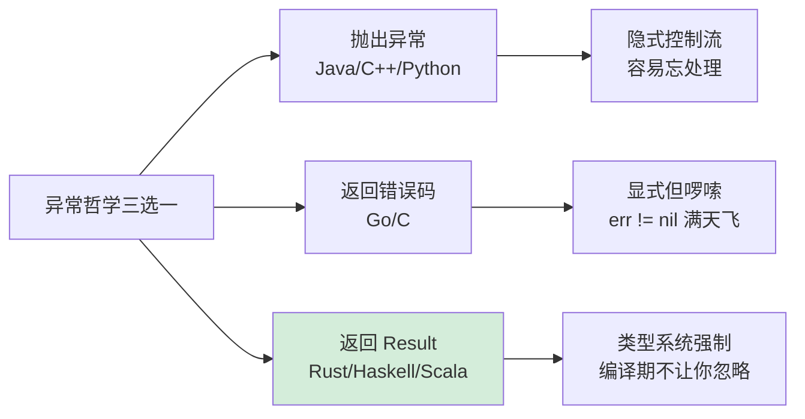

# 13.线程异常设计原理

🎯 **核心矛盾**：**异常天然属于调用栈 vs 线程各自有独立栈** —— 子线程崩了，谁来收尸？

🧭 **设计灵魂**：线程异常处理走过三代——**默认杀进程**（C++）→ **每线程 UncaughtHandler**（Java）→ **结构化并发统一汇集**（Kotlin/Swift）；本质是从"放任"到"父对子负责"

🌐 **跨语言覆盖**：Java(Thread.UncaughtExceptionHandler / Future / CompletableFuture) · C++(std::terminate / exception_ptr / std::future) · Kotlin(CoroutineExceptionHandler + SupervisorJob) · Swift(Task 取消传播) · Go(panic + recover 仅本 goroutine) · Rust(JoinHandle + catch_unwind)



---

#### 目录介绍
- [1.看一个案例](#1看一个案例)
  - [1.1 子线程静默崩溃场景](#11-子线程静默崩溃场景)
  - [1.2 不处理异常的代价](#12-不处理异常的代价)
  - [1.3 try-catch 为何不够](#13-try-catch-为何不够)
  - [1.4 线程池吞异常陷阱](#14-线程池吞异常陷阱)
  - [1.5 引出核心矛盾](#15-引出核心矛盾)
- [2.异常设计哲学](#2异常设计哲学)
  - [2.1 无异常世界的代价](#21-无异常世界的代价)
  - [2.2 三大核心原则](#22-三大核心原则)
  - [2.3 异常机制演进时间线](#23-异常机制演进时间线)
  - [2.4 可恢复 vs 不可恢复](#24-可恢复-vs-不可恢复)
  - [2.5 设计哲学对比](#25-设计哲学对比)
- [3.异常如何引起](#3异常如何引起)
  - [3.1 两种触发源](#31-两种触发源)
  - [3.2 硬件触发异常](#32-硬件触发异常)
  - [3.3 软件触发异常](#33-软件触发异常)
  - [3.4 throw 的底层实现](#34-throw-的底层实现)
  - [3.5 分层模型](#35-分层模型)
- [4.异常如何处理](#4异常如何处理)
  - [4.1 通用处理模型](#41-通用处理模型)
  - [4.2 异常处理本质](#42-异常处理本质)
  - [4.3 调用栈的物理结构](#43-调用栈的物理结构)
  - [4.4 各语言实现机制](#44-各语言实现机制)
  - [4.5 异常匹配规则](#45-异常匹配规则)
  - [4.6 finally 的实现原理](#46-finally-的实现原理)
- [5.线程异常的核心问题](#5线程异常的核心问题)
  - [5.1 异常的"线程边界"](#51-异常的线程边界)
  - [5.2 跨线程异常传递机制](#52-跨线程异常传递机制)
  - [5.3 UncaughtExceptionHandler全景](#53-uncaughtexceptionhandler全景)
  - [5.4 InterruptedException的地位](#54-interruptedexception的地位)
- [6.异常整体框架](#6异常整体框架)
  - [6.1 Java 异常体系](#61-java-异常体系)
  - [6.2 C++ 异常体系](#62-c-异常体系)
  - [6.3 设计哲学对比](#63-设计哲学对比)
  - [6.4 各语言体系深度对比](#64-各语言体系深度对比)
- [7.异常捕获原理](#7异常捕获原理)
  - [7.1 三大底层实现](#71-三大底层实现)
  - [7.2 各语言性能对比](#72-各语言性能对比)
  - [7.3 fillInStackTrace性能陷阱](#73-fillinstacktrace性能陷阱)
- [8.各语言线程异常实战](#8各语言线程异常实战)
  - [8.1 Java 线程异常](#81-java-线程异常)
  - [8.2 C++ 线程异常](#82-c-线程异常)
  - [8.3 JavaScript 异常](#83-javascript-异常)
  - [8.4 Go panic/recover](#84-go-panicrecover)
  - [8.5 Rust 线程异常](#85-rust-线程异常)
  - [8.6 C 语言异常模拟](#86-c-语言异常模拟)
- [9.结构化并发的异常设计](#9结构化并发的异常设计)
  - [9.1 传统模型的局限](#91-传统模型的局限)
  - [9.2 Kotlin 协程异常传播](#92-kotlin-协程异常传播)
  - [9.3 Swift Task 取消传播](#93-swift-task-取消传播)
  - [9.4 父对子负责的统一思想](#94-父对子负责的统一思想)
- [10.经典陷阱与反模式](#10经典陷阱与反模式)
  - [10.1 静默吞异常](#101-静默吞异常)
  - [10.2 finally 抛异常覆盖原异常](#102-finally-抛异常覆盖原异常)
  - [10.3 中断响应错误](#103-中断响应错误)
  - [10.4 异常用作控制流](#104-异常用作控制流)
  - [10.5 调试与定位](#105-调试与定位)
- [11.一句话总结](#11一句话总结)

---

## 1.看一个案例

### 1.1 子线程静默崩溃场景

**场景设定**：小杨写了一个**订单处理后台服务**，有一个专门的"订单处理线程"在后台默默工作，从队列取订单、扣库存、调用支付。代码看起来无懈可击：

```java
public class OrderProcessor {
    public static void main(String[] args) {
        Thread worker = new Thread(() -> {
            while (true) {
                Order order = queue.take();        // 从队列取
                processOrder(order);                // 处理订单
            }
        });
        worker.start();                            // 启动后台线程
        
        // 主线程做其他事：监听 HTTP 请求、定时统计...
        startWebServer();
    }
    
    static void processOrder(Order order) {
        deductStock(order);                         // 扣库存
        chargePayment(order);                       // 扣款
        sendNotification(order);                    // 发通知
    }
}
```

**这段代码有个致命问题——你可能根本意识不到**：某天凌晨 3 点，有一个订单的 `order.userId` 是 `null`（数据库脏数据），`chargePayment` 内部 `user.getCard()` 抛出了 NPE。**这个异常去了哪里？**

- ❌ 没人 catch
- ❌ 没人通知主线程
- ❌ 没人写日志（你以为 JVM 会写，但仅限标准错误流）
- ❌ 进程没崩，HTTP 服务还活着，监控显示一切正常
- ❌ 但**订单队列再也没人消费了**——worker 线程死了

第二天早上，老板冲过来问小杨："为什么昨晚 3 点之后 8 小时的订单一个都没处理？"——你打开日志，干干净净。**这就是线程异常设计中最痛的一类 bug**。

### 1.2 不处理异常的代价

让我们对比下面这两段代码：

**代码 A（看似没问题，实际是定时炸弹）**：

```java
new Thread(() -> {
    while (true) {
        Task t = queue.take();
        process(t);   // 这里万一抛异常？
    }
}).start();
```

**代码 B（包了 try-catch）**：

```java
new Thread(() -> {
    while (true) {
        try {
            Task t = queue.take();
            process(t);
        } catch (Throwable e) {
            log.error("task failed", e);   // 至少日志能看到
        }
    }
}).start();
```

| 维度 | 代码 A | 代码 B |
|---|---|---|
| **异常发生时** | 线程立即终止 | 当前任务失败，循环继续 |
| **后续任务** | ❌ 全部不处理 | ✅ 继续处理 |
| **可观测性** | ⚠️ 仅 stderr 一行栈 | ✅ 日志系统完整记录 |
| **告警触发** | ❌ 无（没人监控 stderr） | ✅ 错误日志触发监控 |
| **进程是否死** | ❌ 不死（这是最坑的） | ❌ 不死 |

**代码 A 的真正可怕之处不是"异常没被处理"，而是"系统看起来还在跑"**——HTTP 服务正常、CPU 内存正常、监控全绿，**但核心业务停了**。这种"半死不活"状态比直接崩溃更难发现。

**Java 的设计哲学**：**线程是隔离单元**——子线程异常**默认不影响父线程和兄弟线程**。这是为了"健壮"，但代价是"静默"。每条线程的边界就是栈的边界，异常不会自动跨过去。

### 1.3 try-catch 为何不够

聪明的工程师会说："那我每个线程都包 try-catch 不就行了？"——但事情没这么简单：

```java
// 看起来很完美的代码
new Thread(() -> {
    try {
        while (true) {
            Task t = queue.take();
            process(t);
        }
    } catch (Throwable e) {
        log.error("worker died", e);
    }
}).start();
```

**这段代码还有 4 个问题**：

- **问题一**：catch 完之后**循环退出了**——线程还是死了，下一个任务依然没人处理
- **问题二**：catch 块里万一**自己也抛异常**（log.error 内部失败）——异常被吞，回到了静默状态
- **问题三**：每个新建的线程都得记得包——**100 处代码 100 处都得包**，少一处就埋雷
- **问题四**：如果用的是**线程池**（`executor.submit`），try-catch 包了也没用——异常被线程池吃掉了

**第四点最致命**——下面专门讲。

### 1.4 线程池吞异常陷阱

线上 90% 的"线程异常神秘失踪"事故都来自这个坑：

```java
ExecutorService pool = Executors.newFixedThreadPool(10);

// 提交方式 1：execute
pool.execute(() -> {
    throw new RuntimeException("error from execute");
});
// 结果：线程池调用 UncaughtExceptionHandler，默认打印到 stderr

// 提交方式 2：submit
pool.submit(() -> {
    throw new RuntimeException("error from submit");
});
// 结果：异常被封装在 Future 里！如果你不调 future.get()——
//      异常永远被吞，stderr 都没有！
```

**为什么 `submit` 会吞异常？** 看 JDK 源码（FutureTask.run）：

```java
public void run() {
    try {
        result = callable.call();          // 你的代码
    } catch (Throwable ex) {
        setException(ex);                  // 异常存到 outcome 字段
        // 注意：这里没有再 throw 出来！
    }
}
```

异常被**塞进了 Future 对象**，等着你来 `get()` 才会重新抛出来——**你不 get 就永远看不到**。

**实测验证**：

```java
ExecutorService pool = Executors.newFixedThreadPool(2);
pool.submit(() -> {
    int[] arr = new int[1];
    return arr[10];   // 数组越界
});
pool.shutdown();
// 控制台：什么都没有 ⚠️
// 监控：什么都没有 ⚠️
// 你以为代码跑成功了——其实异常静悄悄被吞了
```

**为什么 JDK 这样设计**？因为 `submit` 返回 `Future`，调用者**有责任**调 `get()` 看结果——这是契约。但实际工程中很多人 `submit` 完就不管了，导致异常成"黑洞"。

**正确处理姿势**：

```java
// 方案 1：必须 future.get()
Future<?> f = pool.submit(task);
try {
    f.get();
} catch (ExecutionException e) {
    log.error("task failed", e.getCause());
}

// 方案 2：CompletableFuture 链式 + 终端 .exceptionally
CompletableFuture.supplyAsync(task, pool)
    .exceptionally(ex -> {
        log.error("failed", ex);
        return null;
    });

// 方案 3：自定义 ThreadPoolExecutor 重写 afterExecute
new ThreadPoolExecutor(...) {
    @Override
    protected void afterExecute(Runnable r, Throwable t) {
        super.afterExecute(r, t);
        if (t == null && r instanceof Future<?> f) {
            try { f.get(); }
            catch (Exception e) { t = e.getCause(); }
        }
        if (t != null) log.error("task error", t);
    }
};
```

### 1.5 引出核心矛盾

把 1.1 - 1.4 总结成一张表：

| 场景 | 异常去哪了 |
|---|---|
| 主线程 + try-catch | ✅ 被 catch，正常处理 |
| 主线程 + 没 catch | ❌ 进程崩溃（"硬死"） |
| 子线程 + 没 catch | ❌ 线程默默死，进程还活着（"软死"） |
| 线程池 execute + 没 catch | ⚠️ stderr 一行，监控看不到 |
| 线程池 submit + 没 get | ⚠️ 完全静默，进入"黑洞" |
| CompletableFuture 没 .exceptionally | ⚠️ 静默 + 链路中断 |

线程异常设计的核心矛盾：



**全文要回答的就是这 4 个子问题**。

---

## 2.异常设计哲学

### 2.1 无异常世界的代价

线程异常设计为何这么复杂？要先理解"如果没有异常机制，会怎样"。看一段纯错误码风格的 C 代码：

```c
int processOrder(Order* order) {
    int fd = open("/tmp/log", O_WRONLY);
    if (fd == -1) return -1;
    
    int ret = deductStock(order);
    if (ret == -1) {
        close(fd);                          // 必须记得清理！
        return -1;
    }
    
    ret = chargePayment(order);
    if (ret == -1) {
        rollbackStock(order);               // 还要回滚之前的操作！
        close(fd);
        return -1;
    }
    
    ret = sendNotification(order);
    if (ret == -1) {
        // 通知失败要不要回滚？业务决策...
        close(fd);
        return -1;
    }
    
    close(fd);
    return 0;
}
```

**这段代码的 4 个致命问题**：

- **错误可被忽略**：调用方不检查返回值，编译器不报错——bug 静默存在
- **业务逻辑被淹没**：真正的"扣库存→扣款→通知" 3 行被 9 行错误处理代码包围
- **资源泄漏常态化**：每条错误路径都要记得 close，少一行就漏 fd
- **错误信息丢失**：返回值只能告诉"失败了"，丢失了"为什么失败"

**C 语言至今数千个 CVE 漏洞源自这种风格**——`malloc` 不检查、`read` 不检查、`fopen` 不检查导致空指针解引用、缓冲区溢出。

异常机制就是为了**把上面那段 18 行变成下面这 5 行**：

```java
void processOrder(Order order) throws Exception {
    try (var log = new FileWriter("/tmp/log")) {   // try-with-resources
        deductStock(order);
        chargePayment(order);
        sendNotification(order);
    }
    // 异常自动向上传播，资源自动释放
}
```

### 2.2 三大核心原则

异常设计有三条铁律——任何语言、任何框架、任何工程实践都遵循：



**原则一：分离关注点（Separation of Concerns）**

```java
// 错误码：业务逻辑 + 错误处理混杂
User user = db.query(id);
if (user == null) { log("not found"); return; }
Order order = create(user);
if (order == null) { rollback(); return; }

// 异常：业务逻辑清晰，错误集中处理
try {
    User user = db.query(id);
    Order order = create(user);
} catch (Exception e) {
    rollback();
    log(e);
}
```

**原则二：错误不可静默忽略（Fail Fast, Fail Loud）**

```
错误码：  int ret = doSomething();   // 不检查 → 编译通过，运行带 bug
异常：    doSomething();             // 不 catch → 异常向上传播，最终被感知
```

异常是**强制通知机制**——你可以选择"在哪一层处理"，但你**不能假装它不存在**。

**原则三：资源清理与错误处理解耦**

```
错误码时代：出错 → 手动清理每一个已获取的资源（容易漏）
异常时代：  出错 → 自动触发 finally / RAII / defer / Drop（不会漏）
```

### 2.3 异常机制演进时间线



**关键转折点**：

| 年份 | 事件 | 解决的痛点 |
|---|---|---|
| 1995 | Java checked exception | 编译器强制处理异常，避免遗漏 |
| 2000s | Java UncaughtExceptionHandler | 子线程异常的兜底机制 |
| 2004 | Java 5 Future + ExecutionException | 跨线程异常传递标准化 |
| 2009 | Go panic + recover | 拒绝传统异常，区分"应恢复"和"不应恢复" |
| 2010 | Rust Result<T,E> | 用类型系统强制错误处理 |
| 2018 | Kotlin SupervisorJob | 子协程异常不影响兄弟，父级统一收集 |

### 2.4 可恢复 vs 不可恢复

异常设计中**最重要的分界线**——也是不同语言哲学的分水岭：

| 类型 | 含义 | 正确做法 | 示例 |
|---|---|---|---|
| **可恢复错误** | 预期内的异常路径，业务可优雅处理 | 捕获 + 重试 / 降级 / 返回默认 | 文件不存在、网络超时、用户输入非法 |
| **不可恢复错误** | 程序逻辑 bug 或环境崩坏 | 快速失败 + 诊断信息 + 终止 | 空指针、数组越界、OOM、栈溢出 |

各语言的划法：

```
Java:   Exception(可恢复) vs Error(不可恢复)
        Checked(强制处理) vs Unchecked(运行时bug)

C++:    exception(可恢复) vs terminate(不可恢复)
        全部 unchecked，靠程序员自律 + noexcept 标记

Go:     error(可恢复) vs panic(不可恢复)
        "错误是值，不是控制流"

Rust:   Result<T,E>(可恢复) vs panic!(不可恢复)
        编译器强制处理 Result，panic 默认 abort

Kotlin: Exception(继承 Java) + 协程取消(CancellationException)
        CancellationException 不被算作"业务异常"
```

**核心洞察**：**对待"不可恢复错误"的态度，决定了语言的健壮性哲学**：

- C++ / Java：默认让程序"尽量活下去"——但代价是带 bug 状态运行
- Go / Rust：宁可 panic / abort 也不让带 bug 状态继续——快速失败，损失最小

### 2.5 设计哲学对比



**三大流派各自的世界观**：

- **传统异常派**：异常是"控制流的副本"——错误信息走独立通道，业务代码保持简洁。代价：栈展开慢、跨线程要协议
- **值即错误派**：错误就是普通返回值——没有隐藏跳转，所有路径都显式可见。代价：代码冗长，每行都要处理
- **结构化并发派**：把"异常如何跨线程传播"的问题，从根上重新设计——子任务永远在父作用域内，异常自动汇总到父。代价：需要全新的并发原语

---

## 3.异常如何引起

### 3.1 两种触发源

**所有异常，无论哪种语言，最终都归结为两种触发源**：

```
路径 A：硬件 → 内核 → 运行时 → 语言异常（被动发现）
         CPU 执行指令失败，硬件中断，内核转信号，运行时包装为异常对象

路径 B：代码 → 运行时 → 语言异常（主动抛出）
         运行时检查失败（null/越界/类型）或程序员显式 throw/panic
```

两条路径最终都汇聚到同一个机制：**栈展开（Stack Unwinding）**——从异常发生点沿调用栈逆向回溯，逐帧执行清理代码，直到找到匹配的处理器或到达栈顶。

异常的核心五步：**检测 → 创建 → 传播 → 匹配 → 处理**——横跨硬件到应用层，所有语言概莫能外。

### 3.2 硬件触发异常

CPU 在执行指令时遇到无法继续的情况，**由硬件电路直接产生中断信号**：

```
CPU 执行指令
    │
    ├── 除零 ──────────────── #DE (Divide Error)
    │   div ebx         ← CPU 检测到除数为0，触发异常
    │
    ├── 非法内存访问 ──────── #PF (Page Fault)
    │   mov eax, [0x0]  ← 访问地址0（空指针），MMU查页表失败
    │
    ├── 非法指令 ──────────── #UD (Undefined Opcode)
    │   执行了 CPU 不认识的指令编码
    │
    ├── 栈溢出 ────────────── #PF 或 #SS
    │   递归太深，栈指针越过 guard page
    │
    └── 对齐异常 ──────────── #AC (Alignment Check)
        在要求对齐的架构上进行未对齐访问
```

**硬件异常的处理链路**（x86 Linux）：

```
1. CPU 检测到异常条件
       │
2. CPU 查 IDT（中断描述符表），找到对应的内核处理函数
       │
3. CPU 自动保存现场（RIP/RSP/RFLAGS 等压栈），切换到内核态
       │
4. 内核异常处理函数执行
       │
       ├── 可修复？（如缺页 → 分配物理页，修复页表，返回用户态重新执行）
       │
       └── 不可修复？→ 向进程发送信号
            │
            ├── SIGSEGV（段错误，空指针/越界）
            ├── SIGFPE（浮点/除零）
            ├── SIGBUS（总线错误）
            └── SIGILL（非法指令）
                 │
5. 回到用户态，检查信号
       │
       ├── 有 signal handler？→ 执行 handler
       │
       └── 无 handler？→ 终止进程，生成 core dump
```

**关键理解**：硬件异常是 CPU **被动**发现的，它无法执行下去了，**不得不**中断。

### 3.3 软件触发异常

软件异常是程序**主动**检测到错误条件后，通过语言机制触发的：

```
程序员检测条件 → throw/panic/raise
        │
运行时检查 → JVM 自动 throw（NPE/ArrayIndex/Cast）
        │
        ▼
   创建异常对象 → 触发栈展开
```

**两类软件异常**：

| 类型 | 触发方 | 例子 |
|---|---|---|
| **运行时自动检查** | JVM / V8 / CPython | `null.method()` → NPE，`arr[10]` → ArrayIndexOutOfBoundsException |
| **程序员显式抛出** | 业务代码 | `throw new BusinessException("余额不足")` |

### 3.4 throw 的底层实现

**Java（JVM 字节码层面）**：

```
// 源码
throw new NullPointerException("msg");

// 字节码
new           #2    // 在堆上分配 NullPointerException 对象
dup
ldc           "msg" // 加载错误消息字符串
invokespecial #3    // 调用构造函数
athrow              // ← 这条指令触发异常

// athrow 指令做了什么：
// 1. 从操作数栈弹出异常对象引用
// 2. 调用 fillInStackTrace()，遍历当前线程的栈帧，记录每一帧的类名/方法名/行号
// 3. 在当前方法的 ExceptionTable 中查找匹配的 handler
// 4. 找到 → 跳转到 handler_pc
// 5. 未找到 → 弹出当前栈帧，在调用方法中继续查找（栈展开）
// 6. 到达栈顶仍未找到 → 调用 Thread.dispatchUncaughtException()
```

**C++（编译器+运行时层面）**：

```cpp
throw std::runtime_error("msg");

// 编译器将 throw 转换为：
// 1. __cxa_allocate_exception(sizeof(runtime_error))  分配异常对象内存
// 2. 在分配的内存上构造 runtime_error 对象
// 3. __cxa_throw(exception_obj, type_info, destructor) 触发异常

// __cxa_throw 做了什么：
// Phase 1（搜索阶段）：
//   调用 _Unwind_RaiseException()
//   从当前 PC 开始，查 .eh_frame 段（DWARF 格式的展开表）
//   逐帧检查：这一帧有没有能匹配此类型的 catch？
//   找到匹配 → 记录位置，进入 Phase 2
//   找不到 → std::terminate()
//
// Phase 2（清理阶段）：
//   再次从 throw 点逐帧展开
//   每经过一帧：执行该帧的局部对象的析构函数（RAII保障）
//   到达目标 catch 块（landing pad）→ 跳转执行
```

### 3.5 分层模型

```
┌─────────────────────────────────────────────────────┐
│  Layer 4: 应用代码                                    │
│  throw new BusinessException("余额不足")              │
│  程序员根据业务逻辑主动抛出                             │
├─────────────────────────────────────────────────────┤
│  Layer 3: 语言运行时（JVM / V8 / CPython / Go runtime）│
│  空指针检测、类型检查、数组越界、栈溢出检测              │
│  将底层信号/错误转换为语言级异常对象                     │
├─────────────────────────────────────────────────────┤
│  Layer 2: 操作系统内核                                 │
│  接收 CPU 异常 → 向进程发送信号（SIGSEGV/SIGFPE等）     │
│  进程调度、内存管理、缺页处理                           │
├─────────────────────────────────────────────────────┤
│  Layer 1: CPU 硬件                                    │
│  除零(#DE)、缺页(#PF)、非法指令(#UD)、对齐(#AC)        │
│  通过 IDT 中断描述符表跳转到内核处理                    │
└─────────────────────────────────────────────────────┘
```

**异常传播方向**：自底向上。硬件异常 → OS 信号 → 运行时异常对象 → 应用层 catch。

---

## 4.异常如何处理

### 4.1 通用处理模型

无论哪种语言，异常处理的核心原理都可以归纳为：

```
                    ┌─────────┐
                    │  throw  │  创建异常对象 + 触发展开
                    └────┬────┘
                         │
                    ┌────▼────┐
                    │  查找   │  沿调用栈逆向搜索匹配的 handler
                    └────┬────┘
                         │
              ┌──────────┼──────────┐
              ▼                     ▼
         找到 handler          未找到 handler
              │                     │
         ┌────▼────┐          ┌─────▼─────┐
         │  清理   │          │  终止机制  │
         │ 逐帧释放 │          │ terminate │
         │  资源   │          │ / fatal   │
         └────┬────┘          └───────────┘
              │
         ┌────▼────┐
         │  恢复   │  跳转到 handler，从那里继续执行
         └─────────┘
```

**核心原理一句话**：**沿栈逆向查找 + 逐帧清理 + 跳转恢复**。所有语言的差异只是这三步的具体实现方式不同。

### 4.2 异常处理本质

异常处理只做三件事：**匹配 → 清理 → 恢复**

```
异常抛出
  │
  ▼
匹配：沿调用栈逆向查找，谁能处理这个异常？
  │
  ▼
清理：经过的每一帧，释放局部资源（锁、文件、内存）
  │
  ▼
恢复：跳转到匹配的处理器，从那里继续执行
```

### 4.3 调用栈的物理结构

```
内存高地址
┌──────────────┐
│  main()      │  栈帧：局部变量、返回地址、保存的寄存器
├──────────────┤
│  funcA()     │
├──────────────┤
│  funcB()     │
├──────────────┤
│  funcC()     │  ← 异常在这里发生
└──────────────┘
内存低地址 (栈顶)
```

**栈展开就是从 funcC 开始，逐帧向上回退**：

```
步骤1：检查 funcC 有没有匹配的 handler → 没有 → 销毁 funcC 的局部对象 → 弹出帧
步骤2：检查 funcB 有没有匹配的 handler → 没有 → 销毁 funcB 的局部对象 → 弹出帧
步骤3：检查 funcA 有没有匹配的 handler → 有 catch → 跳转到 handler 执行
```

**关键点**：**栈展开不跨线程**——这是所有线程异常坑的根源。

### 4.4 各语言实现机制

**Java / JVM：异常表驱动**

```
每个方法编译后都附带一张 ExceptionTable：

ExceptionTable:
  from   to    target  type
  4      10    13      IOException      // 字节码4-10行，IOException 跳到13
  4      10    20      Exception        // 字节码4-10行，Exception 跳到20
  4      23    26      any              // finally 块（匹配任何异常）
```

**处理流程**：

```
athrow 指令执行
  │
  ▼
① 取当前 PC（程序计数器）
  │
  ▼
② 在当前方法的 ExceptionTable 中查找：
   PC 是否在 [from, to) 范围内？
   异常对象是否是 type 的实例（instanceof）？
  │
  ├── 匹配 → 跳转到 target 位置执行（catch 块）
  │
  └── 不匹配 → 弹出当前栈帧，取调用方方法的 ExceptionTable 继续查
                │
                └── 到栈顶仍无匹配 → Thread.dispatchUncaughtException()
```

**C++：两阶段展开 + RAII**

```
阶段一：搜索（Search Phase）
  从 throw 点开始，只查找，不执行任何清理：
    → 查 .eh_frame 表（DWARF 格式）
    → 找到匹配的 catch → 记住位置，进入阶段二
    → 找不到任何匹配 → 调用 std::terminate()

阶段二：清理（Cleanup Phase）
  从 throw 点重新开始展开：
    → 逐帧执行析构函数（RAII 的核心保障）
    → 到达目标 catch 块（landing pad）→ 跳转执行
```

**为什么要两阶段**：如果第一阶段发现没有任何 catch，**直接 terminate，不做任何清理**——保留崩溃现场，便于调试。

**JavaScript / V8**：

```
throw error
  │
  ▼
① V8 创建异常对象，捕获调用栈（Error.stack）
  │
  ▼
② 检查当前执行上下文是否有 try-catch
  │
  ├── 有 → 跳转到 catch 块
  │
  └── 没有 → 弹出当前上下文，检查调用方
        │
        └── 到达栈顶 → 触发 uncaughtException 事件

Promise rejection 是独立机制：
  reject(error)
    │
    ▼
  微任务队列末尾检查：有 .catch() handler 吗？
    ├── 有 → 下一个 microtick 执行 handler
    └── 没有 → 触发 unhandledrejection 事件
```

### 4.5 异常匹配规则

| 语言 | 匹配方式 | 多 catch 顺序 | 泛匹配 |
|---|---|---|---|
| **Java** | `instanceof` 类型检查（支持继承） | 从上到下，第一个匹配生效；子类必须在父类前面 | `catch (Exception e)` |
| **C++** | RTTI `type_info` 比较（支持继承） | 从上到下；`catch(...)` 匹配所有 | `catch (...)` |
| **Python** | `isinstance()` 检查（支持继承+元组） | 从上到下 | `except Exception:` / `except:` |
| **JavaScript** | 无类型匹配，只有一个 catch | 单一 catch，内部用 `instanceof` 判断 | `catch (e)` 捕获一切 |
| **Go** | 无匹配，`recover()` 捕获当前 goroutine 的 panic | N/A | `recover()` 捕获一切 |
| **Rust** | `catch_unwind` 捕获所有 panic；`Result` 通过模式匹配 | `match` 穷举 | `catch_unwind(\|\| ...)` |

### 4.6 finally 的实现原理

`finally` 在编译时被**复制插入到三个位置**：

```java
// 源码
try {
    A();
} catch (Exception e) {
    B();
} finally {
    C();
}

// 编译器实际生成（伪代码）
try {
    A();
    C();   // 正常路径插入 C()
} catch (Exception e) {
    try {
        B();
        C();   // catch 路径插入 C()
    } catch (Throwable t) {
        C();   // 异常逃出 catch 时也要执行 C()
        throw t;
    }
}
```

**这就是为什么 finally 始终被执行——它就是个被复制了 N 次的代码块**。

**finally 抛异常的坑**：

```java
try {
    throw new RuntimeException("原始异常");
} finally {
    throw new RuntimeException("finally 异常");   // 这个会覆盖原异常！
}
// 调用方只能看到 "finally 异常"，永远不知道有个 "原始异常"
```

Java 7+ 用 try-with-resources 配合 `Throwable.addSuppressed()` 解决了这个问题——副异常会被附加到主异常上。

---

## 5.线程异常的核心问题

### 5.1 异常的"线程边界"

**所有线程异常问题的根源都是一句话**：**栈展开不会跨线程边界**。

```
主线程栈                       子线程栈
┌──────────┐                  ┌──────────┐
│  main    │                  │  worker  │
├──────────┤                  ├──────────┤
│  startWeb│                  │  process │  ← 异常在这里
└──────────┘                  └──────────┘
   ↑                              ↓
   │                       栈展开 → 找不到 catch
   │                              ↓
   │                       到达栈顶 → UncaughtHandler
   │                              ↓
   │                       默认行为：打印 stderr，线程死
   │
   └─── 主线程毫无感知 ←───────────┘
```

**为什么不能跨线程展开**？三个根本原因：

1. **物理隔离**：每条线程有自己独立的栈，主线程的栈帧根本不在子线程的栈链上，无法"展开过去"
2. **生命周期独立**：子线程异常发生时，主线程可能在做完全无关的事，强行切到主线程的 catch 会破坏主线程逻辑
3. **共享 vs 隔离的设计权衡**：异常自动跨线程会让线程之间高度耦合，违背"线程隔离"的设计初衷

**异常的"线程边界"是设计选择，不是技术限制**——OS 可以做到把信号广播到所有线程，但语言层面**故意不这样做**。

### 5.2 跨线程异常传递机制

要把子线程异常传到主线程，必须**显式建立通道**——这就是 `Future` / `channel` / `Promise` 等机制存在的根本原因。

| 语言 | 传递机制 | 原理 |
|---|---|---|
| **Java** | `Future.get()` 抛 `ExecutionException` | 线程池捕获异常 → 存入 Future 的 outcome 字段 → get() 时重新抛出 |
| **Java** | `CompletableFuture.exceptionally` | 异常存入 CF 内部状态，链式 .exceptionally 注册回调 |
| **C++** | `std::future.get()` 重抛 | `exception_ptr` 保存异常 → `rethrow_exception()` 在调用线程重抛 |
| **C++** | `std::current_exception() / std::exception_ptr` | 手动捕获异常对象，跨线程传递 |
| **Go** | channel 传递 error | 子 goroutine `defer-recover` 捕获 panic → 通过 channel 发送给主 goroutine |
| **Rust** | `JoinHandle.join()` 返回 `Result<T, Box<dyn Any>>` | `thread::spawn` 内部 `catch_unwind` 包装 panic |
| **Python** | `Future.result()` 重抛 | `concurrent.futures` 内部捕获异常 → 存储 → `result()` 时重新 raise |
| **JavaScript** | `Promise.catch()` / `worker.onerror` | rejection 在 Promise 链传播；Worker 异常通过 error 事件通知主线程 |

**Java 的 ExecutionException 设计**：

```java
// 当你调用 future.get()，看到的是 ExecutionException
// 真正的原始异常被 wrap 了一层

try {
    future.get();
} catch (ExecutionException e) {
    Throwable original = e.getCause();   // ⚠️ 必须解一层
    log.error("task failed", original);
}
```

**为什么要 wrap**？因为 `Future.get()` 的契约是**抛 checked exception**——但任务实际抛的可能是 unchecked。包一层 `ExecutionException`（checked）让编译器满意。

**Rust 的 JoinHandle 设计**：

```rust
let handle = thread::spawn(|| {
    panic!("oops");
});

let result: Result<(), Box<dyn Any + Send>> = handle.join();
match result {
    Ok(_) => println!("线程正常结束"),
    Err(e) => {
        // e 是 Box<dyn Any>，因为 panic 可以 panic 任意类型
        if let Some(s) = e.downcast_ref::<&str>() {
            println!("panic 信息: {}", s);
        }
    }
}
```

**核心设计**：Rust 的 `thread::spawn` 内部用 `catch_unwind` 包装了你的代码——panic 不会真的把整个进程崩，而是被捕获成 `Result` 返回。

### 5.3 UncaughtExceptionHandler全景

每条线程的"最后一道防线"——异常逃出栈顶时的兜底机制。

**Java 的三层结构**：

```java
// 第一层：单线程 handler
thread.setUncaughtExceptionHandler((t, e) -> {
    log.error("Thread {} died", t.getName(), e);
});

// 第二层：ThreadGroup（默认行为：调用父 ThreadGroup 或默认 handler）
// 一般不直接用

// 第三层：全局默认 handler（Android 全局崩溃捕获常用）
Thread.setDefaultUncaughtExceptionHandler((t, e) -> {
    // 1. 上传 crash 报告到服务器
    // 2. 保存现场到本地
    // 3. 弹出"应用已崩溃"提示
    // 4. 优雅退出
});
```

**调用顺序**：

```
线程未捕获异常
       │
       ▼
① 该线程设置了 UncaughtExceptionHandler？
       │
       ├── 是 → 调用它
       │
       └── 否 → ② 该线程的 ThreadGroup 有 handler？
                       │
                       ├── 有 → 调用它（默认实现：往父 ThreadGroup 传）
                       │
                       └── 否 → ③ 全局默认 handler？
                                       │
                                       ├── 有 → 调用它
                                       │
                                       └── 否 → 默认行为：System.err 打印栈
```

**线程池中的特殊情况**：

```java
// 普通线程：UncaughtHandler 生效
new Thread(task).start();   // 异常 → handler

// 线程池 execute：UncaughtHandler 也生效（Worker 线程的）
pool.execute(task);         // 异常 → Worker 的 handler

// 线程池 submit：UncaughtHandler ❌不生效❌
pool.submit(task);          // 异常被 FutureTask 吞掉，不会调 handler！
```

**这就是 1.4 节那个坑的根源**——`submit` 的异常路径**绕过了 UncaughtHandler**。

**各语言对比**：

| 语言 | 监听机制 | 粒度 | 注意事项 |
|---|---|---|---|
| **Java** | `Thread.setUncaughtExceptionHandler` | 单线程 | 线程池 submit 不触发 |
| **Java** | `Thread.setDefaultUncaughtExceptionHandler` | 全局 | Android 主流崩溃捕获 |
| **Java** | `ThreadPoolExecutor.afterExecute` | 线程池 | 重写钩子方法 |
| **C++** | `std::set_terminate` | 全局 | 默认调 abort |
| **C++** | `signal(SIGSEGV, handler)` | 进程 | 硬件异常 |
| **JS** | `window.onerror` / `addEventListener('error')` | 全局同步 | 浏览器环境 |
| **JS** | `unhandledrejection` | 全局异步 | Promise rejection |
| **JS** | `process.on('uncaughtException')` | 进程 | Node.js |
| **Python** | `threading.excepthook` (3.8+) | 全局线程 | 兜底 |
| **Go** | `defer + recover` | 当前 goroutine | 必须在 defer 内 |
| **Rust** | `std::panic::set_hook` | 全局 | 自定义 panic 输出 |
| **C#** | `AppDomain.UnhandledException` | 应用域 | 全局兜底 |

### 5.4 InterruptedException的地位

`InterruptedException` 是 Java 线程异常体系中**最特别的一个**——它不是真正的"异常"，而是"礼貌的退出请求"。

```java
// 普通异常：抛了就是真错了
throw new IOException("disk full");

// InterruptedException：抛了只是说"有人请你停下"
Thread.currentThread().interrupt();   // 设置中断标志
// sleep / wait / take 等阻塞方法检测到标志 → 抛 InterruptedException
```

**正确处理姿势**：

```java
try {
    Thread.sleep(1000);
} catch (InterruptedException e) {
    Thread.currentThread().interrupt();   // ⚠️ 必须重新设置中断状态
    return;                                // 然后退出
}
```

**为什么要重新 interrupt**？因为 catch 后中断标志被自动清除——如果你不重新设置，**上层代码就看不到"线程被请求中断了"**，可能继续做事。

**典型的中断响应模式**：

```java
public void run() {
    while (!Thread.currentThread().isInterrupted()) {
        try {
            Task t = queue.take();           // 可中断
            process(t);
        } catch (InterruptedException e) {
            Thread.currentThread().interrupt();
            break;                            // 优雅退出
        }
    }
    cleanup();
}
```

---

## 6.异常整体框架

### 6.1 Java 异常体系

最典型的层次设计——**Java 是少数同时区分 checked 和 unchecked 的语言**：

```
Throwable
├── Error（不应捕获，JVM级）
│   ├── OutOfMemoryError
│   ├── StackOverflowError
│   └── VirtualMachineError
└── Exception
    ├── RuntimeException（Unchecked，运行时）
    │   ├── NullPointerException
    │   ├── IndexOutOfBoundsException
    │   ├── ConcurrentModificationException
    │   └── IllegalStateException
    └── Checked Exception（编译器强制处理）
        ├── IOException
        ├── InterruptedException  ← 线程中断专用
        └── ExecutionException    ← 线程池异常传递专用
```

**Checked exception 的争议**：

- **支持方**：编译器强制处理异常，避免遗漏（Java 团队的初衷）
- **反对方**：导致大量 `throws Exception` 蔓延、无意义的 `catch (Exception e) {}` 吞异常（C# 故意不引入 checked）

**主流共识**：业务代码**少用 checked**——只在调用方"必须做出决策"时才用。

### 6.2 C++ 异常体系

```
std::exception
├── std::logic_error
│   ├── std::invalid_argument
│   └── std::out_of_range
├── std::runtime_error
│   ├── std::overflow_error
│   └── std::system_error  ← 线程/系统调用错误
└── 任意类型（C++允许 throw 任何类型，包括 int, string）

信号层（与异常独立）：
SIGSEGV → 非法内存访问
SIGFPE  → 除零
SIGABRT → abort() 调用
```

**C++ 的争议设计**：

- 允许 throw 任意类型——理论上可以 `throw 42` 或 `throw "error"`
- 实际工程中：Google C++ Style Guide 干脆**禁止使用异常**——理由是栈展开慢、二进制体积大
- LLVM、Chromium 等大型项目都关闭了异常（`-fno-exceptions`）

### 6.3 设计哲学对比

| 设计理念 | 代表语言 | 核心思路 |
|---|---|---|
| **分层异常体系** | Java、C#、Python | 异常按严重程度分层，checked 强制处理 |
| **值即错误** | Go、Rust | 错误是普通返回值（`error`/`Result<T,E>`），强制在调用处处理 |
| **异常+RAII** | C++ | 异常做控制流转移，RAII 保证资源安全 |
| **事件驱动错误** | JavaScript | 单线程无传统线程异常，通过 Promise rejection 链传播 |
| **panic vs error** | Go、Rust | 区分可恢复错误（error/Result）和不可恢复错误（panic） |
| **结构化并发异常** | Kotlin、Swift | 异常自动汇集到父作用域 |

### 6.4 各语言体系深度对比

| 维度 | Java | C++ | Go | Rust | Python | JS |
|---|---|---|---|---|---|---|
| **强制处理** | checked 强制 | 无强制 | 无（但鼓励） | Result 编译期强制 | 无强制 | 无强制 |
| **类型层次** | Throwable 树 | exception 类树 | error 接口 | Error trait | BaseException 树 | Error 类 |
| **未捕获后果** | 线程死 | 进程死 | goroutine 死 | 线程 abort | 线程死 | 进程死/事件 |
| **跨线程** | Future / CF | future / promise | channel | JoinHandle | Future | Promise |
| **资源清理** | finally / try-with | RAII | defer | Drop | with / finally | finally |
| **栈跟踪开销** | fillInStackTrace 贵 | 不抓栈（默认） | 抓栈 | 抓栈 | 抓栈 | 抓栈 |

---

## 7.异常捕获原理

### 7.1 三大底层实现

**机制一：基于表的零开销异常（Table-Based / Zero-Cost）—— C++、Rust**

```
编译期：
  编译器为每个函数生成 .eh_frame 表（DWARF格式）
  记录：PC范围 → 清理动作(cleanup) → landing pad(catch块地址)

运行时（异常抛出时）：
  1. throw → __cxa_throw() → libunwind
  2. 从当前 PC 开始，查 .eh_frame 表
  3. 逐帧回溯（unwind），找到匹配的 catch 块
  4. 两阶段：搜索 + 清理

优点：无异常时零开销（没有额外指令）
缺点：抛异常时开销大（查表+回溯），二进制体积增大
```

**机制二：基于 setjmp/longjmp（传统 C 方式）**

```
try → setjmp() 保存当前寄存器/栈帧到 jmp_buf
throw → longjmp() 恢复到保存点，跳转到 catch 块

优点：实现简单
缺点：try 块有运行时开销（每次都要 setjmp），且无法自动调用析构函数
```

**机制三：语言运行时异常（Java/Python/JS/C#）**

```
JVM 为例：
  1. 每个方法有异常表（Exception Table）：
     [startPC, endPC, handlerPC, catchType]
  2. 异常发生时：
     a. JVM 创建异常对象，记录栈轨迹（fillInStackTrace）
     b. 在当前方法的异常表中查找匹配项
     c. 找到 → 跳转到 handlerPC
     d. 未找到 → 弹出当前帧，在调用方法中继续查找
     e. 到达栈顶仍未找到 → UncaughtExceptionHandler
  3. finally 在编译时被复制到 try 和 catch 的所有出口
```

### 7.2 各语言性能对比

| 语言 | 底层机制 | 无异常开销 | 抛异常开销 | 栈展开方式 |
|---|---|---|---|---|
| **Java** | JVM 异常表 + 对象创建 | 近零（只是表存在） | 中（`fillInStackTrace` 最贵） | JVM 内部逐帧回溯 |
| **C++** | .eh_frame 表 + libunwind | 零（zero-cost） | 高（两阶段 unwind） | DWARF 表驱动 |
| **JavaScript** | V8 内部：类似异常表 | 低 | 中 | 引擎内部实现 |
| **Python** | CPython 字节码 + 异常栈 | 低（设置 handler 有开销） | 中 | 解释器逐帧回退 |
| **Go** | `defer` 链表 + `runtime.gopanic` | defer 有微小开销 | 中（遍历 defer 链） | 遍历 G 栈的 defer 链 |
| **Rust** | 同 C++ (.eh_frame) | 零 | 高（同 C++ unwind） | libunwind |
| **C** | 无内建异常 | N/A | N/A | `setjmp/longjmp` 或信号 |

**实测数据**（Java 抛+catch，单次）：

| 操作 | 耗时 |
|---|---|
| 普通方法调用 | ~5 ns |
| 抛异常 + 立即 catch（不带栈） | ~50 ns |
| **抛异常（默认带栈）** | **~5,000-50,000 ns** |
| `fillInStackTrace()` 单独耗时 | ~1,000-10,000 ns |

**结论**：**抛异常的开销 90% 在 fillInStackTrace 上**——遍历几百个栈帧，记录类名/方法名/行号。

### 7.3 fillInStackTrace性能陷阱

**反例**：用异常做控制流

```java
// ❌ 反例：用 NPE 做"找不到"判断
public User findUser(int id) {
    User u = cache.get(id);
    if (u == null) throw new NotFoundException();
    return u;
}

// 调用方
try {
    User u = findUser(id);
} catch (NotFoundException e) {
    // 这是预期路径！却跑了完整的栈跟踪
}
// 性能：每次 NotFound 烧 5-50 微秒
```

**优化方案 1：返回 Optional / null**：

```java
public Optional<User> findUser(int id) {
    return Optional.ofNullable(cache.get(id));
}
```

**优化方案 2：禁用栈跟踪**（不可恢复异常专用）：

```java
public class FastException extends RuntimeException {
    @Override
    public synchronized Throwable fillInStackTrace() {
        return this;   // 重写为空，省下抓栈开销
    }
}
// 性能：~50 ns，比普通异常快 100 倍
```

**这种"无栈异常"在高频路径很常见**——如 Netty 的 `NoStackTraceThrowable`。

---

## 8.各语言线程异常实战

### 8.1 Java 线程异常

```java
// 1. try-catch-finally
try {
    riskyOperation();
} catch (SpecificException e) {
    handle(e);
} finally {
    cleanup();
}

// 2. try-with-resources（自动关闭 AutoCloseable）
try (var stream = new FileInputStream("f")) {
    // 异常时自动调用 stream.close()
}

// 3. 线程未捕获异常
thread.setUncaughtExceptionHandler((t, e) -> {
    log.error("Thread " + t.getName() + " died", e);
});

// 4. 线程池异常：submit 的异常封装在 Future 中
Future<?> f = executor.submit(task);
try {
    f.get();
} catch (ExecutionException e) {
    Throwable cause = e.getCause();
}

// 5. CompletableFuture 异常链
CompletableFuture.supplyAsync(() -> riskyOp())
    .exceptionally(ex -> fallbackValue)
    .thenAccept(result -> use(result));

// 6. 自定义 ThreadPoolExecutor 兜底
ThreadPoolExecutor pool = new ThreadPoolExecutor(...) {
    @Override
    protected void afterExecute(Runnable r, Throwable t) {
        super.afterExecute(r, t);
        if (t == null && r instanceof Future<?> f) {
            try { f.get(); }
            catch (ExecutionException ee) { t = ee.getCause(); }
            catch (InterruptedException ie) { Thread.currentThread().interrupt(); }
        }
        if (t != null) log.error("task error in pool", t);
    }
};
```

**原理**：JVM 异常表驱动。`throw` → 创建异常对象（最耗时是 `fillInStackTrace()`）→ 查异常表 → 匹配 catch type → 跳转。`finally` 在编译时被复制插入到所有正常/异常出口。

### 8.2 C++ 线程异常

```cpp
// 1. RAII 是核心（比 finally 更强大）
{
    std::lock_guard<std::mutex> lock(mtx);   // 异常时自动释放锁
    std::unique_ptr<Foo> p(new Foo());        // 异常时自动 delete
    // 即使这里 throw，lock 和 p 都会被正确释放
}

// 2. 线程异常：std::thread 未捕获 → std::terminate()
std::thread t([]() {
    try {
        throw std::runtime_error("oops");
    } catch (...) {
        // 必须自己处理，否则进程终止！
    }
});

// 3. 通过 future 跨线程传递异常
auto fut = std::async(std::launch::async, []() -> int {
    throw std::runtime_error("async error");
});
try {
    fut.get();   // 在主线程重抛
} catch (const std::runtime_error& e) {
    std::cerr << e.what() << std::endl;
}

// 4. exception_ptr 手动传递
std::exception_ptr eptr;
std::thread t([&eptr]() {
    try { throw std::runtime_error("err"); }
    catch (...) { eptr = std::current_exception(); }
});
t.join();
if (eptr) std::rethrow_exception(eptr);   // 主线程重抛

// 5. noexcept 声明
void safe_func() noexcept {
    // 这里 throw → 直接 std::terminate()，不展开栈
}
```

**原理**：两阶段栈展开。Phase1：从 throw 点沿调用链查 `.eh_frame` 表，找匹配的 catch（类型匹配用 RTTI `type_info`）。Phase2：逐帧调用析构函数（RAII 的保障），最终跳转到 catch 块（landing pad）。

### 8.3 JavaScript 异常

```javascript
// 1. try-catch-finally
try {
    JSON.parse(invalid);
} catch (e) {
    if (e instanceof SyntaxError) { /* ... */ }
} finally {
    cleanup();
}

// 2. Promise 异常链
fetch(url)
    .then(resp => resp.json())
    .catch(err => console.error(err));

// 3. async/await + try-catch
async function work() {
    try {
        const data = await fetch(url);
    } catch (e) {
        // 捕获异步异常
    }
}

// 4. 全局未捕获
window.addEventListener('error', (e) => { /* 同步错误 */ });
window.addEventListener('unhandledrejection', (e) => { /* Promise rejection */ });

// 5. Web Worker 异常
const worker = new Worker('task.js');
worker.onerror = (e) => {
    console.error('Worker error:', e.message);
};

// 6. Node.js
process.on('uncaughtException', (err) => { /* 同步 */ });
process.on('unhandledRejection', (reason) => { /* Promise */ });
```

**原理**：V8 引擎内部维护 try-catch 栈。`throw` → 沿执行上下文栈查找 handler。**JS 单线程模型意味着没有传统线程异常问题**，异步异常通过 Promise 链传播。

### 8.4 Go panic/recover

```go
// 1. panic + recover（仅限当前 goroutine）
func main() {
    defer func() {
        if r := recover(); r != nil {
            log.Printf("recovered: %v", r)
        }
    }()
    
    panic("something bad")
}

// 2. 关键陷阱：recover 不能跨 goroutine！
func main() {
    defer func() {
        recover()   // ❌ 这个 recover 救不了下面的 goroutine
    }()
    
    go func() {
        panic("子 goroutine panic")   // → 进程崩溃！
    }()
    time.Sleep(time.Second)
}

// 3. 正确做法：每个 goroutine 自己 recover
func safeGo(f func()) {
    go func() {
        defer func() {
            if r := recover(); r != nil {
                log.Printf("goroutine panic: %v\n%s", r, debug.Stack())
            }
        }()
        f()
    }()
}

// 4. 通过 channel 传递错误
func worker(out chan<- error) {
    defer func() {
        if r := recover(); r != nil {
            out <- fmt.Errorf("panic: %v", r)
        }
    }()
    
    // 业务逻辑可能 panic
    riskyWork()
    out <- nil
}
```

**原理**：Go 的 `panic` 触发后，沿当前 goroutine 的栈展开 `defer` 链。`recover()` 只在 `defer` 函数内有效——**其他位置调用 recover 永远返回 nil**。

**Go 的关键设计**：**panic 不能跨 goroutine 传播**——子 goroutine panic 不被父 goroutine 自动处理，会直接 crash 进程。**每个 goroutine 必须自己负责 recover**。

### 8.5 Rust 线程异常

```rust
use std::thread;
use std::panic;

// 1. JoinHandle 返回 Result
let handle = thread::spawn(|| {
    panic!("oops");
});
match handle.join() {
    Ok(_) => println!("ok"),
    Err(e) => println!("thread panicked: {:?}", e),
}

// 2. catch_unwind 捕获 panic
let result = panic::catch_unwind(|| {
    risky_op();
});
match result {
    Ok(v) => println!("ok: {:?}", v),
    Err(e) => println!("caught: {:?}", e),
}

// 3. 自定义 panic hook
panic::set_hook(Box::new(|info| {
    log::error!("custom panic: {}", info);
}));

// 4. Result<T,E> 是主推方式
fn read_config() -> Result<Config, ConfigError> {
    let content = fs::read_to_string("config.toml")?;   // ? 运算符自动传播
    let config: Config = toml::from_str(&content)?;
    Ok(config)
}
```

**原理**：Rust 默认使用 unwind panic（同 C++ 的 `.eh_frame` + libunwind）。可通过 `panic = "abort"` 配置切换为直接 abort（更小二进制，但失去栈展开能力）。

### 8.6 C 语言异常模拟

```c
// 1. 返回错误码
int result = open("file", O_RDONLY);
if (result == -1) perror("open failed");

// 2. setjmp/longjmp（模拟 try-catch）
#include <setjmp.h>
jmp_buf env;
if (setjmp(env) == 0) {
    if (error) longjmp(env, 1);   // "throw"
} else {
    // "catch" 块
}
// ⚠️ 致命缺陷：不调用析构函数

// 3. 信号处理（硬件异常）
#include <signal.h>
void handler(int sig) {
    // SIGSEGV, SIGFPE, SIGABRT
    // 注意：信号处理函数内能做的事非常有限（async-signal-safe）
}
signal(SIGSEGV, handler);

// 4. pthread 取消
pthread_cancel(thread);
pthread_cleanup_push(cleanup_func, arg);
// ... work ...
pthread_cleanup_pop(1);
```

---

## 9.结构化并发的异常设计

### 9.1 传统模型的局限

回到第 1 章那个订单处理场景——**为什么 Java 经典线程模型那么容易踩坑**？

```java
// 经典模型：起线程 → 干活 → 等结果
ExecutorService pool = ...;
Future<A> fa = pool.submit(taskA);
Future<B> fb = pool.submit(taskB);
Future<C> fc = pool.submit(taskC);

// 三个任务的生命周期是"扁平的"——彼此不知道
// fa 失败时 → fb/fc 还在跑
// 主线程退出时 → fa/fb/fc 可能还活着（成"野线程"）
// 异常发生时 → 必须挨个 get() 才能感知
```

**核心问题**：**子任务和父任务的关系是"扁平"的，不是"层级"的**——这导致异常处理、资源回收、取消传播都得手动写。

### 9.2 Kotlin 协程异常传播

Kotlin 用**结构化并发（Structured Concurrency）**重新设计了异常模型：

```kotlin
// 协程作用域：父子关系明确
suspend fun process() = coroutineScope {
    val a = async { taskA() }       // 子协程 1
    val b = async { taskB() }       // 子协程 2
    val c = async { taskC() }       // 子协程 3
    
    // 任一子协程抛异常 → 自动取消其他兄弟 → 异常自动传给父
    listOf(a, b, c).awaitAll()
}
```

**自动行为**：

- 子协程 A 抛异常 → 协程作用域**自动取消** B 和 C
- 异常**自动传播**到 `coroutineScope` 出口
- 主调用方 `try-catch` 即可——**就像同步代码一样**
- 函数返回时**保证所有子协程都已结束**——不会留野线程

**SupervisorJob：选择性传播**：

```kotlin
supervisorScope {
    launch { taskA() }   // 失败不影响兄弟
    launch { taskB() }   // 失败不影响兄弟
    launch { taskC() }   // 失败不影响兄弟
}
// 这是"独立任务"语义，子失败不连累兄弟
```

**Kotlin 异常处理 4 大设计**：

| 概念 | 作用 |
|---|---|
| **CoroutineScope** | 父子关系容器，绑定生命周期 |
| **Job** | 协程的取消控制 |
| **SupervisorJob** | 子失败不影响兄弟 |
| **CoroutineExceptionHandler** | 顶层未捕获异常的兜底 |

### 9.3 Swift Task 取消传播

Swift 5.5 引入的 Task 体系也是结构化并发：

```swift
// Task 自动绑定到调用上下文
Task {
    async let a = taskA()
    async let b = taskB()
    async let c = taskC()
    
    let results = try await [a, b, c]
    // 任一失败 → 自动取消其他 → 异常向上抛
}

// 取消传播：父 Task 取消 → 子 Task 自动取消
let task = Task {
    let data = try await fetchData()       // 这里会响应取消
    return process(data)
}
task.cancel()                              // 整个调用链都被取消
```

### 9.4 父对子负责的统一思想



**结构化并发的核心思想**：

1. **父对子负责**：父作用域必须等所有子任务完成才能返回
2. **失败传染**：一个子失败 → 默认全部取消（除非显式声明独立）
3. **取消可传播**：父取消 → 子自动取消
4. **异常自动汇集**：所有未捕获异常都会到父作用域
5. **没有野线程**：函数返回时必定所有子任务已结束

**这套设计从根上解决了 1.1 那个"订单 worker 静默死"的问题**——因为根本不允许"野线程"存在。

---

## 10.经典陷阱与反模式

### 10.1 静默吞异常

**❌ 反例 1：catch 后什么都不做**

```java
try {
    risky();
} catch (Exception e) {
    // 啥都没写 → 异常彻底消失
}
```

**❌ 反例 2：catch 后只 print**

```java
try {
    risky();
} catch (Exception e) {
    e.printStackTrace();   // 控制台没人看
}
```

**✅ 正例**：

```java
try {
    risky();
} catch (Exception e) {
    log.error("operation failed", e);   // 写日志系统（监控可触发）
    throw e;                              // 不能处理就重抛
    // 或者：throw new BusinessException("operation failed", e);
}
```

### 10.2 finally 抛异常覆盖原异常

**❌ 反例**：

```java
try {
    throw new RuntimeException("原始问题");
} finally {
    closeResource();   // 这里也抛了 IOException → 覆盖原异常！
}
// 调用方只能看到 IOException，永远不知道有"原始问题"
```

**✅ 正例（Java 7+ try-with-resources）**：

```java
try (Resource r = openResource()) {
    throw new RuntimeException("原始问题");
}
// close 失败的异常被自动 addSuppressed，原异常仍是主异常
```

**✅ 正例（手动）**：

```java
RuntimeException original = null;
try {
    throw new RuntimeException("原始问题");
} catch (RuntimeException e) {
    original = e;
} finally {
    try {
        closeResource();
    } catch (Exception e) {
        if (original != null) original.addSuppressed(e);
        else throw e;
    }
}
if (original != null) throw original;
```

### 10.3 中断响应错误

**❌ 反例**：

```java
try {
    Thread.sleep(1000);
} catch (InterruptedException e) {
    // 啥都没做 → 中断状态丢失
    // 上层代码以为线程没被中断，继续干
}
```

**✅ 正例**：

```java
try {
    Thread.sleep(1000);
} catch (InterruptedException e) {
    Thread.currentThread().interrupt();   // 重设中断标志
    // 然后做合适的事：return / break / 抛业务异常
    throw new MyException("中断", e);
}
```

### 10.4 异常用作控制流

**❌ 反例**：

```java
public boolean isNumber(String s) {
    try {
        Integer.parseInt(s);
        return true;
    } catch (NumberFormatException e) {
        return false;       // 性能差 100 倍
    }
}
```

**✅ 正例**：

```java
public boolean isNumber(String s) {
    if (s == null || s.isEmpty()) return false;
    char first = s.charAt(0);
    int start = (first == '-' || first == '+') ? 1 : 0;
    for (int i = start; i < s.length(); i++) {
        if (!Character.isDigit(s.charAt(i))) return false;
    }
    return true;
}
```

**性能对比**（1 亿次调用，输入 50% 是数字）：

| 方案 | 耗时 |
|---|---|
| 异常控制流 | ~30 秒 |
| 字符遍历 | ~0.5 秒 |
| **差距** | **60 倍** |

### 10.5 调试与定位

**实战技巧 1：jstack 看 BLOCKED 链**

```bash
$ jstack <pid> | grep -A 5 "BLOCKED"
# 找到死锁、长时间阻塞的线程
```

**实战技巧 2：JFR 异常事件**

```bash
jcmd <pid> JFR.start duration=60s filename=record.jfr
# 看 jdk.JavaErrorThrow / jdk.JavaExceptionThrow 事件
# 能看到所有异常的抛出频率（包括被 catch 的）
```

**实战技巧 3：增强日志**

```java
log.error("Order {} processing failed at step {}", 
          order.getId(), step, e);
// 关键：把上下文信息打全，不要只打 e
```

**实战技巧 4：分布式追踪**

```java
// 在 catch 处把 traceId 写进异常
catch (Exception e) {
    e.addSuppressed(new TraceIdMarker(MDC.get("traceId")));
    throw e;
}
```

**好习惯清单**：

- ✅ 每个 catch 块都要有日志或重抛——绝不沉默
- ✅ 重抛时保留 cause（`new MyException(msg, e)`）
- ✅ 用 try-with-resources 替代 finally
- ✅ catch 范围要精确——不要 `catch (Exception)` 兜底
- ✅ 异步任务必须有终点的异常处理（.exceptionally / channel error / await catch）
- ❌ 不要用异常做控制流
- ❌ 不要在 finally 抛异常
- ❌ 不要 catch InterruptedException 不重设标志
- ❌ 不要 `catch (Throwable)` 然后 `e.printStackTrace()`

---

## 11.一句话总结

> **线程异常不会"传染"——每条线程的栈是私有的，未捕获异常默认只让自己死，不让兄弟陪葬；这套设计用"线程隔离"换来了系统的弹性，代价是异常信息悄无声息丢失，所以工程上必须主动建立"全局兜底 + 显式回传"的双保险。**

### 三个层次的认知升华

**第一层（机制层）：异常 = 栈展开 + 资源清理 + 控制转移**

- 异常对象在堆上分配，沿当前线程栈逐帧寻找匹配的 catch 块（栈展开 stack unwinding）
- 匹配过程中，每帧的 finally / try-with-resources / RAII 析构函数被依次调用——这是"安全释放"的语言契约
- 找不到 catch → 调用线程的 `UncaughtExceptionHandler` → 默认行为：打印栈到 stderr，**该线程终止**，**主进程继续**
- **栈展开不跨线程**——这是所有线程异常坑的根源

**第二层（设计层）：异常的边界 = 线程**

- "异常会自动向上传播"只对**同一条线程的栈**成立——跨线程不存在自动传播
- 所以 `Future.get()` / `CompletableFuture.exceptionally` / `await` 这些语法存在的意义，就是把"另一条线程的异常"显式带回当前线程
- **线程池吞异常**是经典坑：`execute(r)` 走 UncaughtExceptionHandler，`submit(c)` 把异常封装在 Future 里——你不 `get()` 就永远看不到
- 中断（`interrupt`）是异常机制的特殊形态：它不是真正的异常，而是"礼貌的退出请求"，只在特定阻塞点（sleep/wait/take）抛 InterruptedException
- 结构化并发（Kotlin/Swift）从根上重新设计了"父对子负责"的边界——不再让你手动处理跨线程异常

**第三层（哲学层）：异常是"控制流的副本"，不是"错误的代名词"**

- C 用错误码（同一返回通道），代价是每层都要手动检查、忘了就崩
- Java/C++ 用异常（独立返回通道），代价是栈展开慢、跨线程要额外协议
- Go 用 `panic + recover`（异常）+ `error` 返回值（错误码）双轨——把"应该恢复"和"不应该恢复"显式区分
- Rust 用 `Result<T,E>`（错误码升级版）+ `panic`（不可恢复）——彻底取消了传统异常
- Kotlin/Swift 用结构化并发——异常自动汇集到父作用域，**写起来像同步**
- **没有最完美的方案，只有最契合"语言哲学"的方案**：异常的设计折射的是这门语言对"错误"二字的世界观

### 终极建议

| 场景 | 推荐姿势 |
|---|---|
| 主线程外的所有线程 | **必须设置 UncaughtExceptionHandler 或被线程池捕获**——否则异常静默丢失 |
| 用线程池 | 优先 `submit + Future.get`；用 `execute` 时务必装 handler |
| `CompletableFuture` | 链路末端必须 `.exceptionally` / `.handle`，否则异常被吞 |
| 中断响应 | `catch (InterruptedException) { Thread.currentThread().interrupt(); }`——保留中断状态 |
| 资源管理 | 优先 try-with-resources（Java）/ RAII（C++）/ defer（Go）/ Drop（Rust） |
| 异常传递 | 重抛时永远保留 cause：`new MyException(msg, e)` |
| 性能敏感路径 | 不要用异常做控制流；高频可重写 fillInStackTrace 为 no-op |
| Go goroutine | 每个 goroutine 必须自己 `defer recover`——子 goroutine panic 不会被主 goroutine 救 |
| 现代选择 | 新项目优先 Kotlin 协程 / Swift Task / Rust async——结构化并发自动管理 |
| 不要做的事 | ❌ `catch(Throwable t) { /* ignore */ }` ❌ 在 finally 里抛异常覆盖原异常 ❌ 在线程的 run 里漏 try-catch ❌ 异常用作控制流 |
| 跨语言迁移 | C/Go/Rust 项目接触 Java 时，记住"异常 = 隐式 return"，别再到处嵌 try-catch |
| 调试技巧 | OOM/StackOverflow 时优先看 jstack + jmap；异常神秘消失时查 jfr 异常事件 |

### 四个关键收获

1. **栈展开是异常的物理本质**：理解了它就能理解为什么"线程边界"是异常的根本边界
2. **线程池 submit 默认吞异常**：这是 Java 生产事故 Top 5 之一——必须永远 future.get() 或自定义 afterExecute
3. **InterruptedException 是请求不是错误**：catch 后必须重设中断标志，否则上层无法继续判断
4. **结构化并发是终极答案**：异常自动汇集 + 资源自动清理 + 取消自动传播——下一代并发模型的标配

### 延伸阅读

- ← [11.线程前世今生探索](./11.线程前世今生探索.md)：异常的边界来自线程的物理边界
- ← [12.线程通信设计思想](./12.线程通信设计思想.md)：跨线程传递异常本质是一种通信
- → [14.多线程并发经典案例](./14.多线程并发经典案例.md)：异常处理的实战范式
- → [22.协程异常设计思想](./22.协程异常设计思想.md)：协程时代的结构化异常传播
- → [25.线程池的设计思想](./25.线程池的设计思想.md)：线程池吞异常的源码级解析

## 9.事故复盘：异常吞噬的代价

### 9.1 案例：吞噬NPE让DB静默错乱

**场景**：某电商订单系统，每日凌晨跑一个对账批处理任务。某天发现昨天的订单金额突然多了 2000 万——但没有任何错误日志。

**复现代码**：

```java
ExecutorService pool = Executors.newFixedThreadPool(10);

for (Order order : orders) {
    pool.submit(() -> {
        BigDecimal amount = order.calculateAmount();   // ← 偶尔返回 null
        accumulator.add(amount);                        // ← NullPointerException
    });
}
pool.shutdown();
pool.awaitTermination(1, TimeUnit.HOURS);
```

**事故链条**：

```mermaid
flowchart LR
    A[10万订单<br/>1万出现 NPE] --> B[submit 返回 Future<br/>从未 .get]
    B --> C[NPE 被 FutureTask 缓存]
    C --> D[累加器只累加成功的 9万订单]
    D --> E[批处理"成功"完成<br/>无任何错误日志]
    E --> F[对账金额错误<br/>但无人发现]
    style F fill:#f8d7da
```

**根因**：`pool.submit()` 返回 `Future`，**异常被装入 Future 而不是抛出**。如果调用方不调 `future.get()`，异常永远不会显现——**这就是 Java 并发的"完美吞噬"陷阱**。

**修复方案三选一**：

```java
// 方案 1：必须 get，让异常显式
List<Future<?>> futures = new ArrayList<>();
for (Order order : orders) {
    futures.add(pool.submit(() -> process(order)));
}
for (Future<?> f : futures) {
    f.get();   // ← 任一失败立即抛出
}

// 方案 2：用 execute 而非 submit（直接交给 UncaughtExceptionHandler）
pool.execute(() -> process(order));

// 方案 3：定制 ThreadPoolExecutor.afterExecute
new ThreadPoolExecutor(...) {
    @Override
    protected void afterExecute(Runnable r, Throwable t) {
        if (t == null && r instanceof Future) {
            try { ((Future<?>) r).get(); } catch (Exception e) { t = e; }
        }
        if (t != null) {
            log.error("Task failed", t);   // ← 不再吞噬
            metrics.recordFailure();
        }
    }
};
```

**学到了什么**：

> **`submit()` 是"异常的存档"，`execute()` 是"异常的释放"**。Java 的 Future 模型在简化异步编程的同时，也偷偷改变了异常默认走向——**任何 submit 的代码不调 .get() 都是炸弹**。

### 9.2 案例：finally报异常掩盖原始

**场景**：某金融系统在生产中偶发"无法定位的系统错误"，所有日志只显示 `IOException: Stream closed`，但业务方说真正的错是数据库超时。

**复现代码**：

```java
public void process() throws Exception {
    Connection conn = null;
    try {
        conn = getConnection();
        executeQuery(conn);            // ← 真凶：超时异常
    } finally {
        conn.close();                   // ← 关闭时连接已断 → IOException
    }
}
```

**异常传播路径**：

```
1. executeQuery 抛 SQLTimeoutException
2. 进入 finally，conn.close() 抛 IOException
3. JVM 规则：finally 中的异常"覆盖"try 中的异常
4. 上层只看到 IOException，真凶 SQLTimeoutException 永远丢失
```

**修复**（Java 7+ try-with-resources）：

```java
try (Connection conn = getConnection()) {
    executeQuery(conn);
}
// 编译器自动生成代码：
// 主异常 + finally 异常 → 主异常 + addSuppressed(finally 异常)
```

或显式处理：

```java
Throwable primary = null;
try {
    executeQuery(conn);
} catch (Throwable t) {
    primary = t;
    throw t;
} finally {
    try { conn.close(); } catch (Throwable t) {
        if (primary != null) primary.addSuppressed(t);
        else throw t;
    }
}
```

**学到了什么**：**异常链条的"主从关系"必须显式维护**，否则真凶永远不会浮出水面。Java 7 的 try-with-resources 不仅是语法糖，**它是异常诊断学的工程化**。

### 9.3 案例：Go panic跨goroutine不传染

**Java 直觉的陷阱**：

```go
func main() {
    go func() {
        panic("bad data")    // ← 子 goroutine panic
    }()
    time.Sleep(time.Second)
    fmt.Println("main still alive?")
}
```

**Java 工程师的预期**：主线程会感知到子线程异常。
**Go 实际**：**子 goroutine panic → 直接打印堆栈 → 整个程序退出**。Java 的"主线程优雅继续"模型在 Go 不存在。

**Go 设计哲学**：



**Go 生产模式**：每个 goroutine 自带 recover：

```go
func safeGo(fn func()) {
    go func() {
        defer func() {
            if r := recover(); r != nil {
                log.Printf("goroutine panic: %v\n%s", r, debug.Stack())
                metrics.RecordPanic()
            }
        }()
        fn()
    }()
}

// 使用
safeGo(func() { processOrder(order) })
```

**学到了什么**：**异常的"边界"在不同语言中含义完全不同**——Java 的边界是线程，Go 的边界是 goroutine 但默认不隔离，Erlang 的边界是 process 且天然隔离。**跨语言迁移时，异常模型是最容易踩坑的地方**。

## 10.结构化异常处理的未来

### 10.1 结构化并发自动汇集异常

JDK 21 的 `StructuredTaskScope` + Kotlin 协程 + Swift TaskGroup，都在解决同一个问题：**让"启动多个并发任务"和"统一处理它们的异常"在语法上对齐**。

```java
try (var scope = new StructuredTaskScope.ShutdownOnFailure()) {
    var t1 = scope.fork(() -> fetchUser(id));
    var t2 = scope.fork(() -> fetchOrder(id));
    var t3 = scope.fork(() -> fetchInventory(id));

    scope.join();
    scope.throwIfFailed();        // ← 任一失败 → 抛 ExecutionException
                                   //    其他 fork 自动取消
    return new View(t1.get(), t2.get(), t3.get());
}
// 离开 try：所有 fork 必然终结，无泄漏
```

**对比传统并发**：

| 维度 | 传统 ExecutorService | StructuredTaskScope |
|------|---------------------|---------------------|
| 异常汇集 | 各自 Future.get | 整体 throwIfFailed |
| 失败传播 | 手动检测 + cancel | 自动 ShutdownOnFailure |
| 资源清理 | 手动 shutdown | try-with-resources |
| 调试栈 | 主线程看不到子线程栈 | 自动 cause 链拼接 |

### 10.2 错误代数：Result/Either/Try



**Rust 的 Result 例子**：

```rust
fn parse_age(s: &str) -> Result<u32, ParseIntError> {
    s.parse::<u32>()
}

let age = parse_age("25")?;     // ? 自动展开 Err 提前返回
```

**编译器强制你处理 Err**——这是异常处理范式的终极形态：**把异常变成普通值，用类型系统保证"不会忘"**。

### 10.3 一句话总结

> **线程异常的本质，是"执行流的非正常终止 + 跨边界的报告问题"**——栈展开是它的物理形态，异常对象是它的载体，跨线程的传递则需要专门的通信机制（Future、UncaughtExceptionHandler、recover、actor mailbox）。
> **Java 的 try-catch 看似优雅，实则在并发场景下处处埋雷**：submit 吞噬、finally 覆盖、子线程异常无人接收、InterruptedException 被错误丢弃——每一个都是真实事故的根因。**结构化并发 + Result 类型** 才是异常处理的未来：让异常的传播路径在编译期就显而易见，把"忘记处理"变成不可能。

