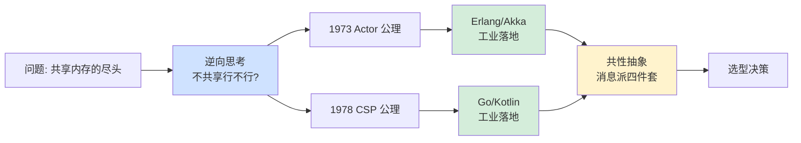
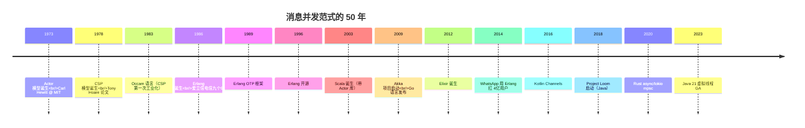
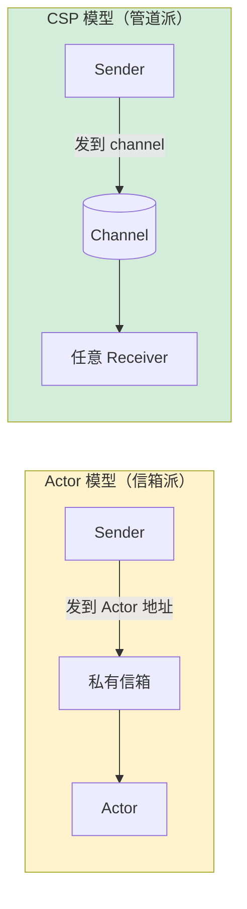
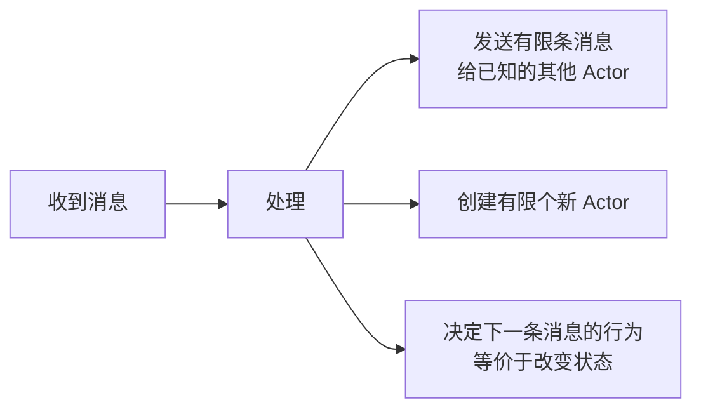
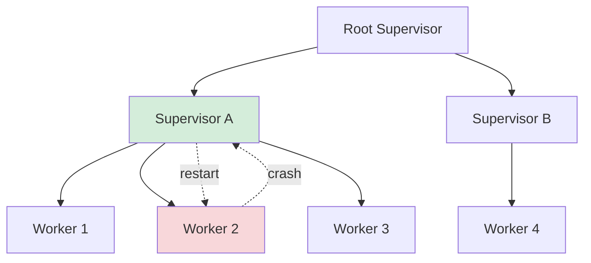
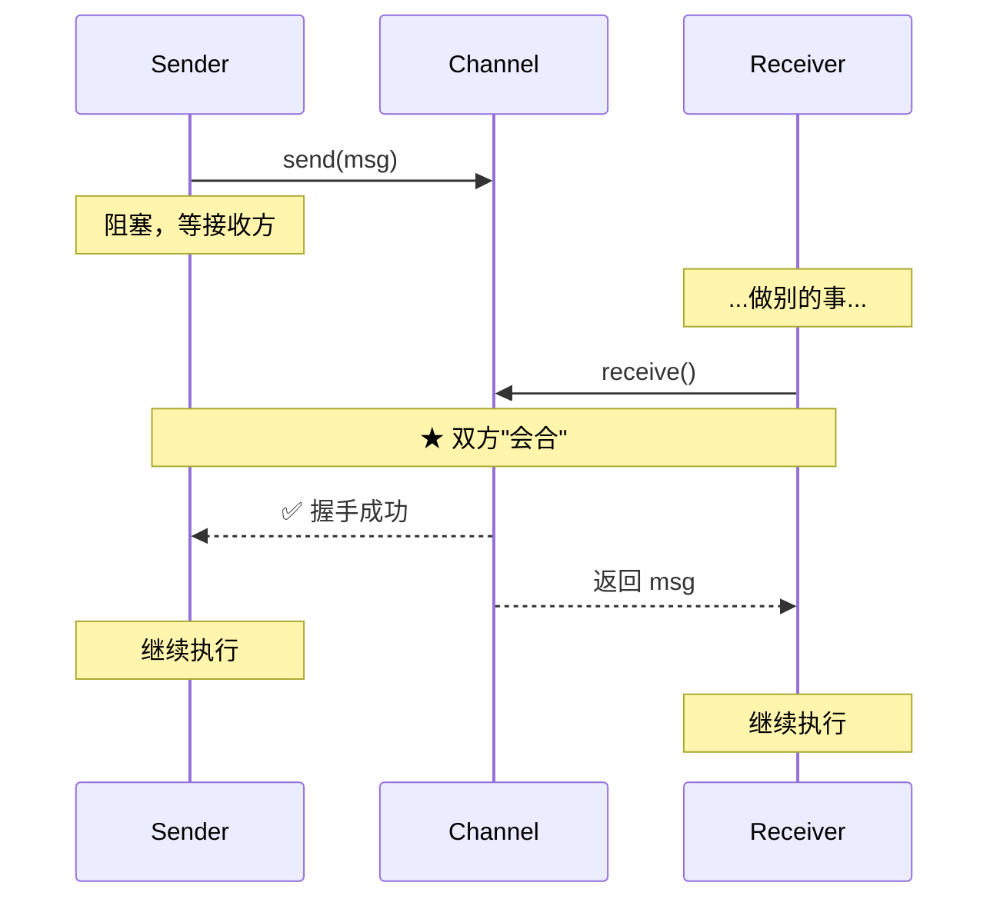
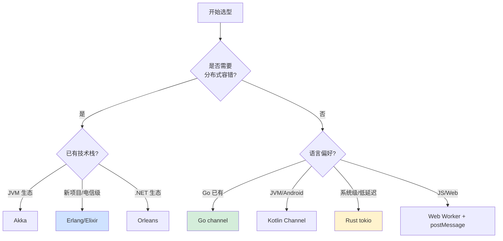
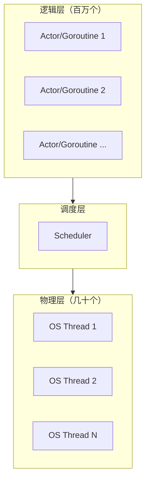
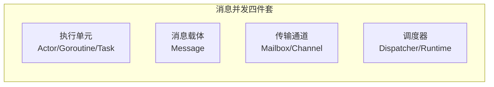

# 3.14 Actor 与 CSP 并发模型

> 📍 **本篇位置**：第 3 卷 · 并发之道 · 第 14 篇（范式篇收束）
> 🎯 **核心矛盾**：**共享内存 + 锁这条路走了 50 年，最终在云原生时代撞了死墙——多核扩展性差、跨机器无能为力、可组合性近乎为零。如果根本不允许任务之间共享内存，并发还能怎么做？**
> 🧭 **设计灵魂**：Actor 和 CSP 不是"另一种锁"——它们是**对"什么是并发"的根本性重定义**：把"如何正确加锁"翻译成"如何正确设计消息"，把控制流的复杂性收敛进消息流
> 🌐 **跨平台覆盖**：Erlang/Elixir BEAM · Akka (JVM) · Go channel · Kotlin Channel/Flow · Rust tokio mpsc · Pony (formal) · Orleans (.NET)
> 🔗 **延伸阅读**：← [3.13 协程核心设计思想](./3.13.协程核心设计思想.md) · ← [3.9 锁核心设计和思想](./3.9.锁核心设计和思想.md) · → [3.15 线程池的设计思想](./3.15.线程池的设计思想.md) · → [3.18 结构化并发设计思想](./3.18.结构化并发设计思想.md) · → [5.x 消息机制设计思想](../05.交互和系统/)

---

> 上一篇我们看清了"协程"——一个执行单元如何被挂起和恢复。本篇要回答更根本的问题：**协程之间凭什么协作？如果不共享内存、不加锁，它们怎么完成任务？**
>
> 答案是 50 年前两位计算机科学家给出的——**Carl Hewitt 的 Actor 模型（1973）和 Tony Hoare 的 CSP 模型（1978）**。这两个模型在 2010s 才真正"赢"了——支撑了 WhatsApp 4 亿用户、整个 Go 生态、所有现代分布式系统的核心通信。

#### 目录介绍
- [01.真实事故引入](#01真实事故引入)
  - [1.1 一次邮箱炸了的支付雪崩](#11-一次邮箱炸了的支付雪崩)
  - [1.2 一段看似无死锁却死锁的Go](#12-一段看似无死锁却死锁的go)
  - [1.3 灵魂三问](#13-灵魂三问)
  - [1.4 本篇的探索路径](#14-本篇的探索路径)
  - [1.5 为什么这个问题值得讲透](#15-为什么这个问题值得讲透)
- [02.共享内存为什么走到了尽头](#02共享内存为什么走到了尽头)
  - [2.1 一个16核CPU的扩展性诅咒](#21-一个16核cpu的扩展性诅咒)
  - [2.2 锁体系的"四大不可能"](#22-锁体系的四大不可能)
  - [2.3 逆向思考：不共享行不行](#23-逆向思考不共享行不行)
  - [2.4 50年前发明，50年后才赢](#24-50年前发明50年后才赢)
- [03.两位巨人的50年：Actor与CSP演进](#03两位巨人的50年actor与csp演进)
  - [3.1 历史时间线](#31-历史时间线)
  - [3.2 Actor vs CSP：同源异流](#32-actor-vs-csp同源异流)
  - [3.3 哲学差异：身份 vs 通道](#33-哲学差异身份-vs-通道)
- [04.Actor模型：从公理到工业化](#04actor模型从公理到工业化)
  - [4.1 Hewitt 的"三条公理"](#41-hewitt-的三条公理)
  - [4.2 Erlang：Actor原教旨主义实现](#42-erlangactor原教旨主义实现)
  - [4.3 Akka：JVM上Actor现代化](#43-akkajvm上actor现代化)
  - [4.4 Actor 的杀手锏：监督树](#44-actor-的杀手锏监督树)
  - [4.5 Actor进一步演化：分布式透明](#45-actor进一步演化分布式透明)
- [05.CSP模型：会合即同步的反直觉之美](#05csp模型会合即同步的反直觉之美)
  - [5.1 Hoare 的"反常识"洞察](#51-hoare-的反常识洞察)
  - [5.2 Go：CSP 的工业化](#52-gocsp-的工业化)
  - [5.3 Select：CSP 的"多路复用"](#53-selectcsp-的多路复用)
  - [5.4 经典模式 1：Pipeline](#54-经典模式-1pipeline)
  - [5.5 经典模式2：Fan-out/Fan-in](#55-经典模式2fan-outfan-in)
- [06.六种语言的横向对比](#06六种语言的横向对比)
  - [6.1 横评表](#61-横评表)
  - [6.2 同一问题五语言怎么写](#62-同一问题五语言怎么写)
  - [6.3 选择哪个：决策树](#63-选择哪个决策树)
  - [6.4 一句话指南](#64-一句话指南)
- [07.两大模型的物理实现](#07两大模型的物理实现)
  - [7.1 Actor 邮箱的实现](#71-actor-邮箱的实现)
  - [7.2 Go Channel 的实现](#72-go-channel-的实现)
  - [7.3 调度器：决定"什么时候跑"](#73-调度器决定什么时候跑)
- [08.经典陷阱与生产级反模式](#08经典陷阱与生产级反模式)
  - [8.1 陷阱一：邮箱无限堆积](#81-陷阱一邮箱无限堆积11)
  - [8.2 陷阱二：Channel死锁](#82-陷阱二channel死锁12)
  - [8.3 陷阱三：消息顺序假设](#83-陷阱三消息顺序假设)
  - [8.4 陷阱四：Actor内做阻塞操作](#84-陷阱四actor内做阻塞操作)
  - [8.5 陷阱五：把 Channel 当锁用](#85-陷阱五把-channel-当锁用)
  - [8.6 陷阱六：Actor间循环依赖死锁](#86-陷阱六actor间循环依赖死锁)
  - [8.7 陷阱七：Goroutine 泄漏](#87-陷阱七goroutine-泄漏)
- [09.跨语言 Actor / CSP 陷阱速查表](#09跨语言-actor--csp-陷阱速查表)
- [10.七字真言 × 多语言映射表](#10七字真言--多语言映射表)
- [11.一句话总结](#11一句话总结)
  - [11.1 三层认知阶梯](#111-三层认知阶梯)
  - [11.2 消息派四件套（共性抽象）](#112-消息派四件套共性抽象)
  - [11.3 七字真言](#113-七字真言)
  - [11.4 与下篇的承接](#114-与下篇的承接)

---

## 01.真实事故引入

### 1.1 一次邮箱炸了的支付雪崩

我维护过一个用 Akka 重构的支付通知服务。架构看起来很优雅：

```
HTTP 入口 → DispatcherActor → 路由到 100 个 NotifyActor
                                        ↓
                                   各自调用下游短信/邮件/Push 网关
```

某天大促期间，**短信网关下游响应从 50ms 变成 5 秒**（运营商限流）。我们的服务监控数据：

```
12:00:00  QPS 5000，正常
12:05:00  短信延迟开始上升
12:10:00  Akka 内存占用从 2GB 飙到 14GB
12:11:30  JVM 频繁 Full GC，每次 8 秒
12:12:00  OOM，整个 ActorSystem 崩溃
12:12:30  下游所有依赖该服务的系统级联失败
```

**第一反应**：是不是 Actor 数量过多？是不是有内存泄漏？

但 dump 一看，**100 个 NotifyActor 都活着，每个 Actor 自身的状态对象都很小**。**OOM 的真凶是它们的"邮箱"**：

```
每个 Actor 邮箱里堆积了 80 万条未处理消息
100 个 Actor × 80 万 × 平均消息 200 字节 = 16 GB
```

**根因还原**：

```
1. 短信网关响应 50ms → 每个 Actor 每秒处理 20 条消息 → 100 Actor 总吞吐 2000 QPS
2. 短信网关响应变 5000ms → 每个 Actor 每秒处理 0.2 条消息 → 总吞吐 20 QPS
3. 入口 QPS 还是 5000 → 5000 - 20 = 4980 条/秒积压在邮箱
4. 默认邮箱无限大 → 几分钟就堆出几百万消息
5. 邮箱堆积 → JVM Heap 爆炸 → GC 风暴 → OOM
```

**修复方案**：

```scala
// ❌ 默认配置——邮箱无限
val actor = system.actorOf(Props[NotifyActor]())

// ✅ 修复 1：有界邮箱
val config = ConfigFactory.parseString("""
    bounded-mailbox {
        mailbox-type = "akka.dispatch.BoundedMailbox"
        mailbox-capacity = 10000
        mailbox-push-timeout-time = 100ms
    }
""")

// ✅ 修复 2：背压（Akka Streams）
Source(httpRequests)
    .buffer(1000, OverflowStrategy.dropHead)   // 满了丢老的
    .mapAsync(parallelism = 100)(notifyActor.ask)
    .runWith(Sink.ignore)

// ✅ 修复 3：主动拉模式 (Reactive Streams)
//    消费者按自己处理速度向上游 request(N)
```

这次事故让我对 Actor 模型有了深刻理解——**Actor 模型的"无锁"和"轻量"不是免费午餐，邮箱是它的阿喀琉斯之踵**。

### 1.2 一段看似无死锁却死锁的Go

另一个反直觉的故事。我同事写了这样一段 Go 代码：

```go
func process(items []Item) []Result {
    results := make(chan Result)         // ← 无缓冲
    
    for _, item := range items {
        go func(it Item) {
            results <- handle(it)        // 发送
        }(item)
    }
    
    var out []Result
    for r := range results {              // 接收
        out = append(out, r)
    }
    return out
}
```

**单元测试通过、code review 通过、压测也通过**。线上跑了 3 个月，某天用户输入了一个 `items 长度为 0` 的请求——**服务直接挂了**：

```
fatal error: all goroutines are asleep - deadlock!
```

**根因**：

```
items 为 0 → 没有 goroutine 启动 → results 永远不会被关闭
range results 永远等下一个值 → 主 goroutine 阻塞
没有其他活动 goroutine → Go runtime 检测到全局死锁 → panic
```

**这段代码在物理上是"无锁"的**——但它**用 channel 写出了死锁**。这告诉我们：**消息传递不会自动消除死锁，它只是把"锁的死锁"变成了"通信的死锁"**。

### 1.3 灵魂三问

这两个真实场景让我反复追问三个问题：

1. **既然消息传递这么好——无锁、易推理、可分布式——为什么过去 30 年主流仍然是共享内存 + 锁？是 Actor/CSP 不够好，还是别的原因？** —— 这两条路线的根本差异是什么？
2. **Actor 模型是 1973 年发明的，CSP 是 1978 年——为什么直到 2010 年代才"工业级爆发"？** —— 是什么硬件条件改变了？
3. **Erlang 和 Go 都是"消息传递"派，但前者用 Actor、后者用 CSP——这两种选择背后是什么不同的工程哲学？** —— 我该选哪一个？

如果你能回答这三个问题，你就理解了**为什么 2020 年代是消息传递派的胜利时代**。

### 1.4 本篇的探索路径



### 1.5 为什么这个问题值得讲透

我想抛三个**几乎所有 Go/Akka 程序员都答不全**的问题：

1. **为什么 Go 官方说"用 channel 通信，但用 mutex 同步"？这两个不矛盾吗？** —— 因为 channel 不是锁，把它当锁用是反模式。
2. **为什么 Erlang 进程能轻松开 200 万个，而 Akka Actor 单机只能撑几十万？** —— 因为 BEAM VM 是为 Actor 量身定做的，Akka 跑在 JVM 上有先天劣势。
3. **WhatsApp 用 Erlang，2 个工程师撑起了 9 亿用户。这真的只是"语言选得好"吗？** —— 不只是——Erlang/OTP 的"监督树"重新定义了"系统可靠性"的工程范式。

读完本章你会懂：**Actor 和 CSP 不是技术——是哲学。是一种把"并发的复杂性"从控制流转移到消息流的范式革命**。

---

## 02.共享内存为什么走到了尽头

### 2.1 一个16核CPU的扩展性诅咒

要理解 Actor/CSP 为什么诞生，先看共享内存的极限。

假设你有一个 16 核机器，要做一个简单的"全局计数器"：

```java
public class Counter {
    private long count = 0;
    
    public synchronized void increment() {
        count++;
    }
}
```

理论上 16 个核同时调用 `increment`，应该是单核的 16 倍吞吐。**实测呢？**

```
1 核：1500 万次/秒
2 核：1700 万次/秒（不是 3000 万）
4 核：1500 万次/秒（反而下降！）
8 核：900 万次/秒
16 核：400 万次/秒  ← 比单核还慢
```

这是真实的测试数据。**为什么核越多反而越慢？**

根因是**缓存一致性协议（MESI）的代价**——详见 [3.6 并发 Bug 源头由来](./3.6.并发Bug源头由来.md)。每次 `count++`：

```
Core 1 拿到 count 的独占权
Core 2 想改 count → 必须先让 Core 1 把 cache line 标记为 invalid
Core 1 写回内存 → Core 2 重新加载
Core 3 想改 → 重复上面流程
...
```

**16 个核共抢一个 cache line → cache line 在核间反复跳动 → 比直接读内存还慢**。

**这就是共享内存并发的天花板**——它不是"软件实现差"，是**硬件层面的物理极限**。

### 2.2 锁体系的"四大不可能"

为了对付共享内存的并发问题，过去 50 年发明了庞大的锁体系：

```
mutex → reentrant lock → read-write lock → segment lock
     → optimistic lock → CAS → lock-free → wait-free
```

**每一种都是为了缓解前一种的不足**。但叠加到最后，仍然有四个根本无法解决的问题——

**问题 ①：可组合性差**

两个线程安全的对象，组合起来就不一定线程安全：

```java
// account1 和 account2 各自的方法都是 synchronized
void transfer(Account a1, Account a2, int amount) {
    a1.withdraw(amount);    // 这一步成功
    // ★ 这一刻有人可能查询 a1.balance + a2.balance，看到"钱凭空消失"
    a2.deposit(amount);     // 这一步才完成
}
```

**根本问题**：锁不是"代数可组合"的——`f` 安全 + `g` 安全 ≠ `f ∘ g` 安全。

**问题 ②：易死锁**

```java
// 线程 A
synchronized(lock1) {
    synchronized(lock2) { ... }
}

// 线程 B
synchronized(lock2) {
    synchronized(lock1) { ... }
}
// ★ A 拿到 lock1 等 lock2，B 拿到 lock2 等 lock1 → 死锁
```

**根本问题**：锁的获取顺序是隐式的，编译器无法静态检查。

**问题 ③：性能崩塌**

§2.1 那个例子——锁竞争下吞吐反而下降。

**问题 ④：分布式失效**

```
单机：synchronized 工作得很好
两台机器：根本没有"共享内存" → 锁机制完全失效
→ 必须用分布式锁（Redis、ZK、Etcd）→ 性能崩塌、复杂度爆炸
```

**云原生时代，问题 ④ 是致命的**——单机再怎么优化也救不了你。

### 2.3 逆向思考：不共享行不行

> "**既然共享内存 + 锁这条路走到尽头，能不能反过来——干脆不共享内存？**"

这是 Carl Hewitt（1973）和 Tony Hoare（1978）几乎同时给出的答案。两人不知道对方在做什么，但得出了同一个核心思想：

> **每个并发单元都有自己的私有状态，谁也碰不了；想让别人做事？发一条消息过去。**

**这一下解决了所有四大问题**：

| 问题 | 共享内存 + 锁 | 消息传递 |
|---|---|---|
| 可组合性 | 差 | ✅ 消息可以包装、转发、序列化 |
| 死锁 | 易发生 | ✅ 没有锁就没有锁的死锁（虽然有别的死锁形式） |
| 多核扩展 | 性能崩塌 | ✅ 每核一组 Actor，cache line 不共享 |
| 分布式 | 失效 | ✅ 消息天然可跨机器序列化 |

**这不是技巧升级——是哲学升级**。

### 2.4 50年前发明，50年后才赢

§1.5 第二题。Actor 1973 年就有了，CSP 1978 年就有了——**为什么我们等了 30 多年才迎来工业级爆发？**

答案是——**硬件条件等了 30 年才到位**。

**1970-2000 年代**：

```
单 CPU 单核为主
内存几 MB ~ 几百 MB
网络几 Kbps ~ 几 Mbps
单机服务一切

→ 锁够用了，消息传递的"分布式优势"无处发挥
```

**2010 年后**：

```
单机 16-128 核普及
内存几十 GB ~ TB
网络千兆-万兆
云计算让"动态扩缩容"成为常态
微服务让"分布式"成为默认

→ 锁的所有缺点暴露
→ Actor/CSP 的所有优势绽放
```

**WhatsApp（基于 Erlang）2014 年用 200 台服务器扛住 4 亿用户**——这是 Actor 模型在云时代的标志性胜利。

**Go 2009 年发布、2015 年成为 Docker/K8s 的核心语言**——这是 CSP 模型在云时代的标志性胜利。

**这两件事不是巧合——是同一种力量的两面**。

---

## 03.两位巨人的50年：Actor与CSP演进

### 3.1 历史时间线



**关键观察**：消息传递派从理论到工业化的"实际胜利"，**全部发生在 2009 年之后**——也就是多核+云时代真正到来后。

### 3.2 Actor vs CSP：同源异流

两个模型乍看相似，本质却分别刻画了**两种不同的工程哲学**：



| 维度 | Actor | CSP |
|---|---|---|
| **一等公民** | Actor（有身份）| Channel（有身份）|
| **消息去向** | 指定收件人（Actor 地址）| 指定通道（任意消费者）|
| **同步性** | 默认**异步**（fire-and-forget）| 默认**同步**（rendezvous）|
| **缓冲** | 信箱天然有缓冲（通常无界）| 显式声明 `make(chan T, N)` |
| **耦合度** | 发送方必须知道 Actor 地址 | 发送方只知道 channel |
| **典型语言** | Erlang/Elixir/Akka/Orleans | Go/Occam/Kotlin Channel |
| **天然适合** | 分布式 + 有状态服务 | 单机高并发 + 流水线 |

**记忆口诀**：

> **Actor 像邮件**——你必须知道对方邮箱地址；
> **CSP 像水管**——谁接在管子另一头不重要。

### 3.3 哲学差异：身份 vs 通道

**深入一点看**——Actor 和 CSP 各自把"什么是一等公民"放在了不同位置：

**Actor 模型**：

```
"世界由 Actor 组成。每个 Actor 是一个独立的身份（identity）。
 它有名字、地址、生命周期、错误处理责任。
 通信只是 Actor 之间相互'认识'后的副产物。"
```

**CSP 模型**：

```
"世界由通信发生。Channel 是头等公民——它定义了'什么消息可以流过'。
 协程只是站在 channel 两端的临时角色。
 谁来收谁来发都不重要——重要的是 channel 的契约。"
```

**这反映在 API 上**：

```scala
// Akka——Actor 是头等公民
val notifyActor = system.actorOf(Props[NotifyActor]())   // 显式创建身份
notifyActor ! "do something"                              // 发到这个身份
```

```go
// Go——Channel 是头等公民
ch := make(chan string)                                   // 显式创建通道
go func() { ch <- "do something" }()                      // 谁发不重要
go func() { msg := <-ch }()                               // 谁收不重要
```

**这两种哲学没有优劣——它们适合不同的问题**。

---

## 04.Actor模型：从公理到工业化

### 4.1 Hewitt 的"三条公理"

Hewitt 1973 年定义的 Actor 本体非常干净——**一个 Actor 接收到一条消息后，只能做 3 件事**：



**就这三条**——**没有共享变量、没有锁、没有 await**。

这种"少即是多"的设计有惊人的威力——**任何复杂的并发程序都可以用这三条规则构造**：

```
互斥？        →  让一个 Actor 拥有那个资源，所有访问通过给它发消息
状态机？      →  Actor 自己就是状态机
分布式锁？    →  让一个 Actor 当锁服务
事件驱动？    →  Actor 天然事件驱动
背压？        →  Actor 拒收消息或延迟回复
```

### 4.2 Erlang：Actor原教旨主义实现

Erlang 是 Actor 第一次真正工业化落地。**1986 年爱立信用它做电信交换机**，做到了"九个 9"——每年宕机 31 毫秒。

```erlang
%% 计数器 Actor
counter(Count) ->
    receive
        {increment, From} ->
            NewCount = Count + 1,
            From ! {value, NewCount},
            counter(NewCount);                    %% 尾递归 = 新状态
        stop ->
            ok
    end.

%% 启动 + 使用
Pid = spawn(fun() -> counter(0) end).
Pid ! {increment, self()}.                        %% 异步发送
receive {value, V} -> io:format("~p~n", [V]) end.
```

**两个关键设计**：

**1. spawn 启动的"进程"是 BEAM VM 内部的轻量级单元**

```
不是 OS 进程！不是 OS 线程！
是 BEAM 虚拟机内部调度的"绿色进程"
单进程内存开销：338 字节（初始）
单机能跑：200 万+
```

**这就是 §1.5 第二题的部分答案**——BEAM 是为 Actor 量身打造的 VM，进程切换、消息传递、调度都做了极致优化。

**2. 状态靠"递归调用自己"维护**

```erlang
counter(NewCount)   %% 这不是普通函数调用——是"用新状态处理下一条消息"
```

这是函数式 + Actor 的精髓——**状态变化通过"重新进入函数"表达，而不是修改变量**。从根本上消除了"中间状态"概念。

### 4.3 Akka：JVM上Actor现代化

JVM 没有原生 Actor 支持。Akka（2009）用线程池 + 任务队列模拟出来：

```scala
import akka.actor._

class Counter extends Actor {
  var count = 0                                  // 私有状态，线程不可见
  def receive = {
    case "increment" => count += 1
    case "get"       => sender() ! count
  }
}

// 使用
val system = ActorSystem("demo")
val counter = system.actorOf(Props[Counter](), "counter")
counter ! "increment"                             // 异步
counter ? "get"                                   // ask 模式 → Future
```

**Akka 的实现机制**：

```
ActorSystem
    ├── Dispatcher (本质是 ForkJoinPool)
    ├── Mailbox (每个 Actor 一个，默认无界 ConcurrentLinkedQueue)
    └── Actor 实例 (普通对象)

发消息：把 (sender, msg) 打包扔进收件人的 Mailbox
派发：Dispatcher 看到 Mailbox 非空 → 找个空闲线程 → 调 Actor.receive(msg)
```

**关键是"一个 Mailbox 同一时刻只能被一个线程处理"**——这保证了 Actor 内部代码是单线程的，**无需任何锁**。

但 Akka 性能比 Erlang 差一截：

```
单机 Actor 数量：
  Erlang: 200万+
  Akka:   30-50万（受 JVM 内存模型和 GC 影响）

消息延迟：
  Erlang: 微秒级
  Akka:   微秒到毫秒级（受线程池调度影响）
```

**这是"通用 VM 改造 vs 专用 VM"的代价**——但 Akka 换来了 JVM 生态。

### 4.4 Actor 的杀手锏：监督树

这是 Actor 模型**真正独有的武器**——其他并发模型几乎没有：



**"Let it crash"——Erlang 的核心哲学**：

```
传统 try/catch 思路：
  Worker 出错 → catch 异常 → 试图恢复 → 但状态已经污染 → 后续仍然出错
  
Actor 监督树思路：
  Worker 出错 → 不要 try → 让它崩溃 → Supervisor 检测到 → 重启它
  → 重启后是干净的初始状态 → 100% 可预测
```

**重启策略**（OTP 标准）：

| 策略 | 行为 |
|---|---|
| `one_for_one` | 只重启崩溃的那个 Worker |
| `one_for_all` | 重启所有兄弟 Worker（适用于强依赖）|
| `rest_for_one` | 重启崩溃的及其后启动的 Worker |
| `simple_one_for_one` | 动态创建大量同质 Worker（如 HTTP 请求处理）|

**§1.5 第三题的答案**：WhatsApp 的成功不只是"语言选得好"——是**OTP 的监督树重新定义了"可靠系统"的构建方式**。即使代码有 bug、即使硬件偶发故障，监督树都能在毫秒级恢复。

**对比 Java**：JVM 一个线程 OOM → 整个进程崩；Erlang 一个 Actor OOM → 只死自己，监督者立即重启。**这是 quality of resilience 的代际差异**。

### 4.5 Actor进一步演化：分布式透明

Erlang/Akka 都允许 Actor 跨机器：

```scala
// Akka——本地和远程的 API 完全一样！
val localActor = system.actorOf(Props[MyActor](), "local")
val remoteActor = system.actorSelection("akka.tcp://demo@10.0.1.5:2552/user/myActor")

localActor ! "hello"                             // 本机
remoteActor ! "hello"                            // 远程，但代码看不出区别
```

**这是 Actor 模型最大的工程优势**——**分布式透明（location transparency）**。代码不需要区分"调用本机方法"还是"远程 RPC"——都是发消息。

**对比 RPC**：

```java
// 传统 RPC：本地调用和远程调用代码完全不同
localService.doWork();                  // 本地：直接调用
remoteService.doWork();                 // 远程：要处理超时、重试、序列化、错误...

// Akka：完全一样
actor ! Work                            // 自动透明处理上述全部
```

**WhatsApp 的 Erlang 集群有 1000+ 节点，节点间用 Erlang 消息透明通信**——你写代码时不需要关心"这个 Actor 在哪台机"。

---

## 05.CSP模型：会合即同步的反直觉之美

### 5.1 Hoare 的"反常识"洞察

Tony Hoare 1978 年的 CSP 论文有一个反直觉设计：

> **通信本身就是同步点。**

也就是——**不是"先发再收"或"先收再发"，而是"发和收必须同时发生"**。



这叫 **rendezvous（会合）**——**通信和同步合二为一**。

**为什么这个设计很美？**

```
传统多线程模型：
  线程 A 写共享变量 x
  线程 B 读共享变量 x
  问题：A 写完了吗？B 看到的是新值还是旧值？→ 需要锁/内存屏障

CSP 模型：
  线程 A 通过 channel 发 x
  线程 B 通过 channel 收 x
  保证：B 收到 x 时，A 一定写完了 → 不需要任何锁
  
→ 通信本身蕴含了"happens-before"关系
→ 数据传递 + 同步控制 一次完成
```

### 5.2 Go：CSP 的工业化

Go 1.0（2012）把 channel 做成了一等公民：

```go
func main() {
    ch := make(chan int)                          // 无缓冲 = 同步

    go func() {
        ch <- 42                                  // 发送，阻塞直到有人收
    }()

    v := <-ch                                     // 接收
    fmt.Println(v)
}
```

**无缓冲 channel 就是 Hoare 原版 CSP**——发送方阻塞直到接收方到达。

但纯 CSP 太极端，Go 在工程上做了妥协——**允许有缓冲 channel**：

```go
ch := make(chan int, 100)                         // 容量 100 的缓冲
ch <- 1   // 不阻塞
ch <- 2   // 不阻塞
// ... 直到第 100 条都不阻塞
ch <- 101 // 第 101 条阻塞，等有人取走才能继续
```

**有缓冲 channel 介于 Actor（无界）和原版 CSP（无缓冲）之间**——容量你来决定。

### 5.3 Select：CSP 的"多路复用"

`select` 对应 CSP 论文里的 **guarded command**——在多个通信上等待：

```go
select {
case msg := <-ch1:
    fmt.Println("from ch1:", msg)
case msg := <-ch2:
    fmt.Println("from ch2:", msg)
case ch3 <- 99:
    fmt.Println("sent to ch3")
case <-time.After(1 * time.Second):
    fmt.Println("timeout")
}
```

**select 的精髓**：

```
1. 多个分支同时"准备好"时，随机选一个（避免饥饿）
2. 有 default 分支时，没准备好就立即走 default（非阻塞）
3. timeout 是惯用法，不需要专门的 API
```

**对比 Java 多线程的 wait/notify**：

```java
synchronized (lock) {
    while (!cond1 && !cond2 && !cond3) {
        lock.wait(timeout);
    }
    if (cond1) ...
    else if (cond2) ...
    else if (cond3) ...
}
// 易错：必须 while 不能 if（虚假唤醒），必须 synchronized，超时处理复杂
```

**Go 的 select 比 Java 的 wait/notify 简洁 10 倍**——且不会出现"虚假唤醒"等坑。

### 5.4 经典模式 1：Pipeline

CSP 最美的应用是**流水线**：

```go
// 阶段 1：生成数字
gen := func() <-chan int {
    out := make(chan int)
    go func() {
        defer close(out)
        for i := 0; i < 100; i++ { out <- i }
    }()
    return out
}

// 阶段 2：平方
square := func(in <-chan int) <-chan int {
    out := make(chan int)
    go func() {
        defer close(out)
        for v := range in { out <- v * v }
    }()
    return out
}

// 阶段 3：过滤
filter := func(in <-chan int, pred func(int) bool) <-chan int {
    out := make(chan int)
    go func() {
        defer close(out)
        for v := range in { if pred(v) { out <- v } }
    }()
    return out
}

// 组装：声明式
for v := range filter(square(gen()), func(x int) bool { return x > 100 }) {
    fmt.Println(v)
}
```

**每个阶段都是独立 goroutine，彼此靠 channel 相连**——

```
天然并行：每个阶段独立运行
天然背压：下游慢→上游 channel 满→上游自动停下来
天然解耦：换掉中间任意阶段不影响其他
天然复合：filter(square(gen())) 可读性极高
```

**这就是 Apache Flink、Spark Streaming、Akka Streams 的设计源头**——所有"流式数据处理"框架的灵魂都是 CSP pipeline。

### 5.5 经典模式2：Fan-out/Fan-in

```go
// Fan-out：把工作分发给多个 worker
func fanOut(in <-chan Job, n int) []<-chan Result {
    outs := make([]<-chan Result, n)
    for i := 0; i < n; i++ {
        out := make(chan Result)
        outs[i] = out
        go func() {
            defer close(out)
            for job := range in {
                out <- handle(job)
            }
        }()
    }
    return outs
}

// Fan-in：合并多个 worker 的输出
func fanIn(ins ...<-chan Result) <-chan Result {
    out := make(chan Result)
    var wg sync.WaitGroup
    for _, in := range ins {
        wg.Add(1)
        go func(c <-chan Result) {
            defer wg.Done()
            for v := range c {
                out <- v
            }
        }(in)
    }
    go func() {
        wg.Wait()
        close(out)
    }()
    return out
}

// 使用
jobs := generateJobs()
workers := fanOut(jobs, 100)            // 100 个 worker 并行
results := fanIn(workers...)            // 合并结果
```

**这是分布式系统中"任务分发-收集"模式的标准做法**——MapReduce 思想的本地化体现。

---

## 06.六种语言的横向对比

### 6.1 横评表

| 语言 | 范式 | 并发单元 | 通信原语 | 远程能力 | 监督/容错 | 单机规模 |
|---|---|---|---|---|---|---|
| **Erlang** | Actor | BEAM Process | `!` / `receive` | 🟢 原生透明 | 🟢 OTP 监督树 | 200 万+ |
| **Elixir** | Actor | BEAM Process | `send/receive` | 🟢 原生透明 | 🟢 OTP | 200 万+ |
| **Akka (Scala/Java)** | Actor | ActorRef | `tell/ask` | 🟢 Akka Cluster | 🟢 Supervision | 30-50 万 |
| **Go** | CSP | goroutine | channel + select | 🔴 需 RPC | 🔴 手动 recover | 100 万+ |
| **Kotlin** | CSP | coroutine | Channel/Flow | 🔴 单机 | 🟡 SupervisorJob | 100 万+ |
| **Rust (tokio)** | CSP-ish | async task | mpsc/oneshot/broadcast | 🔴 单机 | 🔴 手动 | 100 万+ |

**一眼看出的规律**：

```
Actor 流派 = 天然分布式 + 容错强（代价：单机性能略逊）
CSP 流派 = 单机极致性能 + 语法美（代价：分布式要靠外部框架）
```

### 6.2 同一问题五语言怎么写

**问题**：启动一个 Worker，接收 3 条"+1"消息，打印结果。

**Erlang**：
```erlang
Worker = spawn(fun Loop() ->
    receive
        {add, N} -> io:format("~p~n", [N + 1]), Loop()
    end
end),
Worker ! {add, 10},
Worker ! {add, 20},
Worker ! {add, 30}.
```

**Akka (Scala)**：
```scala
class Worker extends Actor {
  def receive = { case n: Int => println(n + 1) }
}
val w = system.actorOf(Props[Worker]())
w ! 10; w ! 20; w ! 30
```

**Go**：
```go
ch := make(chan int)
go func() {
    for n := range ch { fmt.Println(n + 1) }
}()
ch <- 10; ch <- 20; ch <- 30
close(ch)
```

**Kotlin**：
```kotlin
val ch = Channel<Int>()
launch {
    for (n in ch) println(n + 1)
}
ch.send(10); ch.send(20); ch.send(30)
ch.close()
```

**Rust (tokio)**：
```rust
let (tx, mut rx) = mpsc::channel::<i32>(32);
tokio::spawn(async move {
    while let Some(n) = rx.recv().await { println!("{}", n + 1); }
});
tx.send(10).await.unwrap();
tx.send(20).await.unwrap();
tx.send(30).await.unwrap();
```

**核心骨架完全一样**——"创建通信载体 + 启动并发单元 + 发消息"。**区别在阻塞语义、缓冲、错误处理等二阶细节**。

### 6.3 选择哪个：决策树



### 6.4 一句话指南

| 场景 | 推荐 |
|---|---|
| **电信级/金融级容错系统** | Erlang/Elixir |
| **JVM 上的分布式 actor** | Akka |
| **微服务 + 高并发 IO** | Go |
| **Android 异步编程** | Kotlin Coroutines + Flow |
| **嵌入式/系统级** | Rust tokio |
| **.NET 分布式应用** | Orleans |

---

## 07.两大模型的物理实现

### 7.1 Actor 邮箱的实现

**邮箱本质是一个并发安全队列**。看 Akka 的实现：

```scala
// 默认 Mailbox 实现（简化版）
class UnboundedMailbox extends MessageQueue {
    private val queue = new ConcurrentLinkedQueue[Envelope]()
    
    def enqueue(receiver: ActorRef, handle: Envelope): Unit = 
        queue.offer(handle)
    
    def dequeue(): Envelope = queue.poll()
    
    def numberOfMessages: Int = queue.size
}
```

**Erlang BEAM 的实现更激进**：

```
每个进程的 mailbox 是一个特殊的"双链表 + 偏移指针"
  - heap_msg: 已经"看过但没匹配"的消息（暂存区）
  - inbox:    新到达的消息
  - 模式匹配时只在 heap_msg + inbox 中查找
  - 找不到就返回 inbox 顶部，重新检查
```

**这种设计的特殊优势**：

```erlang
%% Erlang 支持"选择性接收"——只接收符合模式的消息，不符合的留在邮箱
receive
    {important, Data} -> handle_important(Data);
    {urgent, Data}    -> handle_urgent(Data)
%% 普通消息会留在邮箱，下次再处理
end.
```

**Go channel 不支持这种语义**——这是 Actor 模型的独特能力。

### 7.2 Go Channel 的实现

Go channel 是 runtime 内部的 `hchan` 结构：

```go
// runtime/chan.go (简化)
type hchan struct {
    qcount   uint           // 当前缓冲中的元素数量
    dataqsiz uint           // 缓冲区大小
    buf      unsafe.Pointer // 环形缓冲区
    elemsize uint16
    elemtype *_type
    
    sendx    uint           // 下一个发送位置
    recvx    uint           // 下一个接收位置
    
    recvq    waitq          // 等待接收的 goroutine 队列
    sendq    waitq          // 等待发送的 goroutine 队列
    
    lock     mutex          // ★ 内部确实有锁！
    closed   uint32
}
```

**关键洞察**：**channel 内部仍然用了锁**——但这个锁的范围极小（只保护元数据更新），且大部分操作都是 lock-free 的快速路径。

**Channel 操作的快速路径**：

```
发送 v 到 ch（无缓冲）：
  if (有 goroutine 在 recvq 等接收) {
      直接把 v 拷贝过去 + 唤醒它（不用锁！）
      return
  }
  // 慢速路径：拿 mutex，把当前 goroutine 挂到 sendq，让出 CPU
```

**这是 Go 性能的关键**——绝大多数 channel 操作走快速路径，开销 ~30ns，比 mutex（~100ns）还快。

### 7.3 调度器：决定"什么时候跑"

两种模型都依赖**M:N 调度器**：



**Go 的 GMP 调度器**（详见 [3.13 协程核心设计思想](./3.13.协程核心设计思想.md)）：

```
G (Goroutine)：执行单元
M (Machine)：OS 线程
P (Processor)：逻辑处理器（绑定 M，持有 G 队列）

调度策略：
  M 始终绑定一个 P
  P 维护本地 G 队列
  M 从本地 P 取 G 执行
  P 队列空 → 从其他 P 偷一半（work-stealing）
```

**Erlang 调度器**：

```
N 个 OS 线程，每个绑定到一个 CPU 核心
每个调度器线程维护多个优先级队列
进程可以"reduction-based" 抢占（每执行 2000 条字节码必让出）
→ 强抢占，公平性极高
```

**两者的差异**：

```
Go：合作式 + 弱抢占（Go 1.14 后加了 SIGURG 抢占）
Erlang：强抢占（基于字节码计数，无法欺骗）

→ Erlang 适合"有恶意 Actor"的不可信场景
→ Go 适合"互相信任"的协作场景
```

---

## 08.经典陷阱与生产级反模式

### 8.1 陷阱一：邮箱无限堆积（§1.1）

**症状**：Actor 处理速度跟不上消息到达速度，邮箱越堆越大，最终 OOM。

**铁律**：**生产环境的 Actor 邮箱必须有界**。

```scala
// ❌ 默认 unbounded
val actor = system.actorOf(Props[MyActor]())

// ✅ 配置有界邮箱
mailbox-config = {
    bounded-mailbox {
        mailbox-type = "akka.dispatch.BoundedMailbox"
        mailbox-capacity = 10000
        mailbox-push-timeout-time = 100ms
    }
}
```

满了之后的策略：

```
策略 1：阻塞发送方（默认 push-timeout）
策略 2：丢弃最老消息
策略 3：丢弃最新消息
策略 4：报警告但继续接收（妥协方案）
```

**金融/医疗系统千万不要用"丢弃"**——必须阻塞或拒绝整个请求。

### 8.2 陷阱二：Channel死锁（§1.2）

**症状**：Go runtime 报 `all goroutines are asleep`。

**根因**：channel 没有人收 / 没有人发 / 没有人 close。

**修复**：

```go
// ✅ 关闭 channel 是 sender 的职责
func produce(out chan<- int) {
    defer close(out)   // ← 关键
    for i := 0; i < 10; i++ {
        out <- i
    }
}

// ✅ 用 context 做超时兜底
ctx, cancel := context.WithTimeout(context.Background(), 1*time.Second)
defer cancel()

select {
case ch <- 42:
    // 发送成功
case <-ctx.Done():
    return ctx.Err()
}
```

### 8.3 陷阱三：消息顺序假设

**常见错误**：假设 Actor A 发给 B 的消息一定按顺序到达。

**真相**：

```
Erlang/Akka：
  ✅ 同一对 sender → receiver 之间，顺序保留
  ❌ 不同 sender 发给同一 receiver，顺序不保证
  ❌ 跨节点（Akka Cluster）甚至同对也可能乱序

Go channel：
  ✅ 单生产者单消费者：顺序保留
  ❌ 多生产者：消息间相对顺序不保证
```

**修复**：消息里带序号 + 接收方排序。

### 8.4 陷阱四：Actor内做阻塞操作

**错误示范**：

```scala
class BadActor extends Actor {
    def receive = {
        case _ =>
            Thread.sleep(5000)              // ❌ 霸占线程
            val r = httpClient.get("...")   // ❌ 同步 IO
    }
}
```

**后果**：Akka dispatcher 的线程池可能只有 8 个线程——一个 Actor 阻塞 5 秒，**整个系统吞吐降为 0**。

**修复**：

```scala
// ✅ 把阻塞操作放到专门的 dispatcher
class BadActor extends Actor {
    def receive = {
        case msg =>
            Future {
                Thread.sleep(5000)
                httpClient.get("...")
            }(blockingDispatcher).pipeTo(self)
    }
}
```

### 8.5 陷阱五：把 Channel 当锁用

```go
// ❌ 反模式：用 channel 实现互斥
var ch = make(chan struct{}, 1)
func criticalSection() {
    ch <- struct{}{}             // 伪 lock
    defer func() { <-ch }()      // 伪 unlock
    // ...
}
```

**为什么不好**：

```
1. 性能：channel 比 mutex 慢 10+ 倍
2. 语义错乱：CSP 是"传消息"，不是"保护临界区"
3. 死锁风险更高
```

**Go 官方原则**："**互斥问题用 sync.Mutex，通信问题用 channel**。"

### 8.6 陷阱六：Actor间循环依赖死锁

**Actor 模型也会死锁**——只是形式不同：

```scala
// Actor A 收到消息后等 B 回复
class A extends Actor {
    def receive = {
        case "go" => 
            val result = Await.result(b ? "do", 1.second)   // ❌ 阻塞等待
    }
}

// Actor B 收到消息后等 A 回复
class B extends Actor {
    def receive = {
        case "do" => 
            val result = Await.result(a ? "info", 1.second) // ❌ 阻塞等待
    }
}
// → A 等 B 等 A → 死锁（但表现形式是超时）
```

**修复**：**永远不在 Actor 内部用 Await**——用 pipeTo 让回复异步到达：

```scala
class A extends Actor {
    def receive = {
        case "go" => 
            (b ? "do").pipeTo(self)                        // 异步
        case result: Result =>
            // 处理 b 的回复
    }
}
```

### 8.7 陷阱七：Goroutine 泄漏

```go
// ❌ 泄漏：goroutine 永远等不到 channel
func badRequest() {
    ch := make(chan int)
    go func() {
        result := slowOp()
        ch <- result   // 如果调用方提前 return，这里永远阻塞
    }()
    
    select {
    case v := <-ch:
        return v
    case <-time.After(100*time.Millisecond):
        return -1   // ★ 提前返回，但 goroutine 还在等 ch <-
    }
}
```

**累积效果**：每次超时泄漏一个 goroutine——一天泄漏几百万个。

**修复**：

```go
ch := make(chan int, 1)   // ★ 带缓冲！
go func() {
    result := slowOp()
    ch <- result   // 带缓冲不会阻塞
}()

select {
case v := <-ch:
    return v
case <-time.After(100*time.Millisecond):
    return -1
}
// goroutine 完成后 ch <- result 不阻塞，正常退出
```

**Goroutine 泄漏是 Go 服务最常见的内存问题**——`pprof goroutine` 是必备技能。

---

## 09.跨语言 Actor / CSP 陷阱速查表

> **同一个坑、不同方言**——下表每一行是一种语言/框架在 Actor 或 CSP 模型下"最容易翻车"的反模式，按七字真言**不共享 / 只发消息 / 有归属**三象限分类。

| 语言 / 框架 | 模型 | 经典陷阱 | 触犯真言 | 一句话避坑 |
|---|---|---|---|---|
| **Erlang/OTP** | Actor | 不受控的 `spawn` → 进程失控派生导致 OOM | 有归属 | 用 supervisor + 速率限制，禁止业务代码裸 spawn |
| **Erlang/OTP** | Actor | mailbox 无界堆积，消费跟不上 | 不共享 | 用 `gen_server:call` 同步背压，或定期 `mailbox_size` 告警 |
| **Akka (Scala/Java)** | Actor | mailbox 默认无界 → OOM | 不共享 | 用 `BoundedMailbox` + Stash 满则 deadletter |
| **Akka** | Actor | 在 Actor 内 `Await.result` 等子 Actor 回复 → 阻塞当前 Actor | 只发消息 | 改用 `ask` Future + 后续消息驱动，禁止 Await |
| **Akka** | Actor | Actor 内持有 `Future.onComplete` 闭包修改自身状态 → 数据竞争 | 不共享 | 用 `pipeTo(self)` 把结果作为消息回投，不直接改状态 |
| **Akka Typed** | Actor | 漏处理某种消息类型 → 编译期不报错，运行期 deadletter | 只发消息 | 用 sealed trait 让编译器穷举校验 |
| **Go** | CSP | nil channel 读写永远阻塞 | 只发消息 | 使用前确认 channel 已初始化，nil channel 仅用于 select 屏蔽分支 |
| **Go** | CSP | 向已 close 的 channel 写入 → panic | 有归属 | "谁创建谁关闭"原则，禁止消费者关闭 |
| **Go** | CSP | range channel 不关 → goroutine 永久阻塞 | 有归属 | 生产者完结必 `close(ch)`，配合 `defer` |
| **Go** | CSP | select default 分支导致空转烧 CPU | 只发消息 | default 仅用于非阻塞探测，长循环必加 sleep/退出条件 |
| **Go** | CSP | 双向 channel 泄漏读写权 → 消费者 close 写端 | 有归属 | 函数参数声明用 `<-chan T` / `chan<- T` 限定方向 |
| **Kotlin Actor** | Actor | `Channel<T>` 关闭顺序错误 → 接收方挂起 | 有归属 | 用 `actor { for (msg in channel) ... }` 模式，scope 结束自动关闭 |
| **Kotlin Channel** | CSP-like | `produce` 协程异常未传播 | 有归属 | 用 `coroutineScope` 包裹，异常自动级联取消 |
| **Rust (Tokio)** | CSP | `mpsc::channel` 容量为 0 时 send 永远阻塞（不像 Go 是同步会合，Tokio mpsc 不支持） | 只发消息 | 用 `tokio::sync::mpsc` 必设 buffer > 0，或用 `oneshot` |
| **Rust (actix)** | Actor | Actor 内调阻塞 IO → 卡 mailbox | 不共享 | 用 `tokio::spawn_blocking` 或异步原语 |
| **Elixir GenServer** | Actor | handle_call 内做长任务 → 阻塞 mailbox | 不共享 | 长任务用 Task.Supervisor.start_child 异步处理 |
| **JS (Web Worker)** | Actor-like | postMessage 传递大对象 → 结构化克隆开销大 | 不共享 | 用 Transferable Objects（ArrayBuffer.transfer）或 SharedArrayBuffer |

---

## 10.七字真言 × 多语言映射表

> **🗝️ 不共享 · 只发消息 · 有归属**——三字一组、互为前提。下表把每一字诀映射到各语言/框架的具体原语，**学会三字诀，看任何并发模型的本质都通透**。

| 真言 | Erlang/OTP | Akka | Go | Kotlin Actor | Rust (Tokio) | Elixir |
|---|---|---|---|---|---|---|
| **不共享**<br/>(状态私有) | 进程隔离 + 不可变数据 | Actor 内 `var` 不外泄 + `become` 状态切换 | goroutine 内变量 + channel 显式传递 | actor coroutine 内私有 state | 任务私有 + `!Send` 标记 | 进程内 state 私有 |
| **只发消息**<br/>(通信非共享) | `Pid ! Msg` 异步 mailbox | `actorRef ! msg` (tell) / `?` (ask) | `ch <- msg` / `<-ch` | `channel.send(msg)` | `tx.send(msg).await` | `send(pid, msg)` |
| **有归属**<br/>(生命周期/监督) | supervisor tree + restart strategy | actor hierarchy + Supervision Strategy | context.Context 取消传播 / closer 责任 | coroutineScope 结构化作用域 | tokio::spawn + JoinHandle / select! | Task.Supervisor + DynamicSupervisor |

**通用记忆口诀**：
> "**不共享**消除数据竞争——没有锁的世界从这里开始；
> **只发消息**让通信显式化——所有交互都能被审计/回放/重放；
> **有归属**保证不泄漏不失控——每个执行单元都有'家长'负责生死。"

**反例识别**：
- 看到 "Actor 里有 `lock`/`mutex`/`synchronized`" → 违反**不共享**（状态边界划错了）；
- 看到 "用全局变量在 Actor 间通信" → 违反**只发消息**（绕过 mailbox 就是绕过模型）；
- 看到 "spawn 后没人管 / channel 没人关 / goroutine 没 context" → 违反**有归属**（必泄漏）。

---

## 11.一句话总结

### 11.1 三层认知阶梯

```
第一层（知其然）：会用 channel / Actor、知道有 send/receive
  ↓
第二层（知其所以然）：理解共享内存的尽头、Actor 三公理、CSP 会合机制、监督树哲学
  ↓
第三层（知其将所以然）：能根据场景选择 Actor / CSP，能设计无死锁的消息流，能搭建容错监督体系
```

读完本章后，你应该能回答开头§1.3 提出的三个问题：

1. **为什么消息传递这么好却不是主流？** → 1970-2000 年代单机+单核为主，锁就够用了。直到 2010 年代多核+云原生时代，锁的"四大不可能"才暴露，消息传递的所有优势才落地。
2. **为什么 1973/1978 发明的模型 2010 年代才爆发？** → 硬件条件（多核、网络、内存、云）等了 30 年才到位。理论永远走在硬件前面。
3. **Actor 和 CSP 怎么选？** → 需要分布式 + 容错选 Actor（Erlang/Elixir/Akka）；单机高并发 + 流水线选 CSP（Go/Kotlin）。两者背后是"身份哲学" vs "通道哲学"的根本差异。

### 11.2 消息派四件套（共性抽象）

去掉所有语言语法后，**所有消息派并发模型只有 4 个核心要素**：



任何消息派模型都是**这四件套的不同组合**：

| | Erlang | Akka | Go | Kotlin |
|---|---|---|---|---|
| **执行单元** | BEAM Process | ActorRef | Goroutine | Coroutine |
| **消息载体** | Term | Any | 任意类型 | 类型化 |
| **传输通道** | 隐式邮箱 | 显式邮箱 | Channel | Channel/Flow |
| **调度器** | BEAM scheduler | Dispatcher | GMP | CoroutineDispatcher |

### 11.3 七字真言

1. **共享内存有尽头**——多核 + 分布式时代必败。
2. **不共享才是出路**——Actor/CSP 的灵魂。
3. **邮箱必须有界**——无界邮箱 = 内存炸弹。
4. **Channel 不是锁**——通信用 channel，互斥用 mutex。
5. **Actor 内不要 Await**——用 pipeTo 异步回复。
6. **Goroutine 必须有出口**——否则永远泄漏。
7. **Let it crash**——Erlang 哲学，重启比修复更可靠。

### 11.4 与下篇的承接

本篇我们看到了 Actor 和 CSP 如何重新定义并发——**消息流取代控制流**。但这两种模型都依赖一个共同的物理基础——**底层的资源池**。

```
百万 Goroutine 不能各自创建一个 OS 线程——必然要复用线程
百万 Actor 不能各自占一个 OS 进程——必然要在 BEAM 上共用调度器
```

**所有消息派模型的物理实现都是"多对多"调度——多个执行单元映射到少量物理线程**。这就引出了下一个主题：**线程池**——所有现代并发系统的"动力车间"。

下一篇 [3.15 线程池的设计思想](./3.15.线程池的设计思想.md) 我们会深入这个主题——**为什么池化是工程最古老也最有效的优化模式之一**。

---

## 🔗 延伸阅读

- 同卷上篇：[3.13 协程核心设计思想](./3.13.协程核心设计思想.md) ｜ [3.9 锁核心设计和思想](./3.9.锁核心设计和思想.md)
- 同卷下篇：[3.15 线程池的设计思想](./3.15.线程池的设计思想.md) ｜ [3.18 结构化并发设计思想](./3.18.结构化并发设计思想.md)
- 第 5 卷视角：[5.x 消息机制设计思想](../05.交互和系统/)（事件循环 + 消息队列的实战）
- 经典文献：
  - *Communicating Sequential Processes*（Tony Hoare, 1978）— CSP 论文原文
  - *A Universal Modular ACTOR Formalism for Artificial Intelligence*（Carl Hewitt, 1973）— Actor 原文
  - *Programming Erlang*（Joe Armstrong）— Erlang 之父亲笔
  - *Reactive Messaging Patterns with the Actor Model*（Vaughn Vernon）— Akka 实战
  - *Concurrency in Go*（Katherine Cox-Buday）— Go CSP 模式大全
  - *Designs for the Real World: Erlang's Reliability Story*（Joe Armstrong）

