# 15.线程池的设计思想

> 📍 **本篇位置**：第 3 卷 · 并发之道 · 第 15 篇（落地三部曲之一）
> 🎯 **核心矛盾**：**线程的创建开销 vs 任务的短平快** —— 用"池"解决"一次性"的浪费
> 🧭 **设计灵魂**：线程池 = **对象池 + 任务队列 + 调度策略**；它是"**生产者-消费者**"模式在并发工程里最重要的一次具象化
> 🌐 **跨语言覆盖**：Java(`ThreadPoolExecutor`) · C++(`vector<jthread>+queue+condvar`) · Go(`chan + N goroutine`) · Python(`concurrent.futures`) · Rust(`tokio::mpsc + spawn`) · C#(全局 `ThreadPool` + `Task`)
> 🗝️ **七字真言**：**预创 · 复用 · 限闸 · 拒压**
> 🔗 **延伸阅读**：← [13.协程核心设计思想](./13.协程核心设计思想.md) · ← [14.Actor与CSP并发模型](./14.Actor与CSP并发模型.md) · → [16.线程池设计核心原理](./16.线程池设计核心原理.md) · → [17.线程池使用技巧](./17.线程池使用技巧.md)

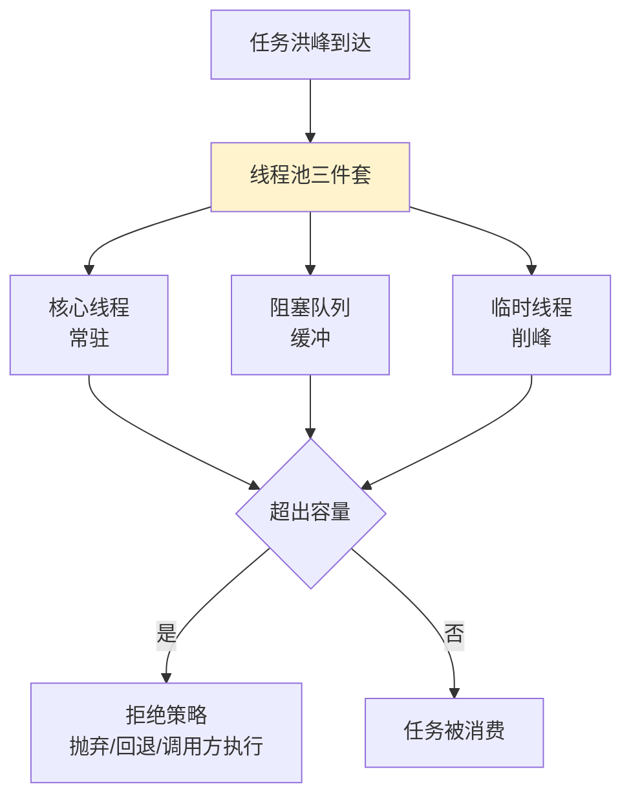

---

#### 目录介绍
- [01.五语言池化事故](#01五语言池化事故)
  - [1.1 Java 双 11 OOM](#11-java-双-11-oom)
  - [1.2 C++ terminate](#12-c-terminate)
  - [1.3 Go 调度抖动](#13-go-调度抖动)
  - [1.4 Python GIL 锁](#14-python-gil-锁)
  - [1.5 Rust 卡 worker](#15-rust-卡-worker)
  - [1.6 一句话穿透事故](#16-一句话穿透事故)
  - [1.7 灵魂的建池五问](#17-灵魂的建池五问)
  - [1.8 本篇探索路径](#18-本篇探索路径)
  - [1.9 学习价值](#19-学习价值)
- [02.通用本质矛盾](#02通用本质矛盾)
  - [2.1 池化的通用模型](#21-池化的通用模型)
  - [2.2 池化三大核心矛盾](#22-池化三大核心矛盾)
  - [2.3 跨语言池形态对照](#23-跨语言池形态对照)
  - [2.4 五问跨语言速查](#24-五问跨语言速查)
  - [2.5 翻译速查表](#25-翻译速查表)
  - [2.6 隐式池 vs 显式池](#26-隐式池-vs-显式池)
  - [2.7 七字真言贯穿](#27-七字真言贯穿)
- [03.池化思想探索](#03池化思想探索)
  - [3.1 什么是池化思想](#31-什么是池化思想)
  - [3.2 池化的优势](#32-池化的优势)
  - [3.3 池化具体体现](#33-池化具体体现)
  - [3.4 一般池的场景](#34-一般池的场景)
  - [3.5 线程池核心设计](#35-线程池核心设计)
- [04.线程池设计框架](#04线程池设计框架)
  - [4.1 核心原理和架构](#41-核心原理和架构)
  - [4.2 线程复用思想](#42-线程复用思想)
  - [4.3 要有任务队列](#43-要有任务队列)
  - [4.4 合理资源管理](#44-合理资源管理)
  - [4.5 任务调度思想](#45-任务调度思想)
- [05.线程池工作流程](#05线程池工作流程)
  - [5.1 提交线程任务](#51-提交线程任务)
  - [5.2 判断核心线程数](#52-判断核心线程数)
  - [5.3 判断任务队列](#53-判断任务队列)
  - [5.4 判断最大线程数](#54-判断最大线程数)
  - [5.5 开始执行任务](#55-开始执行任务)
  - [5.6 线程回收处理](#56-线程回收处理)
  - [5.7 执行流程图](#57-执行流程图)
- [06.线程复用设计](#06线程复用设计)
  - [6.1 线程复用原理](#61-线程复用原理)
  - [6.2 线程生命周期管理](#62-线程生命周期管理)
  - [6.3 线程复用实现示例](#63-线程复用实现示例)
  - [6.4 核心线程设计](#64-核心线程设计)
- [07.线程池管理设计](#07线程池管理设计)
  - [7.1 线程池状态管理](#71-线程池状态管理)
  - [7.2 线程池参数配置](#72-线程池参数配置)
  - [7.3 线程池管理策略](#73-线程池管理策略)
- [08.任务队列设计](#08任务队列设计)
  - [8.1 队列类型对比](#81-队列类型对比)
  - [8.2 队列类型](#82-队列类型)
  - [8.3 队列选择策略](#83-队列选择策略)
- [09.任务调度与设计](#09任务调度与设计)
  - [9.1 任务提交过程](#91-任务提交过程)
  - [9.2 任务调度策略](#92-任务调度策略)
  - [9.3 拒绝策略](#93-拒绝策略)
- [10.添加线程任务](#10添加线程任务)
  - [10.1 任务提交接口](#101-任务提交接口)
  - [10.2 任务封装](#102-任务封装)
  - [10.3 任务提交示例](#103-任务提交示例)
- [11.线程回收机制](#11线程回收机制)
  - [11.1 线程回收时机](#111-线程回收时机)
  - [11.2 线程回收实现](#112-线程回收实现)
  - [11.3 线程回收示例](#113-线程回收示例)
  - [11.4 线程池监控设计](#114-线程池监控设计)
  - [11.5 线程池设计总结](#115-线程池设计总结)
- [12.跨语言设计哲学对比](#12跨语言设计哲学对比)
  - [12.1 Java：7 参数设计的哲学](#121-java7-参数设计的哲学)
  - [12.2 Go：为何不需要池](#122-go为何不需要池)
  - [12.3 Python：GIL下的两种线程池](#123-pythongil下的两种线程池)
  - [12.4 C#/.NET：Task+ThreadPool分层](#124-cnettaskthreadpool分层)
  - [12.5 跨语言设计哲学表](#125-跨语言设计哲学表)
- [13.经典陷阱与事故复盘](#13经典陷阱与事故复盘)
  - [13.1 事故①｜newFixedThreadPool导致OOM](#131-事故newfixedthreadpool导致oom)
  - [13.2 事故②｜共用池死锁](#132-事故共用池死锁)
  - [13.3 事故③｜任务异常被吞掉](#133-事故任务异常被吞掉)
  - [13.4 事故④｜ThreadLocal不清理泄露](#134-事故threadlocal不清理泄露)
  - [13.5 事故⑤｜CallerRunsPolicy反锁主线程](#135-事故callerrunspolicy反锁主线程)
  - [13.6 跨语言陷阱速查](#136-跨语言陷阱速查)
  - [13.7 七字真言对照](#137-七字真言对照)
- [14.综合案例串讲](#14综合案例串讲)
  - [14.1 案例背景](#141-案例背景)
  - [14.2 通用骨架设计](#142-通用骨架设计)
  - [14.3 Java 实现](#143-java-实现)
  - [14.4 Go 实现](#144-go-实现)
  - [14.5 C++ 实现](#145-c-实现)
  - [14.6 Python 实现](#146-python-实现)
  - [14.7 Rust 实现](#147-rust-实现)
  - [14.8 五语言对照](#148-五语言对照)
  - [14.9 案例知识点回归](#149-案例知识点回归)
- [15.一句话总结](#15一句话总结)
  - [15.1 三层认知阶梯](#151-三层认知阶梯)
  - [15.2 终极建议](#152-终极建议)
  - [15.3 与下篇承接](#153-与下篇承接)


## 01.五语言池化事故

> 🧭 **本节定位**：先抛"5 个团队的同一个池化噩梦"。Java/C++/Go/Python/Rust 的事故现象长得都不一样，但**根因是同一句话**——"创建很贵 + 资源无限 + 没有归宿管理"。

### 1.1 Java 双 11 OOM

某电商订单服务用 `Executors.newFixedThreadPool(50)` 接订单，双 11 流量峰值打来时表象是 OOM、堆 dump 一看 `LinkedBlockingQueue` 里堆了 270 万个 `Runnable` 还没消费。

```java
// 事故代码（来自真实复盘）
ExecutorService pool = Executors.newFixedThreadPool(50);
for (Order order : orderStream) {
    pool.submit(() -> notifyDownstream(order));   // 任务往队列里堆
}
// 表象：OOM。根因：LinkedBlockingQueue 默认 cap=Integer.MAX_VALUE
```

**关键时间线**：09:59 队列开始增长 → 10:01 老年代占满 → 10:03 Full GC 风暴 → 10:05 进程 OOM 重启 → 第一波订单丢失。

### 1.2 C++ terminate

某交易系统用 `std::vector<std::thread>` 自己撑了一个池，析构时 worker 还在等 condvar，没人 `join()`，直接 `std::terminate` core dump。

```cpp
class ThreadPool {
    std::vector<std::thread> workers;
    // 析构里没写 join、没 stop
    ~ThreadPool() = default;
};
// 程序退出 → vector 析构 → thread 还可 joinable → terminate
```

**关键症状**：进程退出时 `terminate called without an active exception`，没栈、没日志，DBA 排查 3 小时才定位到析构顺序。

### 1.3 Go 调度抖动

某直播服务遇到弹幕风暴，开发者直接 `for msg := range bullet { go process(msg) }`，瞬间起 80 万 goroutine，runtime P 队列被打爆，调度抖动让所有接口 p99 飙到 5s。

```go
// 反模式：无 worker pool 直接放飞
for msg := range bulletChan {
    go process(msg)   // 80w goroutine 一起跑
}
```

**Go 的事故不是 OOM**——goroutine 太轻，OOM 之前先把**调度器本身**拖垮。

### 1.4 Python GIL 锁

某数据团队用 `ThreadPoolExecutor(max_workers=32)` 跑 NumPy 卷积，期望 32 核打满，结果 CPU 永远只有 1 核 100%、其余 0%、任务比单线程还慢 10%。

```python
# 反模式：CPU 密集 + GIL
with ThreadPoolExecutor(max_workers=32) as ex:
    futures = [ex.submit(heavy_numpy_compute, x) for x in data]
# 32 个线程被 GIL 串行化，反而比单线程多了切换开销
```

### 1.5 Rust 卡 worker

某团队从 Java 迁 Rust + tokio，习惯性在 `async fn` 里写 `std::thread::sleep(Duration::from_secs(1))` 模拟延迟，几个请求就把 tokio 的 worker 全卡死，新请求永远排队。

```rust
async fn handle(req: Req) {
    // 阻塞当前 tokio worker
    std::thread::sleep(Duration::from_secs(1));
    do_work(req).await;
}
// tokio 默认 worker = CPU 数。8 个请求一来，runtime 直接停摆
```

### 1.6 一句话穿透事故

```
事故现象        ← 表层（5 种长相）
OOM / terminate / 调度抖 / GIL 锁 / worker 卡
       ↓
通用根因        ← 中层（同一句话）
"开出去的任务没有归宿管理"
       ↓
设计缺陷        ← 深层（同一种缺）
缺池 / 池无界 / 池误用 / 池被阻塞
```

**5 种语言、5 个事故、1 个根因**：**资源不池化 = 不可预测，池化但无界 = 雪崩，池化但误用 = 比不池化还差。**

### 1.7 灵魂的建池五问

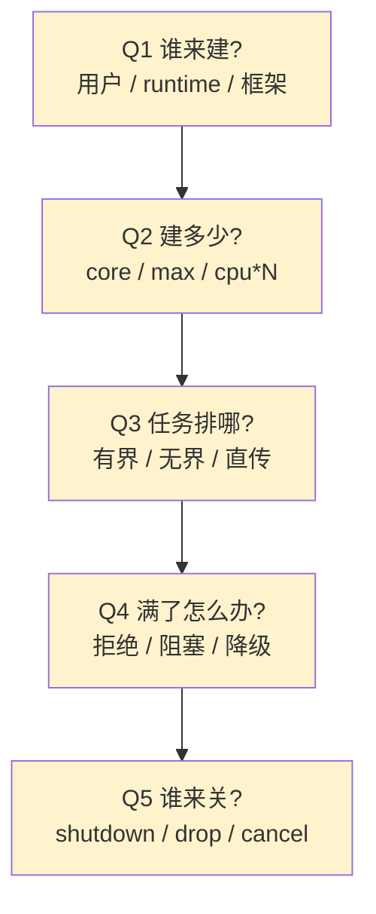

不管哪种语言、哪种 runtime，这五问**永远绕不开**——本篇所有内容都围绕这 5 问展开。

### 1.8 本篇探索路径

```
§01 五语言事故        ← 你在哪
§02 本质矛盾          ← 为什么会这样
§03~§11 通用机制       ← 各语言怎么解（以 Java 为主例 + 跨语言并列）
§12 跨语言对比         ← 五语言哲学全景
§13 经典陷阱           ← 大家都怎么翻车
§14 综合案例串讲       ← 一个案例 5 语言并列实现
§15 七字真言收束       ← 一句话带走
```

### 1.9 学习价值

读完本篇你将获得 **3 个语言无关的能力**：

1. 看到任何"池"都能识别**预创/复用/限闸/拒压**四要素——不论 ThreadPool、ConnectionPool、ObjectPool；
2. 能在 Java/C++/Go/Python/Rust 任意一门语言里写出符合"建池五问"的池化代码；
3. 能解释"为什么 Go 不建线程池但建 worker pool"——前者由 runtime 隐式管理，后者控的是业务并发度。

---

## 02.通用本质矛盾

### 2.1 池化的通用模型

线程池不是凭空发明的，它是**资源池化思想**应用到"线程"这一资源上的具体形态。资源池化的通用模型是：

```
预先创建一批昂贵资源 → 按需借出 → 用完归还 → 复用避免重建
```

这套模型在所有语言里都能套用：

| 池化的资源 | 池化前代价 | 池化后形态 |
|---|---|---|
| **数据库连接** | TCP 三次握手 + 鉴权（毫秒级） | HikariCP / Druid / pgxpool |
| **HTTP 长连接** | TCP + TLS 握手（百毫秒级） | OkHttp ConnectionPool / Go Transport |
| **内存对象** | new + GC（高频时拖慢） | Netty Recycler / Go sync.Pool |
| **协程** | 通常便宜，但仍可控并发 | Worker Pool 模式（Go errgroup / Rust semaphore） |
| **线程** | OS 内核陷入 + 1MB 栈 + 调度（毫秒级） | **本篇主题** |

→ **线程池 = "把池化思想套到线程上"**——理解了池化通用模型，线程池只是其中一种实例。

### 2.2 池化三大核心矛盾

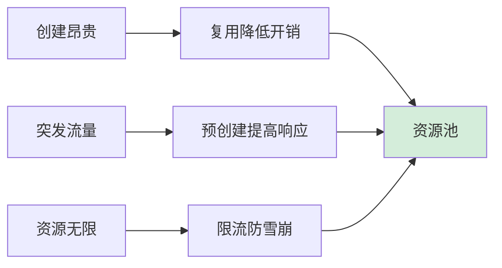

| 矛盾 | 不池化的后果 | 池化的解法 |
|---|---|---|
| **创建昂贵** | 每个任务现建线程，CPU 全耗在创建上 | 预创建 + 复用 |
| **突发流量** | 第一个请求来才建线程，响应迟 | core 线程常驻 + 提前 warmup |
| **资源无限** | 任务一多线程爆掉 → OOM / 调度抖动 / 雪崩 | 有界池 + 拒绝策略 |

**这三条矛盾在任何语言、任何运行时上都存在**——所以线程池的"长相"可以不同，但**核心三问**（多少线程、任务怎么排队、爆掉怎么办）所有池化方案都绕不开。

### 2.3 跨语言池形态对照

| 语言 / 运行时 | "线程池"的形态 | 是否需要用户显式建池 |
|---|---|---|
| **Java** | `ThreadPoolExecutor` / `ForkJoinPool` / 虚拟线程 carrier | ✅ 必须显式建池 |
| **C++** | 标准库无现成池（C++23 才有 `std::execution`）；自己用 `std::thread + queue + condvar` 写 | ✅ 必须手写或用第三方（如 BS::thread_pool） |
| **C#** | `ThreadPool`（全局共享 + Hill-climbing 自适应） / `TaskScheduler` | ❌ 默认全局池；要隔离才显式建 |
| **Python** | `concurrent.futures.ThreadPoolExecutor`（IO 密集） / `ProcessPoolExecutor`（CPU 密集，绕开 GIL） | ✅ 显式建池 |
| **Go** | runtime GMP 是**隐式池**（用户看不见 thread pool）；用户层用 worker pool 模式控并发 | ❌ 线程池由 runtime 隐式管理；显式只建协程数量限制 |
| **Rust** | `tokio Runtime`（multi_thread 模式 = M 个 worker） / `rayon::ThreadPool` | ✅ 显式建 runtime / pool |
| **Node.js** | libuv 内置 4 个 worker 线程（IO） / `worker_threads` 自建 | ⚠️ 默认有内置 4 线程；CPU 密集要自建 |
| **.NET 全栈** | `ThreadPool`（全局） / `TaskScheduler` / `Parallel.ForEach` | ❌ 默认全局池 |

**两条路线**：

```mermaid
flowchart LR
    A[隐式池路线<br/>Go/.NET/C#] -->|runtime 管 N 个 OS 线程<br/>用户只管"任务"| B[用户感知:<br/>没有"池"的概念]
    C[显式池路线<br/>Java/C++/Python/Rust] -->|用户必须建池<br/>明确指定 core/max/queue| D[用户感知:<br/>池是一等公民]
    style B fill:#cce5ff
    style D fill:#d4edda
```

**关键认知**：
> **隐式派**（Go / C#）让用户写并发更简单，但**调优空间更小**——你看不见池，也调不细；
> **显式派**（Java / Rust / C++）让用户能精细控制，但**容易踩坑**——三个 Executors 工厂方法就是经典反面教材。

### 2.4 五问跨语言速查

下表把 §1.7 的**建池五问**逐一映射到 5 门语言的具体原语——**横看一行**理解一个问题在不同语言中怎么解，**纵看一列**理解一门语言的池化全貌。

| 问题 | Java | C++ | Go (worker pool) | Python | Rust (tokio) |
|---|---|---|---|---|---|
| **谁来建** | 用户 `new ThreadPoolExecutor` | 用户写 `vector<thread>` | 用户起 N 个 goroutine | 用户 `ThreadPoolExecutor()` | 用户 `Runtime::Builder` |
| **建多少** | `corePoolSize` / `maximumPoolSize` | 自定 vector size | 用 `semaphore.Weighted(N)` | `max_workers=N` | `worker_threads(N)` |
| **排哪** | `BlockingQueue`（**有界！**） | `queue<Task>+mutex+condvar` | `chan Task`（buffered） | `queue.Queue(maxsize)` | mpsc bounded channel |
| **满了** | `RejectedExecutionHandler` | 用户 if 检查 | `select default` 丢弃 | submit 阻塞 / 抛 | `try_send` 返回 Err |
| **谁关** | `shutdown()` / `awaitTermination` | 析构里 stop+join | `close(ch)` + `wg.Wait()` | `executor.shutdown()` | drop runtime / `JoinSet` |

→ **学会了这五问，看任何语言的线程池实现都是变形题**。

### 2.5 翻译速查表

读 16 篇（Java 源码精读）/ 17 篇（使用技巧）时，下表帮你**把 Java 概念翻译成你的语言**：

| Java 概念 | C++ 对应 | Go 对应 | Python 对应 | Rust 对应 |
|---|---|---|---|---|
| `Runnable` | `std::function<void()>` | `func()` 或闭包 | `Callable` | `Box<dyn FnOnce() + Send>` |
| `Future<T>` | `std::future<T>` | `chan Result` | `concurrent.futures.Future` | `tokio::task::JoinHandle<T>` |
| `BlockingQueue` | `queue+mutex+condvar` | `chan T`（buffered） | `queue.Queue` | `tokio::sync::mpsc` |
| `corePoolSize` | vector size | 启动 N 个 goroutine | `max_workers` | `worker_threads` |
| `RejectedExecutionHandler` | 用户自管 | `select { default: }` | 抛 `RuntimeError` | `try_send` 返回 Err |
| `shutdown()` | stop flag + join | `close(ch) + wg.Wait()` | `executor.shutdown()` | drop runtime |
| `getActiveCount` | 自埋计数器 | 自埋 `atomic.Int64` | `_threads` 内部属性 | `tokio-metrics` |

### 2.6 隐式池 vs 显式池

```mermaid
flowchart LR
    A[隐式池路线<br/>Go/.NET/C#] -->|runtime 管 N 个 OS 线程<br/>用户只管"任务"| B[用户感知<br/>没有"池"的概念]
    C[显式池路线<br/>Java/C++/Python/Rust] -->|用户必须建池<br/>明确指定 core/max/queue| D[用户感知<br/>池是一等公民]
    style B fill:#cce5ff
    style D fill:#d4edda
```

**关键认知**：
> **隐式派**（Go / C#）让用户写并发更简单，但**调优空间更小**——你看不见池，也调不细；
> **显式派**（Java / Rust / C++）让用户能精细控制，但**容易踩坑**——三个 Executors 工厂方法就是经典反面教材。

### 2.7 七字真言贯穿

> **🗝️ 预创 · 复用 · 限闸 · 拒压**

- **预创**：池子启动就预备一批可立即响应的资源（避免首请求慢）；
- **复用**：用完归还、不销毁、循环使用（避免高频创建开销）；
- **限闸**：池子必须有上限——线程数有上限、队列长度有上限（避免资源失控）；
- **拒压**：超过上限时必须有明确的拒绝策略——丢弃 / 阻塞 / 降级 / 回压（避免雪崩）。

四字一组、缺一不可：
- **只预创不复用 = 浪费**（每次还销毁）
- **只复用不限闸 = 失控**（任务无界堆积）
- **只限闸不拒压 = 死锁**（满了卡住生产者）

> 这条总图贯穿后续 §03-§15 各节——**看到任何代码段都能反问**：它满足了"预创"吗？满足了"复用"吗？"限闸"和"拒压"在哪？

---

## 03.池化思想探索

### 3.1 什么是池化思想

“池化”不是个现代词。人类发明“预备几个、同一名额、谁需谁拿”这件事已经上千年。

```
  仓库：不是谁买东西才进货、而是预备会出售的存量
  出租车队：不是谁叫车才叫司机上班、而是预备一批可快速响应的司机
  医院急救包：不是谁需要才发起、而是预存一批随时取用
```

**软件工程哲学上的“池化”是同一个思想的代码体现**：

```text
  预先准备一批可重复使用的资源、需要时从池里拿、用完不销毁、放回池里。
```

这个思想可以很多资源都可以被“池化”：

| 资源 | 序列化代价 | 被池化后的收益 |
|------|------------|----------------|
| 数据库连接 | TCP 三次握手 + SSL、几十 ms | HikariCP、Druid |
| 线程 | 内核陷入 + 栈划拨 + TLS、~1ms + 几 MB | ThreadPoolExecutor |
| HTTP 连接 | TCP + TLS 握手、几百 ms | OkHttp ConnectionPool |
| 对象实例 | new + GC | Netty ByteBuf Recycler、Apache Commons Pool |
| 内存页 | 页错 + 内核分配 | 内存池（jemalloc、tcmalloc） |

**池化本质上是一种抵抗"高频起调"的策略**——只要某种资源 **"创建贵、复用频繁、使用次数高"**、就有默认被池化的价值。

### 3.2 池化的优势

你可能听过“减少创建开销”这句话几百遍。但创建开销到底多高？**按价取证**你会发现这个优势强到震惊。

```
  创建一个 OS 线程的底层代价：
  - clone 系统调用    ~ 50,000 个 CPU 周期
  - 栈空间初始化       ~ 1MB 虚存 + 页表
  - TLS 清零              ~ KB 级别
  - 加入就绪队列        ~ 内核锁 + 调度器开销

  以一台 3GHz 机器上、单个线程创建费时约 100~500 μs
  一秒内创建 10000 个线程：光创建本身吃 100% CPU 不够补
```

所以池化的四大优势不是“老生常谈”、是被“数字”逼着走这条路。

**优势①｜降低资源创建/销毁开销**
频繁创建和销毁线程（或其它资源）会导致系统性能下降，池化通过复用线程降低开销。

**优势②｜提高响应速度**
任务到达时，池中已有线程可立即执行，无需等待线程创建。这在高并发场景里是决定性的。

**优势③｜可控制资源使用**
通过限制池中资源数量，防止资源过度使用导致系统崩溃。**这是被上万次服务雪崩逼出来的反身**——不限制资源 = 不可预测。

**优势④｜统一管理**
便于对资源进行监控、调优和统计。这是生产环境里池化的“隐藏价值”——你能看到 activeCount、queueSize、能动态调。

### 3.3 池化具体体现

线程池通过维护一定数量的线程，避免为每个任务都创建新线程，从而减少系统开销。

### 3.4 一般池的场景

对这种频繁需要创建和销毁的对象保存在一个对象池中。每次用到该对象时，就取对象池空闲的对象，并对它进行初始化操作，从而提高框架的性能。这种对象池的设计核心代码如下所示

```java
//采用一般意义上池化资源的设计方法
public class SimplePool<T> implements Pool<T> {
    // 获取空闲线程
    T acquire() {
    }
    // 释放线程
    void release(T t){
    }
}
class Test{
    public void test() {
        //期望的使用
        SimplePool<Thread> pool = new SimplePool<>();
        //使用
        Thread t1 = pool.acquire();
        //传入Runnable对象
        t1.execute(()->{
          //具体业务逻辑
        });
        //释放
        pool.release(t1);
    }
}
```

为什么线程池没有采用一般意义上池化资源的设计方法呢？

如果线程池采用一般意义上池化资源的设计方法，你可以来思考一下，假设我们获取到一个空闲线程 T1，然后该如何使用 T1 呢？

你期望的可能是这样：通过调用 T1 的 execute() 方法，传入一个 Runnable 对象来执行具体业务逻辑，就像通过构造函数 Thread(Runnable target) 创建线程一样。

可惜的是，你翻遍 Thread 对象的所有方法，都不存在类似 execute(Runnable target) 这样的公共方法。

### 3.5 线程池核心设计

那线程池该如何设计呢？目前业界线程池的设计，普遍采用的都是生产者-消费者模式。线程池的使用方是生产者，线程池本身是消费者。

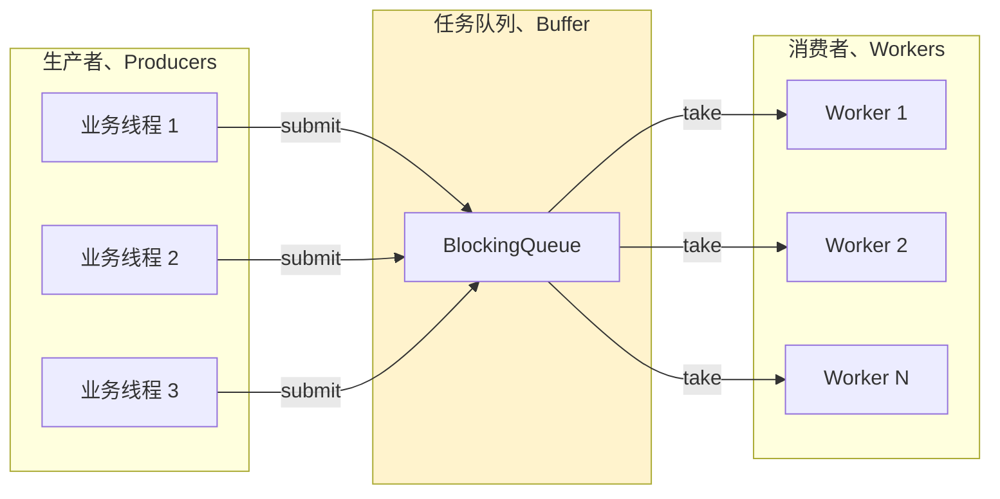

在线程池中，线程池本身可以被视为生产者，它负责创建和管理线程资源。任务（或工作单元）可以被视为生产者生产的产品，线程池中的线程则是消费者，负责消费这些任务并执行相应的操作。

**为什么生产者-消费者能作为线程池的骨架？**

这是个被多个限制源头联动逼出来的选择：

```
限制①：生产者与消费者速度不一致、必须有缓冲
  → 为什么要 BlockingQueue
限制②：资源有限、不能无限堆积
  → 为什么队列需要有界 + 拒绝策略
限制③：调度必须是线程安全的、多个 Worker 不能同取一任务
  → 为什么队列是 BlockingQueue 而不是普通 Queue
限制④：Worker 要能安全退出、也要能被中断唤醒
  → 为什么需要 状态机 + Lock + Condition
```

这 4 个限制一叠加、生产者-消费者模式就是唯一能同时解决这 4 件事的设计。不是设计者的偏好、是数学上的唯一选项。

## 04.线程池设计框架

线程池的抽象架构模型，这种分层架构实现了关注点分离，每层负责特定的职责，通过标准接口协作。 一个完整的线程池包含以下核心抽象层：

```text
┌─────────────────────────────────────────────────────────────┐
│                   应用层接口 (Application Layer)              │
├─────────────────────────────────────────────────────────────┤
│  submit() ─────── execute() ─────── invoke() ─────── schedule() │
└─────────────────────────────────────────────────────────────┘
│
┌─────────────────────────────────────────────────────────────┐
│                 任务调度层 (Scheduling Layer)                 │
├─────────────────────────────────────────────────────────────┤
│  任务队列 ─────── 拒绝策略 ─────── 饱和策略 ─────── 优先级调度      │
└─────────────────────────────────────────────────────────────┘
│
┌─────────────────────────────────────────────────────────────┐
│                 线程管理层 (Thread Management Layer)           │
├─────────────────────────────────────────────────────────────┤
│  线程创建 ─────── 线程回收 ─────── 空闲管理 ─────── 异常处理        │
└─────────────────────────────────────────────────────────────┘
│
┌─────────────────────────────────────────────────────────────┐
│                 资源监控层 (Monitoring Layer)                 │
├─────────────────────────────────────────────────────────────┤
│  指标收集 ─────── 状态追踪 ─────── 性能分析 ─────── 动态调优        │
└─────────────────────────────────────────────────────────────┘
```

### 4.1 核心原理和架构

线程池是一种管理和复用线程的机制，旨在提高多线程程序的性能和资源利用率。其核心原理是通过预先创建一定数量的线程，并将任务分配到这些线程中执行，从而避免频繁创建和销毁线程的开销。

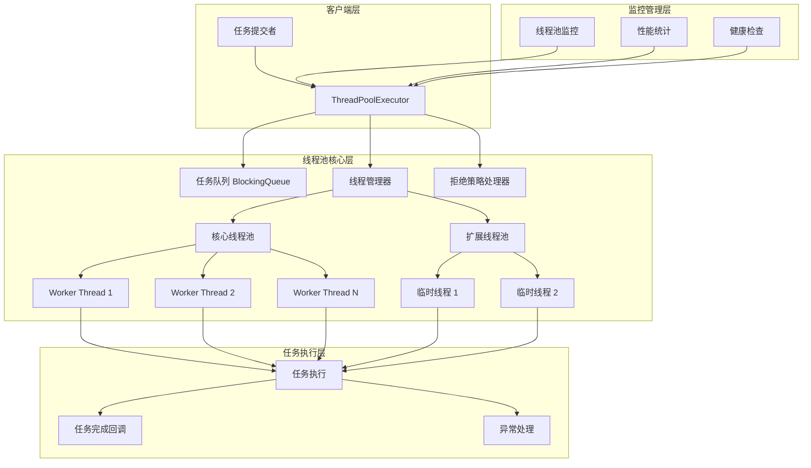


### 4.2 线程复用思想

为什么“线程复用”是线程池的灵魂？这要从“线程本质上是昂贵的”说起。

**问题推导**：频繁创建和销毁线程会消耗大量系统资源，降低程序性能。不仅是 “创建贵”、还是“销毁也贵”——销毁需要 等 worker 跳出 run、释放栈空间、报 GC 、可能还需要等其它线程唤醒。

**解决方案**：线程池预先创建一组线程，任务到来时直接复用这些线程，避免重复创建和销毁。

**这里有一个反直觉的点**：你以为“同一个线程跳多件事”是个艰巨设计，实际上这是**最高效的设计**。原因在于上下文切换不只是保存寄存器、还会导致 L1/L2/L3 缓存全部失效。**一个线程跑在同一个核上、能享受缓存心热、这是创建新线程远远达不到的优势**。

**线程复用的实现三步**：

**步骤 1｜预先创建线程**
在初始化时创建一组线程、并使其处于等待状态。

```java
// JDK 原生实现
private boolean addWorker(Runnable firstTask, boolean core) {
    // 创建 Worker、Worker 本身是一个 Runnable + 一个 Thread
    Worker w = new Worker(firstTask);
    final Thread t = w.thread;
    t.start();   // 从这一刻起、线程就跑在 Worker.run() 里了
}
```

**步骤 2｜任务分配**
当任务到来时、将任务分配给空闲线程执行。实际上不是“分配”、是“任务入队、Worker 主动拾”。

**步骤 3｜线程回收**
线程执行完任务后、不销毁、而是重新进入空闲状态、等待下一个任务。心脲的是：这个“循环”是在 worker 自己的 run() 里实现的、不需要外部控制：

```java
final void runWorker(Worker w) {
    while (task != null || (task = getTask()) != null) {
        task.run();
        // 跑完取下一个任务、一直循环
    }
}
```

**这是“任务其实不是被推到线程上、是被线程拍走的”**——这个反转是理解线程池的关键。

### 4.3 要有任务队列

**问题推导**：当任务数量超过线程池的处理能力时，需要一种机制来缓冲任务。不然业务会被丢、或者线程会被炸。

**解决方案**：线程池使用任务队列（如阻塞队列）来存储待执行的任务，确保任务不会丢失。

**为什么一定要是“阻塞队列”？**

这是个面试常问点、但讲清楚的人不多。换个“普通队列”会怎么样？

```java
// 如果用普通队列、Worker 取任务需要这样写
while (true) {
    Runnable task = queue.poll();
    if (task != null) { task.run(); continue; }
    Thread.sleep(10);   // ⚠️ 只能忙轮询、或 sleep 一下
}
```

这不是设计陷阱、是固有性问题。"sleep 多久"是个永远错误的选择：sleep 太短 = CPU 被轮询烧穿；sleep 太长 = 任务响应延迟。

阻塞队列用 **`Lock + Condition`** 优雅解决了这个问题：

```
  队空   → Worker 调 take()、被挂起 、不耗 CPU
  任务来 → 生产者 offer、Condition.signal 唤醒 Worker
  队满   → 生产者 put、被挂起 （有界队列）、反压到上游
```

这不是“一个队列”、是“一个同步原语 + 一个缓冲区”的复合实体。**生产者-消费者模式的哲学在这里被一句话实体化**。

### 4.4 合理资源管理

**问题推导**：线程数量过多会消耗大量系统资源，甚至导致系统崩溃。这个“多”到什么程度？

```
JVM 默认 -Xss = 1MB、一个线程需几 MB、主要是栈
Linux 默认 ulimit -n 限制 fd 数、限制了线程最大数量
Linux 默认 pid_max = 32768、超过不能创建新线程

  线程超过 1万、多数 JVM 会推入稳定堆使用不可控区
  线程超过 5万、Linux 默认参数下会招不住、调度器变慢
```

**解决方案**：线程池通过限制线程数量（核心线程数、最大线程数）和任务队列大小，合理管理系统资源。

**三道闸门限制资源**：

```
第一道：corePoolSize        → 常驻、不会被回收
第二道：workQueue 容量      → 生产-消费不一致时的缓冲、避免丢任务
第三道：maximumPoolSize     → 临时、项临时雷峰、峰过后被回收
超过 → RejectedExecutionHandler 拒绝、反压到业务层
```

**这个设计的高明处**：使用 三个闸门 而不是 一个闸门 来限制资源——这让线程池能**同时适应“平稳负载”和“突发雷峰”**两种场景。平稳期只需要 corePoolSize 个线程；雷峰期会临时报动 maximumPoolSize 个线程、峰过后释放。**弹性限流**的本质。

### 4.5 任务调度思想

问题：如何高效地将任务分配给线程执行。

解决方案：线程池根据任务队列的状态和线程的可用性，动态调度任务。

## 05.线程池工作流程

线程池的工作流程一般是这样的：

1. 初始化线程池：创建一组线程。
2. 提交任务：当调用 execute() 或 submit() 方法提交任务时，线程池会检查当前线程数是否小于核心线程数。
3. 任务入队：如果线程数已达到核心线程数，则将任务放入任务队列中等待执行。
4. 拒绝任务：如果任务队列已满且线程数已达到最大线程数，则根据拒绝策略处理新提交的任务。
5. 任务执行完：线程执行完任务后，返回空闲状态，等待下一个任务。
6. 线程回收：当线程池关闭时，销毁所有线程。

任务提交与执行时序图

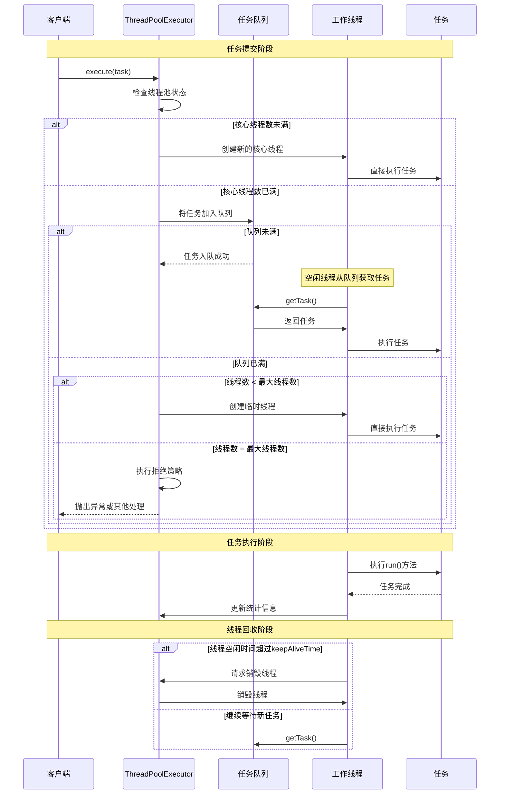


### 5.1 提交线程任务

提交任务看似只是一句 `executor.submit()`、实际上背后有两个不同 API 设计：

```java
// API 一：execute - 什么都不返回、错误会被 UncaughtExceptionHandler 报
executor.execute(() -> doWork());

// API 二：submit - 返回 Future、错误被包装在 Future.get() 里
Future<?> f = executor.submit(() -> doWork());
f.get();   // 调用才能取得错误
```

两个 API 背后最后调用的都是同一个 `execute(Runnable)`，submit 有几个额外封装：

```
submit(Runnable)        → 包装 RunnableFuture → execute()
submit(Callable<T>)     → 包装 RunnableFuture<T> → execute()
```

**execute 为什么设为 void**？这是设计上反复考虑后的选择。execute 是“开火即忘”语义，不需要报任何状态。你需要状态就用 submit 。这与 Linux fork 的 “不返回”设计有极高哲学相似。

### 5.2 判断核心线程数

```text
if (workerCountOf(c) < corePoolSize) {
    if (addWorker(command, true)) return;
}
```

**为什么是“小于”而不是“小于等于”？** 这个细节让众多人绑动反。

```
if (corePool < N)         创建     // ----- 这个纯是“严格小于”
if (corePool <= N)        创建     // 错误什说、会创建 N+1 个线程
```

该逻辑器仅在当前线程数 严格小于 core 时创建。然后存在 CAS 补偿：两个线程同时提交且同时看到 “少于 core”、但二者只能一个能肩负创建。其他线程 CAS 失败、会进入下一个判断。

### 5.3 判断任务队列

```text
if (isRunning(c) && workQueue.offer(command)) {
    // 二次检查、避免事件交错
    if (! isRunning(recheck) && remove(command))
        reject(command);
}
```

**为什么需要二次检查？** 这是多线程设计中经典的 **DCL（Double-Check Locking）**。场景：

```
T1 判断“运行中”、准备 offer
T2 同时调 shutdown()
T1 offer 成功、但线程池已不运行了
二次检查：发现 不运行 → 把任务从队列拽出、走拒绝策略
```

这个细节体现了 ThreadPoolExecutor 在并发设计上的严谨。

### 5.4 判断最大线程数

这是“雷峰响应”的最后一道闸门：队满则试图报动临时线程。

```text
if (workerCountOf(c) < maximumPoolSize) {
    if (addWorker(command, false)) return;
}
reject(command);   // 最后拒绝
```

**临时线程与核心线程代码层完全一样**，区别仅在于创建时传入 `core=false` 、这个参数仅是插入判断“超过 corePoolSize 后判定走 SCHED 还是走 max”。这个设计极为精巧——**不需要为“核心”和“临时”创建两种 Worker 类**，只需要调用时拼接一个标签。

### 5.5 开始执行任务

任务执行不是“调 task.run()”这么简单，Worker 的 `runWorker()` 干了四件事：

```java
final void runWorker(Worker w) {
    Thread wt = Thread.currentThread();
    Runnable task = w.firstTask;
    while (task != null || (task = getTask()) != null) {
        w.lock();
        try {
            beforeExecute(wt, task);   // ① 抩子、子类可重写、打点
            try { task.run(); }         // ② 跑任务、唯一的业务逻辑
            catch (Throwable x) { thrown = x; throw x; }
            finally { afterExecute(task, thrown); }   // ③ 抹尾、走费、释放
        } finally {
            w.unlock();
            completedTasks++;          // ④ 计数
            task = null;
        }
    }
}
```

**为什么设计成 `beforeExecute / afterExecute`？** 这是为“可观测性”量体预留的钩子。子类可重写：

- 抹除考出任务运行时间（同机上报）
- 报发 traceId 、为全链路追踪推进上下文
- 护反 ThreadLocal 清理、避免股型泄露

### 5.6 线程回收处理

线程回收什不是 “销毁线程”、是 “让 worker 从 getTask() 返回 null、自然退出 run()”。

```java
private Runnable getTask() {
    boolean timed = wc > corePoolSize || allowCoreThreadTimeOut;
    Runnable r = timed ?
        workQueue.poll(keepAliveTime, TimeUnit.NANOSECONDS) :   // 有会返回 null
        workQueue.take();                                       // 永远不会返回 null
    if (r != null) return r;
    // null 表示“超时了、你被回收了”
    return null;
}
```

这里有个面试震援题：**能不能让核心线程也被回收？**

能。调用 `executor.allowCoreThreadTimeOut(true)`、所有 worker 都会参与超时回收。低负载时能进一步节省资源、但下一个任务来时会付出创建代价。**这是“零资源资源”与“快响应”的权衡**。

### 5.7 执行流程图

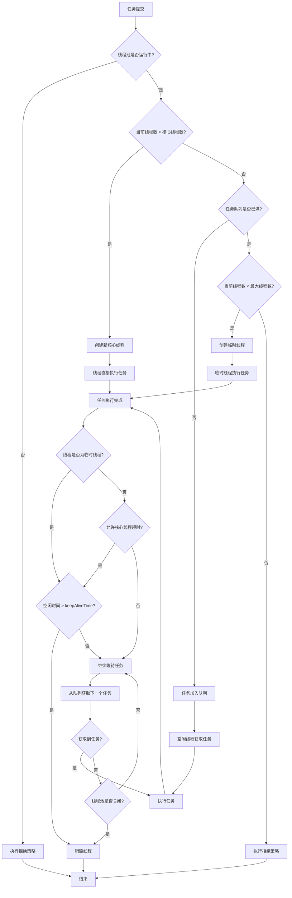

## 06.线程复用设计

### 6.1 线程复用原理

线程复用的核心是让线程在执行完一个任务后不退出，而是继续执行下一个任务。这通过一个循环结构实现，线程不断从任务队列中获取任务并执行。

线程复用的核心是将线程创建成本分摊到多个任务执行周期。其理论基础是线程上下文切换成本远低于进程创建成本。

### 6.2 线程生命周期管理

创建：线程池初始化时创建一定数量的线程（核心线程），这些线程处于等待任务状态。
运行：线程从任务队列中获取任务并执行。
等待：当任务队列为空时，线程进入等待状态（通过条件变量或锁机制）。
销毁：当线程池决定减少线程数量时，某些线程会被终止。线程池可以设置线程的空闲时间，超过该时间没有任务执行则销毁线程（非核心线程）。

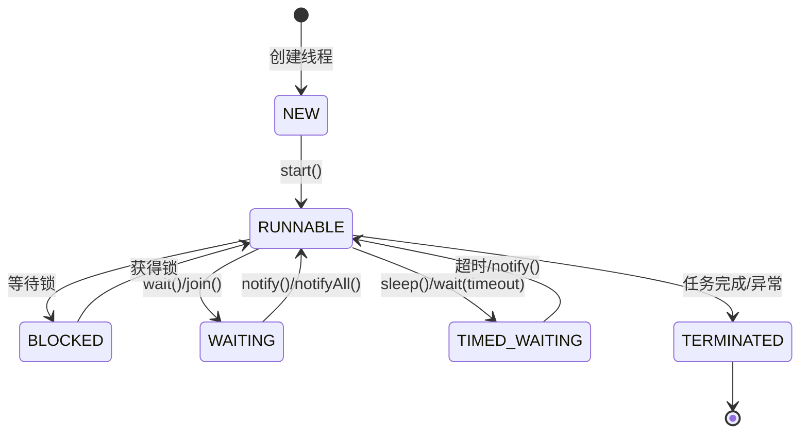

一个可复用的线程包含完整的状态转换：

```text
创建(CREATED) → 就绪(READY) ↔ 运行(RUNNING) ↔ 等待(WAITING) 
               ↘ 终止(TERMINATED)
```

复用线程的关键是避免进入终止状态，在任务完成后回到就绪状态等待新任务。

### 6.3 线程复用实现示例

以下是一个简单的线程复用示例（C++伪代码）：

```cpp
class WorkerThread {
private:
    ThreadPool* pool;
    bool running;
public:
    void run() {
        while (running) {
            Task task = pool->getTask(); // 从任务队列获取任务，如果队列为空则阻塞
            if (task) {
                task.execute();
            }
        }
    }
    void stop() { running = false; }
};
```

### 6.4 核心线程设计

**疑惑**：核心线程和非核心线程在代码层面有什么区别？是不是有两种不同的Thread对象？

**答疑**：核心线程和非核心线程在代码层面**没有任何区别**！它们是同一种Worker对象。"核心"与"非核心"仅仅是一个**计数上的概念**——当线程池决定回收空闲线程时，会判断当前线程数是否超过corePoolSize，超过的部分在空闲keepAliveTime后被回收。

```java
// getTask()中的关键逻辑（简化版）
private Runnable getTask() {
    for (;;) {
        int wc = workerCountOf(ctl.get());
        
        // 关键判断：当前线程数 > 核心线程数？
        boolean timed = wc > corePoolSize;
        
        // timed=true: 用poll(keepAliveTime)，超时返回null → 线程退出
        // timed=false: 用take()，永远等待 → 核心线程不退出
        Runnable r = timed ? 
            workQueue.poll(keepAliveTime, TimeUnit.NANOSECONDS) :
            workQueue.take();
        
        if (r != null) return r;
        // r==null说明超时了 → 这个线程被当作"非核心线程"回收
        return null;
    }
}
```

**本质**：哪个线程是"核心"哪个是"非核心"，取决于被回收那一刻的线程总数，而不是线程创建时的身份。这是一个非常优雅的设计——不需要给线程打标签，只需要在回收时做数量判断。

核心线程也可以被回收，通过设置`allowCoreThreadTimeOut(true)`，所有线程在空闲超时后都会退出。这在低负载时能进一步节省资源。

## 07.线程池管理设计

### 7.1 线程池状态管理

线程池状态图

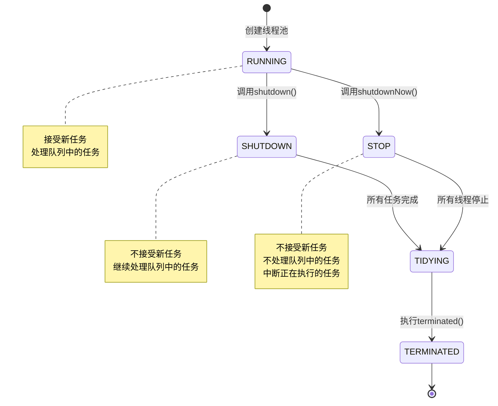

线程池通常有以下状态：

| 状态 | 值 | 描述                          |
|------|----|-----------------------------|
| RUNNING | -1 | 接受新任务并处理队列中的任务，正常处理任务             |
| SHUTDOWN | 0 | 不接受新任务，但会处理队列中的任务           |
| STOP | 1 | 不接受新任务，不处理队列中的任务，并中断正在执行的任务 |
| TIDYING | 2 | 所有任务已终止，工作线程数为0             |
| TERMINATED | 3 | terminated()方法已完成           |


### 7.2 线程池参数配置

核心线程数（corePoolSize）：线程池维护的最小线程数量，即使它们处于空闲状态。
最大线程数（maximumPoolSize）：线程池允许的最大线程数量。
任务队列（workQueue）：用于保存等待执行的任务的阻塞队列。
线程工厂（threadFactory）：用于创建新线程。
拒绝策略（rejectedExecutionHandler）：当任务队列已满且线程数达到最大值时，如何处理新任务。

```java
public class ThreadPoolConfig {
    // 核心线程数：始终保持活跃的线程数量
    private int corePoolSize;
    
    // 最大线程数：线程池允许的最大线程数量
    private int maximumPoolSize;
    
    // 线程空闲时间：非核心线程的最大空闲时间
    private long keepAliveTime;
    
    // 时间单位
    private TimeUnit unit;
    
    // 任务队列：存储待执行任务的队列
    private BlockingQueue<Runnable> workQueue;
    
    // 线程工厂：用于创建新线程
    private ThreadFactory threadFactory;
    
    // 拒绝策略：当任务无法执行时的处理策略
    private RejectedExecutionHandler handler;
}
```

| 应用场景 | 核心线程数 | 最大线程数 | 队列类型 | 队列大小 |
|----------|------------|------------|----------|----------|
| CPU密集型 | CPU核心数 | CPU核心数+1 | LinkedBlockingQueue | 无界 |
| IO密集型 | 2*CPU核心数 | 4*CPU核心数 | ArrayBlockingQueue | 1000-5000 |
| 混合型 | CPU核心数+1 | 2*CPU核心数 | LinkedBlockingQueue | 2000-10000 |
| 高并发短任务 | 10-50 | 100-200 | SynchronousQueue | 0 |


### 7.3 线程池管理策略

线程创建策略：当任务数小于核心线程数时，创建新线程（即使有空闲线程）；当任务数大于核心线程数且任务队列已满时，创建新线程直到达到最大线程数。
线程销毁策略：当线程空闲时间超过设定的keepAliveTime，且当前线程数大于核心线程数时，销毁该线程。

## 08.任务队列设计

### 8.1 队列类型对比

任务队列用于保存等待执行的任务。当线程池中的线程都在忙碌时，新任务会被放入队列中等待。

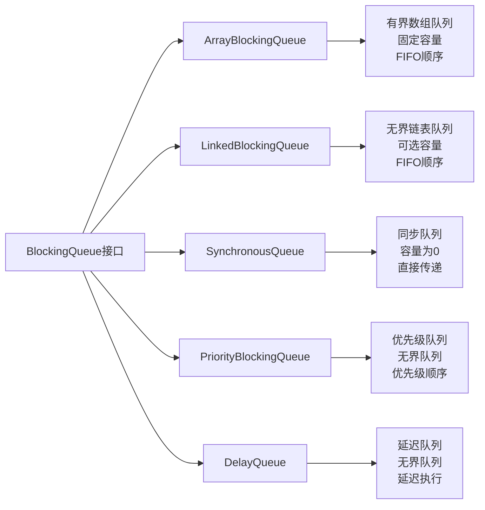

### 8.2 队列类型

队列选型其实是个“三选一”谜题：无界 / 有界 / 同步移交。三者面对同一个问题提供三种完全不同的哲学。

**选择①｜无界队列**：“永远不拒”

```java
new LinkedBlockingQueue<Runnable>();   // 默认 Integer.MAX_VALUE
```

哲学：业务"任务不能丢"最重要、内存需多少给多少。瓶颈陷阱：生产-消费一旦不均衡，队列会吃光堆内存。
适用场景：生产速率 < 消费速率、以及任务必须不能丢。

**选择②｜有界队列**：“足了拒绝”

```java
new ArrayBlockingQueue<>(1000);
new LinkedBlockingQueue<>(1000);
```

哲学：”服务稳定“最重要、任务丢了也宁可不能 OOM。与拒绝策略配合使用、是生产环境默认选择。
该如何选容量？一般是 “core 线程数 × 任务平均耗时 / 最大允许响应时间”。例：Core=20, 任务 50ms, P99=2s → 队列 ≈ 800。

**选择③｜同步移交队列**：“永远不会被入队”

```java
new SynchronousQueue<Runnable>();
```

**这个设计是反直觉的**：容量 = 0、`offer` 决不会成功（除非有另一个线程在 take）。这意味着任务提交后立即开 max、拒绝。阅原代：最优先物反拒接受原、快热锁、低反压 → CachedThreadPool。

**选择④｜优先级队列**：PriorityBlockingQueue、用于带优先级的任务调度。反设计：优先级队列是贴底的”不公平“、低优先级任务可能被饱餁。需同时选 “优先级起升 / 老化策略”。

**选择⑤｜延迟队列**：DelayQueue、用于定时任务 ScheduledThreadPoolExecutor 的逆块。任务入队时带 “定期起跟点 + 执行间隔”信息、到点才被 take 。


### 8.3 队列选择策略

无界队列适用于任务提交速度不快于线程处理速度的场景，避免任务被拒绝。

有界队列可以防止资源耗尽，但需要设置合适的队列大小和拒绝策略。


| 队列类型 | 适用场景 | 优点 | 缺点 |
|----------|----------|------|------|
| ArrayBlockingQueue | 有界缓冲，防止内存溢出 | 内存占用可控 | 容量固定，可能阻塞 |
| LinkedBlockingQueue | 高吞吐量场景 | 吞吐量高 | 可能导致内存溢出 |
| SynchronousQueue | 直接传递，快速响应 | 响应速度快 | 需要足够多的线程 |
| PriorityBlockingQueue | 任务有优先级要求 | 支持优先级 | 排序开销 |


## 09.任务调度与设计


### 9.1 任务提交过程

任务提交的决策顺序是一个三点金字塔，随着资源压力逐步升高。

```text
优先级 1：使用核心线程      → "资源足够、护礼处理"
优先级 2：压入任务队列      → "护资源、缓冲一下"
优先级 3：抨动临时线程      → "极限雷峰、临时抨”
优先级 4：拒绝策略            → "到黑了、送丢老智。谁退丢、怎么退丢"
```

**为什么不“队列与临时线程同时动作”？**

这是 Java 设计者的意识选择、与其它语言不同：

```
Java：    core 满 → 队列 → 队满才抨动 max
.NET：    core 满 → 直接抨动 max 到上限 → 才走队列
Go：       无中间者、直接起 goroutine
```

Java 的选择偏与“以队列为起动”。有个反后果：**LinkedBlockingQueue 默认无界 → 永不抨动 max → maximumPoolSize 设多大都没用**。这是 Executors.newFixedThreadPool 事故根源。

### 9.2 任务调度策略

面对不同场景、Java 提供了两种提交哲学。

**哲学①｜直接提交 (Direct Handoff)**：走 SynchronousQueue 、任务不入队、最快响应

```
  场景：任务耗时较短、要求反转联云限低、可接受“快失败”
  例子：CachedThreadPool、高并发短任务场景
```

**哲学②｜队列提交 (Queueing)**：任务优先入队、队满才抨动 max

```
  场景：任务耗时不一、要求任务不能丢、接受轻锐延迟
  例子：FixedThreadPool、订单处理、计算任务、批棅场景
```

**该选哪种？** 三个提问决定：

```
1、任务可丢吗？             不可 → 队列提交
2、任务不一、生产突发？   是   → 队列提交
3、响应要求 < 100ms？       是   → 直接提交
```

### 9.3 拒绝策略

当线程池和队列都饱和时，采用以下策略之一：

| 策略 | 行为 | 适用场景 | 优缺点 |
|------|------|----------|--------|
| AbortPolicy | 抛出RejectedExecutionException | 需要感知任务被拒绝 | 默认策略，简单直接 |
| CallerRunsPolicy | 调用者线程执行任务 | 降低任务提交速度 | 提供降级机制，但可能阻塞调用者 |
| DiscardPolicy | 静默丢弃任务 | 任务丢失可接受 | 简单，但任务会丢失 |
| DiscardOldestPolicy | 丢弃最老的任务 | 新任务优先级更高 | 保证新任务执行，但老任务丢失 |


## 10.添加线程任务
### 10.1 任务提交接口

线程池提供submit或execute方法用于提交任务。


### 10.2 任务封装

任务通常被封装为Runnable或Callable对象。Callable可以返回结果或抛出异常，而Runnable没有返回值。

### 10.3 任务提交示例

```java
// Java示例
ExecutorService executor = Executors.newFixedThreadPool(5);
Future<String> future = executor.submit(new Callable<String>() {
    public String call() {
        return "任务结果";
    }
});
String result = future.get(); // 获取结果
```

## 11.线程回收机制
### 11.1 线程回收时机

当线程空闲时间超过keepAliveTime，且当前线程数大于核心线程数时，该线程会被终止。

当线程池关闭时，所有线程会被中断。

### 11.2 线程回收实现

线程池通过维护线程的空闲时间，当超过keepAliveTime时，线程会从任务队列获取任务时超时，然后线程退出。

### 11.3 线程回收示例

```java
public void runWorker(Worker w) {
    Thread wt = Thread.currentThread();
    Runnable task = w.firstTask;
    w.firstTask = null;
    while (task != null || (task = getTask()) != null) {
        // 执行任务
        task.run();
        task = null;
    }
    // 如果没有任务，线程退出
}

private Runnable getTask() {
    boolean timed = allowCoreThreadTimeOut || wc > corePoolSize;
    try {
        Runnable r = timed ? workQueue.poll(keepAliveTime, TimeUnit.NANOSECONDS) : workQueue.take();
        if (r != null) return r;
    } catch (InterruptedException retry) {
        // 处理中断
    }
}
```


### 11.4 线程池监控设计

线程池在生产环境中需要完善的监控机制，确保运行状态可观测：

**核心监控指标**

| 指标 | 含义 | 告警阈值参考 |
|------|------|-------------|
| activeCount | 当前活跃线程数 | 接近maximumPoolSize |
| poolSize | 当前线程池大小 | 异常增长 |
| queueSize | 等待队列长度 | 超过容量的80% |
| completedTaskCount | 已完成任务数 | 增长停滞 |
| rejectedCount | 拒绝任务数 | 大于0 |

**监控实现方案**

```java
public class ThreadPoolMonitor {
    private final ThreadPoolExecutor executor;
    
    public void printStats() {
        System.out.println("活跃线程: " + executor.getActiveCount());
        System.out.println("池大小: " + executor.getPoolSize());
        System.out.println("队列长度: " + executor.getQueue().size());
        System.out.println("完成任务: " + executor.getCompletedTaskCount());
    }
}
```

### 11.5 线程池设计总结

**线程池的核心价值**

1. **资源复用**：避免频繁创建销毁线程的开销
2. **流量控制**：通过队列和最大线程数限制并发量
3. **统一管理**：集中管理线程的生命周期

**设计原则**

- 根据任务类型（CPU密集/IO密集）选择合适的线程数
- 选择合适的队列类型和容量
- 配置合理的拒绝策略
- 不同业务使用独立的线程池，实现故障隔离
- 完善监控和告警，及时发现异常

**常见陷阱**

- 使用无界队列导致OOM
- 线程池过大导致上下文切换开销
- 共用线程池导致业务互相影响
- 忽略异常处理导致任务静默失败

## 12.跨语言设计哲学对比

线程池看似是个“全语言都一样”的东西，但实际上不同语言的实现哲学差别巨大。

### 12.1 Java：7 参数设计的哲学

```java
new ThreadPoolExecutor(
    corePoolSize,           // 1、核心线程数
    maximumPoolSize,        // 2、最大线程数
    keepAliveTime,          // 3、空闲存活时间
    TimeUnit.SECONDS,       // 4、时间单位
    workQueue,              // 5、任务队列
    threadFactory,          // 6、线程工厂
    rejectedHandler         // 7、拒绝策略
);
```

**Java 的哲学是“提供全部旋钮、主动权交给使用者”**。七个参数能组合出几十种不同线程池表现：

```
corePoolSize=N、maxPoolSize=N、无界队列           → FixedThreadPool
corePoolSize=0、maxPoolSize=∞、SynchronousQueue   → CachedThreadPool
corePoolSize=N、maxPoolSize=N、DelayQueue            → ScheduledThreadPool
```

三个 Executors 工厂方法其实是这几个参数组合的快捷方式。**阿里 Java 开发规范明令禁用这些快捷方法**——原因是它们有隐藏陷阱：LinkedBlockingQueue 默认容量是 Integer.MAX_VALUE（实质无界）、CachedThreadPool 的 max 也是 Integer.MAX_VALUE。

### 12.2 Go：为何不需要池

```go
// Go 中不需要线程池、直接起 goroutine
for task := range tasks {
    go process(task)   // 100 万任务、100 万 goroutine、轻量可控
}
```

**Go 的哲学是“goroutine 本身就是“轻量任务””**：

```
  goroutine 初始栈 2KB、动态增长             → 100 万 goroutine 仅几 GB
  GMP 调度器抽象 G/M/P、在用户态调度        → 上下文切换不陷内核
  调度器本身就是“线程池 + 任务队列”         → 不需业务层再加一层
```

但 Go 仍然在某些场景需要“goroutine 池”：

```go
// 场景：限制并发、起 100 万 goroutine 有问题、需要 worker pool
sem := make(chan struct{}, 100)   // 并发限 100
for task := range tasks {
    sem <- struct{}{}              // 获取名额
    go func(t Task) {
        defer func() { <-sem }()   // 释放名额
        process(t)
    }(task)
}
```

**这不是线程池、是“信号量限并”**——Go 用 channel 实现了过去要用线程池才能做的事。

### 12.3 Python：GIL下的两种线程池

```python
# CPU 密集 → 进程池
from concurrent.futures import ProcessPoolExecutor
with ProcessPoolExecutor(max_workers=8) as executor:
    results = executor.map(heavy_compute, tasks)

# IO 密集 → 线程池
from concurrent.futures import ThreadPoolExecutor
with ThreadPoolExecutor(max_workers=20) as executor:
    results = executor.map(http_request, urls)
```

**Python 独有现象**：GIL 使得多线程不能同时在多核上跳动。所以 CPU 密集任务用 ThreadPool 纯属白费、必须上 ProcessPoolExecutor。这是 Java/Go/C# 都不需要考虑的问题。

### 12.4 C#/.NET：Task+ThreadPool分层

```csharp
// .NET 使用者几乎不直接接触线程池、只面向 Task
await Task.Run(() => HeavyCompute());
await Task.WhenAll(urls.Select(url => HttpClient.GetAsync(url)));
```

**.NET 的哲学是“Task 是使用者接口、ThreadPool 是运行时隐藏”**：

```
Task           ←— 使用者面向
  ↓
TaskScheduler  ←— 选择怎么调度
ThreadPool     ←— 运行时负责、使用者不需直接调用
```

这是最高抽象、也是最“不易出错”的设计——使用者根本遇不到 “FixedThreadPool vs CachedThreadPool” 的选型问题。

### 12.5 跨语言设计哲学表

| 语言 | 是否需要显式线程池 | 并发单元 | 调度器位置 | 设计哲学 |
|------|----------------|---------|-----------|---------|
| **Java** | 是 | OS 线程 | 应用层 | 使用者选参数、高面向可控 |
| **C#** | 隐含（Task） | OS 线程 | 运行时 | 隐藏、使用者只看 Task |
| **Go** | 不需要 | goroutine | 运行时（GMP）| 并发是语言一等公民 |
| **Python** | 是（且需区分进程/线程）| OS 线程 | 应用层 | GIL 下的补偿 |
| **JavaScript** | 不需要 | 事件循环 | 运行时 | 单线程 + IO 多路复用 |
| **Rust** | 是（tokio Runtime） | 任务 | 库 | 零成本抽象 |

**这是个三层设计选择谱**：应用层、运行时、语言。越向上、使用者越轻松；越向下、使用者越需要理解。

## 13.经典陷阱与事故复盘

线程池是"看似简单、用错事故不断"的经典。这里集中拆解五个生产事故级别的陷阱。

### 13.1 事故①｜newFixedThreadPool导致OOM

**事故场景**：某互联网公司的订单服务用 `Executors.newFixedThreadPool(50)` 接收订单，双十一 2000 并发量突增、处理不过来、队列不断增长、JVM OOM。

```java
// 看 Executors.newFixedThreadPool 的实现
public static ExecutorService newFixedThreadPool(int nThreads) {
    return new ThreadPoolExecutor(nThreads, nThreads, 0L, MILLISECONDS,
        new LinkedBlockingQueue<Runnable>());   // 默认容量为 Integer.MAX_VALUE！
}
```

**根因**：LinkedBlockingQueue 默认容量是 21 亿、实际上是无界队列。任务涌入速率 > 处理速率 → 队列不受控地增长 → 吃光堆内存 → OOM。

**对策**：遵守阿里规范、**永远使用 `new ThreadPoolExecutor()` 原始构造器**，明确指定有界队列：

```java
// ✅ 明确限制
new ThreadPoolExecutor(50, 100, 60L, SECONDS,
    new ArrayBlockingQueue<>(1000),     // 明确容量
    new ThreadFactoryBuilder()
        .setNameFormat("order-%d").build(),
    new ThreadPoolExecutor.CallerRunsPolicy());   // 拒绝后调用者跑、向上反压到业务层
```

### 13.2 事故②｜共用池死锁

**事故场景**：某金融公司、主服务提交任务 A 到公共线程池、A 里面又提交任务 B 到同一个线程池并 `.get()` 等 B。高峰期、线程池被 A 充满占完、所有 B 任务在队列里、A 在等 B、服务雪崩。

```java
// ❌ 嵌套提交同一线程池、且同步等待
Future<B> b = pool.submit(() -> taskB());
pool.submit(() -> {
    Future<C> c = pool.submit(() -> taskC());   // 递归提交
    c.get();   // 等 c 运行、但 c 还在队列里、发生死锁
});
```

**根因**：线程池本质是个"有限资源"。在"同一个线程池里递归提交 + 同步等待"是决定性的死锁陷阱。

**对策**：

- 不同业务使用独立线程池、避免互相影响；
- 避免“提交 + 同步等待”模式、使用 `CompletableFuture.thenCompose` 等异步组合；
- 进行压测验证最差场景。

### 13.3 事故③｜任务异常被吞掉

```java
// ❌ 调 submit、异常被包装到 Future、你不调 future.get() 就永远看不见
executor.submit(() -> {
    throw new RuntimeException("隐藏错误");
});
// 某公司事故：后台任务全静默失败、告警不出、进而事故
```

**根因**：`submit` 返回 Future、异常被包装进去了、你不调 `.get()` 你什么都不知道。这与 CompletableFuture 的隐藏错误事故同源。

**对策**：使用 `execute` 代替 `submit`（错误会被 UncaughtExceptionHandler 捕获）、或包装一层 try/catch：

```java
executor.execute(() -> {
    try { actualWork(); }
    catch (Exception e) { log.error("任务失败", e); metrics.fail(); }
});
```

### 13.4 事故④｜ThreadLocal不清理泄露

```java
// ❌ ThreadLocal 不清理 + 线程池复用 = 内存泄露
static ThreadLocal<UserContext> CURRENT_USER = new ThreadLocal<>();

executor.execute(() -> {
    CURRENT_USER.set(new UserContext("Alice"));
    doWork();
    // 未 remove！线程下一个任务 set Bob 前、CURRENT_USER 仍然是 Alice
    // 更严重的是：Alice 对象不被 GC、内存泄露
});
```

**根因**：线程复用！不清理 ThreadLocal 会跨不同任务。**生产环境会表现为老年代永不释放、Full GC 频繁**。

**对策**：使用 `try/finally` 重点释放 ThreadLocal、或使用 InheritableThreadLocal、或 TransmittableThreadLocal（阿里开源）。

### 13.5 事故⑤｜CallerRunsPolicy反锁主线程

**事故场景**：服务中报着拒绝策略 = CallerRunsPolicy、认为“调用者跑”是反压。但调用者是 Tomcat 处理请求的线程、这里被锁在业务逻辑上、后面全部请求被压。

**根因**：CallerRunsPolicy 的本质是“把拒绝代价付出去调用者”——调用者是谁决定这个策略是否适用：

```
调用者是 Tomcat 请求线程      → 不适用！会锁住全部请求
调用者是定时任务线程           → 不适用！会拖住后面定时
调用者是主任务独立的 worker  → 适用、是反压的理想场景
```

**对策**：默认使用 `AbortPolicy` + 反压上报、或自定义拒绝策略：

```java
new RejectedExecutionHandler() {
    @Override
    public void rejectedExecution(Runnable r, ThreadPoolExecutor e) {
        log.warn("任务被拒、走降级策略");
        metrics.rejected();
        try { fallbackQueue.offer(r, 100, MILLISECONDS); }   // 动态滑量
        catch (InterruptedException ie) { Thread.currentThread().interrupt(); }
    }
};
```

---

### 13.6 跨语言陷阱速查

> **同一个坑、不同方言**——下表每一行是一种语言在池化模型下"最容易翻车"的反模式，按七字真言**预创/复用/限闸/拒压**四象限分类。

| 语言 / 运行时 | 经典陷阱 | 触犯真言 | 一句话避坑 |
|---|---|---|---|
| **Java** | 用 `Executors.newFixedThreadPool` → 无界 LinkedBlockingQueue → OOM | 限闸 | 永远用 `new ThreadPoolExecutor(..., new ArrayBlockingQueue<>(N), ...)` |
| **Java** | 用 `Executors.newCachedThreadPool` → max=Integer.MAX_VALUE → 线程爆炸 | 限闸 | 显式建池 + 有界 max |
| **Java** | 同一池里递归提交并 `Future.get()` → 自我死锁 | 复用 | 用独立池处理子任务，或用 `ForkJoinPool` |
| **Java 虚拟线程** | 把虚拟线程"池化"复用 | 预创 | 虚拟线程**不需要池**，每个任务直接新建 `Thread.ofVirtual().start` |
| **Python** | IO 密集用 `ProcessPoolExecutor`（启动成本高，IPC 开销大） | 预创 | IO 密集用 `ThreadPoolExecutor`，CPU 密集才用 `ProcessPoolExecutor` |
| **Python** | `ThreadPoolExecutor` 内调阻塞库（`requests`），GIL 释放等不到 | 复用 | 改 async + `aiohttp`，或迁移到 `ProcessPoolExecutor` |
| **C++** | 析构线程池时 worker 还在跑 → `std::terminate` | 复用 | 析构前必须 stop + `for(t:workers) t.join()`；用 C++20 `std::jthread` 自动 join |
| **C++** | worker 抛异常未捕获 → 整个进程 abort | 拒压 | worker 函数体内必须 `try/catch (...)` 包裹 |
| **Go** | "建协程池"——goroutine 太便宜，建池反而画蛇添足 | 预创 | 不建池，建池=用 channel/semaphore 限制并发数 |
| **Go** | worker pool 不关 channel → goroutine 永久阻塞泄漏 | 拒压 | 生产者结束必 `close(ch)`，worker `for range ch` 自然退出 |
| **Go** | 没有 worker pool 直接 `go fn()`→ 突发请求拉起百万 goroutine | 限闸 | 用 `golang.org/x/sync/semaphore` 或 `errgroup` 控并发 |
| **Rust (tokio)** | async 函数里调 `std::thread::sleep` / 阻塞 IO → 卡 worker | 复用 | 改用 `tokio::time::sleep` / `tokio::task::spawn_blocking` |
| **Rust (tokio)** | `block_on` 嵌套 → runtime panic | 复用 | runtime 内永远不要 block_on，子任务用 `spawn` |
| **C# / .NET** | 全局 ThreadPool 被某模块"独吞"，其他模块饥饿 | 限闸 | 关键模块用专用 `TaskScheduler` 或自建池隔离 |
| **C# / .NET** | `Task.Run` 内调阻塞 IO → 池 hill-climbing 大量增线程 | 复用 | 用真正的 async API，不在 Task.Run 里 block |
| **Node.js** | CPU 密集任务跑主线程 → 事件循环卡死 | 复用 | 用 `worker_threads` 池处理 CPU 任务 |

---

### 13.7 七字真言对照

> **🗝️ 预创 · 复用 · 限闸 · 拒压**——下表把每一字诀映射到各语言/运行时的具体原语，**学会四字诀，看任何语言的池化方案都是变形题**。

| 真言 | Java | C++ | Python | Go (worker pool) | Rust (tokio) | C# / .NET |
|---|---|---|---|---|---|---|
| **预创**<br/>(启动时建一批) | `corePoolSize` 常驻 | `vector<thread> workers(N)` | `ThreadPoolExecutor(max_workers=N)` | 启动 N 个 goroutine 监听 chan | `worker_threads(N)` | ThreadPool 启动时建 minThreads |
| **复用**<br/>(用完归还) | worker `getTask()` 循环 take | worker `while(!stop) queue.pop()` | future submit 复用线程 | `for task := range ch` 持续消费 | tokio task 复用 worker | task 完归还 ThreadPool |
| **限闸**<br/>(上限封顶) | `maximumPoolSize` + 有界 BlockingQueue | 自己控 queue.size() | `max_workers` + 自管 queue | `chan Task` buffered + `sem.Acquire` | runtime worker 上限 + mpsc bounded | `SetMaxThreads` |
| **拒压**<br/>(满了怎么办) | `RejectedExecutionHandler`（4 种策略） | 用户自己 if 满返回 false | submit 阻塞或抛 RuntimeError | `select { case ch<-t: default: drop }` | `try_send` 返回 Err | hill-climbing 自动加线程 / 排队 |

**通用记忆口诀**：
> "**预创**让用户感觉不到冷启动；**复用**让资源不被消耗在创建上；
> **限闸**让池子不会变成无底洞；**拒压**让池子满时不至于压垮上游。"

**反例识别**：
- 看到 `Executors.newFixedThreadPool` → 缺**限闸**；
- 看到 Go `go fn()` 满天飞 → 缺**限闸**；
- 看到池关闭没 await/join → 缺**复用**收尾；
- 看到 submit 满了不报错也不丢 → 缺**拒压**。

---

## 14.综合案例串讲

> 🎯 **本节定位**：把前面所有零散知识点（建池五问 / 池化通用模型 / 七字真言 / 跨语言对应物 / 经典陷阱）**串到一个真实业务场景**——电商订单异步通知池。先讲通用骨架，再给 5 语言并列实现，最后回归"建池五问"做总检查。

### 14.1 案例背景

某电商平台订单服务，下单成功后需要异步触发 5 个下游通知：

```
订单创建成功
    ├─ 短信通知用户
    ├─ App 推送通知
    ├─ 邮件订单确认
    ├─ 风控系统上报
    └─ 数据日志归档
```

**业务约束**：
- 双 11 峰值 50 万 QPS，平均每个订单触发 5 个通知任务
- 通知任务允许失败（有重试队列兜底），但**不能拖慢主下单链路**
- 通知耗时 P50=20ms，P99=200ms（依赖第三方 IO）
- 不同通知优先级不同：短信/推送 > 邮件 > 风控/日志

**这是一个典型的 IO 密集 + 削峰填谷 + 多优先级**池化场景——下面 5 种语言会怎么解？

### 14.2 通用骨架设计

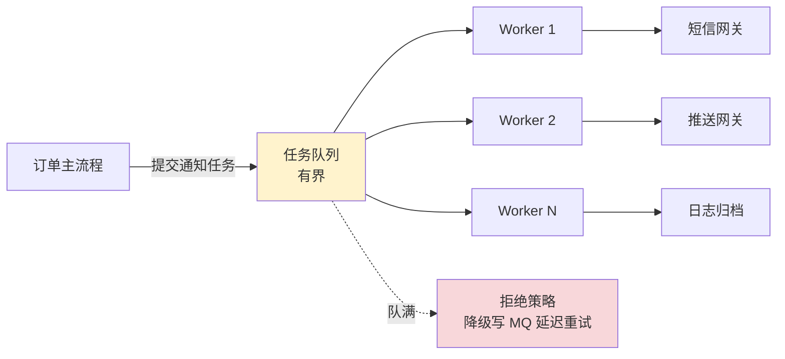

**池化决策（语言无关）**：

| 决策项 | 取值 | 推导 |
|---|---|---|
| 并发度 | `2 × CPU = 16`（IO 密集） | CPU 密集才用 `CPU+1`，IO 密集靠"线程多 = 等 IO 时间多" |
| 队列容量 | `core × 平均耗时 / SLA = 16 × 20ms / 1s = 320` → 取 1000 | 留 3 倍 buffer 抗抖动 |
| 拒绝策略 | 降级写 Kafka 延迟重试 | 不能丢任务（业务约束） |
| 监控四项 | `active / queue / rejected / p99` | 七字真言"限闸 + 拒压"必看 |
| 关闭策略 | shutdown + 30s awaitTermination | 不能强制 kill 正在跑的通知 |

### 14.3 Java 实现

```java
public class NotifyPool {
    private final ThreadPoolExecutor pool;
    private final KafkaProducer<String, Notify> fallback;

    public NotifyPool(KafkaProducer<String, Notify> mq) {
        this.fallback = mq;
        this.pool = new ThreadPoolExecutor(
            16, 32, 60L, TimeUnit.SECONDS,
            new ArrayBlockingQueue<>(1000),
            new ThreadFactoryBuilder().setNameFormat("notify-%d").build(),
            (r, e) -> {                                          // 拒绝策略：降级到 MQ
                Notify n = ((NotifyTask) r).notify;
                fallback.send(new ProducerRecord<>("notify-retry", n));
                metrics.rejected.inc();
            });
    }

    public void submit(Notify n) {
        pool.execute(new NotifyTask(n));
    }

    @PreDestroy
    public void close() throws InterruptedException {
        pool.shutdown();
        if (!pool.awaitTermination(30, TimeUnit.SECONDS)) {
            pool.shutdownNow();
        }
    }
}
```

**Java 视角的设计取舍**：用 `ArrayBlockingQueue` 而非默认的 `LinkedBlockingQueue`（避无界陷阱），自定义 `RejectedExecutionHandler` 把超载任务降级到 MQ，`shutdown` + `awaitTermination` 优雅退出。

### 14.4 Go 实现

```go
type NotifyPool struct {
    ch       chan Notify
    wg       sync.WaitGroup
    fallback *kafka.Writer
}

func NewNotifyPool(workers int, queueSize int, mq *kafka.Writer) *NotifyPool {
    p := &NotifyPool{
        ch:       make(chan Notify, queueSize),  // buffered channel = 任务队列
        fallback: mq,
    }
    for i := 0; i < workers; i++ {                // 启动 N 个 worker
        p.wg.Add(1)
        go p.worker()
    }
    return p
}

func (p *NotifyPool) worker() {
    defer p.wg.Done()
    for n := range p.ch {                         // for range 自然消费 + 关闭退出
        if err := send(n); err != nil {
            metrics.failed.Inc()
        }
    }
}

func (p *NotifyPool) Submit(ctx context.Context, n Notify) error {
    select {
    case p.ch <- n:                               // 入队成功
        return nil
    default:                                       // 队满 → 降级 MQ
        metrics.rejected.Inc()
        return p.fallback.WriteMessages(ctx, kafka.Message{Value: encode(n)})
    }
}

func (p *NotifyPool) Close() {
    close(p.ch)                                    // 关 chan → worker 自然退出
    p.wg.Wait()                                    // 等所有 worker 完成
}
```

**Go 视角的设计取舍**：`chan + N goroutine` 就是天然的 worker pool，`select default` 实现非阻塞拒绝（对应 Java 的 reject handler），`close(ch) + wg.Wait()` 是 Go 的优雅关闭范式。

### 14.5 C++ 实现

```cpp
class NotifyPool {
    std::queue<Notify> queue_;
    std::vector<std::jthread> workers_;            // C++20 jthread 自动 join
    std::mutex mu_;
    std::condition_variable cv_;
    std::atomic<bool> stop_{false};
    size_t cap_;
    KafkaProducer& fallback_;

public:
    NotifyPool(size_t workers, size_t cap, KafkaProducer& mq)
        : cap_(cap), fallback_(mq) {
        for (size_t i = 0; i < workers; ++i) {
            workers_.emplace_back([this](std::stop_token st) { worker(st); });
        }
    }

    bool submit(Notify n) {
        {
            std::lock_guard lk(mu_);
            if (queue_.size() >= cap_) {           // 限闸 + 拒压
                fallback_.send(std::move(n));
                metrics::rejected.inc();
                return false;
            }
            queue_.push(std::move(n));
        }
        cv_.notify_one();
        return true;
    }

private:
    void worker(std::stop_token st) {
        while (!st.stop_requested()) {
            std::unique_lock lk(mu_);
            cv_.wait(lk, [&] { return !queue_.empty() || st.stop_requested(); });
            if (st.stop_requested() && queue_.empty()) return;
            auto n = std::move(queue_.front()); queue_.pop();
            lk.unlock();
            try { send(n); } catch (...) { metrics::failed.inc(); }
        }
    }
};
// 析构：jthread RAII 自动 stop+join，规避了 §1.2 事故
```

**C++ 视角的设计取舍**：`std::jthread` (C++20) 自带 `stop_token` 解决了 `std::thread` 析构 terminate 陷阱，`condition_variable` 等价于 Java `BlockingQueue` 的 `Lock+Condition`，try/catch (...) 必不可少避免 worker panic 拖整个进程。

### 14.6 Python 实现

```python
import asyncio
from concurrent.futures import ThreadPoolExecutor
from queue import Queue, Full
from kafka import KafkaProducer

class NotifyPool:
    def __init__(self, workers=16, cap=1000, mq=None):
        self.queue = Queue(maxsize=cap)            # 有界队列
        self.executor = ThreadPoolExecutor(max_workers=workers,
                                           thread_name_prefix="notify")
        self.fallback = mq
        self.running = True
        for _ in range(workers):
            self.executor.submit(self._worker)

    def submit(self, notify):
        try:
            self.queue.put_nowait(notify)          # 非阻塞入队
        except Full:                                # 限闸 + 拒压
            self.fallback.send("notify-retry", value=notify)
            metrics.rejected.inc()

    def _worker(self):
        while self.running:
            try:
                n = self.queue.get(timeout=1)
                send(n)                             # IO 密集任务，GIL 释放
                self.queue.task_done()
            except queue.Empty:
                continue

    def close(self):
        self.running = False
        self.executor.shutdown(wait=True)
```

**Python 视角的设计取舍**：通知是 IO 密集（HTTP 调第三方）→ 用 `ThreadPoolExecutor` 而非 `ProcessPoolExecutor`（避 §1.4 GIL 陷阱）；`Queue.put_nowait` + `Full` 异常等价于 Java 的拒绝策略；CPU 密集任务则要换 `ProcessPoolExecutor`。

### 14.7 Rust 实现

```rust
use tokio::sync::mpsc;
use std::sync::Arc;

pub struct NotifyPool {
    tx: mpsc::Sender<Notify>,
    fallback: Arc<KafkaProducer>,
}

impl NotifyPool {
    pub fn new(workers: usize, cap: usize, mq: Arc<KafkaProducer>) -> Self {
        let (tx, rx) = mpsc::channel::<Notify>(cap);     // bounded mpsc = 任务队列
        let rx = Arc::new(tokio::sync::Mutex::new(rx));
        for _ in 0..workers {
            let rx = rx.clone();
            tokio::spawn(async move {                    // N 个 worker tokio task
                while let Some(n) = rx.lock().await.recv().await {
                    if let Err(e) = send(n).await {      // 必须 .await 不能 std::sleep
                        metrics::FAILED.inc();
                    }
                }
            });
        }
        Self { tx, fallback: mq }
    }

    pub async fn submit(&self, n: Notify) -> Result<(), Error> {
        match self.tx.try_send(n) {                       // try_send = 非阻塞拒绝
            Ok(_) => Ok(()),
            Err(mpsc::error::TrySendError::Full(n)) => {  // 限闸 + 拒压
                metrics::REJECTED.inc();
                self.fallback.send(n).await
            }
            Err(e) => Err(e.into()),
        }
    }
}
// drop runtime 时 worker 自动取消（结构化并发的副作用）
```

**Rust 视角的设计取舍**：`tokio::mpsc(cap)` 天然就是有界队列，`try_send` 等价于 Java `offer(0)` 立即返回（避 §1.5 阻塞 worker 陷阱），结构化并发让 runtime drop 时所有 worker 自动取消（对应 Java 的 `shutdownNow`）。

### 14.8 五语言对照

| 维度 | Java | Go | C++ | Python | Rust |
|---|---|---|---|---|---|
| **池抽象** | `ThreadPoolExecutor` | `chan + goroutine` | `vector<jthread>` | `ThreadPoolExecutor` | `mpsc + tokio::spawn` |
| **队列** | `ArrayBlockingQueue(1000)` | `make(chan, 1000)` | `queue + cv + cap=1000` | `Queue(maxsize=1000)` | `mpsc::channel(1000)` |
| **限闸** | `maximumPoolSize` | worker 数固定 | `vector` size | `max_workers` | `worker_threads` |
| **拒压** | `RejectedExecutionHandler` | `select default` | `if size>=cap` | `Full` 异常 | `try_send` Err |
| **优雅关** | `shutdown+awaitTermination` | `close(ch)+wg.Wait()` | jthread RAII | `executor.shutdown(wait=True)` | drop runtime |
| **典型陷阱** | 无界队列 | 不关 chan 泄漏 | 析构未 join | CPU 任务用 thread pool | async 内 std::sleep |

**五种长相、一个本质**：都在解**预创/复用/限闸/拒压**这四件事——只是哪些靠用户写、哪些由语言/runtime 内置不同而已。

### 14.9 案例知识点回归

回到本节开头的"建池五问"，对照 5 种实现一一回答：

| 问题 | Java 答案 | Go 答案 | 共性 |
|---|---|---|---|
| **谁来建** | 用户 `new ThreadPoolExecutor` | 用户 `for i:=0;i<N;go worker()` | 都是用户决定（显式池家族） |
| **建多少** | core=16, max=32 | workers=16 | 都按"2×CPU"IO 密集公式 |
| **任务排哪** | `ArrayBlockingQueue(1000)` | `chan(1000)` | 有界，留 3× 抗抖动 buffer |
| **满了怎么办** | reject → MQ | `default` → MQ | 都降级到延迟重试，不丢 |
| **谁来关** | `shutdown` + 30s 等 | `close(ch)` + `wg.Wait()` | 都给在飞任务时间退出 |

**七字真言**也在 5 种实现里一一对应：
- **预创**：N 个 worker 启动时建好（5 种实现都是）
- **复用**：worker 循环 take 任务（Java `getTask`/Go `for range`/C++ `cv.wait`/Py `queue.get`/Rust `recv`）
- **限闸**：队列 cap=1000 + worker 数固定（5 种实现都是）
- **拒压**：满了写 MQ 降级（5 种实现都是）

---

## 15.一句话总结

> **线程池本质上是"生产者-消费者"模式在资源有限下的资源管理哲学——提供一个可控、可观测、可恢复的并发边界。**

### 15.1 三层认知阶梯

```
L1 会用：建池五问能答出（核心数 / 队列容量 / 拒绝策略 / 关闭语义 / 监控指标）
L2 会调：四指标能监控（active / queue / rejected / p99），并基于压测结果调参
L3 会设计：能给陌生语言/runtime 设计池子——脑子里装的是七字真言而不是 Java API
```

### 15.2 终极建议

- **拒用 Executors 快捷方法**——使用原始构造器、所有参数明确（Java/Python 同理）；
- **业务隔离**——不同业务独立线程池、故障不互相冲击；
- **必须可观测**——上报 `activeCount` / `queueSize` / `rejectedCount` / `p99`，超阈值报警；
- **考虑虚拟线程 / 协程**——JDK 21+ Loom、Go goroutine、Kotlin coroutine、Rust async 让"一任务一执行单元"成为可能，**线程池在协程/虚拟线程场景中逐步退出主舞台**。

### 15.3 与下篇承接

- **→ [16.线程池设计核心原理](./16.线程池设计核心原理.md)**：本篇讲了"是什么 / 为什么 / 怎么选"，下篇深入 Java `ThreadPoolExecutor` 的**源码精读**——`int ctl` 编码、`AQS` 同步框架、`Worker` 自身即锁，把"四要素"拆到比特位级别。
- **→ [17.线程池使用技巧](./17.线程池使用技巧.md)**：本篇讲了"通用骨架"，下篇讲**生产环境实战**——参数计算公式、监控埋点、动态调参、JUC 工厂方法的反面教材合集。

---

## 📎 延伸阅读

- **前一篇**：[14.Actor与CSP并发模型](./14.Actor与CSP并发模型.md)（并发范式之边界）
- **下一篇**：[16.线程池设计核心原理](./16.线程池设计核心原理.md)（Java JUC 源码级精读）
- **使用技巧**：[17.线程池使用技巧](./17.线程池使用技巧.md)（生产环境实战与调参）
- **协程视角**：[13.协程核心设计思想](./13.协程核心设计思想.md)（虚拟线程与协程让十万任务不需要"池"）


