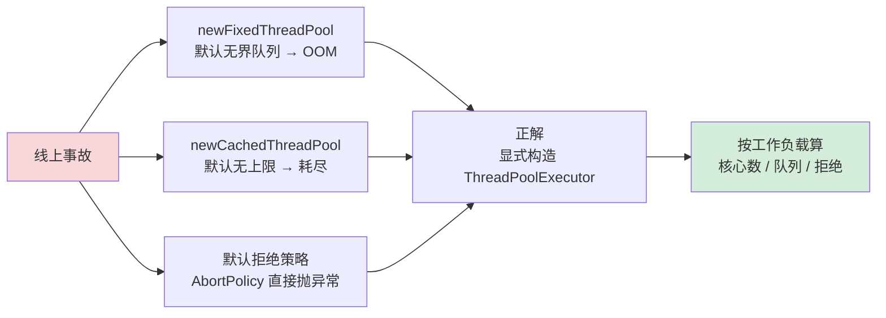
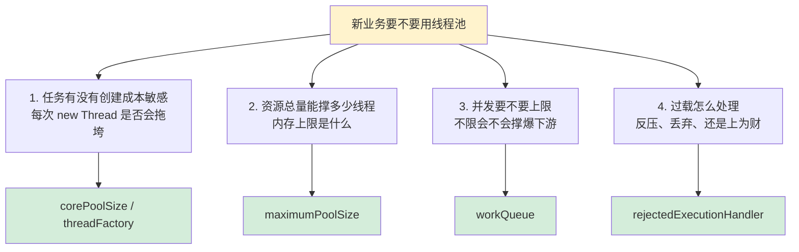

# 26.线程池使用技巧

> 📍 **本篇位置**：第 3 卷 · 并发之道 · 第 16 篇
> 🎯 **核心矛盾**：**API 易用 vs 线上踩坑** —— `Executors` 工厂的默认值都是"面试题"式的陷阱
> 🧭 **设计灵魂**：线程池调优三大参数（**核心数 / 队列容量 / 拒绝策略**）必须自己算；**IO 密集 × 2N、CPU 密集 = N+1** 是底线公式
> 🌐 **跨语言覆盖**：Java(慎用 Executors.newFixedThreadPool 默认无界队列) · Android(AsyncTask 废弃) · C#(TaskScheduler 自定义) · Python(ProcessPoolExecutor vs ThreadPoolExecutor 选择)
> 🔗 **延伸阅读**：← [25.线程池的设计思想](./25.线程池的设计思想.md) · → [27.线程池设计核心原理](./27.线程池设计核心原理.md)



---

#### 目录介绍
- [00.从一次大促前夜的事故说起](#00从一次大促前夜的事故说起)
  - [0.1 一行 Executors 引发的雪崩](#01-一行-executors-引发的雪崩)
  - [0.2 三个被忽视的本质问题](#02-三个被忽视的本质问题)
- [01.快速了解线程池](#01快速了解线程池)
  - [1.1 学习本节课目标](#11-学习本节课目标)
  - [1.2 开发中遇到问题](#12-开发中遇到问题)
  - [1.3 创建线程消耗资源](#13-创建线程消耗资源)
  - [1.4 如何合理用线程](#14-如何合理用线程)
  - [1.5 要用好线程池](#15-要用好线程池)
  - [1.6 线程池的优势](#16-线程池的优势)
  - [1.7 线程池业务类型](#17-线程池业务类型)
  - [1.8 本节课问题思考](#18-本节课问题思考)
- [02.线程池设计架构](#02线程池设计架构)
  - [2.1 线程池设计架构](#21-线程池设计架构)
  - [2.2 线程创建规则设计](#22-线程创建规则设计)
  - [2.3 线程池管理器](#23-线程池管理器)
  - [2.4 任务队列设计](#24-任务队列设计)
  - [2.5 线程工厂设计](#25-线程工厂设计)
  - [2.6 拒绝策略设计](#26-拒绝策略设计)
  - [2.7 理解线程优化级](#27-理解线程优化级)
  - [2.8 线程池整体架构图](#28-线程池整体架构图)
- [03.ThreadPoolExecutor](#03threadpoolexecutor)
  - [3.1 ThreadPoolExecutor参数](#31-threadpoolexecutor参数)
  - [3.2 ThreadPoolExecutor使用](#32-threadpoolexecutor使用)
  - [3.3 execute和submit区别](#33-execute和submit区别)
  - [3.4 CPU密集型线程池](#34-cpu密集型线程池)
  - [3.5 IO密集型线程池](#35-io密集型线程池)
  - [3.6 各种线程池类用途](#36-各种线程池类用途)
- [04.线程池实践使用说明](#04线程池实践使用说明)
  - [4.1 newFixedThreadPool](#41-newfixedthreadpool)
  - [4.2 newCachedThreadPool](#42-newcachedthreadpool)
  - [4.3 newScheduledThreadPool](#43-newscheduledthreadpool)
  - [4.4 newSingleThreadExecutor](#44-newsinglethreadexecutor)
  - [4.5 newWorkStealingPool](#45-newworkstealingpool)
  - [4.6 线程池该如何选择](#46-线程池该如何选择)
  - [4.7 如何给线程赋予名字](#47-如何给线程赋予名字)
  - [4.8 线程池如何处理线程异常](#48-线程池如何处理线程异常)
  - [4.9 线程池状态获取](#49-线程池状态获取)
- [06.线程池实践的总结](#06线程池实践的总结)
  - [6.1 执行流程介绍](#61-执行流程介绍)
  - [6.2 线程池的使用技巧](#62-线程池的使用技巧)
  - [6.3 线程池实践问题总结](#63-线程池实践问题总结)
  - [6.4 线程池大小选择策略](#64-线程池大小选择策略)
  - [6.5 项目中用到多个线程池](#65-项目中用到多个线程池)
  - [6.6 线程池常见问题总结](#66-线程池常见问题总结)
- [07.一句话总结与决策清单](#07一句话总结与决策清单)

---

## 00.从一次大促前夜的事故说起

### 0.1 一行Executors引发的雪崩

2023 年某电商平台大促前夜 23:47，订单服务突然开始大面积超时，5 分钟后全集群 OOM。复盘时翻到一段年代久远的代码：

```java
// OrderNotifyService.java —— 三年前某位前同事写的
public class OrderNotifyService {
    private static final ExecutorService POOL = Executors.newFixedThreadPool(20);

    public void notifyAsync(Order order) {
        POOL.execute(() -> {
            httpClient.post("https://partner-api/notify", order);  // 调外部合作方
        });
    }
}
```

看上去没毛病——20 个线程的固定池，按理说 QPS 5K 应该能扛住。但那个晚上事故现场是：

```
[告警] JVM Heap = 7.8GB / 8GB
[告警] LinkedBlockingQueue size = 4_300_000   ← 队列里堆了 430 万个 Runnable
[告警] http-pool active = 20 / 20、avg latency = 28s   ← 合作方挂了
```

原因"一环扣一环"：

1. 合作方接口压力差崩溃，响应从 50ms 变为 30s
2. 20 个线程都被卡在 HTTP 调用中
3. 后面进来的所有任务全部堆进 LinkedBlockingQueue"无界"队列
4. 5K QPS × 30s 滞留 = 15 万/s 入队，只偶尔出队
5. JVM 堆顶不住 → OOM → 全集群雪崩

事故复盘会上有人追问三个关键问题：

- 这 `Executors.newFixedThreadPool(20)` 为什么会 OOM？不是说"固定 20 线程"吗？
- 为什么阿里巴巴开发手册"双圈"禁止 `Executors`？背后是什么机制？
- 这里怎么设才会不 OOM？该设多大队列？拒绝策略选什么？

这三个问题，正是本章要回答的核心。

### 0.2 三个被忽视的本质问题

```mermaid
flowchart TB
    Q[一行 Executors 引发的生产事故] --> Q1[问题1<br/>"固定 20 线程"为什么还能 OOM？]
    Q --> Q2[问题2<br/>"调起来简单"为何被明令禁用？]
    Q --> Q3[问题3<br/>参数怎么算才不会出现事故？]
    Q1 --> A1[默认 LinkedBlockingQueue<br/>="无界"队列<br/>=任务堆积不会拒绝]
    Q2 --> A2[工厂方法隐藏了参数<br/>= 友好默认 vs 安全默认<br/>选了前者]
    Q3 --> A3[负载类型×上游依赖不同<br/>= 公式给不了默认值<br/>必须量身定做]
    style A1 fill:#fff3cd
    style A2 fill:#fff3cd
    style A3 fill:#d4edda
```

这三个问题层层递进：从**现象**（为何崩）追到**机制**（为何这设），再到**方法论**（你该怎么设）。**接下来每一节都在回答其中之一**：

| 问题 | 答案章节 | 关键洞察 |
|---|---|---|
| Executors 为何危险？ | §4.1 / §4.2 | 工厂方法的全部默认值都在"面试题"上选错了 |
| 参数之间的优先级？ | §2.7 / §2.8 | 核心线程 > 任务队列 > 最大线程（反直觉！） |
| CPU 密集 N+1？ | §3.4 / §6.4 | 为什么不是 N 也不是 2N |
| IO 密集 2N？ | §3.5 | 是公式的边界近似，不是魔法数字 |
| 拒绝策略怎么选？ | §2.6 / §6.6 | 反压机制 vs 任务可弃 vs 调用者接住 |
| 哪些坑必须避？ | §4.x / §6.6 | 不同业务拼池、ThreadLocal、线程名缺失 |

---

## 01.快速了解线程池
### 1.1 学习本节课目标

本节课的目标：

1. **理解线程池的本质**：为什么线程池比直接创建线程更优，本质上解决了什么问题？
2. **掌握线程池的选型策略**：面对不同业务场景（CPU密集型、IO密集型、混合型），如何选择合适的线程池？
3. **学会线程池的参数调优**：核心线程数、最大线程数、队列类型如何根据实际负载合理配置？
4. **避免线程池的常见陷阱**：任务堆积、线程泄漏、死锁等问题的识别与防范。
5. **建立生产级线程池使用规范**：命名、监控、异常处理、优雅关闭的最佳实践。

### 1.2 为什么不能直接new Thread

在动手使用线程池之前，先问一个根本问题：“谁规定了处理异步任务不能直接 `new Thread`？”

实际上这个“规定”不是某个专家拍脑袋定的，是被三个现实问题逼出来的。

**问题 1：创建成本不是小事**

```
创建一个 Java 对象 ≈ 50ns（在 JVM 堆里划一块）
创建一个线程   ≈ 0.5 ~ 1ms（是对象创建的一万倍！）
  → 陈谏内核调用 clone()/pthread_create
  → 内核为线程分配 task_struct 结构
  → 划 8MB 虚拟内存作为线程栈
  → 加入内核调度器的运行队列
```

**问题 2：线程是重量级资源**

```
一个 Java 线程的资源占用（HotSpot 64位默认）：
  线程栈       1MB（虚拟内存，Linux 默认 8MB）
  PCB           2~16KB（内核 task_struct）
  TLS           几 KB（线程本地存储）
  调度费用     每次上下文切换 ~1μs
  
1万个线程 = 10GB 虚拟内存 + 几百 MB 内核内存
```

**问题 3：不受控在业务上会崩坑**

考虑一个反例：每次请求都 `new Thread().start()`。

```java
@PostMapping("/notify")
public void notify(Order o) {
    new Thread(() -> processOrder(o)).start();   // 反模式！
}
// QPS 5000 → 每秒创 5000 个线程
// 如果 processOrder 耗时 1s → 任意时刻同时存在 5000 线程
// → 5GB 虚拟内存 + 5000 个线程上下文切换 → CPU 被调度器吞光
```

**三个问题的共同总结**：“创建成本高” + “资源量级大” + “并发不受控” 三者任一个都足以崩掉一个系统。三个加起来 → 必须上线程池。这是“为什么需要线程池”的根源，不是“面试领领"。


### 1.3 定量看创建线程的成本

上一节给出了“创建线程 0.5～1ms"这个数字，它从哪里来？拆解一下成本构成。

**创建阶段的成本（一次性）**：

| 项目 | 耗时 | 说明 |
|---|---|---|
| 用户态调用 syscall | ~100ns | clone() / pthread_create |
| 内核创建 task_struct | ~50μs | 完整 PCB |
| 内核划 8MB 虚拟内存 | ~10μs | 仅虚拟，不是物理内存 |
| JVM 初始化 TLAB、JNI 表 | ~500μs | 这是 Java 特有的大头 |
| 加入调度队列 + 首次上 CPU | ~50μs | 含上下文切换 |
| **合计** | **~0.6ms** | |

**运行阶段的成本（持续）**：

```
上下文切换 ≈1μs / 次
→ 1000 个线程争 4 核、每 10ms 轮转一轮
→ 每秒上下文切换 ~10 万次 → 耗 100ms CPU 于调度
→ 4 核总计 4000ms、调度占了 100ms≈2.5%”箪友”损耗
```

**销毁阶段的成本（一次性）**：主要是释放虚拟内存、销 task_struct，大约 ~100μs。

**结论**：一次创建+销毁 ≈ 0.7ms。如果业务任务本身只需 1ms 听，那么 41% 的 CPU 在 “创销线程" 上，这是“豹口骨酬”。

**这是为什么要线程复用**：不是为了能多跱几个任务，而是为了把 0.7ms 的创建销毁成本“摊”到几万个任务上，使其近于 0。

### 1.4 线程数与吞吐量的量化关系

“多少个线程才合适"这个问题的根本，是一条“吞吐量-线程数”曲线。偶尔听人说“多就是多为率”是错的；听“少就是快”也是错的。

```
吞吐量
  ↑
  │         ┌──────────────────────────┐
  │         │  ⚠️ 过多线程区：上下文切换吞 CPU
  │         │     吞吐量下滑
  │  ╔══╗                              │
  │  ║ ║ ↑                            │
  │╔═╩═╩═╗ 最佳点 →                  │
  │║     ║───────────────────────────
  │║     ║
  ┃┗━━━━━┛───────────────────────→ 线程数
  │        N        2N        4N
  │ ⚠️ 太少：CPU 闲着能跳但没人跳
```

**为什么会有峰值？两边崩坏的机制不同**：

- **太少**：资源闲置。某个线程在等 IO，CPU 本可以去帮其他任务跱，但没人。
- **太多**：上下文切换吞。开始乘以（1μs/次 × 频繁调度），甚至 cache miss 增加，有效业务计算时间被吞。

这是“为什么 N+1、为什么 2N”的本质背景——都是在近似这个峰值位置。§3.4 与 §6.4 会进一步求解这个峰值。

### 1.5 线程池解决了哪几个问题

现在可以给“为什么上线程池"一个严谨的回答了。线程池不是“new Thread 的升级版”，是一个同时解决 4 个问题的抽象：

```
问题 1：创建销毁贵  → 线程复用  → 创销成本摊薄到几万任务上
问题 2：资源重        → 总量控制  → corePoolSize / maxPoolSize 设上限
问题 3：起底不受控    → 队列缓干  → 峰值限资源，改用队列缓干
问题 4：业务避过载  → 拒绝策略  → 运行不下去了反压或丢弃
```

**这 4 个问题会一一对应到线程池的 4 个核心参数**：

| 问题 | 参数 | 译“生深资源者"语言 |
|---|---|---|
| 创建贵 → 复用 | corePoolSize / threadFactory | 预创建、住不走、极贵型资源 |
| 资源重 → 总量 | maximumPoolSize | 遐远越限，以免誑象 |
| 不受控 → 队列 | workQueue | 峰货平谷，不要丢 |
| 运行不下去 → 拒绝 | rejectedExecutionHandler | 反压/丢弃/上为财 |

**上一节的事故拼起来就是一个考题**： `Executors.newFixedThreadPool(20)` 遇上上游不靠谱、未加队列上限、未造名拒绝策略——4 个问题只解了 1 半。 §4.1 会逐个调查它们“隐藏"哪些危险默认值。


### 1.6 线程池的优势
- ①降低系统资源消耗
    - 通过重用已存在的线程，降低线程创建和销毁造成的消耗；
- ②提高系统响应速度
    - 当有任务到达时，无需等待新线程的创建便能立即执行；
- ③方便线程并发数的管控
    - 线程若是无限制的创建，不仅会额外消耗大量系统资源，更是占用过多资源而阻塞系统或oom等状况，从而降低系统的稳定性。线程池能有效管控线程，统一分配、调优，提供资源使用率；
- ④更强大的功能
    - 线程池提供了定时、定期以及可控线程数等功能的线程池，使用方便简单。


### 1.7 线程池业务类型

线程池的分类方法比较多，如果我们按照业务中使用的频繁程度来做分类，主要分为以下三类线程池：

1. CPU密集型线程池：用来处理 CPU 类型任务，如计算，逻辑操作，UI 渲染等。例如：newFixedThreadPool、newWorkStealingPool 
2. IO密集型线程池：用来处理 IO 类型任务，如拉取网络数据，往本地磁盘、数据读写数据等。例如：newCachedThreadPool 
3. 其他线程池：自定义用来满足业务独特化需求的线程池。例如：newScheduledThreadPool（定时任务线程池）、newSingleThreadExecutor（单一线程池）等等。

在 Java 中，线程池是一种管理线程的机制，可以有效地复用线程、控制并发数量，并减少线程创建和销毁的开销。Java 提供了多种线程池实现，主要通过 `java.util.concurrent` 包中的 `ExecutorService` 接口及其实现类来实现。以下是 Java 中线程池的分类及其特点：


### 1.8 本节课问题思考

学完本节后，思考以下问题：

1. **为什么阿里巴巴开发手册禁止使用Executors创建线程池？** 提示：思考`newFixedThreadPool`和`newCachedThreadPool`的队列和线程数上限。
2. **一个HTTP服务器同时处理IO和计算任务，应该用几个线程池？** 提示：不同类型的任务混用同一线程池会导致什么问题？
3. **线程池的线程数设为CPU核数+1，这个"+1"的意义是什么？** 提示：当某个线程因为偶发的页缺失(page fault)而暂停时。
4. **CallerRunsPolicy拒绝策略为什么被认为是最"温和"的策略？** 提示：它实现了一种天然的"背压"机制。
5. **如何实现线程池的优雅关闭？shutdown()和shutdownNow()的区别是什么？**


## 02.线程池核心类

### 2.1 线程池设计架构

在讲具体参数之前，先理解**线程池为什么需要这几个部件**。从空白处推演：

```mermaid
flowchart LR
    A[任务提交] --> B[需要一个”接件员"]
    B --> C[管理器<br/>ThreadPoolExecutor]
    A --> A2[需要一个”中转站"]
    A2 --> Q[任务队列<br/>BlockingQueue]
    C --> D[管理合勿居处]
    D --> W[工作线程<br/>Worker]
    C --> F[同质产生人”线程"]
    F --> TF[线程工厂<br/>ThreadFactory]
    Q --> R[队列满了怎么办]
    R --> H[拒绝策略<br/>RejectedExecutionHandler]
    style C fill:#fff3cd
    style Q fill:#d4edda
    style W fill:#d4edda
    style TF fill:#d4edda
    style H fill:#ffe4b5
```

**五个部件都是"被问题逼出来的"**：

| 部件 | 被什么问题逼出来 | 职责 |
|---|---|---|
| ThreadPoolExecutor | 谁来决定”这个任务该怎么走" | 调度 + 状态机 |
| BlockingQueue | 峰货到了但线程忙不过来 | 中转、隔​主​从 | 
| Worker | 谁需要真正走这个任务 | 复用、循环取任务 |
| ThreadFactory | 创建线程该走哪条路 | 名字、守护状态、未捡处理器等 |
| RejectedExecutionHandler | 队列满了仔​​杀​​是​推​另 | 反压、丢弃、调用者接住 |

这 5 个部件拼起来不是“五个独立的类”，而是**生产者-消费者模式**加**过载保护机制**的拼装。

### 2.2 线程创建规则设计

这是线程池最反直觉的一套规则。互联网公司面试最爱问这个，原因是他们发现很多人能背但理解不了背后的设计动机。

**规则本身**：

1. 当前线程数 < `corePoolSize` → 创建核心线程执行
2. 当前线程数 ≥ `corePoolSize` → 任务入队
3. 队列满，且当前线程数 < `maximumPoolSize` → 创建非核心线程执行
4. 队列满，且当前线程数 = `maximumPoolSize` → 拒绝策略

**三个必须追问的问题**：

**问题 1：为什么不是“先填满最大线程再入队”？**

看上去“凑足人手•1”是起码应该的策略。但不是。

```
各位考虑：
  创建线程 ≈ 0.6ms
  入队一个任务 ≈ 0.0001ms（1 次 CAS）
  两者成本相差 6000 倍
```

所以设计者说：能入队就入队，**不到“队列满”的紧急场面不会创新线程**。这是很多人主观上会错错为“性能 bug" 的设计，其实是有意设计的。

**问题 2：为什么使用 “核心 vs 非核心” 而不是“一努都走到黑”？**

```
需求 1：平常 QPS低，不想预资太多线程
需求 2：偶尔峰值时能临时扩容
需求 3：峰值过后多余线程能退出
  → 定义两种”身份":
      核心线程——含金量高，不退出
      非核心线程——被雇佣取贵，闲 keepAliveTime 后退休
```

**问题 3：为什么“队列优先于创建非核心线程”是反直觉的？**

如果设计成“创建优先”：起码 corePoolSize=2、maxPoolSize=10 的池，来 5 个任务马上创 5 个线程。看起来”响应快"，但什么代价？

```
创 5 个线程的总费用 ≈ 3ms
使为 5 个任务跱中、每任务 100ms，创建费用为任务总费用的 6%
如果 5 个任务仅需 1ms，创建费用为任务总费用的 60%！
```

**设计者的选择**：多数场景下“多排一点队”仍能接受，创线程的费用才是需要避免的。`maximumPoolSize` 是“越限手机"，是抢险者、不是主劳动。

**三句话记下来**：核心线程是班底，队列是中间库存，非核心线程是加班。优先级 = 核心线程 > 任务队列 > 最大线程 > 拒绝。


### 2.3 线程池管理器

线程池管理器（ThreadPoolExecutor）作用：负责线程的创建、销毁和任务调度。核心参数：

- corePoolSize：核心线程数。
- maximumPoolSize：最大线程数。
- keepAliveTime：空闲线程的存活时间。
- unit：时间单位。
- workQueue：任务队列。
- threadFactory：线程工厂，用于创建线程。
- handler：拒绝策略。


### 2.4 任务队列设计

任务队列不是一个“随便拾个集合装起来”的事。选不同队列会让同一个线程池表现出**截然不同的人格**。

**四种队列 × 同一线程池 → 四种人格**：

```
同样 corePoolSize=2、maxPoolSize=10 的池：

[ LinkedBlockingQueue 无界 ]
  → maxPoolSize 变成被骑所设（永远走不到创建非核心线程这一步）
  → 一口不谁仔​​​​​​​​​​​​​​​​​​​​​​​​​​​​​​​​​​​​​​​​​​​​​​​​​​​​​​​​​​​​​​​​​​​​​​​​​​​​​​​​​​​​​​​​​​​​​​​​​​​​​​​​​​​​​​​​​​​​​​​​​​​​​​​​​​​​​​​​​​​​​​​​​​​​​​​​​​​​​​​​​​​​​​​​​​​​​​​​​​​​​​​​​​​​​​​​​​​​​​​​​​​​​​​​​​​​​​​​​​​​​​​​​​​​​​​​​​​​​​​​​​​​​​​​​​​​​​​​​​​​​​​​​​​​​​​​​​​​​​​​​​​​​​​​​​​​​​​​​​​​​​​​​​​​​​​​​​​​​​​限制 入队→OOM
  → 人格：”贪吃型"——什么都接，最后吃胀

[ ArrayBlockingQueue(capacity=100) ]
  → 100 个以上才会去创建非核心线程
  → 超过 100+max-core 才拒绝
  → 人格：”限量型"——讲起原则，年起据谁拒

[ SynchronousQueue 零容量 ]
  → 没有中间库存，任务要么马上有线程接住、要么创新线程
  → 人格：”狂锁型"——亲劳不丢仗，劲点”创建人手"

[ PriorityBlockingQueue ]
  → 按优先级出队，不是先进先出
  → 人格：”贵仁型"——某些人能插队
```

**选择原则**：

| 业务场景 | 选哪个队列 | 为什么 |
|---|---|---|
| 可控负载、任务不能丢 | LinkedBlockingQueue（有界） | 足够大的缓冲 + OOM 保护 |
| 低延迟、资源充足 | SynchronousQueue | 任务不等，马上有人接 |
| 突发负载、资源受限 | ArrayBlockingQueue | 可预测的内存上限 |
| 有优先级区分 | PriorityBlockingQueue | VIP 任务优先 |

**不要踩的坑**：LinkedBlockingQueue 默认容量是 `Integer.MAX_VALUE`（约 21 亿），很多人以为这是“有界”，实际上在 1MB 任务下能蛾吃 2EB——这就是本章开篇事故的根源。


### 2.5 线程工厂设计

线程工厂（ThreadFactory）作用：用于创建线程，可以自定义线程的名称、优先级等属性。

默认实现：Executors.defaultThreadFactory()。

### 2.6 拒绝策略设计

拒绝策略（RejectedExecutionHandler）作用：当任务队列已满且线程数达到最大值时，处理新提交的任务。

**四种内置策略都是“被业务逼出来”的**：

| 策略 | 行为 | 隔步与场景 |
|---|---|---|
| AbortPolicy（默认） | 抛 RejectedExecutionException | 清醒型：调用者必须感知，不能默默丢 |
| CallerRunsPolicy | 调用者线程亲自跱 | 反压型：提交者被迫‌减速（智能节拍） |
| DiscardPolicy | 默默丢掉 | 丢弃型：丢了也不报 |
| DiscardOldestPolicy | 丢队列里最老的任务，重交新任务 | 时效型：用新资调换老资料 |

**CallerRunsPolicy 的精妙之处**：

```
Web 容器的 HTTP 线程调用业务线程池：
  池满 → HTTP 线程被迫亲自执行任务
  → HTTP 线程被“卡住” → 不能接新请求
  → 客户端压力会反压到 LB、反压到上游
  → 自然减速，不会造成雪崩
```

这是**“反压”在线程池层面的实现**。小型应用推荐这个策略。

**什么场景需要自定义策略？**

```java
// 项目中真实使用过的三种自定义策略：

// 1） 营销活动场景：扣住 → 落盘到 Kafka 重试
rejectedExecutionHandler = (r, executor) -> {
    log.warn("Pool 状态造远压，任务转 kafka 重试");
    kafkaTemplate.send("retry-queue", task);
};

// 2） 重要任务场景：限间调用者跱，但带超时时限
rejectedExecutionHandler = (r, executor) -> {
    if (!executor.isShutdown()) {
        // 调用者跱但带限时
        try { executor.getQueue().offer(r, 100, MILLISECONDS); }
        catch (InterruptedException e) { Thread.currentThread().interrupt(); }
    }
};

// 3） 可观测：拒绝计数 + 告警
rejectedExecutionHandler = (r, executor) -> {
    rejectCounter.increment();
    if (rejectCounter.count() % 100 == 0) {
        alarmService.send("线程池锁​​​​​​​​​​​​​​​​​​​​​​​​​​​​​​​​​​​​​​​​​​​​​​​​​​​​​​​​​​​​​​​​​​​​​​​​​​​​​​​​​​​​​​​​​​​​​​​​​​​​​​​​​​​​​​​​​​​​​​​​​​​​​​​​​​​​​​​​​​​​​​​​​​​​​​​​​​​​​​​​​​​​​​​​​​​​​​​​​​​​​​​​​​​​​​​​​​​​​​​​​​​​​​​​​​​限制 拒绝了 " + rejectCounter.count() + " 个任务");
    }
};
```


### 2.7 理解线程优化级
- 线程池遵循的规则
    - 当线程池中的核心线程数量未达到最大线程数时，启动一个核心线程去执行任务；
    - 如果线程池中的核心线程数量达到最大线程数时，那么任务会被插入到任务队列中排队等待执行；
    - 如果在上一步骤中任务队列已满但是线程池中线程数量未达到限定线程总数，那么启动一个非核心线程来处理任务；
    - 如果上一步骤中线程数量达到了限定线程总量，那么线程池则拒绝执行该任务，且ThreadPoolExecutor会调用RejectedtionHandler的rejectedExecution方法来通知调用者。
- 优先级
    - 关键点在于：核心线程数、最大线程数和任务队列数，执行流程如下，记住一点，优先级：核心线程数 > 任务队列数 > 最大线程数。


### 2.8 线程池整体架构图

线程池内部工作流程的完整架构：

```
   提交任务(execute/submit)
          │
          ▼
   ┌──────────────────┐
   │ 当前线程数 < core? │──── 是 ──→ 创建核心线程执行任务
   └──────────────────┘
          │ 否
          ▼
   ┌──────────────────┐
   │  任务队列未满?     │──── 是 ──→ 任务入队等待
   └──────────────────┘
          │ 否
          ▼
   ┌──────────────────┐
   │ 当前线程数 < max?  │──── 是 ──→ 创建非核心线程执行任务
   └──────────────────┘
          │ 否
          ▼
   ┌──────────────────┐
   │  执行拒绝策略      │
   └──────────────────┘
```

关键设计洞察：**任务队列的优先级高于最大线程数**。这意味着只有队列满了之后，才会创建非核心线程。这个设计看似违反直觉，但背后的逻辑是：创建线程的成本远高于入队操作，在大多数场景下，排队等待比创建新线程更经济。


## 03.ThreadPoolExecutor

### 3.1 ThreadPoolExecutor参数

虽然出现了那么多线程池，但它们实际都是通过ThreadPoolExecutor这个对象创建的，这些线程池其实是ThreadPoolExecutor不同入参的实例，所以接下来我们对ThreadPoolExecutor做进一步的分析

``` java
public ThreadPoolExecutor(
    int corePoolSize,
    int maximumPoolSize,
    long keepAliveTime,
    TimeUnit unit,
    BlockingQueue<Runnable> workQueue,
    ThreadFactory threadFactory,
    RejectedExecutionHandler handler) 
```

| 参数名           | 含义                                                                                                                                                                                                          |
|------------------|-------------------------------------------------------------------------------------------------------------------------------------------------------------------------------------------------------------|
| corePoolSize     | **线程池中的核心线程数**，线程池中始终保持存活的线程数量，默认情况下，核心线程一直存活在线程池中，即便他们在线程池中处于闲置状态。除非我们将ThreadPoolExecutor的allowCoreThreadTimeOut属性设为true的时候，这时候处于闲置的核心线程在等待新任务到来时会有超时策略，这个超时时间由keepAliveTime来指定。一旦超过所设置的超时时间，闲置的核心线程就会被终止。 |
| maximumPoolSize  | **线程池中所容纳的最大线程数**，如果活动的线程达到这个数值以后，后续的新任务将会被阻塞。包含核心线程数+非核心线程数。                                                                                                                                               |
| keepAliveTime    | **非核心线程的存活时间**，当线程池中某个非核心线程线程空闲的时间达到 keepAliveTime，该线程就会退出，直到线程池中的线程数不超过 corePoolSize，所以这个参数对核心线程是无效的，因为核心线程不会退出，只对非核心线程有效。                                                                                 |
| unit             | **时间单位**，用于指定 keepAliveTime 的时间单位。                                                                                                                                                                              |
| workQueue        | **线程池中保存等待执行的任务的缓存队列**。通过线程池中的execute方法提交的Runnable对象都会存储在该队列中。                                                                                                                                                                                            |
| threadFactory    | **线程工厂**，为线程池提供新线程的创建。ThreadFactory是一个接口，里面只有一个newThread方法。 默认为DefaultThreadFactory类。                                                                                                                                                                                               |
| handler          | **拒绝策略**，当线程池无法处理新任务时的处理方式。                                                                                                                                                                                     |

这个表格提供了对 `ThreadPoolExecutor` 中参数的简明说明，有助于理解每个参数的作用和影响。通过合理配置这些参数，可以根据具体需求来调整线程池的行为，以提高系统的性能和资源利用率。

 **workQueue** 线程池中保存等待执行的任务的缓存队列。通过线程池中的execute方法提交的Runnable对象都会存储在该队列中。我们还能够通过实现BlockingQueue接口来自定义我们所需要的阻塞队列。

| 阻塞队列 | 说明 |
| ------- | -------- |
| ArrayBlockingQueue | 基于数组实现的有界的阻塞队列,该队列按照FIFO（先进先出）原则对队列中的元素进行排序。|
| LinkedBlockingQueue | 基于链表实现的阻塞队列，该队列按照FIFO（先进先出）原则对队列中的元素进行排序。|
| SynchronousQueue | 内部没有任何容量的阻塞队列。在它内部没有任何的缓存空间。对于SynchronousQueue中的数据元素只有当我们试着取走的时候才可能存在。|
| PriorityBlockingQueue | 具有优先级的无限阻塞队列。|


**handler** 是RejectedExecutionHandler对象，而RejectedExecutionHandler是一个接口，里面只有一个rejectedExecution方法。**当任务队列已满并且线程池中的活动线程已经达到所限定的最大值或者是无法成功执行任务，这时候ThreadPoolExecutor会调用RejectedExecutionHandler中的rejectedExecution方法。**在ThreadPoolExecutor中有四个内部类实现了RejectedExecutionHandler接口。在线程池中**它默认是AbortPolicy，在无法处理新任务时抛出RejectedExecutionException异常**。

下面是在ThreadPoolExecutor中提供的四个可选值。我们也可以通过实现RejectedExecutionHandler接口来自定义我们自己的handler。如记录日志或持久化不能处理的任务。

| 可选值 | 说明 |
| ----- | ------- |
| CallerRunsPolicy | 只用调用者所在线程来运行任务。|
| AbortPolicy | 直接抛出RejectedExecutionException异常。|
| DiscardPolicy | 丢弃掉该任务，不进行处理。|
| DiscardOldestPolicy | 丢弃队列里最近的一个任务，并执行当前任务。|

如下图所示

```
提交任务 ──→ [核心线程满?] ──否──→ 创建核心线程
                │ 是
                ▼
         [任务队列满?] ──否──→ 加入队列
                │ 是
                ▼
         [达到最大线程?] ──否──→ 创建非核心线程
                │ 是
                ▼
         执行拒绝策略(handler)
```


### 3.2 ThreadPoolExecutor使用
- 如下所示
    ```
        // 自定义线程池
        ThreadPoolExecutor executor = new ThreadPoolExecutor(
                2,  // 核心线程数
                4,  // 最大线程数
                60, // 空闲线程存活时间
                TimeUnit.SECONDS,
                new ArrayBlockingQueue<>(10), // 任务队列
                Executors.defaultThreadFactory(), // 线程工厂
                new ThreadPoolExecutor.CallerRunsPolicy() // 拒绝策略
        );
    ```
- 对于ThreadPoolExecutor有多个构造方法，对于上面的构造方法中的其他参数都采用默认值。
    - 可以通过execute和submit两种方式来向线程池提交一个任务。
- **execute**
    - 当我们使用execute来提交任务时，由于execute方法没有返回值，所以说我们也就无法判定任务是否被线程池执行成功。
    ```
    service.execute(new Runnable() {
    	public void run() {
    		System.out.println("execute方式");
    	}
    });
    ```
- **submit**
    - 当我们使用submit来提交任务时,它会返回一个future,我们就可以通过这个future来判断任务是否执行成功，还可以通过future的get方法来获取返回值。
    - 如果子线程任务没有完成，get方法会阻塞住直到任务完成，而使用get(long timeout, TimeUnit unit)方法则会阻塞一段时间后立即返回，这时候有可能任务并没有执行完。
    ```
    Future<Integer> future = service.submit(new Callable<Integer>() {
    
    	@Override
    	public Integer call() throws Exception {
    		System.out.println("submit方式");
    		return 2;
    	}
    });
    try {
    	Integer number = future.get();
    } catch (ExecutionException e) {
    	e.printStackTrace();
    }
    ```
- 线程池关闭
    - 调用线程池的`shutdown()`或`shutdownNow()`方法来关闭线程池
    - shutdown原理：将线程池状态设置成SHUTDOWN状态，然后中断所有没有正在执行任务的线程。
    - shutdownNow原理：将线程池的状态设置成STOP状态，然后中断所有任务(包括正在执行的)的线程，并返回等待执行任务的列表。
    - **中断采用interrupt方法，所以无法响应中断的任务可能永远无法终止。** 但调用上述的两个关闭之一，isShutdown()方法返回值为true，当所有任务都已关闭，表示线程池关闭完成，则isTerminated()方法返回值为true。当需要立刻中断所有的线程，不一定需要执行完任务，可直接调用shutdownNow()方法。


### 3.3 execute和submit区别

execute()和submit()是提交任务的两种方式，核心区别如下：

| 对比项 | execute() | submit() |
|--------|-----------|----------|
| 定义位置 | Executor接口 | ExecutorService接口 |
| 参数类型 | Runnable | Runnable 或 Callable |
| 返回值 | void | Future<?> 或 Future<T> |
| 异常处理 | 线程内部抛出，需UncaughtExceptionHandler | 封装在Future中，调用get()时抛出ExecutionException |
| 适用场景 | 不关心执行结果 | 需要获取返回值或精确捕获异常 |

**疑惑**：submit()提交的任务如果抛出异常，但不调用Future.get()，异常会去哪里？

**答疑**：异常会被"吞掉"。submit()内部将任务包装为FutureTask，异常被捕获后存储在outcome字段中，只有调用get()时才会以ExecutionException形式重新抛出。这是生产中常见的"静默失败"bug。

**最佳实践**：如果不需要返回值但需要异常感知，推荐使用execute()，或者在submit()后务必处理Future。


### 3.4 CPU密集型线程池

**疑惑**：CPU密集型任务的线程数设为多少合适？为什么很多文章说设为`N+1`（N为CPU核数）？

**答疑**：CPU密集型任务的瓶颈在于CPU计算能力，线程数过多反而增加上下文切换开销。设为`N+1`的理由是：当某个线程偶发性地因页缺失(page fault)或其他中断暂停时，多出的这1个线程可以利用空闲的CPU时间片，避免CPU空转。

**推演：为什么不是 N、不是 2N**

```
Q: 为什么不是 N？
  考虑 4 核 CPU 上跱 4 个线程：
    理想状况：4 个线程一核一个，CPU 不闲
    现实状况：某线程偶遇页缺失 → 这 100μs 上下文切换期间，该核闲
  “理论理想”不存在，设 N 会有零点几的空闲费用

Q: 为什么不是 2N？
  考虑 4 核 CPU 上跱 8 个 CPU 密集线程：
    8 个线程争 4 核 → 必须调度切换
    上下文切换 ≈1μs/次 × 频繁切换
    更严重的是 cache miss——上下文切换后 L1/L2 缓存丢了
  补偿：上下文切换费用超过页缺失的补偿
```

**为什么刚好是“+1”**

不是“+1 能裥五眼”，是个概率学上的“几乎一定够”。在现代机器上，一个应用同一时刻被页缺失 / 内核调用“阉中”的概率 < 25%。多出这 1 个线程，几乎一定能填进这个间隙。如果多出 2 个“补位”，他们就要互相争了，其中一个必然闲着。

```java
int cpuCores = Runtime.getRuntime().availableProcessors();
ExecutorService cpuPool = new ThreadPoolExecutor(
    cpuCores + 1,                    // 核心线程 = CPU核心+1
    cpuCores + 1,                    // 最大线程 = 核心线程（不需要非核心线程）
    0L, TimeUnit.MILLISECONDS,       // 不需要超时
    new LinkedBlockingQueue<>(1024)  // 有界队列，防止OOM
);
```

**设计意图**：CPU 密集线程池 `corePoolSize == maxPoolSize`，表示“全部班底”，本身不需要临时加班。增加线程数不会提升 CPU 利用率，只会增加调度开销。

**何时 N+1 不够用**：

```
场景：计算中有 mmap 文件反复读写 → 页缺失频繁出现
  → 页缺失不是"偶发"，是"频发"事件
  → 这时需要 N+2 甚至 1.5N
```

**一句话提醒**：CPU 密集型的公式不是魔法数字，是一个“起点 N+1，根据实际页缺失频率微调”的在线调优起点。


### 3.5 IO密集型线程池

IO密集型任务（网络请求、文件读写、数据库操作）的特点是线程大部分时间在等待IO完成，CPU处于空闲状态。

**最裸的公式**（Brian Goetz 《Java Concurrency in Practice》）：

```
线程数 = CPU核数 × 目标CPU利用率 × (1 + 等待时间 / 计算时间)
```

**推演：这个公式从哪里来**

考虑 1 个 CPU 核、目标利用率 100% 的理想场景：

```
一个任务的生命周期：
  计算 t_c（占 CPU） + 等待 t_w（不占 CPU）

要让 1 个 CPU 核 100% 繁忙，需要：
  多少任务同时跱、以使 “总计算时间 ≥ 一个任务总时长”
  → N × t_c ≥ t_c + t_w
  → N ≥ 1 + t_w / t_c
```

所以“1 + 等待/计算”这个项不是巧合，是“要让 1 个 CPU 核无空转”的严谨推论。乘上 CPU 核数、再乘以目标利用率，就是完整公式。

**带入实际数据**：

```
场景：HTTP 请求调上游，CPU 计算 5ms、网络等待 95ms
  计算/总时 = 5/100 = 5%
  CPU 总能力 = 8 核 × 80% 目标 = 6.4
  线程数 = 6.4 × (1 + 95/5) = 6.4 × 20 = 128
```

**但现实不会这么设**：这个公式只考虑 CPU 一个资源，现实中还受三项限制：

```
1）上游连接池有上限（如 HTTP client max=200） → 线程超过这个仅連锁多各人争资源
2）每线程 1MB 栈 × 128 = 128MB，内存是有限的
3）调度压力：128 线程调度本身会产生上下文开销
```

**实际在生产环境中，习惯用的“2N 起点”是这样设计的**：

```
2N 是另外一个估计公式的结果：“线程能处理的 QPS 与线程数近似线性”
  → 仅在等待/计算 = 1 附近时近似成立
  → 适用于 DB、Redis 这样响应较快的 IO
  → 不适用于调外部 HTTP（等待 ≫ 计算，起点该为 8N+）
```

```java
int cpuCores = Runtime.getRuntime().availableProcessors();
ExecutorService ioPool = new ThreadPoolExecutor(
    cpuCores * 2,                     // 核心线程 = 2倍CPU核心
    cpuCores * 4,                     // 最大线程 = 4倍（应对突发）
    60L, TimeUnit.SECONDS,            // 非核心线程60秒回收
    new LinkedBlockingQueue<>(2048),  // 较大的有界队列
    new ThreadPoolExecutor.CallerRunsPolicy()
);
```

**论证**：假设一个HTTP请求的总耗时100ms，其中CPU计算5ms、网络等待95ms。等待/计算比 = 95/5 = 19。那么线程数 = N × (1 + 19) = 20N。在8核机器上，理论最优线程数为160个。当然实际还需要考虑内存、连接池等资源限制。

**一句话提醒**：IO 密集型的 "2N" 不是黑魔字典，是“等待/计算 ≈ 1”的习惯近似。实际需要按上下文量身定做。


### 3.6 各种线程池类用途
- FixedThreadPool
  - 通过Executors的newFixedThreadPool()方法创建，它是个线程数量固定的线程池，该线程池的线程全部为核心线程，它们没有超时机制且排队任务队列无限制，因为全都是核心线程，所以响应较快，且不用担心线程会被回收。
  - 重用指定数目（nThreads）的线程，其背后使用的是无界的工作队列，任何时候最多有 nThreads 个工作线程是活动的。这意味着，如果任务数量超过了活动队列数目，将在工作队列中等待空闲线程出现；如果有工作线程退出，将会有新的工作线程被创建，以补足指定的数目 nThreads。
- CachedThreadPool
  - 通过Executors的newCachedThreadPool()方法来创建，它是一个数量无限多的线程池，它所有的线程都是非核心线程，当有新任务来时如果没有空闲的线程则直接创建新的线程不会去排队而直接执行，并且超时时间都是60s，所以此线程池适合执行大量耗时小的任务。由于设置了超时时间为60s，所以当线程空闲一定时间时就会被系统回收，所以理论上该线程池不会有占用系统资源的无用线程。
  - 具有几个鲜明特点：它会试图缓存线程并重用，当无缓存线程可用时，就会创建新的工作线程；如果线程闲置的时间超过 60 秒，则被终止并移出缓存；长时间闲置时，这种线程池，不会消耗什么资源。其内部使用 SynchronousQueue 作为工作队列。
- ScheduledThreadPool
  - 通过Executors的newScheduledThreadPool()方法来创建，ScheduledThreadPool线程池像是上两种的合体，它有数量固定的核心线程，且有数量无限多的非核心线程，但是它的非核心线程超时时间是0s，所以非核心线程一旦空闲立马就会被回收。这类线程池适合用于执行定时任务和固定周期的重复任务。
- SingleThreadExecutor
  - 通过Executors的newSingleThreadExecutor()方法来创建，它内部只有一个核心线程，它确保所有任务进来都要排队按顺序执行。它的意义在于，统一所有的外界任务到同一线程中，让调用者可以忽略线程同步问题。
- newWorkStealingPool(int parallelism)
  - 这是一个经常被人忽略的线程池，Java 8 才加入这个创建方法，其内部会构建ForkJoinPool，利用Work-Stealing算法，并行地处理任务，不保证处理顺序。


| 线程池类型           | 特点                                   | 适用场景                     |
|----------------------|----------------------------------------|------------------------------|
| FixedThreadPool      | 固定线程数                             | 长期稳定的任务               |
| CachedThreadPool     | 动态调整线程数                         | 大量短期异步任务             |
| SingleThreadExecutor | 单线程顺序执行                         | 需要顺序执行的任务           |
| ScheduledThreadPool  | 支持定时和周期性任务                   | 延迟或周期性任务             |
| WorkStealingPool     | 基于工作窃取算法                       | 大量小任务                   |
| ThreadPoolExecutor   | 自定义线程池参数                       | 需要精细控制的场景           |
| ForkJoinPool         | 基于分治算法，适合并行计算             | 大规模数据处理               |


## 04.四种线程池类说明
- Java中四种具有不同功能常见的线程池。
    - 他们都是直接或者间接配置ThreadPoolExecutor来实现他们各自的功能。这四个线程池可以通过Executors类获取。
    - 这四种线程池分别是newFixedThreadPool；newCachedThreadPool；newScheduledThreadPool；newSingleThreadExecutor。


### 4.1 newFixedThreadPool
- 通过Executors中的newFixedThreadPool方法来创建，该线程池是一种线程数量固定的线程池。
    ``` java
    ExecutorService service = Executors.newFixedThreadPool(4);
    ```
- 在这个线程池中 **所容纳最大的线程数就是我们设置的核心线程数。**
    - 如果线程池的线程处于空闲状态的话，它们并不会被回收，除非是这个线程池被关闭。如果所有的线程都处于活动状态的话，新任务就会处于等待状态，直到有线程空闲出来。
    - 由于newFixedThreadPool只有核心线程，并且这些线程都不会被回收，也就是**它能够更快速的响应外界请求** 。
- 从下面的newFixedThreadPool方法的实现可以看出，newFixedThreadPool只有核心线程，并且不存在超时机制，采用LinkedBlockingQueue，所以对于任务队列的大小也是没有限制的。
    ```
    public static ExecutorService newFixedThreadPool(int nThreads) {
    	return new ThreadPoolExecutor(nThreads, nThreads,
    		0L, TimeUnit.MILLISECONDS,
    		new LinkedBlockingQueue<Runnable>());
    }
    ```
- 来看一下使用案例和输入的日志信息
    - 创建了一个线程数为5的固定线程数量的线程池，同理该线程池支持的线程最大并发数也是5，模拟20个任务让它处理，执行任务。最后我们获取线程的信息，打印日志。
    ```
    private void newFixedThreadPool() {
        ExecutorService fixedThreadPool = Executors.newFixedThreadPool(5);
        for (int i = 1; i <= 20; i++) {
            final int index = i;
            fixedThreadPool.execute(new Runnable() {
                @Override
                public void run() {
                    String threadName = Thread.currentThread().getName();
                    Log.e("潇湘剑雨", "线程："+threadName+",正在执行第" + index + "个任务");
                    try {
                        Thread.sleep(2000);
                    } catch (InterruptedException e) {
                        e.printStackTrace();
                    }
                }
            });
        }
    }
    ```


### 4.2 newCachedThreadPool
- 通过Executors中的newCachedThreadPool方法来创建。
    ```
    public static ExecutorService newCachedThreadPool() {
    	return new ThreadPoolExecutor(0, Integer.MAX_VALUE,
    		60L, TimeUnit.SECONDS,
    		new SynchronousQueue<Runnable>());
    }
    ```
- 通过s上面的newCachedThreadPool方法在这里我们可以看出它的 **核心线程数为0，** 线程池的最大线程数Integer.MAX_VALUE。而Integer.MAX_VALUE是一个很大的数，也差不多可以说 **这个线程池中的最大线程数可以任意大。**
    - **当线程池中的线程都处于活动状态的时候，线程池就会创建一个新的线程来处理任务。该线程池中的线程超时时长为60秒，所以当线程处于闲置状态超过60秒的时候便会被回收。**
    - 这也就意味着若是整个线程池的线程都处于闲置状态超过60秒以后，在newCachedThreadPool线程池中是不存在任何线程的，所以这时候它几乎不占用任何的系统资源。
    - 对于newCachedThreadPool他的任务队列采用的是SynchronousQueue，上面说到在SynchronousQueue内部没有任何容量的阻塞队列。SynchronousQueue内部相当于一个空集合，我们无法将一个任务插入到SynchronousQueue中。所以说在线程池中如果现有线程无法接收任务，将会创建新的线程来执行任务。
- 来看一下使用案例和输入的日志信息
    - 为了体现该线程池可以自动根据实现情况进行线程的重用，而不是一味的创建新的线程去处理任务，我设置了每隔1s去提交一个新任务，这个新任务执行的时间也是动态变化的。
    ```
    private void newCachedThreadPool() {
        ExecutorService cachedThreadPool = Executors.newCachedThreadPool();
        for (int i = 1; i <= number; i++) {
            final int index = i;
            try {
                Thread.sleep(1000);
            } catch (InterruptedException e) {
                e.printStackTrace();
            }
            cachedThreadPool.execute(new Runnable() {
                @Override
                public void run() {
                    String threadName = Thread.currentThread().getName();
                    Log.v("潇湘剑雨newCachedThreadPool", "线程：" + threadName + ",正在执行第" + index + "个任务");
                    try {
                        long time = index * 500;
                        Thread.sleep(time);
                    } catch (InterruptedException e) {
                        e.printStackTrace();
                    }
                }
            });
        }
    }
    ```


### 4.3 newScheduledThreadPool
- 通过Executors中的newScheduledThreadPool方法来创建。
    ```
    public static ScheduledExecutorService newScheduledThreadPool(int corePoolSize) {
        return new ScheduledThreadPoolExecutor(corePoolSize);
    }
    public ScheduledThreadPoolExecutor(int corePoolSize) {
        super(corePoolSize, Integer.MAX_VALUE, 0, NANOSECONDS,
              new DelayedWorkQueue());
    }
    ```
- 它的核心线程数是固定的，对于非核心线程几乎可以说是没有限制的，并且当非核心线程处于限制状态的时候就会立即被回收。
    - 创建一个可定时执行或周期执行任务的线程池：
    ```
    ScheduledExecutorService service = Executors.newScheduledThreadPool(4);
    service.schedule(new Runnable() {
    	public void run() {
    		System.out.println(Thread.currentThread().getName()+"延迟三秒执行");
    	}
    }, 3, TimeUnit.SECONDS);
    service.scheduleAtFixedRate(new Runnable() {
    	public void run() {
    		System.out.println(Thread.currentThread().getName()+"延迟三秒后每隔2秒执行");
    	}
    }, 3, 2, TimeUnit.SECONDS);
    ```
    - 输出结果：
        >pool-1-thread-2延迟三秒后每隔2秒执行
        ><br>pool-1-thread-1延迟三秒执行
        ><br>pool-1-thread-1延迟三秒后每隔2秒执行
        ><br>pool-1-thread-2延迟三秒后每隔2秒执行
        ><br>pool-1-thread-2延迟三秒后每隔2秒执行
- 部分方法说明
    - `schedule(Runnable command, long delay, TimeUnit unit)`：延迟一定时间后执行Runnable任务；
    - `schedule(Callable callable, long delay, TimeUnit unit)`：延迟一定时间后执行Callable任务；
    - `scheduleAtFixedRate(Runnable command, long initialDelay, long period, TimeUnit unit)`：延迟一定时间后，以间隔period时间的频率周期性地执行任务；
    - `scheduleWithFixedDelay(Runnable command, long initialDelay, long delay,TimeUnit unit)`:与scheduleAtFixedRate()方法很类似，但是不同的是scheduleWithFixedDelay()方法的周期时间间隔是以上一个任务执行结束到下一个任务开始执行的间隔，而scheduleAtFixedRate()方法的周期时间间隔是以上一个任务开始执行到下一个任务开始执行的间隔，也就是这一些任务系列的触发时间都是可预知的。
    - ScheduledExecutorService功能强大，对于定时执行的任务，建议多采用该方法。
- 来看一下使用案例和输入的日志信息
    - 通过日志可以发现schedule方法的任务只是执行了一次，然后每隔2秒执行一次该scheduleAtFixedRate方法中的任务
    ```
    private void newScheduledThreadPool() {
        ScheduledExecutorService scheduledThreadPool = Executors.newScheduledThreadPool(5);
        //延迟2秒后执行该任务
        scheduledThreadPool.schedule(new Runnable() {
            @SuppressLint("LongLogTag")
            @Override
            public void run() {
                String threadName = Thread.currentThread().getName();
                Log.e("潇湘剑雨newScheduledThreadPool", "线程：" + threadName + ",正在执行");
            }
        }, 2, TimeUnit.SECONDS);
        //延迟1秒后，每隔2秒执行一次该任务
        scheduledThreadPool.scheduleAtFixedRate(new Runnable() {
            @Override
            public void run() {
                String threadName = Thread.currentThread().getName();
                Log.e("潇湘剑雨", "线程：" + threadName + ",正在执行");
            }
        }, 1, 2, TimeUnit.SECONDS);
    }
    ```


### 4.4 newSingleThreadExecutor
- 通过Executors中的newSingleThreadExecutor方法来创建
    - **在这个线程池中只有一个核心线程**，对于任务队列没有大小限制，也就意味着**这一个任务处于活动状态时，其他任务都会在任务队列中排队等候依次执行**。
- newSingleThreadExecutor将所有的外界任务统一到一个线程中支持，所以在这个任务执行之间我们不需要处理线程同步的问题。
    ```
    public static ExecutorService newSingleThreadExecutor() {
    	return new FinalizableDelegatedExecutorService
    	(new ThreadPoolExecutor(1, 1,
    		0L, TimeUnit.MILLISECONDS,
    		new LinkedBlockingQueue<Runnable>()));
    }
    ```
- 来看一下使用案例和输入的日志信息
    - 改了线程池的实现方式，即依次一个一个的处理任务，而且都是复用一个线程，日志为
    ```
    private void newSingleThreadExecutor() {
        ExecutorService singleThreadPool = Executors.newSingleThreadExecutor();
        for (int i = 1; i <= number; i++) {
            final int index = i;
            singleThreadPool.execute(new Runnable() {
                @Override
                public void run() {
                    String threadName = Thread.currentThread().getName();
                    Log.v("潇湘剑雨", "线程："+threadName+",正在执行第" + index + "个任务");
                    try {
                        Thread.sleep(1000);
                    } catch (InterruptedException e) {
                        e.printStackTrace();
                    }
                }
            });
        }
    }
    ```


### 4.5 newWorkStealingPool

Java 8引入的基于**工作窃取(Work-Stealing)** 算法的线程池，内部使用`ForkJoinPool`实现。

```java
public static ExecutorService newWorkStealingPool() {
    return new ForkJoinPool(
        Runtime.getRuntime().availableProcessors(),
        ForkJoinPool.defaultForkJoinWorkerThreadFactory,
        null, true);
}
```

**核心设计思想**：每个线程维护自己的双端队列（Deque），当自己的队列为空时，从其他线程的队列尾部"窃取"任务执行。

```
线程1队列: [任务A] [任务B] [任务C]  ← 线程1从头部取任务
线程2队列: [空]                      ← 线程2空闲，从线程1尾部窃取任务C
线程3队列: [任务D]                   ← 线程3正常执行
```

**与ThreadPoolExecutor的核心区别**：

| 对比项 | ThreadPoolExecutor | ForkJoinPool(WorkStealing) |
|--------|-------------------|---------------------------|
| 任务队列 | 共享一个队列 | 每个线程一个队列 |
| 调度方式 | 中心化分配 | 去中心化窃取 |
| 适合场景 | 独立任务 | 可分解的递归任务 |
| 任务粒度 | 任意 | 小任务效果最好 |
| 执行顺序 | 可预测(FIFO) | 不保证顺序 |

**适用场景**：大量独立的小任务、递归分治算法（如并行排序、文件遍历）、并行流(parallelStream)。


### 4.6 线程池如何选择

线程池选择的核心决策树：

```
你的任务类型是什么？
    │
    ├── CPU密集型（计算、加密、压缩）
    │     └── newFixedThreadPool(N+1) 或自定义ThreadPoolExecutor
    │
    ├── IO密集型（网络、磁盘、数据库）
    │     └── 自定义ThreadPoolExecutor(2N核心, 有界队列)
    │
    ├── 定时/周期性任务
    │     └── newScheduledThreadPool
    │
    ├── 大量可分解的小任务
    │     └── newWorkStealingPool
    │
    └── 顺序执行（单线程保证）
          └── newSingleThreadExecutor
```

**生产环境建议**：

1. **不要使用Executors工厂方法**：`newFixedThreadPool`使用无界队列（可能OOM），`newCachedThreadPool`最大线程数无限制（可能创建过多线程）。应直接使用`ThreadPoolExecutor`构造函数，显式指定所有参数。
2. **不同业务使用不同线程池**：避免不同类型任务的相互干扰。IO密集型任务占满线程，会导致CPU密集型任务饥饿。
3. **必须使用有界队列**：无界队列在任务积压时会不断消耗内存，最终导致OOM。
4. **选择合适的拒绝策略**：核心业务用`CallerRunsPolicy`（降速但不丢任务），可丢弃业务用`DiscardOldestPolicy`。


### 4.7 如何给线程赋予名字
- 实际开发遇到使用线程池的问题
    - 使用线程池，默认情况下创建的线程名字都类似pool-1-thread-2这样，没有业务含义。而很多情况下为了便于诊断问题，都需要给线程赋予一个有意义的名字。
- 如何给线程池中的线程起一个名字
    - 第一种：guava的ThreadFactoryBuilder.setNameFormat可以指定一个前缀，使用%d表示序号；
    - 第二种：实现ThreadFactory并制定给线程池，在实现的ThreadFactory中设定计数和调用Thread.setName


### 4.9 线程池状态获取

线程池的状态通过 ThreadPoolExecutor 的 runState 字段表示，主要包括以下几种：

1. RUNNING：线程池正常运行，可以接受新任务并处理队列中的任务。 
2. SHUTDOWN：线程池不再接受新任务，但会继续处理队列中的任务。 
3. STOP：线程池不再接受新任务，也不会处理队列中的任务，并中断正在执行的任务。 
4. TIDYING：所有任务已终止，线程池即将终止。 
5. TERMINATED：线程池已完全终止。


## 06.线程池实践的总结
### 6.1 执行流程介绍
- 大概的流程图如下
    ```
    execute(task)
        │
        ├─ workerCount < corePoolSize? ──是──→ addWorker(task, true) 创建核心线程
        │                                         
        ├─ workQueue.offer(task) 成功? ──是──→ 任务入队等待（二次检查线程池状态）
        │
        ├─ workerCount < maxPoolSize? ──是──→ addWorker(task, false) 创建非核心线程
        │
        └─ reject(task) 执行拒绝策略
    ```
- 文字描述如下
    - ①如果在线程池中的线程数量没有达到核心的线程数量，这时候就回启动一个核心线程来执行任务。
    - ②如果线程池中的线程数量已经超过核心线程数，这时候任务就会被插入到任务队列中排队等待执行。
    - ③由于任务队列已满，无法将任务插入到任务队列中。这个时候如果线程池中的线程数量没有达到线程池所设定的最大值，那么这时候就会立即启动一个非核心线程来执行任务。
    - ④如果线程池中的数量达到了所规定的最大值，那么就会拒绝执行此任务，这时候就会调用RejectedExecutionHandler中的rejectedExecution方法来通知调用者。


### 6.2 线程池的使用技巧
- 需要针对具体情况而具体处理，不同的任务类别应采用不同规模的线程池，任务类别可划分为CPU密集型任务、IO密集型任务和混合型任务。(N代表CPU个数)
    | 任务类别 | 说明 |
    | ------ | ----------- |
    | CPU密集型任务 | 线程池中线程个数应尽量少，如配置N+1个线程的线程池。|
    | IO密集型任务 | 由于IO操作速度远低于CPU速度，那么在运行这类任务时，CPU绝大多数时间处于空闲状态，那么线程池可以配置尽量多些的线程，以提高CPU利用率，如2*N。|
    | 混合型任务 | 可以拆分为CPU密集型任务和IO密集型任务，当这两类任务执行时间相差无几时，通过拆分再执行的吞吐率高于串行执行的吞吐率，但若这两类任务执行时间有数据级的差距，那么没有拆分的意义。 |


### 6.3 线程池实践问题总结
- 线程池虽然为提供了非常强大、方便的功能，但是也不是银弹，使用不当同样会导致问题。
- 避免任务堆积。
    - 前面我说过 newFixedThreadPool 是创建指定数目的线程，但是其工作队列是无界的，如果工作线程数目太少，导致处理跟不上入队的速度，这就很有可能占用大量系统内存，甚至是出现 OOM。诊断时，你可以使用 jmap 之类的工具，查看是否有大量的任务对象入队。
- 避免过度扩展线程。
    - 通常在处理大量短时任务时，使用缓存的线程池，比如在最新的 HTTP/2 client API 中，目前的默认实现就是如此。我们在创建线程池的时候，并不能准确预计任务压力有多大、数据特征是什么样子（大部分请求是 1K 、100K 还是 1M 以上？），所以很难明确设定一个线程数目。
    - 另外，如果线程数目不断增长（可以使用 jstack 等工具检查），也需要警惕另外一种可能性，就是线程泄漏，这种情况往往是因为任务逻辑有问题，导致工作线程迟迟不能被释放。建议你排查下线程栈，很有可能多个线程都是卡在近似的代码处。
- 避免死锁等同步问题
    - 对于死锁的场景和排查。
- 尽量避免在使用线程池时操作ThreadLocal
    - 通过今天的线程池学习，应该更能理解其原因，工作线程的生命周期通常都会超过任务的生命周期。


### 6.4 线程池大小选择策略
- 线程池大小不合适，太多或太少，都会导致麻烦
    - 所以我们需要去考虑一个合适的线程池大小。虽然不能完全确定，但是有一些相对普适的规则和思路。
    - 如果我们的任务主要是进行计算，那么就意味着 CPU 的处理能力是稀缺的资源，我们能够通过大量增加线程数提高计算能力吗？往往是不能的，如果线程太多，反倒可能导致大量的上下文切换开销。所以，这种情况下，通常建议按照 CPU 核的数目 N 或者 N+1。
- 如果是需要较多等待的任务，例如 I/O 操作比较多，可以参考 Brain Goetz 推荐的计算方法：
    ```
    线程数 = CPU核数 × 目标CPU利用率 ×（1 + 平均等待时间/平均工作时间）
    ```
    - 这些时间并不能精准预计，需要根据采样或者概要分析等方式进行计算，然后在实际中验证和调整。
    - 另外，在实际工作中，不要把解决问题的思路全部指望到调整线程池上，很多时候架构上的改变更能解决问题，比如利用背压机制的Reactive Stream、合理的拆分等。


### 6.5 项目中用到多个线程池
- 遇到问题描述
    - 一个项目中如果多个业务需要用到线程池，是定义一个公共的线程池比较好，还是按照业务定义各自不同的线程池？
    - 如果不同的业务各自定义不同的线程池，那线程数的理论值也是按照前面的去计算吗？
- 建议
    - 建议不同类别的业务用不同的线程池，至于线程池的数量，各自计算各自的，然后去做压测。
    - 虽然你的系统有多个线程池，但是并不是所有的线程池里的线程都是忙碌的，你只需要针对有性能瓶颈的业务优化就可以了。


### 6.6 线程池常见问题总结

**1. 为什么不推荐使用Executors创建线程池？**

- `newFixedThreadPool` 和 `newSingleThreadExecutor`：使用无界队列 `LinkedBlockingQueue`，任务堆积可能导致OOM
- `newCachedThreadPool` 和 `newScheduledThreadPool`：允许创建的线程数量为 `Integer.MAX_VALUE`，可能创建大量线程导致OOM
- 阿里巴巴Java开发手册明确禁止使用 `Executors` 直接创建线程池，建议使用 `ThreadPoolExecutor` 手动指定参数

**2. 线程池中线程异常后会怎样？**

- 使用 `execute()` 提交：异常会导致线程终止，线程池会创建新线程补位
- 使用 `submit()` 提交：异常被封装在 `Future` 中，调用 `get()` 时才会抛出，线程不会终止

**3. 如何优雅关闭线程池？**

- `shutdown()`：温柔关闭，不接受新任务，等待已提交任务执行完毕
- `shutdownNow()`：立即关闭，尝试中断正在执行的任务，返回未执行的任务列表
- 最佳实践：先调用 `shutdown()`，等待一段时间后调用 `shutdownNow()`

---

## 07.一句话总结与决策清单

> **线程池不是"new Thread 的升级版"，是"创建成本、资源总量、并发上限、过载保护"四个问题用一组组件协同解决的工程方案。学会它的关键不在记参数，而在面对一个新业务时，能逆向问出这四个问题的答案。**

### 7.1 核心收获回顾



### 7.2 生产级决策清单（拿走即用）

**Step 1：判断任务类型**

| 类型 | 判定 | 起点 corePoolSize |
|---|---|---|
| CPU 密集 | 任务运行 95%+ 时间在 CPU | N+1 |
| IO 密集（DB/Redis） | 等待/计算 ≈ 1~5 | 2N |
| IO 密集（外部 HTTP） | 等待/计算 > 10 | 8N~20N，看下游连接池 |
| 混合 | 不要混用！拆成两个池 | — |

**Step 2：选择队列**

| 业务诉求 | 队列 | 容量建议 |
|---|---|---|
| 不能丢任务、内存敏感 | LinkedBlockingQueue（有界） | QPS × 平均处理时间 |
| 低延迟、追求实时 | SynchronousQueue | — |
| 突发负载、内存可控 | ArrayBlockingQueue | 与上同理 |
| 有优先级 | PriorityBlockingQueue | 同上 |

**绝对避免**：默认无界 `LinkedBlockingQueue` —— 这是 §0 事故的根源。

**Step 3：选择拒绝策略**

| 业务诉求 | 策略 |
|---|---|
| 调用者必须感知 | AbortPolicy（默认） |
| Web 服务、需要反压 | CallerRunsPolicy |
| 任务可丢、保留新 | DiscardOldestPolicy |
| 需要持久化重试 | 自定义：落 Kafka/Redis |

**Step 4：必备配套**

```java
// 1. 指定 ThreadFactory 设置可识别的线程名
ThreadFactory tf = new ThreadFactoryBuilder()
    .setNameFormat("order-notify-%d")        // 出错时一眼能找到
    .setUncaughtExceptionHandler((t, e) ->
        log.error("线程 {} 未捕获异常", t, e))   // 不要让异常静默
    .build();

// 2. 监控埋点
Metrics.gauge("pool.active", pool::getActiveCount);
Metrics.gauge("pool.queue", () -> pool.getQueue().size());
Metrics.counter("pool.rejected").increment();    // 在拒绝策略里 +1

// 3. 优雅关闭
pool.shutdown();
if (!pool.awaitTermination(30, SECONDS)) pool.shutdownNow();
```

### 7.3 七大反模式生产事故TOP7

1. **`Executors.newFixedThreadPool` / `newCachedThreadPool`** —— 任务/线程数无界 → OOM
2. **不同业务共用一个池** —— 慢业务拖死快业务（§4.x、§6.5）
3. **任务里写 `try { ... } catch (Exception e) { }`** —— 异常被吞，问题永远找不到
4. **使用 ThreadLocal 不清理** —— 线程复用导致数据串台 + 内存泄漏
5. **不指定 ThreadFactory** —— 出问题 jstack 一片 `pool-1-thread-1`，定位无力
6. **CallerRunsPolicy + Web 容器线程** —— 容器线程被业务卡住，间接耗尽容器
7. **进程退出忘 shutdown** —— 主线程死了，daemon 线程跟着死，正在跑的任务被打断

### 7.4 进阶阅读

- → [27.线程池设计核心原理](./27.线程池设计核心原理.md)：从内部源码看 ThreadPoolExecutor 怎么实现 ctl、Worker、状态机
- → [25.线程池的设计思想](./25.线程池的设计思想.md)：为什么是这套架构、有没有别的可能
- ↘ [11.线程前世今生探索](./11.线程前世今生探索.md)：为什么线程比对象贵 1 万倍
- ↘ [21.异步和同步的设计](./21.异步和同步的设计.md)：CompletableFuture 等异步框架与线程池的关系
- ↘ [23.协程核心设计思想](./23.协程核心设计思想.md)：虚拟线程出现后，传统线程池还需要吗

