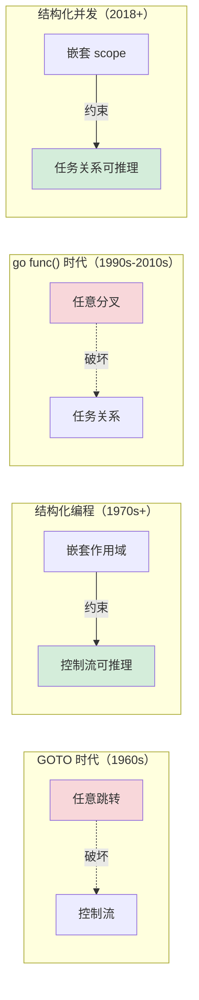
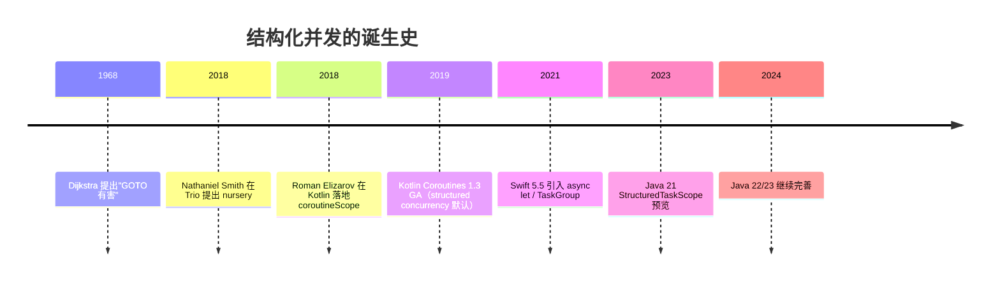
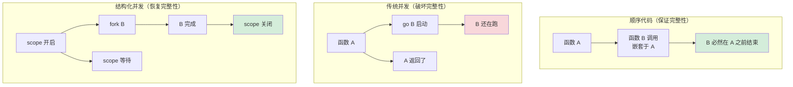
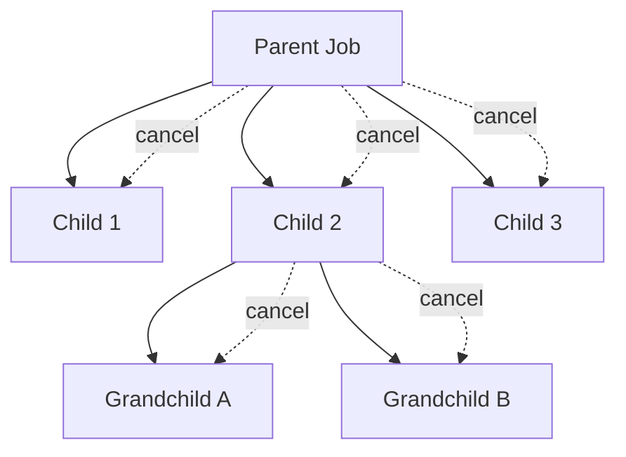
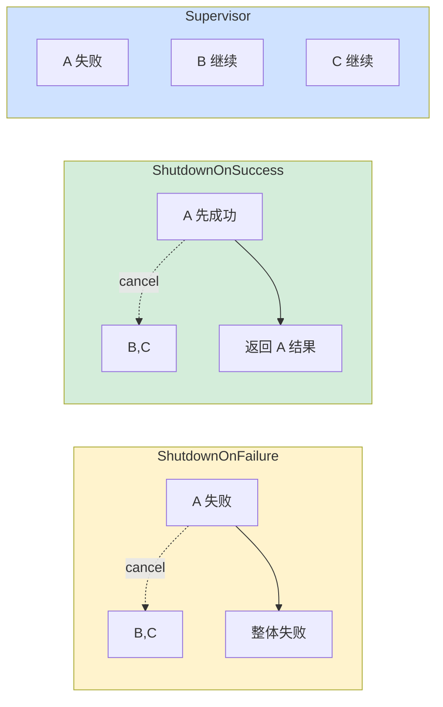
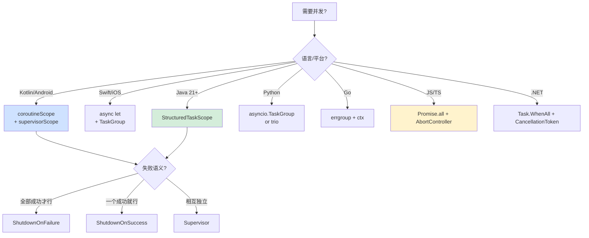

# 3.18 结构化并发设计思想

> 📍 **本篇位置**：第 3 卷 · 并发之道 · 第 18 篇（**并发卷压轴 · 范式革命**）
> 🎯 **核心矛盾**：**`go f()` / `new Thread().start()` / `Task.Run(...)` —— 任务可以随便开，但谁来负责它们的终止？错误？取消？传统并发是"撒出去就不管"——留下了泄漏、幽灵任务、错误吞没的三大深坑**
> 🧭 **设计灵魂**：把**并发任务的生命周期**和**词法作用域**绑定——**"函数不返回，它开出的任何子任务都不能存活"**。让并发代码回到顺序代码"大括号即生命周期"的简单性
> 🌐 **跨语言覆盖**：Kotlin coroutineScope · Swift async let / TaskGroup · Java 21 StructuredTaskScope · Python Trio nursery · C# Task.WhenAll · JS Promise.all
> 🔗 **延伸阅读**：← [3.13 协程核心设计思想](./3.13.协程核心设计思想.md) · ← [3.14 Actor 与 CSP 并发模型](./3.14.Actor与CSP并发模型.md) · ← [3.16 线程池设计核心原理](./3.16.线程池设计核心原理.md) · → [4.x 内存模型技术设计](../04.内存的真相/)

---

> 我们已经走过了线程、锁、CAS、协程、Actor、CSP、线程池——并发世界的一切技术原语。但**当我把这些原语组合起来写真实代码时，问题来了**：
>
> ```
> 我开了 5 个并发任务——其中一个失败了，其他怎么办？
> 我的函数返回了——但开出去的任务还在跑，谁负责它们？
> 用户取消了请求——所有相关任务能立刻停下来吗？
> ```
>
> 这就是 2010 年代后期**结构化并发**要解决的问题——**让"开出去的任务"必须有归宿**。本篇是并发卷的压轴，我们将看到一场和 1968 年"GOTO 十年"等量齐观的范式革命。

#### 目录介绍
- [00.真实事故引入](#00真实事故引入)
- [01.根本矛盾：并发为什么难](#01根本矛盾并发为什么难)
- [02.结构化并发的诞生：Goto十年回响](#02结构化并发的诞生goto十年回响)
- [03.设计灵魂：词法作用域 = 生命周期](#03设计灵魂词法作用域--生命周期)
- [04.跨语言实现对照](#04跨语言实现对照)
- [05.核心机制三要素](#05核心机制三要素)
- [06.Scope 的三种"人格"：合并策略](#06scope-的三种人格合并策略)
- [07.经典陷阱与生产级反模式](#07经典陷阱与生产级反模式)
- [08.一句话总结](#08一句话总结)

---

## 00.真实事故引入

### 0.1 一次幽灵任务账户错乱事故

我曾参与过一个金融账户系统的迁移。原始代码用 Java 8 的 `CompletableFuture`：

```java
public AccountSnapshot getAccountSnapshot(String userId) {
    CompletableFuture<UserInfo> userF = CompletableFuture.supplyAsync(
        () -> userService.get(userId), pool);
    
    CompletableFuture<List<Order>> ordersF = CompletableFuture.supplyAsync(
        () -> orderService.list(userId), pool);
    
    CompletableFuture<Balance> balanceF = CompletableFuture.supplyAsync(
        () -> balanceService.get(userId), pool);
    
    return CompletableFuture.allOf(userF, ordersF, balanceF)
        .thenApply(v -> new AccountSnapshot(
            userF.join(), ordersF.join(), balanceF.join()))
        .get(5, SECONDS);   // ★ 5 秒超时
}
```

**看起来很合理**——并行查 3 个下游，5 秒超时返回。**但生产环境出现了诡异现象**：

```
某用户 A 在凌晨 3:00:01 调用 getAccountSnapshot
balanceService 当时正在抖动，5 秒超时未返回
方法抛 TimeoutException → 上游收到错误响应

监控显示：3:00:08 才有日志显示 balanceService 真正返回了！
此时 A 用户的账户已经被另一个并发请求修改

这个"迟到 3 秒"的 balance 查询完成时——发生了什么？
答案：CompletableFuture 内的 supplyAsync 任务在线程池里继续跑
     就算外层超时返回，它依然要把 balanceService 跑完
     完成后试图写入一个 ThreadLocal 缓存（业务逻辑）
     此时 ThreadLocal 上下文已经被另一个请求覆盖
     → 把当前请求 B 的 balance 错误写到 A 的缓存槽
     → 用户 B 看到了用户 A 的余额！
```

**根因深度剖析**：

```
表层：CompletableFuture.get(5, SECONDS) 超时后只是不等了
中层：但内部的 supplyAsync 任务没有被取消——它在线程池里继续跑
深层：JDK 8 的 CompletableFuture.cancel(true) 默认不传播取消到 supplyAsync
最深：这是"非结构化并发"的根本缺陷——任务的生命周期和调用者解耦
```

**这就是"幽灵任务"（zombie task）**——主流程已经返回错误了，但开出去的任务还在阴间继续跑，最后用一个错乱的状态污染了系统。

**修复方案的演进**：

```java
// ❌ 第一版：只是加超时（治标不治本）
future.get(5, SECONDS);

// ⚠️ 第二版：手动 cancel
try {
    return future.get(5, SECONDS);
} catch (TimeoutException e) {
    userF.cancel(true);
    ordersF.cancel(true);
    balanceF.cancel(true);    // 但 cancel 不一定能真正中断
    throw e;
}

// ✅ 终极方案：用 Java 21 StructuredTaskScope
public AccountSnapshot getAccountSnapshot(String userId) throws Exception {
    try (var scope = new StructuredTaskScope.ShutdownOnFailure()) {
        var userF = scope.fork(() -> userService.get(userId));
        var ordersF = scope.fork(() -> orderService.list(userId));
        var balanceF = scope.fork(() -> balanceService.get(userId));
        
        scope.joinUntil(Instant.now().plusSeconds(5));   // 超时
        scope.throwIfFailed();
        
        return new AccountSnapshot(userF.get(), ordersF.get(), balanceF.get());
    }
    // ★ 离开 try-with-resources 时——所有未完成的子任务自动取消
    //   不可能有"幽灵任务"逃出这个 scope
}
```

**这就是结构化并发的承诺**——**离开作用域时，所有子任务必须已经结束（完成或被取消）**。**绝不允许"撒出去不管"**。

### 0.2 一个故意泄漏1秒的bug

另一个故事。Kotlin 早期，我同事写过：

```kotlin
fun fetchUserData(id: Int) {
    GlobalScope.launch {                  // ⚠️ 全局 scope
        val user = api.getUser(id)
        val cached = cache.get(user.id)   // 缓存读
        if (cached == null) {
            cache.put(user.id, user)      // 缓存写
        }
        log.info("loaded user: {}", user)
    }
}
```

测试通过、code review 通过、生产稳定运行 6 个月。某天 SRE 发现：

```
内存监控：每天稳定增长 100MB
GC 监控：老年代每天涨 100MB，永不回收
线程数：从 50 慢慢涨到 500
JVM 重启周期：从原来的"一年一次"变成"一周一次"
```

**根因**：

```
某个调用 fetchUserData 的代码路径出错
GlobalScope.launch 返回的 Job 被丢弃
启动的协程没人管 → 一直跑到完成 → 完成的协程对象无法回收
→ 协程内的 closure 持有 caller 上下文
→ 每次错误都泄漏一个对象图（包括日志框架的 MDC、TraceContext、用户 token）
→ 一年下来累积几十万个泄漏对象
```

**Kotlin 官方对 `GlobalScope` 的态度**——`@DelicateCoroutinesApi` 注解 + 在 IDE 里弹警告：

```kotlin
@DelicateCoroutinesApi
public object GlobalScope : CoroutineScope {
    /**
     * Application code usually should use an application-defined CoroutineScope...
     * Note that 'GlobalScope' has no parent and the launched coroutines won't 
     * inherit the cancellation, so they can leak resources.
     */
}
```

**Roman Elizarov（Kotlin 协程负责人）说**：

> 99% 的 GlobalScope.launch 都是 bug。它意味着你不知道这个协程谁负责。

### 0.3 灵魂三问

这两个事故让我反复追问：

1. **为什么过去 30 年（1990-2020）我们一直在容忍"任务泄漏"和"幽灵任务"？这难道不是显而易见的 bug 模式吗？** —— 为什么直到 2018 年才有人提出"结构化并发"的概念？
2. **`Promise.all([a, b, c])` 看起来已经解决了"等待多个任务"的问题，为什么 Kotlin / Swift / Java 还要发明 `coroutineScope` / `TaskGroup` / `StructuredTaskScope`？** —— 它们到底比 Promise.all 多了什么？
3. **Nathaniel Smith 写过一篇博客，说"`go f()` 和 `goto` 一样有害"——这听起来很激进，是真的吗？** —— 这个类比合理吗？

### 0.4 五个层层递进的追问

要把结构化并发讲透，需要递进回答：

1. **什么是"任务的归宿"？** —— 任务必须有明确的开始、明确的终止、明确的负责人
2. **作用域是什么？** —— 把生命周期和词法作用域绑定的物理意义
3. **取消怎么传播？** —— 父 scope 取消时，所有子任务怎么知道
4. **异常怎么聚合？** —— 多个任务同时失败怎么办
5. **怎么和老代码兼容？** —— 现有的回调、Future、CompletableFuture 怎么改造

### 0.5 探索路径


### 0.6 为什么这个问题值得讲透

我想抛三个问题：

1. **为什么 Java 21 的 StructuredTaskScope 是"虚拟线程"功能的"另一半"？** —— 因为虚拟线程让"开千万任务"成为可能，但不解决"管理这些任务"的问题。结构化并发是任务"管理学"。
2. **为什么 Go 选择了 `context.Context` 而不是 scope？这是设计倒退吗？** —— 不是。Go 走了"显式传递"的路线，理念不同但目标相同。
3. **结构化并发会不会"杀死"高级并发用法（如 actor、流处理）？** —— 不会。它是"基础语法"层面的约束，actor 仍然可以构建在 scope 之上。

读完本章你会懂：**结构化并发是 21 世纪并发设计最重要的范式革命——它把"并发"从一个"陷阱密布的高危领域"，变成了"所有程序员都能写对的常规事务"**。

---

## 01.根本矛盾：并发为什么难

### 1.1 顺序代码vs并发代码根本差异

回看一段最简单的顺序代码：

```kotlin
fun work() {
    val a = stepA()     // 跑完
    val b = stepB()     // 跑完
    val c = combine(a, b)
    // 函数返回时——三个 step 都已经结束
}
```

**这段代码的"完整性保证"是绝对的**：

```
1. stepA 必然结束（要么成功要么抛异常）
2. stepA 结束才执行 stepB
3. stepB 结束才执行 combine
4. work 返回时，所有局部变量、所有副作用都已确定
```

**这就是"大括号即生命周期"原则**——所有东西都被函数的 `{}` 包裹，离开 `{}` 时一切清理完毕。

**但传统并发代码完全打破了这个保证**：

```kotlin
fun work() {
    GlobalScope.launch { stepA() }       // 飞出去了
    GlobalScope.launch { stepB() }       // 飞出去了
    val c = combine(?, ?)                // 但 a 和 b 在哪？
    // 函数返回时——stepA 和 stepB 状态未知！
}
```

**问题清单**：

```
1. stepA 何时结束？不知道
2. stepA 抛异常了吗？不知道（异常被吞）
3. work 返回后 stepA 还在跑吗？很可能
4. 调用 work 的人怎么"等"它真正完成？没有办法
```

**这就是并发代码的根本困境**——**作用域和生命周期的脱钩**。

### 1.2 三大深坑

非结构化并发会产生三类经典 Bug：

#### 深坑 1：任务泄漏

```kotlin
class MyService {
    fun start() {
        GlobalScope.launch { processForever() }
        // 谁来停止这个协程？
    }
}
```

**症状**：内存稳定增长、线程数稳定增长——直到 OOM 或线程数爆。

**经典案例**：§0.2 那个 100MB/天的泄漏。

#### 深坑 2：幽灵任务

```java
CompletableFuture<X> f = CompletableFuture.supplyAsync(() -> longTask());
try {
    return f.get(5, SECONDS);
} catch (TimeoutException e) {
    return defaultValue;   // 主流程 5 秒后返回了
    // 但 longTask() 还在线程池里跑——花 30 秒才结束
    // 它的副作用最后写入了系统的某个状态——但请求已经按"超时"返回
}
```

**症状**：用户看到了一个"已经超时"的请求，但系统内部状态被这个请求的"幽灵副作用"污染。

**经典案例**：§0.1 那个银行余额错乱。

#### 深坑 3：异常吞没

```javascript
function processAll(items) {
    items.forEach(item => {
        processAsync(item);   // 这是个 async 函数
        // 异常去哪了？
    });
}
```

**症状**：某个 processAsync 抛异常 → 静默失败 → 业务数据不一致 → 几天后才被发现。

**经典案例**：每个 Node.js 项目都遇到过的"未处理的 Promise rejection"。

### 1.3 错误处理的灾难

传统并发还有一个特别恶心的问题——**错误处理无法组合**：

```javascript
// Promise 风格
async function doMany() {
    const a = fetchA();
    const b = fetchB();   // 如果 a fail，b 也会启动且无法取消
    const c = fetchC();   // 同上
    
    try {
        return [await a, await b, await c];
    } catch (e) {
        // 谁失败了？b 和 c 现在状态如何？
        throw e;
    }
}
```

**问题**：

```
1. 三个任务都启动了，无论是否需要
2. 一个失败时其他还在跑
3. catch 不知道哪个失败、其他状态
4. 没办法"全部取消"
```

**Promise.all 部分缓解了这个问题**——它能"全部失败一起报"。但它仍然**不能取消其他任务**——这就是 §0.3 第二题的答案。

---

## 02.结构化并发的诞生：Goto十年回响

### 2.1 1968 年的"Goto 大辩论"

要理解结构化并发的重要性，必须先回看 1968 年的"GOTO 论战"。

那年 Edsger Dijkstra 给 Communications of the ACM 投了一封短信，标题是：

> ***Go To Statement Considered Harmful*** (《GOTO 语句被认为有害》)

他的核心论点：

```
GOTO 让程序员可以从任何地方跳到任何地方
→ 程序的"控制流"不再有结构
→ 阅读时无法推理"我是怎么走到这一步的"
→ 维护噩梦
```

**Dijkstra 的解药**：**结构化编程**。

```
所有控制流必须由三种基础结构组合而成：
  1. 顺序：a; b; c;
  2. 选择：if (cond) ... else ...
  3. 循环：while (cond) ...

不允许跳出任意位置——所有控制流必须"嵌套"
→ 程序结构 ≈ 函数调用栈
→ 阅读代码就能理解控制流
```

**这场论战持续了 10 年（1968-1978）——最终结构化编程获胜**。今天 99% 的语言都禁止或严格限制 GOTO。

### 2.2 2018年Nathaniel Smith重磅炸弹

50 年后的 2018 年 4 月，Python Trio 库的作者 Nathaniel Smith 写了一篇博客：

> ***Notes on structured concurrency, or: Go statement considered harmful***

**这是和 1968 年那篇论文等量的"宣言"**。Smith 直接借用了 Dijkstra 的标题，把 `go f()` 和 GOTO 类比：

```
GOTO 让控制流可以"跳到任何地方"
go f() 让控制流可以"分叉到任何地方"

GOTO 破坏了"控制流嵌套"
go f() 破坏了"任务嵌套"

GOTO 让单线程程序难以推理
go f() 让并发程序难以推理

所以 go f() 应该被认为有害——和 GOTO 一样
```

**这就是 §0.3 第三题的答案**——这个类比是真的、合理的、且从此改变了并发设计。

### 2.3 结构化并发的"反向革命"



**两次革命的目标完全一致——把"自由"换成"可推理"**：

```
GOTO → 结构化编程：失去"任意跳转的自由"，换来"读懂控制流的能力"
go f() → 结构化并发：失去"任意分叉的自由"，换来"读懂任务关系的能力"
```

### 2.4 演进时间线



**这是一个"理论 → 实践 → 标准化"的快速过程**——从 Smith 提出到 Java 落地只用了 5 年。

---

## 03.设计灵魂：词法作用域 = 生命周期

### 3.1 一行定义

> **结构化并发：并发任务的生命周期严格嵌套于词法作用域。**

```kotlin
suspend fun work() = coroutineScope {        // ← 进入 scope
    launch { stepA() }
    launch { stepB() }
    launch { stepC() }
}                                             // ← 离开 scope
//      ★ 这一刻，三个子任务必然全部结束
//        要么成功完成、要么因异常退出、要么被取消
```

**这一行的精华**：

```
进入 {} 时：scope 开启
{} 内部：可以 launch 任意多协程
离开 {} 时：必然等待所有协程结束
任何子协程抛异常 → 自动取消其他协程，整个 {} 失败
```

### 3.2 三条不可违反的铁律

**铁律 1：父任务必须等待所有子任务**

```kotlin
suspend fun parent() = coroutineScope {
    launch { delay(1000) }    // 子任务 1
    launch { delay(2000) }    // 子任务 2
    // parent 至少等 2 秒才返回
}
```

**铁律 2：任意子任务异常 → 取消所有兄弟**

```kotlin
suspend fun parent() = coroutineScope {
    launch { delay(1000); throw IOException() }   // 1 秒后失败
    launch { delay(5000) }                         // 立刻被取消
    // parent 在 1 秒后抛 IOException
}
```

**铁律 3：父任务取消 → 取消所有子任务**

```kotlin
val job = coroutineScope.launch {
    launch { delay(10000); println("a") }    // 不会打印
    launch { delay(10000); println("b") }    // 不会打印
}
delay(100)
job.cancel()   // 父任务取消 → 所有子任务被取消
```

**这三条铁律共同保证**：**离开 {} 时，世界回到了"调用前"的状态**——和顺序代码一样。

### 3.3 顺序代码vs并发代码完美对照

| 维度 | 顺序代码 | 结构化并发 |
|---|---|---|
| **作用域** | 函数 / 块 `{}` | scope `{}` |
| **生命周期** | 离开 `{}` 时栈帧销毁 | 离开 `{}` 时所有任务结束 |
| **异常传播** | 沿调用栈往上 | 沿 scope 树往上 |
| **取消** | return / throw | cancel scope |
| **资源清理** | finally / RAII | scope 自动取消 |

**关键洞察**：**顺序代码的所有"完整性保证"，结构化并发都恢复了**。

### 3.4 为什么这个设计如此强大



**结构化并发的本质——把"并发"变成"顺序代码的并行版本"**：

```
顺序：[A, B, C] 一个一个跑
并行：[A, B, C] 同时跑

但"开始"和"结束"的语义和顺序代码一样：
  开始：进入 scope
  结束：离开 scope
```

---

## 04.跨语言实现对照

### 4.1 Kotlin：coroutineScope标杆实现

Kotlin 是结构化并发的"原教旨主义"实现：

```kotlin
suspend fun loadAll(): Triple<User, List<Order>, Balance> = coroutineScope {
    val userDef = async { userService.get() }
    val ordersDef = async { orderService.list() }
    val balanceDef = async { balanceService.get() }
    
    Triple(userDef.await(), ordersDef.await(), balanceDef.await())
}
// 离开 coroutineScope 时——三个任务必然完成或被取消
```

**Kotlin 的设计精华**：

```
1. 所有 launch / async 必须在 CoroutineScope 内
2. 没有显式 scope 的就用 GlobalScope（标记 @DelicateCoroutinesApi 警告）
3. coroutineScope { } 是 suspend 函数——会等所有子任务
4. 子任务异常默认取消整个 scope（cancellation propagation）
```

**SupervisorScope 的特殊场景**：

```kotlin
suspend fun loadDashboard() = supervisorScope {
    val userDef = async { userService.get() }       // 失败也不影响
    val newsDef = async { newsService.list() }      // 失败也不影响
    val statsDef = async { statsService.get() }     // 失败也不影响
    
    Dashboard(
        user = runCatching { userDef.await() }.getOrNull(),
        news = runCatching { newsDef.await() }.getOrEmpty(),
        stats = runCatching { statsDef.await() }.getOrNull()
    )
}
```

**`supervisorScope` 的语义**：**子任务失败不传播给兄弟**——适合"独立并发任务，部分失败可接受"的场景。

### 4.2 Swift：async let与TaskGroup

Swift 5.5（2021）引入了两种结构化并发原语：

**async let**（声明式）：

```swift
func loadAll() async throws -> (User, [Order], Balance) {
    async let user = userService.get()         // 立即启动
    async let orders = orderService.list()
    async let balance = balanceService.get()
    
    return try await (user, orders, balance)   // 等待所有
}
```

**TaskGroup**（命令式，动态任务数）：

```swift
func processItems(items: [Item]) async throws -> [Result] {
    try await withThrowingTaskGroup(of: Result.self) { group in
        for item in items {
            group.addTask { try await process(item) }
        }
        
        var results: [Result] = []
        for try await result in group {
            results.append(result)
        }
        return results
    }
}
```

**Swift 的特色**：

```
async let：编译期已知任务数（≤ 几个固定任务）
TaskGroup：动态创建任意多任务

两者都遵守严格的结构化语义——离开作用域时所有任务结束
```

### 4.3 Java 21：StructuredTaskScope预览

Java 21 在虚拟线程之上引入了 StructuredTaskScope：

```java
public AccountSnapshot loadSnapshot(String userId) throws Exception {
    try (var scope = new StructuredTaskScope.ShutdownOnFailure()) {
        Subtask<User> userF = scope.fork(() -> userService.get(userId));
        Subtask<List<Order>> ordersF = scope.fork(() -> orderService.list(userId));
        Subtask<Balance> balanceF = scope.fork(() -> balanceService.get(userId));
        
        scope.join();              // 等所有
        scope.throwIfFailed();     // 任意失败抛出
        
        return new AccountSnapshot(userF.get(), ordersF.get(), balanceF.get());
    }
    // try-with-resources 关闭时——所有未完成任务被取消
}
```

**Java 的特殊设计**：

```
1. 用 try-with-resources 表达 scope 边界
2. fork 返回 Subtask（不是 Future——避免和老 API 混淆）
3. ShutdownOnFailure / ShutdownOnSuccess 是"策略"
4. 完美和 Virtual Thread 配合
```

**§0.6 第一题的答案**——Virtual Thread 让"开千万任务"成为可能，StructuredTaskScope 让"管理千万任务"成为可能。**两者是 Project Loom 的"并发现代化"两半**。

### 4.4 Python Trio：始祖（2018）

Trio 是 Smith 自己写的库，是结构化并发的"概念发源地"：

```python
async def loadAll():
    async with trio.open_nursery() as nursery:
        nursery.start_soon(stepA)
        nursery.start_soon(stepB)
        nursery.start_soon(stepC)
    # 离开 nursery 时——三个 step 必然结束
```

**Trio 的术语 "nursery"（育儿所）**——比喻得很形象：**任务是"婴儿"，nursery 是"育儿所"，妈妈不能在婴儿还在育儿所时离开**。

**asyncio 的对应物**（Python 3.11+）：

```python
async def loadAll():
    async with asyncio.TaskGroup() as tg:
        tg.create_task(stepA())
        tg.create_task(stepB())
        tg.create_task(stepC())
```

**asyncio 直到 3.11 才补上 TaskGroup**——比 Trio 晚了 4 年。这反映了 Python 标准库的保守演化。

### 4.5 半结构化：Promise.all与Task.WhenAll

JavaScript 的 `Promise.all`：

```javascript
async function loadAll() {
    const [user, orders, balance] = await Promise.all([
        userService.get(),
        orderService.list(),
        balanceService.get()
    ]);
    return { user, orders, balance };
}
```

C# 的 `Task.WhenAll`：

```csharp
public async Task<Snapshot> LoadAll() {
    var userTask = userService.GetAsync();
    var ordersTask = orderService.ListAsync();
    var balanceTask = balanceService.GetAsync();
    
    await Task.WhenAll(userTask, ordersTask, balanceTask);
    return new Snapshot(userTask.Result, ordersTask.Result, balanceTask.Result);
}
```

**这两者是"半结构化"——有等待合并，但缺少：**

```
1. 异常时不能自动取消其他任务
2. 没有"父-子"层级
3. 不能向下传播取消
```

**这就是 §0.3 第二题的答案**——`Promise.all` 解决了"等待合并"，但没解决"取消传播"和"异常聚合"。结构化并发是更完整的方案。

### 4.6 Go：context.Context另一条路

Go 没有引入 scope 概念——它走的是 `context.Context` 路线：

```go
func loadAll(ctx context.Context, userId string) (*Snapshot, error) {
    ctx, cancel := context.WithTimeout(ctx, 5*time.Second)
    defer cancel()
    
    g, gctx := errgroup.WithContext(ctx)
    
    var user *User
    var orders []Order
    var balance *Balance
    
    g.Go(func() error {
        u, err := userService.Get(gctx, userId)
        user = u
        return err
    })
    g.Go(func() error {
        o, err := orderService.List(gctx, userId)
        orders = o
        return err
    })
    g.Go(func() error {
        b, err := balanceService.Get(gctx, userId)
        balance = b
        return err
    })
    
    if err := g.Wait(); err != nil {
        return nil, err
    }
    return &Snapshot{user, orders, balance}, nil
}
```

**Go 的设计哲学**：**显式优于隐式**——

```
取消：显式传 ctx，被调函数主动检查 ctx.Done()
等待：errgroup.Wait
异常：errgroup 把第一个错误返回，自动 cancel ctx

没有"scope 树"的隐式概念——所有关系都通过 ctx 显式传递
```

**§0.6 第二题的答案**：Go 不是"设计倒退"——它选择了**显式 + 库实现**而不是**语言原生 scope**。两者都能达成结构化并发的目标，只是哲学不同：

```
Kotlin/Swift/Java：语言层支持 scope（隐式）
Go：库层支持 context（显式）
```

---

## 05.核心机制三要素

实现结构化并发，必须解决三件事——**等待合并、取消传播、异常聚合**。

### 5.1 等待合并

**问题**：scope 怎么知道"所有子任务都结束了"？

```kotlin
suspend fun work() = coroutineScope {
    launch { ... }     // 子任务 1
    launch { ... }     // 子任务 2
    launch { ... }     // 子任务 3
    // 这里隐式 join——等所有子协程结束
}
```

**实现**：每次 `launch` 时，子协程的 Job 被加入 parent Job 的 children 列表。`coroutineScope` 退出时遍历 children 并 `join()` 每一个。

**对比 `Promise.all`**：

```javascript
await Promise.all([p1, p2, p3]);   // 显式合并，要传数组
```

```kotlin
coroutineScope {
    launch { ... }    // 隐式加入 children
    launch { ... }
    launch { ... }
}                     // 隐式合并所有 children
```

**Kotlin 的"隐式"更优雅**——你不需要把所有任务收集到一个列表里再传递。

### 5.2 取消传播

**问题**：父任务取消时，子任务怎么"跟着死"？



**实现**：取消是"自顶向下"传播的——

```
parent.cancel() 
  → 设置 parent.state = Cancelling
  → 遍历所有 children，对每一个调 cancel()
  → 递归往下
  → 每个子协程在下一个挂起点检查 isActive，如果 false 就抛 CancellationException
```

**关键设计**：**取消不是"立即杀死"，是"礼貌请求停止"**——子协程在挂起点（await）才会响应：

```kotlin
launch {
    while (true) {
        val item = queue.receive()    // 这里是挂起点 → 取消时会抛异常
        process(item)
    }
}
```

**反例**——CPU 密集任务无挂起点会"忽略取消"：

```kotlin
launch {
    var result = 0
    for (i in 1..1_000_000_000) {
        result += i * i              // 没有挂起点 → 永远不响应取消
    }
}
```

**修复**：定期插入挂起检查：

```kotlin
launch {
    var result = 0
    for (i in 1..1_000_000_000) {
        if (i % 10000 == 0) yield()   // 显式让出，检查取消
        result += i * i
    }
}
```

### 5.3 异常聚合

**问题**：3 个任务并行，2 个抛异常——怎么报？

```kotlin
coroutineScope {
    launch { delay(100); throw IOException("net") }
    launch { delay(200); throw IllegalStateException("state") }
    launch { delay(300); println("ok") }   // 永远不会打印
}
```

**Kotlin 的处理**：

```
第一个 IOException 抛出 → coroutineScope 立即开始取消其他兄弟
其他兄弟被取消时抛 CancellationException
最终 coroutineScope 抛 IOException（第一个原因）
其他异常被 addSuppressed 到主异常上
```

**Java 21 的处理**：

```java
try (var scope = new StructuredTaskScope.ShutdownOnFailure()) {
    var t1 = scope.fork(() -> { throw new IOException(); });
    var t2 = scope.fork(() -> { ... });
    
    scope.join();
    scope.throwIfFailed();   // 抛第一个异常
}
```

**JavaScript 的 Promise.all**：

```javascript
Promise.all([
    Promise.reject('a'),
    Promise.reject('b')
]).catch(e => console.log(e));   // 只看到 'a'，'b' 被丢失
```

**JS 的 `Promise.allSettled`**：

```javascript
const results = await Promise.allSettled([p1, p2, p3]);
// results = [
//   { status: 'rejected', reason: 'a' },
//   { status: 'rejected', reason: 'b' },
//   { status: 'fulfilled', value: 'ok' }
// ]
```

**`allSettled` 是"半结构化"的妥协**——保留所有结果但不取消其他任务。

---

## 06.Scope的三种人格：合并策略

不同业务场景需要不同的"任务关系"。Java 21 的 StructuredTaskScope 提供了三种策略。

### 6.1 ShutdownOnFailure：全员皆输

**语义**：任何一个失败 → 取消其他 → 整体失败。

```java
try (var scope = new StructuredTaskScope.ShutdownOnFailure()) {
    var userF = scope.fork(() -> userService.get());
    var orderF = scope.fork(() -> orderService.list());
    var balanceF = scope.fork(() -> balanceService.get());
    
    scope.join();
    scope.throwIfFailed();   // ★ 任意失败就抛
    
    return new Snapshot(userF.get(), orderF.get(), balanceF.get());
}
```

**适用场景**：**所有结果都必须有**才能继续。

```
用户登录 → 同时查 用户信息 + 权限 + 配置
任意一个失败 → 登录失败 → 取消其他查询
```

### 6.2 ShutdownOnSuccess：一胜即返

**语义**：任何一个成功 → 立即返回 → 取消其他。

```java
try (var scope = new StructuredTaskScope.ShutdownOnSuccess<String>()) {
    scope.fork(() -> primaryService.get());
    scope.fork(() -> backupService1.get());
    scope.fork(() -> backupService2.get());
    
    scope.join();
    return scope.result();   // ★ 第一个成功的
}
```

**适用场景**：**冗余请求**——多个数据源同时查，要最快的那个。

```
DNS 解析：同时查 8.8.8.8 / 1.1.1.1 / 114.114.114.114，谁先返回用谁
缓存：同时查 Redis 和 Memcached，谁有就用谁
```

### 6.3 Supervisor：各自独立（Kotlin）

**语义**：子任务失败不影响兄弟。

```kotlin
supervisorScope {
    launch { try { task1() } catch (e: Exception) { ... } }
    launch { try { task2() } catch (e: Exception) { ... } }
    launch { try { task3() } catch (e: Exception) { ... } }
}
// 三个任务独立运行，互不影响
```

**适用场景**：**互相独立的任务**，部分失败可接受。

```
首页加载：用户信息 + 推荐列表 + 广告
推荐失败 → 显示"暂无推荐" + 仍然显示其他内容
```

### 6.4 三种策略对照



| 策略 | 失败处理 | 成功处理 | 典型场景 |
|---|---|---|---|
| ShutdownOnFailure | 取消所有 | 等待所有 | 必须全部成功 |
| ShutdownOnSuccess | 等待至少 1 个 | 立即取消其他 | 冗余请求 |
| Supervisor | 不影响兄弟 | 等待所有 | 独立任务集合 |

---

## 07.经典陷阱与生产级反模式

### 7.1 陷阱一：GlobalScope启动协程

§0.2 那个泄漏。

```kotlin
// ❌ 永不结束的孤儿
GlobalScope.launch { processForever() }

// ✅ 绑定到组件生命周期
class MyService {
    private val scope = CoroutineScope(SupervisorJob() + Dispatchers.Default)
    
    fun start() {
        scope.launch { processForever() }
    }
    
    fun stop() {
        scope.cancel()   // 取消所有协程
    }
}
```

**Android 上有专用 scope**：

```kotlin
class MyActivity : AppCompatActivity() {
    override fun onResume() {
        lifecycleScope.launch { ... }   // Activity 销毁时自动取消
    }
}
```

### 7.2 陷阱二：launch当fire-and-forget

```kotlin
// ❌ 异常被吞
scope.launch { throw RuntimeException("oops") }

// ✅ 用 async 或加 handler
scope.launch(CoroutineExceptionHandler { _, e -> log.error("...", e) }) { ... }
// 或
val deferred = scope.async { ... }
deferred.await()   // 异常会在这里抛
```

### 7.3 陷阱三：CPU密集任务忽略取消

```kotlin
// ❌ 不响应取消
launch {
    for (i in 1..1_000_000_000) compute(i)
}

// ✅ 定期 yield
launch {
    for (i in 1..1_000_000_000) {
        if (i % 10000 == 0) yield()
        compute(i)
    }
}

// 或检查 isActive
launch {
    for (i in 1..1_000_000_000) {
        if (!isActive) break
        compute(i)
    }
}
```

### 7.4 陷阱四：runBlocking在suspend里

```kotlin
// ❌ runBlocking 阻塞当前线程
suspend fun bad() {
    val result = runBlocking { fetchAsync() }   // 反模式！
}

// ✅ 直接 await
suspend fun good() {
    val result = fetchAsync()
}
```

`runBlocking` 是"协程世界"和"非协程世界"的桥梁——只能在 main 函数或测试里用，**绝对不能在 suspend 函数里用**。

### 7.5 陷阱五：忘记结构化导致泄露

```kotlin
// ❌ Channel 永远不关闭
fun bad(): Flow<Item> = flow {
    val ch = Channel<Item>()
    launch { producer(ch) }
    for (item in ch) emit(item)
}

// ✅ 用 channelFlow（结构化版本）
fun good(): Flow<Item> = channelFlow {
    launch { producer(this) }   // launch 在 channelFlow 的 scope 内
}
// 离开 channelFlow 时自动取消所有子协程，关闭 channel
```

### 7.6 陷阱六：异常处理时序

```kotlin
// ❌ 错误的异常处理位置
suspend fun bad() = coroutineScope {
    try {
        launch { throw IOException() }
    } catch (e: IOException) {
        // 永远不会到这里！
        // 因为 launch 异步抛异常，try 已经退出了
    }
}

// ✅ 异常发生在 coroutineScope 内
suspend fun good() {
    try {
        coroutineScope {
            launch { throw IOException() }
        }
    } catch (e: IOException) {
        // ✅ 这里能 catch
    }
}
```

**铁律**：**try 必须包住整个 scope，不能只包 launch**。

### 7.7 陷阱七：跨 scope 的依赖

```kotlin
// ❌ 依赖外部 scope 的协程
class Service {
    private val externalScope = CoroutineScope(...)
    
    suspend fun work() = coroutineScope {
        val ref = externalScope.async { fetch() }   // ⚠️ 跨 scope 引用
        ref.await()
    }
}
// work 返回时，externalScope 中的任务可能还在跑
// 取消 work 时，externalScope 中的任务不会被取消
```

**修复**：要么在当前 scope 内启动，要么明确文档说明跨 scope 引用。

---

## 08.一句话总结

### 8.1 三层认知阶梯

```
第一层（知其然）：会用 coroutineScope / TaskGroup / StructuredTaskScope
  ↓
第二层（知其所以然）：理解作用域 = 生命周期、取消传播、异常聚合
  ↓
第三层（知其将所以然）：能根据业务设计 scope 层次，能避开 7 大陷阱，能在跨语言项目落地
```

读完本章后，你应该能回答开头§0.3 提出的三个问题：

1. **为什么 30 年才提出？** → 因为只有当协程让"开万级任务"成为常态后，"管理任务"才成为关键问题。线程时代任务很少，泄漏不严重；协程时代任务太多，必须管理。
2. **Promise.all 不够好在哪？** → 它解决了"等待合并"，但没解决"取消传播"和"父子关系"。一个失败时其他还在跑，无法中止。
3. **`go f()` 像 GOTO 吗？** → 是的。GOTO 破坏控制流嵌套，`go f()` 破坏任务嵌套。两者都让程序"无法推理"。结构化并发是 50 年后再次拨乱反正。

### 8.2 选型决策树



### 8.3 七字真言

1. **scope = 生命周期**——所有任务必须有归宿。
2. **不要 GlobalScope**——99% 是 bug。
3. **取消是协作的**——CPU 密集要主动 yield。
4. **异常会聚合**——第一个失败取消其他。
5. **try 包住 scope**——不要只包 launch。
6. **三种人格分清楚**——AllOrNothing / FirstWin / Independent。
7. **不跨 scope 引用**——破坏结构化保证。

### 8.4 第 3 卷的收束

至此**第 3 卷"并发之道"全部 18 篇结束**。我们走过了：

- **起源篇（3.1-3.5）**：从硬件中断到线程的诞生
- **矛盾篇（3.6-3.10）**：可见性 / 原子性 / 有序性、锁、CAS
- **范式篇（3.11-3.14）**：异步、单线程、协程、Actor/CSP
- **池化与结构化篇（3.15-3.18）**：线程池、结构化并发

**贯穿这 18 篇的核心主题**——**人类如何与"并发"这头野兽搏斗**：

```
第一回合：硬件给了我们多核 → 我们发明线程
第二回合：线程不够轻 → 我们发明协程
第三回合：协程难协作 → 我们发明消息传递（Actor/CSP）
第四回合：任务难管理 → 我们发明结构化并发

胜负？50 年的搏斗后，我们逐渐找到了"既能用并发，又能写对"的方法
```

**结构化并发是这场搏斗的最新成果**——它是把"自由开任务"的混乱，转化为"嵌套任务"的有序。**这是 21 世纪并发设计最重要的思想突破**。

下一卷 [第 4 卷 内存的真相](../04.内存的真相/) 我们将进入并发问题的"地基层"——**内存模型**。所有锁、CAS、volatile 的正确性最终都奠基于此。

---

## 🔗 延伸阅读

- 同卷上篇：[3.13 协程核心设计思想](./3.13.协程核心设计思想.md) ｜ [3.14 Actor 与 CSP 并发模型](./3.14.Actor与CSP并发模型.md) ｜ [3.16 线程池设计核心原理](./3.16.线程池设计核心原理.md)
- 下卷开篇：[4.x 内存模型技术设计](../04.内存的真相/)
- 经典文献：
  - *Notes on Structured Concurrency, or: Go Statement Considered Harmful*（Nathaniel Smith, 2018）— 奠基论文
  - *Go Statement Considered Harmful*（Edsger Dijkstra, 1968）— 半世纪前的"原作"
  - *Structured Concurrency*（JEP 462, Java 21）
  - *Kotlin Coroutines: Structured Concurrency*（Roman Elizarov 演讲）
  - *Swift Evolution: Structured Concurrency*（SE-0304）
  - *Trio: A Friendly Python Library for Async Concurrency*（trio 文档）
