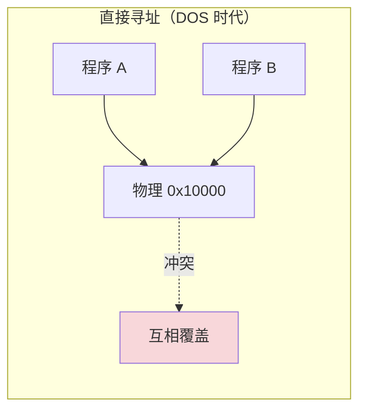
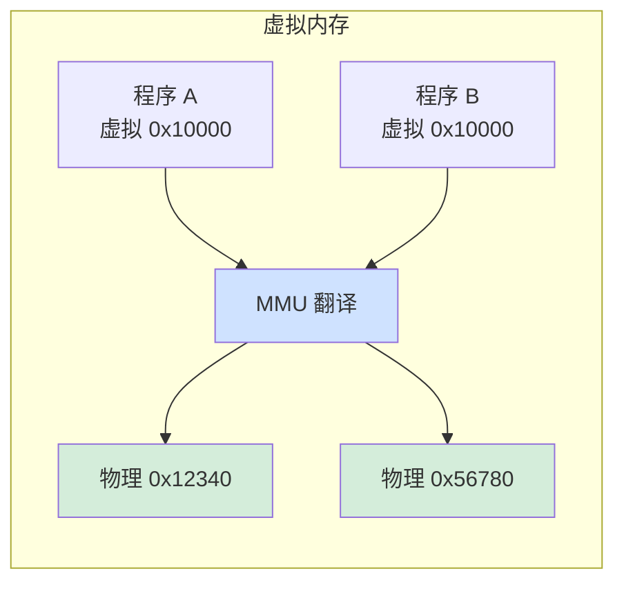
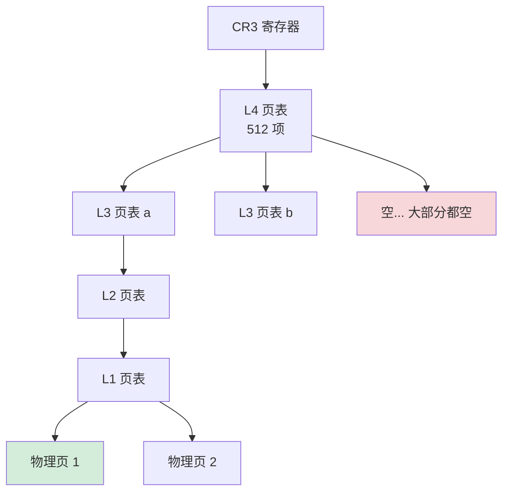
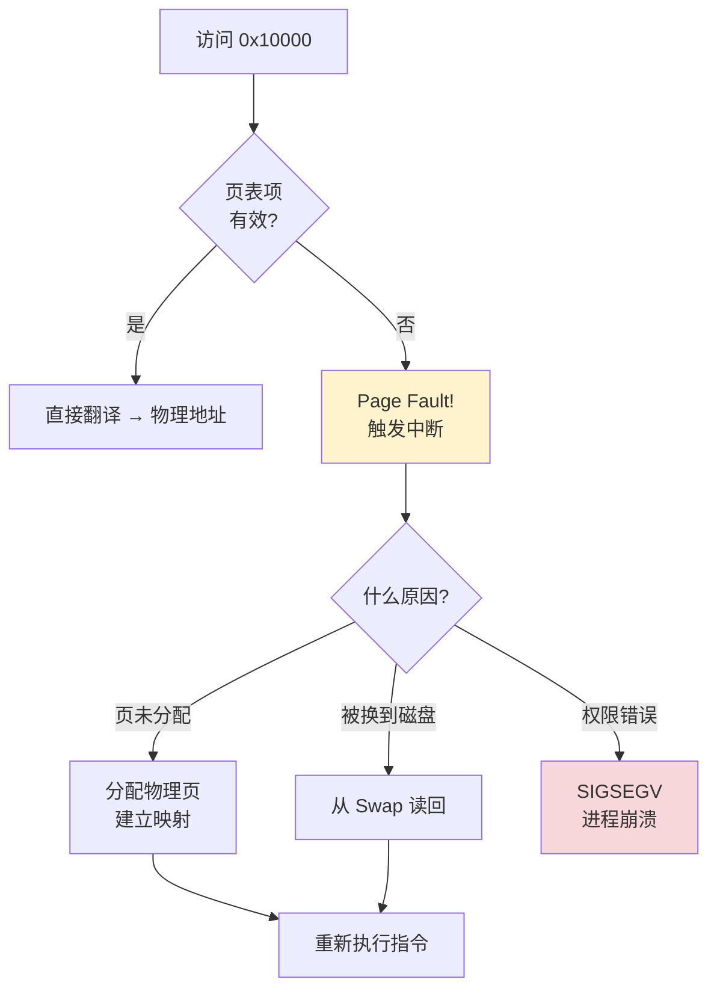
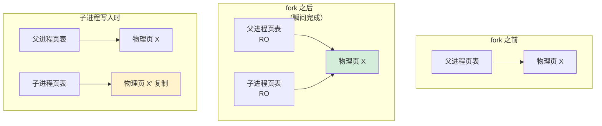
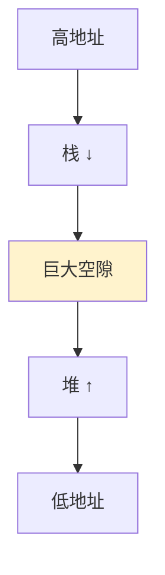
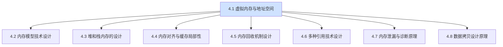

# 4.1 虚拟内存与地址空间

> 📍 **本篇位置**：第 4 卷 · 内存的真相 · 第 1 篇（**全卷开篇**）
> 🎯 **核心矛盾**：**两个进程都打印出 `0x7ffeefbff5a8`，但里面装的内容毫不相干——物理内存只有一份，地址凭什么能"重复"？这不是 bug，这是一个被现代操作系统"骗"了 50 年的设计**
> 🧭 **设计灵魂**：在程序员看到的"地址"和真实的物理内存之间**插入一层翻译**——这层翻译撑起了进程隔离、内存共享、写时复制、按需分页、内存映射文件、ASLR 安全防御。**间接性是计算机科学万灵药这句格言的最强例证**
> 🌐 **跨平台覆盖**：x86_64 四级页表 · ARM64 翻译表 · Linux mmap · macOS Mach VM · Windows VirtualAlloc · JVM 直接内存 · Go runtime
> 🔗 **延伸阅读**：← [3.18 结构化并发设计思想](../03.并发的设计/3.18.结构化并发设计思想.md) · → [4.2 内存模型技术设计](./4.2.内存模型技术设计.md) · → [4.3 堆和栈内存的设计](./4.3.堆和栈内存的设计.md) · → [4.4 内存对齐与缓存局部性](./4.4.内存对齐与缓存局部性.md)

---

> 第 3 卷我们用 18 篇拆解了"并发"——CPU 多核同时跑代码引发的所有矛盾。但有一个更基础的问题被我们悬置了：**这些线程读写的"内存"，到底是什么？**
>
> 这一卷我们要钻入"内存的真相"——而所有真相的起点就是这一篇：**虚拟内存**。当你写下 `int *p = malloc(1024)` 拿到的那个地址，**它根本不是真实的物理地址**。这个看似简单的"间接性"，是过去 50 年操作系统设计中**最重要的一项发明**——重要程度不亚于"进程"或"文件"。

#### 目录介绍
- [00.真实事故引入](#00真实事故引入)
- [01.虚拟内存诞生：三大根本矛盾](#01虚拟内存诞生三大根本矛盾)
- [02.地址翻译核心：MMU 与页表](#02地址翻译核心mmu-与页表)
- [03.虚拟内存赋予的"超能力"](#03虚拟内存赋予的超能力)
- [04.进程地址空间的"骨架"](#04进程地址空间的骨架)
- [05.Swap 与 OOM Killer 的恩怨](#05swap-与-oom-killer-的恩怨)
- [06.跨平台实现对照](#06跨平台实现对照)
- [07.经典陷阱与生产级反模式](#07经典陷阱与生产级反模式)
- [08.一句话总结](#08一句话总结)

---

## 00.真实事故引入

### 0.1 凌晨4点：进程地址重复难排查

我曾在金融交易系统接过一个排查任务。某次新版本上线后，监控发现两个无关进程的日志里，**同一个内存地址反复出现**：

```
2024-XX-XX 04:00:01 [trader-A] order received at 0x7ffeefbff5a8: BUY 1000 AAPL @ 150
2024-XX-XX 04:00:01 [risk-B]   order received at 0x7ffeefbff5a8: SELL 500 GOOG @ 2800
```

新人 SRE 看到这个日志吓坏了：

```
"两个进程居然在同一个地址写不同的内容？这是不是内存越界 bug？
是不是哪里有共享内存配置错了？要不要立刻止损？"
```

我们花了 5 小时排查，最后发现——**这根本不是 bug**。两个进程用同样的库（jemalloc），同样的对象池配置，所以分配到的虚拟地址确实可能完全相同。但那是**两个进程各自独立的虚拟地址空间**——

```
trader-A 的 0x7ffeefbff5a8 → 物理地址 0x1F3A0000
risk-B   的 0x7ffeefbff5a8 → 物理地址 0x2C4F0000

物理内存只有一份，但每个进程有自己的"地址翻译表"
两个进程哪怕用同一个虚拟地址，也是访问完全不同的物理内存
```

**这位 SRE 的困惑暴露了一个普遍的认知盲区**——**99% 的程序员把"指针的值"当作"物理地址"，但事实完全不是这样**。指针的值只是一个"虚拟编号"——必须经过一层硬件翻译才知道真正的物理位置。

### 0.2 malloc(10GB)成功但仅有4GB

更诡异的场景。我在一台只有 4GB 物理内存的机器上跑：

```c
#include <stdio.h>
#include <stdlib.h>

int main() {
    void* p = malloc(10L * 1024 * 1024 * 1024);   // 10 GB
    printf("malloc returned: %p\n", p);
    return 0;
}
```

**结果**：

```
malloc returned: 0x7f8a2c000010
进程正常退出，没有任何错误
```

10GB > 物理内存 4GB——这怎么可能？答案是：

```
malloc 返回的"地址"只是预订了一段"虚拟地址范围"
真正的物理内存到"读写时"才分配——这叫"按需分页（demand paging）"
我们 malloc 完就退出，从来没真正写过 → 所以一字节物理内存都没消耗
```

**如果加上一句**：

```c
memset(p, 0, 10L * 1024 * 1024 * 1024);   // 真正写入
```

进程会立刻被 OOM Killer 杀掉，因为这次"动真格"了——10GB 物理需求，机器扛不住。

### 0.3 灵魂三问

这两个事故让我反复追问：

1. **为什么物理内存就一份，但每个进程都觉得自己"独占了所有内存"？这层"骗局"是怎么搭起来的？** —— 这层抽象的物理实现是什么？
2. **为什么 `malloc(10GB)` 在 4GB 机器上能成功——malloc 到底"分配"了什么？** —— 它的承诺和兑现机制如何分离？
3. **为什么 `fork()` 创建一个完整的进程拷贝只需要几微秒——而拷贝 1GB 内存按理应该要秒级？** —— 这个"快得不合理"背后是什么魔法？

### 0.4 五个层层递进的追问

要把虚拟内存讲透，需要先回答 5 个递进问题：

1. **没有虚拟内存的时代是怎么过的？** —— 真实历史中遇到了什么不可调和的矛盾
2. **MMU 怎么工作？** —— CPU 内部那个"翻译机"的物理设计
3. **页表为什么是"多级"的？** —— 单级页表的什么问题逼出了多级
4. **为什么会"缺页"？** —— 缺页中断到底解决什么问题
5. **虚拟内存有哪些"副产品"？** —— mmap、COW、ASLR 是怎么"白送"的

### 0.5 探索路径


### 0.6 五语言看到的虚拟内存视图

虚拟内存是 OS 给所有进程的"通用服务"——但**每种语言的 runtime 把这套服务"包装"成了不同的抽象**，导致同一行代码（"我想申请 1GB 内存"）在五语言里走的路径千差万别。先建立全景：

| 语言 | 申请大内存的入口 | 是否经过 runtime 中介 | 物理兑现时机 | 程序员"看得见"虚拟地址吗 |
|---|---|---|---|---|
| **C** | `malloc(1L<<30)` / `mmap` | glibc / jemalloc / tcmalloc 等分配器 | 写入时（按需分页） | 看得见，指针就是虚拟地址 |
| **Java** | `-Xmx1g` 或 `ByteBuffer.allocateDirect` | JVM 启动时 `mmap` 大块 arena | 写入时；JVM 内部还有 GC 区域分配 | 看不见，引用是 JVM 自己的 handle/oop |
| **Go** | `make([]byte, 1<<30)` | Go runtime 启动时 `mmap` 几百 GB 虚拟地址 arena | 写入时；free 后 `madvise(MADV_DONTNEED)` | 看不见，引用是 runtime 管理的 |
| **JavaScript** | `new ArrayBuffer(1<<30)` | V8 内部 mmap，受 isolate 配额限制 | 写入时；V8 可能预 commit | 完全看不见 |
| **Python** | `np.zeros(10**9, dtype='b')` / `bytearray(1<<30)` | CPython 通过 `PyMem_Malloc` → libc malloc | 写入时 | 部分可见（`id(obj)` 是虚拟地址但不可算术运算） |

**两条普适规律**：

```
规律 1（无人例外）：所有语言申请的"大内存"都是虚拟地址承诺，
                  物理消耗都遵守"按需分页"——这是 OS 层的统一行为。

规律 2（runtime 越厚，地址越隐形）：
  C：完全裸奔，指针就是虚拟地址
  Java/Go/JS：runtime 自己 mmap 一大块再切给应用，应用看不到底层地址
  Python：介于两者之间，原始数据可经 ctypes 拿到地址
```

**这两条规律会贯穿全章**——§3 讲"超能力（mmap/COW/ASLR）"时，C 程序员能直接调用，但 Java/Go/JS 程序员要通过 `MappedByteBuffer`、`mmap.Mmap`、`SharedArrayBuffer` 这些 runtime 包装层来"间接享用"。带着这张视图往下读，所有"为什么 Java 没有 mmap API" 之类的问题都会自然有答案。

### 0.7 为什么这个问题值得用一整章讲透

我想抛三个问题：

1. **为什么所有计算机科学的经典格言里都有"any problem can be solved by adding a layer of indirection"？** —— 因为虚拟内存就是这句格言最"金光闪闪"的范例。
2. **为什么 `top` 看到进程占用 8GB，但实际"真用"的只有 1GB？** —— 因为虚拟内存把"承诺"和"兑现"分离了。
3. **为什么云时代的容器（Docker、k8s）依然完全依赖虚拟内存？** —— 因为容器隔离的根基依然是进程隔离，进程隔离的根基就是虚拟地址空间。

读完本章你会懂：**虚拟内存不是"操作系统的一个特性"——它是从硬件、操作系统、库到应用程序所有层级的"共同假设"。理解了它，你才能开始理解上面这些层为什么这样设计**。

---

## 01.虚拟内存诞生：三大根本矛盾

### 1.1 无虚拟内存时代：MS-DOS悲伤

让我们倒回 1981 年，那时的 MS-DOS 没有虚拟内存：

```
程序看到的地址 = 物理内存地址（直接对应）
```

**这意味着**：

```c
// 程序 A
char* p = (char*)0x10000;
*p = 'A';

// 程序 B（同时运行）  
char* q = (char*)0x10000;
*q = 'B';

// 结果：A 看到的 *p 变成了 'B'！互相覆盖！
```

**这就是为什么 MS-DOS 是"单任务系统"**——多个程序同时跑必然互相破坏。

### 1.2 矛盾一：物理内存的"独裁"



**问题清单**（直接寻址带来的三大矛盾）：

| 矛盾 | 症状 | 后果 |
|---|---|---|
| **多进程冲突** | 两个程序写同一地址 | 互相破坏 |
| **大于物理内存** | 程序需要 100MB，机器 64MB | 程序跑不起来 |
| **碎片化** | 反复分配释放后地址支离破碎 | 大块分配失败 |

**1960 年代英国曼彻斯特大学的工程师们提出了一个革命性思路**：

> 在程序看到的地址和真实物理地址之间——**插入一层翻译**。

### 1.3 间接层的力量

加上一层翻译后：



**间接层带来的"魔法"**：

```
1. 进程隔离：每个进程有自己的翻译表，互不干扰
2. 内存压缩：物理内存可以"分散"映射，逻辑上连续
3. 按需分配：虚拟地址承诺存在，物理只在用时分配
4. 透明扩展：物理不够可以"换出"到磁盘
```

**这就是 §0.6 第一题的答案**——**间接性是计算机科学的"万灵药"**。这句话来自 David Wheeler：

> *All problems in computer science can be solved by another level of indirection.*

虚拟内存是这句话最辉煌的注脚——**仅仅加了一层翻译，前面三大矛盾全部消解**。

### 1.4 三大矛盾的具体化解

**矛盾一：多进程冲突 → 进程隔离**

```
每个进程有独立的页表
进程 A 的 0x10000 → 物理 X
进程 B 的 0x10000 → 物理 Y（完全不同的物理位置）
```

**矛盾二：程序大于物理内存 → 按需分页 + Swap**

```
程序声明用 1GB 虚拟内存（页表设置了 1GB 的"占位")
真正访问到的部分才映射到物理（其他保持"未分配"状态）
不够时把不常用的页换到磁盘
```

**矛盾三：内存碎片 → 物理碎片不影响虚拟连续**

```
程序看到连续的 1GB 虚拟地址
物理上可以是 1024 个 1MB 的小块拼接
甚至可以是不连续的 4KB 页！
```

### 1.5 这是一种"善意的欺骗"

虚拟内存的本质，是操作系统**精心设计的一场骗局**：

```
对每个进程说："你拥有整个 0 到 2^48 的内存空间"
对每个程序员说："指针 p 的值就是内存地址"
对每个 malloc 说："你要多少我给多少"
```

但真相是：

```
每个进程：分到的物理内存只是冰山一角
每个指针：必须经过 MMU 翻译才有意义
每次 malloc：只是更新了一张"虚拟内存簿记表"
```

**整个软件栈都在"假定虚拟内存为真"上运行**——这场骗局是操作系统给应用程序的"基础信任契约"。

---

## 02.地址翻译核心：MMU 与页表

### 02.1 分页：内存切成一块块管理

虚拟内存能成立的物理基础——**分页（paging）**。

```
不再以"字节"为单位管理内存
而是以"页（page）"为单位——通常 4KB
```

**为什么是 4KB？**

```
太小（如 16 字节）：页表太大，元数据爆炸
太大（如 1MB）：内部碎片严重，浪费

4KB 是 1970 年代权衡空间/性能后的"魔数"——一直沿用至今
现代系统也支持 2MB / 1GB 的"大页（huge page）"——为特殊场景
```

### 02.2 MMU：CPU 内的"翻译芯片"

**MMU（Memory Management Unit）**是 CPU 的一部分，专门做地址翻译：

```mermaid
flowchart LR
    A[CPU 执行<br/>mov eax, [虚拟地址]] --> B[MMU]
    B -->|查页表| C[物理地址]
    C --> D[内存]
    D --> A
    
    style B fill:#cfe2ff
```

**翻译过程的物理细节**（x86_64 简化版）：

```
虚拟地址（48 位）：
[47-39] [38-30] [29-21] [20-12] [11-0]
  L4      L3      L2      L1      偏移

L4 索引 → CR3 寄存器指向的页表 → L4 页表项 → L3 页表基址
L3 索引 → L3 页表项 → L2 页表基址
L2 索引 → L2 页表项 → L1 页表基址
L1 索引 → L1 页表项 → 物理页基址
+ 偏移 = 物理地址
```

**这就是 §0.4 第二题的答案**——MMU 是 CPU 内的硬件电路，每次内存访问都要做这个翻译。

### 02.3 多级页表：单级为何不行

§0.4 第三题。为什么是"多级"而不是单级？

**单级页表的灾难**：

```
64 位地址空间，每页 4KB
页表项数 = 2^64 / 2^12 = 2^52 个
每项 8 字节 → 页表大小 = 2^55 字节 = 32 PB

每个进程要 32 PB 的页表——内存还没装下页表！
```

**多级页表的解法**：**稀疏映射**。

```
虚拟地址分成几段，每段索引一级页表
程序实际只用了 GB 级地址
所以只有"用到的部分"需要分配下级页表
没用到的部分——上级页表项就是空的，下级根本不存在！

实际页表大小：通常几 MB（每个进程）
```



**关键洞察**：**只为"实际使用"的虚拟地址分配页表项——这种"惰性"设计让 64 位地址空间变得可行**。

### 02.4 TLB：MMU 的"加速缓存"

但每次访问都做四级查表——慢得不可接受。所以 CPU 在 MMU 旁边放了一个**TLB（Translation Lookaside Buffer，翻译后备缓冲）**：

```
TLB 是一个小型缓存（通常几十到几百项）
存最近用过的"虚拟页 → 物理页"映射

访问内存时：
  1. 先查 TLB——命中？直接得到物理地址（1 周期）
  2. 没命中？走多级页表（几十周期）
  3. 拿到结果回填 TLB
```

**典型 TLB 命中率 > 99%**——所以多级页表的"慢"几乎隐藏了。

**TLB 的关键代价——"刷新"**：

```
进程切换时 → CR3 切换 → TLB 整个失效 → 性能下降几百微秒
这是上下文切换昂贵的核心原因之一

现代 CPU 加了 ASID（Address Space ID）：
  TLB 项带上进程 ID
  切换进程时不用全刷——节省了大量时间
```

### 02.5 缺页中断：按需分页的关键

§0.4 第四题。为什么有"缺页"？因为**虚拟地址映射可能根本不存在**。



**缺页的三种原因**：

| 类型 | 说明 | 处理 |
|---|---|---|
| **Major Fault** | 数据在 Swap | 读磁盘（毫秒级）|
| **Minor Fault** | 物理页未分配但映射有效 | 内核分配（微秒级）|
| **Invalid** | 访问未授权地址 | SIGSEGV，进程崩溃 |

**这就解释了 §0.2**：`malloc(10GB)` 只是设置了页表的"虚拟范围"——没有分配物理页，没有任何 Major/Minor Fault。直到真正写入才触发 Minor Fault → 分配物理页 → 物理内存才被消耗。

---

## 03.虚拟内存赋予的"超能力"

虚拟内存的间接层不只解决了"内存够不够"——**它顺带带来了一系列"超能力"**。

### 3.1 写时复制COW：fork为何便宜

§0.3 第三题。`fork()` 拷贝整个进程为什么只要几微秒？

**朴素实现**：复制父进程的所有内存到子进程。1GB 进程要拷贝 1GB → 几秒。

**实际实现（COW）**：



**COW 的精妙**：

```
1. fork：拷贝页表（小，几 KB），物理页共享，全部标记为只读
2. 任意一方写入：触发缺页（写保护）→ 内核分配新物理页 → 拷贝过去 → 改成读写
3. 没写过的页：永远共享！

→ 实际拷贝量 = 子进程"写过"的页面，远小于总内存
→ Linux 上 fork 1GB 进程，常常只拷贝几 MB
```

**这是"延迟到必要时刻才付代价"的极致设计**——**你以为 fork 慢，但它把慢分摊到了"真正需要修改"的时刻**。

### 3.2 mmap：把磁盘当内存用

```c
int fd = open("huge.dat", O_RDWR);
char* data = mmap(NULL, 10*1024*1024*1024L,    // 10GB
                  PROT_READ | PROT_WRITE,
                  MAP_SHARED, fd, 0);

// 现在可以像访问内存一样访问文件
data[1234567890] = 'A';   // 自动 read 文件对应位置
```

**mmap 的工作原理**：

```
1. mmap 不真正读文件——只是建立"虚拟地址 → 文件"的映射
2. 访问 data[i] → 缺页 → 内核读取文件对应的 4KB → 映射到物理页 → 重新执行
3. 修改 data[i] → 标记 dirty → 后续异步 flush 到磁盘
```

**对比传统 read/write**：

```
read：[磁盘] → [内核缓冲区] → [用户缓冲区]   两次拷贝
mmap：[磁盘] → [页缓存]                    零拷贝
```

**这就是"内存映射文件"的威力**——**mmap 把内存和磁盘的边界模糊化了**。Redis 的 BGSAVE、Kafka 的 zero-copy、SQLite 的查询，全都依赖 mmap。

### 3.3 共享内存：进程间最快的通信

```c
// 进程 A
int fd = shm_open("/myshm", O_CREAT|O_RDWR, 0666);
ftruncate(fd, 4096);
char* p = mmap(NULL, 4096, PROT_READ|PROT_WRITE, MAP_SHARED, fd, 0);
strcpy(p, "Hello from A");

// 进程 B
int fd = shm_open("/myshm", O_RDWR, 0666);
char* q = mmap(NULL, 4096, PROT_READ|PROT_WRITE, MAP_SHARED, fd, 0);
printf("%s\n", q);    // "Hello from A"
```

**关键**：

```
A 的 p（虚拟地址）→ 物理页 X
B 的 q（虚拟地址）→ 物理页 X（同一物理页！）

写入物理页 X 的内容立刻被双方看到——零拷贝、零开销
```

**虚拟内存允许"不同进程的不同虚拟地址映射到同一物理页"**——这就是共享内存的物理基础。

### 3.4 ASLR：地址随机化安全意义

**问题**：黑客的攻击常常依赖"已知地址"——

```c
// 缓冲区溢出攻击
char buf[64];
gets(buf);                    // ⚠️ 可写超长输入
// 攻击者写入 64 字节后覆盖返回地址 → 让函数返回到 0x12345（已知 shellcode 地址）
```

**ASLR（Address Space Layout Randomization）**：

```
每次进程启动，栈、堆、共享库的基址都随机化
攻击者不知道 shellcode 在哪 → 攻击难度指数级上升
```

**虚拟内存让这成为可能**——因为虚拟地址本来就是任意指定的：

```bash
# 第一次跑
$ ./prog
stack base: 0x7ffe5a3b2000
heap base:  0x55c8a1e3a000

# 第二次跑
$ ./prog
stack base: 0x7ffce8c4d000   # 完全不同
heap base:  0x564f3b289000
```

**这是"间接层"白送的安全红利**——**没有虚拟内存就没有 ASLR**。

---

## 04.进程地址空间的"骨架"

### 4.1 标准布局

每个进程都有一个标准的地址空间布局：

```
高地址 ─┐
        │  内核空间（用户态不可见）
        │─────────────────────  0x7fff_ffff_ffff
        │  栈（Stack）↓ 向下增长
        │
        │  ↕ 巨大的空隙
        │
        │  mmap 区（动态库、mmap 文件）
        │
        │  ↕ 巨大的空隙
        │
        │  堆（Heap）↑ 向上增长
        │─────────────────────
        │  BSS 段（未初始化静态/全局变量）
        │  数据段（已初始化静态/全局变量）
        │  代码段（.text，只读+可执行）
        │─────────────────────  0x0040_0000
低地址 ─┘
```

**Linux x86_64 的具体布局**：

```bash
$ cat /proc/self/maps
00400000-00452000 r-xp 00000000 ...  # 代码段
00652000-00653000 r--p 00052000 ...  # 只读数据
00653000-00654000 rw-p 00053000 ...  # 数据段
01a36000-01a57000 rw-p 00000000 ...  # 堆
7f3a8b1cc000-7f3a8b1d0000 r-xp ...   # 共享库
7ffeefbff000-7ffeefc20000 rw-p ...   # 栈
ffffffffff600000-ffffffffff601000 ... # vsyscall
```

### 4.2 为什么栈和堆"对着长"



**理由**：

```
1. 栈大小不确定（深递归会涨）
2. 堆大小不确定（malloc 会涨）
3. 让两者从地址空间两端"对着长" → 中间留巨大空间，谁也撞不到谁
```

**32 位时代的悲伤**：

```
4GB 地址空间，扣除内核 1-2GB
实际可用 ~2-3GB
栈 + 堆 + 共享库 + mmap 全在这点空间里挤
→ 大数据应用很容易触顶（Java -Xmx 在 32 位最多 ~1.5GB）
```

**64 位时代的舒适**：

```
2^48 = 256TB 可用虚拟空间
栈和堆永远撞不到
```

### 4.3 §0.6第二题：top内存为何虚胖

```bash
$ ps aux | grep myapp
USER  PID  %CPU  %MEM  VSZ      RSS    
me    100  10.0  20.0  8000000  500000   # VSZ=8GB, RSS=500MB
```

**两个关键指标**：

| 指标 | 含义 |
|---|---|
| **VSZ（Virtual Size）** | 虚拟地址空间大小——"承诺"了多少 |
| **RSS（Resident Set Size）** | 真正驻留物理内存的大小——"兑现"了多少 |

**所以 VSZ=8GB / RSS=500MB**：

```
进程的虚拟地址空间分配了 8GB
但其中只有 500MB 真正映射到物理内存
其余 7.5GB 是：
  - mmap 但未访问的文件
  - malloc 但未写入的内存
  - 共享库（与其他进程共享）
  - 栈/堆的预留空间
```

**这就是"虚拟"的精髓——承诺先行，兑现按需**。

### 4.4 64 位为什么"用不完"

x86_64 实际只用了**48 位**虚拟地址：

```
理论：2^64 = 16 EB
实际：2^48 = 256 TB（高 16 位强制为 0 或 1）

为什么这么"浪费"？
1. 多级页表的层数会爆炸（48 位已经 4 级，64 位要 6 级）
2. 物理内存暂时也只有 TB 级，48 位足够用 100 年
3. 高位留作"未来扩展"
```

**ARM64**：理论上支持 48 位、52 位、甚至 56 位——但默认通常 48 位。

---

## 05.Swap与OOM Killer的恩怨

### 5.1 物理内存不够时的取舍

```mermaid
flowchart TB
    A[物理内存压力] --> B{内核反应}
    B --> C[回收页缓存]
    B --> D[换出匿名页到 Swap]
    B --> E[OOM Killer 杀进程]
    
    C --> F[继续跑]
    D --> F
    E --> G[选最"糟"的进程杀]
    
    style E fill:#f8d7da
```

**Swap 的工作**：

```
内存紧张时 → 内核选"近期不用"的页 → 写到磁盘的 Swap 区域
进程访问该页 → Major Fault → 从 Swap 读回
```

**Swap 的代价**：磁盘比内存慢 1 万倍——一旦频繁 Swap（thrashing），系统几乎卡死。

### 5.2 为什么生产环境常常关Swap

数据库、Redis、Kafka 的最佳实践：

```bash
# 永久关闭 Swap
swapoff -a
sed -i '/swap/s/^/#/' /etc/fstab
```

**理由**：

```
1. 这些应用对延迟极度敏感
2. 一旦数据被 Swap → 访问延迟从微秒级跳到毫秒级
3. 不如让进程"硬失败"（OOM）也比"软挂死"好
4. 现代云服务器内存已大到"Swap 没必要"
```

**Linux 的 swappiness**：

```bash
# 0 表示尽量不用 swap
# 100 表示积极用 swap
echo 1 > /proc/sys/vm/swappiness
```

### 5.3 OOM Killer 的算法

当 Swap 也不够时，OOM Killer 出场——**杀掉一个进程腾出内存**。

**它怎么选？**

```c
// 简化版
score = process.memory + process.vm_size
       + (process.is_root ? -3000 : 0)        // root 进程减分
       + adj_score;                            // /proc/[pid]/oom_score_adj

// 杀分数最高的
```

**生产经验**：

```bash
# 让重要进程"豁免"
echo -1000 > /proc/PID/oom_score_adj          # 永不被杀
echo -500  > /proc/PID/oom_score_adj          # 优先级低（不易被杀）
```

---

## 06.跨平台实现对照

### 6.1 x86_64：四级页表

```
虚拟地址 48 位
→ PML4 (9b) → PDPT (9b) → PD (9b) → PT (9b) → 偏移 (12b)
4KB 页 / 2MB 大页 / 1GB 巨页
```

### 6.2 ARM64：翻译表

```
TTBR0_EL1（用户空间）/ TTBR1_EL1（内核空间）双指针
4 级翻译表（48 位）或 5 级（52 位）
4KB / 16KB / 64KB 三种页大小可选
```

**ARM 的特色**——支持 16KB / 64KB 大页，Apple Silicon 用 16KB：

```
更大的页 → 同样大小内存所需页表项更少 → TLB 命中率更高
但内部碎片增加
苹果选 16KB 是平衡点
```

### 6.3 操作系统层 API 对比

| 平台 | 分配 | 释放 | 映射文件 |
|---|---|---|---|
| **POSIX** | `mmap` | `munmap` | `mmap(fd)` |
| **Linux** | `brk/sbrk + mmap` | 同 | `mmap(MAP_PRIVATE\|MAP_SHARED)` |
| **macOS** | `mmap`（Mach 内核）| 同 | `mmap` |
| **Windows** | `VirtualAlloc` | `VirtualFree` | `MapViewOfFile` |

### 6.4 JVM 的虚拟内存使用

```bash
java -Xmx 8G -XX:+UseG1GC MyApp
```

**JVM 内部的内存布局**：

```
[Java Heap] ── -Xmx 控制，主体大头
[Metaspace] ── 类元数据
[Direct Memory] ── ByteBuffer.allocateDirect 用的，不走 GC
[Code Cache] ── JIT 编译产物
[Thread Stacks] ── 每个线程一个，-Xss 控制
```

**JVM 启动时**：

```
mmap 了 -Xmx 大小的虚拟内存（VSZ 看起来很大）
但 RSS 慢慢涨——只有真正用到的页才进入物理
```

### 6.5 Go runtime 的虚拟内存

```go
// Go 启动时 mmap 一大段地址作为"arena"
// 实际分配从这里切
```

**为什么 Go 的内存看起来"占用大但不真用"？**

```
Go runtime 倾向于保留虚拟地址（避免反复 mmap/munmap 的代价）
free 后页不立即归还 OS——而是异步用 madvise(MADV_DONTNEED) 标记可回收
导致 RSS 长期看起来高，但实际内核可以回收
```

### 6.6 五语言 mmap / COW / ASLR / madvise 入口速查表

§3 讲过虚拟内存赋予的四个"超能力"——但每种语言怎么用它们入口完全不同。下面这张表对照五语言，遇到具体场景按行索引即可：

| 能力 | C (POSIX) | Java | Go | Rust | Python | JavaScript (Node) |
|---|---|---|---|---|---|---|
| **匿名 mmap（替代大块 malloc）** | `mmap(NULL, len, ..., MAP_ANON, ...)` | `ByteBuffer.allocateDirect(len)` | `syscall.Mmap` / 自动（make） | `mmap` crate | `mmap.mmap(-1, len, flags=MAP_ANON)` | `Buffer.alloc(len)` / FFI |
| **文件映射（mmap fd）** | `mmap(NULL, len, ..., fd, 0)` | `FileChannel.map(MODE, 0, len)` → `MappedByteBuffer` | `syscall.Mmap(fd, ...)` / `mmap-go` | `memmap2::Mmap::map(&file)` | `mmap.mmap(fd, len)` | `Buffer.from(fs.openSync, ...)` 间接 |
| **共享内存（跨进程）** | `shm_open + mmap(MAP_SHARED)` | `MappedByteBuffer(MapMode.READ_WRITE)` | `syscall.Mmap(..., MAP_SHARED)` | `shared_memory` crate | `multiprocessing.shared_memory` | `worker_threads` + `SharedArrayBuffer` |
| **fork + COW** | `fork()` | `Runtime.exec`（非真 fork，是新进程） | （不推荐 fork，用 exec） | `nix::unistd::fork` | `os.fork()` | `child_process.fork`（其实是 spawn） |
| **建议内核行为（madvise）** | `madvise(addr, len, MADV_DONTNEED/WILLNEED/RANDOM)` | （JDK 21 才有 Memory API，之前需 JNI） | `unix.Madvise(b, MADV_*)` | `MmapMut::advise` | `mmap.madvise(MADV_*)` | （Node 无原生，需 N-API） |
| **页面保护（mprotect）** | `mprotect(addr, len, PROT_READ\|PROT_WRITE)` | （需 JNI） | `unix.Mprotect` | `MmapMut::protect` | （需 ctypes） | （需 N-API） |
| **关闭 ASLR（调试用）** | `personality(ADDR_NO_RANDOMIZE) + execve` | （需 OS 级配置） | 同 C | 同 C | 同 C | （不可能） |
| **当前 RSS 查询** | `/proc/self/statm` 或 `getrusage` | `ManagementFactory.getMemoryMXBean` | `runtime.ReadMemStats` | `procfs` crate | `psutil.Process().memory_info()` | `process.memoryUsage()` |

**3 条工程经验**：

```
1. Java 21 之前，所有"绕过 GC 直接玩虚拟内存"的需求都要 ByteBuffer.allocateDirect
   + Unsafe + JNI。21 引入了正式 Foreign Function & Memory API（JEP 442），
   首次让 Java 程序员能像 C 程序员一样直接 mmap、对齐、释放——这是分水岭。

2. Go 的 madvise 必须自己调 unix.Madvise，runtime 不会替你做。
   大块只读 cache 场景，主动 madvise(MADV_WILLNEED) 能让缺页中断减少 30%+。

3. Node.js 的 Buffer 是 V8 外的内存（不进 V8 堆），所以分配 4GB Buffer 不算
   --max-old-space-size。这是 Node 处理大文件比纯 JS 快的核心原因——
   但 Buffer 释放依赖 GC 触发 finalizer，泄漏更难查（要用 process.memoryUsage().external 监控）。
```

---

## 07.经典陷阱与生产级反模式

### 7.1 陷阱一：malloc返NULL才不足？

```c
void* p = malloc(huge_size);
if (p != NULL) {
    memset(p, 0, huge_size);   // ⚠️ 这里可能 OOM 被杀
}
```

**原因**：Linux 默认 overcommit——malloc 总是"成功"，写入时才真正分配，那时才会 OOM。

**解决**：

```bash
# 严格模式
echo 2 > /proc/sys/vm/overcommit_memory
```

或在程序中预触摸（pre-fault）：

```c
void* p = malloc(size);
memset(p, 0, size);   // 立即 fault all → 一次性确定 OOM
```

### 7.2 陷阱二：忽略mmap 64位地址泄漏

```c
char* p = mmap(...);
// 用完没 munmap
// 进程虚拟地址空间慢慢被占满
```

**症状**：进程 VSZ 飙升、ulimit -v 限制下崩溃。

**修复**：必须 `munmap`，或用 RAII 包装。

### 7.3 陷阱三：误用大页

```bash
# 显式分配大页
echo 1024 > /proc/sys/vm/nr_hugepages
```

**陷阱**：大页一旦分配就预留，且不能 swap。配错会浪费大量内存。

**适用**：数据库、JVM 大堆——**确认能从 TLB 受益再开**。

### 7.4 陷阱四：fork()的COW失效

```c
fork();
// 父进程紧接着写所有内存 → COW 失效 → 物理内存翻倍
```

**经典案例**：Redis 的 RDB BGSAVE。Redis 使用 fork + COW 实现"快照不阻塞"——但写多读少的工作负载会让 COW 失效，物理内存激增。

**缓解**：

```bash
# 关闭 THP（透明大页）
echo never > /sys/kernel/mm/transparent_hugepage/enabled
# THP 让 COW 单位变成 2MB——一个写操作"复制 2MB"——大幅放大问题
```

### 7.5 陷阱五：top的RSS多进程双计

```
进程 A 占用 1GB（其中 500MB 共享库）
进程 B 占用 1GB（其中 500MB 共享库——和 A 共享！）

top 显示 RSS：
  A: 1GB
  B: 1GB
  总和：2GB

但实际物理内存：
  A 私有 500MB + B 私有 500MB + 共享 500MB
  = 1.5GB
```

**正确指标**——**PSS（Proportional Set Size）**：共享内存按比例摊到每个进程。

### 7.6 陷阱六：内存碎片致假性OOM

```
进程总共用了 2GB
但碎片导致没法分配连续 100MB
malloc(100MB) 失败 → "OOM"
```

**原因**：虚拟内存有碎片（地址空间）+ 物理内存有碎片（连续物理页）。

**缓解**：

```
- 用对象池减少碎片产生
- 用 jemalloc / mimalloc 替代 glibc malloc
- 关键任务预先一次性分配大块
```

### 7.7 陷阱七：容器内存限制盲区

```bash
docker run --memory=512m myapp
```

**陷阱**：JVM 在容器里看到的是**宿主机内存**而不是容器限制——容易开太大堆而被 OOM Killer 杀。

**修复**（Java 10+）：

```bash
java -XX:+UseContainerSupport ...   # 默认开启
```

---

## 08.一句话总结

### 8.1 三层认知阶梯

```
第一层（知其然）：知道有"虚拟地址"和"物理地址"两种概念
  ↓
第二层（知其所以然）：理解 MMU、多级页表、TLB、缺页中断
  ↓
第三层（知其将所以然）：能解释 fork/COW、mmap、ASLR、OOM、Swap 全套机制
```

读完本章后，你应该能回答开头§0.3 提出的三个问题：

1. **物理内存只有一份，每个进程怎么"独占内存"？** → 因为每个进程有自己的页表，虚拟地址相同也映射到不同物理位置。
2. **malloc(10GB) 在 4GB 机器上为什么成功？** → malloc 只更新虚拟地址空间，没分配物理。按需分页让物理消耗等到真正写入时才发生。
3. **fork() 拷贝 1GB 进程为什么几微秒？** → COW 让 fork 只拷贝页表，物理内存继续共享，只在写入时才真正复制。

### 8.2 全卷的奠基



**4.1 是整卷的"地基"**——后面所有章节（堆/栈、GC、缓存、拷贝）都依赖这一章的虚拟地址空间假设。

### 8.3 七字真言

1. **指针不是物理地址**——它是虚拟地址，必须翻译。
2. **VSZ ≠ RSS**——承诺和兑现是两回事。
3. **malloc 是"借条"**——写入才"取钱"。
4. **fork 是"页表复制"**——COW 让它便宜。
5. **mmap 是"懒加载"**——只在访问时读盘。
6. **TLB 命中率决定性能**——别让上下文切换太频繁。
7. **Swap 在生产环境通常关闭**——硬失败优于软挂死。

### 8.4 与下篇的承接

本篇我们建立了"虚拟地址 → 物理地址"的完整图景——但有一个问题被我们小心地避开了：**多核 CPU 各自有自己的缓存，同一个物理地址在不同核里可能值不一样**。

这就引出了下一篇 [4.2 内存模型技术设计](./4.2.内存模型技术设计.md) 要解决的问题——**当虚拟内存把"地址翻译"理顺后，"内存可见性"成了新战场**。3.6 我们碰过这个问题，4.2 我们要彻底深入它的硬件基础。

---

## 🔗 延伸阅读

- 上一卷收束：[3.18 结构化并发设计思想](../03.并发的设计/3.18.结构化并发设计思想.md)
- 同卷下篇：[4.2 内存模型技术设计](./4.2.内存模型技术设计.md) ｜ [4.3 堆和栈内存的设计](./4.3.堆和栈内存的设计.md) ｜ [4.4 内存对齐与缓存局部性](./4.4.内存对齐与缓存局部性.md)
- 经典文献：
  - *Operating Systems: Three Easy Pieces*（Remzi & Andrea Arpaci-Dusseau）—— 第 13-23 章是虚拟内存权威教材
  - *Modern Operating Systems*（Tanenbaum）—— 第 3 章
  - *Linux Memory Management*（kernel.org 文档）
  - *What Every Programmer Should Know About Memory*（Ulrich Drepper, 2007）—— 内存设计的圣经
  - *Intel SDM Volume 3 Chapter 4*（页表和地址翻译的硬件细节）
  - *Cathedrals and Bazaar*（jemalloc 设计哲学）

