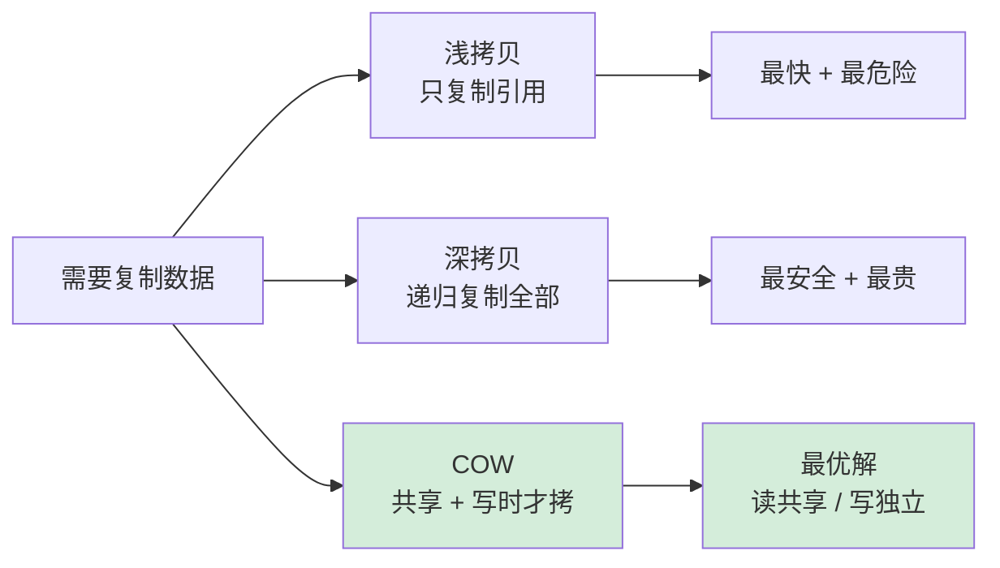
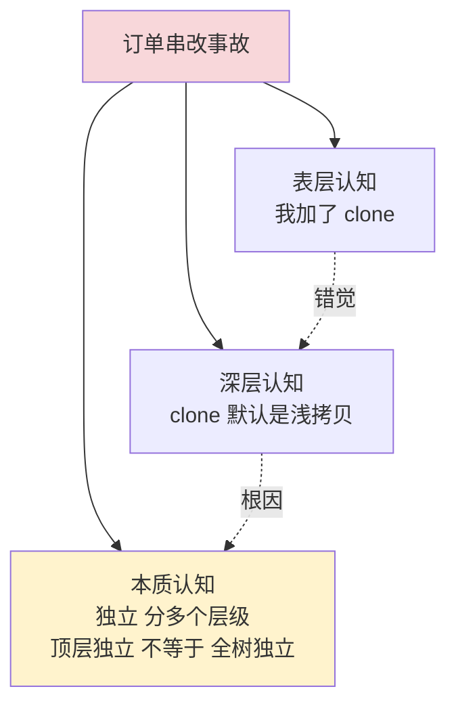
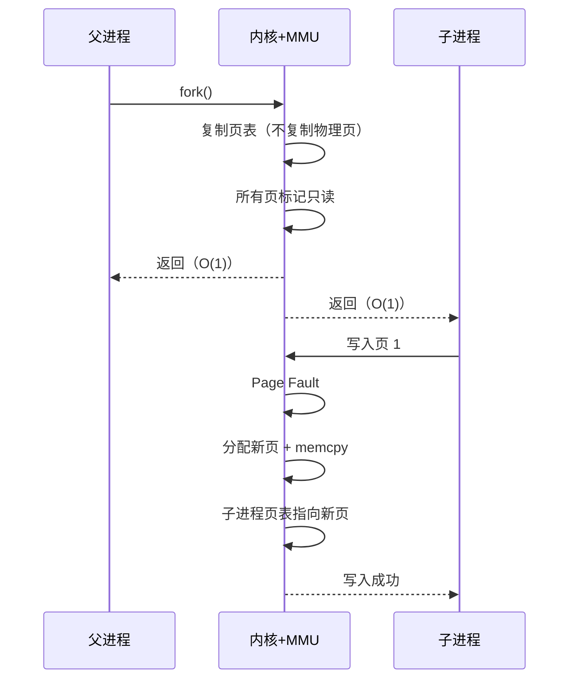
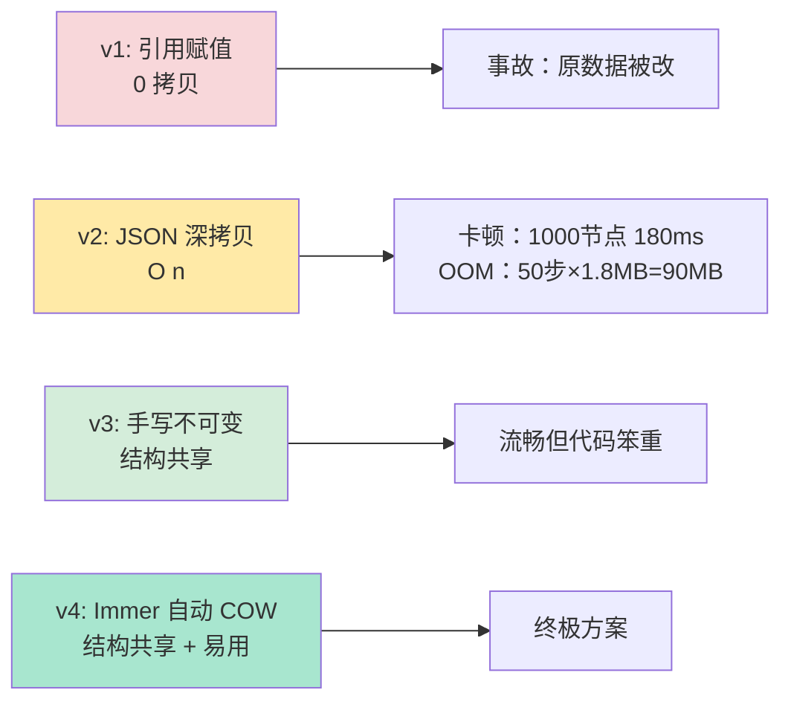

# 35.数据拷贝设计原理

> 📍 **本篇位置**：第 4 卷 · 内存与资源 · 第 5 篇（卷收官）
> 🎯 **核心矛盾**：**安全要独立数据 vs 性能要共享数据** —— 拷贝是"保险费"，用钱换确定性
> 🧭 **设计灵魂**：拷贝三梯度——**浅拷贝 / 深拷贝 / COW 写时复制**；COW 是最优解：**读零成本 + 写才付费**
> 🌐 **跨语言覆盖**：C++(拷贝构造 + 移动语义) · Java(Cloneable + 序列化深拷贝) · Swift(结构体 COW 自动) · Go(默认值拷贝) · JavaScript(structuredClone / 扩展运算符)
> 🔗 **延伸阅读**：← [34.多种引用技术设计](./34.多种引用技术设计.md) · → [40.窗口核心设计思想](./40.窗口核心设计思想.md) · → [03.值型变量和引用](./03.值型变量和引用.md)



---

#### 目录介绍
- [00.订单详情被串改事故说起](#00订单详情被串改事故说起)
- [01.对象拷贝有哪些](#01对象拷贝有哪些)
    - [1.1 为何需要拷贝](#11-为何需要拷贝)
    - [1.2 数据拷贝的场景](#12-数据拷贝的场景)
    - [1.3 拷贝类型有哪些](#13-拷贝类型有哪些)
- [02.理解浅拷贝](#02理解浅拷贝)
- [03.理解深拷贝](#03理解深拷贝)
- [04.序列化进行拷贝](#04序列化进行拷贝)
- [05.延迟拷贝](#05延迟拷贝)
- [06.如何选择拷贝方式](#06如何选择拷贝方式)
- [07.数组与集合的拷贝](#07数组与集合的拷贝)
- [08.跨语言拷贝机制对比](#08跨语言拷贝机制对比)
- [09.综合案例串讲：分布式任务编辑器的拷贝策略选型](#09综合案例串讲分布式任务编辑器的拷贝策略选型)
- [10.经典陷阱与生产级反模式](#10经典陷阱与生产级反模式)
- [11.一句话总结：拷贝设计哲学](#11一句话总结拷贝设计哲学)


## 00.订单详情被串改事故说起

### 0.1 投诉：刚提交订单价格自变

某电商 App 2020 年上线了新的「订单详情页 → 修改地址」流程。产品要求：用户点击修改地址后，进入编辑页修改，**保存前不应该影响原订单**——如果用户最终取消，应该回到原始数据。

上线后第三天，客服突然涌入大量投诉：

> "我刚提交的订单，原价 199 的商品，过了 2 小时变成 0 元了！"
> "我修改地址只是看了一眼省份，啥都没改，回去发现订单总价对不上了！"
> "更离谱的是有人说他订单收货人变成了别人的名字！"

工程师调出代码，**坚信代码没问题**：

```java
// 进入"修改地址"页时，把订单数据传过去
public void onClickEditAddress(Order order) {
    // 拷贝一份给编辑页，避免影响原始订单
    Order editingOrder = order.clone();
    startEditPage(editingOrder);
}

// Order 的 clone 方法
@Override
public Object clone() throws CloneNotSupportedException {
    return super.clone();   // ← 用了 Cloneable，应该没问题吧？
}
```

"我都加了 `clone()` 了，怎么还会互相影响？"——这是事故现场最高频的灵魂之问。

### 0.2 老板的灵魂三问

**问题 1**：你确定 `super.clone()` 把所有字段都"独立复制"了吗？

```
工程师：嗯……Object.clone() 不就是拷贝所有字段嘛。
老板：你的 Order 里有 List<Item>、有 Address 对象、有 User 对象，
     这些"引用类型字段"被复制后，是引用的同一个对象，还是新对象？
工程师：……
```

**问题 2**：单元测试为什么测不出来？

```
工程师：单测都过了，clone 后两个对象的字段都"看起来一样"。
老板：你测的是"看起来一样"，可"看起来一样" ≠ "完全独立"。
     你的测试有没有改一下副本的内层对象，再去看原对象？
工程师：……没有。
```

**问题 3**：为什么这种 Bug 总是延迟暴露？

```
工程师：因为大部分用户改完就保存了，覆盖了原数据看不出来。
老板：所以这是个潜伏期 Bug——它在等"修改 + 取消"这个组合出现。
     生产环境跑几天，自然就有几千个用户踩中这个组合。
```

### 0.3 用慢动作回放看真相

把工程师的代码逐字段慢放，事故就一目了然：

```
原始订单 order:                        clone 后 editingOrder:
┌─────────────────────────────┐       ┌─────────────────────────────┐
│ orderNo: "20200312001"     │       │ orderNo: "20200312001"     │  ← 字符串：独立 ✓
│ totalPrice: 199.0          │       │ totalPrice: 199.0          │  ← 基本类型：独立 ✓
│ items: ──────────────┐     │       │ items: ──────────────┐     │
│ address: ─────────┐  │     │       │ address: ─────────┐  │     │
│ user: ────────┐   │  │     │       │ user: ────────┐   │  │     │
└────────────────┼───┼──┼─────┘       └────────────────┼───┼──┼─────┘
                 │   │  │                              │   │  │
                 ▼   ▼  ▼                              │   │  │
              ┌─────────────────┐                     │   │  │
              │ User对象  ◄─────┼─────────────────────┘   │  │
              │ Address对象  ◄──┼─────────────────────────┘  │
              │ List<Item>  ◄───┼────────────────────────────┘
              └─────────────────┘
              ☠ 同一份数据被两个 Order 共享！
              ☠ 编辑页改 address.city，原订单的 address.city 跟着变！
```

**这就是经典的"浅拷贝陷阱"**——`Object.clone()` 默认行为只复制对象本身的"字段槽位"，引用类型的字段槽里装的还是**原对象的引用**。两个 Order 看似独立，实则共享所有内层对象。



### 0.4 这个事故揭示了什么

工程师对 `clone()` 的直觉建立在**"复制 = 独立"**的朴素心智模型上：

```
我以为：
  clone 后两个对象完全独立，改 A 不影响 B

实际：
  clone 是"位拷贝"——只复制字段槽位本身
  字段槽里的引用还指向同一个内层对象
  → "对象壳子独立，对象身体共享"
```

**这个错位，本质上是"数据独立性"在三个层级上的张力**：

| 层级 | 含义 | 工程师以为 | 实际 |
|---|---|---|---|
| 引用层 | 两个变量指向同一对象 | 不会 | clone 后不会 |
| 顶层字段 | 同一对象的字段槽 | 会独立 | clone 后会独立 |
| 内层引用对象 | 字段槽指向的对象 | 会独立 | **clone 后仍共享！** |

整个数据拷贝设计的核心矛盾就藏在这里：

> **"独立"不是布尔值，是个梯度——你想独立到哪一层？**

### 0.5 五个层层递进的追问

带着"订单串改事故"，整篇文章其实就是在回答下面五个递进的问题：

| 追问 | 答案章节 |
|---|---|
| 为什么"复制"会有那么多种？我直觉里复制就是复制 | §01 / §1.3 |
| 浅拷贝默认共享内层，那它存在的意义是什么？ | §02 |
| 深拷贝能解决一切，为什么不默认深拷贝？ | §03 / §06 |
| "改了再复制"的 COW 真的更好吗？什么时候反而是坑？ | §05 |
| 为什么 Java、C++、Swift、Rust 给出的答案完全不同？ | §09 / §11 |

### 0.6 三层解药预演

后面会展开，这里先把三把"解药"清单列出来，让读者带着对照感往下读：

```
解药 1（默认浅）：   接受"共享内层"，但只读使用
   → DTO、值对象、不可变对象
   → 代价：必须保证下游绝不修改

解药 2（手动深）：   显式递归复制每一层
   → 重写 clone()、构造函数、序列化
   → 代价：性能、维护、循环引用处理

解药 3（编译期保证）：让类型系统强制独立性
   → Rust 的 Move 语义、Swift 的 Value Type
   → 代价：心智模型转变（从"对象图"到"所有权")
```

带着这次事故的"具体感"，进入正题——你将看到，**所有抽象的"浅/深/COW"原理，最终都能落到这次订单串改的根因图上**。

### 0.7 浅拷贝陷阱在五种语言

订单串改是 Java `Cloneable` 的版本——但**默认浅拷贝**这个陷阱在**所有主流语言**里都成立。下面把同一类错误用五种语言的"惯用写法"演一遍：

| 语言 | 你以为是深拷贝的写法 | 实际行为 | 何时炸 |
|---|---|---|---|
| **Java** | `order.clone()`（默认 `Object.clone`） | 浅拷贝，引用字段共享 | 改副本的 `address.city`，原对象同步变 |
| **C++** | `Order b = a;`（默认拷贝构造） | 字段位拷贝，含 `T*` 时浅；含 `vector<T>` 时**深** | 类含裸指针/`shared_ptr` 时浅，含值容器时深——同一种语法行为不一致 |
| **Go** | `b := *a`（结构体值拷贝） | 字段位拷贝，含 `[]T` / `map[K]V` 时浅 | 修改 `b.items[0]` 影响 `a.items[0]` |
| **Python** | `b = copy.copy(a)` / `b = list(a)` / `b = dict(a)` | 浅拷贝，内层对象共享 | `b[0].field = x` 也改了 `a[0].field` |
| **JavaScript** | `{ ...a }` / `Object.assign({}, a)` / `arr.slice()` | 浅拷贝（仅顶层枚举字段） | `b.user.name = "X"` 也改了 `a.user.name`；`Date`/`Map` 不会被复制结构 |

**这张表最反直觉的一行是 C++**——同一句 `Order b = a;`：

```
含 std::vector<int>  → 深拷贝（vector 自己实现了拷贝构造）
含 int*              → 浅拷贝（裸指针就是 4/8 字节地址搬运）
含 std::shared_ptr<T>→ 浅拷贝（refcount +1，对象共享）
含 std::unique_ptr<T>→ 编译错误（unique 不允许拷贝）
```

**所以"是不是深拷贝"在 C++ 里不是看语法，而是看每个字段的类型**——这是 C++ "拷贝语义可控但易错"的根源。

**4 种语言的"默认深"如果想做出来，惯用法是**：

```
Java:        new Order(原对象)（拷贝构造手写）/ JSON 来回 / 序列化
C++:         自定义拷贝构造，对每个指针字段做 deep copy
Go:          手写 DeepCopy 函数（标准库无内置）/ gob 编解码 / 用 deepcopy 第三方包
Python:      copy.deepcopy(a)（标准库，自动处理循环引用）
JavaScript:  structuredClone(a)（现代浏览器/Node 17+，原生最佳；旧环境用 JSON.parse(JSON.stringify(a)) 但丢 Date/Map/Function）
Rust:        #[derive(Clone)] + obj.clone()（默认就是逐字段递归 clone）
```

**Rust 是唯一在语言层面让"深 vs 浅"显式且无歧义的语言**——`Copy` trait 表示位拷贝（仅原始类型/POD），`Clone` trait 表示递归深拷贝，编译器强制你写 `.clone()` 才能拷可变堆对象。这就是为什么 Rust 工程师极少出现 §0 这类事故——**陷阱在语言层被禁止了**。

---

## 01.对象拷贝有哪些
### 1.1 为何需要拷贝
- 在Java中，拷贝（Copy）操作是常见的，它涉及将一个对象的值复制到另一个对象中。拷贝操作在许多情况下是有用的：
    - 防止数据修改：通过拷贝对象，可以创建一个新的对象，使其具有相同的值。如果对其中一个对象进行修改，不会影响到原始对象。这在需要保护数据完整性的情况下很有用，特别是当多个对象需要独立操作相同数据时。
    - 传递不可变性：在Java中，字符串（String）和基本数据类型（如整数、浮点数等）是不可变的。当需要将这些不可变对象传递给其他方法或对象时，拷贝操作可以确保传递的是对象的副本，而不是引用。这样可以防止外部修改原始对象。
    - 多线程安全：在多线程环境下，如果多个线程需要同时访问同一个对象，为了避免竞态条件和数据不一致的问题，可以使用拷贝操作创建每个线程的私有副本。这样每个线程都可以独立地操作自己的副本，而不会影响其他线程。
    - 数据备份：有时候需要对数据进行备份，以便在需要时可以还原到之前的状态。通过拷贝操作，可以创建数据的副本，以备份或存档目的。
- Java中的拷贝操作是为了保护数据完整性、传递不可变性、实现多线程安全以及进行数据备份等目的。
    - 通过拷贝操作，可以创建对象的副本，使其具有独立的状态，以满足不同的需求。


### 1.2 数据拷贝的场景
- 在多线程环境下，多个线程可能同时访问和修改共享的数据。
    - 为了避免竞态条件和数据不一致的问题，可以使用数据拷贝创建每个线程的私有副本。这样每个线程都可以独立地操作自己的数据副本，而不会影响其他线程。
- 数据传递，当需要将数据传递给其他方法、对象或线程时会使用拷贝
    - 通过数据拷贝可以确保传递的是数据的副本，而不是引用。这样可以防止外部修改原始数据，保持数据的不可变性和安全性。
- 数据备份和还原：有时候需要对数据进行备份，以便在需要时可以还原到之前的状态。
    - 通过数据拷贝，可以创建数据的副本，以备份或存档目的。这对于数据的恢复、回滚或历史记录等操作非常有用。
- 数据缓存：在某些情况下，为了提高性能，可以使用数据拷贝将数据缓存到内存中
    - 这样可以避免频繁地从磁盘或网络中读取数据，提高数据访问的速度。


### 1.3 拷贝类型有哪些
- 对象拷贝(Object Copy)就是将一个对象的属性拷贝到另一个有着相同类类型的对象中去。在程序中拷贝对象是很常见的，主要是为了在新的上下文环境中复用对象的部分或全部数据。
    - Java中有三种类型的对象拷贝：浅拷贝(Shallow Copy)、深拷贝(Deep Copy)、延迟拷贝(Lazy Copy)。

#### 探索过程：为什么"复制"恰好是三档梯度？

读到这里，工程师的第一反应是："复制就是复制，怎么会有三种？"——这个追问其实是理解整章的关键。

**追问 1：能不能只有"复制 / 不复制"两种？**

最朴素的二元论是："要么复制（独立），要么不复制（共享）"。但这套二元论在订单事故里立刻崩塌：

```
不复制：editingOrder = order
        → 编辑页改任何字段，原订单都跟着变（顶层都没独立）

完全复制：递归把 user / address / items 全 new 一份
        → 顶层独立，内层也独立
        → 但是！每次进编辑页都要 deep copy 上千个 Item，性能爆炸
```

朴素二元论的问题是：**它不区分"独立到哪一层"**。

**追问 2：那"独立的层级"有几档？**

把对象想象成一棵"引用树"：

```
        Order (根)
       /    |    \
   User  Address  List<Item>
                     |
                   Item × N
```

复制时，沿着这棵树往下走，**走多深就停**，决定了独立的强度：

| 走的深度 | 名称 | 复制成本 | 独立强度 |
|---|---|---|---|
| 走 0 层（不复制） | 引用赋值 | O(1) | ❌ 完全共享 |
| 走 1 层（只根节点） | **浅拷贝** | O(1) | ⚠️ 顶层独立，内层共享 |
| 走到底（递归到叶） | **深拷贝** | O(n) 递归 | ✅ 完全独立 |
| 走 1 层 + 写时再走深 | **COW (延迟拷贝)** | 读 O(1) / 写时 O(n) | ⏳ 按需独立 |

**这就是"恰好三档"的根因**：浅与深是两个端点，COW 是工程上发现的"中间最优解"。

**追问 3：为什么不是四档、五档？比如"走 2 层"？**

理论上完全可以——叫"半深拷贝"。但工程实践中，**"走 2 层"永远不是稳定边界**：

```
你今天定义"走 2 层"：复制 Order + 复制它的 Address，但不复制 Address.country
明天产品需求变化：country 也要改了
→ 这条边界要不停往下推，最终变成"全部递归"或"全部不递归"
```

所以工程上的稳定切分只有**两端 + 一个延迟优化**，三档结构是**几十年实践收敛**的结果，不是设计师拍脑袋。

**追问 4：那订单事故应该选哪一档？**

带回我们的事故：

| 选择 | 后果 |
|---|---|
| 引用赋值 | 编辑页直接改原订单 → 这就是 Bug 本身 |
| 浅拷贝（事故现场） | 顶层独立 ≠ 全独立，仍出 Bug |
| **深拷贝** | ✅ 解决，但每次进编辑页都要深复制完整订单树 |
| COW | ✅ 最优——进编辑页零成本，用户真正改某字段时才独立 |

事故的真正"标准解"是 **COW**——读零成本、写才付费。但 Java 没有内置 COW 支持，所以现实中事故组只能选"深拷贝"作为可行解。**这正是为什么 Swift / Rust 在这件事上比 Java 优雅得多——它们把 COW 做进了语言原生**（详见 §09 / §11）。

#### 这一段的认知跃迁

| 表层认知 | 深层认知 |
|---|---|
| "复制就是复制" | 复制是个"递归到第几层"的工程选择 |
| "三种拷贝是 Java 的设计" | 三种拷贝是**对象图复制问题的数学切分**，所有语言都得面对 |
| "用 clone 就行" | clone 默认只走 1 层，深复制必须显式编码每一层 |
| "性能与正确性不可兼得" | COW 是"读路径正确性免费、写路径性能可控"的双赢 |

带着这个梯度模型，下面三章 §02/§03/§05 就是分别拆解这三档的内部机制和代价边界。


## 02.理解浅拷贝
### 2.1 什么是浅拷贝
- 浅拷贝（Shallow Copy）：浅拷贝创建一个新对象，该对象与原始对象共享相同的引用类型属性。
    - 换句话说，浅拷贝只复制对象的引用，而不复制引用指向的实际对象。
    - 这意味着对于引用类型属性的修改会影响到原始对象和副本对象。在Java中，可以使用clone()方法来实现浅拷贝。

#### 内存模型：浅拷贝到底"浅"在哪里

回到 §0 的订单事故，把浅拷贝的内存视图画清楚：

```
栈                     堆
─────                  ─────────────────────
order        ───────►  ┌──────────────────┐
                       │ Order #1         │
                       │ totalPrice: 199  │  ← 基本类型槽：值就是值
                       │ orderNo: "..."   │  ← String 引用 → 指向常量池
                       │ user: ──────────┐│
                       │ address: ───────┼┼───┐
                       │ items: ─────────┼┼───┼───┐
                       └──────────────────┘│   │   │
                                           │   │   │
editingOrder ───────►  ┌──────────────────┐│   │   │
                       │ Order #2         ││   │   │ ← 顶层是新对象 ✓
                       │ totalPrice: 199  ││   │   │
                       │ orderNo: "..."   ││   │   │
                       │ user: ──────────┘│   │   │
                       │ address: ────────┼───┘   │ ← 引用槽指向同一对象 ✗
                       │ items: ──────────┼───────┘
                       └──────────────────┘
```

**"浅"的精确含义**：

> 浅拷贝复制的是**对象本身的内存槽位**（一行字段表）；引用类型字段的"槽位值"是一个**地址**，复制地址 = 复制指针 = 仍指向同一个内层对象。

#### 反向追问：Object.clone 凭什么默认是浅？

读到这里工程师会愤怒：

> "Java 既然提供了 `clone()`，为什么默认搞个浅拷贝坑人？直接深拷贝多好！"

这是个值得追问的设计选择。让我们从 JDK 设计师的视角推演：

**理由 1：性能可预测**

浅拷贝是 **O(1)** ——一次 `memcpy` 或者 JVM 内部的字段批量复制。深拷贝是 **O(n)** 且 n 不可预测：

```
如果 Object.clone() 默认深拷贝：
  你 new 一个对象引用了 ConfigManager（全局单例）
  → 默认深拷贝会顺着引用走过去，把整个 ConfigManager 深复制
  → 包括它内部的 1 万个配置项、连接池、线程池
  → 一次"看起来无害的 clone()"可能复制几百 MB
```

更糟糕的是：

```
你的对象引用了一个 Cache，Cache 引用了一个 Database 连接池
→ 默认深拷贝试图复制连接池
→ 连接池对象不可序列化（它持有 Socket）
→ 直接抛异常
```

所以 **JDK 设计师选择了"绝对最小公共子集"**：复制能复制的（字段槽位），不碰可能炸掉的（递归遍历引用图）。

**理由 2：由调用方负责语义**

只有调用方知道"你想要哪一档独立"：

```
有时候你只想要顶层独立（典型场景：只读 DTO 传输）
有时候你想要内层独立（典型场景：可变状态共享）
有时候你想要 COW（典型场景：大对象的写时分裂）
```

设计师的选择是：**默认给最便宜、最快、最确定的那个，剩下的让调用方自己写**。这是 Unix 哲学"机制 vs 策略"在 API 设计上的回响。

**理由 3：历史包袱**

`Object.clone()` 1995 年随 JDK 1.0 发布，那时连泛型都没有，更别说"如何递归识别引用图"。设计师选择了"protected + 浅复制 + 抛 CloneNotSupportedException"这个最保守的组合。**Joshua Bloch 在《Effective Java》里干脆建议"避免使用 Cloneable"**——这是历史遗留 API 最坏的一面。

#### 这一段的认知跃迁

| 表层认知 | 深层认知 |
|---|---|
| "浅拷贝是 Java 的偷懒" | 浅拷贝是"机制最小化"的设计哲学 |
| "默认就该深拷贝" | 默认深拷贝在引用图里会引发**计算爆炸** |
| "clone 不好用" | clone 是 1995 年的产物，**现代代码应避开它** |

§3 我们来看，如果你愿意付 O(n) 代价，怎么把"独立"做到底。


### 2.2 如何实现浅拷贝
- 下面来看一看实现浅拷贝的一个例子 
    ```
    public class Subject {
     
       private String name; 
       public Subject(String s) { 
          name = s; 
       } 
    
       public String getName() { 
          return name; 
       } 
    
       public void setName(String s) { 
          name = s; 
       } 
    }
    ```

    ```
    public class Student implements Cloneable { 
     
       // 对象引用 
       private Subject subj; 
       private String name; 
     
       public Student(String s, String sub) { 
          name = s; 
          subj = new Subject(sub); 
       } 
     
       public Subject getSubj() { 
          return subj; 
       } 
     
       public String getName() { 
          return name; 
       } 
     
       public void setName(String s) { 
          name = s; 
       } 
     
       /** 
        *  重写clone()方法 
        * @return 
        */ 
       public Object clone() { 
          //浅拷贝 
          try { 
             // 直接调用父类的clone()方法
             return super.clone(); 
          } catch (CloneNotSupportedException e) { 
             return null; 
          } 
       } 
    }
    ```
- 如下所示
    ```
    private void test1(){
        // 原始对象
        Student stud = new Student("杨充", "潇湘剑雨");
        System.out.println("原始对象: " + stud.getName() + " - " + stud.getSubj().getName());

        // 拷贝对象
        Student clonedStud = (Student) stud.clone();
        System.out.println("拷贝对象: " + clonedStud.getName() + " - " + clonedStud.getSubj().getName());

        // 原始对象和拷贝对象是否一样：
        System.out.println("原始对象和拷贝对象是否一样: " + (stud == clonedStud));
        // 原始对象和拷贝对象的name属性是否一样
        System.out.println("原始对象和拷贝对象的name属性是否一样: " + (stud.getName() == clonedStud.getName()));
        // 原始对象和拷贝对象的subj属性是否一样
        System.out.println("原始对象和拷贝对象的subj属性是否一样: " + (stud.getSubj() == clonedStud.getSubj()));

        stud.setName("小杨逗比");
        stud.getSubj().setName("潇湘剑雨大侠");
        System.out.println("更新后的原始对象: " + stud.getName() + " - " + stud.getSubj().getName());
        System.out.println("更新原始对象后的克隆对象: " + clonedStud.getName() + " - " + clonedStud.getSubj().getName());
    }
    ```
- 输出结果如下： 
    ```
    2019-03-23 13:50:57.518 24704-24704/com.ycbjie.other I/System.out: 原始对象: 杨充 - 潇湘剑雨
    2019-03-23 13:50:57.519 24704-24704/com.ycbjie.other I/System.out: 拷贝对象: 杨充 - 潇湘剑雨
    2019-03-23 13:50:57.519 24704-24704/com.ycbjie.other I/System.out: 原始对象和拷贝对象是否一样: false
    2019-03-23 13:50:57.519 24704-24704/com.ycbjie.other I/System.out: 原始对象和拷贝对象的name属性是否一样: true
    2019-03-23 13:50:57.519 24704-24704/com.ycbjie.other I/System.out: 原始对象和拷贝对象的subj属性是否一样: true
    2019-03-23 13:50:57.519 24704-24704/com.ycbjie.other I/System.out: 更新后的原始对象: 小杨逗比 - 潇湘剑雨大侠
    2019-03-23 13:50:57.519 24704-24704/com.ycbjie.other I/System.out: 更新原始对象后的克隆对象: 杨充 - 潇湘剑雨大侠
    ```
- 可以得出的结论
    - 在这个例子中，让要拷贝的类Student实现了Clonable接口并重写Object类的clone()方法，然后在方法内部调用super.clone()方法。从输出结果中我们可以看到，对原始对象stud的"name"属性所做的改变并没有影响到拷贝对象clonedStud，但是对引用对象subj的"name"属性所做的改变影响到了拷贝对象clonedStud。


## 03.理解深拷贝
### 3.1 什么是深拷贝
- 深拷贝会拷贝所有的属性,并拷贝属性指向的动态分配的内存。当对象和它所引用的对象一起拷贝时即发生深拷贝。深拷贝相比于浅拷贝速度较慢并且花销较大。
    ```
    深拷贝示意图：
    SourceObject                    CopiedObject
    ┌──────────────┐               ┌──────────────┐
    │ field1: 10   │               │ field2: 10   │  (值拷贝)
    │ refObj1 ─────┼──→ [数据A]    │ refObj2 ─────┼──→ [数据A'] (独立副本)
    └──────────────┘               └──────────────┘
    修改refObj1不影响refObj2，因为它们指向不同的内存
    ```
    - 在上图中，SourceObject有一个int类型的属性 "field1"和一个引用类型属性"refObj1"（引用ContainedObject类型的对象）。当对SourceObject做深拷贝时，创建了CopiedObject，它有一个包含"field1"拷贝值的属性"field2"以及包含"refObj1"拷贝值的引用类型属性"refObj2" 。因此对SourceObject中的"refObj"所做的任何改变都不会影响到CopiedObject

#### 深拷贝的真实困难：不是"递归一下"那么简单

教科书会告诉你"深拷贝就是递归复制每一层引用"。但是工程师真正动手写一个通用 deep copy 函数时，会发现至少有四道天堑——这也是为什么 JDK 不愿意提供默认深拷贝。

**困难 1：循环引用导致的栈溢出**

回到订单事故，假设业务逻辑里有：

```
Order ─┐
       │
User ──┘   ← User.lastOrder 又指回 Order
```

朴素的深拷贝代码：

```java
Order deepCopy(Order o) {
    Order n = new Order();
    n.user = deepCopy(o.user);   // ← 递归
    return n;
}
User deepCopy(User u) {
    User n = new User();
    n.lastOrder = deepCopy(u.lastOrder);  // ← 又递归回去
    return n;
}
```

→ **死循环 → StackOverflowError**。

工程级解法必须维护一个 **"已复制对象映射表"**：

```java
Object deepCopy(Object src, IdentityHashMap<Object, Object> visited) {
    if (visited.containsKey(src)) return visited.get(src);  // 已经复制过，直接返回
    Object n = newInstance(src);
    visited.put(src, n);   // ← 关键：先登记再递归
    copyFields(src, n, visited);
    return n;
}
```

**这就是为什么 Python 的 `copy.deepcopy()` 第二个参数叫 `memo`** —— 它就是这张映射表。

**困难 2：不可复制的对象**

对象图里经常混着"复制就破坏语义"的东西：

```
Order
 └─ ConnectionPool（每个池有 Socket 句柄）
     └─ 你深复制它 → 复制出来的 Socket 是无效引用 → 一用就崩
Order
 └─ Logger（共享单例）
     └─ 你深复制它 → 出来两个 Logger 实例，破坏单例语义
Order
 └─ Lock（互斥锁）
     └─ 你深复制它 → 复制出来的锁状态？锁住了还是没锁？
```

**通用 deepcopy 没有"正确答案"**——只有业务方知道哪些应该复制、哪些应该共享、哪些应该重新创建。这就是为什么 Java 没法提供"通用深拷贝"，C++ 必须由程序员自己写拷贝构造函数。

**困难 3：性能不是 O(n)，而是 O(节点数 × 对象大小)**

假设订单里有 1000 个 Item，每个 Item 平均 200 字节：

```
浅拷贝 Order：     40 字节 / 几纳秒
深拷贝 Order：     40 + 1000 × 200 = 200KB / 几十微秒
深拷贝 100 个订单：20MB / 几毫秒    ← 在主线程跑就是卡顿
深拷贝整个订单列表（10万条）：20GB / 直接 OOM
```

**深拷贝看似 O(n)，实际放在生产环境就是性能黑洞**。这也是为什么经验丰富的架构师宁可用"不可变对象 + 浅复制"模式，也不愿意写 deep copy。

**困难 4：类的演化让 deep copy 失效**

写一个深拷贝时你考虑了 Order 的当前 5 个字段：

```java
Order deepCopy(Order o) {
    Order n = new Order();
    n.orderNo = o.orderNo;
    n.totalPrice = o.totalPrice;
    n.user = deepCopy(o.user);
    n.address = deepCopy(o.address);
    n.items = deepCopyList(o.items);
    return n;
}
```

半年后另一个工程师给 Order 加了第 6 个字段 `coupon`，但忘记更新 deep copy ——

```
新代码上线后，editingOrder 和 order 共享 coupon
→ 编辑页改优惠券 → 原订单优惠券也变了
→ 一个新版本的事故诞生
```

**这就是 deep copy 的"类演化脆弱性"**。所以业界有了两个对策：

```
对策 A：用反射/序列化做泛型深拷贝（不依赖手写）
        → 慢 5-100 倍，但抗演化

对策 B：从根本上不让对象可变（不可变对象不需要 deep copy）
        → Scala / Kotlin / Rust 的主流方案
```

#### 这一段的认知跃迁

| 表层认知 | 深层认知 |
|---|---|
| "深拷贝就是递归" | 深拷贝必须解决循环引用、不可复制对象、类演化三道难关 |
| "深拷贝 = 慢一点的浅拷贝" | 深拷贝是 O(对象图规模)，可能从纳秒爆炸到秒级 |
| "深拷贝越深越好" | "通用深拷贝" 在工程上是个伪问题，必须按业务定义边界 |
| "我用 deep copy 就安全" | deep copy 是"贴膏药"，从根本上你应该问"为什么要可变" |


### 3.2 实现深拷贝案例
- 下面是实现深拷贝的一个例子。只是在浅拷贝的例子上做了一点小改动，Subject 和CopyTest 类都没有变化。
    ```
    public class Student implements Cloneable { 
       // 对象引用 
       private Subject subj; 
       private String name; 
     
       public Student(String s, String sub) { 
          name = s; 
          subj = new Subject(sub); 
       } 
     
       public Subject getSubj() { 
          return subj; 
       } 
     
       public String getName() { 
          return name; 
       } 
     
       public void setName(String s) { 
          name = s; 
       } 
     
       /** 
        * 重写clone()方法 
        * 
        * @return 
        */ 
       public Object clone() { 
          // 深拷贝，创建拷贝类的一个新对象，这样就和原始对象相互独立
          Student s = new Student(name, subj.getName()); 
          return s; 
       } 
    }
    ```
- 输出结果如下：
    ```
    2019-03-23 13:53:48.096 25123-25123/com.ycbjie.other I/System.out: 原始对象: 杨充 - 潇湘剑雨
    2019-03-23 13:53:48.096 25123-25123/com.ycbjie.other I/System.out: 拷贝对象: 杨充 - 潇湘剑雨
    2019-03-23 13:53:48.096 25123-25123/com.ycbjie.other I/System.out: 原始对象和拷贝对象是否一样: false
    2019-03-23 13:53:48.096 25123-25123/com.ycbjie.other I/System.out: 原始对象和拷贝对象的name属性是否一样: true
    2019-03-23 13:53:48.096 25123-25123/com.ycbjie.other I/System.out: 原始对象和拷贝对象的subj属性是否一样: false
    2019-03-23 13:53:48.096 25123-25123/com.ycbjie.other I/System.out: 更新后的原始对象: 小杨逗比 - 潇湘剑雨大侠
    2019-03-23 13:53:48.096 25123-25123/com.ycbjie.other I/System.out: 更新原始对象后的克隆对象: 杨充 - 潇湘剑雨
    ```
- 得出的结论
    - 很容易发现clone()方法中的一点变化。因为它是深拷贝，所以你需要创建拷贝类的一个对象。因为在Student类中有对象引用，所以需要在Student类中实现Cloneable接口并且重写clone方法。


## 04.序列化进行拷贝
### 4.1 序列化属于深拷贝
- 可能你会问，序列化是属于那种类型拷贝？答案是：通过序列化来实现深拷贝。可以思考一下，为何序列化对象要用深拷贝而不是用浅拷贝呢？


### 4.2 注意要点
- 可以序列化是干什么的?它将整个对象图写入到一个持久化存储文件中并且当需要的时候把它读取回来, 这意味着当你需要把它读取回来时你需要整个对象图的一个拷贝。这就是当你深拷贝一个对象时真正需要的东西。请注意，当你通过序列化进行深拷贝时，必须确保对象图中所有类都是可序列化的。


### 4.3 序列化案例
- 看一下下面案例，很简单，只需要实现Serializable这个接口。Android中还可以实现Parcelable接口。
    ```
    public class ColoredCircle implements Serializable { 
     
       private int x; 
       private int y; 
     
       public ColoredCircle(int x, int y) { 
          this.x = x; 
          this.y = y; 
       } 
     
       public int getX() { 
          return x; 
       } 
     
       public void setX(int x) { 
          this.x = x; 
       } 
     
       public int getY() { 
          return y; 
       } 
     
       public void setY(int y) { 
          this.y = y; 
       } 
     
       @Override 
       public String toString() { 
          return "x=" + x + ", y=" + y; 
       } 
    }
    ```

    ```
    private void test3() {
        ObjectOutputStream oos = null;
        ObjectInputStream ois = null;
        try {
            // 创建原始的可序列化对象
            DouBi c1 = new DouBi(100, 100);
            System.out.println("原始的对象 = " + c1);
            DouBi c2 = null;
            // 通过序列化实现深拷贝
            ByteArrayOutputStream bos = new ByteArrayOutputStream();
            oos = new ObjectOutputStream(bos);
            // 序列化以及传递这个对象
            oos.writeObject(c1);
            oos.flush();
            ByteArrayInputStream bin = new ByteArrayInputStream(bos.toByteArray());
            ois = new ObjectInputStream(bin);
            // 返回新的对象
            c2 = (DouBi) ois.readObject();
            // 校验内容是否相同
            System.out.println("复制后的对象   = " + c2);
            // 改变原始对象的内容
            c1.setX(200);
            c1.setY(200);
            // 查看每一个现在的内容
            System.out.println("查看原始的对象 = " + c1);
            System.out.println("查看复制的对象 = " + c2);
        } catch (IOException e) {
            System.out.println("Exception in main = " + e);
        } catch (ClassNotFoundException e) {
            e.printStackTrace();
        } finally {
            if (oos != null) {
                try {
                    oos.close();
                } catch (IOException e) {
                    e.printStackTrace();
                }
            }
            if (ois != null) {
                try {
                    ois.close();
                } catch (IOException e) {
                    e.printStackTrace();
                }
            }
        }
    }
    ```
- 输出结果如下：
    ```
    2019-03-23 13:53:48.096 25123-25123/com.ycbjie.other I/System.out: 原始的对象 = x=100, y=100
    2019-03-23 13:53:48.096 25123-25123/com.ycbjie.other I/System.out: 复制后的对象   = x=100, y=100
    2019-03-23 13:53:48.096 25123-25123/com.ycbjie.other I/System.out: 查看原始的对象 = x=200, y=200
    2019-03-23 13:53:48.096 25123-25123/com.ycbjie.other I/System.out: 查看复制的对象   = x=100, y=100
    ```
- 注意：需要做以下几件事儿:
    - 确保对象图中的所有类都是可序列化的
    - 创建输入输出流
    - 使用这个输入输出流来创建对象输入和对象输出流
    - 将你想要拷贝的对象传递给对象输出流
    - 从对象输入流中读取新的对象并且转换回你所发送的对象的类
- 得出的结论
    - 在这个例子中，创建了一个DouBi对象c1然后将它序列化 (将它写到ByteArrayOutputStream中). 然后我反序列化这个序列化后的对象并将它保存到c2中。随后我修改了原始对象c1。然后结果如你所见，c1不同于c2，对c1所做的任何修改都不会影响c2。
    - 注意，序列化这种方式有其自身的限制和问题：因为无法序列化transient变量, 使用这种方法将无法拷贝transient变量。再就是性能问题。创建一个socket, 序列化一个对象, 通过socket传输它, 然后反序列化它，这个过程与调用已有对象的方法相比是很慢的。所以在性能上会有天壤之别。如果性能对你的代码来说是至关重要的，建议不要使用这种方式。它比通过实现Clonable接口这种方式来进行深拷贝几乎多花100倍的时间。


## 05.延迟拷贝

### 5.1 什么是延迟拷贝

延迟拷贝（Copy-on-Write，CoW）是浅拷贝和深拷贝的结合体，也称为**写时复制**。

核心思想：拷贝时只复制引用（浅拷贝），当任一副本需要修改时，才真正执行深拷贝。这是一种经典的**延迟求值（Lazy Evaluation）** 策略。

#### 探索过程：COW 是怎么从浅与深的张力中"涌现"出来的

回到 §0 的订单事故，我们已经看到工程师的两难：

```
浅拷贝：进编辑页快（O(1)），但内层共享 → 出 Bug
深拷贝：内层独立 → 修复 Bug，但每次进页都 O(n) 全树复制
```

聪明的工程师会问：**用户大部分时候只是"看一眼"或"改一两个字段"，为什么要为整棵树付费？**

把"用户在编辑页的真实行为"拆开看：

```
情况 A（占比 70%）：用户进了编辑页，看一眼就退出
                   → 全树深拷贝白做了
情况 B（占比 25%）：用户改了 1-2 个字段
                   → 只有那 1-2 个内层对象需要独立
情况 C（占比 5%）： 用户改了大量字段
                   → 这种情况下深拷贝才是真的"值"
```

如果有一种机制能做到：

```
进编辑页时：    O(1) 浅拷贝（情况 A 全免单）
改字段时：      O(对应字段) 复制（情况 B 只付小钱）
全改时：        O(n) 退化为深拷贝（情况 C 不亏）
```

——**这就是 COW 的设计思路**。它不是一种新机制，而是"浅 + 深"的**惰性求值**：默认浅，写时再深。

**这一招的精妙之处**：

> 工程上从来没有"通用最优解"。**"读多写少"是真实世界 80% 业务的特征**——文件系统、数据库 MVCC、Git 提交历史、UI 视图树、配置中心，全部如此。COW 正好踩中了这个分布。

### 5.2 延迟拷贝原理

写时复制的内部实现通常包含一个**引用计数器**：

```
初始状态：
  对象A ──引用──→ [数据块, refCount=1]

拷贝后：
  对象A ──引用──→ [数据块, refCount=2] ←──引用── 对象B

修改对象A时：
  对象A ──引用──→ [数据块副本, refCount=1]  （新分配）
  对象B ──引用──→ [原数据块, refCount=1]
```

#### 硬件级 COW：Linux fork() 是怎么做到 O(1) 的

软件层的 COW 用引用计数。但硬件层有更优雅的实现——Linux `fork()` 的 COW，**和 CPU 的 MMU 直接配合**：

```
父进程内存布局：
   逻辑页 0 ─→ 物理页 0x1000 [可读可写]
   逻辑页 1 ─→ 物理页 0x2000 [可读可写]
   逻辑页 2 ─→ 物理页 0x3000 [可读可写]

fork() 后（瞬间完成，几微秒）：
   父进程页表：所有页标记为 [只读]，物理页不变
   子进程页表：复制父进程页表，所有页标记为 [只读]
   ↓
   父子两个进程共享同一份物理内存（只读）
```

```
当子进程尝试写入逻辑页 1：
   ① CPU 检测到对只读页的写 → 触发 Page Fault
   ② OS 内核处理：
      ─ 分配一个新物理页 0x4000
      ─ 把原物理页 0x2000 的内容 memcpy 到新页 0x4000
      ─ 更新子进程页表：逻辑页 1 ─→ 物理页 0x4000 [可读可写]
   ③ 重试写指令
```



**为什么这个方案这么牛**：

1. **fork 复杂度从 O(进程内存) 降到 O(页表大小)**——一个 1GB 的进程，fork 可能只需复制 4KB 页表
2. **OS 不需要知道哪些页"会被改"**——MMU 硬件帮你检测
3. **粒度精确到 4KB**——只有真正写的页会被复制
4. **零软件层引用计数**——MMU 的"只读位"本身就是计数器

**所有现代 OS 都用这套**：Linux、macOS、FreeBSD、甚至 Windows 的 CreateProcess。这是 **COW 思想的硬件级最优实现**。

#### 软件层 COW：引用计数的代价

但软件层的 COW 没有 MMU，只能靠引用计数。这带来三个隐藏成本：

**成本 1：每次读都要原子操作**

```cpp
// C++11 之前的 std::string COW 实现的核心
class CowString {
    struct Buffer {
        std::atomic<int> refCount;  // ← 必须原子，多线程安全
        char data[];
    };
    Buffer* buf;
};
```

```
单线程：refCount++ ≈ 1 个时钟周期
多线程：原子 ++ ≈ 30-50 个时钟周期（lock 前缀）
```

**对短字符串（< 50 字节）的拷贝**：

```
非 COW 的 SSO（小字符串优化）：直接 memcpy，几个时钟周期
COW 实现：原子计数 + 间接寻址 + 可能的写时分裂
→ 反而更慢！
```

**这就是 C++11 标准强制 std::string 不能用 COW 的根本原因**——多核时代，原子操作的代价比直接拷贝还高。

**成本 2：写时分裂触发"突然慢"**

```
正常使用：read 都很快（O(1)）
某次写入：突然要 O(n) 复制全部数据 → 那一次操作"突然慢"
```

这种"99% 快 + 1% 突然慢"的特性，对实时系统、游戏渲染、高频交易是致命的——它们需要**可预测的延迟**而不是平均最快。

**成本 3：循环引用 / 内存泄漏**

引用计数有个经典缺陷——**循环引用永远不会归零**：

```
A 引用 B（B.refCount = 1）
B 引用 A（A.refCount = 1）
外部都不再引用 A 和 B
→ 但 A.refCount 和 B.refCount 都 ≥ 1，永远不释放
→ 内存泄漏
```

Swift / Objective-C 必须靠 `weak` 关键字手动打破循环；Rust 的 `Rc<T>` 文档明确警告这个问题。**引用计数不是免费的**。

**经典应用场景对比表**：

| 场景 | 语言/系统 | COW 实现层级 | 引用计数代价 | 结论 |
|------|----------|------|------|------|
| `fork()` 系统调用 | Linux内核 | **硬件 MMU** | 0（页表标志位） | ✅ 最优 |
| Swift `Array` / `String` | Swift | **运行时 + ARC** | 中等（原子计数） | ✅ 单线程优秀 |
| `std::string`（旧版） | C++ (GCC < 5) | **库实现 + 原子** | 高（多核更慢） | ❌ C++11 已废弃 |
| `String.substring` | Java (< 7u6) | **共享 char[]** | 0（无计数） | ⚠️ 7u6 后改为独立拷贝 |
| `Rc<T>` / `Arc<T>` | Rust | 库 trait | 中等 | ⚠️ 不能解决循环 |
| 数据库 MVCC | PostgreSQL/MySQL | **页级版本链** | 取决于实现 | ✅ 读不阻塞写 |
| Git 提交对象 | Git | **内容寻址 hash** | 0（不可变） | ✅ 永远不冲突 |

#### 这一段的认知跃迁

| 表层认知 | 深层认知 |
|---|---|
| "COW 总是最优" | COW 是"读多写少"分布下的最优；写多场景反而更慢 |
| "COW 是软件优化" | 最高效的 COW 是 **MMU 硬件级**，软件 COW 都是它的近似 |
| "COW = 引用计数" | 引用计数是 COW 的一种实现，**不可变 + 内容寻址（如 Git）** 是另一种 |
| "C++ 不用 COW 是技术倒退" | 是技术进步——多核时代发现"原子计数比 memcpy 还贵" |

带回订单事故：

> 真正的"标准解"是把 Order 设计为不可变，编辑页生成一个新 Order（用 Builder 累积变化），保存时整体替换。**这就是函数式编程在前端 / 后端业务建模上越来越流行的根本原因——它从根本上消除了"什么时候该复制"这个问题**。


## 06.如何选择拷贝方式

选择拷贝方式需要综合考虑以下因素：

| 考量维度 | 浅拷贝 | 深拷贝 | 延迟拷贝(CoW) |
|---------|--------|--------|--------------|
| 性能 | 最快 | 最慢 | 读多写少时最优 |
| 内存 | 共享引用，省内存 | 完全独立，耗内存 | 动态按需分配 |
| 安全性 | 修改会互相影响 | 完全隔离 | 写入时才隔离 |
| 适用场景 | 只读数据、基本类型 | 需要独立修改的场景 | 大对象的读多写少场景 |

**决策规则**：
- 对象只包含基本类型 → 浅拷贝即可（值语义，天然深拷贝）
- 对象有引用属性但不会被修改 → 浅拷贝
- 对象有引用属性且需要独立修改 → 深拷贝
- 大对象，大部分时间只读，偶尔修改 → 延迟拷贝


## 07.数组与集合的拷贝

数组与集合是日常拷贝最高频的场景，但**它们都默认浅拷贝**——这是事故重灾区。本节按"容器层 vs 元素层"的二维网格快速对照各语言惯用法。

### 7.1 数组与集合的"双层独立性"

容器拷贝可以拆成两个独立的问题：

```
            [容器结构]            [容器内元素]
浅拷贝   :   独立（新容器）      共享（同一引用）   ← 默认
半深拷贝 :   独立              元素是值类型 / 不可变 → 天然独立
深拷贝   :   独立              独立（递归 clone）  ← 需手写
```

**判定原则**：
- 元素是**基本类型 / 不可变值对象**（`int`、`String`、`record`） → 浅拷贝就够用，等价深拷贝
- 元素是**可变引用对象**（`ArrayList<User>`、`Map<K, MutableV>`） → 浅拷贝是陷阱，必须手动深复制每个元素

### 7.2 五语言数组/集合拷贝速查表

| 语言 | 浅拷贝（容器独立，元素共享） | 深拷贝（元素也独立） | 备注 |
|---|---|---|---|
| **Java** 数组 | `Arrays.copyOf(a, len)` / `a.clone()` | 手写循环 + 元素 `clone()` / `Arrays.stream(a).map(...).toArray()` | 多维数组 `clone()` 只复制第一维 |
| **Java** List | `new ArrayList<>(list)` / `list.clone()`（ArrayList） | `list.stream().map(Item::new).toList()` | `List.copyOf` 仅容器不可变，元素仍可变 |
| **Java** Map | `new HashMap<>(map)` | `map.entrySet().stream().collect(toMap(k->copy(k.getKey()), v->copy(v.getValue())))` | |
| **C++** vector | `std::vector<T> b = a;` | 同（**vector 拷贝构造默认深**，因元素调用拷贝构造） | 元素是 `T*` 时仍浅 |
| **C++** map | `std::map<K,V> b = a;` | 同上（V 是值类型时深；`V*` 时浅） | |
| **Go** slice | `b := append([]T{}, a...)` / `b := make([]T,len(a)); copy(b, a)` | 元素是结构体值类型时已深；含指针/切片时手写 | `b := a` 是切片头浅复制，**底层数组仍共享** |
| **Go** map | `for k,v := range a { b[k]=v }` | 同左 + 对 V 做深复制 | 标准库无内置 map 拷贝 |
| **Python** list | `a[:]` / `list(a)` / `copy.copy(a)` | `copy.deepcopy(a)` | 浅拷贝时 `b[0].x=1` 仍改 `a[0].x` |
| **Python** dict | `a.copy()` / `dict(a)` / `copy.copy(a)` | `copy.deepcopy(a)` | |
| **JS** Array | `[...a]` / `a.slice()` / `Array.from(a)` | `structuredClone(a)` / `a.map(deepClone)` | `a.slice()` 元素是对象时仍浅 |
| **JS** Object | `{...a}` / `Object.assign({},a)` | `structuredClone(a)` | 不复制 prototype/getter/Symbol 键 |

### 7.3 Java 数组/集合的最小验证示例

把繁琐的日志输出压成最小可验证骨架：

```java
// === 基本类型数组：浅拷贝 = 深拷贝 ===
int[] a = {1, 2, 3};
int[] b = Arrays.copyOf(a, a.length);
b[0] = 99;
// a[0]==1, b[0]==99  ← 元素是值，独立

// === 引用类型数组：clone 只独立"槽位"，元素共享 ===
User[] aa = { new User("Alice"), new User("Bob") };
User[] bb = aa.clone();
bb[0].name = "Eve";
// aa[0].name == "Eve"  ← 容器独立，元素共享

// === ArrayList：构造函数 / clone() 都是浅 ===
List<User> la = List.of(new User("Alice"));
List<User> lb = new ArrayList<>(la);    // 浅
lb.get(0).name = "Eve";
// la.get(0).name == "Eve"   ← 元素仍共享

// === 真正的深拷贝必须显式映射 ===
List<User> lc = la.stream()
                  .map(u -> new User(u.name))
                  .collect(Collectors.toList());
lc.get(0).name = "Mallory";
// la.get(0).name 不变  ← 终于独立
```

**3 条经验**：

```
1. 多维数组 / 嵌套集合 永远是浅——递归层数与维度成正比，深复制必须显式
2. Go 切片陷阱：b := a 只复制 24 字节切片头（指针+len+cap），底层数组仍共享
3. JS structuredClone 是 2022+ 唯一既深、又懂 Date/Map/Set/RegExp/循环引用的原生 API
```


## 08.跨语言拷贝机制对比

### 8.1 各语言拷贝机制总览

| 语言 | 浅拷贝 | 深拷贝 | 特有机制 |
|------|--------|--------|---------|
| Java | clone() / 赋值 | 序列化 / 手动递归 | Cloneable接口 |
| JavaScript | Object.assign / 展开运算符 | JSON.parse(JSON.stringify()) / structuredClone | 结构化克隆 |
| Python | copy.copy() | copy.deepcopy() | 自动处理循环引用 |
| C++ | 拷贝构造函数 | 手动实现 / 拷贝构造深度复制 | 移动语义(std::move) |
| Swift | 值类型自动复制 | 手动实现 | COW(写时复制) |
| Rust | Clone trait | Clone trait (深拷贝) | 所有权转移 |

### 8.2 JavaScript的拷贝

JavaScript中对象拷贝是最常见的操作之一：

```javascript
// 浅拷贝方案
const shallow1 = Object.assign({}, original);
const shallow2 = { ...original };
const shallow3 = Array.from(originalArray);

// 深拷贝方案
// 方案1: JSON（不支持函数、Date、RegExp、循环引用）
const deep1 = JSON.parse(JSON.stringify(original));

// 方案2: structuredClone（推荐，现代浏览器支持）
const deep2 = structuredClone(original);

// 方案3: 递归实现
function deepClone(obj, map = new WeakMap()) {
    if (obj === null || typeof obj !== 'object') return obj;
    if (map.has(obj)) return map.get(obj); // 处理循环引用
    
    const clone = Array.isArray(obj) ? [] : {};
    map.set(obj, clone);
    
    for (const key of Object.keys(obj)) {
        clone[key] = deepClone(obj[key], map);
    }
    return clone;
}
```

### 8.3 C++的拷贝与移动

C++11引入了移动语义，彻底改变了对象拷贝的方式：

```cpp
class Buffer {
    char* data;
    size_t size;
public:
    // 拷贝构造（深拷贝）
    Buffer(const Buffer& other) : size(other.size) {
        data = new char[size];
        memcpy(data, other.data, size);
    }
    
    // 移动构造（零拷贝，转移所有权）
    Buffer(Buffer&& other) noexcept : data(other.data), size(other.size) {
        other.data = nullptr;
        other.size = 0;
    }
};

// 使用
Buffer a(1024);
Buffer b = a;           // 调用拷贝构造，深拷贝
Buffer c = std::move(a); // 调用移动构造，零拷贝（a变为空）
```

移动语义的核心思想：当源对象即将销毁时，直接"偷走"其资源，而不是复制。

### 8.4 写时复制（COW）机制

写时复制是一种延迟拷贝的优化技术，核心思想：

1. 复制时只复制引用（共享底层数据）
2. 修改时才真正复制一份独立的数据
3. 多个副本读取同一份数据时零开销

**应用场景**：
- Swift的Array、String、Dictionary都使用COW
- Linux的fork()系统调用使用COW复制进程内存
- 早期C++ std::string实现也使用COW（C++11后废弃）

```swift
// Swift中COW的表现
var a = [1, 2, 3]
var b = a  // 此时a和b共享同一块内存
b.append(4)  // 此时才真正复制，a和b各有独立的内存
```

### 8.5 五语言深/浅拷贝 API 入口速查表

把前面四节的语言细节压成一张工程速查表——遇到新语言时按行索引即可：

| 操作 | Java | C++ | Go | Python | JavaScript | Rust |
|---|---|---|---|---|---|---|
| **默认赋值** | 引用复制 | 调用拷贝构造（含字段差异） | 结构体值复制（浅） | 引用复制 | 引用复制（对象）/值复制（原始） | Move（编译期所有权转移） |
| **浅拷贝（顶层一层）** | `Object.clone()` / 拷贝构造 | 拷贝构造默认行为 | `b := *a` / `append([]T{}, a...)` | `copy.copy(a)` / `list(a)` / `dict(a)` / `a[:]` | `{...a}` / `Object.assign({},a)` / `arr.slice()` | （无原生，需 `Clone`） |
| **深拷贝（递归全树）** | 手写拷贝构造 / Jackson / Gson / Apache `SerializationUtils` | 手写 deep copy / 序列化 | 手写 / `gob` 编解码 / 第三方 deepcopy | `copy.deepcopy(a)`（标准） | `structuredClone(a)`（最新原生） / 手写递归 | `a.clone()` （`#[derive(Clone)]`） |
| **不可变（消灭拷贝）** | record / Immutables / Lombok `@Value` | `const` + 不可变设计 | 不变接口（无 setter） | `@dataclass(frozen=True)` / `tuple` / `frozenset` | `Object.freeze(a)` / Immutable.js / Immer | 默认即不可变（`let`） |
| **COW（写时复制）** | （无原生，可用 `CopyOnWriteArrayList`） | 早期 `std::string`（C++11 后废弃） | （无原生） | （无原生） | （引擎内部可能做） | `Cow<T>`（标准库） / `Arc<T>` 共享 |
| **移动语义（零拷贝转移）** | （无原生，引用语义） | `std::move(a)` + 移动构造 | （无原生，但小结构按值传递接近） | （无原生） | （无原生） | 默认即 move（`let b = a;` 后 `a` 失效） |
| **循环引用安全** | 序列化框架自动检测 | 手写 visited 表 | 手写 visited 表 | `deepcopy` 自动用 memo | `structuredClone` 自动；`JSON.stringify` 抛错 | `Rc<RefCell<T>>` + `Weak<T>` 显式破环 |
| **数组深复制** | `Arrays.copyOf` / `clone()` | `std::vector` 拷贝构造 / `std::copy` | `copy(dst, src)`（值复制元素） | `[*a]` / `list(a)`（仍是浅） | `[...a]`（浅） / `arr.map(deepClone)` | `a.clone()` / `Vec::from(&a[..])` |

**3 条工程经验**：

```
1. JavaScript 写库时遇到深拷贝场景，永远第一选择 structuredClone——
   它原生处理 Date/Map/Set/RegExp/ArrayBuffer/TypedArray/循环引用，
   且性能比 JSON.parse(JSON.stringify(x)) 还快 1.5-2 倍。

2. Java 业务代码慎用 Cloneable——它是 1997 年的设计错误：
   返回 Object 需强转、浅拷贝默认且无法关闭、checked exception 烦扰。
   生产推荐：拷贝构造函数 / Jackson 双向 JSON / MapStruct 等映射框架。

3. Python deepcopy 性能差且会触发 __deepcopy__ 钩子链——
   对性能敏感的循环场景，应改用 pickle.loads(pickle.dumps(a)) 或
   预先把数据设计成 namedtuple/frozen dataclass，从根上不需要深拷贝。
```

## 09.综合案例串讲：分布式任务编辑器的拷贝策略选型

前面 8 节把"浅 / 深 / 序列化 / COW / 跨语言"逐项拆开。这一节我们用**一个端到端的真实业务**——**分布式任务编排平台的可视化编辑器**——把所有知识点串成一条因果链，看四个版本是怎么从"事故频发"演进到"零事故"的。

### 9.1 业务背景：节点 1000+ 的可视化编辑

某大数据平台提供任务编排（类似 Airflow / DolphinScheduler 的 Web UI）：

```
            DAG 编辑画布
   ┌────────────────────────────────────────┐
   │                                        │
   │  [取数] → [清洗] → [JOIN] → [聚合]      │
   │              ↓        ↓        ↓        │
   │           [过滤] → [输出A]   [输出B]    │
   │                                        │
   │  ……上百个节点 / 上千条连线              │
   └────────────────────────────────────────┘

每个节点（Node）字段：
  - id / type（取数/清洗/JOIN/...）
  - config（k-v 配置项，可深可浅）
  - inputs / outputs（连线 ID 列表）
  - position（x, y）
  - layout（折叠/展开/选中状态）
```

**功能要求三连**：

1. 用户在画布上拖拽编辑（支持上千节点）
2. 必须支持 **Ctrl+Z 多步撤销**（回到 N 步前的整图状态）
3. 点击"保存"前的所有改动保存在前端，**不污染原始 DAG**

### 9.2 v1：直接共享——最早的事故

第一版工程师为了开发快，编辑面板**直接传引用**：

```javascript
// ❌ v1：编辑面板直接拿到原 DAG 的引用
function openEditor(dag) {
  this.editingDag = dag;        // 引用赋值，没复制
  this.openModal();
}
function onNodeMove(nodeId, x, y) {
  const node = this.editingDag.nodes.find(n => n.id === nodeId);
  node.position = { x, y };     // 直接改！原 DAG 同步变化
}
```

**事故**：用户拖了几下后点了"取消"，回到 DAG 列表页发现节点已经全部位移。**因为编辑画布共享着原 DAG 的引用图**——事故现场的复刻版。

> 对应章节：**§02 浅拷贝**——v1 比浅拷贝还差，是 0 拷贝（引用赋值）。

### 9.3 v2：全量 deepcopy——卡死浏览器

v2 工程师吸取教训，进编辑器时全量 deepcopy：

```javascript
// ⚠️ v2：进入编辑器全量深拷贝
function openEditor(dag) {
  this.editingDag = JSON.parse(JSON.stringify(dag));   // 深拷贝
  this.openModal();
}
```

**问题暴露在 1000+ 节点的真实场景**：

| 节点数 | dag 大小 | `JSON.parse(stringify())` 耗时 | 用户体感 |
|---|---|---|---|
| 50 | 80 KB | 2 ms | 流畅 |
| 200 | 350 KB | 18 ms | 略卡 |
| 1000 | 1.8 MB | 180 ms | **明显卡顿** |
| 3000 | 5.5 MB | 600 ms | **浏览器假死** |

更糟糕：**每次撤销（Ctrl+Z）都要存一份历史快照**——撤销栈深度 50 步 × 1.8MB = **90 MB 内存全在主线程堆里**，触发 Chromium 标签页 OOM。

> 对应章节：**§03 深拷贝**——v2 暴露了"看似 O(n) 实际 O(n × 历史)"的性能陷阱（§03 困难 3）。

### 9.4 v3：Builder + 不可变节点——内存可控但代码笨重

v3 借鉴 §11 总结的"消灭拷贝"思想，把 Node 设计为不可变：

```javascript
// ✓ v3：Node 改为不可变值对象（Object.freeze）
function createNode(props) {
  return Object.freeze({
    id: props.id,
    type: props.type,
    config: Object.freeze({ ...props.config }),
    position: Object.freeze({ ...props.position }),
    // ……
  });
}

// 改一个节点 = 生成一个新 Node + 生成一个新 nodes 数组
function moveNode(dag, nodeId, x, y) {
  return {
    ...dag,
    nodes: dag.nodes.map(n =>
      n.id === nodeId
        ? createNode({ ...n, position: { x, y } })
        : n   // ← 未改的节点：原引用直接复用！
    )
  };
}
```

**关键收益**：

```
Move 1 个节点：
  - 新生成 1 个 Node 对象（其它 999 个节点引用复用）
  - 新生成 1 个 nodes 数组（指针数组，约 8KB）
  - 新生成 1 个 dag 顶层对象（几十字节）
总成本 ≈ 8KB / 操作  ←  比 v2 的 1.8MB 降低 200 倍
```

> 对应章节：**§05 COW 思想 + §11 总结的"不可变消灭拷贝"**——v3 的本质是**结构共享（Structural Sharing）**：未变部分通过引用复用，等价于"按需 COW"。

撤销栈也变得便宜：**50 步历史 × 8KB = 400KB**，相比 v2 的 90MB 降低 200 倍。

但 v3 的代价是**代码极其笨重**——每个 mutation 都要手写"逐层 spread + map"。一个 `更新 nodes[5].config.timeout` 的操作要写 4 层嵌套：

```javascript
return {
  ...dag,
  nodes: dag.nodes.map((n, i) => i === 5
    ? { ...n, config: { ...n.config, timeout: 60 } }
    : n)
};
```

代码膨胀 + bug 高发——这是函数式纯不可变模式在大型业务里的痛点。

### 9.5 v4：Immer patch——COW 思想的 API 化终局

v4 引入 Immer（或 Mutative）——**让你写 mutable 代码，库内部用 COW 思想生成不可变对象**：

```javascript
import { produce } from 'immer';

// ✓ v4：写起来像 mutable，跑起来是 COW
const newDag = produce(oldDag, draft => {
  draft.nodes[5].config.timeout = 60;   // 看起来在改，实际产出新对象
});
```

**Immer 内部原理**（与 §05 COW 完全对应）：

```
1. produce() 给传入的 oldDag 包一层 Proxy（draft）
2. 你在 draft 上做的"修改"被 Proxy 拦截
3. 第一次写某子树时：复制该子树（COW 触发点）
4. 未写的子树：保持原引用（结构共享）
5. produce 返回时：合成最终 newDag

→ 写多少 = 复制多少；不写就完全零成本
```

这与 §05 讲的 **Linux fork() 写时复制** 在思想上是同一个东西——只是 fork 用 MMU 硬件检测页面写，Immer 用 Proxy 软件检测对象写。

最终的**撤销栈实现**：

```javascript
class HistoryStack {
  states = [initialDag];   // 每个 entry 都与前后帧共享 99% 子树
  cursor = 0;
  push(newDag) {
    this.states = this.states.slice(0, this.cursor + 1);
    this.states.push(newDag);
    this.cursor++;
  }
  undo() { return this.states[--this.cursor]; }
  redo() { return this.states[++this.cursor]; }
}
// 50 步历史的真实内存：500 KB（每帧只增量存储被改动的子树）
```

### 9.6 四个版本的拷贝策略对比



| 版本 | 拷贝策略 | 单次操作内存 | 撤销栈 50 步内存 | 代码复杂度 | 章节映射 |
|---|---|---|---|---|---|
| v1 引用赋值 | 不复制 | 0 | 0 | 极简 | §02 浅拷贝 / §0 事故现场 |
| v2 全量深拷贝 | JSON 序列化 | 1.8 MB | **90 MB** | 简单 | §03 深拷贝 + §04 序列化 |
| v3 手写不可变 | 结构共享 | 8 KB | 400 KB | **复杂** | §05 COW 思想 |
| v4 Immer | Proxy + COW | 8 KB | 400 KB | 简单 | §05 COW + §11 不可变 |

### 9.7 多语言对照：同一问题的 4 个解法

这个"撤销栈"问题在 5 种语言里有 5 种解：

| 语言 | 推荐方案 | 关键 API |
|---|---|---|
| **JavaScript / TypeScript** | Immer / Immutable.js | `produce(state, draft => {...})` |
| **Java** | record + 链式 wither | `record Dag(List<Node> nodes) { Dag withNode(int i, Node n){ ... } }` |
| **Python** | `@dataclass(frozen=True)` + `dataclasses.replace()` | `replace(dag, nodes=...)` |
| **Swift** | 原生值类型 + `inout` + 自动 COW | `var newDag = oldDag; newDag.nodes[5].config = ...`（编译器自动 COW） |
| **Rust** | `im` crate（持久化数据结构） | `let new_dag = dag.update_nodes(...)` |

**Swift 是这道题里最优雅的**——值类型 + 编译器自动 COW，**程序员根本不用关心"什么时候复制"**。这就是 §11 哲学的终点：把"复制问题"从程序员脑子里赶出去。

### 9.8 知识点回归映射

走到这里，我们把全章 8 个 H2 都串了一遍：

```
§00 订单事故       → v1 的 0 拷贝事故，是同一个"引用共享"陷阱
§01 三档梯度       → v1/v2/v3/v4 正是从浅 → 深 → COW → 智能 COW
§02 浅拷贝         → v1 的本质，"看似独立其实共享"
§03 深拷贝困难     → v2 暴露的"看似 O(n) 实际 O(n×历史)"性能炸弹
§04 序列化拷贝     → v2 用 JSON.parse(JSON.stringify()) 是序列化深拷贝
§05 COW 思想       → v3/v4 的核心，对应 fork()/Immer Proxy
§06 决策树         → 大对象 + 读多写少 → 选 COW，正是本场景
§07 数组/集合      → DAG.nodes 数组的"容器独立 vs 元素独立"二维选择
§08 跨语言         → §9.7 同一问题在 5 种语言的不同解
```

### 9.9 一句话提炼

> **"前端编辑器的撤销栈"是 COW 思想最朴素也最美的应用场景**——读多（绝大部分节点不动）、写少（每次只改 1-2 个节点）、状态多版本（历史栈）。Linux fork、Git 提交、数据库 MVCC、React 不可变 state，背后是同一个工程哲学：**让"未变的东西不付费，变化的东西按粒度付费"**。

带回 §0 的订单事故：真正的"零事故"修复，不是把 `clone()` 写得更细，而是把 `Order` 设计为不可变——编辑页生成新 Order，保存时整体替换。**Bug 在源头被消灭，而不是在症状上修补**。


## 10.经典陷阱与生产级反模式

### 10.1 陷阱一：Cloneable是糟糕契约

回到 §0 订单事故的根因——为什么 `super.clone()` 是浅拷贝，但工程师以为它是深拷贝？

**根因不在工程师，而在 `Cloneable` 接口本身的设计缺陷**：

```java
// Cloneable 接口本体
public interface Cloneable {
    // ↑ 空的！没有任何方法签名
}

// Object.clone() 的方法签名
protected native Object clone() throws CloneNotSupportedException;
```

观察这段 API 的反常之处：

| 问题 | 观察 |
|---|---|
| Cloneable 接口里有什么？ | **什么都没有**——它只是一个标记接口 |
| 真正的 clone 方法在哪？ | 在 `Object` 类里，且是 `protected` |
| 如何调用？ | 子类必须重写为 `public` 才能从外部调用 |
| 不实现 Cloneable 直接调 super.clone() 会怎样？ | 抛 `CloneNotSupportedException` |
| 是浅拷贝还是深拷贝？ | 默认浅，必须手动递归才能深 |

Joshua Bloch 在《Effective Java》第 13 条直接命名为 **"明智地覆盖 clone 方法"**，并强烈推荐：

> "...几乎所有的大牛工程师都会认为：**最好的做法是不要使用 Cloneable**。"

**替代方案**：

```java
// 方案 1：拷贝构造函数（推荐）
public Order(Order src) {
    this.orderNo = src.orderNo;
    this.user = new User(src.user);          // 显式深拷贝
    this.address = new Address(src.address);
    this.items = src.items.stream()
                    .map(Item::new)
                    .collect(Collectors.toList());
}

// 方案 2：静态工厂
public static Order copyOf(Order src) { ... }
```

### 10.2 陷阱二：序列化拷贝静默丢失

事故现场：用 `ObjectOutputStream` 做"通用深拷贝"工具，跑了一年没问题。某天 PM 加了个字段：

```java
public class Order implements Serializable {
    private String orderNo;
    private double totalPrice;
    // ... 老字段
    private transient OrderMetrics metrics;  // ← 新加的，标了 transient
}
```

序列化深拷贝完，**新订单的 `metrics` 永远是 null**——因为 `transient` 字段会被序列化跳过。

**这种 Bug 极其隐蔽**：

- 单元测试：测 orderNo、totalPrice 都对，pass
- 生产环境：metrics 用于风控，null 直接绕过风控
- 直到某天有人对着审计日志才发现

**防御方法**：

```java
// 1. 给所有需要拷贝的类加上序列化测试
@Test
void testAllFieldsCopied() {
    Order original = createTestOrder();
    Order copy = deepCopy(original);
    // 用反射对比所有字段（包括 transient）
    for (Field f : Order.class.getDeclaredFields()) {
        f.setAccessible(true);
        assertEquals(f.get(original), f.get(copy),
                     "Field " + f.getName() + " not copied!");
    }
}

// 2. 使用 readResolve / writeReplace 显式控制
private Object readResolve() {
    if (metrics == null) {
        metrics = OrderMetrics.fromOrder(this);  // 重建 transient
    }
    return this;
}
```

### 10.3 陷阱三：循环引用栈溢出

`copy.deepcopy()` 在 Python 里有原生支持，但很多语言的"手写 deepcopy"踩了这个雷：

```javascript
// 现实代码
function badDeepCopy(obj) {
    if (obj === null || typeof obj !== 'object') return obj;
    const result = {};
    for (let k of Object.keys(obj)) {
        result[k] = badDeepCopy(obj[k]);  // ← 循环引用直接爆栈
    }
    return result;
}

// 测试代码
const a = {};
a.self = a;       // 循环引用
badDeepCopy(a);   // RangeError: Maximum call stack size exceeded
```

**正确做法**：维护已访问对象表（也叫 memo）：

```javascript
function deepCopy(obj, memo = new WeakMap()) {
    if (obj === null || typeof obj !== 'object') return obj;
    if (memo.has(obj)) return memo.get(obj);   // ← 关键：检测循环
    const result = Array.isArray(obj) ? [] : {};
    memo.set(obj, result);                      // ← 关键：先登记再递归
    for (let k of Object.keys(obj)) {
        result[k] = deepCopy(obj[k], memo);
    }
    return result;
}
```

**JavaScript 的 `structuredClone()`（2022+）原生处理循环引用**——这是浏览器层面给的礼物，比手写 deepCopy 安全得多。

### 10.4 陷阱四：浅拷贝+不可变集合假独立

```java
List<Item> items = order.getItems();
List<Item> snapshot = new ArrayList<>(items);   // ← "我做了浅拷贝快照"

// 1 秒后...
items.get(0).setPrice(0);    // 改原集合的元素

snapshot.get(0).getPrice();  // → 0  WTF？
```

**陷阱根因**：`new ArrayList<>(items)` **只复制了 List 容器**，元素本身仍是同一个对象引用。

```
items 容器  ──→ [A 的引用, B 的引用, C 的引用]
                    │           │           │
snapshot 容器 ──→ [A 的引用, B 的引用, C 的引用]
                    ▼           ▼           ▼
                  Item A      Item B      Item C
                  ↑ 仍然是同一个对象！
```

**正确做法 (3 选 1)**：

```java
// 方案 A：深拷贝列表元素
List<Item> snapshot = items.stream()
                           .map(Item::new)
                           .collect(Collectors.toList());

// 方案 B：让 Item 不可变（@Value / record）
record Item(String name, double price) {}
// 此时浅拷贝就够，因为元素本身不可变

// 方案 C：用 Java 16+ 的 List.copyOf（深复制 + 不可变）
List<Item> snapshot = List.copyOf(items);  // 但 Item 内部仍可变！
```

### 10.5 陷阱五：多线程下clone非原子

```java
public class Counter {
    private int count;
    private List<Long> history;
    public Counter clone() {
        return super.clone();   // 浅拷贝
    }
}

// 线程 A 在 clone
// 线程 B 同时在 history.add(...)
// → clone 出来的 history 可能处于"半改"状态 → ConcurrentModificationException
```

**根因**：`super.clone()` 是 native 实现，对内存做 `memcpy`，但**它不持有任何锁**。多线程下需要：

```java
public Counter clone() {
    synchronized (this) {                  // ← 关键：先锁定源对象
        Counter c = super.clone();
        c.history = new ArrayList<>(history);  // 元素也要复制
        return c;
    }
}
```

或者使用 `CopyOnWriteArrayList` / 不可变集合从源头解决。


## 11.一句话总结：拷贝设计哲学

### 11.1 拷贝选择决策树与性能考量

```
需要独立的对象副本？
├── 否 → 直接赋值引用（O(1)）
└── 是 → 对象包含引用类型字段？
    ├── 否 → 浅拷贝足够（O(1)）
    └── 是 → 需要修改内层对象？
        ├── 否 → 浅拷贝 + 文档约定不可变
        └── 是 → 修改频繁吗？
            ├── 极少 → COW（如 Immer / 结构共享）
            └── 频繁 → 深拷贝（O(n)）
                ├── 对象图复杂 → 序列化拷贝（O(n)，常数大）
                └── 简单层级 → 手写拷贝构造 / 映射
```

**性能 × 适用场景速查**：

| 方式 | 时间复杂度 | 内存 | 适用场景 |
|------|------|------|---------|
| 引用赋值 | O(1) | 0 | 不需要独立副本 |
| 浅拷贝 | O(1) | O(顶层字段) | 只需顶层独立 |
| 深拷贝（手动） | O(n) | O(n) | 需要完全独立 |
| 序列化拷贝 | O(n)，常数大 | O(n) | 对象图复杂、含循环引用 |
| 写时复制（COW） | 读 O(1) / 写 O(n) | 共享 + 增量 | 读多写少、版本化、撤销栈 |

### 11.2 拷贝的三层认知阶梯

| 阶段 | 思维方式 | 典型语言 / 模式 |
|---|---|---|
| 初级 | "需要复制就调 clone" | Java Cloneable |
| 中级 | "拷贝有梯度——根据修改边界选层级" | C++ 拷贝构造 / 序列化拷贝 |
| 高级 | **"从根本上不让数据可变"** | Rust / Swift / 函数式编程 |

### 11.3 决策清单（贴在工位旁边）

```
问 1：你真的需要"独立副本"吗？
   ├─ 不需要 → 引用赋值（最便宜）
   └─ 需要 → 进入问 2

问 2：副本会被修改吗？
   ├─ 不会 → 浅拷贝 + 文档约定不可变
   ├─ 只改顶层字段 → 浅拷贝
   └─ 会改内层对象 → 进入问 3

问 3：修改频繁吗？
   ├─ 极少 → COW（如果语言支持）
   └─ 频繁 → 深拷贝 / 改用不可变对象

问 4：对象图有环吗？
   ├─ 有 → 必须维护 memo 表，或用 structuredClone
   └─ 没有 → 直接递归

问 5：为什么这个对象需要可变？
   ├─ 业务真的要 → 老老实实做深拷贝
   └─ 只是"以前这么写" → 重构为不可变对象
```

### 11.4 设计哲学一句话

> **"拷贝问题"的最优解，往往是"消灭拷贝"——不可变数据让"复制"和"共享"不再有区别。**
>
> Java 用 `clone()` 修补，C++ 用拷贝构造，Swift/Rust 用值语义 + 编译期保证，函数式语言用持久化数据结构。**这一路演进的方向，就是把"什么时候复制"这个问题从程序员脑子里赶出去。**

回到 §0 的订单事故：真正的"零事故"修复不是把 `clone` 写得更细，而是让 `Order` 变成不可变对象——编辑页只能产出新 Order，永远不能改老 Order。**Bug 在源头被消灭，而不是在症状上修补。**

### 11.5 七字真言×多语言映射

把全篇压缩为七句口诀，每条都跨语言通用：

1. **默认即引用，不复制最快**——所有语言的 `=` 默认都不深拷贝（Rust 是 move，其他是引用/位拷贝）。
2. **浅拷一层，内层共享**——`clone()` / `{...x}` / `copy.copy` / `b := *a` 都只复制顶层字段。
3. **深拷递归，写时为坑**——五语言入口：Java 手写、C++ 手写、Go 手写、Python `deepcopy`、JS `structuredClone`、Rust `clone()`。
4. **循环引用要 memo**——`deepcopy`/`structuredClone` 已内置，其他语言手写时必须维护 visited 表。
5. **COW 读零成本，写一次复制**——Swift Array、Linux fork、`std::shared_ptr`、Java `CopyOnWriteArrayList` 都是这套机制。
6. **不可变消问题**——Rust 默认、Swift 值类型、Java record、Python `frozen dataclass`、JS `Object.freeze`，从根上不需要拷贝。
7. **结构相同但语义不同 = 隐患**——`equals` ≠ "可以互换"。两个深拷贝出来的对象字段都一样，但不是同一个业务实体（订单号相同，但一个是历史快照、一个是当前状态）。

### 11.6 与本卷其它章节的呼应

```
05.序列化数据的思想       ─→ 序列化 = 跨进程深拷贝
33.内存回收机制设计       ─→ COW 减少 GC 压力
34.多种引用技术设计       ─→ 强/弱/软引用决定"复制后能否回收"
36.手写LRU缓存原理        ─→ 缓存的"快照拷贝"必须考虑写时复制
50.JVM虚拟机内存设计      ─→ Eden 区分配 + Survivor 复制就是大型 COW
```

### 11.7 延伸阅读

- 《Effective Java》第 13 条：明智地覆盖 clone 方法
- 《Functional Programming in Scala》第 3 章：纯函数式数据结构
- Rust 官方文档：`Clone` vs `Copy` 的差别
- 论文：*Copy-on-Write Optimization for Versioned Data*（USENIX 2010）
- Linux Kernel: `mm/memory.c` 的 `do_wp_page` 函数（COW 内核实现）


