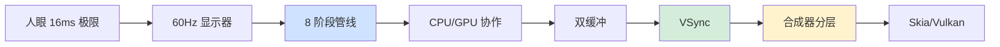
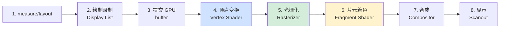
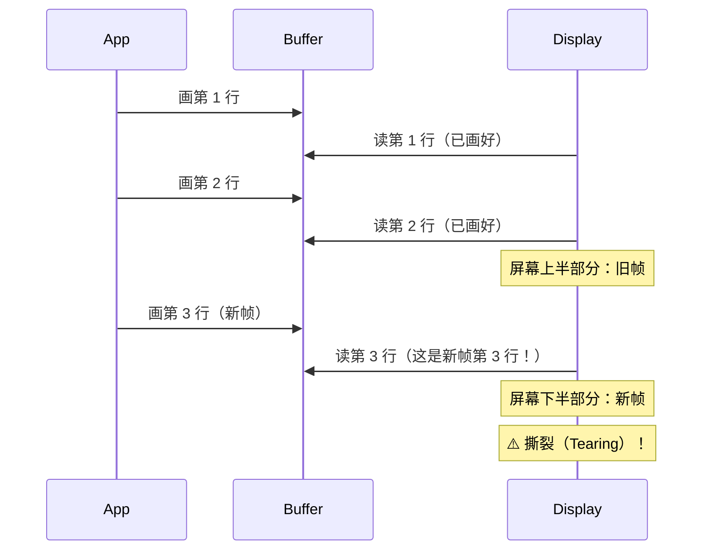
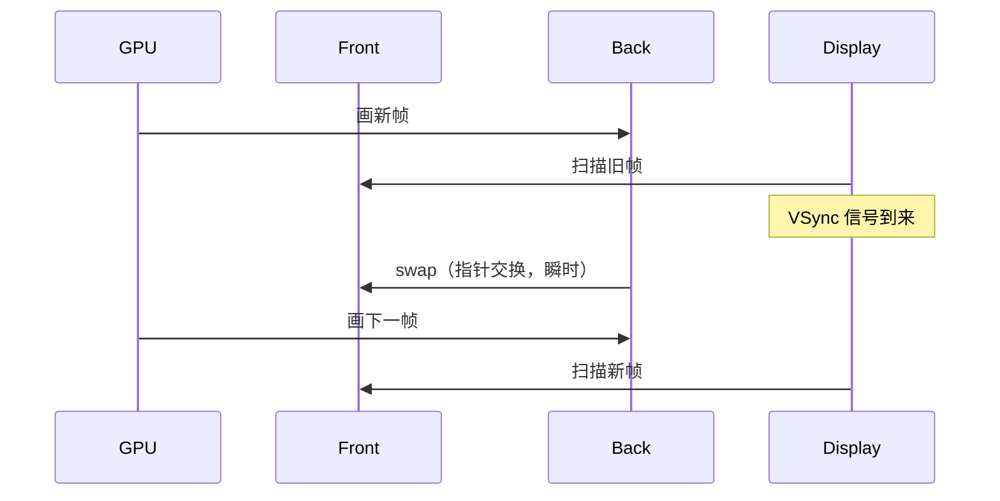
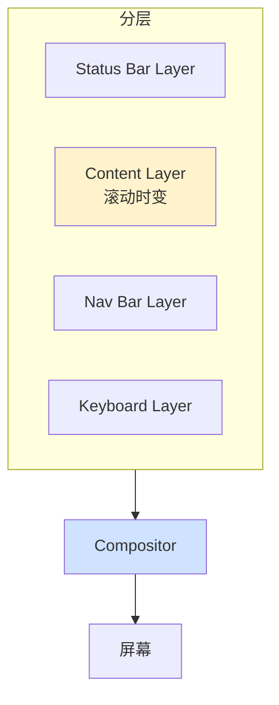
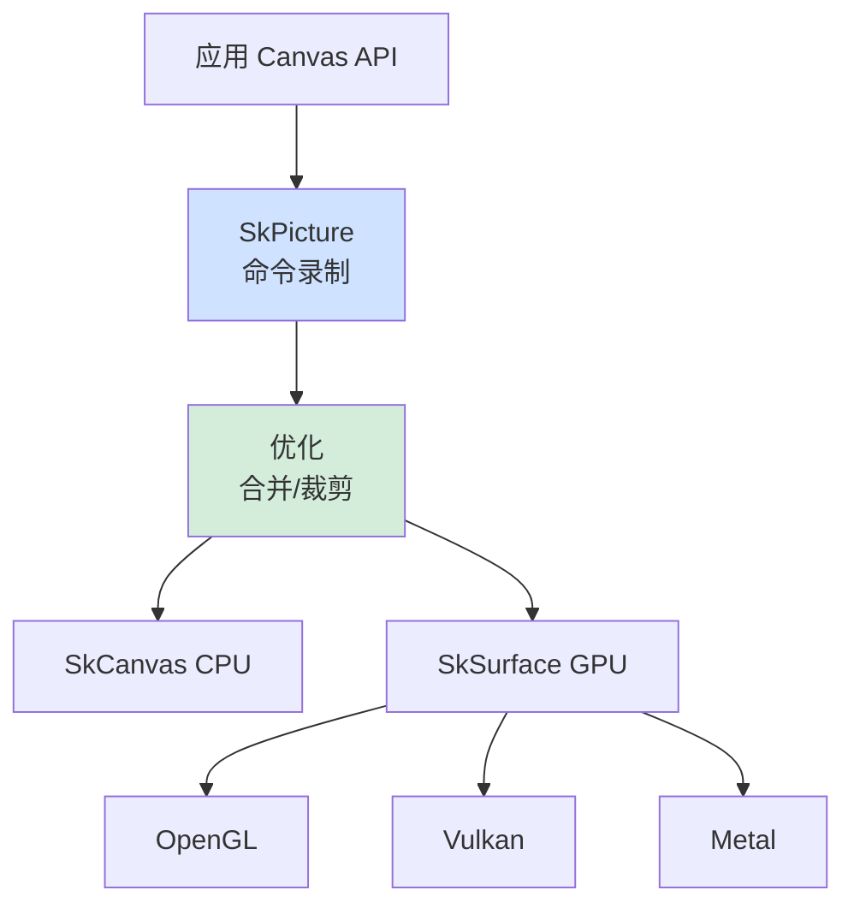
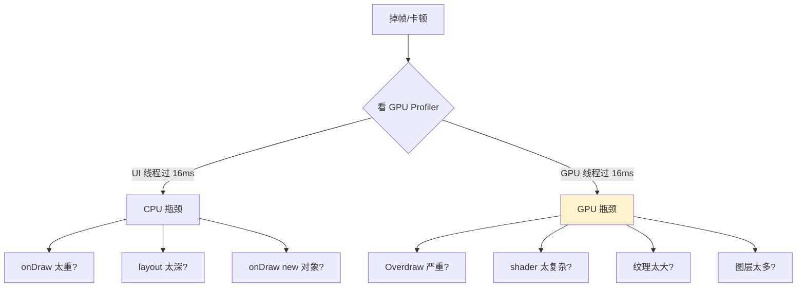

# 5.3 图形渲染管线原理

> 📍 **本篇位置**：第 5 卷 · 交互与系统 · 第 3 篇
> 🎯 **核心矛盾**：**一个看似简单的"半透明阴影"动画，让 60fps 掉到 30fps；CPU 不忙、内存不缺、代码"看上去没问题"——为什么？因为帧不是"算出来"的，是"流水线流出来"的，任何一个环节卡 1ms，整条管线都会塌方**
> 🧭 **设计灵魂**：屏幕上每一个像素都经过 **CPU → Display List → GPU → 顶点变换 → 光栅化 → 片元着色 → 合成 → 显示** 的 8 阶段流水线。**理解渲染 = 理解每一阶段的"瓶颈位置"和"工程取舍"**——为什么有 VSync、为什么要双缓冲、为什么 OpenGL 被 Vulkan 取代
> 🌐 **跨平台覆盖**：Android Skia/HWUI · iOS Core Animation/Metal · Web Blink/Skia · Flutter Skia/Impeller · Chromium Compositor · Game Engine（Unity/Unreal）
> 🔗 **延伸阅读**：← [5.2 视图加载渲染设计](./5.2.视图加载渲染设计.md) · → [5.4 手势事件设计灵魂](./5.4.手势事件设计灵魂.md) · → [5.5 消息机制设计思想](./5.5.消息机制设计思想.md)

---

> 5.2 我们看到了"视图加载渲染"在框架层做了什么——measure / layout / draw 三阶段。但 draw 之后呢？**像素是怎么从一段 Canvas 命令变成屏幕上发光点的？**
>
> 这是大多数应用层程序员的"知识断崖"——以为"调用 draw 就是渲染了"，遇到掉帧就懵。本篇要把"应用 draw → 屏幕发光"这条完整路径走一遍，揭开 GPU 管线、双缓冲、VSync、合成器、Skia 的所有底层秘密。

#### 目录介绍
- [00.真实事故引入](#00真实事故引入)
- [01.像素的旅程：8阶段流水线](#01像素的旅程8阶段流水线)
- [02.双缓冲与VSync：撕裂卡顿权衡](#02双缓冲与vsync撕裂卡顿权衡)
- [03.合成器Compositor：分层渲染革命](#03合成器compositor分层渲染革命)
- [04.OpenGL到Vulkan：图形API代际更替](#04opengl到vulkan图形api代际更替)
- [05.Skia：跨平台2D渲染事实标准](#05skia跨平台2d渲染事实标准)
- [06.跨平台渲染架构对照](#06跨平台渲染架构对照)
- [07.经典陷阱与生产级反模式](#07经典陷阱与生产级反模式)
- [08.一句话总结](#08一句话总结)

---

## 00.真实事故引入

### 0.1 半透明阴影让60fps阥0.5倍

我曾经接到一个奇怪的性能 bug。Android App 首页有个"卡片飞入"动画——卡片底部带半透明阴影。设计师反馈：

> "新版本明显卡顿，旧版本流畅。但我对比代码——只是阴影颜色从灰改成半透明灰啊？"

我让他打开 GPU Profiler（开发者选项里的"GPU 呈现模式分析"），结果惊人：

```
旧版本（不透明阴影）：每帧 8 ms，稳定 60 fps
新版本（半透明阴影）：每帧 32 ms，掉到 30 fps

CPU 占用：低（< 20%）
内存：正常
GC：正常
```

**新人的反应**：

```
"半透明就多了一个 alpha 通道而已，能差 4 倍？？"
"会不会是 Bitmap 没复用？"
"会不会是阴影模糊算法太重？"
```

我们排查了 4 小时——直到打开 **Overdraw 调试**（"调试 GPU 过度绘制"）。屏幕一打开变成五颜六色：

```
绿色：1 次绘制
浅红：2 次绘制
红色：3 次绘制
深红：4+ 次绘制 ← 卡片区域全是深红！
```

**真相浮现**：

```
半透明意味着每个像素要"混合"——
GPU 必须先读取背景色 → 与卡片色按 alpha 混合 → 写回
而且半透明区域不能被"遮挡剔除"——下层像素也必须画

结果：原本 1 次写入的像素，要画 4 次（背景层 + 卡片层 + 阴影层 + 文字层）
GPU 的 fillrate（填充率）瞬间被打满
```

**修复仅一行**：

```xml
<!-- 把"阴影 + 卡片"提前合成成一张不透明 bitmap -->
<View android:layerType="hardware" />
```

```
让 Android 在硬件层把这一组 View 预合成一次
之后每帧只需要"贴一张图"——overdraw 从 4 降到 1
fps 立刻回到 60
```

**这次救火让我们刻骨铭心地体会到**——**渲染性能的瓶颈，在大多数情况下不是 CPU、不是内存，而是 GPU 的 fillrate**。而要看到这一点，必须懂 GPU 流水线。

### 0.2 看似60fps列表profiler报丢帧

另一个故事。我在 Flutter 开发一个图片列表，肉眼"流畅"，但用 DevTools 的 Performance Overlay 看：

```
红色条频繁出现 = 单帧超过 16ms
但用户视觉上没感觉卡顿

为什么？
```

打开 GPU Timeline：

```
帧 1：UI 线程 8ms，GPU 线程 5ms ✓
帧 2：UI 线程 6ms，GPU 线程 22ms ✗ ← GPU 超时
帧 3：UI 线程 7ms，GPU 线程 4ms ✓
帧 4：UI 线程 6ms，GPU 线程 18ms ✗
```

**根因**：**GPU 线程"瞬时丢帧"**——加载新图片时，GPU 要把图片纹理上传到显存，这个操作单帧约 20ms，但因为肉眼帧率约 30fps（用户感知不到 60→30 的降级），所以"看起来"流畅。

**修复**：

```dart
// 预加载下一屏图片到 GPU 纹理
precacheImage(NextImage, context);
```

**这次让我意识到**——**渲染管线是分阶段的，每个阶段都可能成为瓶颈**。CPU 慢 = 一种症状，GPU 慢 = 另一种症状，纹理上传慢 = 第三种症状——治疗方案完全不同。

### 0.3 灵魂三问

这两个事故让我反复追问：

1. **为什么 16ms 是道生死线？这个数字哪里来的？** —— 它和人眼有什么关系？和硬件有什么关系？
2. **为什么"半透明"就让性能暴跌？这背后的硬件机制是什么？** —— GPU 内部到底在做什么
3. **为什么 60fps 是"流畅"的标准，但 ProMotion / 高刷新率显示器 120Hz 又必须做？** —— 帧率追求的本质是什么

### 0.4 五个层层递进的追问

要把"渲染管线"讲透，需要递进回答：

1. **像素到屏幕到底要经过几道关？** —— 8 阶段流水线
2. **为什么需要双缓冲？** —— 撕裂的物理本质
3. **VSync 是什么？为什么没它会撕裂？** —— 显示器的固定刷新节拍
4. **合成器为什么是现代 UI 的"必备"？** —— 分层的工程价值
5. **OpenGL 为什么被 Vulkan/Metal 取代？** —— 图形 API 的代际矛盾

### 0.5 探索路径



### 0.6 为何这个问题值得讲透

我想抛三个问题：

1. **为什么 90% 的应用层程序员对"渲染"是黑盒？** —— 因为 framework 屏蔽得太好——直到出问题才暴露。
2. **为什么 Flutter 选择自绘引擎而不是用原生 View？** —— 因为原生 View 的渲染管线"约束太多"，自绘才能控制每个像素。
3. **为什么游戏引擎和 UI 框架的渲染思路差异巨大？** —— 因为它们对帧率/精度/灵活性的取舍完全不同。

读完本章你会懂：**渲染不是"画图"——它是一条精密的工业流水线，每个阶段都有自己的物理约束和工程取舍**。

---

## 01.像素的旅程：8阶段流水线

### 1.1 从Text(Hello)到屏幕发光



**每一阶段的功能与可能的瓶颈**：

| 阶段 | CPU/GPU | 做什么 | 典型瓶颈 |
|---|---|---|---|
| 1. measure/layout | CPU | 算每个 View 的大小和位置 | 嵌套深、复杂布局 |
| 2. 绘制录制 | CPU | 把"画什么"录成命令列表 | onDraw 里太多对象 |
| 3. 提交 GPU | CPU→GPU | 把命令传到 GPU 端 | 大量小对象的命令 |
| 4. 顶点变换 | GPU | 计算每个顶点的屏幕坐标 | 顶点过多 |
| 5. 光栅化 | GPU | 把三角形变成像素 | 过度绘制 |
| 6. 片元着色 | GPU | 计算每个像素的颜色 | shader 太复杂 / fillrate 满 |
| 7. 合成 | GPU | 把多个图层贴到一起 | 图层过多 |
| 8. 显示 | 硬件 | 把帧 buffer 内容扫描到屏幕 | VSync 错过 |

### 1.2 16ms 是怎么来的？

**§0.4 第一题答案**。为什么是 16ms？

**人眼的极限**：

```
20-30 fps：感觉到"动画"
40-50 fps：感觉到"流畅"
60 fps：达到"非常流畅"
120 fps：感觉"丝滑"（高刷设备）

→ 主流显示器都是 60Hz（每秒刷新 60 次）
→ 1000ms / 60 = 16.67ms
→ 这就是"每帧预算"
```

**16ms 内必须完成所有 8 个阶段**——超过就丢帧。

**这就是§0.6 第三题的答案**——**60Hz 是和硬件、人眼、能耗的共同妥协**。120Hz 给了"超流畅"但功耗翻倍——这是为什么 ProMotion 默认自适应（静止时 10Hz、动态时 120Hz）。

### 1.3 §0.4第二题：双缓冲为何必须

假设没有双缓冲——单缓冲场景：



**根因**：显示器以 60Hz 节拍**逐行扫描** buffer——但 GPU 写入和扫描没有同步，扫描时如果 GPU 正写到一半，就会出现"上半旧帧 + 下半新帧"的撕裂画面。

**双缓冲的解法**：

```
两个 buffer：Front buffer（屏幕正在显示的）+ Back buffer（GPU 正在画的）
GPU 画完 Back buffer
等到下一次 VSync（显示器扫描完）
两个 buffer 整体交换（swap）
新一帧瞬间整体出现，不会撕裂
```



### 1.4 GPU 是个"流水线工厂"

**§0.3 第二题答案**。GPU 内部到底在做什么？

GPU 的核心特点：**大规模并行**——上千个核心同时跑同一份代码（SIMD）：

```
CPU：4-32 个核，每个核很强（执行复杂逻辑）
GPU：1000-10000 个核，每个核简单（只能做向量运算）

→ CPU 适合：复杂逻辑、分支多、数据少
→ GPU 适合：简单逻辑、无分支、数据海量（图形渲染就是典型）
```

**Vertex Shader（顶点着色器）**：

```glsl
// 对每个顶点跑一遍——并行
attribute vec3 position;
uniform mat4 mvpMatrix;

void main() {
    gl_Position = mvpMatrix * vec4(position, 1.0);
}
```

**Fragment Shader（片元着色器）**：

```glsl
// 对每个像素跑一遍——并行（这就是为什么半透明这么贵）
varying vec4 color;

void main() {
    gl_FragColor = color;
}
```

**§0.3 第二题深入答案**——**半透明让性能暴跌的物理机制**：

```
不透明像素：直接写入
  片元着色器输出 → 写到帧 buffer

半透明像素：
  1. 读取帧 buffer 当前值（一次内存访问）
  2. 与新值按 alpha 混合（运算）
  3. 写回（一次内存访问）
  → 多了 2 次内存访问 + 运算

而且半透明区域不能"遮挡剔除"
  即使被上层遮住，下层也必须画
  → 浪费大量 fillrate
```

---

## 02.双缓冲与VSync：撕裂卡顿权衡

### 2.1 VSync 信号的物理本质

**显示器的固定节拍**：

```
60Hz 显示器：每 16.67ms 发出一次 VSync 信号
告诉系统："我开始扫描下一帧了，请准备好新帧"
```

**Android 的 Choreographer**——把 VSync 信号转化为应用层节拍：

```java
Choreographer.getInstance().postFrameCallback(new FrameCallback() {
    public void doFrame(long frameTimeNanos) {
        // 在每次 VSync 到来时被调用
        // 应用 layout / draw 都从这里出发
    }
});
```

**iOS 的 CADisplayLink**——同等机制：

```swift
let displayLink = CADisplayLink(target: self, selector: #selector(step))
displayLink.add(to: .current, forMode: .default)
```

### 2.2 双缓冲 vs 三缓冲

**双缓冲的问题——丢帧时的"卡顿"**：

```
帧 1：GPU 在 16ms 内画完 Back buffer ✓
       VSync 来了 → swap → 显示
帧 2：GPU 画了 18ms（超时 2ms）
       VSync 来了但 Back buffer 没画完
       → 这一次 VSync 错过 → 屏幕显示旧帧（卡顿一帧）
       → 下一次 VSync 才能 swap
       → 实际新帧延迟了 16ms 才显示
```

**三缓冲的解法**：多一个 buffer 让 GPU 有"预留时间"：

```
Front buffer：正在扫描
Back buffer A：上一帧画好的
Back buffer B：GPU 正在画

帧 N：GPU 画 buffer B
       VSync 来 → swap A 上去显示（不等 B）
帧 N+1：GPU 继续画 B 或者画 A
       VSync 来 → swap B 上去
```

**代价**：多一个 buffer 内存（1080p×4 字节 ≈ 8MB）+ 延迟增加 16ms（buffer 多了一层）。

**取舍**：

```
游戏：常用三缓冲（追求流畅）
UI：常用双缓冲（追求低延迟，触摸响应快）
VR：双缓冲 + 异步时间扭曲（延迟必须 < 20ms 否则晕动症）
```

### 2.3 VSync 的副作用：输入延迟

```
用户触摸屏幕（t=0）
应用收到事件（t=2ms）
draw 命令录制（t=8ms）
GPU 渲染（t=12ms）
等 VSync（t=16ms）
显示在屏幕（t=16ms）

→ 端到端延迟 ~16ms
```

**游戏机的"延迟优化"**：

```
关闭 VSync（容忍撕裂）+ 高帧率（240fps）
→ 延迟降到 ~4ms
→ 竞技游戏选手宁愿撕裂换响应
```

### 2.4 帧调度的"三段式"

Android 一帧的具体阶段：

```mermaid
gantt
    title 一帧的 16ms 预算
    dateFormat X
    axisFormat %s
    
    section UI 线程
    Input 处理     :a1, 0, 1
    Animation     :a2, 1, 2
    Measure/Layout :a3, 2, 4
    Draw 录制      :a4, 4, 6
    
    section RenderThread
    Sync GPU      :b1, 6, 7
    GPU 执行      :b2, 7, 14
    
    section 显示
    VSync         :c1, 16, 17
```



**关键观察**：

```
UI 线程（CPU）和 RenderThread（GPU 端）可以并行
但下一帧的 UI 线程要等当前帧的 GPU sync
→ "GPU 慢"会反向卡 UI 线程
```

---

## 03.合成器Compositor：分层渲染革命

### 3.1 §0.4第四题：为何需要分层

**朴素思路**：所有内容画到一张大画布上。

**问题**：

```
状态栏：基本不变
内容区：滚动时变
导航栏：基本不变
键盘：弹起时变

每帧都重画全部 → 90% 是无效绘制
```

**分层思路**：

```
每个"基本独立变化的区域"放一个图层（Layer）
GPU 把每个图层画到自己的纹理（texture）
最后合成器把所有纹理"贴在一起"
```



**优势**：

```
1. 滚动时只重画 Content Layer——其他层是缓存的纹理
2. 合成是 GPU 硬件加速的——非常快
3. 动画流畅——比如 "fade out" 一个 Layer 只是改 alpha，不重画
```

### 3.2 硬件合成 vs 软件合成

**硬件合成**——专用硬件（HWC，Hardware Composer）：

```
SurfaceFlinger（Android）/ WindowServer（iOS）
直接利用显示控制器的"图层叠加"能力
不经过 GPU——能耗更低
```

**软件合成**——退回 GPU：

```
当图层数量超过硬件支持的上限（如 8 层）
当图层有复杂效果（旋转、透明、模糊）
HWC 不能处理 → 退回 GPU 用 Skia 合成
```

**Android 的优化策略**：

```
GraphicBuffer 准备好
HWC 优先：能直接合成的图层 → 硬件直接贴
不能的（如带 RoundedCorner）→ GPU 合成
最后所有结果合并到 framebuffer
```

### 3.3 过度绘制（Overdraw）

**§0.1 事故的根因**——过度绘制：

```
每个像素被画过几次：
  1 次：理想（绿）
  2 次：可接受（浅红）
  3 次：警惕（红）
  4+ 次：必须优化（深红）
```

**常见的 Overdraw 来源**：

```
1. 多层透明 View 叠加
2. 容器有背景色 + 子 View 也有背景色（背景被画两次）
3. 半透明的卡片 + 阴影 + 内容（4 次）
4. ScrollView + Item 都画自己的背景
```

**优化手段**：

```
1. 移除多余背景：clipChildren=true、移除 setBackground
2. 使用 ViewStub / RecyclerView 复用
3. 用 Layer Type Hardware 预合成静态部分
4. iOS：opaque=true（让系统知道下层不需要画）
```

### 3.4 §0.6第二题：Flutter为何自绘

```
原生 View 的渲染管线：
  开发者 → View 框架 → SurfaceFlinger → Skia → GPU
  
Flutter 的渲染管线：
  开发者 → Flutter Widget → 自己的 Skia → GPU

为什么自绘？
1. 跨平台一致性：Android/iOS 像素级一致
2. 控制每一帧的所有细节（动画曲线、合成顺序）
3. 不依赖系统 View 的"约束"
4. 自定义 shader 更灵活
```

**代价**：

```
1. App 包变大（带了一份 Skia）
2. 与原生交互成本高（PlatformChannel）
3. 无障碍、文本输入等系统能力要重新对接
```

---

## 04.OpenGL到Vulkan：图形API代际更替

### 4.1 OpenGL 的设计与局限

OpenGL（1992 年生）——**状态机式**：

```c
glBindBuffer(GL_ARRAY_BUFFER, vbo);
glEnable(GL_BLEND);
glBlendFunc(GL_SRC_ALPHA, GL_ONE_MINUS_SRC_ALPHA);
glDrawArrays(GL_TRIANGLES, 0, count);
```

**特点**：

```
驱动层有大量"全局状态"
应用调一个函数 → 驱动可能要做大量验证、转换
驱动是"黑盒"——开发者无法控制
```

**问题**：

```
1. 多线程友好性差——状态是全局的
2. 难以预测性能——驱动里发生了什么不知道
3. 跨平台兼容性差——各家实现差异大
```

### 4.2 Vulkan/Metal/DX12革命

**显式 API 时代**（2015+）：

```cpp
// Vulkan：每一步都是显式的
VkCommandBuffer cmd = AllocateCommandBuffer(...);
BeginCommandBuffer(cmd);
CmdBindPipeline(cmd, pipeline);
CmdBindVertexBuffers(cmd, ...);
CmdDraw(cmd, ...);
EndCommandBuffer(cmd);
SubmitToQueue(cmd);   // 显式提交
```

**核心变化**：

```
1. 显式 Command Buffer——可在多线程构建
2. 显式同步（fence、semaphore）——开发者控制
3. 没有全局状态——所有状态绑在 pipeline 对象
4. 接近硬件——开销小，但学习曲线陡
```

**§0.6 第三题答案**：

```
OpenGL：易用，但驱动层抽象成本高 → 移动端电池伤不起
Vulkan/Metal：显式，性能好，但开发难度高
→ 工业界的取舍：
  游戏引擎：Vulkan/Metal（性能优先）
  UI 框架：依然用 OpenGL ES（够用即可）
  Flutter：从 OpenGL 迁到 Impeller（自研引擎）
```

### 4.3 Apple Metal与移动端特殊性

Metal（2014）的设计哲学：

```
专为移动端 SoC 设计（CPU + GPU 共享内存）
统一内存：避免显式拷贝
并发命令构建：多线程友好
低开销：每次 draw call 几乎零驱动开销
```

**移动端的核心约束**：

```
1. 能耗——电池有限
2. 散热——发热即降频
3. 内存——统一内存有限

→ Metal 的设计全部围绕这三点
```

### 4.4 Flutter Impeller为何诞生

Flutter 早期用 Skia + OpenGL ES——遇到 **shader 编译卡顿**：

```
新画面第一次出现 → shader 即时编译 → 几十毫秒卡顿
"Janky 第一帧"问题严重
```

**Impeller 的解法**：

```
预编译 shader（构建期就生成）
基于 Metal/Vulkan
每次绘制都用预编译好的 pipeline
彻底消除 shader 编译卡顿
```

---

## 05.Skia：跨平台2D渲染事实标准

### 5.1 Skia 的统治地位

**用户列表（不完全）**：

```
Chrome/Chromium：Web 渲染
Android：HWUI 之下
Flutter：UI 引擎
Firefox：部分（WebRender 取代中）
LibreOffice：UI
Fuchsia OS：所有 UI
```

**为什么所有人都选 Skia？**

```
1. 开源（BSD 协议）
2. 跨后端：CPU / OpenGL / Vulkan / Metal / WebGPU
3. 命令录制 + 后端绘制分离
4. 文字、图片、几何、滤镜全功能
5. Google 持续投入 15+ 年
```

### 5.2 Skia 的核心架构



**录制 + 重放架构**：

```
应用调 canvas.drawRect / drawText
  → Skia 不立刻绘制，而是"录制"成 SkPicture
  → 等到提交时再"重放"到具体后端

好处：
1. 同一份命令可在 CPU 或 GPU 上重放
2. 可以离线优化（合并、裁剪、剔除）
3. 可序列化（用于跨进程传输）
```

### 5.3 Skia 与 GPU 的对接

```cpp
// Skia 的 GPU 后端伪代码
SkSurface* surface = SkSurface::MakeRenderTarget(grContext, ...);
SkCanvas* canvas = surface->getCanvas();

canvas->drawRect(rect, paint);   // Skia 命令
// → 内部转化为 GL/Vulkan 调用：
//   glBindFramebuffer(...)
//   glDrawArrays(GL_TRIANGLES, ...)
```

**Skia 的优化技巧**：

```
1. Atlas（图集）：把多个小纹理合成一张大纹理 → 减少切换
2. Path 合批：连续的同类型操作合成一个 draw call
3. Geometry caching：缓存路径转换为顶点的结果
```

### 5.4 命令录制的工程价值

```
应用层：每帧产生命令列表（16ms 预算）
Skia 层：优化命令列表（合并、裁剪、剔除）
GPU 层：执行优化后的命令

分工的好处：
应用关心"画什么"
Skia 关心"怎么高效画"
GPU 关心"硬件层执行"

每一层都聚焦自己的责任——这就是分层设计的力量
```

---

## 06.跨平台渲染架构对照

### 6.1 Android（Skia + HWUI）

```
View.draw()
  → DisplayListCanvas（命令录制）
  → RenderThread（异步执行）
  → Skia GPU 后端（OpenGL ES / Vulkan）
  → SurfaceFlinger（系统级合成）
  → HWComposer（硬件合成）
  → 屏幕
```

**核心机制**：

```
1. UI 线程和 RenderThread 解耦——主线程只录命令
2. SurfaceFlinger 是系统进程——所有 App 共用
3. HWComposer 是硬件——能耗最低
```

### 6.2 iOS（Core Animation+Metal）

```
UIView 设置属性
  → CALayer（隐式动画）
  → Render Server（独立进程）
  → Core Animation 合成
  → Metal 渲染
  → 屏幕
```

**核心机制**：

```
1. Layer 是渲染单元（不是 View）
2. Render Server 独立进程——主进程崩溃不影响动画
3. 隐式动画——大量 UI 变化自动带动画
4. Metal 是统一后端
```

### 6.3 Web（Blink + Skia）

```
HTML/CSS → 解析 → Render Tree
  → Layout（计算盒模型）
  → Paint（生成绘制命令）
  → Layer Tree（合成层）
  → Compositor（GPU 进程）
  → Skia 绘制 → 屏幕
```

**Chrome 的多进程架构**：

```
Renderer Process：HTML 解析、Layout
GPU Process：Skia + 合成
Browser Process：界面 chrome

→ 即使 Renderer 崩溃，GPU 进程还能"显示最后一帧"
```

### 6.4 Flutter（Skia/Impeller+Engine）

```
Widget Tree → Element Tree → RenderObject Tree
  → Layer Tree（绘制录制）
  → Engine 提交到 GPU 线程
  → Skia/Impeller 渲染
  → Texture
  → 平台 View（PlatformView）合成
```

**Flutter 的特殊性**：

```
Widget 是声明式，每帧重建 → 但实际 RenderObject 复用
Layer Tree 是不可变快照——天然线程安全
```

### 6.5 游戏引擎（Unity/Unreal）

```
Game Loop（不依赖 VSync）
Scene Graph
  → 视锥剔除（cull）
  → 排序（透明物体后画）
  → Draw call 提交
  → GPU 渲染
  → SwapChain 交换
```

**与 UI 引擎的关键差异**：

```
UI：响应事件驱动（被动）
游戏：固定循环驱动（主动）

UI：节能优先（无变化不重画）
游戏：流畅优先（哪怕静止也保持 60+ fps）

UI：2D 为主
游戏：3D 为主，光照/阴影/物理
```

---

## 07.经典陷阱与生产级反模式

### 7.1 陷阱一：onDraw里new对象

```java
// ❌ 每帧 new 一个 Paint
@Override
protected void onDraw(Canvas canvas) {
    Paint paint = new Paint();   // 每秒 60 次！
    paint.setColor(Color.RED);
    canvas.drawRect(...);
}
```

**后果**：GC 频繁触发——每次 GC 都让帧抖动。

**修复**：Paint 提到字段，复用。

### 7.2 陷阱二：复杂 shader

```glsl
// ❌ 在 fragment shader 里做复杂运算
void main() {
    for (int i = 0; i < 100; i++) {
        // 复杂计算...
    }
}
```

**后果**：GPU fillrate 打满——半透明区域格外慢。

**修复**：把昂贵计算放到 CPU 或 vertex shader。

### 7.3 陷阱三：纹理过大或过多

```kotlin
// ❌ 加载 4096×4096 的图片
val bitmap = BitmapFactory.decodeResource(res, R.raw.huge)
```

**后果**：

```
4096×4096×4 字节 = 64MB 显存
GPU 内存压力大
纹理上传耗时（PCIe 带宽）
```

**修复**：

```kotlin
val options = BitmapFactory.Options().apply {
    inSampleSize = 4   // 缩小 4 倍
}
```

### 7.4 陷阱四：图层过多

```html
<!-- 每个元素都加 will-change 或 transform: translateZ -->
<div style="will-change: transform">...</div>
<div style="will-change: transform">...</div>
<!-- ... 几百个 -->
```

**后果**：每个图层一份纹理——显存爆炸 + 合成慢。

**修复**：只对真正需要独立动画的元素分层。

### 7.5 陷阱五：忽略RenderThread卡死

```java
// 在 onDraw 里访问磁盘
@Override
protected void onDraw(Canvas canvas) {
    Bitmap b = BitmapFactory.decodeFile(...);   // ⚠️ 阻塞 RenderThread
    canvas.drawBitmap(b, ...);
}
```

**后果**：RenderThread 卡 → 主线程后续帧也排队卡 → 一卡一片。

**修复**：异步加载、纹理预热。

### 7.6 陷阱六：动画用setLayoutParams

```java
// ❌ 用属性动画改 layout
ValueAnimator.ofInt(0, 100).addUpdateListener(a -> {
    view.getLayoutParams().width = (int) a.getAnimatedValue();
    view.requestLayout();   // 触发 measure/layout/draw 全套
});
```

**后果**：每帧走完整三阶段——CPU 爆。

**修复**：用 transform / scaleX——只走合成阶段。

### 7.7 陷阱七：iOS 不设置 opaque

```swift
// ❌ 不透明 View 没设 opaque
view.backgroundColor = .red   // 实际不透明
view.isOpaque = false        // 默认值——告诉系统"我可能透明"
```

**后果**：合成器必须画下层——浪费 fillrate。

**修复**：

```swift
view.isOpaque = true   // ★ 显式声明不透明
```

---

## 08.一句话总结

### 8.1 三层认知阶梯

```
第一层（知其然）：知道有 60fps、双缓冲、VSync
  ↓
第二层（知其所以然）：理解 8 阶段流水线、合成器、shader 原理
  ↓
第三层（知其将所以然）：能用 GPU Profiler 定位瓶颈、能选型自绘 vs 原生 vs 跨平台
```

读完本章后，你应该能回答开头§0.3 提出的三个问题：

1. **16ms 哪里来？** → 60Hz 显示器的硬约束 + 人眼流畅阈值的共同妥协。
2. **半透明为什么暴跌？** → 强制混合（多 2 次内存访问）+ 不能遮挡剔除（多次重画）。
3. **60fps 是流畅，120Hz 又必须？** → 60 是流畅基线，120 是"超流畅"，但能耗翻倍——所以现代设备用自适应策略。

### 8.2 渲染瓶颈定位决策树



### 8.3 七字真言

1. **16ms 是死线**——一帧一阶段都不能错。
2. **GPU 流水线**——每阶段都可能成瓶颈。
3. **VSync 防撕裂**——用延迟换稳定。
4. **分层换性能**——以空间换时间。
5. **半透明是奢侈品**——不滥用。
6. **onDraw 不 new**——避免 GC 风暴。
7. **用 Profiler 定位**——不靠直觉优化。

### 8.4 与下篇的承接

至此**渲染管线**这一难题被拆解清楚——8 阶段流水线、双缓冲、VSync、合成器、Skia、Vulkan/Metal 全部串通。

下一篇 [5.4 手势事件设计灵魂](./5.4.手势事件设计灵魂.md) 我们要回到"用户输入侧"——**触摸点是怎么变成 onClick 的？多指手势的状态机是怎么搭的？为什么父 View 能"抢走"子 View 的事件？**

---

## 🔗 延伸阅读

- 同卷上篇：[5.2 视图加载渲染设计](./5.2.视图加载渲染设计.md)
- 同卷下篇：[5.4 手势事件设计灵魂](./5.4.手势事件设计灵魂.md) ｜ [5.5 消息机制设计思想](./5.5.消息机制设计思想.md)
- 经典文献：
  - *Real-Time Rendering*（Akenine-Möller et al.）—— 渲染圣经，第 4 版
  - *GPU Gems* 系列（NVIDIA）—— GPU 编程经典案例集
  - *The Graphics Codex*（Morgan McGuire）—— 现代图形 API 的权威解读
  - *Filament Material Guide*（Google）—— PBR 渲染原理
  - *Skia 官方文档与博客*（skia.org）—— Skia 设计哲学
  - *Building Flutter's Impeller*（Flutter Team）—— shader 预编译方案
  - *iOS Core Animation: Advanced Techniques*（Nick Lockwood）—— Layer 渲染机制
  - *Inside the GPU*（NVIDIA Developer Blog）—— 现代 GPU 架构

