# 02.组件化方案的设计

> **本篇定位**：架构（01 篇）解决的是"代码该写在哪一层"，组件化解决的是"代码该写在哪一个仓库 / 模块"。本文从一个真实的协作灾难讲起，回答三个问题——**为什么要做组件化？业界三家做法怎么选？拆到什么粒度才算合理？**

#### 目录介绍
- [01.一个协作的灾难](#01一个协作的灾难)
  - [1.1 团队的真实困境](#11-团队的真实困境)
  - [1.2 单体仓库的代价](#12-单体仓库的代价)
  - [1.3 组件化的契机](#13-组件化的契机)
- [02.要解决的核心矛盾](#02要解决的核心矛盾)
  - [2.1 编译效率瓶颈](#21-编译效率瓶颈)
  - [2.2 协作冲突频发](#22-协作冲突频发)
  - [2.3 复用与解耦失衡](#23-复用与解耦失衡)
  - [2.4 组件化的本质](#24-组件化的本质)
- [03.业界主流方案](#03业界主流方案)
  - [3.1 三种思路溯源](#31-三种思路溯源)
  - [3.2 横向对比矩阵](#32-横向对比矩阵)
  - [3.3 模块化与组件化](#33-模块化与组件化)
- [04.组件化设计原则](#04组件化设计原则)
  - [4.1 单向依赖法则](#41-单向依赖法则)
  - [4.2 职责单一边界](#42-职责单一边界)
  - [4.3 接口下沉策略](#43-接口下沉策略)
  - [4.4 拆分粒度判断](#44-拆分粒度判断)
- [05.组件化架构落地](#05组件化架构落地)
  - [5.1 整体分层结构](#51-整体分层结构)
  - [5.2 组件依赖规范](#52-组件依赖规范)
  - [5.3 组件拆分决策](#53-组件拆分决策)
- [06.组件间通信方案](#06组件间通信方案)
  - [6.1 业务调用案例](#61-业务调用案例)
  - [6.2 三种通信方式](#62-三种通信方式)
  - [6.3 路由方案落地](#63-路由方案落地)
  - [6.4 SPI 服务发现](#64-spi-服务发现)
  - [6.5 事件总线场景](#65-事件总线场景)
  - [6.6 选型对比矩阵](#66-选型对比矩阵)
- [07.组件化常见陷阱](#07组件化常见陷阱)
  - [7.1 过度拆分反例](#71-过度拆分反例)
  - [7.2 循环依赖反例](#72-循环依赖反例)
  - [7.3 接口爆炸反例](#73-接口爆炸反例)
  - [7.4 版本治理反例](#74-版本治理反例)
- [08.组件化演进路线](#08组件化演进路线)
  - [8.1 V1 单体起步](#81-v1-单体起步)
  - [8.2 V2 模块化分包](#82-v2-模块化分包)
  - [8.3 V3 组件化拆分](#83-v3-组件化拆分)
  - [8.4 V4 组件治理](#84-v4-组件治理)
- [09.总结与决策](#09总结与决策)
  - [9.1 拆分检查清单](#91-拆分检查清单)
  - [9.2 选型决策树](#92-选型决策树)


## 01.一个协作的灾难

### 1.1 团队的真实困境

某 App 团队从 2018 年发展到 2022 年，代码量从 30 万行涨到 180 万行，团队从 8 人扩到 45 人。**业务还是那些业务，但每次发版越来越痛苦**：

- **冷编译耗时**：从最初的 90 秒涨到 18 分钟，开发改一行代码也要等 4 分钟增量编译
- **代码冲突**：每周平均出现 12 次合并冲突，最严重的一次有 7 个团队改同一个 BaseActivity
- **回归成本**：一个支付组的小改动，常常引发首页崩溃，全量回归测试要 2 天
- **新人上手**：新员工平均需要 3 周才能独立提交代码

### 1.2 单体仓库的代价

把单体仓库的痛点解构一下：

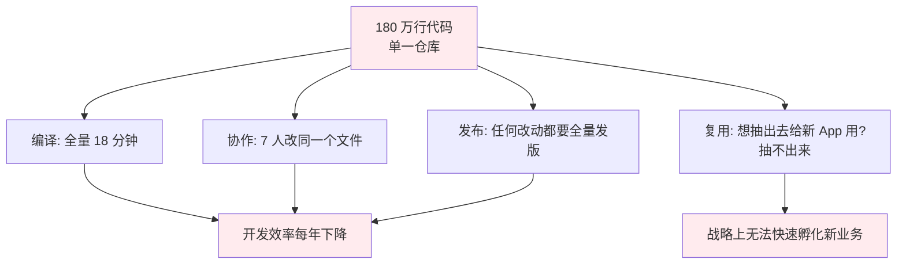

这就是为什么"组件化"会成为大型 App 团队的必经之路——它解决的不是代码层面的问题，而是**组织层面的问题**。

### 1.3 组件化的契机

那个团队最终下决心做组件化的真正契机是：**公司要孵化一个新 App，希望复用主 App 80% 的核心能力**。结果发现核心能力全部和主 App 的业务代码混在一起，**根本抽不出来**。

这是一个非常典型的"被业务推着改"的故事——组件化往往不是技术选择，而是业务发展的必然。

## 02.要解决的核心矛盾

### 2.1 编译效率瓶颈

为什么单体工程的编译时间会指数级增长？因为编译器需要为每次改动都做"全图依赖分析"。代码量翻倍，依赖图边数可能翻 4 倍。

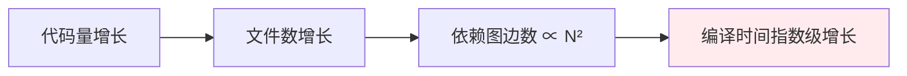

**组件化的破解**：把代码拆成多个独立编译单元（aar / framework / npm 包），改动一个组件只编译这一个组件，其他直接用缓存。

### 2.2 协作冲突频发

3 个人改同一个 `BaseActivity` 必然会冲突。**组件化通过"物理隔离"消除冲突**——每个组件一个仓库（或一个目录），每个团队只在自己的组件里写代码。

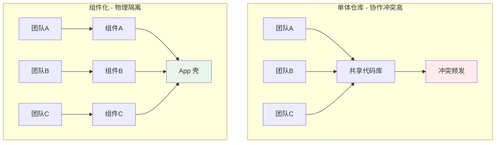

### 2.3 复用与解耦失衡

复用和解耦看似一对，其实是矛盾的。

- **强复用** 意味着大量代码被多处依赖，一改全身动 → 高耦合
- **强解耦** 意味着各模块互不依赖 → 难以复用

组件化通过**接口下沉**化解：把可复用的"能力"抽到下层基础组件（强复用），上层业务组件通过接口依赖（强解耦）。

### 2.4 组件化的本质

> **组件化 = 用物理边界（仓库 / 模块）固化逻辑边界（职责 / 依赖）**

它解决的是大团队、大代码库下的**组织复杂度**和**演进成本**问题。如果团队 < 10 人或代码 < 30 万行，**组件化的收益不如其成本**。

## 03.业界主流方案

### 3.1 三种思路溯源

**思路一：模块化（Module-based）**
最早出现于 90 年代的桌面软件。把代码按"功能领域"分包（如 user/order/payment），每个包独立编译。代表：Java 的 module、Android 的 library module。**重点是分包，不强调独立发布**。

**思路二：组件化（Component-based）**
2014 年前后由阿里巴巴、美团等大型 App 团队推动。每个业务组件独立成一个仓库，可以独立编译、独立测试、独立发布 aar/framework。代表：阿里 ARouter、美团 WMRouter。**重点是独立发布 + 路由通信**。

**思路三：微前端（Micro-frontend）**
2016 年由 ThoughtWorks 提出，把后端微服务的思想搬到前端。每个子应用是独立技术栈、独立运行时、独立部署。代表：qiankun、single-spa、Module Federation。**重点是运行时隔离 + 独立部署**。

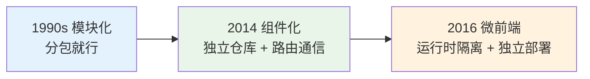

每一代方案都比前一代隔离得更彻底，但成本也更高。

### 3.2 横向对比矩阵

| 维度 | 模块化 | 组件化 | 微前端 |
|---|---|---|---|
| **隔离粒度** | 分包 | 独立 aar/framework | 独立运行时 |
| **是否独立发布** | ❌ | ✅ | ✅ |
| **是否独立部署** | ❌ | ❌（仍是同一个 App） | ✅ |
| **技术栈是否统一** | 必须统一 | 必须统一 | 可不同 |
| **通信成本** | 极低（直接调用） | 中（路由 / SPI） | 高（postMessage / Custom Event） |
| **接入成本** | 低 | 中 | 高 |
| **典型场景** | 中小型 App / 后端 | 大型 App | 大型 Web / 多团队 SaaS |
| **代表方案** | Gradle module | ARouter / WMRouter | qiankun / Module Federation |

### 3.3 模块化与组件化

很多团队搞不清楚模块化和组件化的区别。一句话：

> **模块化偏复用，组件化偏解耦 + 独立发布**

| 维度 | 模块化 | 组件化 |
|---|---|---|
| **关注点** | 代码逻辑划分 | 代码 + 编译 + 发布的全方位隔离 |
| **粒度** | 较粗（按业务领域） | 较细（按可独立交付的能力） |
| **典型形态** | 一个仓库下多个 module | 多个仓库 + 中央壳工程 |
| **能否独立运行** | 不能 | 可以单独跑成"组件壳" |

**关键判断**：如果你的团队还在为"代码该放哪个目录"纠结，先做模块化；如果已经为"编译慢 + 协作冲突"头疼，再上组件化。

## 04.组件化设计原则

### 4.1 单向依赖法则

组件化最容易踩的坑是循环依赖。一旦组件 A 依赖 B、B 依赖 A，独立编译就成了笑话。

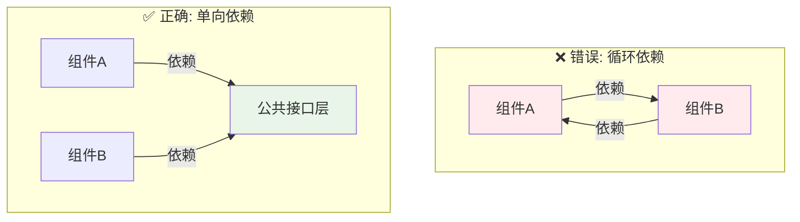

**铁律**：**业务组件之间永远不能直接依赖，必须通过公共接口层或路由间接调用**。

### 4.2 职责单一边界

每个组件应该只为"一类业务变化"负责。判断标准：**如果这个组件需要改动，触发它改动的团队是不是同一个？**

| 反例 | 问题 | 正确做法 |
|---|---|---|
| "通用业务组件"包含登录 + 支付 + 个人中心 | 三个团队都要改它，高频冲突 | 拆成 3 个独立组件 |
| "工具组件"既有日期工具又有网络工具 | 改网络要发布工具组件，影响所有使用方 | 工具按领域拆分 |

### 4.3 接口下沉策略

业务组件 A 想调用业务组件 B 的能力，怎么办？**不要让 A 依赖 B**，而是把 B 提供的能力抽成接口下沉到公共层。

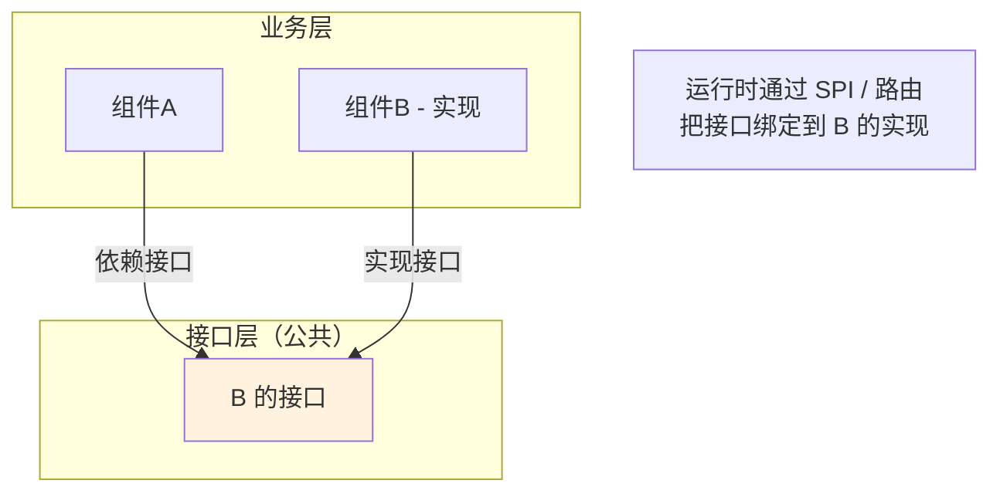

**好处**：A 不再知道 B 的存在，可以独立编译；B 即使被替换为 B2，A 也无感知。

### 4.4 拆分粒度判断

拆得太粗 → 组件化等于没做；拆得太细 → 维护成本爆炸。判断标准：

| 信号 | 说明 | 应该拆 |
|---|---|---|
| **不同团队负责** | 两块代码归属不同团队 | ✅ 必须拆 |
| **不同发布节奏** | A 要日发，B 是季发 | ✅ 必须拆 |
| **不同业务变化** | 改 A 的需求和改 B 的需求来自不同业务 | ✅ 推荐拆 |
| **可独立复用** | B 可以拿到另一个 App 复用 | ✅ 推荐拆 |
| **依赖关系清晰** | A 和 B 之间几乎不互调 | ✅ 推荐拆 |
| **代码量都很小** | A 和 B 加起来才 200 行 | ❌ 不要拆 |

## 05.组件化架构落地

### 5.1 整体分层结构

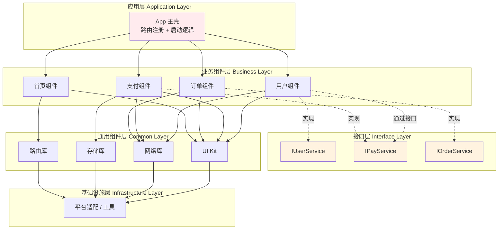

**为什么这样分层**：

- **App 壳**：薄薄一层，只做"路由注册 + 启动初始化"，不写业务
- **业务组件层**：彼此不直接依赖，通过接口层间接调用
- **接口层**：所有跨组件调用的契约，必须最稳定
- **通用组件层**：业务无关、可在任意 App 复用
- **基础设施层**：平台/语言级能力

### 5.2 组件依赖规范

| 依赖方向 | 是否允许 | 说明 |
|---|---|---|
| 应用层 → 业务组件层 | ✅ | 主壳组装业务 |
| 业务组件层 → 业务组件层 | ❌ | 必须通过接口层 |
| 业务组件层 → 接口层 | ✅ | 跨组件调用走这里 |
| 业务组件层 → 通用组件层 | ✅ | 复用通用能力 |
| 通用组件层 → 业务组件层 | ❌ | 严格反向，否则复用没意义 |
| 通用组件层 → 通用组件层 | ⚠️ | 谨慎，避免循环 |

把这张表写进 CI 检查脚本（如 dependency analyzer），**自动拦截违规依赖**，是保证组件化不腐坏的关键。

### 5.3 组件拆分决策

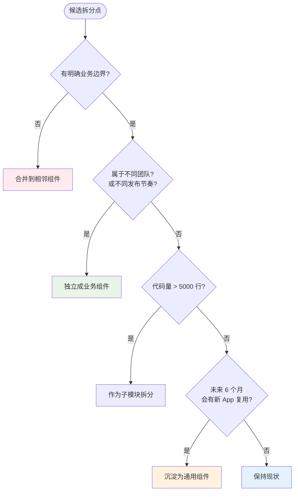

## 06.组件间通信方案

### 6.1 业务调用案例

来看一个真实场景，便于后续讨论选型：

> 用户在**首页组件 A** 看到一个商品，点击购买。系统需要：
> 1. **A 调用支付组件 C** 发起支付流程
> 2. **支付组件 C 调用用户组件 B** 检查实名认证状态
> 3. **支付组件 C 调用订单组件 D** 创建订单
> 4. **订单组件 D 完成后通知首页组件 A** 刷新角标

这个场景同时涉及"页面跳转""能力调用""跨组件通知"，非常典型。

### 6.2 三种通信方式

业界主流的组件间通信只有三种：

| 方式 | 用途 | 典型代表 |
|---|---|---|
| **路由（Router）** | 页面跳转 + 携带参数 | ARouter / WMRouter / Vue Router |
| **服务发现（SPI）** | 调用其他组件的"能力" | Java SPI / ARouter Service |
| **事件总线（EventBus）** | 一对多的通知 | EventBus / RxBus / LiveEventBus |

**核心原则**：**三者各司其职，不要混用**。最常见的反例是用 EventBus 处理本该用 SPI 的能力调用，导致依赖关系完全失控。

### 6.3 路由方案落地

路由解决"我要跳到另一个组件的页面"。本质是**用字符串 URL 替代类引用**，从而切断编译期依赖。

```typescript
// 注册（在组件 B 中）
@Route(path = "/user/profile")
class ProfileActivity { ... }

// 调用（在组件 A 中，A 不需要依赖 B）
Router.navigate("/user/profile", { userId: "123" })
```

**关键优势**：A 完全不知道 ProfileActivity 在哪里，B 可以随意改实现。

### 6.4 SPI 服务发现

SPI 解决"我要调用另一个组件的能力（不跳页面）"。本质是**接口定义在公共层，实现注册到全局服务表**。

```typescript
// 接口（在公共接口层）
interface IUserService {
  isVerified(userId: string): boolean;
}

// 实现（在用户组件 B）
@Service
class UserServiceImpl implements IUserService { ... }

// 调用（在支付组件 C，C 只依赖接口层）
const userService = ServiceRegistry.resolve<IUserService>("IUserService");
const verified = userService.isVerified("123");
```

**关键优势**：调用方只依赖接口，运行时才绑定实现，可以做 Mock、可以热替换。

### 6.5 事件总线场景

EventBus 解决"我做完一件事，要通知所有关心它的组件"。本质是**发布订阅模式**。

```typescript
// 订阅（在首页组件 A）
EventBus.on("ORDER_CREATED", (orderId) => refreshBadge());

// 发布（在订单组件 D）
EventBus.emit("ORDER_CREATED", orderId);
```

**适用场景**：一对多通知、解耦弱关系。
**绝对禁忌**：**不要用 EventBus 做"请求-响应"**——例如 A emit("getUser") 然后等 B emit("getUserResp")。这种用法 3 个月后就会变成"事件流满天飞"的灾难。

### 6.6 选型对比矩阵

| 场景 | 路由 | SPI | EventBus |
|---|---|---|---|
| 页面跳转 | ✅ 首选 | ❌ | ❌ |
| 同步调用能力 | ❌ | ✅ 首选 | ❌ |
| 异步广播通知 | ❌ | ❌ | ✅ 首选 |
| 一对一精确调用 | ⚠️ | ✅ | ❌ |
| 一对多通知 | ❌ | ❌ | ✅ |
| 是否阻塞调用方 | 是 | 是 | 否 |
| 是否需要返回值 | 否 | 是 | 否 |

回到 6.1 的真实场景：

| 步骤 | 选用方式 | 原因 |
|---|---|---|
| 1. A 调用 C 发起支付 | 路由 | 是页面跳转 |
| 2. C 调用 B 查实名 | SPI | 是同步能力调用，需要返回值 |
| 3. C 调用 D 创建订单 | SPI | 同上 |
| 4. D 通知 A 刷新角标 | EventBus | 一对多广播，A 不阻塞 D |

## 07.组件化常见陷阱

### 7.1 过度拆分反例

**反例**：某 30 万行代码的 App 被拆成 87 个组件，平均每个组件 3500 行。

**问题**：
- 一个简单业务需求要改 5 个组件，组件间通信代码比业务代码还多
- CI 跑 87 个组件的发布流水线，发版从 30 分钟变成 2 小时
- 新人光看组件依赖图就要 1 周

**教训**：组件数量应该和团队数量匹配。**1 个组件 ≈ 1 个团队 ≈ 1 万 ~ 3 万行代码**是相对舒服的尺度。

### 7.2 循环依赖反例

**反例**：用户组件依赖订单组件查"用户订单数"，订单组件依赖用户组件查"用户信息"。

**问题**：编译时就报错，无法独立发布任何一个。

**正确做法**：

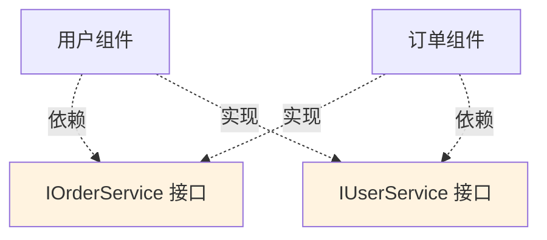

**两个接口都下沉到接口层**，业务组件之间永远只通过接口层互调。

### 7.3 接口爆炸反例

**反例**：团队规定"所有跨组件调用必须走 SPI"，结果接口层堆了 240 个接口，新人完全不知道有什么能力可用。

**教训**：接口层也需要治理：
- 按"领域"分包（user / order / payment / common）
- 接口必须有 README，写清楚谁实现、谁调用
- 已废弃的接口要明确 `@Deprecated` 并给出迁移路径

### 7.4 版本治理反例

**反例**：30 个组件各自发版本，主壳工程的依赖文件长达 300 行版本号，经常出现"组件 A 的 1.2 版本和组件 B 的 3.5 版本不兼容"。

**正确做法**：引入 **BOM（Bill of Materials）**机制——主壳只声明一个 BOM 版本，BOM 里固定一组互相兼容的组件版本。这是 Spring 和阿里开源系列普遍采用的方案。

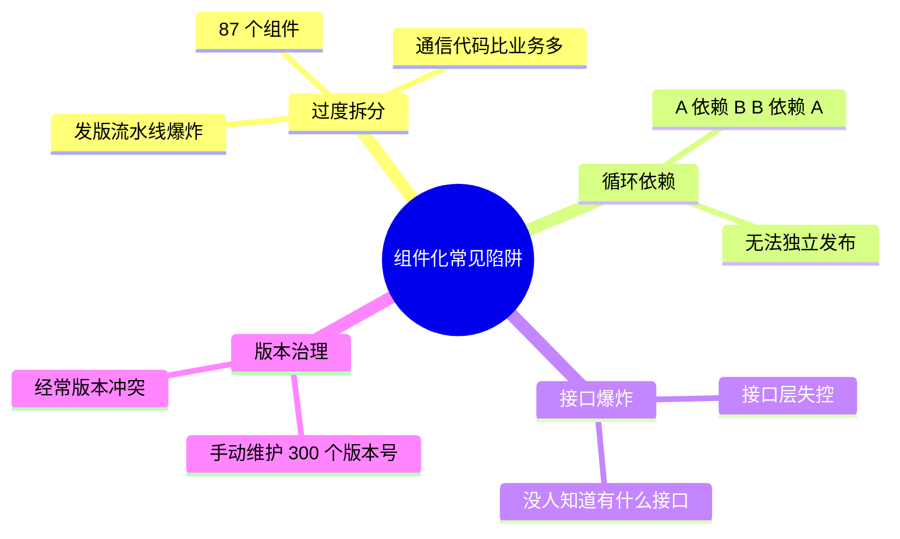

## 08.组件化演进路线

> 组件化不是一次性工程，而是 4 个阶段的渐进改造。下面是开篇那个 45 人团队的真实演进路径。

### 8.1 V1 单体起步

**规模**：8 人团队、30 万行代码、1 个仓库

**结构**：

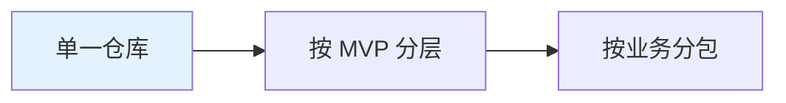

**痛点**：暂时没有，编译 90 秒可接受。
**何时该升级**：编译时间 > 5 分钟、团队 > 12 人。

### 8.2 V2 模块化分包

**规模**：18 人团队、80 万行代码、1 个仓库 + 多 module

**结构**：

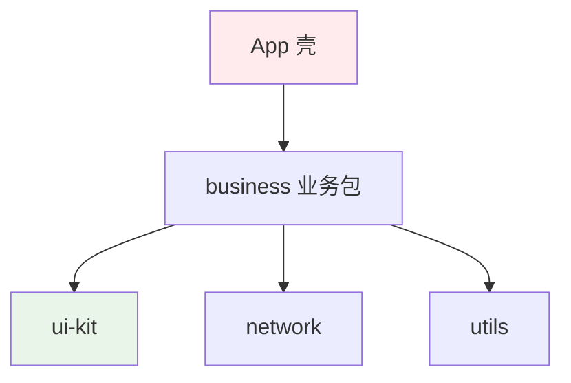

**做了什么**：抽出基础 module（UI / 网络 / 工具），但业务还在一个大 module 里。
**带来的收益**：基础设施跨项目复用、编译时间降到 8 分钟。
**何时该升级**：业务还在打架、编译时间又涨到 15 分钟、有跨 App 复用需求。

### 8.3 V3 组件化拆分

**规模**：35 人团队、140 万行代码、N 个仓库

**结构**：

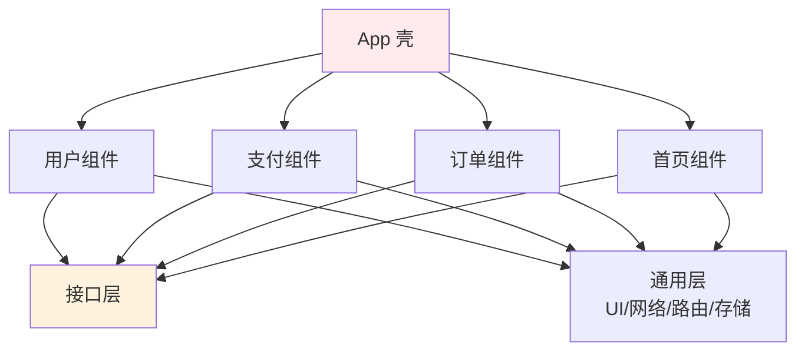

**做了什么**：业务拆成 4 个独立仓库，引入路由 + SPI + EventBus 三件套。
**带来的收益**：4 个团队完全并行、编译降到 3 分钟（独立组件 50 秒）、新 App 用 2 周就能搭起来。
**带来的痛**：通信成本上升、版本治理成为问题。

### 8.4 V4 组件治理

**规模**：45 人团队、180 万行代码、12 个组件仓库

**做了什么**：
- 引入 BOM 统一版本
- 接口层按领域分包并强制 README
- CI 加上"违规依赖检测"，自动拦截
- 每个组件独立 demo App，可单独运行调试

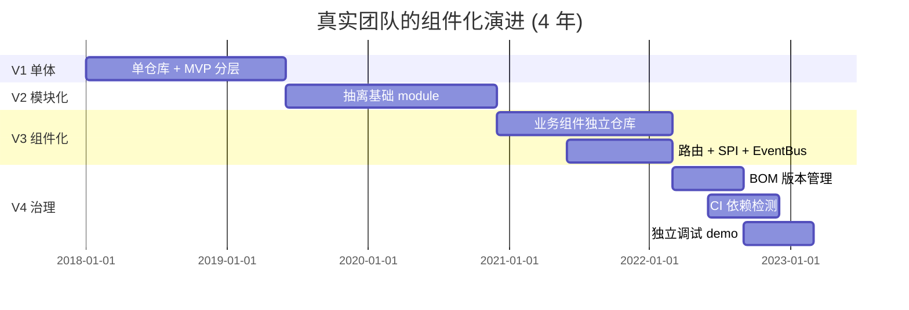

> ⚠️ **关键提醒**：这条演进路线走完用了 4 年。**任何想"一年搞定组件化"的计划都是危险的**——业务还在跑，改造必须渐进。

## 09.总结与决策

### 9.1 拆分检查清单

每次决定要不要拆一个组件，对照下面这张清单打分（≥ 3 项为是再拆）：

- [ ] 这块代码归属一个独立的团队
- [ ] 它有自己独立的发布节奏（如日发 vs 月发）
- [ ] 它的代码量 > 5000 行且仍在增长
- [ ] 未来 6 个月有跨 App 复用预期
- [ ] 它和其他业务的耦合点 ≤ 5 个
- [ ] 它的接口契约稳定，半年改不超过 2 次

### 9.2 选型决策树

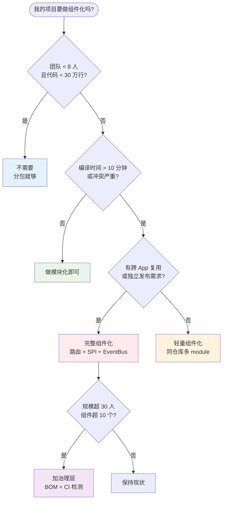

**最后一句话**：组件化不是技术潮流，是**当业务规模逼到你不得不做时才做的事**。回到本文开头那个 45 人团队，他们花 4 年走完 V1→V4，**真正的胜利不是组件多漂亮，而是孵化新 App 从 6 个月缩短到 6 周**。这才是组件化的商业价值。

> 好的组件化 = **让大团队像小团队一样灵活，让大代码库像小代码库一样好改**。
