# 06.配置中心设计方案

> **本篇定位**：配置中心是中台（05 篇）和插件化（03 篇）之外，**最高频使用的"动态化能力"**——它解决的是"我不想发版也能改 App / 服务行为"的问题。本文回答三个核心问题——**为什么硬编码配置必死？业界三家方案怎么选？怎么保证配置不出错也不丢？**

#### 目录介绍
- [01.一个配置的事故](#01一个配置的事故)
  - [1.1 一行错误的配置](#11-一行错误的配置)
  - [1.2 故障扩散过程](#12-故障扩散过程)
  - [1.3 反思配置管理](#13-反思配置管理)
- [02.要解决的核心矛盾](#02要解决的核心矛盾)
  - [2.1 硬编码的代价](#21-硬编码的代价)
  - [2.2 多环境管理](#22-多环境管理)
  - [2.3 实时生效需求](#23-实时生效需求)
  - [2.4 配置中心的本质](#24-配置中心的本质)
- [03.业界主流方案](#03业界主流方案)
  - [3.1 三大代表系统](#31-三大代表系统)
  - [3.2 横向对比矩阵](#32-横向对比矩阵)
  - [3.3 端侧配置场景](#33-端侧配置场景)
- [04.配置中心设计原则](#04配置中心设计原则)
  - [4.1 一致性原则](#41-一致性原则)
  - [4.2 可灰度原则](#42-可灰度原则)
  - [4.3 可回滚原则](#43-可回滚原则)
  - [4.4 兜底原则](#44-兜底原则)
- [05.整体架构落地](#05整体架构落地)
  - [5.1 整体架构图](#51-整体架构图)
  - [5.2 推拉模式选择](#52-推拉模式选择)
  - [5.3 客户端缓存策略](#53-客户端缓存策略)
  - [5.4 一致性保证](#54-一致性保证)
- [06.关键能力实现](#06关键能力实现)
  - [6.1 灰度下发](#61-灰度下发)
  - [6.2 多维度策略](#62-多维度策略)
  - [6.3 版本与回滚](#63-版本与回滚)
  - [6.4 权限与审批](#64-权限与审批)
- [07.常见陷阱与反例](#07常见陷阱与反例)
  - [7.1 配置失控反例](#71-配置失控反例)
  - [7.2 配置雪崩反例](#72-配置雪崩反例)
  - [7.3 配置滥用反例](#73-配置滥用反例)
- [08.演进路线](#08演进路线)
  - [8.1 V1 文件配置](#81-v1-文件配置)
  - [8.2 V2 简易配置中心](#82-v2-简易配置中心)
  - [8.3 V3 全功能配置中心](#83-v3-全功能配置中心)
- [09.总结与决策](#09总结与决策)
  - [9.1 配置上线检查表](#91-配置上线检查表)
  - [9.2 选型决策树](#92-选型决策树)


## 01.一个配置的事故

### 1.1 一行错误的配置

某金融 App 在 2020 年遭遇了一次 P0 事故。运营同学想把"新用户首日体验金额度"从 1000 元调到 1500 元，登录配置后台输入：

```
new_user_first_day_quota: 15000   # 多敲了一个 0
```

**点击发布**——配置 30 秒内推送到全部 App，30 秒后开始爆雷。

### 1.2 故障扩散过程

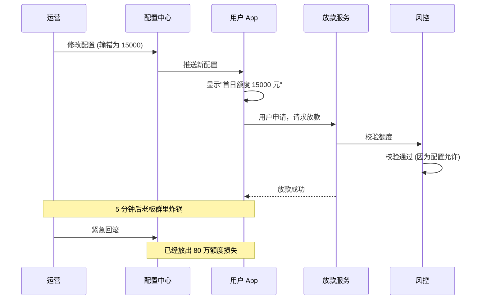

**总结**：从配置错误到全面爆发**只用了 5 分钟**。

### 1.3 反思配置管理

事后复盘发现，这个事故本可以避免——只需要任意一道防线生效：

| 防线 | 能否拦住 |
|---|---|
| 配置发布前的人工审批 | ✅ 但当时是"运营自助发布" |
| 配置值类型校验（金额范围） | ✅ 但当时配置值是裸字符串 |
| 灰度发布（先 1% 用户验证） | ✅ 但当时是全量推送 |
| 一键熔断 | ✅ 但当时熔断要走工单 |

**真正的根因**：**配置中心被设计成了"快速生效工具"，但忘了它本质是"生产环境变更"**。任何生产变更都应该有审批、灰度、回滚三道防线。

## 02.要解决的核心矛盾

### 2.1 硬编码的代价

如果不用配置中心，所有配置都写在代码里。这意味着：

| 场景 | 硬编码的代价 |
|---|---|
| 改个文案 | 重新发版 |
| 关掉一个功能 | 重新发版 |
| 切换支付渠道 | 重新发版 |
| 调整限流阈值 | 重新发版 |
| 紧急止血 | **来不及** |

App 端发版至少 1-7 天，服务端发布也要 30 分钟到几小时。**很多事故的损失发生在"代码修复完到上线生效"这段空白期**。

### 2.2 多环境管理

一个简单的"接口 URL"配置在不同环境是不同的：

| 环境 | 接口 URL |
|---|---|
| 本地开发 | http://localhost:8080 |
| 测试 | http://test-api.xxx.com |
| 预发 | http://pre-api.xxx.com |
| 生产 | https://api.xxx.com |

如果硬编码用 if-else 切，**部署时改一个就漏一个**——经典反例就是"测试环境上线生产 URL"。

### 2.3 实时生效需求

很多场景对配置的"生效速度"有强要求：

| 场景 | 时效要求 |
|---|---|
| 紧急关闭支付通道（防欺诈） | < 1 分钟 |
| 春晚红包流量切换 | < 30 秒 |
| 限流阈值调整 | < 10 秒 |
| 灰度新功能 | < 1 分钟 |

**传统重启服务读配置的方式根本来不及**。

### 2.4 配置中心的本质

> **配置中心 = 给"程序的运行时行为"开一个可控的远程开关**

它的核心价值有三：

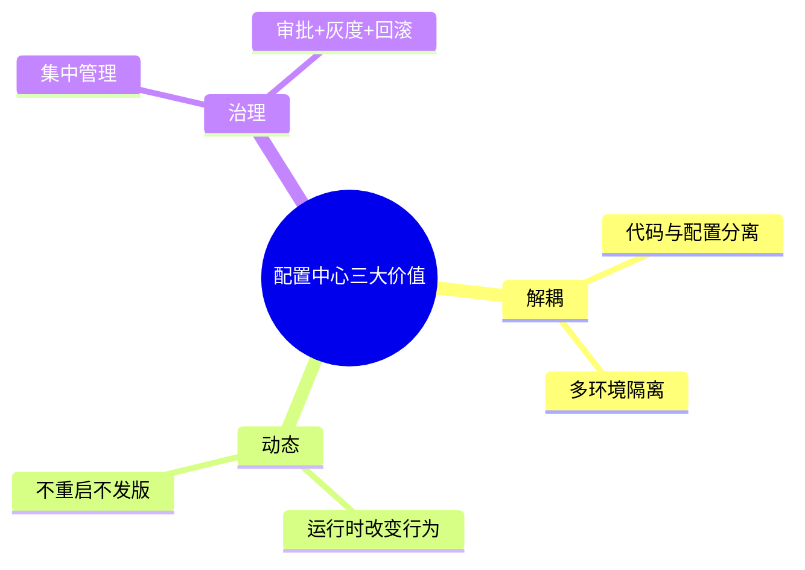

## 03.业界主流方案

### 3.1 三大代表系统

**Apollo（携程开源）**
最完整的开源配置中心，**功能最全**：多环境、多集群、灰度、权限、审计全有。架构相对重，依赖 MySQL + Eureka。

**Nacos（阿里开源）**
配置中心 + 注册中心二合一。**配置功能略简单于 Apollo，但和 Spring Cloud Alibaba 集成最好**。

**ZooKeeper / etcd**
不是专门的配置中心，但常被用作"基础数据存储"。**简单场景够用，但缺少前端管理、灰度、审计等能力**，需要自己开发上层。

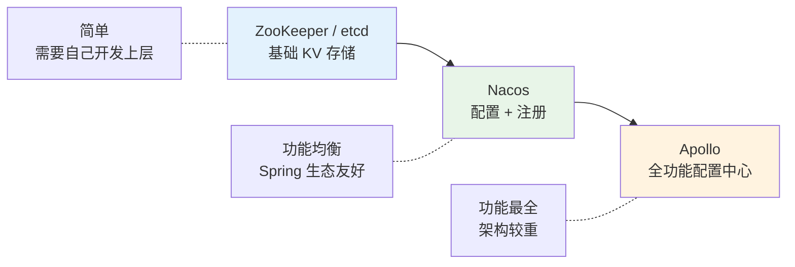

### 3.2 横向对比矩阵

| 维度 | Apollo | Nacos | ZooKeeper |
|---|---|---|---|
| **配置管理 UI** | ✅ 完善 | ✅ 完善 | ❌ 无 |
| **多环境** | ✅ 原生 | ✅ 通过 namespace | ⚠️ 自己实现 |
| **灰度发布** | ✅ 内置 | ⚠️ 简单 | ❌ |
| **配置审计** | ✅ | ✅ | ❌ |
| **权限管理** | ✅ 细粒度 | ⚠️ 较粗 | ❌ |
| **推送实时性** | 长轮询 1s | 长轮询 < 1s | Watch 实时 |
| **依赖** | MySQL+Eureka | MySQL+内置 | 无 |
| **适用场景** | 中大型企业 | Spring Cloud 生态 | 简单场景或自研基础 |
| **运维复杂度** | 高 | 中 | 低 |

### 3.3 端侧配置场景

**端侧（App 端）配置中心**和服务端有显著区别：

| 维度 | 服务端配置中心 | 端侧配置中心 |
|---|---|---|
| **客户端数量** | 几百到几千 | **千万级** |
| **网络环境** | 数据中心内网 | 公网 + 弱网 |
| **拉取频率** | 长连接秒级 | **必须降频拉取**（启动时 + 定时） |
| **失败容忍** | 报警人介入 | **必须有本地兜底** |
| **配置体积** | 不限 | < 100KB（流量考虑） |
| **代表系统** | Apollo / Nacos | Firebase Remote Config / 自研 |

端侧配置中心常见的额外要求：
- **首屏可用**：App 启动时必须能读到上次缓存的配置
- **CDN 加速**：用 CDN 分发减小服务压力
- **签名校验**：防止配置被中间人篡改
- **灰度策略要支持设备维度**（如按设备 ID hash、按版本号、按地区）

## 04.配置中心设计原则

### 4.1 一致性原则

**问题**：配置发布后，多个客户端在不同时刻读到不同的版本，业务出错。

**解决思路**：

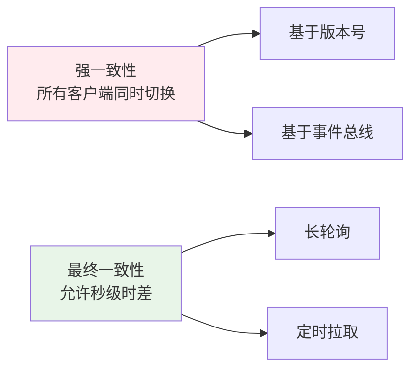

**关键决策**：99% 的场景**最终一致性就够**。只有"全局熔断开关"这种少数场景需要强一致。强求强一致会大幅增加架构复杂度。

### 4.2 可灰度原则

**任何配置变更都必须支持灰度发布**。灰度维度通常包括：

| 灰度维度 | 适用场景 |
|---|---|
| 按比例 | 通用流量灰度（如 1% → 10% → 50%） |
| 按用户 ID | 内部员工先体验 |
| 按设备版本 | 新版本 App 先开新功能 |
| 按地区 | 海外业务隔离 |
| 按机房 | 服务端机房灰度 |

### 4.3 可回滚原则

**回滚必须比发布更快**——通常要求 < 30 秒。

**实现要点**：
- 每次发布生成一个版本号
- 历史版本至少保留 90 天
- 一键回滚到任意历史版本（不需要重新填表）
- 回滚操作不需要审批（因为它必须够快）

### 4.4 兜底原则

**配置中心必须有"读不到也能跑"的兜底**：

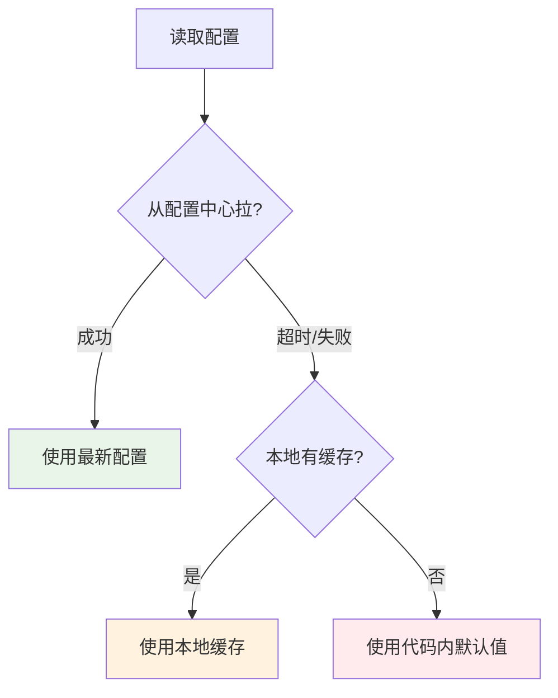

**铁律**：**配置中心挂了，业务系统不能跟着挂**。这是配置中心稳定性的最后一道防线。

## 05.整体架构落地

### 5.1 整体架构图

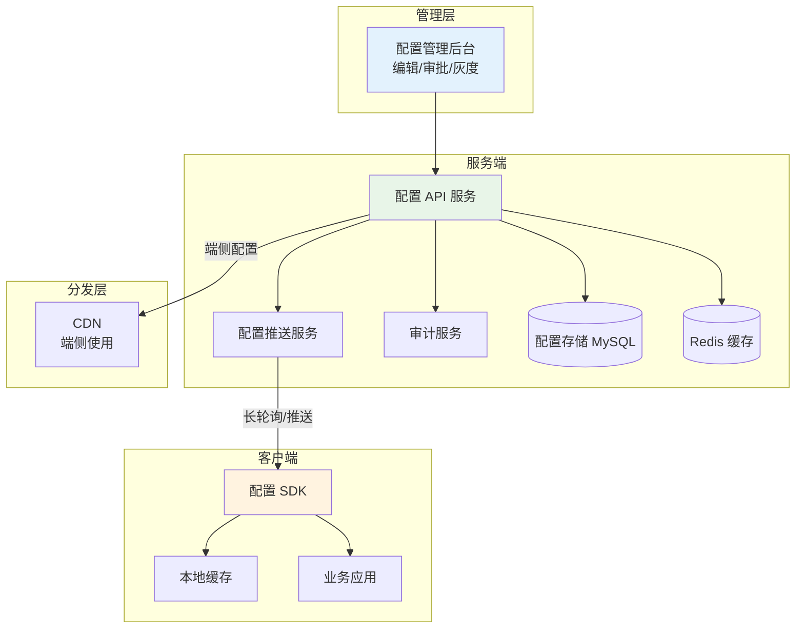

### 5.2 推拉模式选择

| 模式 | 实时性 | 服务压力 | 实现复杂度 | 适用场景 |
|---|---|---|---|---|
| **轮询** | 差（取决于间隔） | 高（无效请求多） | 低 | 不推荐 |
| **长轮询** | 中（秒级） | 中 | 中 | Apollo / Nacos 默认 |
| **WebSocket 推送** | 好（毫秒级） | 低 | 高 | 强实时场景 |
| **混合（推+拉兜底）** | 好 | 低 | 高 | 大规模生产 |

**推荐**：**长轮询 + 启动拉取**作为基线，特殊场景叠加 WebSocket。

### 5.3 客户端缓存策略

客户端必须维护三级数据：

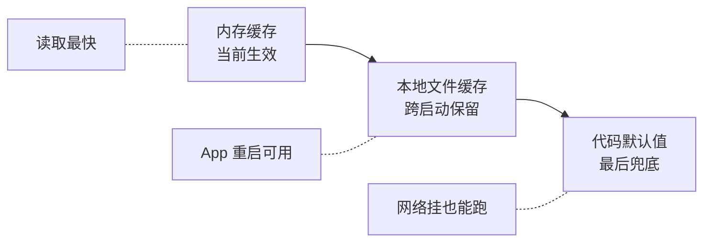

**铁律**：**内存改动后必须立即落盘**，否则 App 重启就丢了。

### 5.4 一致性保证

发布配置时怎么保证"全部客户端都收到"？

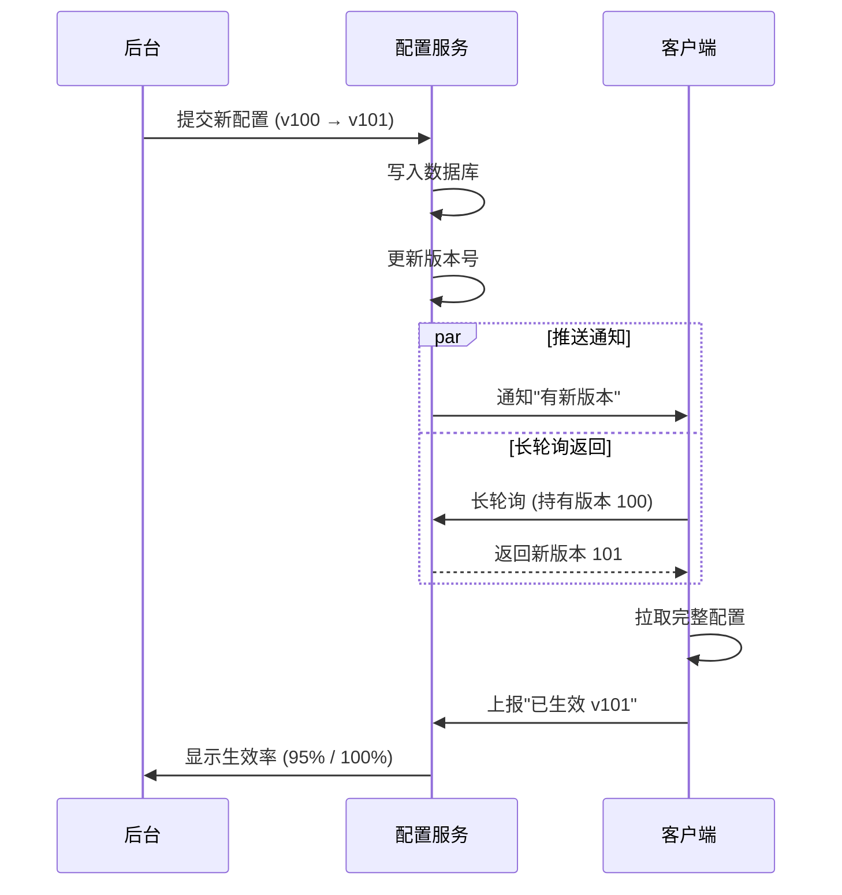

**关键设计**：客户端必须**上报生效状态**，后台才能看到"实际生效率"，从而决定是否继续灰度。

## 06.关键能力实现

### 6.1 灰度下发

灰度的核心是**让一部分客户端读到新版本，另一部分读到老版本**。常见实现方式：

```kotlin
// 客户端伪代码
fun shouldUseNewConfig(deviceId: String, grayRule: GrayRule): Boolean {
    return when (grayRule.type) {
        BY_PERCENTAGE -> hash(deviceId) % 100 < grayRule.percentage
        BY_USER_ID -> grayRule.userIds.contains(currentUserId)
        BY_VERSION -> appVersion >= grayRule.minVersion
        BY_REGION -> grayRule.regions.contains(currentRegion)
    }
}
```

**关键技巧**：用 **deviceId 做 hash 而不是随机数**，保证同一设备每次得到相同的灰度结果（不会一会儿命中一会儿不命中）。

### 6.2 多维度策略

复杂场景需要多维度组合：

```yaml
# 灰度策略配置
config_key: payment_channel
default_value: alipay
gray_rules:
  - condition: 
      version: ">= 5.2.0"
      region: ["CN"]
      device_id_hash: "< 5%"
    value: alipay_v2
  - condition:
      user_tag: "vip"
    value: alipay_premium
```

匹配优先级要清晰（一般是第一个匹配成功的策略生效）。

### 6.3 版本与回滚

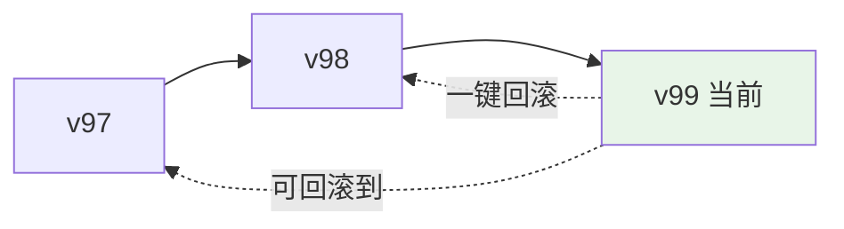

每个版本都要存：
- 完整配置内容（不是 diff）
- 修改人 / 时间 / 原因
- 灰度策略
- 生效率监控数据

### 6.4 权限与审批

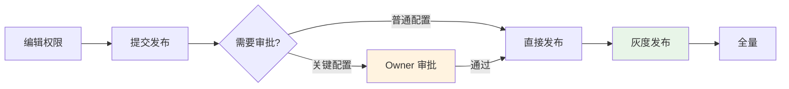

**关键配置定义**：
- 涉及金额、风控、安全的配置
- 灰度比例 > 50% 的发布
- 影响 > 100w 用户的变更

这些配置必须强制走审批流程，**回归到本文开篇那个金融事故就能避免**。

## 07.常见陷阱与反例

### 7.1 配置失控反例

**反例**：某团队的配置中心没有命名规范也没有 Owner 概念，3 年后积累了 5000+ 配置项，**70% 没人知道在哪里被读取，删又不敢删**。

**教训**：
- 每个配置必须有 **Owner**（团队 / 个人）
- 必须有 **过期时间**（如 6 个月没人改的标记为待清理）
- 必须有 **使用统计**（半年没被读取的可以下线）
- 配置项命名规范：`业务域.功能.具体含义`

### 7.2 配置雪崩反例

**反例**：某次配置发布有 BUG，所有客户端拉到错误配置后立即出错，5 分钟内服务全挂。

**正确做法**：
- **强制灰度**：任何配置发布都必须经过 1% → 10% → 50% → 100%
- **生效率监控**：发布后实时监控错误率，超阈值自动暂停灰度
- **熔断与降级**：客户端读到异常配置（如类型不匹配）时自动用兜底值

### 7.3 配置滥用反例

**反例**：某 App 把"是否显示某个图标"也做成配置，结果配置项膨胀到 8000 个。

**判断标准 - 什么应该上配置中心**：

| 应该上 | 不应该上 |
|---|---|
| 可能在生产环境调整的值 | 写完就一辈子不改的常量 |
| 多环境取值不同的 | 跟代码逻辑强绑定的 |
| 紧急情况要快速调整的 | 需要发版才能配套生效的 |
| 业务运营要自助调整的 | 完全是技术内部状态的 |

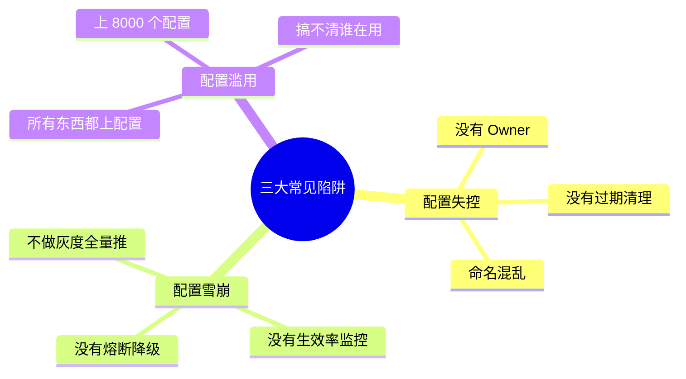

## 08.演进路线

### 8.1 V1 文件配置

**特征**：配置在 properties / yaml 文件里，跟随代码发布。

**做法**：
- 多环境多文件（application-dev.yml / application-prod.yml）
- Spring Profile / 环境变量切换

**适用阶段**：起步期、单服务

**痛点**：改配置要重启 / 重新发版

### 8.2 V2 简易配置中心

**特征**：搭建独立的配置服务，提供动态生效能力。

**做法**：
- 引入 Apollo / Nacos
- 应用启动时拉配置
- 长轮询监听变更

**适用阶段**：服务数量 5+ 或需要动态生效

### 8.3 V3 全功能配置中心

**特征**：完整的灰度 / 审批 / 审计 / 权限治理体系。

**做法**：
- 灰度发布全维度支持
- 关键配置审批流
- 审计日志可追溯
- 与监控告警联动
- 端侧配置 + CDN 分发

**适用阶段**：大型企业 + 多业务线 + 严格合规

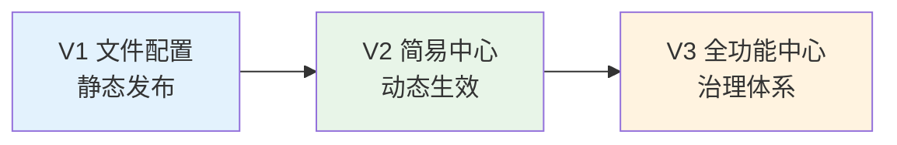

> **关键提醒**：配置中心 V2 阶段已经能满足 90% 公司的需求。V3 是治理型升级，对应组织规模和合规要求。

## 09.总结与决策

### 9.1 配置上线检查表

每次配置发布前对照这张清单：

- [ ] 配置项有明确 Owner
- [ ] 配置值通过类型 / 范围校验
- [ ] 灰度策略已设定（不允许直接全量）
- [ ] 已通知关联团队（业务 / 运营 / 客服）
- [ ] 监控大盘已就位（可看到生效率和业务指标）
- [ ] 已演练过回滚路径（< 30 秒可回滚）
- [ ] 关键变更走了审批流
- [ ] 客户端有兜底默认值
- [ ] 配置不含敏感信息（密钥应走密钥管理系统）
- [ ] 发布时间避开业务高峰

### 9.2 选型决策树

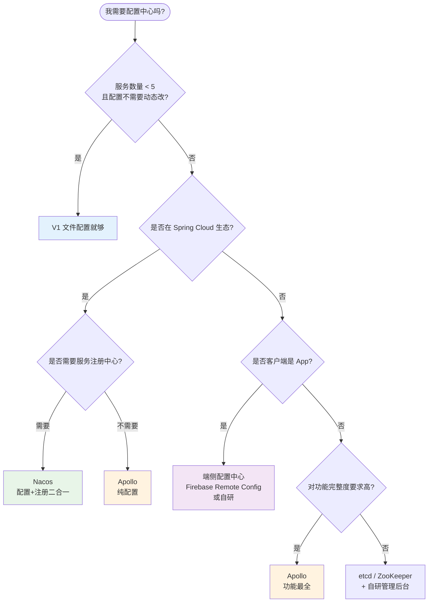

**最后一句话**：配置中心是把双刃剑——**它让你可以 30 秒改变一切，包括 30 秒搞炸一切**。本文开篇那个金融 App 失败在于"快速生效"超过了"治理能力"。

> 好的配置中心 = **既要够快，又要够稳。够快是技术问题，够稳是治理问题**。
