# 07.缓存架构设计思想

> **本篇定位**：缓存是性能优化中**性价比最高的一招**——但同时也是**故障概率最高的环节**。本文从一个"缓存雪崩"事故讲起，回答三个核心问题——**缓存为什么有效？业界三层缓存怎么协同？哪些坑必须避开？**

#### 目录介绍
- [01.一场缓存的雪崩](#01一场缓存的雪崩)
  - [1.1 大促零点的崩塌](#11-大促零点的崩塌)
  - [1.2 故障扩散链路](#12-故障扩散链路)
  - [1.3 反思缓存设计](#13-反思缓存设计)
- [02.缓存的核心矛盾](#02缓存的核心矛盾)
  - [2.1 性能与一致性](#21-性能与一致性)
  - [2.2 容量与命中率](#22-容量与命中率)
  - [2.3 简单与可靠](#23-简单与可靠)
  - [2.4 缓存的本质](#24-缓存的本质)
- [03.业界主流方案](#03业界主流方案)
  - [3.1 三层缓存架构](#31-三层缓存架构)
  - [3.2 横向对比矩阵](#32-横向对比矩阵)
  - [3.3 选型场景对照](#33-选型场景对照)
- [04.缓存设计原则](#04缓存设计原则)
  - [4.1 局部性原理](#41-局部性原理)
  - [4.2 命中率优先](#42-命中率优先)
  - [4.3 失效优于错误](#43-失效优于错误)
  - [4.4 最小依赖原则](#44-最小依赖原则)
- [05.缓存方案落地](#05缓存方案落地)
  - [5.1 多级缓存架构](#51-多级缓存架构)
  - [5.2 数据流与时序](#52-数据流与时序)
  - [5.3 LRU 实现剖析](#53-lru-实现剖析)
  - [5.4 LFU 与 W-TinyLFU](#54-lfu-与-w-tinylfu)
  - [5.5 一致性方案选型](#55-一致性方案选型)
- [06.三大经典问题](#06三大经典问题)
  - [6.1 缓存穿透](#61-缓存穿透)
  - [6.2 缓存击穿](#62-缓存击穿)
  - [6.3 缓存雪崩](#63-缓存雪崩)
- [07.常见陷阱与反例](#07常见陷阱与反例)
  - [7.1 大 Key 反例](#71-大-key-反例)
  - [7.2 热 Key 反例](#72-热-key-反例)
  - [7.3 一致性反例](#73-一致性反例)
- [08.演进路线](#08演进路线)
  - [8.1 V1 单机本地缓存](#81-v1-单机本地缓存)
  - [8.2 V2 分布式缓存](#82-v2-分布式缓存)
  - [8.3 V3 多级缓存体系](#83-v3-多级缓存体系)
- [09.总结与决策](#09总结与决策)
  - [9.1 缓存上线检查表](#91-缓存上线检查表)
  - [9.2 选型决策树](#92-选型决策树)


## 01.一场缓存的雪崩

### 1.1 大促零点的崩塌

某电商在 2019 年双 11 零点发生过一次惨痛的雪崩事故。**0:00:00 整**，零点活动开始，所有用户涌入抢购。**0:00:03**，监控开始报警："Redis 命中率从 98% 跌到 12%"。**0:00:08**，数据库 CPU 从 30% 飙到 100%。**0:00:15**，主库主从切换，全站不可用。

| 时间 | 现象 |
|---|---|
| 0:00:00 | 大促开始，QPS 瞬间从日常 5w 涨到 80w |
| 0:00:03 | Redis 命中率断崖式下跌 |
| 0:00:08 | DB CPU 100%，慢查询堆积 |
| 0:00:15 | 主库主从切换，全站雪崩 |
| 0:01:30 | 应急扩容 + 限流，逐步恢复 |
| 0:08:00 | 恢复正常，但峰值已过 |

**直接经济损失**：预估 1.2 亿，损失更严重的是用户信任。

### 1.2 故障扩散链路

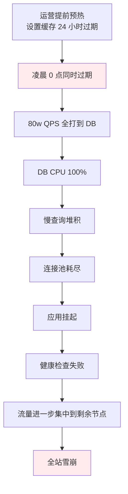

**真正的根因不是流量大，而是缓存过期时间设置成"24 小时整"**——所有 Key 同时过期，瞬间打穿 Redis 直击数据库。

### 1.3 反思缓存设计

事后复盘揭示了几个关键认知：

1. **缓存不是"加上就快"，而是"用错就崩"**
2. **缓存过期时间必须打散**（基础时间 + 随机偏移）
3. **必须有限流和熔断兜底**，不能让 DB 裸奔
4. **必须有多级缓存**，单级缓存挂了就全挂

这就引出了缓存设计的本质矛盾。

## 02.缓存的核心矛盾

### 2.1 性能与一致性

> **缓存的所有问题，几乎都在性能与一致性之间打转**

| 一端 | 另一端 | 缓存的取舍 |
|---|---|---|
| 强一致性 | 极致性能 | 多数选最终一致性 |
| 长 TTL（高命中） | 短 TTL（数据新鲜） | 看业务对实时性要求 |
| 同步更新（一致） | 异步更新（性能） | 看业务能否容忍短暂脏数据 |

**关键认知**：**追求强一致就别用缓存，用了缓存就要接受短暂不一致**。这不是技术问题，是物理定律。

### 2.2 容量与命中率

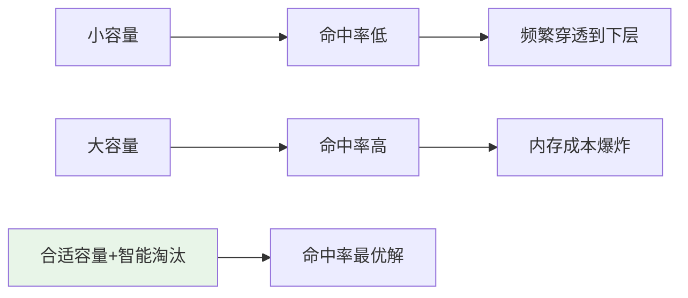

**实证数据**：根据帕累托法则，**20% 的 Key 承担 80% 的访问**。所以**容量没必要追求覆盖全部数据，覆盖热点即可**。

### 2.3 简单与可靠

最简单的缓存就是 `HashMap.get()`——但生产环境上，缓存还要解决：

- 容量限制（避免 OOM）
- 过期淘汰（避免脏数据）
- 并发安全（避免数据竞争）
- 持久化（避免重启丢失）
- 高可用（避免单点）
- 监控告警（避免静默失败）

**复杂度从单机内存到分布式集群是指数级上升**。

### 2.4 缓存的本质

> **缓存 = 用空间换时间，用最终一致性换性能**

它的核心是利用**局部性原理**——程序访问数据有"扎堆"特性（时间局部性 + 空间局部性），所以"刚访问过的数据""相邻的数据"很可能再次被访问。这是 70 年前 CPU L1/L2 cache 设计的依据，今天分布式缓存依然遵循它。

## 03.业界主流方案

### 3.1 三层缓存架构

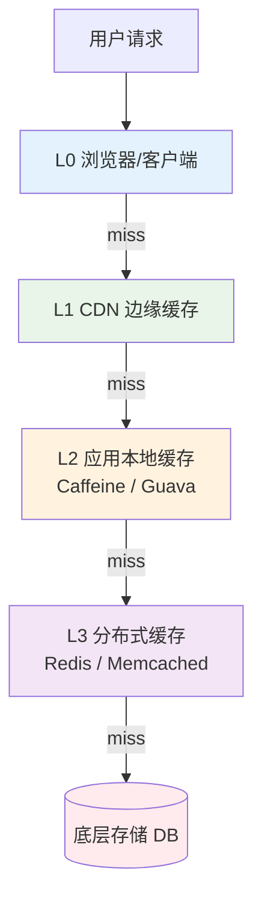

**每一层的存在都有清晰的物理边界依据**：

| 层级 | 物理位置 | 延迟 | 容量 | 典型代表 |
|---|---|---|---|---|
| L0 客户端 | 用户设备 | 0ms | MB 级 | 浏览器 / App |
| L1 CDN | 边缘节点 | 5-30ms | TB 级 | Cloudflare / Akamai |
| L2 本地缓存 | 应用进程内 | 微秒级 | GB 级 | Caffeine / Guava |
| L3 分布式缓存 | 独立集群 | 毫秒级 | TB 级 | Redis / Memcached |
| L4 存储 | 持久化 | 10-100ms | PB 级 | MySQL / HBase |

每相邻两层间延迟差**约 1 个数量级**，这是分层的根本依据。

### 3.2 横向对比矩阵

针对 L2 / L3 两层最常用的几种方案做对比：

| 维度 | Caffeine（本地） | Guava Cache（本地） | Redis（分布式） | Memcached（分布式） |
|---|---|---|---|---|
| **位置** | 进程内 | 进程内 | 独立集群 | 独立集群 |
| **数据结构** | 仅 K-V | 仅 K-V | 丰富（String/Hash/List/Set/ZSet） | 仅 K-V |
| **命中率** | 高（W-TinyLFU 算法） | 中（LRU） | 取决于容量 | 取决于容量 |
| **持久化** | 无 | 无 | RDB+AOF | 无 |
| **集群** | 单机 | 单机 | Cluster / Sentinel | 客户端分片 |
| **多语言支持** | Java | Java | 全语言 | 全语言 |
| **典型 QPS** | 10w+ 单机 | 5w+ 单机 | 10w+ 单节点 | 20w+ 单节点 |
| **适用场景** | 热点数据本地缓存 | 简单场景 | 通用分布式缓存 | 极简 K-V 高吞吐 |

### 3.3 选型场景对照

| 业务场景 | 推荐方案 | 原因 |
|---|---|---|
| 商品详情页（高频读） | Caffeine + Redis | 双层兜底，本地缓存抗命中 |
| 用户会话 / Token | Redis | 多节点共享，需要持久化 |
| 排行榜 / 计数器 | Redis ZSet / Hash | 数据结构原生支持 |
| 分布式锁 | Redis | 原子操作 + 高可用 |
| 静态资源 | CDN | 距离最短，成本最低 |
| 配置 / 字典数据 | Caffeine（带定时刷新） | 不变性强，本地最优 |
| 大对象 / Session | Memcached | 性能极致 |

## 04.缓存设计原则

### 4.1 局部性原理

缓存生效的物理基础。两类局部性：

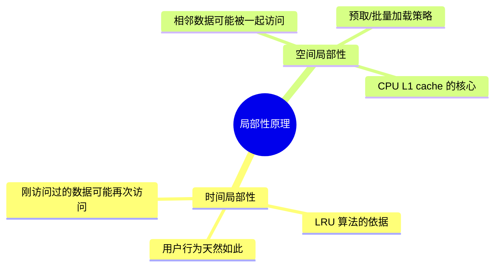

**实战应用**：
- 用户访问商品 A 详情后，大概率还会再看一次 A → 适合缓存（时间局部性）
- 用户看完商品 A，大概率会看相关推荐 → 可以预加载（空间局部性）

### 4.2 命中率优先

缓存的所有指标里**命中率最重要**。命中率从 90% 提到 95% 不是 5% 的差距，而是 **DB 压力减半**：

| 命中率 | 打到 DB 的请求量（10w QPS 总流量） |
|---|---|
| 90% | 1w QPS |
| 95% | 0.5w QPS |
| 99% | 1k QPS |
| 99.9% | 100 QPS |

**提升命中率的几个关键动作**：
- 选用更智能的淘汰算法（W-TinyLFU > LFU > LRU > FIFO）
- 适配业务的 TTL 设置（热点数据可以设无限期）
- 缓存 Key 设计避免重复（防止同一份数据存多份）
- 主动预热（大促前提前加载热点）

### 4.3 失效优于错误

**铁律**：**缓存可以读不到数据，但不能读到错误数据**。

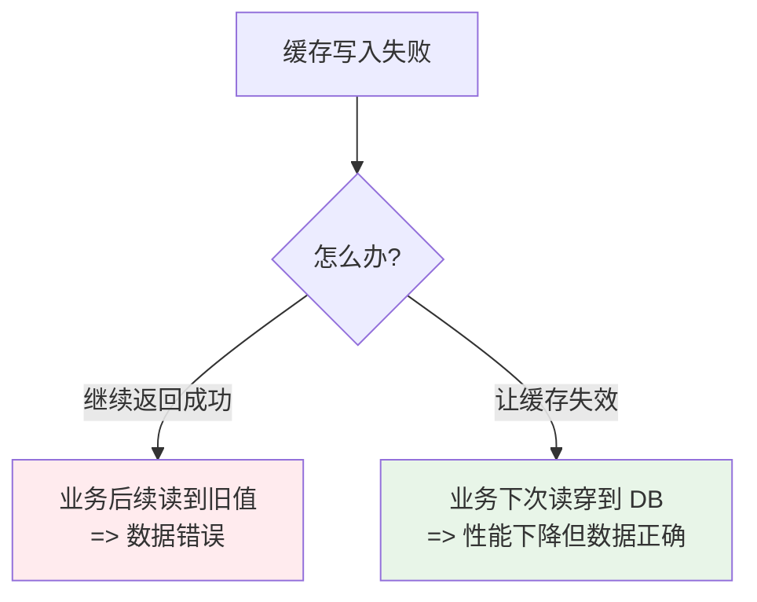

发生异常时，**宁可让缓存失效（删除）让请求穿透到 DB，也不要保留错误数据**。

### 4.4 最小依赖原则

**缓存挂了，业务不能挂**。

| 反例 | 问题 | 正确做法 |
|---|---|---|
| Redis 挂了应用直接报错 | 缓存反而成了单点 | 降级直读 DB + 限流保护 |
| Caffeine 引入大量依赖 | 升级一个库引入新冲突 | 选用零依赖库 |
| 缓存键的 hash 算法和业务强绑定 | 改算法导致全量失效 | 抽象成可替换组件 |

## 05.缓存方案落地

### 5.1 多级缓存架构

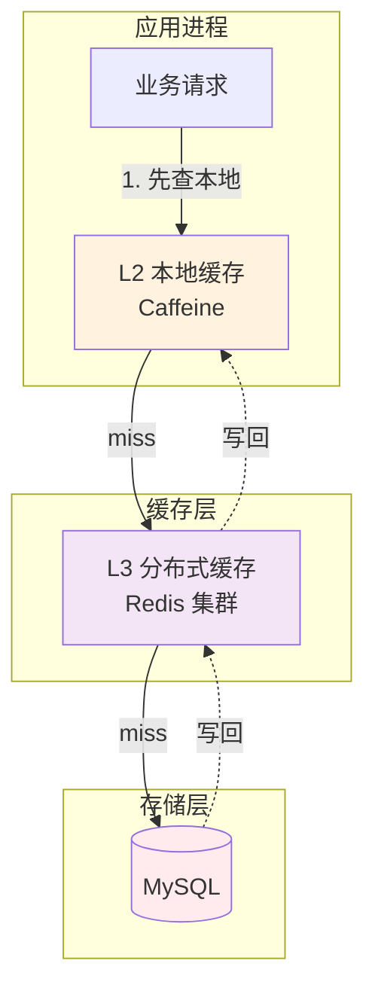

**典型耗时**：
- L2 命中：< 1ms
- L3 命中：1-3ms
- DB 查询：10-50ms

通过 L2 + L3 双层，**99% 请求 < 3ms**。

### 5.2 数据流与时序

**读取流程**：

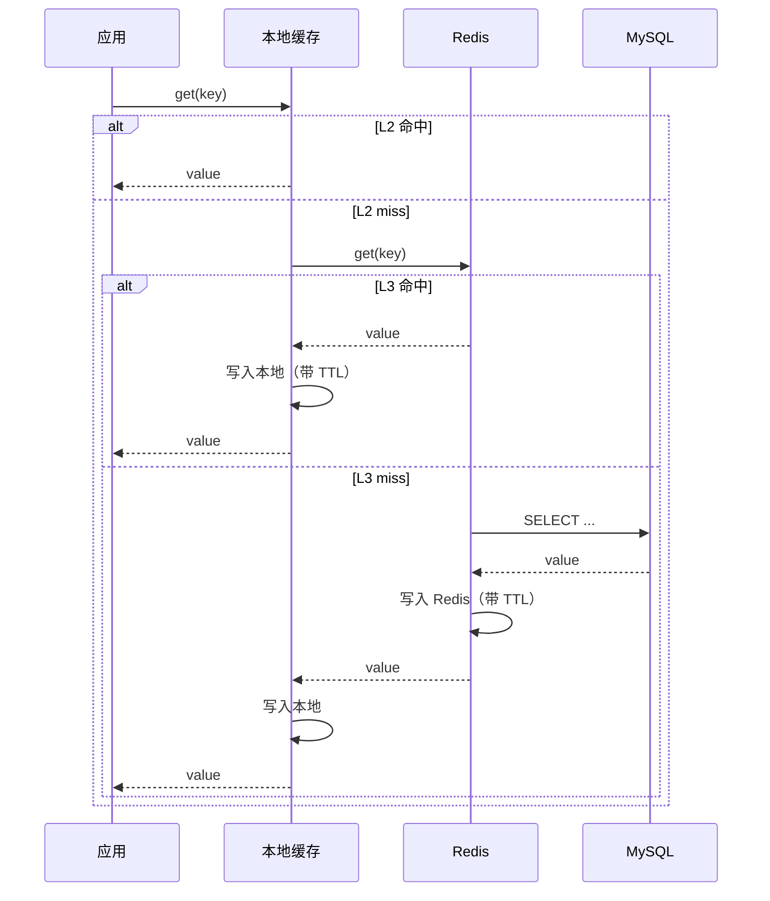

**写入流程**（采用"先更新 DB 再删缓存"策略）：

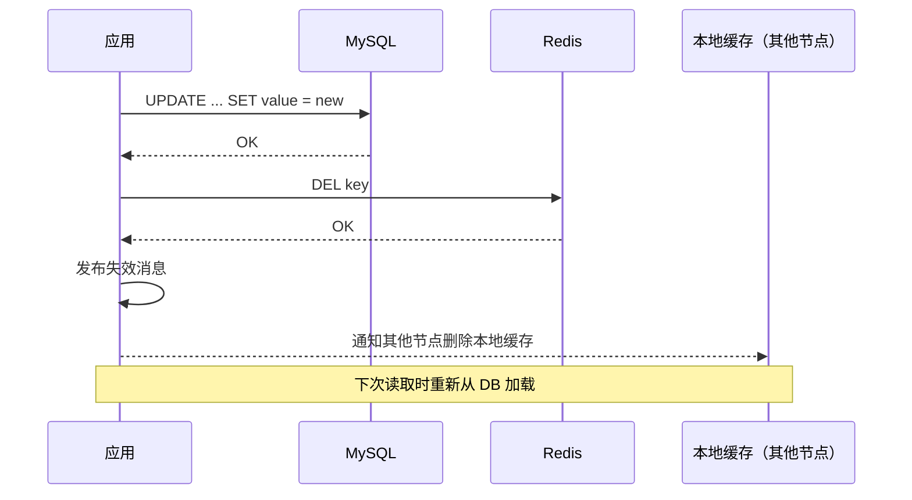

### 5.3 LRU 实现剖析

LRU（Least Recently Used）= 淘汰最久未使用的。**核心数据结构 = HashMap + 双向链表**：

```java
class LRUCache<K, V> {
    private final int capacity;
    private final Map<K, Node<K, V>> map;
    private final Node<K, V> head, tail;  // 哨兵节点
    
    public V get(K key) {
        Node<K, V> node = map.get(key);
        if (node == null) return null;
        moveToHead(node);  // O(1) 移到头部
        return node.value;
    }
    
    public void put(K key, V value) {
        Node<K, V> node = map.get(key);
        if (node == null) {
            if (map.size() >= capacity) {
                Node<K, V> tail = removeTail();  // 淘汰尾部
                map.remove(tail.key);
            }
            node = new Node<>(key, value);
            map.put(key, node);
            addToHead(node);
        } else {
            node.value = value;
            moveToHead(node);
        }
    }
}
```

**为什么是 HashMap + 链表的组合**？
- HashMap：O(1) 找到节点
- 双向链表：O(1) 移动节点和淘汰尾部

任何只用一种数据结构都做不到 O(1) 的 get + put，**这是经典面试题的本质考察**。

### 5.4 LFU 与 W-TinyLFU

**LRU 的缺陷**：偶发的扫描会污染缓存。比如有个 100w 数据的全量遍历任务跑过一次，就会把所有真正的热点 Key 挤出去。

**LFU（Least Frequently Used）**：淘汰访问次数最少的。能解决扫描污染问题，但有"历史包袱"——一个早期的热点即使现在不再访问也很难被淘汰。

**W-TinyLFU（Caffeine 采用）**：是 LRU 和 LFU 的融合升级版：

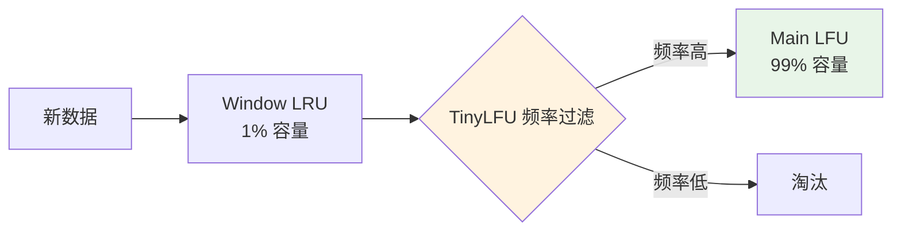

**核心思想**：
- 用 1% 容量做 Window，新数据先进 Window 等候
- Window 淘汰时和 Main 区做"频率 PK"，赢的进 Main
- 用 Count-Min Sketch 算法**用极小空间估计访问频率**

实际命中率比纯 LRU 高 **15-25%**，这就是 Caffeine 性能远超 Guava Cache 的原因。

### 5.5 一致性方案选型

缓存与 DB 的一致性方案有 5 种主流策略：

| 策略 | 写入顺序 | 一致性 | 复杂度 | 适用 |
|---|---|---|---|---|
| **Cache-Aside** | 先 DB 后删缓存 | 最终一致 | 低 | **最常用** |
| **Read-Through** | 缓存层封装读取 | 同上 | 中 | 缓存层独立服务 |
| **Write-Through** | 缓存层封装写入，同步写 DB | 强一致 | 高 | 写少读多 |
| **Write-Behind** | 缓存层封装写入，异步刷 DB | 弱一致 | 高 | 高写入场景 |
| **Double Delete** | 写 DB 前后各删一次 | 准最终一致 | 中 | 一致性敏感 |

**Cache-Aside 的"先删缓存 vs 后删缓存"之争**：

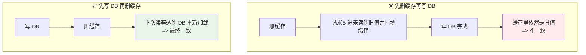

**实战推荐**：**先写 DB 再删缓存**，遇到极端一致性要求叠加 Double Delete（写 DB 后立即删一次 + 延迟 500ms 再删一次）。

## 06.三大经典问题

### 6.1 缓存穿透

**定义**：请求查询**根本不存在的数据**，缓存和 DB 都没有，每次都打到 DB。

**典型场景**：黑产扫描接口，用各种不存在的 ID 探测。

**解决方案**：

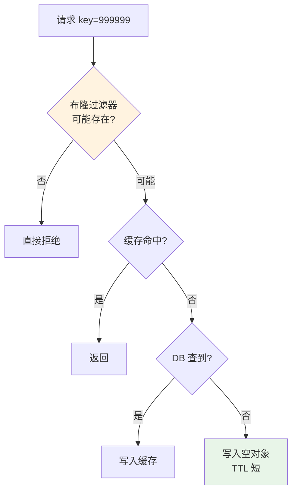

**两层防护**：
1. **布隆过滤器**：在 Redis 前挡一道，明显不存在的 Key 直接拒绝
2. **空值缓存**：DB 也查不到时缓存一个"空对象"（TTL 1-5 分钟），避免重复穿透

### 6.2 缓存击穿

**定义**：**单个热 Key 突然过期**，瞬间大量请求打到 DB。

**典型场景**：明星热搜 Key 缓存过期、限时活动开始时间。

**解决方案**：

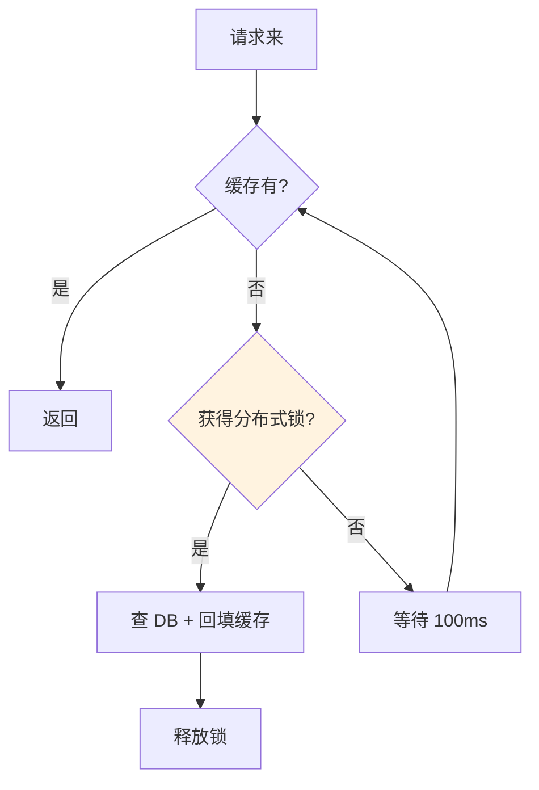

**核心**：**用分布式锁让"只有第一个请求查 DB"**，其他请求等它回填后从缓存读。

**或者**：**热 Key 永不过期 + 后台异步更新**。

### 6.3 缓存雪崩

**定义**：**大量 Key 同时过期** + 流量打到 DB → 全站雪崩。这就是 §1 那个 1.2 亿损失的真实场景。

**解决方案三件套**：

| 方案 | 做法 | 防什么 |
|---|---|---|
| **TTL 随机化** | TTL = 基础时间 + 随机 0-60 分钟 | 防止同时过期 |
| **多级缓存** | L2 本地 + L3 Redis | L3 挂了 L2 兜底 |
| **限流熔断** | DB 前加限流 | 即使打到 DB 也不会崩 |

```kotlin
// 反例：所有 Key 同时过期
redis.setex(key, 86400, value)  // 24 小时整

// 正例：TTL 随机化
val ttl = 86400 + Random.nextInt(3600)  // 24小时 + 0-1小时随机
redis.setex(key, ttl, value)
```

**就这一行代码的差别，就能避免开篇那个雪崩**。

## 07.常见陷阱与反例

### 7.1 大 Key 反例

**反例**：某 App 把"用户全部好友列表"存为一个 Hash，热门用户的好友列表达 50w 条 / 80MB。

**问题**：
- 一次 HGETALL 操作阻塞 Redis 主线程数百毫秒
- 网络传输 80MB 占满带宽
- 主从同步时一个 Key 阻塞全集群

**解决**：拆分大 Key（按 hash 分片）+ 改用 SCAN 分批读取 + 监控 Key 大小。

### 7.2 热 Key 反例

**反例**：双 11 期间某爆款商品详情 Key 单点 QPS 达 50w，**单 Redis 节点被打爆**。

**问题**：Redis 集群模式下一个 Key 只能落在一个节点，无法水平扩展。

**解决**：

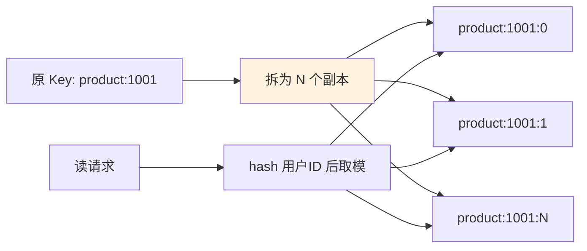

把单个 Key 复制成 N 份，**通过 hash 用户 ID 分散**到不同副本。代价是写多份，但读 QPS 可以水平扩展。

### 7.3 一致性反例

**反例**：用 "先删缓存再写 DB" 模式，并发场景下出现脏数据。

**问题**：删缓存后、写 DB 前，**有读请求来了**，从 DB 读到旧值并回填缓存。结果 DB 写完后，缓存还是旧值。

**解决**：**先写 DB 再删缓存** + Double Delete 兜底（极端一致性场景）。

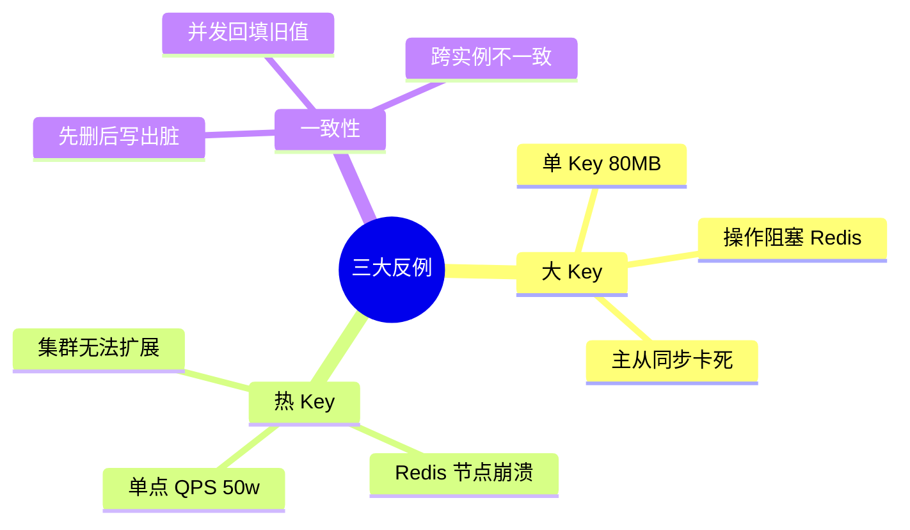

## 08.演进路线

### 8.1 V1 单机本地缓存

**特征**：单机部署、数据量小、QPS 低（< 1w）。

**做法**：
- HashMap / Caffeine 进程内缓存
- 简单的 TTL + LRU
- 不考虑一致性（重启丢就丢）

**适用阶段**：MVP 起步、内部工具

### 8.2 V2 分布式缓存

**特征**：多节点部署、需要数据共享、QPS 上万。

**做法**：
- Redis 单实例 / Sentinel 高可用
- Cache-Aside 模式
- TTL 随机化 + 简单的 Key 命名规范

**适用阶段**：业务规模化、QPS 1w-10w

**痛点**：单 Redis 实例容量上限、单点性能瓶颈

### 8.3 V3 多级缓存体系

**特征**：超大规模、QPS 百万级、严格的延迟要求。

**做法**：
- Caffeine（L2）+ Redis Cluster（L3）+ DB 三级
- 热 Key 自动检测 + 本地缓存提升
- 大 Key 监控 + 自动告警
- 缓存预热 + 灰度
- 命中率 / 大小 / 慢操作监控大盘

**适用阶段**：大型互联网公司、电商 / 内容 / 社交大流量场景

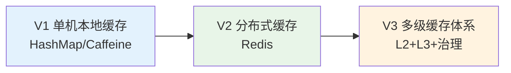

## 09.总结与决策

### 9.1 缓存上线检查表

每次新增缓存对照这张清单：

- [ ] Key 命名遵循规范（业务域:对象类型:对象ID）
- [ ] TTL 设置合理（且加了随机偏移）
- [ ] 大 Key 已评估（单 Key < 10KB）
- [ ] 热 Key 已识别（单 Key QPS < 1w）
- [ ] 一致性方案明确（Cache-Aside / Write-Through / ...）
- [ ] 三大问题（穿透/击穿/雪崩）都有防护
- [ ] 缓存挂了的降级路径已演练
- [ ] 命中率 / 大小 / 慢操作监控就绪
- [ ] 写入 DB 失败的场景有兜底
- [ ] 容量评估留 30% buffer

### 9.2 选型决策树

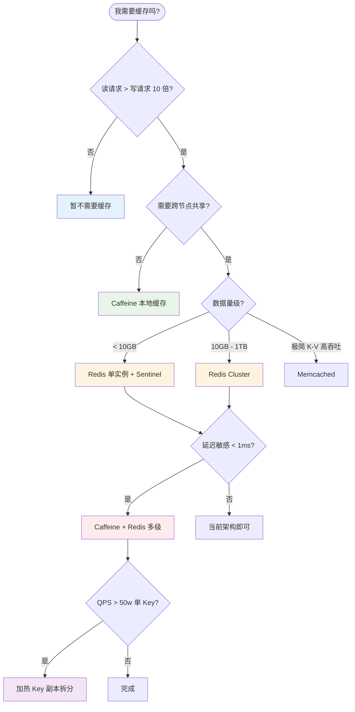

**最后一句话**：缓存是双刃剑——**用对了让你的系统快 100 倍，用错了让你的系统在最关键的时刻崩溃**。开篇那个 1.2 亿损失只是因为没在 TTL 后面加一个随机数。**好的缓存设计，是把 100 个小细节都做对**。

> 好的缓存 = **让 99% 请求快、让剩下 1% 慢得可控、让缓存本身挂了业务也能活**。
