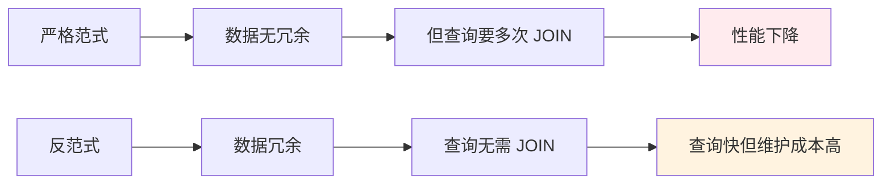
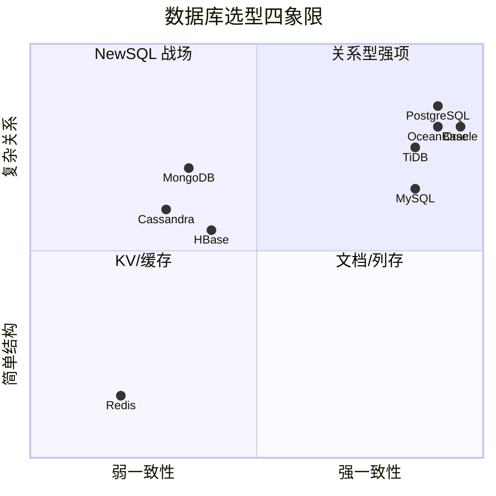
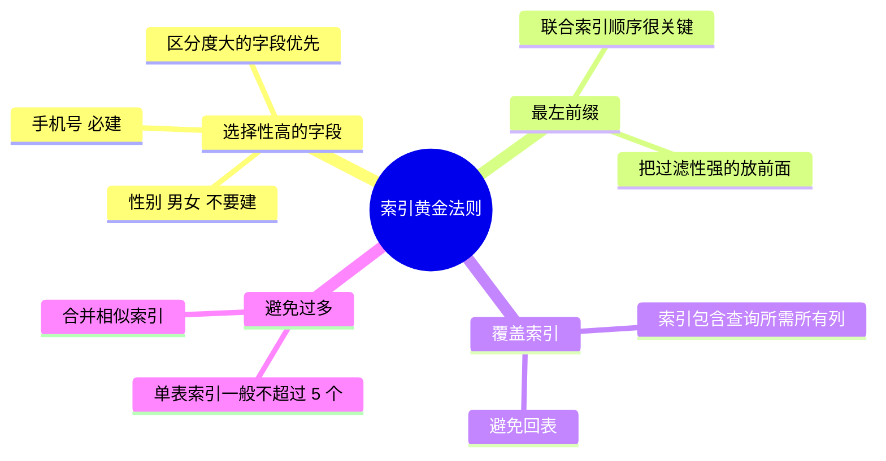
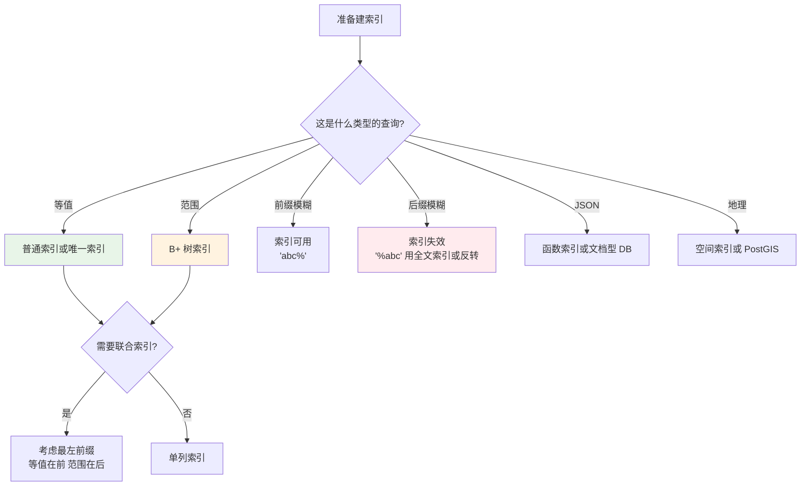
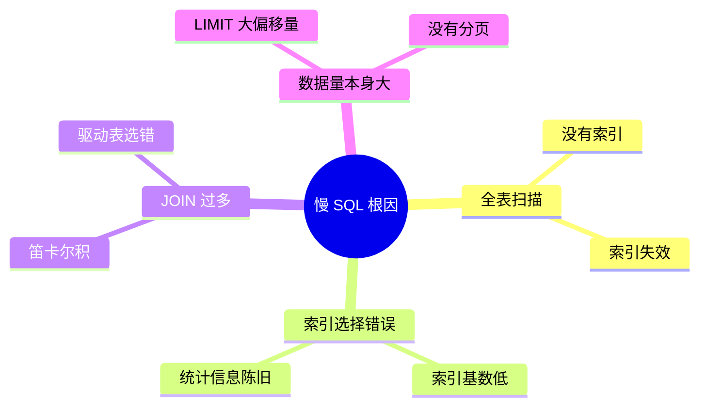
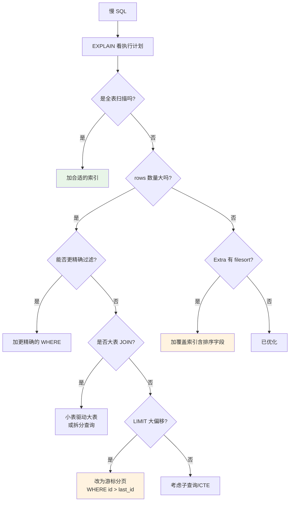
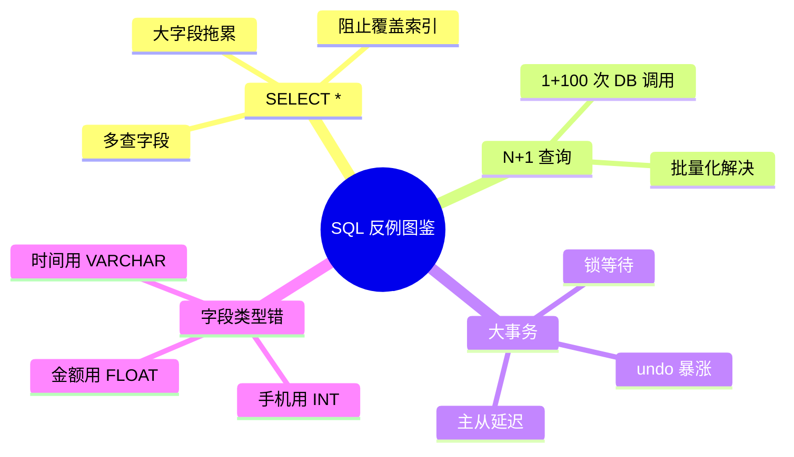
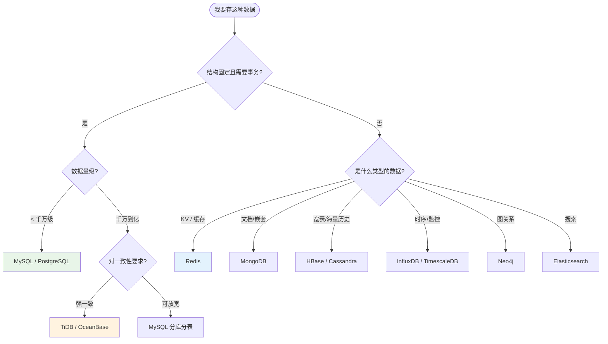

# 08.数据库SQL设计思想

> **本篇定位**：数据库是 99% 系统的"地基"——地基烂了，上层架构再漂亮也白搭。本文从一个慢查询导致的雪崩讲起，回答三个核心问题——**什么样的表结构能扛 5 年迭代？什么样的 SQL 不会成为定时炸弹？三大范式真的要无脑遵守吗？**

#### 目录介绍
- [01.一条慢 SQL 的故事](#01一条慢-sql-的故事)
  - [1.1 凌晨的告警](#11-凌晨的告警)
  - [1.2 一行 SQL 的代价](#12-一行-sql-的代价)
  - [1.3 反思 SQL 设计](#13-反思-sql-设计)
- [02.要解决的核心矛盾](#02要解决的核心矛盾)
  - [2.1 范式与性能](#21-范式与性能)
  - [2.2 灵活与稳定](#22-灵活与稳定)
  - [2.3 一致与可用](#23-一致与可用)
  - [2.4 数据库设计的本质](#24-数据库设计的本质)
- [03.业界主流方案](#03业界主流方案)
  - [3.1 关系型数据库](#31-关系型数据库)
  - [3.2 非关系型数据库](#32-非关系型数据库)
  - [3.3 横向对比矩阵](#33-横向对比矩阵)
- [04.设计核心原则](#04设计核心原则)
  - [4.1 三大范式与反范式](#41-三大范式与反范式)
  - [4.2 索引设计原则](#42-索引设计原则)
  - [4.3 字段类型选择](#43-字段类型选择)
  - [4.4 命名与规范](#44-命名与规范)
- [05.表结构设计落地](#05表结构设计落地)
  - [5.1 通用字段设计](#51-通用字段设计)
  - [5.2 主键设计选择](#52-主键设计选择)
  - [5.3 索引落地实战](#53-索引落地实战)
  - [5.4 关系建模思路](#54-关系建模思路)
- [06.SQL 编写规范](#06sql-编写规范)
  - [6.1 慢 SQL 识别](#61-慢-sql-识别)
  - [6.2 EXPLAIN 解读](#62-explain-解读)
  - [6.3 索引失效场景](#63-索引失效场景)
  - [6.4 SQL 优化套路](#64-sql-优化套路)
- [07.常见陷阱与反例](#07常见陷阱与反例)
  - [7.1 SELECT * 反例](#71-select--反例)
  - [7.2 N+1 查询反例](#72-n1-查询反例)
  - [7.3 大事务反例](#73-大事务反例)
  - [7.4 字段类型反例](#74-字段类型反例)
- [08.演进路线](#08演进路线)
  - [8.1 V1 简单建表](#81-v1-简单建表)
  - [8.2 V2 索引与规范](#82-v2-索引与规范)
  - [8.3 V3 读写分离](#83-v3-读写分离)
  - [8.4 V4 分库分表](#84-v4-分库分表)
- [09.总结与决策](#09总结与决策)
  - [9.1 表设计检查表](#91-表设计检查表)
  - [9.2 选型决策树](#92-选型决策树)


## 01.一条慢 SQL 的故事

### 1.1 凌晨的告警

某 SaaS 平台运行了 3 年，数据稳定增长。某天凌晨 02:15，接到 P1 告警："数据库连接池耗尽，全站接口超时"。值班工程师登上去一看：

```
+------+--------+----------+-------+----------+--------------------------+
| Id   | User   | Host     | db    | Time(s)  | Info                     |
+------+--------+----------+-------+----------+--------------------------+
| 1207 | app    | 10.x.x.1 | order | 320      | SELECT * FROM order ...  |
| 1208 | app    | 10.x.x.2 | order | 318      | SELECT * FROM order ...  |
| 1209 | app    | 10.x.x.3 | order | 315      | SELECT * FROM order ...  |
| ...  | ...    | ...      | ...   | ...      | ...                      |
+------+--------+----------+-------+----------+--------------------------+
```

**几百个相同的 SELECT 查询同时跑了 5 分钟还没结束**，连接池被打满。

### 1.2 一行 SQL 的代价

定位到罪魁祸首：

```sql
SELECT * FROM order_detail 
WHERE user_id = ? AND status = 1 
ORDER BY create_time DESC 
LIMIT 20;
```

看起来再正常不过的 SQL，问题在哪？**EXPLAIN 一下**：

```
type: ALL    -- 全表扫描!
rows: 8420315  -- 扫描 800 多万行
key: NULL    -- 没用上任何索引
```

**根因**：3 年前建表时 `user_id` 上有索引，**但 6 个月前一次 DDL 加字段时把索引意外删掉了**——而单独跑这个 SQL 不会触发慢查询（数据量小时全表扫描也很快）。**直到数据增长到临界点，问题才一夜爆发**。

### 1.3 反思 SQL 设计

事后复盘暴露了几个关键问题：

| 问题 | 影响 |
|---|---|
| 缺少 DDL Review 流程 | 索引被误删无人察觉 |
| 没有索引使用率监控 | 索引"假装存在"也没人发现 |
| 慢查询阈值定为 5 秒 | 表小的时候 0.5 秒都被忽略 |
| 没有压测覆盖 | 生产数据量级的问题测不出来 |

**真相是：数据库的所有问题都是"时间问题"——今天能跑的 SQL，3 年后未必能跑**。

## 02.要解决的核心矛盾

### 2.1 范式与性能

数据库三大范式（1NF、2NF、3NF）是经典理论，但**严格遵守范式 = 大量 JOIN = 性能下降**。



**实战平衡点**：**核心交易表遵守范式，报表 / 缓存表反范式**。

### 2.2 灵活与稳定

数据库结构要灵活（业务变化适应），又要稳定（不能频繁改表）。

| 灵活的代价 | 稳定的代价 |
|---|---|
| 经常 ALTER TABLE → 大表锁表风险 | 死板的字段限制 → 业务受限 |
| 多用 JSON 字段 → 失去索引能力 | 严格类型 → 适应新需求慢 |

### 2.3 一致与可用

**CAP 定理**：分布式数据库无法同时满足一致性（C）、可用性（A）、分区容忍（P）。

- **传统关系数据库**：强一致 + 低可用（主库挂了写不动）
- **NoSQL 多数**：高可用 + 最终一致

### 2.4 数据库设计的本质

> **数据库设计 = 在"未来 N 年都不至于推倒重建"和"今天能跑得动"之间找平衡**

它的核心追求有三：
- **正确**：数据不丢、不错、不脏
- **快**：读写性能满足业务
- **可演进**：业务变了不至于重构表结构

## 03.业界主流方案

### 3.1 关系型数据库

| 数据库 | 定位 | 典型场景 |
|---|---|---|
| **MySQL** | 互联网首选 | OLTP / 中小型业务 / 千万到亿级 |
| **PostgreSQL** | 学术 + 工业全能 | 复杂查询 / 地理 / JSON / 全文搜索 |
| **Oracle** | 企业级老牌 | 金融 / 政府 / 高一致场景 |
| **SQL Server** | 微软生态 | 企业内部系统 |
| **TiDB / OceanBase** | 分布式 NewSQL | 单库容量超千亿 / 强一致 + 弹性 |

### 3.2 非关系型数据库

| 类型 | 代表 | 适用 |
|---|---|---|
| **键值** | Redis / Memcached | 缓存 / 会话 / 计数 |
| **文档** | MongoDB / Couchbase | 灵活 schema / 嵌套结构 |
| **列存** | HBase / Cassandra | 宽表 / 历史数据 |
| **图** | Neo4j / JanusGraph | 关系网络 / 推荐 / 风控 |
| **时序** | InfluxDB / TimescaleDB | 监控指标 / IoT |
| **搜索** | Elasticsearch | 全文检索 / 日志分析 |

### 3.3 横向对比矩阵



**选型铁律**：
- **不要轻易抛弃关系型数据库**——绝大多数业务 MySQL 就够
- **NoSQL 是关系型的补充，不是替代品**
- **多种数据库混用是常态**（MySQL + Redis + ES 是黄金三件套）

## 04.设计核心原则

### 4.1 三大范式与反范式

**第一范式（1NF）**：列不可再分。

```sql
-- ❌ 违反 1NF
CREATE TABLE user (
    id INT,
    name VARCHAR(20),
    phones VARCHAR(200)  -- "13800001111,13800002222" 这种就违反了
);

-- ✅ 符合 1NF
CREATE TABLE user_phone (
    user_id INT,
    phone VARCHAR(20)
);
```

**第二范式（2NF）**：非主键字段必须完全依赖主键，不能依赖部分主键。

**第三范式（3NF）**：非主键字段不能依赖其他非主键字段（消除传递依赖）。

```sql
-- ❌ 违反 3NF（dept_name 依赖 dept_id 而非 employee_id）
CREATE TABLE employee (
    id INT PRIMARY KEY,
    name VARCHAR(20),
    dept_id INT,
    dept_name VARCHAR(50)  -- 应该放在 dept 表
);

-- ✅ 符合 3NF
CREATE TABLE employee (id INT PRIMARY KEY, name VARCHAR(20), dept_id INT);
CREATE TABLE dept (id INT PRIMARY KEY, name VARCHAR(50));
```

**反范式适用场景**：
- 读远多于写、连接成本极高（如订单详情冗余商品名）
- 历史快照需要（如订单冗余下单时的商品价格）
- 报表 / 数仓维度表

### 4.2 索引设计原则

**索引不是越多越好**。每个索引都有成本：

| 维度 | 索引代价 |
|---|---|
| 写入性能 | 每次插入 / 更新都要维护索引 |
| 存储空间 | 大表索引可能比数据本身还大 |
| 内存占用 | 热点索引常驻内存 |

**索引设计黄金法则**：



**实战公式**：

```sql
-- 高频查询: WHERE user_id = ? AND status = ? ORDER BY create_time DESC
CREATE INDEX idx_user_status_time ON order (user_id, status, create_time DESC);
-- ⬆ 联合索引顺序: 等值条件在前 + 范围/排序在后
```

### 4.3 字段类型选择

字段类型选错是一种"慢性病"，初期看不出问题，数据量上来后修改成本极高。

| 选错的字段 | 后果 |
|---|---|
| 用 VARCHAR(255) 存所有字符串 | 浪费空间 + 索引效率低 |
| 用 INT 存手机号 | 11 位手机号会溢出 |
| 用 FLOAT 存金额 | 精度损失 → 财务事故 |
| 用 DATETIME 存所有时间 | 占 8 字节，TIMESTAMP 只占 4 字节 |
| 用 ENUM 存状态 | 改枚举值要 ALTER |

**正确做法**：

| 数据 | 正确类型 |
|---|---|
| 主键 ID | BIGINT UNSIGNED |
| 用户名（< 50 字符） | VARCHAR(50) |
| 手机号 | VARCHAR(20) |
| 金额 | DECIMAL(10, 2) 或 BIGINT（存分） |
| 时间戳 | DATETIME(3) 或 BIGINT（毫秒） |
| 是否标记 | TINYINT (0/1) |
| 长文本 | TEXT / LONGTEXT |
| 状态枚举 | TINYINT + 业务层维护映射 |

### 4.4 命名与规范

**铁律**：**命名规范从第一张表就要定好**，否则越后越难统一。

```sql
-- ❌ 命名混乱
CREATE TABLE T_User (
    Id int,
    UserName varchar(50),
    user_age int,
    CreateTime datetime,
    is_del char(1)
);

-- ✅ 统一规范
CREATE TABLE t_user (
    id BIGINT UNSIGNED PRIMARY KEY,
    user_name VARCHAR(50) NOT NULL,
    user_age TINYINT UNSIGNED,
    is_deleted TINYINT NOT NULL DEFAULT 0,
    created_at DATETIME NOT NULL DEFAULT CURRENT_TIMESTAMP,
    updated_at DATETIME NOT NULL DEFAULT CURRENT_TIMESTAMP ON UPDATE CURRENT_TIMESTAMP
);
```

**约定**：
- 全部小写 + 下划线分隔（snake_case）
- 表名前缀（如 `t_` 表示业务表，`r_` 表示关联表）
- 字段名清晰表意（`is_deleted` 优于 `del`）
- 时间字段统一 `_at` / `_time` 后缀

## 05.表结构设计落地

### 5.1 通用字段设计

每张业务表都应该有的"五大金刚"：

```sql
CREATE TABLE t_order (
    id BIGINT UNSIGNED PRIMARY KEY AUTO_INCREMENT COMMENT '主键',
    -- 业务字段...
    
    is_deleted TINYINT NOT NULL DEFAULT 0 COMMENT '逻辑删除',
    version INT NOT NULL DEFAULT 0 COMMENT '乐观锁版本号',
    created_by VARCHAR(50) NOT NULL DEFAULT '' COMMENT '创建人',
    created_at DATETIME NOT NULL DEFAULT CURRENT_TIMESTAMP COMMENT '创建时间',
    updated_at DATETIME NOT NULL DEFAULT CURRENT_TIMESTAMP ON UPDATE CURRENT_TIMESTAMP COMMENT '更新时间'
);
```

**为什么逻辑删除而非物理删除**：
- 数据可追溯（合规要求）
- 误删可恢复
- 关联数据完整性

**代价**：所有查询都要带 `WHERE is_deleted = 0`，索引设计要考虑这个。

### 5.2 主键设计选择

| 主键方案 | 优点 | 缺点 | 适用 |
|---|---|---|---|
| **自增 BIGINT** | 简单 + 索引友好 | 暴露业务量 + 难以分库分表 | 单库小型业务 |
| **UUID** | 全局唯一 + 可客户端生成 | 字符串占空间 + 索引差 | 分布式但量小 |
| **雪花算法** | 趋势递增 + 高吞吐 | 时钟回拨问题 | 大型分布式系统 |
| **业务 ID** | 有意义 + 可识别 | 改业务规则就要改 | 编码型业务（订单号） |

**实战推荐**：**自增 BIGINT 做物理主键 + 业务 ID 做对外标识**。

```sql
CREATE TABLE t_order (
    id BIGINT UNSIGNED PRIMARY KEY AUTO_INCREMENT,  -- 内部主键
    order_no VARCHAR(32) NOT NULL UNIQUE,           -- 对外业务编号
    -- ...
);
```

### 5.3 索引落地实战



**真实场景的联合索引设计**：

```sql
-- 业务: 查询用户某状态下最近的订单
SELECT id, order_no, create_time 
FROM t_order 
WHERE user_id = ? AND status = ? AND is_deleted = 0
ORDER BY create_time DESC 
LIMIT 20;

-- ❌ 错误索引顺序
CREATE INDEX idx_status_user ON t_order (status, user_id);

-- ✅ 正确索引（覆盖索引最佳）
CREATE INDEX idx_user_status_time 
ON t_order (user_id, status, is_deleted, create_time DESC);
```

### 5.4 关系建模思路

| 关系 | 建模方式 | 例子 |
|---|---|---|
| **一对一** | 主表 + 扩展表（垂直拆分） | 用户基础信息 + 用户认证信息 |
| **一对多** | 子表加外键 | 订单 → 订单商品明细 |
| **多对多** | 中间关系表 | 用户 ↔ 角色 |

**反例**：把"多对多"用 JSON 数组存——失去索引能力，统计查询变慢百倍。

## 06.SQL 编写规范

### 6.1 慢 SQL 识别

慢 SQL 的根因 **80% 是这 4 类**：



### 6.2 EXPLAIN 解读

`EXPLAIN` 是 SQL 优化的"X 光机"。重点看几个字段：

| 字段 | 意义 | 关注点 |
|---|---|---|
| **type** | 访问类型 | `ALL`(全表) < `index` < `range` < `ref` < `eq_ref` < `const` |
| **key** | 实际用的索引 | 为 NULL = 没用索引 |
| **rows** | 估算扫描行数 | 越少越好 |
| **Extra** | 额外信息 | `Using filesort` / `Using temporary` 要警惕 |

**实战经验值**：
- `type` 至少要到 `range`，理想到 `ref`
- `rows` 单次查询 < 1w
- `Extra` 出现 `Using filesort` 必须考虑加索引覆盖排序字段

### 6.3 索引失效场景

**最常见的 8 种索引失效场景**：

| 场景 | 错误示例 | 正确写法 |
|---|---|---|
| 函数操作字段 | `WHERE YEAR(created_at) = 2023` | `WHERE created_at BETWEEN '2023-01-01' AND '2024-01-01'` |
| 字段类型不匹配 | `WHERE phone = 13800001111`（phone 是字符串） | `WHERE phone = '13800001111'` |
| 隐式转换 | 字符串字段不加引号 | 加引号 |
| 前缀模糊 | `WHERE name LIKE '%abc'` | 改用 ES / 反转字段 |
| OR 连接非索引列 | `WHERE id=1 OR name='abc'`（name 无索引） | 拆 UNION 或给 name 加索引 |
| `!=` / `<>` | `WHERE status != 0` | 改为 `IN (1, 2, 3)` |
| 联合索引非最左 | 索引是 (a, b, c) 但 WHERE b=? | 调整索引或查询 |
| `IS NULL` | 字段允许 NULL 时 | 字段尽量 NOT NULL DEFAULT |

### 6.4 SQL 优化套路



## 07.常见陷阱与反例

### 7.1 SELECT * 反例

**反例**：

```sql
SELECT * FROM t_user WHERE id = ?;
```

**问题**：
- 返回的字段你可能用不上，浪费网络 / 内存
- 阻止了"覆盖索引"优化
- 表加字段后 select * 自动包含，可能引入兼容性问题
- 大字段（TEXT/JSON）会被拉出来

**正确**：

```sql
SELECT id, user_name, phone FROM t_user WHERE id = ?;
```

### 7.2 N+1 查询反例

**反例**：

```java
// 查 100 个订单
List<Order> orders = orderDao.findAll();
for (Order order : orders) {
    // 每个订单查一次用户 → 100 次额外查询
    User user = userDao.findById(order.getUserId());
    order.setUser(user);
}
```

**问题**：1 + 100 = 101 次查询，DB 被打爆。

**正确**：

```java
// 1 + 1 = 2 次查询
List<Order> orders = orderDao.findAll();
Set<Long> userIds = orders.stream().map(Order::getUserId).collect(...);
Map<Long, User> userMap = userDao.findByIds(userIds).stream()
    .collect(Collectors.toMap(User::getId, u -> u));
orders.forEach(o -> o.setUser(userMap.get(o.getUserId())));
```

**这是 ORM 框架最常见的坑（Hibernate / MyBatis 默认行为都可能踩）**。

### 7.3 大事务反例

**反例**：

```java
@Transactional
public void batchProcess(List<Long> ids) {
    for (Long id : ids) {  // ids 可能有 10 万个
        process(id);
    }
}
```

**问题**：
- 长时间持锁，阻塞其他事务
- undo log 暴涨，主从延迟严重
- 一旦失败要回滚 10 万条，时间成倍

**正确**：拆小事务，每 1000 条提交一次。

### 7.4 字段类型反例

**反例**：用 `FLOAT` 存金额，`0.1 + 0.2 = 0.30000000000000004`，财务对账永远对不上。

**正确**：
- 用 `DECIMAL(10, 2)` 精确存
- 或用 `BIGINT` 存"分"，业务层除以 100 显示



## 08.演进路线

### 8.1 V1 简单建表

**特征**：业务起步、单表数据 < 100 万、QPS < 1k。

**做法**：
- 设计基础表结构
- 主键 + 必要索引
- 单库单表

**何时升级**：单表 > 500 万、慢 SQL 频发。

### 8.2 V2 索引与规范

**特征**：业务发展、单表数据 100 万 - 1000 万。

**做法**：
- 完善索引设计
- DDL 规范化（评审 / 工单）
- 慢查询监控
- 基本的读写分离（主从复制）

### 8.3 V3 读写分离

**特征**：QPS 1w-10w、读多写少。

**做法**：
- MySQL 主从架构
- 业务层读写路由
- 读取一致性方案（强制主库读 / 延迟兜底）

### 8.4 V4 分库分表

**特征**：单表 > 5000 万、写入瓶颈。

**做法**：详见本卷 09 篇《分库分表方案设计》。


## 09.总结与决策

### 9.1 表设计检查表

新表上线前对照这张清单：

- [ ] 表名、字段名遵循团队规范
- [ ] 主键明确（推荐 BIGINT UNSIGNED AUTO_INCREMENT）
- [ ] 五大通用字段就位（is_deleted / created_at / updated_at / version / created_by）
- [ ] 字段类型经过审视（金额 DECIMAL、时间 DATETIME、手机 VARCHAR）
- [ ] NOT NULL DEFAULT 优于 NULL（除非业务需要）
- [ ] 字符集统一 utf8mb4
- [ ] 索引设计基于实际查询模式（不是猜的）
- [ ] 单表索引数量 ≤ 5（特殊场景除外）
- [ ] 高频查询有覆盖索引
- [ ] 表注释 + 字段注释完整
- [ ] DDL 经过评审
- [ ] 评估了未来 3 年的数据量

### 9.2 选型决策树



**最后一句话**：数据库设计是"延迟兑现"的工艺——**今天的偷懒，明天的事故**。开篇那个慢 SQL 雪崩源于 6 个月前一次随意的 ALTER。

> 好的数据库设计 = **5 年后回头看不至于推倒重来**。
