# 09.分库分表方案设计

> **本篇定位**：分库分表是数据库扩展的"最后大招"——也是最容易做错的一招。本文从一次失败的分库分表故事讲起，回答三个核心问题——**什么时候必须分？怎么选分片键？已经在跑的业务怎么平滑迁移？**

#### 目录介绍
- [01.一次失败的分库分表](#01一次失败的分库分表)
  - [1.1 团队的过度自信](#11-团队的过度自信)
  - [1.2 上线后的 5 大坑](#12-上线后的-5-大坑)
  - [1.3 反思教训](#13-反思教训)
- [02.要解决的核心矛盾](#02要解决的核心矛盾)
  - [2.1 单库的瓶颈](#21-单库的瓶颈)
  - [2.2 拆分的代价](#22-拆分的代价)
  - [2.3 一致性挑战](#23-一致性挑战)
  - [2.4 分库分表的本质](#24-分库分表的本质)
- [03.业界主流方案](#03业界主流方案)
  - [3.1 三种分片层次](#31-三种分片层次)
  - [3.2 横向对比矩阵](#32-横向对比矩阵)
  - [3.3 典型架构案例](#33-典型架构案例)
- [04.设计核心原则](#04设计核心原则)
  - [4.1 推迟原则](#41-推迟原则)
  - [4.2 单维度原则](#42-单维度原则)
  - [4.3 容量预留原则](#43-容量预留原则)
  - [4.4 平滑迁移原则](#44-平滑迁移原则)
- [05.分片策略选型](#05分片策略选型)
  - [5.1 范围分片](#51-范围分片)
  - [5.2 哈希分片](#52-哈希分片)
  - [5.3 一致性哈希](#53-一致性哈希)
  - [5.4 基因法分片](#54-基因法分片)
  - [5.5 选型对比](#55-选型对比)
- [06.关键问题解决](#06关键问题解决)
  - [6.1 多维度查询](#61-多维度查询)
  - [6.2 跨库 JOIN](#62-跨库-join)
  - [6.3 分布式 ID](#63-分布式-id)
  - [6.4 分布式事务](#64-分布式事务)
- [07.数据迁移方案](#07数据迁移方案)
  - [7.1 双写迁移](#71-双写迁移)
  - [7.2 数据校验](#72-数据校验)
  - [7.3 灰度切流](#73-灰度切流)
  - [7.4 回滚兜底](#74-回滚兜底)
- [08.常见陷阱与反例](#08常见陷阱与反例)
  - [8.1 过早分片反例](#81-过早分片反例)
  - [8.2 分片键选错反例](#82-分片键选错反例)
  - [8.3 容量评估错误反例](#83-容量评估错误反例)
- [09.总结与决策](#09总结与决策)
  - [9.1 启动前检查表](#91-启动前检查表)
  - [9.2 选型决策树](#92-选型决策树)


## 01.一次失败的分库分表

### 1.1 团队的过度自信

某团队订单表数据量到了 800 万，CTO 拍板："上分库分表！"。技术团队选了 **16 库 64 表 + sharding-jdbc**。一个月后上线。

**过度自信的部分**：
- 没有评估业务实际查询模式
- 没考虑跨分片查询的工作量
- 没有预演迁移过程
- 把分片数定到了 **64 表（10 年容量）**，结果反而增加了复杂度

### 1.2 上线后的 5 大坑

| 坑 | 现象 | 影响 |
|---|---|---|
| **跨分片查询** | "查商家所有订单"按 user_id 分片后，要扫 64 个表 | 慢 8 倍 |
| **JOIN 失效** | 订单和商品分别在不同库，无法 JOIN | 业务代码全改 |
| **事务边界** | 创建订单+扣库存+扣余额跨 3 个库 | 引入分布式事务，性能下降 |
| **数据迁移耗时** | 800w 数据迁移 + 校验跑了 5 天 | 期间双写，故障频发 |
| **运维变重** | 备份 / 监控 / 故障定位都要面对 64 个分片 | DBA 工作量翻倍 |

### 1.3 反思教训

复盘时发现一个尴尬的事实：**那张订单表当时实际 QPS 不到 5000，单 MySQL 实例完全可以扛 10 倍以上**。**这次分库分表不仅没解决问题，反而引入了新问题**。

> 真正的教训：**分库分表是"治大病的猛药"，没病乱吃就是慢性自杀**。

## 02.要解决的核心矛盾

### 2.1 单库的瓶颈

单 MySQL 实例的物理上限大约在：

| 维度 | 经验值 | 触发瓶颈表现 |
|---|---|---|
| **单表行数** | 2000w-5000w | 索引深度增加，查询变慢 |
| **单表大小** | 50GB-100GB | DDL 极慢、备份困难 |
| **写入 QPS** | 5w-10w（机械盘）/ 50w（NVMe） | 写入延迟上升 |
| **连接数** | 1000-3000 | 连接竞争 |
| **磁盘容量** | 受限于服务器规格 | 无法继续扩展 |

**只有当业务真的逼近这些上限，分库分表才有必要**。

### 2.2 拆分的代价

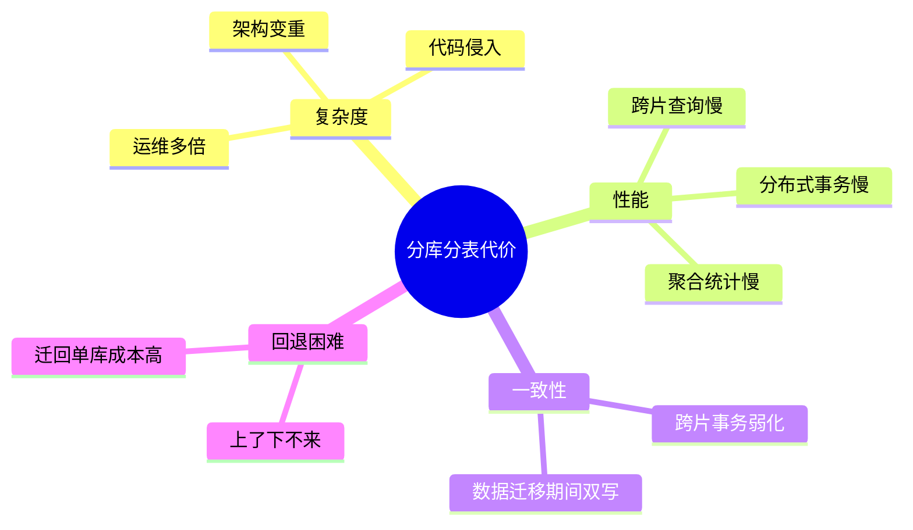

**铁律**：**分库分表是单向的——上去容易下来难**。

### 2.3 一致性挑战

单库时，所有写入都是 ACID 的。分库后：

- 跨库事务无法直接靠数据库保证
- 中间状态可能被读取
- 主从延迟更复杂（每个分片各自延迟）

需要引入**分布式事务**或**最终一致性补偿**。

### 2.4 分库分表的本质

> **分库分表 = 用"业务复杂度"换"数据库扩展性"**

它不是性能优化，是**容量扩展**。能用其他手段（缓存、读写分离、归档）解决的，**绝对不上分库分表**。

## 03.业界主流方案

### 3.1 三种分片层次

**应用层分片（嵌入 SDK）**
代表：sharding-jdbc / sharding-sphere（应用模式）。在应用层拦截 SQL，路由到目标分片。
- 优点：轻量、性能好
- 缺点：每个语言要单独适配

**代理层分片（中间件代理）**
代表：MyCat / Apache ShardingSphere-Proxy / Vitess。前置一个代理服务，伪装成 MySQL。
- 优点：跨语言、应用无侵入
- 缺点：多一跳网络、代理本身高可用要保证

**数据库层分片（NewSQL）**
代表：TiDB / OceanBase / CockroachDB。数据库自身就是分布式的。
- 优点：对应用透明，最少改造
- 缺点：替换数据库，迁移成本高

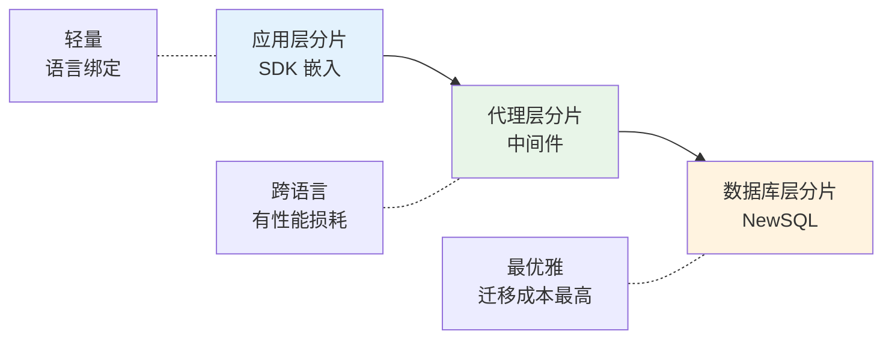

### 3.2 横向对比矩阵

| 维度 | sharding-jdbc | ShardingSphere-Proxy | MyCat | TiDB |
|---|---|---|---|---|
| **类型** | SDK | 代理 | 代理 | NewSQL |
| **语言** | 仅 Java | 任何 | 任何 | 任何 |
| **性能** | 高（无代理） | 中（多一跳） | 中 | 高 |
| **运维** | 应用维护 | 独立服务 | 独立服务 | 独立集群 |
| **分布式事务** | XA / Seata | 同上 | XA | 原生支持 |
| **自动扩容** | 手动 | 手动 | 手动 | 自动 |
| **学习曲线** | 中 | 中 | 中 | 平 |
| **代表用户** | 京东 / 一些金融 | 通用 | 早期国内 | PingCAP / 字节 |

### 3.3 典型架构案例

**案例：某电商订单表分库分表**

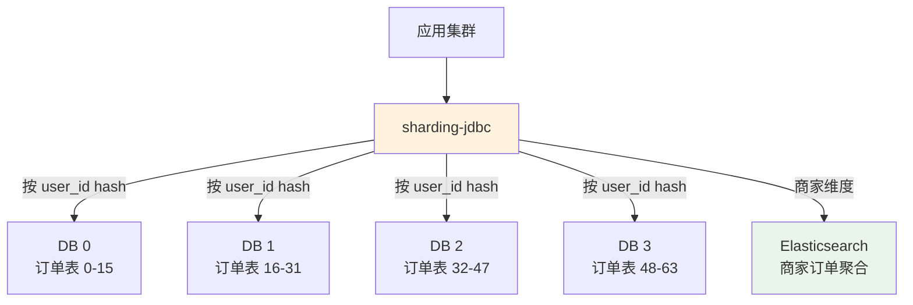

**关键设计**：
- 主路径按 user_id 分片（用户查自己订单 → 单分片命中）
- 商家维度异步同步到 ES（商家查所有订单 → 走 ES 不走 DB）

**这就是经典的"主分片 + 异构索引"模式**。

## 04.设计核心原则

### 4.1 推迟原则

**永远把分库分表当作最后选择**。优先尝试：

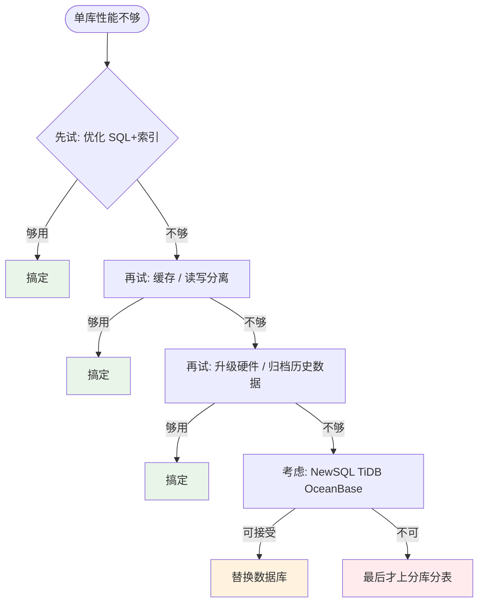

### 4.2 单维度原则

**铁律**：**只能按一个维度分片**。

如果业务真的有多个查询维度（如订单要"按用户查"也要"按商家查"），主路径选一个维度分片，其他维度通过：
- **异构索引**（如 ES）
- **数据冗余双写**
- **离线统计**

来兜底。**强行要求一个分片键满足所有查询是不可能的**。

### 4.3 容量预留原则

**经验公式**：分片数 = 当前数据量 × 5 / 单分片承载量

```
当前 1000w 数据
预期 5 年后 5000w
单分片承载 1000w（5000w / 5）
预留 1 倍 = 10 个分片
```

**关键提醒**：
- **分片数最好是 2 的幂次**（16 / 32 / 64），方便扩容
- **但不要一开始就分到 64 / 128**，那是 10 年后的需求
- **常见错误是"分多了"而不是"分少了"**——分多了是永久浪费，分少了还能扩容

### 4.4 平滑迁移原则

**生产环境从单库迁移到分库分表，最大风险是"过程不可逆"**。必须有：

- 双写期可独立读写两边
- 任何时刻可一键切回老数据库
- 数据校验工具完备
- 灰度切流可分批

## 05.分片策略选型

### 5.1 范围分片

按主键范围拆分，如 ID 1-1000w 在 DB0、1000w-2000w 在 DB1。

**优点**：扩容简单（加新区间）、范围查询友好
**缺点**：**热点严重**（最新数据集中在最后一个分片）

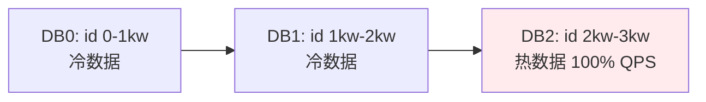

**适用**：日志型数据、按时间归档场景。

### 5.2 哈希分片

`shard = hash(user_id) % N`。最常见的方案。

**优点**：数据分布均匀、无热点
**缺点**：扩容困难（取模数变化要全部重算）

### 5.3 一致性哈希

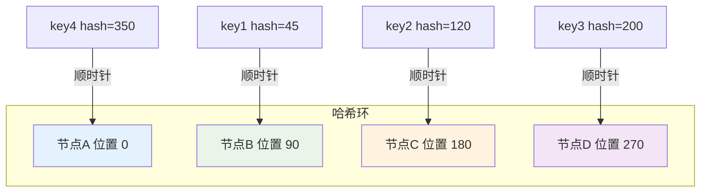

**优点**：扩容时只影响相邻节点，迁移数据少
**缺点**：实现复杂、单点扩容仍可能不均（虚拟节点解决）

**适用**：动态扩缩容频繁的场景。

### 5.4 基因法分片

**问题**：用 user_id 分片，但订单需要按 order_id 查询怎么办？

**基因法**：让 order_id **包含 user_id 的"分片基因"**。

```kotlin
// 假设分片数 16（4 bit）
fun generateOrderId(userId: Long): Long {
    val gene = userId and 0x0F  // 取 user_id 低 4 位作为基因
    val rawId = snowflake.nextId() and 0xFFFFFFFFFFFFFFF0  // 雪花 ID 低 4 位置 0
    return rawId or gene  // 拼接基因
}

// 查询订单时直接从 order_id 提取分片
fun getShardByOrderId(orderId: Long): Int {
    return (orderId and 0x0F).toInt()
}
```

这样**用 user_id 或 order_id 都能定位到同一分片**，避免了二级索引。

### 5.5 选型对比

| 维度 | 范围 | 哈希 | 一致性哈希 | 基因法 |
|---|---|---|---|---|
| 数据均匀 | ❌ 易热点 | ✅ | ✅ | ✅ |
| 扩容容易 | ✅ | ❌ | ✅ | ❌ |
| 范围查询 | ✅ | ❌ | ❌ | ❌ |
| 多键查询 | ❌ | ❌ | ❌ | ✅ |
| 实现复杂度 | 简单 | 简单 | 中 | 中 |

**实战推荐**：**绝大多数场景用哈希分片**。需要多键查询时叠加基因法。

## 06.关键问题解决

### 6.1 多维度查询

**场景**：订单按 user_id 分片后，商家查"我的所有订单"怎么办？

**方案**：

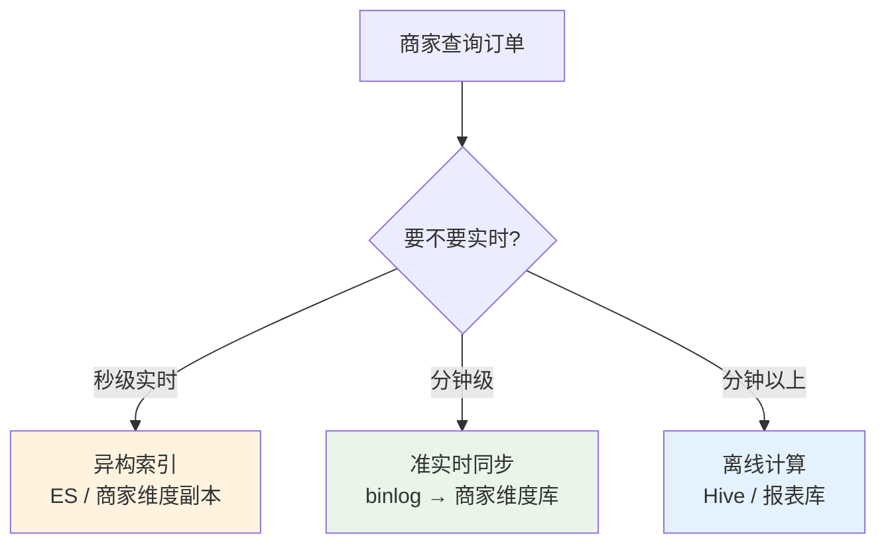

**主流方案**：用 binlog 把订单数据同步到 ES，商家查询走 ES。

### 6.2 跨库 JOIN

**问题**：订单库和商品库不在一起，怎么查"订单 + 商品"？

**解决思路**：

| 方案 | 做法 | 适用 |
|---|---|---|
| **冗余字段** | 下单时把商品名 / 价格冗余到订单表 | 不变信息冗余 |
| **应用层拼接** | 先查订单再批量查商品 | 灵活但代码复杂 |
| **数据宽表** | 异步把订单+商品打成宽表落 ES | 报表 / 检索 |
| **CTE / 内存 JOIN** | 应用层用流处理拼接 | 小批量 |

### 6.3 分布式 ID

分库分表后不能再用数据库自增 ID（会重复）。主流方案：

| 方案 | 优点 | 缺点 |
|---|---|---|
| **UUID** | 简单、全局唯一 | 36 位字符串、索引差 |
| **数据库号段** | 趋势递增 | 单点风险 |
| **雪花算法（Snowflake）** | 64 位、趋势递增、高吞吐 | 时钟回拨问题 |
| **美团 Leaf** | 号段 + 雪花混合 | 实现复杂 |
| **百度 UidGenerator** | 雪花改进版 | 复杂 |

**实战推荐**：**雪花算法 + 时钟回拨保护**最通用。

### 6.4 分布式事务

**经典三方案**：

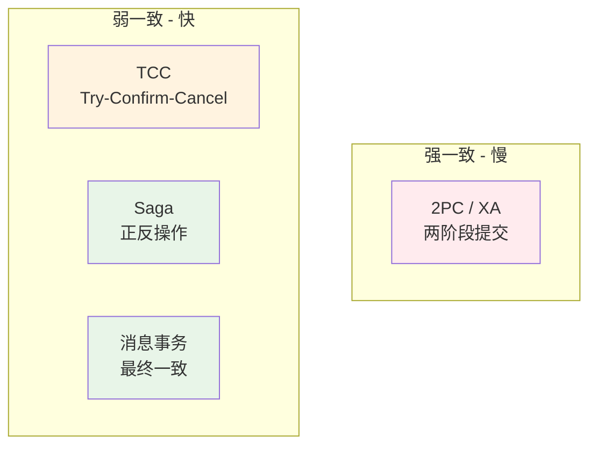

| 方案 | 一致性 | 性能 | 复杂度 | 适用 |
|---|---|---|---|---|
| **2PC/XA** | 强 | 差 | 中 | 小流量金融 |
| **TCC** | 准强 | 中 | 高 | 大额支付 |
| **Saga** | 最终 | 好 | 中 | 多步业务流程 |
| **消息事务** | 最终 | 最好 | 低 | 异步补偿 |

**实战推荐**：**90% 场景用消息事务（最终一致）**，特殊场景用 TCC / Saga。

## 07.数据迁移方案

### 7.1 双写迁移

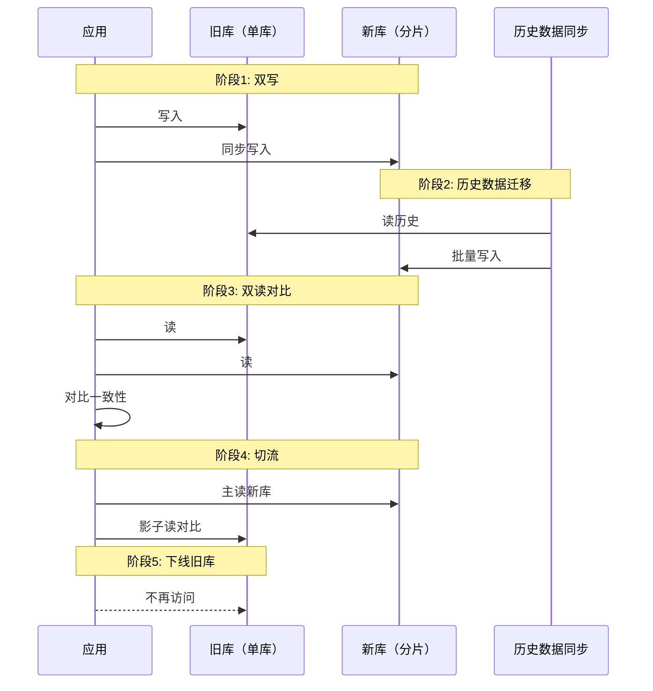

**完整迁移流程一般跨度 1-3 个月**。

### 7.2 数据校验

迁移过程必须有**全量校验工具**：

| 维度 | 校验方法 |
|---|---|
| 总行数 | `SELECT COUNT(*)` 对比 |
| 抽样字段 | 随机抽样比对每个字段 |
| 关键统计 | 总金额 / 总订单数等业务指标 |
| 增量数据 | binlog 对比 |

**铁律**：**没经过校验的迁移就是事故的引信**。

### 7.3 灰度切流

```
0.1% → 1% → 5% → 20% → 50% → 100%
每一档观察至少 24 小时
```

每一档都要监控：
- 业务错误率
- 数据一致性
- 性能指标

### 7.4 回滚兜底

**任何时刻都要能回滚**：

| 阶段 | 回滚方式 |
|---|---|
| 双写期 | 直接停掉新库写入 |
| 切流期 | 一键切回 100% 老库 |
| 完全切完后 | 老库保留 30+ 天可查 |

## 08.常见陷阱与反例

### 8.1 过早分片反例

**反例**：开篇那个 800w 订单团队过度自信分片，结果业务变重无收益。

**教训**：**过早分片 = 用 5 年后的复杂度换今天不存在的问题**。

### 8.2 分片键选错反例

**反例**：某社交 App 按 user_id 分片消息表，结果群消息查询要扫所有分片。

**教训**：**分片键必须是最高频的查询条件**。如果业务 80% 查询走另一个维度，应该选另一个维度。

### 8.3 容量评估错误反例

**反例**：某团队按 1 年增量算分片数（4 库 8 表），结果 18 个月后又要二次分片，数据迁移地狱。

**教训**：**分片数评估按 5 年容量做，但不要超过 10 年**。预留过多也是浪费。

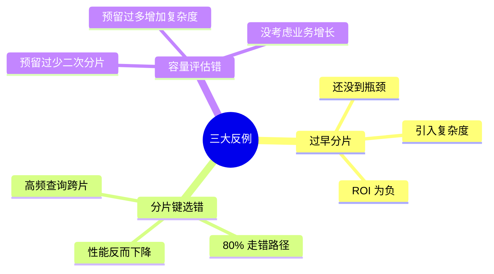

## 09.总结与决策

### 9.1 启动前检查表

启动分库分表项目前对照这张清单：

- [ ] 确认单库已经触及瓶颈（不是猜的）
- [ ] 已经尝试过缓存、读写分离、归档
- [ ] 业务团队对"跨片查询变慢"有共识
- [ ] 主分片键已经评估（覆盖 ≥ 80% 查询）
- [ ] 异构索引方案已设计（覆盖剩余 20%）
- [ ] 分布式 ID 方案就位
- [ ] 分布式事务方案就位
- [ ] 数据迁移工具开发完成
- [ ] 数据校验工具开发完成
- [ ] 回滚预案已演练
- [ ] 监控大盘已就位（每个分片独立 + 总）
- [ ] 容量按 5 年规划，分片数为 2 的幂次

### 9.2 选型决策树

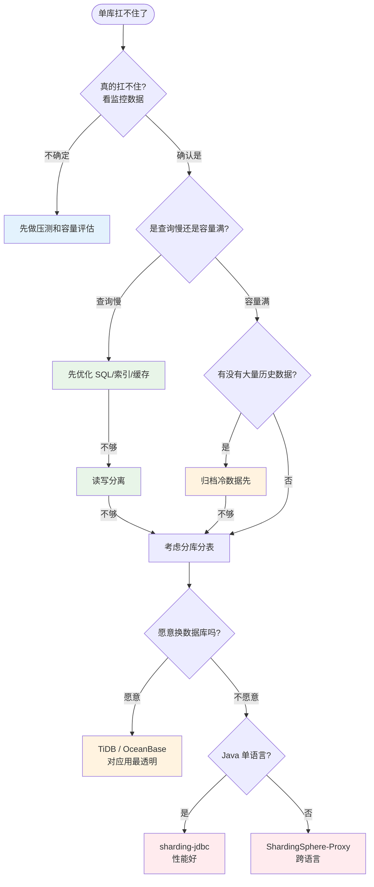

**最后一句话**：分库分表不是技术炫技，是**业务被逼到墙角的最后选择**。开篇那个团队的悲剧在于他们把"猛药"当成"补品"。

> 好的分库分表 = **能用其他方案就别用它，用了就要做对所有细节**。
