# 10.数据同步与迁移方案

> **本篇定位**：数据同步是分布式系统的"血液循环"——不论是数据库主从、跨库异构、机房双活、业务搬迁，本质都是"让一份数据在多处保持一致"。本文从一次跨机房迁移的事故讲起，回答三个核心问题——**同步和迁移有什么区别？业界三种方案怎么选？大数据量怎么平滑迁移？**

#### 目录介绍
- [01.一次跨机房的迁移](#01一次跨机房的迁移)
  - [1.1 业务搬迁背景](#11-业务搬迁背景)
  - [1.2 三天迁移的事故](#12-三天迁移的事故)
  - [1.3 反思迁移设计](#13-反思迁移设计)
- [02.要解决的核心矛盾](#02要解决的核心矛盾)
  - [2.1 同步与迁移区别](#21-同步与迁移区别)
  - [2.2 一致性与时延](#22-一致性与时延)
  - [2.3 业务连续与数据搬运](#23-业务连续与数据搬运)
  - [2.4 同步迁移的本质](#24-同步迁移的本质)
- [03.业界主流方案](#03业界主流方案)
  - [3.1 三类同步方式](#31-三类同步方式)
  - [3.2 横向对比矩阵](#32-横向对比矩阵)
  - [3.3 典型工具选型](#33-典型工具选型)
- [04.设计核心原则](#04设计核心原则)
  - [4.1 业务无感原则](#41-业务无感原则)
  - [4.2 可观测原则](#42-可观测原则)
  - [4.3 可回滚原则](#43-可回滚原则)
  - [4.4 增量优先原则](#44-增量优先原则)
- [05.同步方案落地](#05同步方案落地)
  - [5.1 binlog 同步原理](#51-binlog-同步原理)
  - [5.2 全量+增量同步](#52-全量增量同步)
  - [5.3 异构数据同步](#53-异构数据同步)
  - [5.4 双向同步与冲突解决](#54-双向同步与冲突解决)
- [06.迁移方案落地](#06迁移方案落地)
  - [6.1 整体迁移流程](#61-整体迁移流程)
  - [6.2 数据校验工具](#62-数据校验工具)
  - [6.3 切流策略](#63-切流策略)
  - [6.4 回滚兜底机制](#64-回滚兜底机制)
- [07.常见陷阱与反例](#07常见陷阱与反例)
  - [7.1 同步延迟反例](#71-同步延迟反例)
  - [7.2 数据丢失反例](#72-数据丢失反例)
  - [7.3 双写不一致反例](#73-双写不一致反例)
- [08.演进路线](#08演进路线)
  - [8.1 V1 应用层双写](#81-v1-应用层双写)
  - [8.2 V2 binlog 订阅](#82-v2-binlog-订阅)
  - [8.3 V3 数据集成平台](#83-v3-数据集成平台)
- [09.总结与决策](#09总结与决策)
  - [9.1 迁移上线检查表](#91-迁移上线检查表)
  - [9.2 选型决策树](#92-选型决策树)


## 01.一次跨机房的迁移

### 1.1 业务搬迁背景

某金融公司因为合规要求，需要把核心业务从公有云迁移到自建机房。涉及：
- 核心订单库 800GB / 1.2 亿条数据
- 用户库 200GB / 5000 万账户
- 资金流水库 1.5TB / 3 亿条记录
- **业务必须 7×24 不停机**

### 1.2 三天迁移的事故

团队选了 "**导出 + 导入 + 切流**" 的"传统"方案：

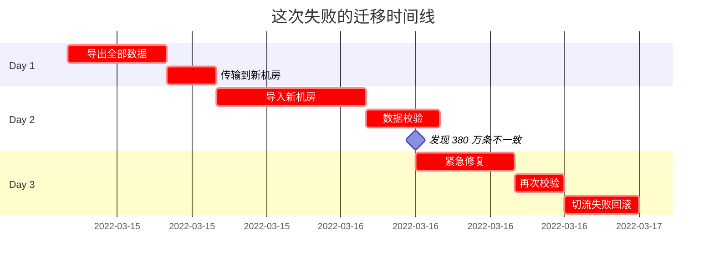

**为什么会出 380 万条不一致**？因为**导出期间业务还在持续写入旧库**，导出的是某个时间点的快照，**之后的所有写入都丢了**。

### 1.3 反思迁移设计

事后这个团队学到了三个最重要的认知：

1. **大数据量迁移必须"全量+增量"**——纯全量导出导入根本不行
2. **数据校验是迁移成败的分水岭**——不校验的迁移就是赌博
3. **切流必须可灰度**——一刀切流要么不出事，出事就是 P0

> 这次惨痛的教训背后，是对"业务无感迁移"这个本质要求的低估。

## 02.要解决的核心矛盾

### 2.1 同步与迁移区别

很多人把"同步"和"迁移"混为一谈，其实有本质区别：

| 维度 | 数据同步 | 数据迁移 |
|---|---|---|
| **目的** | 持续保持多处一致 | 一次性搬到新地方 |
| **持续时间** | 永久 | 有终点 |
| **业务感知** | 长期共存 | 切换后旧的下线 |
| **典型场景** | 主从 / 异地多活 / 异构索引 | 上云 / 换数据库 / 重构 |
| **复杂度** | 持续治理 | 一次性挑战 |

**很多迁移失败的根因是把它当成了"一次性同步"——而实际上它是"同步 + 校验 + 切流 + 下线"的完整工程**。

### 2.2 一致性与时延

| 一致性 | 同步时延 | 业务影响 |
|---|---|---|
| 强一致 | 毫秒级 | 写入慢但读取一致 |
| 准实时 | 秒级 | 写入快但有短暂延迟 |
| 最终一致 | 分钟级 | 性能最好但容忍滞后 |

**铁律**：**同步时延越低，对源系统的侵入越大**。

### 2.3 业务连续与数据搬运

迁移最大的挑战是**业务一边在跑，数据一边在搬**。三个动态难题：

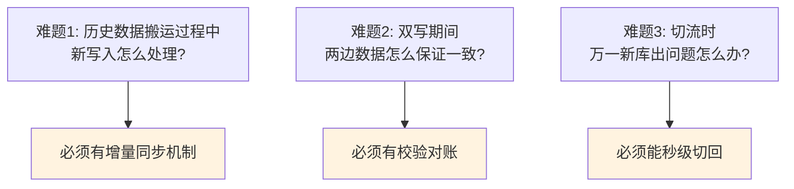

### 2.4 同步迁移的本质

> **数据同步迁移 = 在"业务持续运行"的前提下，把数据"无损"地从 A 搬到 B（或同时存在于 A 和 B）**

它的核心追求是 **不丢、不错、不停业务**。

## 03.业界主流方案

### 3.1 三类同步方式

**应用层双写**
应用代码同时写两个库。简单直接但侵入业务。

**binlog 订阅**
监听数据库 binlog（或 redo log），异步同步到目标。**不侵入业务**，是大数据量的首选。

**ETL 批量同步**
定时把数据批量从源拉到目标。延迟高但简单，适合数仓场景。

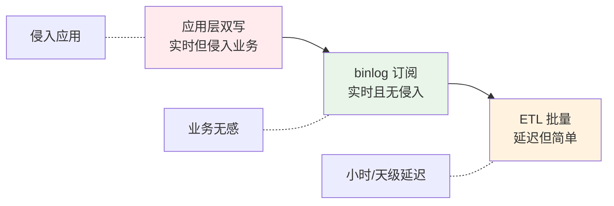

### 3.2 横向对比矩阵

| 维度 | 应用层双写 | binlog 订阅 | ETL 批量 |
|---|---|---|---|
| **实时性** | 毫秒 | 秒级 | 分钟到天 |
| **业务侵入** | 强 | 无 | 无 |
| **数据一致性** | 取决于实现 | 强（基于 redo log） | 弱 |
| **资源消耗** | 应用层负担 | 数据库 binlog | 定时任务 |
| **失败恢复** | 复杂 | 偏简单（位点） | 简单（重跑） |
| **适用场景** | 小流量 / 同构 | 实时同步 / 异构索引 | 数仓 / 报表 |

### 3.3 典型工具选型

| 工具 | 类型 | 主要场景 |
|---|---|---|
| **Canal** | binlog 订阅 | MySQL → 任意目标，国内最流行 |
| **Maxwell** | binlog 订阅 | MySQL → Kafka，简单易用 |
| **Debezium** | binlog 订阅 | 多数据库支持，CDC 平台首选 |
| **DataX** | ETL | 阿里开源，异构批量同步 |
| **Sqoop** | ETL | Hadoop 生态，关系库 ↔ HDFS |
| **Flink CDC** | 流式 | Debezium + Flink，强大但重 |
| **DTS（云厂商）** | 综合 | 上云首选，功能完整但要钱 |

**实战推荐**：
- **数据库实时同步**：Canal / Debezium
- **大数据 ETL**：DataX
- **异构索引（如 ES）**：Canal + Kafka + 消费者
- **跨云迁移**：云厂商 DTS

## 04.设计核心原则

### 4.1 业务无感原则

**铁律**：**迁移过程对业务无感**。

| 业务感知 | 不可接受 |
|---|---|
| 接口超时 | ❌ |
| 数据短暂丢失 | ❌ |
| 写入失败 | ❌ |
| 报错率上升 | ❌ |

**唯一可以接受的"感知"**：极短暂（几秒）的切流切换窗口。

### 4.2 可观测原则

**没有监控的迁移 = 蒙眼开车**。必须有的观测点：

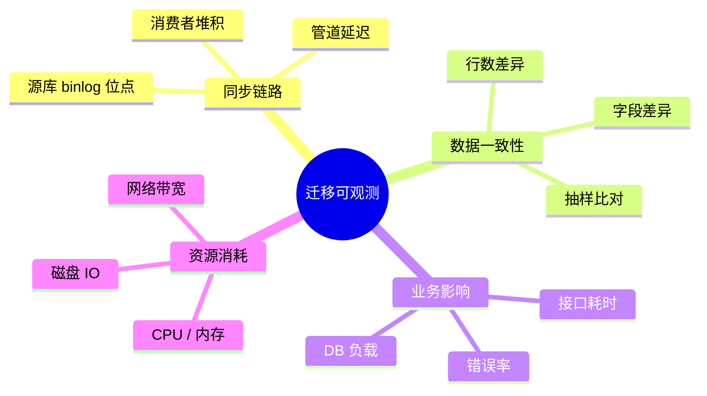

### 4.3 可回滚原则

**任何阶段都要能回滚**：

| 阶段 | 回滚方式 |
|---|---|
| 全量同步期 | 直接停掉同步任务 |
| 增量同步期 | 停同步 + 清理目标库 |
| 双写期 | 关闭新库写入 |
| 切流期 | 流量切回 100% 旧库 |
| 切完观察期 | 旧库还在，可一键切回 |

**铁律**：**旧库至少保留 30 天才能彻底下线**。

### 4.4 增量优先原则

**反直觉**：先做增量同步链路，再做全量同步。

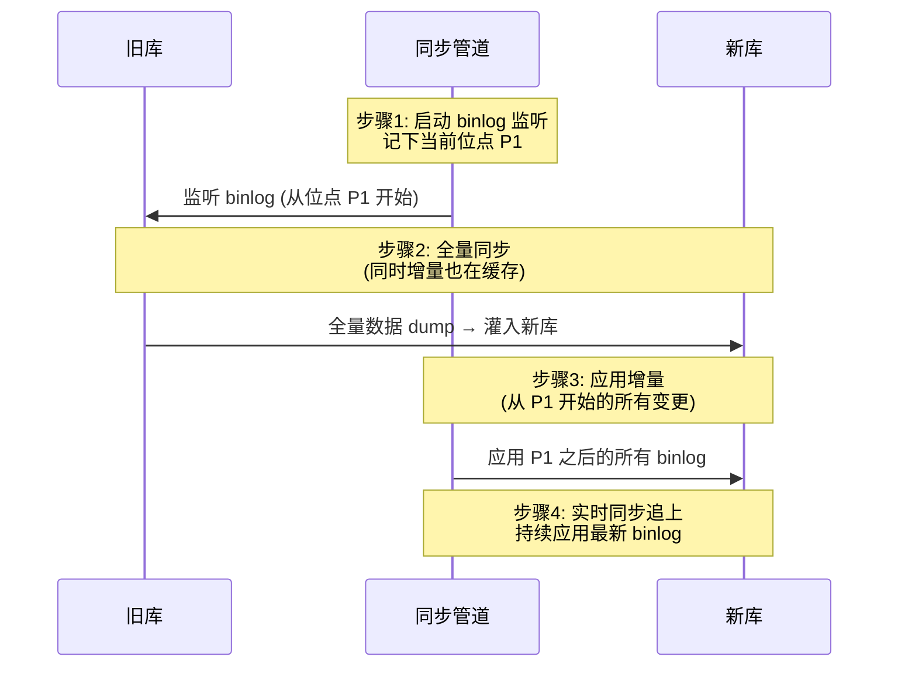

**为什么这样**：开篇那个事故就是因为没有先开启增量同步——全量导出期间的写入全丢了。**先开增量，全量怎么导都不会丢**。

## 05.同步方案落地

### 5.1 binlog 同步原理

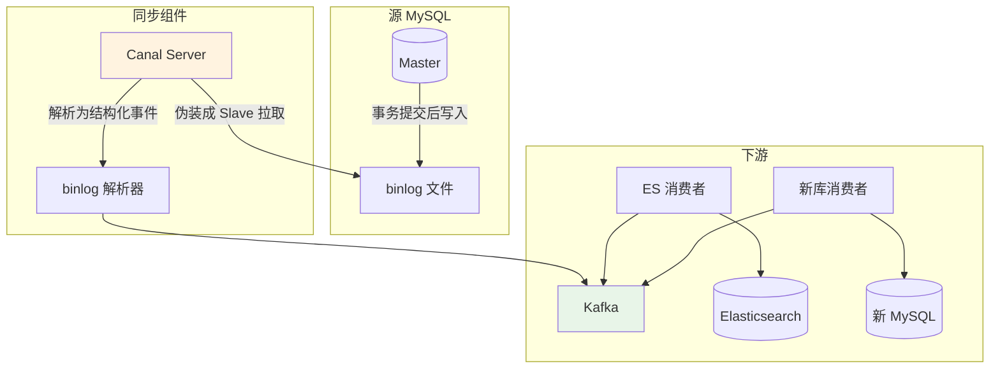

**核心原理**：
1. MySQL 写入时按事务粒度记录 binlog
2. Canal 伪装成从库拉取 binlog
3. 解析为结构化事件（INSERT / UPDATE / DELETE + 数据）
4. 推到 Kafka 让多个消费者订阅

**优势**：
- **业务无感**：不改任何应用代码
- **强一致性**：基于事务日志，不会丢
- **可重放**：消费者保存位点，故障可重放

### 5.2 全量+增量同步

完整迁移流程的 8 个步骤：

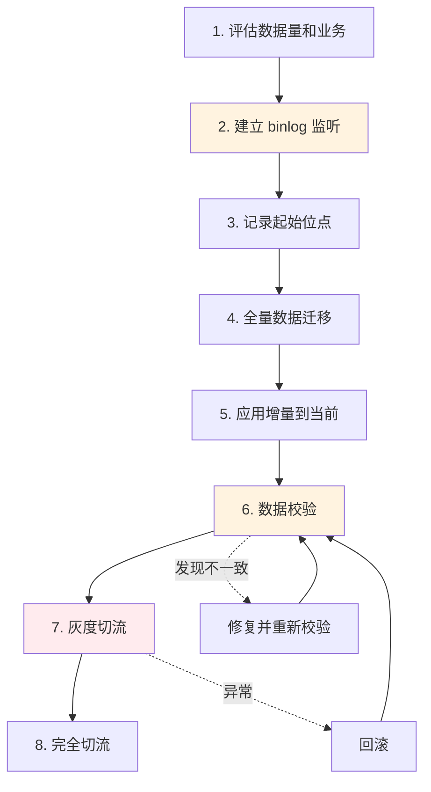

### 5.3 异构数据同步

**典型场景**：MySQL → ES（搜索）/ Hive（报表）/ Redis（缓存）

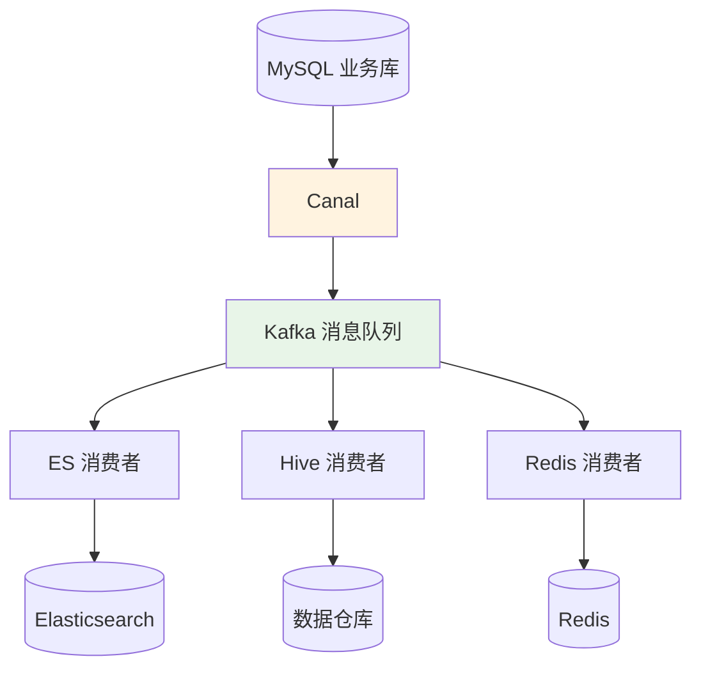

**关键设计**：
- 一个 Canal 可以接多个消费者（不要每种目标库开一个 Canal）
- Kafka 作为缓冲层，下游故障不影响主链路
- 每个消费者独立保存位点，互不影响

### 5.4 双向同步与冲突解决

**异地多活场景**：两个机房都接受写入，数据需要双向同步。

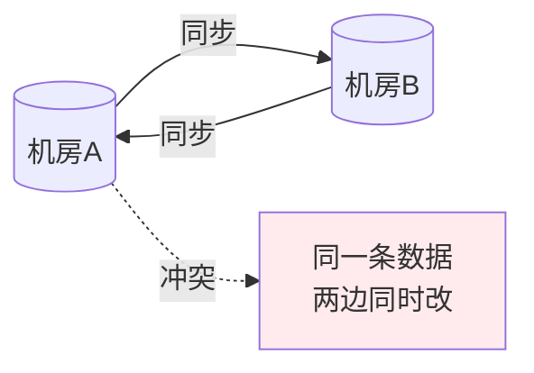

**冲突解决方案**：

| 方案 | 思路 | 适用 |
|---|---|---|
| **业务分区** | 每个用户固定路由到一个机房 | 大多数业务（最优） |
| **时间戳胜出** | 后写入的覆盖先写入的 | 容忍少量丢失 |
| **版本向量** | 每条数据带版本号比较 | 复杂场景 |
| **CRDT** | 冲突自由数据结构 | 计数器 / 集合等 |

**实战推荐**：**90% 选业务分区**——避免冲突好过解决冲突。

## 06.迁移方案落地

### 6.1 整体迁移流程

完整迁移项目的标准节奏：

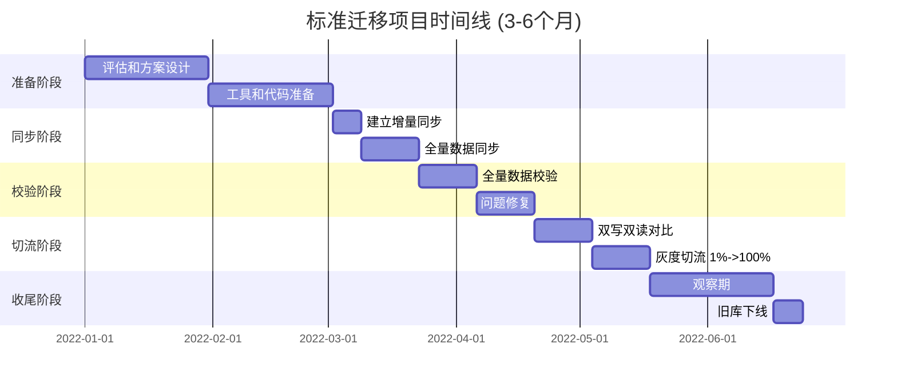

### 6.2 数据校验工具

校验是迁移成败的"分水岭"。必须有的校验工具：

```sql
-- 1. 行数校验
SELECT COUNT(*) FROM old_db.t_order;
SELECT COUNT(*) FROM new_db.t_order;

-- 2. 抽样校验（每个分片随机 1000 条）
SELECT * FROM t_order TABLESAMPLE BERNOULLI(0.001);

-- 3. 业务指标校验
SELECT SUM(amount), COUNT(DISTINCT user_id) FROM t_order;

-- 4. 边界校验
SELECT MAX(id), MIN(id), MAX(created_at), MIN(created_at) FROM t_order;
```

**完整校验工具应该具备**：
- **全量行数对比**（按时间窗口分批）
- **抽样字段对比**（每天抽 N 万条）
- **业务指标对比**（总金额、UV、PV）
- **不一致数据导出**（修复用）
- **持续校验**（双写期间天天跑）

### 6.3 切流策略

**渐进式切流**是必经之路：


**每一档都要看**：
- 业务错误率没有上升
- 接口耗时没有恶化
- 数据一致性持续 OK
- DB 负载在可控范围

### 6.4 回滚兜底机制

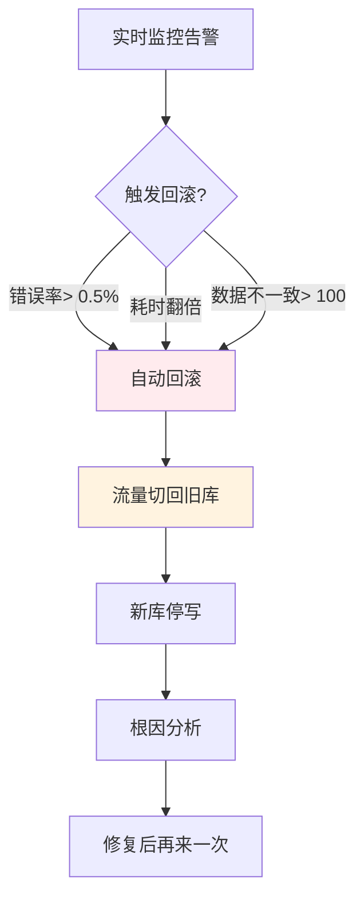

**关键能力**：**回滚必须 < 1 分钟生效**。所以路由层（如 Apollo 配置 / nginx 路由表）要支持瞬间切换。

## 07.常见陷阱与反例

### 7.1 同步延迟反例

**反例**：某团队 binlog 同步链路出现 30 分钟延迟，但下游业务没意识到，**用户改了密码后 30 分钟内还能用旧密码登录**——直接爆出安全事故。

**教训**：
- 同步延迟必须监控告警（阈值如 1 分钟）
- 关键业务（鉴权 / 资金）应该走强一致路径，不依赖异步同步
- 延迟超过阈值应自动降级（如读改为强制读主库）

### 7.2 数据丢失反例

**反例**：开篇那个 380 万条丢失——**全量导出期间没开增量同步**。

**教训**：
- 永远先开增量再做全量
- 全量完成后必须应用增量"追上"
- 校验必须严格

### 7.3 双写不一致反例

**反例**：应用层双写，"先写老库再写新库"。但某次老库成功新库失败，应用没处理——**老库有这条数据，新库没有**。

**教训**：
- 应用层双写必须考虑部分失败场景
- 推荐方案：**主写老库 + binlog 同步到新库**（避免应用层双写的复杂度）
- 或者用分布式事务 + 补偿机制

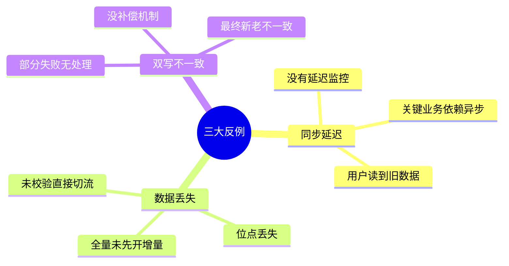

## 08.演进路线

### 8.1 V1 应用层双写

**特征**：业务量小、迁移规模小。

**做法**：
- 应用代码直接双写
- 简单的失败重试
- 人工对账

**适用阶段**：早期 / 小规模

### 8.2 V2 binlog 订阅

**特征**：数据量大、业务复杂。

**做法**：
- Canal / Debezium 订阅 binlog
- Kafka 缓冲
- 多消费者订阅
- 完善的监控

**适用阶段**：中大型业务、跨库异构

### 8.3 V3 数据集成平台

**特征**：公司级数据集成、多源多目标。

**做法**：
- 自建数据集成平台（如阿里 DataWorks）
- 可视化配置同步任务
- 统一的监控、告警、调度
- 数据血缘和数据治理

**适用阶段**：大型公司、多团队多业务线


## 09.总结与决策

### 9.1 迁移上线检查表

启动数据迁移项目前对照这张清单：

- [ ] 数据量和增长速度已评估
- [ ] 选定了同步方案（binlog / 双写 / ETL）
- [ ] 工具和代码已就绪
- [ ] 增量同步链路已建立并验证
- [ ] 全量同步方案已确定（按时间 / 按 ID 分批）
- [ ] 校验工具已开发完成
- [ ] 切流路由层就绪（可秒级切换）
- [ ] 监控大盘已搭建（同步延迟、一致性、业务指标）
- [ ] 回滚预案已演练
- [ ] 旧库下线计划已对齐（至少观察 30 天）
- [ ] 关联团队已对齐（业务 / 运维 / DBA）
- [ ] 容灾方案：迁移期间源库或目标库挂了怎么办

### 9.2 选型决策树

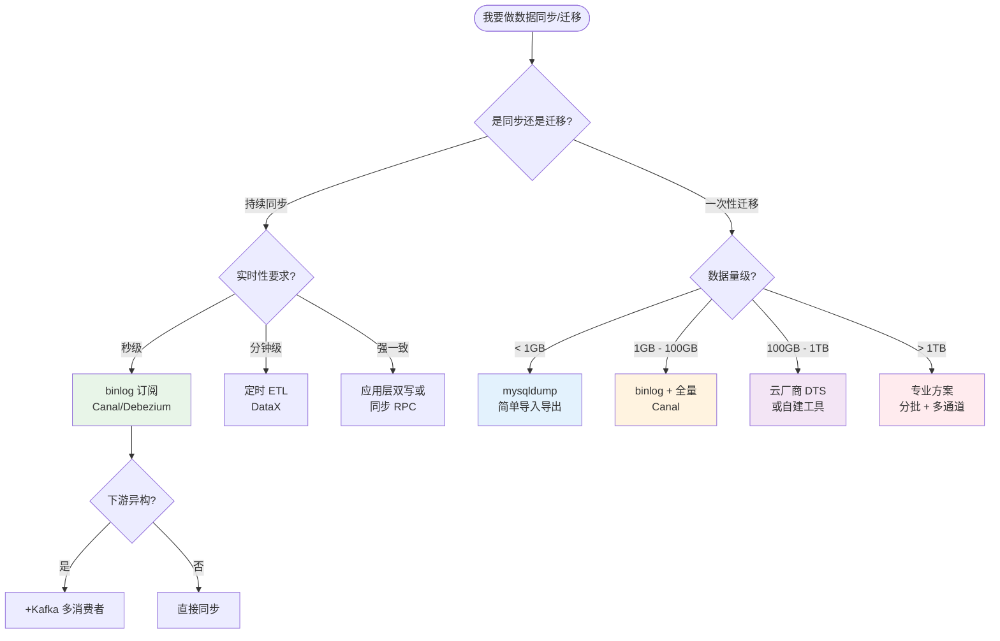

**最后一句话**：数据同步迁移是**信息系统最危险的工程之一**——比新功能开发危险 10 倍，因为它涉及"已经存在的生产数据"。开篇那个 380 万条丢失只是冰山一角。

> 好的数据迁移 = **业务无感、数据无损、过程可控、终态可信**。
