# 14.API网关设计方案

> **本篇定位**：API 网关是微服务的"门面"——所有外部流量的第一道关卡。鉴权、限流、路由、监控全在它身上。本文从一个被攻击穿透的网关故事讲起，回答三个核心问题——**网关解决什么本质问题？业界四大网关怎么选？怎么设计一个生产级网关？**

#### 目录介绍
- [01.被攻击的网关](#01被攻击的网关)
  - [1.1 一次零日漏洞](#11-一次零日漏洞)
  - [1.2 攻击扩散链路](#12-攻击扩散链路)
  - [1.3 反思网关设计](#13-反思网关设计)
- [02.要解决的核心矛盾](#02要解决的核心矛盾)
  - [2.1 没有网关的痛](#21-没有网关的痛)
  - [2.2 性能与功能](#22-性能与功能)
  - [2.3 集中与单点](#23-集中与单点)
  - [2.4 网关的本质](#24-网关的本质)
- [03.业界主流方案](#03业界主流方案)
  - [03.1 主流网关概览](#031-主流网关概览)
  - [03.2 横向对比矩阵](#032-横向对比矩阵)
  - [03.3 典型架构](#033-典型架构)
- [04.设计核心原则](#04设计核心原则)
  - [04.1 高性能优先](#041-高性能优先)
  - [04.2 高可用原则](#042-高可用原则)
  - [04.3 可扩展原则](#043-可扩展原则)
  - [04.4 可观测原则](#044-可观测原则)
- [05.网关核心能力](#05网关核心能力)
  - [05.1 路由转发](#051-路由转发)
  - [05.2 鉴权认证](#052-鉴权认证)
  - [05.3 限流熔断](#053-限流熔断)
  - [05.4 协议转换](#054-协议转换)
  - [05.5 灰度路由](#055-灰度路由)
- [06.关键问题解决](#06关键问题解决)
  - [06.1 高并发架构](#061-高并发架构)
  - [06.2 配置热更新](#062-配置热更新)
  - [06.3 插件化扩展](#063-插件化扩展)
- [07.常见陷阱与反例](#07常见陷阱与反例)
  - [07.1 网关单点反例](#071-网关单点反例)
  - [07.2 业务下沉反例](#072-业务下沉反例)
  - [07.3 性能瓶颈反例](#073-性能瓶颈反例)
- [08.演进路线](#08演进路线)
  - [08.1 V1 Nginx 反代](#081-v1-nginx-反代)
  - [08.2 V2 业务网关](#082-v2-业务网关)
  - [08.3 V3 多层网关](#083-v3-多层网关)
- [09.总结与决策](#09总结与决策)
  - [09.1 网关上线检查表](#091-网关上线检查表)
  - [09.2 选型决策树](#092-选型决策树)


## 01.被攻击的网关

### 1.1 一次零日漏洞

某 SaaS 公司用 Spring Cloud Gateway 做 API 网关，**所有外部流量都从这里进**。2022 年某天凌晨 03:00，黑客利用 **Spring4Shell（CVE-2022-22965）零日漏洞**对网关发起攻击。

**仅 8 分钟**：
- 03:00-03:02：黑客探测到漏洞
- 03:02-03:05：通过精心构造的请求触发 RCE
- 03:05-03:08：在网关上植入挖矿程序 + 反向 Shell
- 03:08-12:00：黑客在网关后端 1000+ 服务里横向移动

**直接影响**：客户数据泄露 80 万条，公司股价当日下跌 7%。

### 1.2 攻击扩散链路

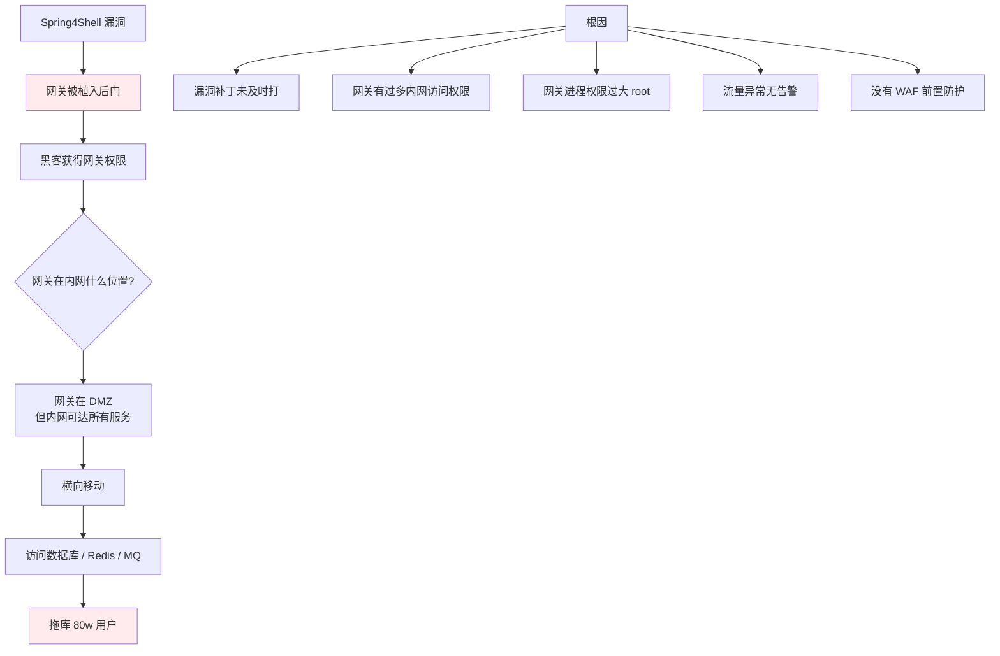

### 1.3 反思网关设计

事后这个团队总结了三个最深刻的教训：

1. **网关是攻击面最大的组件**——必须最优先打补丁
2. **网关权限要最小化**——只能访问它必须访问的东西
3. **网关前面要有 WAF**——专业的事交给专业的组件

> 网关因为"位置特殊"，既是流量入口也是攻击入口——它的安全设计直接决定整个系统的安全底线。

## 02.要解决的核心矛盾

### 2.1 没有网关的痛

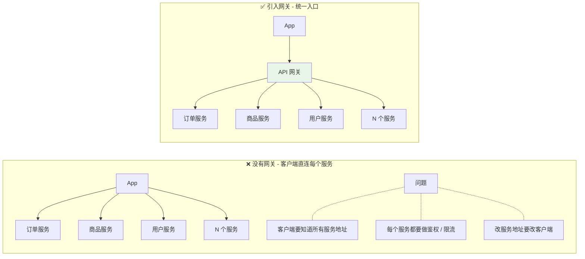

### 2.2 性能与功能

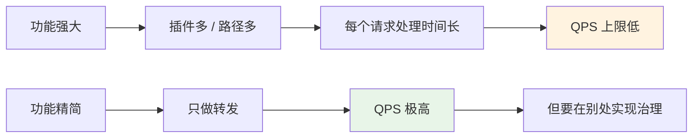

**实战折中**：**两层网关**——第一层流量网关（Nginx / Envoy）做转发，第二层业务网关（Spring Cloud Gateway / 自研）做业务逻辑。

### 2.3 集中与单点

网关是**单一入口的好处**：
- 统一治理点
- 配置集中
- 监控集中

**也是它的"诅咒"**：
- 网关挂了全站挂
- 性能瓶颈
- 攻击集中点

### 2.4 网关的本质

> **API 网关 = 把所有"横切关注点"（鉴权 / 限流 / 监控 / 路由）从业务代码里抽离到一个统一的"门口"**

它的核心追求是 **让业务代码只关心业务，让通用能力一处实现处处生效**。

## 03.业界主流方案

### 03.1 主流网关概览

**Nginx / OpenResty**
**最经典的网关**。C 实现，基于 epoll，单机百万 QPS。OpenResty = Nginx + Lua，可编程能力强。

**Spring Cloud Gateway**
**Java 系微服务首选**。基于 Reactor 异步，与 Spring 生态深度集成。

**Kong（OpenResty + 插件）**
**云原生网关代表**。基于 OpenResty 改造，丰富的插件生态，K8s 友好。

**Apisix（Apache）**
**国产开源新秀**。基于 OpenResty + etcd，性能极致，热插件能力强。

**Envoy（CNCF）**
**Service Mesh 时代标准**。C++ 实现，xDS 协议，云原生事实标准。

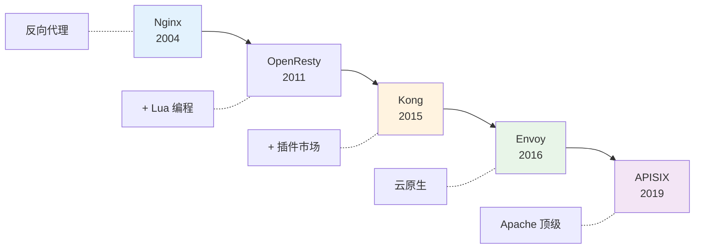

### 03.2 横向对比矩阵

| 维度 | Nginx | Spring Cloud Gateway | Kong | APISIX | Envoy |
|---|---|---|---|---|---|
| **语言** | C | Java | Lua / OpenResty | Lua / OpenResty | C++ |
| **性能** | ⭐⭐⭐⭐⭐ | ⭐⭐⭐ | ⭐⭐⭐⭐ | ⭐⭐⭐⭐⭐ | ⭐⭐⭐⭐⭐ |
| **可编程** | 需 Lua | Java 代码 | Lua 插件 | Lua 插件 | xDS 配置 |
| **配置热更新** | reload（有损） | ✅ | ✅ etcd | ✅ etcd | ✅ xDS |
| **K8s 友好** | 一般 | 一般 | ✅ | ✅ | ⭐⭐⭐⭐⭐ |
| **插件生态** | 弱 | 弱 | ⭐⭐⭐⭐⭐ | ⭐⭐⭐⭐ | 中 |
| **学习曲线** | 中 | 平 | 中 | 中 | 陡 |
| **典型用户** | 几乎所有公司 | 国内 Java 系 | 国外众多 | 国内众多 | Istio / 字节 |

### 03.3 典型架构

**业界经典的双层网关架构**：

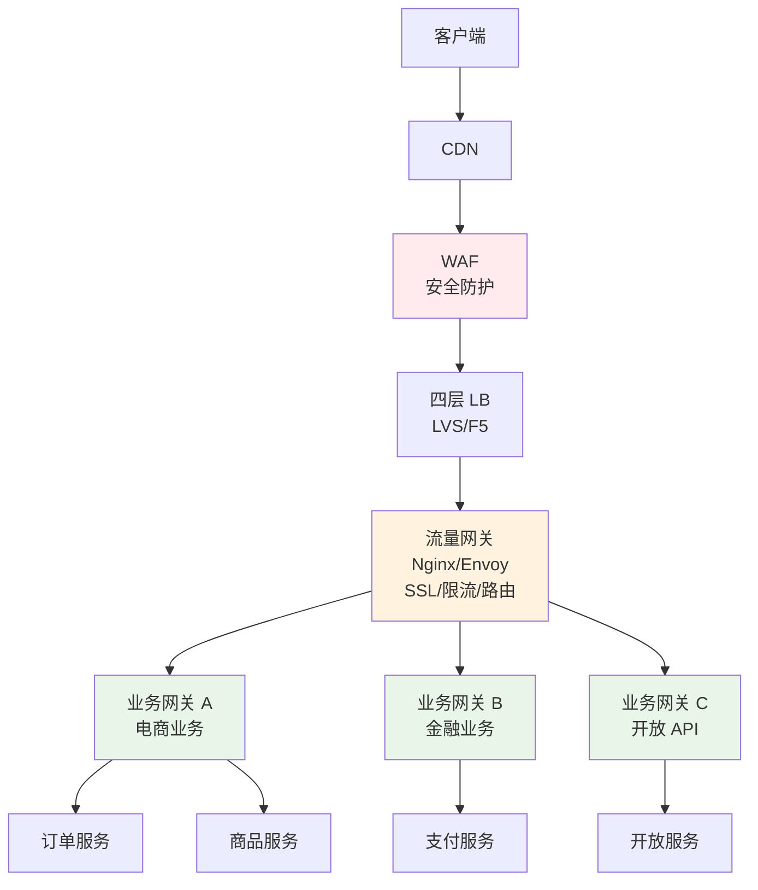

**两层职责划分**：

| 流量网关（共用） | 业务网关（按业务划分） |
|---|---|
| SSL 卸载 | 业务鉴权 |
| 全局限流 | 业务限流 |
| IP 黑白名单 | 业务路由 |
| 静态路由 | 协议转换 |
| DDoS 防护 | 业务参数校验 |

## 04.设计核心原则

### 04.1 高性能优先

**网关是流量必经之路**，性能差 = 全站慢。

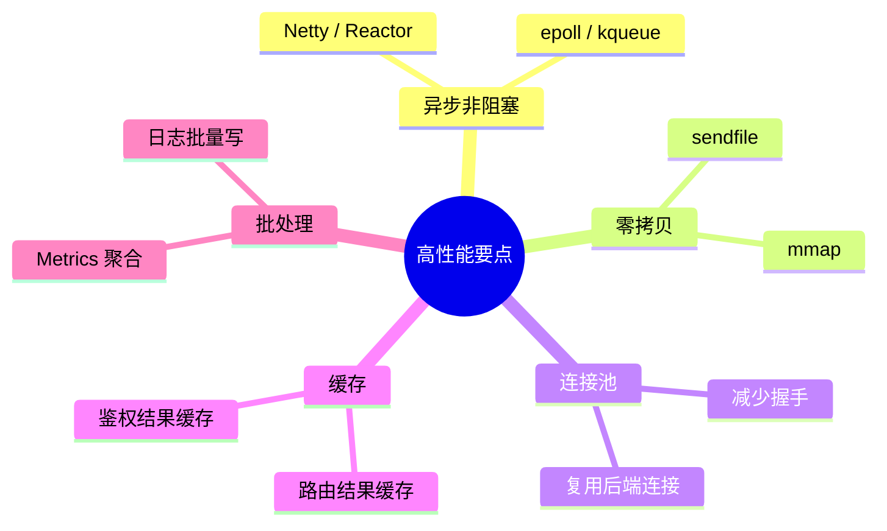

**性能基线**：
- 单核 5w QPS（基础转发）
- P99 < 5ms（无业务逻辑）
- 内存稳定（不能随流量增加爆涨）

### 04.2 高可用原则

**网关是单一入口，必须高可用**：

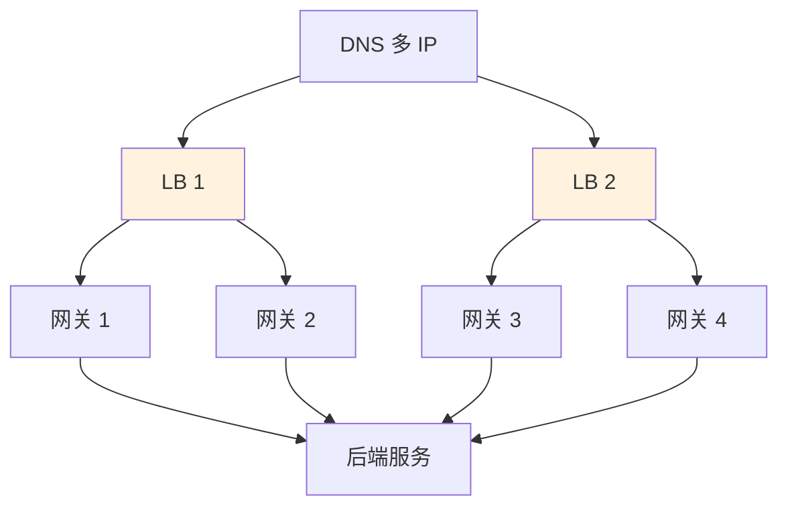

**关键能力**：
- **多机房多活**
- **健康检查 + 自动剔除**
- **优雅启停**（不中断已有连接）
- **配置回滚**（错误配置秒级回退）

### 04.3 可扩展原则

不同业务有不同需求——网关必须**插件化**，而不是把所有逻辑写死。

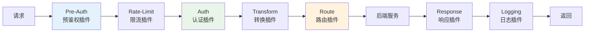

**插件化的好处**：
- 不同 API 启用不同插件组合
- 新需求开发新插件，不影响现有
- 插件可热加载

### 04.4 可观测原则

网关是流量必经之路，**天然就是可观测的最佳位置**。必备：

- **访问日志**：每个请求详细记录
- **Metrics**：QPS / RT / 错误率（按 API 粒度）
- **Tracing**：注入 traceId 透传到后端
- **健康检查**：暴露健康状态供 LB 探测

## 05.网关核心能力

### 05.1 路由转发

**路由匹配规则**：

| 维度 | 示例 |
|---|---|
| **Path** | `/api/v1/user/*` |
| **Method** | GET / POST |
| **Header** | `X-Version: 2.0` |
| **Query** | `?source=mobile` |
| **Cookie** | `region=us-east` |
| **IP** | 来源 IP 网段 |

**配置示例**（Spring Cloud Gateway 风格）：

```yaml
routes:
  - id: order-route
    uri: lb://order-service
    predicates:
      - Path=/api/v1/order/**
      - Method=GET,POST
      - Header=X-Version, 2\.\d+
    filters:
      - StripPrefix=2
      - AddRequestHeader=X-Source, gateway
```

### 05.2 鉴权认证

**经典鉴权流程**：

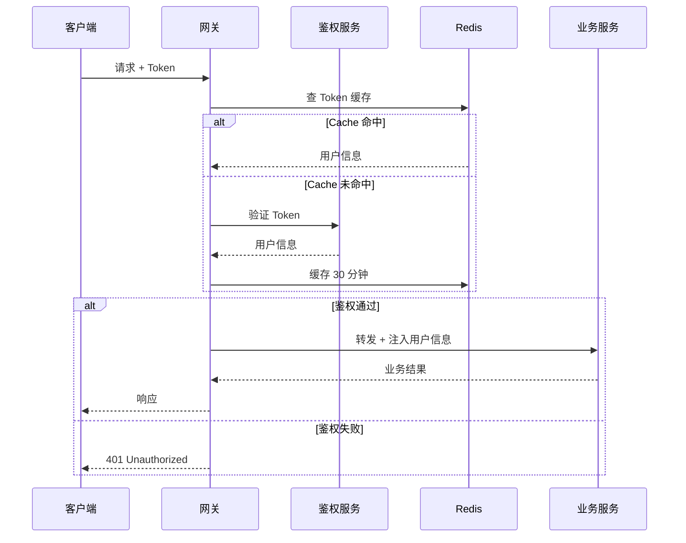

**常见鉴权方式**：

| 方式 | 流程 | 适用 |
|---|---|---|
| **Token / JWT** | 客户端带 Token，网关验签 | 主流互联网 |
| **OAuth 2.0** | 标准授权流程 | 第三方对接 |
| **API Key** | 客户端带 Key，服务端比对 | 开放 API |
| **HMAC 签名** | 参数 + 密钥签名 | 高安全 / 防篡改 |
| **mTLS** | 双向证书 | 内部 / 极高安全 |

### 05.3 限流熔断

**经典限流算法**：

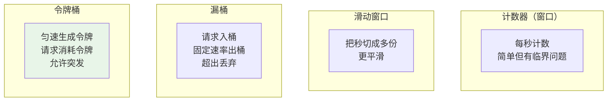

**实战推荐**：**令牌桶**——既能限制速率又能容忍短暂突发。

**多维度限流**：

| 维度 | 用途 |
|---|---|
| **全局 QPS** | 防止网关本身过载 |
| **API 级 QPS** | 单个 API 不能拖垮全局 |
| **用户级 QPS** | 防止单用户刷接口 |
| **IP 级 QPS** | 防止单 IP 攻击 |
| **租户级 QPS** | SaaS 多租户场景 |

### 05.4 协议转换

**典型场景**：客户端用 HTTP/JSON，后端用 gRPC/Protobuf。

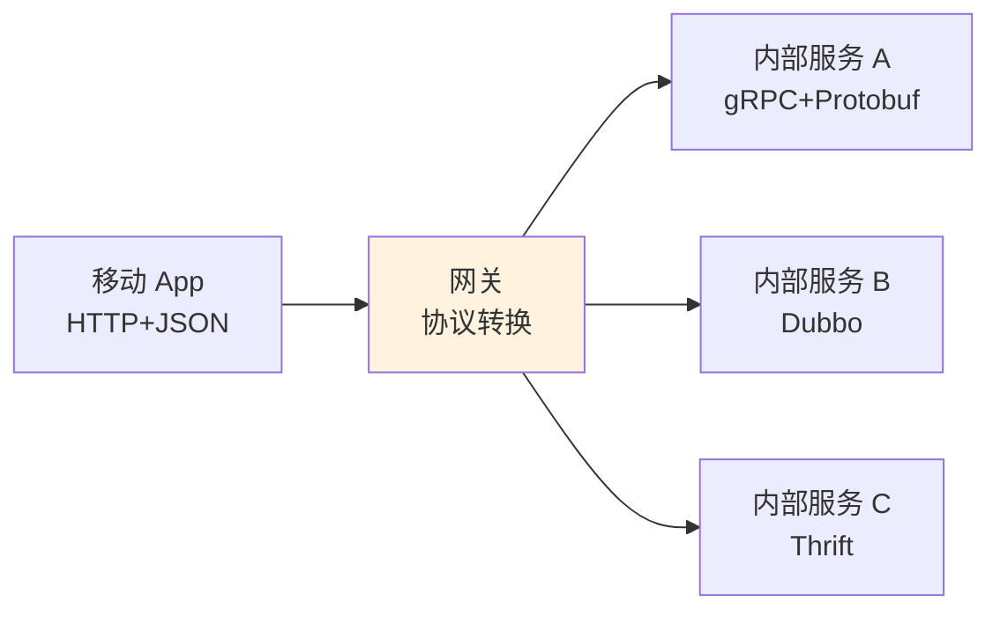

**常见转换组合**：
- HTTP/JSON ↔ gRPC/Protobuf
- HTTP/JSON ↔ Dubbo（Hessian）
- HTTP/REST ↔ GraphQL
- WebSocket ↔ MQTT

### 05.5 灰度路由

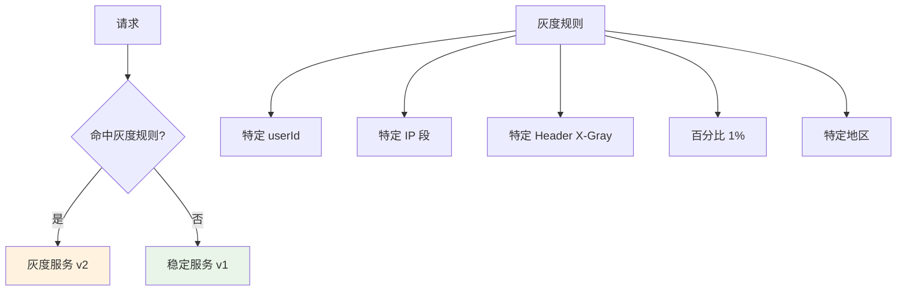

**实战经验**：从 1% → 5% → 20% → 50% → 100%，每档观察 24 小时。详见卷一第 06 篇配置中心。

## 06.关键问题解决

### 06.1 高并发架构

**单机百万 QPS 的关键技术**：

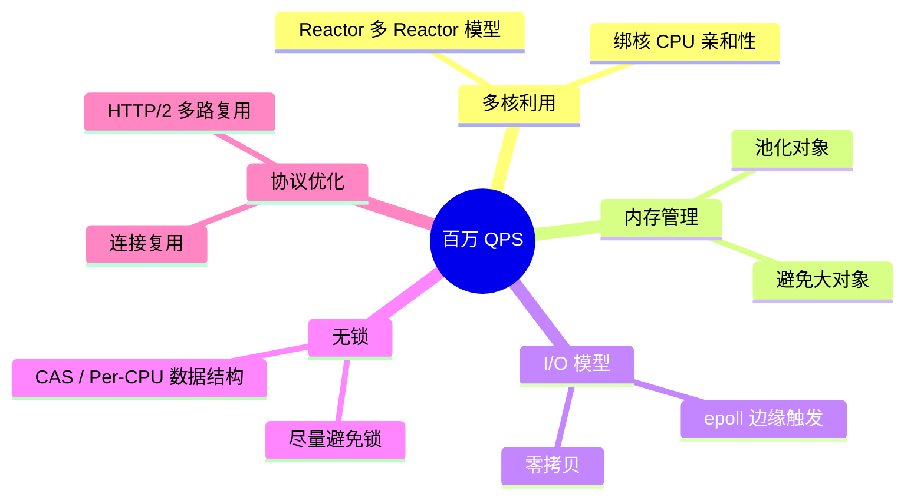

### 06.2 配置热更新

**网关配置变更不能影响线上请求**：

| 方案 | 实现 | 评价 |
|---|---|---|
| **Nginx reload** | 旧 worker 处理完老请求退出 | 有效但生效慢 |
| **etcd watch** | APISIX / Envoy 监听 etcd | 秒级生效 |
| **xDS 协议** | Envoy 标准 | 云原生标准 |
| **配置中心** | Apollo / Nacos | 与卷一第 06 篇打通 |

### 06.3 插件化扩展

**好的插件机制要满足**：

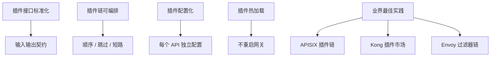

## 07.常见陷阱与反例

### 07.1 网关单点反例

**反例**：某公司用一台 Nginx 做网关，做高可用只在前面加了一个 keepalived。**Nginx 进程崩溃后 keepalived 检测不到**（端口还在但服务不通），全站半小时无响应。

**教训**：
- 必须多实例 + LB
- 健康检查要查应用层（不只是 TCP）
- 自动重启 + 自动剔除

### 07.2 业务下沉反例

**反例**：网关里写了大量业务代码——优惠券计算、用户等级判断、库存检查……**网关变成了"巨型业务网关"**，每次业务变更都要改网关，发布频繁、影响面大。

**教训**：
- 网关只做"通用能力"
- 业务逻辑放业务服务
- 网关代码要少而精

### 07.3 性能瓶颈反例

**反例**：某网关用 Spring Cloud Gateway，每个请求都同步调一次远程鉴权服务，**鉴权服务一抖网关全挂**。

**教训**：
- 鉴权结果必须缓存
- 同步调用必须有熔断
- 网关里**绝对不能有阻塞调用**

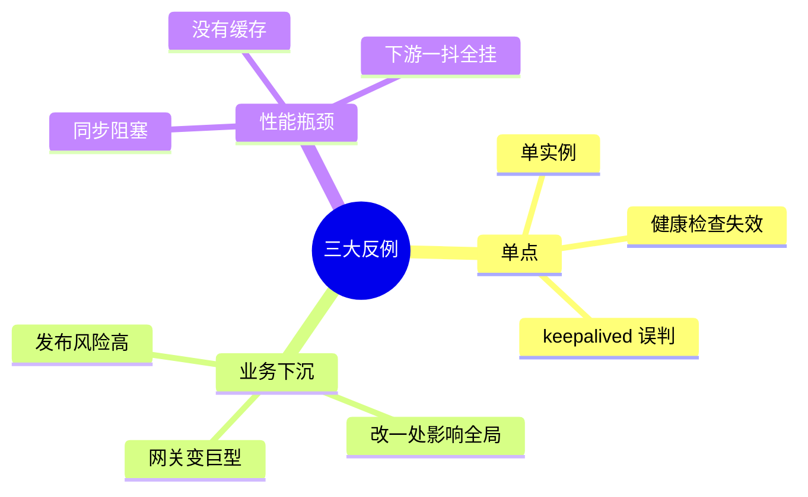

## 08.演进路线

### 08.1 V1 Nginx 反代

**特征**：单体应用 / 服务很少。

**做法**：
- 一台 Nginx 反向代理
- 配置文件路由
- 简单的 SSL / 限流

**适用阶段**：起步、< 10 服务

### 08.2 V2 业务网关

**特征**：微服务化、需要业务级治理。

**做法**：
- 引入 Spring Cloud Gateway / Kong / APISIX
- 鉴权 / 限流 / 路由 / 监控完备
- 配置中心化

**适用阶段**：10-1000 服务

### 08.3 V3 多层网关

**特征**：超大规模 / 多业务线。

**做法**：
- 流量网关（Envoy）+ 业务网关（按业务）
- WAF 前置
- Service Mesh 取代部分网关功能
- 全球多接入点 + 智能 DNS

**适用阶段**：超大型互联网公司

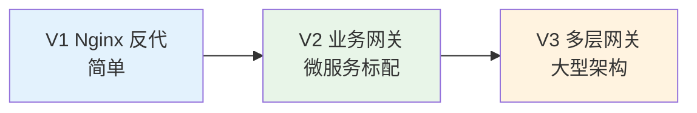

## 09.总结与决策

### 09.1 网关上线检查表

新建网关或新增 API 接入网关前对照：

- [ ] 网关多实例部署 + LB
- [ ] 健康检查包含应用层（不只 TCP）
- [ ] 配置可热更新（不需重启）
- [ ] 鉴权方案就位（Token / OAuth / API Key）
- [ ] 鉴权结果有缓存
- [ ] 多维度限流配置（全局 / API / 用户 / IP）
- [ ] 熔断器就位（下游异常时快速失败）
- [ ] 灰度路由能力完备
- [ ] 访问日志记录关键字段
- [ ] Metrics 监控完整（QPS/RT/错误率）
- [ ] 链路追踪 traceId 注入
- [ ] WAF 前置（防 SQL 注入 / XSS / DDoS）
- [ ] 漏洞补丁更新机制
- [ ] 网关进程权限最小化（不要 root）
- [ ] 容灾切换演练完成

### 09.2 选型决策树

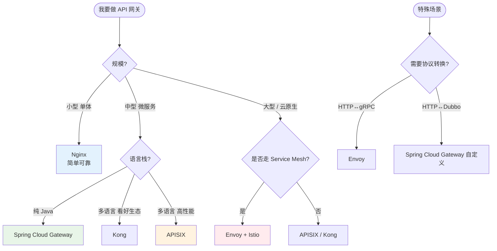

**最后一句话**：API 网关是微服务架构的"咽喉要道"——它的设计水平决定了整个系统的安全和性能上限。开篇那家 SaaS 公司只是因为补丁慢了 2 周，损失了 80 万用户的数据。

> 好的网关设计 = **业务无感、性能无瓶颈、安全无短板、扩展无止境**。
