# 23.动态化技术方案设计

> **本篇定位**：动态化是移动端的"换肤大法"——不发版就能更新页面、改逻辑、改样式。本文从一次"App 提审被拒急救"的故事讲起，回答三个核心问题——**为什么需要动态化？业界四大技术路线怎么选？怎么设计一套既稳又灵活的动态化方案？**

#### 目录介绍
- [01.提审被拒的 24 小时](#01提审被拒的-24-小时)
  - [1.1 紧急上线遇阻](#11-紧急上线遇阻)
  - [1.2 业务受损链路](#12-业务受损链路)
  - [1.3 反思动态化设计](#13-反思动态化设计)
- [02.要解决的核心矛盾](#02要解决的核心矛盾)
  - [2.1 发版周期之痛](#21-发版周期之痛)
  - [2.2 性能与灵活](#22-性能与灵活)
  - [2.3 安全与监管](#23-安全与监管)
  - [2.4 动态化的本质](#24-动态化的本质)
- [03.业界主流方案](#03业界主流方案)
  - [03.1 四大技术路线](#031-四大技术路线)
  - [03.2 横向对比矩阵](#032-横向对比矩阵)
  - [03.3 适用场景速查](#033-适用场景速查)
- [04.设计核心原则](#04设计核心原则)
  - [04.1 边界清晰原则](#041-边界清晰原则)
  - [04.2 性能可控原则](#042-性能可控原则)
  - [04.3 灰度回滚原则](#043-灰度回滚原则)
  - [04.4 安全合规原则](#044-安全合规原则)
- [05.方案落地实战](#05方案落地实战)
  - [05.1 整体架构](#051-整体架构)
  - [05.2 H5 容器方案](#052-h5-容器方案)
  - [05.3 RN/Flutter 方案](#053-rnflutter-方案)
  - [05.4 DSL 渲染方案](#054-dsl-渲染方案)
  - [05.5 配置驱动方案](#055-配置驱动方案)
- [06.关键问题解决](#06关键问题解决)
  - [06.1 加载性能问题](#061-加载性能问题)
  - [06.2 容器与原生通信](#062-容器与原生通信)
  - [06.3 监管合规问题](#063-监管合规问题)
- [07.常见陷阱与反例](#07常见陷阱与反例)
  - [07.1 全员动态化反例](#071-全员动态化反例)
  - [07.2 无降级反例](#072-无降级反例)
  - [07.3 性能黑洞反例](#073-性能黑洞反例)
- [08.演进路线](#08演进路线)
  - [08.1 V1 H5 起步](#081-v1-h5-起步)
  - [08.2 V2 跨端 + 容器](#082-v2-跨端--容器)
  - [08.3 V3 多技术混合](#083-v3-多技术混合)
- [09.总结与决策](#09总结与决策)
  - [09.1 上线检查表](#091-上线检查表)
  - [09.2 选型决策树](#092-选型决策树)


## 01.提审被拒的 24 小时

### 1.1 紧急上线遇阻

某电商 App 双 11 前 3 天，**业务方临时加了个营销活动入口**——结果苹果 App Store 审核 **48 小时还没过**。但活动**双 11 当天就要上线**——只剩 24 小时。

```mermaid
gantt
    title 紧急上线时间线
    dateFormat HH:mm
    axisFormat %H:%M
    
    section 业务期望
    活动准备     :a, 00:00, 24h
    双 11 开始   :crit, b, 24:00, 0m
    
    section 苹果审核
    提交审核     :c, 00:00, 0m
    审核中       :crit, d, 00:00, 48h
    
    section 实际进展
    审核未过     :crit, e, 24:00, 24h
    活动开始无入口 :crit, f, 24:00, 0m
    GMV 损失 800w :crit, g, 24:00, 24h
```

**最终结局**：审核 72 小时才过——**双 11 第一天没有活动入口**——**直接损失 800 万 GMV**。

### 1.2 业务受损链路

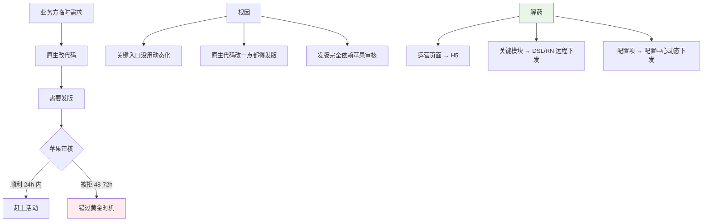

### 1.3 反思动态化设计

事后这个团队总结了三个最深刻的教训：

1. **运营 / 营销类内容必须动态化**——这类内容最敏感于"上线节奏"
2. **配置类内容必须可远程下发**——一个开关、文案、图片不能要求发版
3. **核心交易流程不要轻易动态化**——稳定性 > 灵活性

> 动态化不是"越多越好"——它是把"灵活性"和"稳定性"做权衡的艺术。

## 02.要解决的核心矛盾

### 2.1 发版周期之痛

**原生发版的现实**：

| 节点 | 耗时 |
|---|---|
| 开发 + 测试 | 1-3 天 |
| 提审 iOS | 24-72 小时 |
| 灰度发布 | 1-3 天 |
| 100% 触达用户 | 7-14 天 |
| **完整发版周期** | **2-3 周** |

**而业务需求的现实**：明天就要上！

### 2.2 性能与灵活

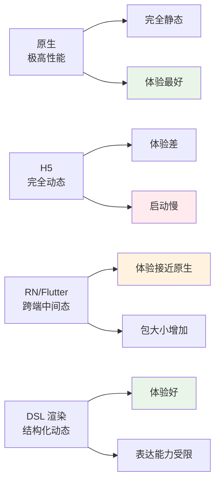

### 2.3 安全与监管

**苹果的红线（iOS Guidelines 4.7）**：
- ❌ **不允许下发"可执行代码"绕过审核** → JSPatch 一类被禁
- ✅ **数据驱动的内容**（H5、JSON 配置）允许
- ✅ **官方支持的跨端框架**（RN/Flutter）允许

**安卓相对宽松**，但合规上：
- 需要符合监管要求（金融类需要银监会备案）
- 不能下发"非声明的功能"

### 2.4 动态化的本质

> **动态化 = 把"程序"拆成"骨架（壳）+ 血肉（内容）"——壳子稳定，血肉可换**

它的核心追求 = **解耦发版节奏与业务节奏**。

## 03.业界主流方案

### 03.1 四大技术路线

| 路线 | 代表 | 思路 |
|---|---|---|
| **WebView/H5** | Hybrid 容器 | 网页就是动态化 |
| **跨端框架** | RN/Flutter/Weex | 自建 JS/Dart 引擎 |
| **DSL 渲染** | Tangram/LSX/Doraemon | JSON 描述布局，原生渲染 |
| **配置驱动** | 配置中心 + 模板 | 数据驱动 UI，最轻量 |

### 03.2 横向对比矩阵

| 维度 | H5 | RN | Flutter | DSL | 配置驱动 |
|---|---|---|---|---|---|
| **性能** | ⭐⭐ | ⭐⭐⭐⭐ | ⭐⭐⭐⭐⭐ | ⭐⭐⭐⭐ | ⭐⭐⭐⭐⭐ |
| **动态性** | ⭐⭐⭐⭐⭐ | ⭐⭐⭐⭐ | ⭐⭐ | ⭐⭐⭐⭐ | ⭐⭐⭐⭐⭐ |
| **包大小增量** | 0 | 5MB+ | 4MB+ | 1MB | 0 |
| **学习成本** | 低 | 中 | 高 | 中 | 低 |
| **社区生态** | ⭐⭐⭐⭐⭐ | ⭐⭐⭐⭐ | ⭐⭐⭐⭐ | 厂商定制 | 极简 |
| **苹果合规** | ✅ | ✅ | ✅ | ✅ | ✅ |
| **典型代表** | 几乎所有 App | 携程/京东 | 阿里/字节部分 | 阿里 Tangram | 全员 |

### 03.3 适用场景速查

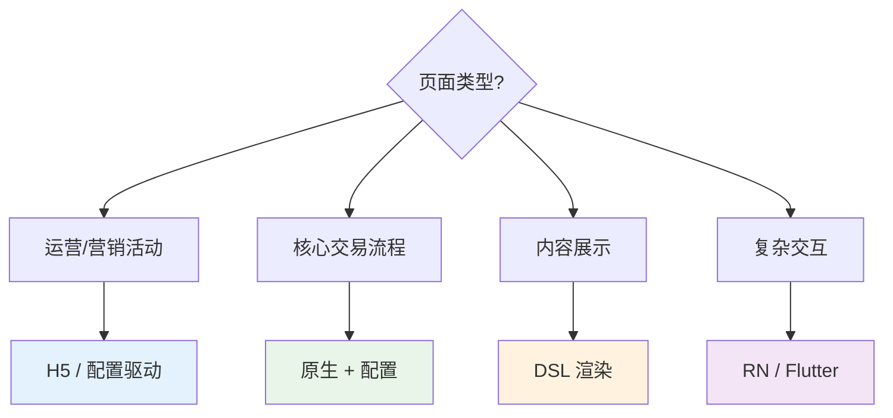

## 04.设计核心原则

### 04.1 边界清晰原则

**铁律**：**核心稳定，边缘灵活**。

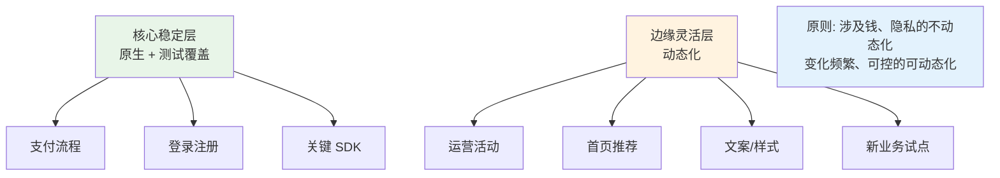

### 04.2 性能可控原则

**首屏可见时间是动态化的命门**：

| 方案 | 典型首屏耗时 |
|---|---|
| **原生** | 200-500ms |
| **DSL 渲染** | 300-800ms |
| **RN/Flutter** | 800ms-2s |
| **H5（无优化）** | 2-5s |
| **H5（容器预热 + 离线包）** | 500ms-1s |

**优化手段**：
- **离线包预下载**（详见 26 篇）
- **WebView 预创建池**
- **接口预请求**（页面打开前先发请求）
- **骨架屏占位**

### 04.3 灰度回滚原则

**动态化的 sword（剑）也是 risk（险）——下发错了等于"线上故障"**。

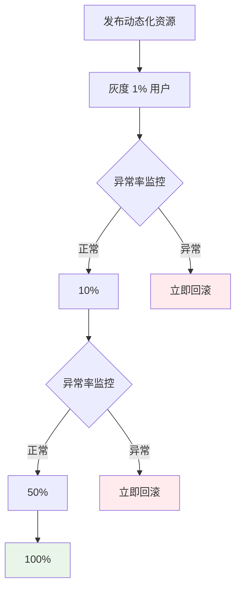

**关键能力**：
- **灰度按用户/地域/设备维度切片**
- **客户端兜底**：动态化失败 → 降级到原生 / 兜底页
- **秒级回滚**：通过配置中心立即推送

### 04.4 安全合规原则

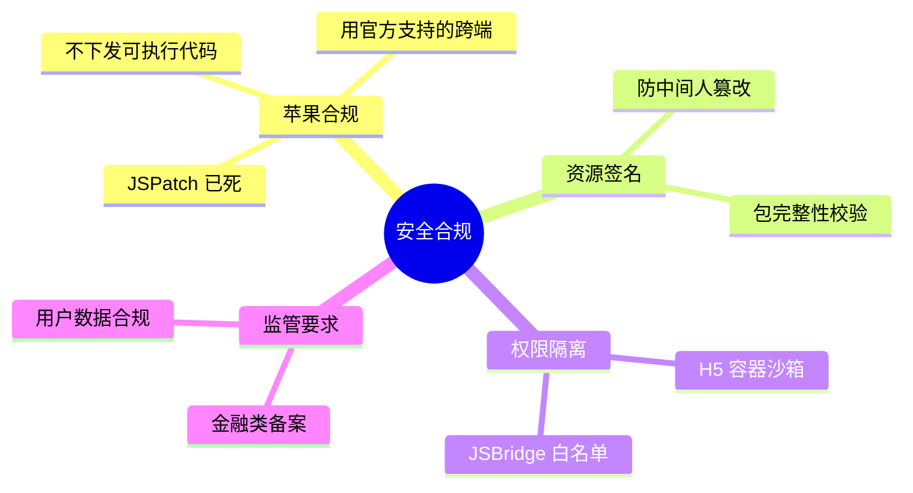

## 05.方案落地实战

### 05.1 整体架构

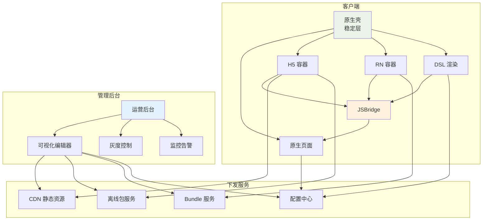

### 05.2 H5 容器方案

**Hybrid H5 容器的核心能力**：

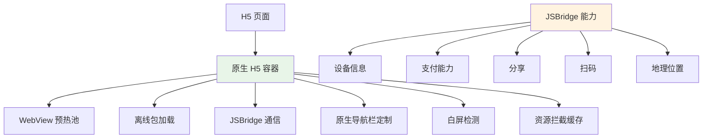

### 05.3 RN/Flutter 方案

**RN bundle 动态下发**：

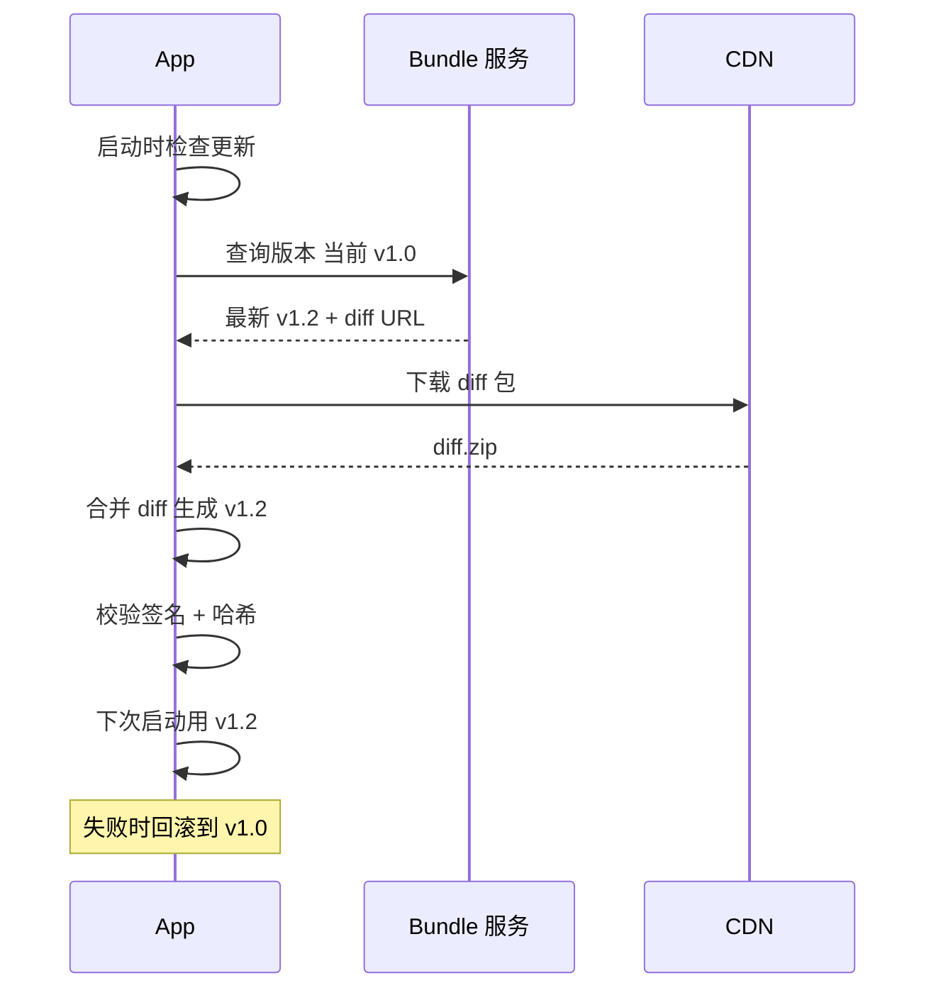

**关键设计**：
- **diff 增量下发**（包大小 100KB vs 全量 5MB）
- **签名校验**（防中间人）
- **多版本共存**（A/B 实验）
- **失败回退**

### 05.4 DSL 渲染方案

**JSON 描述 UI，原生渲染**：

```json
{
    "type": "linear",
    "orientation": "vertical",
    "children": [
        {
            "type": "image",
            "url": "https://xxx.png",
            "height": 200
        },
        {
            "type": "text",
            "content": "限时秒杀",
            "fontSize": 24,
            "color": "#FF0000"
        },
        {
            "type": "button",
            "text": "立即抢购",
            "action": {
                "type": "openUrl",
                "url": "/order"
            }
        }
    ]
}
```

**核心组件**：

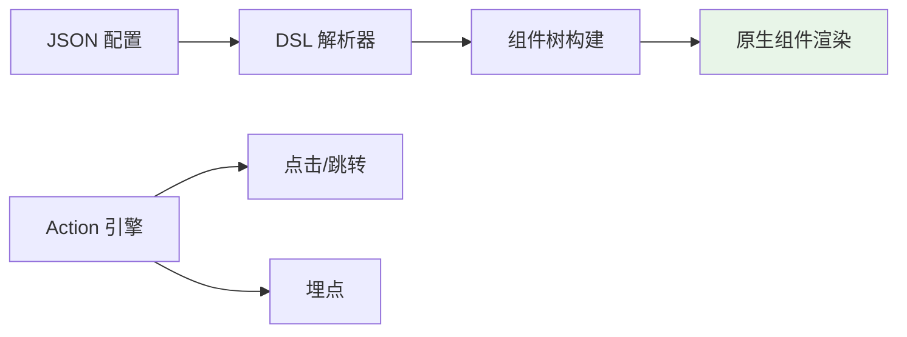

**典型代表**：阿里 Tangram、字节 LSX、京东 JSCar。

### 05.5 配置驱动方案

**最轻量的动态化**：开关、文案、图片远程下发。

```yaml
# 远程配置示例
features:
  newCheckoutFlow: true       # 新结算流程开关
  showLiveStreaming: false    # 直播入口
  
copy:
  homeBanner: "限时秒杀 5 折起"
  payButton: "立即支付"
  
images:
  splash: "https://cdn/.../splash_v2.png"
  
limits:
  maxFileSize: 50  # MB
  cacheExpireHour: 24
```

**好处**：
- 几乎零成本
- 所有原生页面都受益
- 改个文案不用发版

## 06.关键问题解决

### 06.1 加载性能问题

**典型 H5 优化套路**：

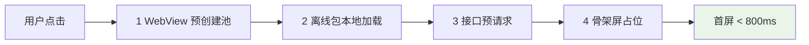

**WebView 预创建池**：

```kotlin
// App 启动时预创建
class WebViewPool {
    private val pool = mutableListOf<WebView>()
    
    fun preheat(count: Int = 2) {
        repeat(count) { pool.add(createWebView()) }
    }
    
    fun acquire(): WebView = pool.removeFirstOrNull() ?: createWebView()
}
```

### 06.2 容器与原生通信

**JSBridge 设计**：

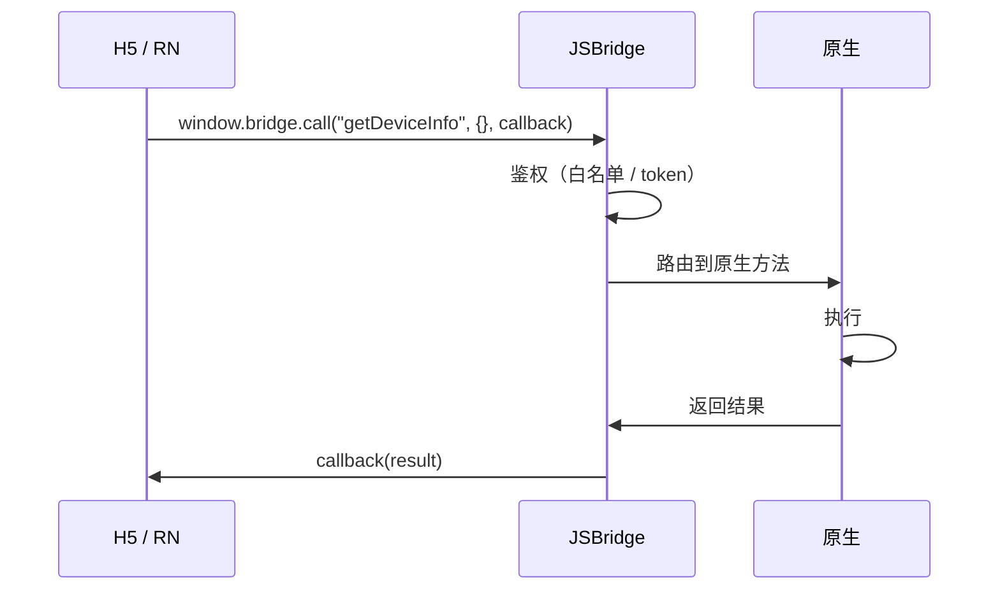

**安全要点**：
- **白名单**：只有可信域名能调用 Bridge
- **权限分级**：摄像头、位置等敏感能力需用户授权
- **参数校验**：防止注入攻击

### 06.3 监管合规问题

**金融、医疗等强监管行业的合规要点**：

| 要求 | 实现 |
|---|---|
| **下发内容备案** | 所有新页面提交监管备案后才能上线 |
| **审计日志** | 谁、什么时候、改了什么内容 |
| **应急下架** | 监管要求 1 小时内能下架某个页面 |
| **隐私合规** | 数据收集明示、最小化原则 |

## 07.常见陷阱与反例

### 07.1 全员动态化反例

**反例**：某团队过度追求"全部动态化"——**连支付按钮都用 RN 写**。结果：
- RN 启动慢 → 支付页 2 秒白屏
- RN bug → 支付失败投诉激增
- 复杂交易逻辑 → RN 实现起来反而麻烦

**教训**：**核心交易必须原生**——动态化只用于"边缘内容"。

### 07.2 无降级反例

**反例**：H5 加载失败 → **白屏 + "请检查网络"**——用户直接关 App。

**教训**：必须有兜底策略：
- 离线包加载（先用本地版本）
- 失败重试
- 降级到原生备份页
- 兜底文案 / 图片

### 07.3 性能黑洞反例

**反例**：首页用 RN 做 → **冷启动从 1.2s 涨到 2.8s**——日活掉 8%。

**教训**：动态化的代价是性能 → **必须设性能红线**：
- 首屏 < 1s（关键页面）
- 启动 < 1.5s

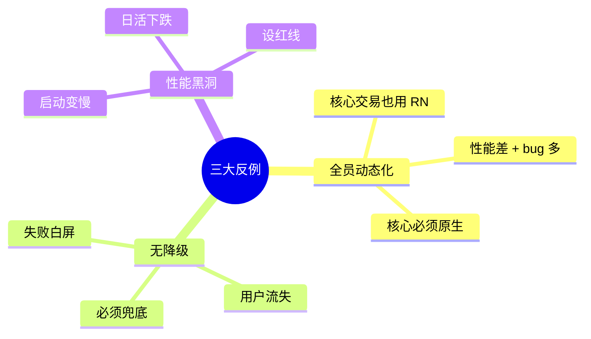

## 08.演进路线

### 08.1 V1 H5 起步

**特征**：业务起步、运营内容多。

**做法**：
- Hybrid H5 容器
- 基础 JSBridge
- 简单离线包

**适用阶段**：早期 App / 业务探索

### 08.2 V2 跨端 + 容器

**特征**：业务规模化、多端协同。

**做法**：
- H5 + RN/Flutter 共存
- 配置中心
- 离线包系统
- 灰度发布

**适用阶段**：中型 App

### 08.3 V3 多技术混合

**特征**：超大规模 / 多业务线。

**做法**：
- H5 + RN + Flutter + DSL 多方案并存
- 统一动态化平台
- 可视化搭建后台
- AI 辅助生成

**适用阶段**：头部 App / 平台化产品

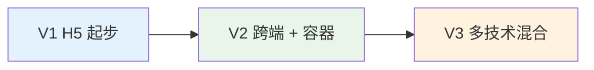

## 09.总结与决策

### 09.1 上线检查表

动态化方案上线前对照：

- [ ] 边界清晰（核心原生 + 边缘动态）
- [ ] 性能基线（首屏 < 1s 等）
- [ ] 容器有 WebView/RN 预热池
- [ ] 离线包覆盖核心动态化页面
- [ ] JSBridge 白名单 + 权限分级
- [ ] 资源签名校验
- [ ] 灰度发布机制
- [ ] 一键回滚通道
- [ ] 兜底策略（失败时降级）
- [ ] 监控（白屏、加载耗时、错误率）
- [ ] 监管合规（必要时）
- [ ] 苹果合规（不下发可执行代码）

### 09.2 选型决策树

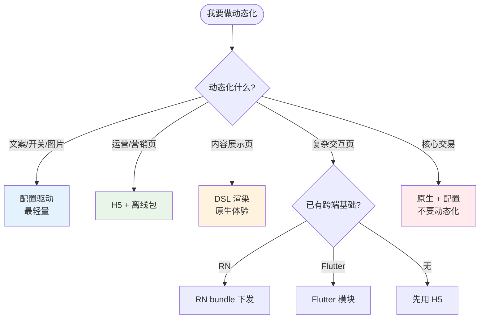

**最后一句话**：动态化解决了"发版周期"和"业务节奏"的矛盾——开篇 800 万 GMV 的损失，就是因为关键入口没用动态化。

> 好的动态化方案 = **核心稳定、边缘灵活、性能可控、灰度可回滚**。
