# 24.跨端一致性方案

> **本篇定位**：跨端是移动时代的"分身术"——一份业务要同时在 iOS、Android、Web、小程序、PC 桌面、车机、TV 上运行。本文从一次"四端文案不一致引发投诉"的故事讲起，回答三个核心问题——**为什么跨端"一致性"比"开发效率"更难？业界跨端方案怎么选？怎么保证 N 端体验真正一致？**

#### 目录介绍
- [01.四端不一致投诉](#01四端不一致投诉)
  - [1.1 同一活动四端价格不同](#11-同一活动四端价格不同)
  - [1.2 不一致扩散链路](#12-不一致扩散链路)
  - [1.3 反思跨端一致](#13-反思跨端一致)
- [02.要解决的核心矛盾](#02要解决的核心矛盾)
  - [2.1 平台天然差异](#21-平台天然差异)
  - [2.2 一致与原生](#22-一致与原生)
  - [2.3 效率与体验](#23-效率与体验)
  - [2.4 一致性的本质](#24-一致性的本质)
- [03.业界主流方案](#03业界主流方案)
  - [03.1 跨端三大流派](#031-跨端三大流派)
  - [03.2 横向对比矩阵](#032-横向对比矩阵)
  - [03.3 一致性维度](#033-一致性维度)
- [04.设计核心原则](#04设计核心原则)
  - [04.1 数据一致原则](#041-数据一致原则)
  - [04.2 业务逻辑下沉](#042-业务逻辑下沉)
  - [04.3 设计规范统一](#043-设计规范统一)
  - [04.4 平台特性尊重](#044-平台特性尊重)
- [05.方案落地实战](#05方案落地实战)
  - [05.1 整体架构](#051-整体架构)
  - [05.2 数据层一致](#052-数据层一致)
  - [05.3 业务层一致](#053-业务层一致)
  - [05.4 UI 层一致](#054-ui-层一致)
  - [05.5 体验层一致](#055-体验层一致)
- [06.关键问题解决](#06关键问题解决)
  - [06.1 平台差异处理](#061-平台差异处理)
  - [06.2 设计 Token 体系](#062-设计-token-体系)
  - [06.3 自动化校验](#063-自动化校验)
- [07.常见陷阱与反例](#07常见陷阱与反例)
  - [07.1 一份代码全跑反例](#071-一份代码全跑反例)
  - [07.2 设计稿无 Token 反例](#072-设计稿无-token-反例)
  - [07.3 各端独立排期反例](#073-各端独立排期反例)
- [08.演进路线](#08演进路线)
  - [08.1 V1 各端独立](#081-v1-各端独立)
  - [08.2 V2 共享底层](#082-v2-共享底层)
  - [08.3 V3 全栈一致](#083-v3-全栈一致)
- [09.总结与决策](#09总结与决策)
  - [09.1 上线检查表](#091-上线检查表)
  - [09.2 选型决策树](#092-选型决策树)


## 01.四端不一致投诉

### 1.1 同一活动四端价格不同

某电商做"双 11 满 200 减 50"——上线后用户在客服群炸锅：
- iOS App：满 200 减 50 ✅
- Android App：满 199 减 50 ❌
- H5 / 小程序：满 200 减 30 ❌
- PC Web：原价没活动 ❌

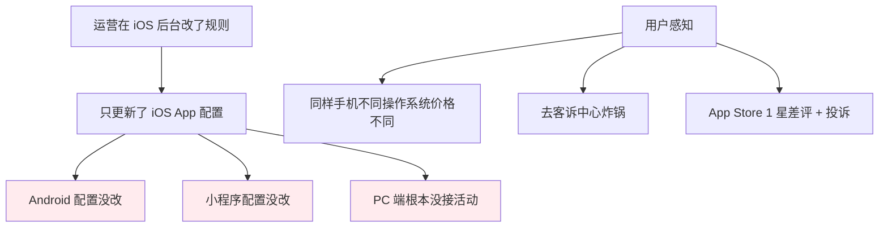

### 1.2 不一致扩散链路

```mermaid
flowchart TD
    Cause[根因] --> R1[每端有自己的本地配置]
    Cause --> R2[运营改一处即可的认知错误]
    Cause --> R3[各端发版节奏不同]
    Cause --> R4[没有统一的"活动定义"中心]
    
    Solve[解药] --> S1[活动配置必须服务端统一下发]
    Solve --> S2[各端通过同一接口拉取]
    Solve --> S3[端上禁止修改业务规则]
    
    style Cause fill:#ffebee
    style Solve fill:#e8f5e8
```

### 1.3 反思跨端一致

事后这个团队总结了三个最深刻的教训：

1. **"业务规则"必须沉到服务端**——客户端不能各自定义
2. **"设计规范"必须统一**——颜色、间距、字号在所有端一致
3. **"发版节奏"必须协调**——多端版本断层是不一致的根源

> 跨端一致性最大的敌人不是技术——而是**组织和流程的孤岛**。

## 02.要解决的核心矛盾

### 2.1 平台天然差异

| 维度 | iOS | Android | Web | 小程序 |
|---|---|---|---|---|
| **导航栏** | 顶部居中标题 | 顶部左对齐 | 浏览器有 | 微信顶栏 |
| **返回手势** | 右滑返回 | 系统返回键 | 浏览器后退 | 左上角 |
| **字体** | 苹方 | 思源黑体 | 系统默认 | 系统默认 |
| **状态栏** | 黑/白 | 黑/白 | 不存在 | 不存在 |
| **键盘** | 苹果原生 | 各厂家不同 | 浏览器 | 微信内 |
| **包大小限制** | 200MB | 100MB+ | 0 | 2MB-10MB |

**核心**：**强求 100% 一致是错的**——尊重平台习惯，统一业务和品牌。

### 2.2 一致与原生

```mermaid
graph LR
    A[完全一致<br/>用同一套 UI] --> B[违和感强]
    B --> C[iOS 用户觉得"不像 iOS"]
    
    A2[完全原生<br/>各端各自实现] --> B2[体验最佳]
    B2 --> C2[多端不一致]
    
    A3[骨架一致<br/>细节平台化] --> B3[平衡]
    
    style C fill:#fff3e0
    style C2 fill:#fff3e0
    style B3 fill:#e8f5e8
```

### 2.3 效率与体验

| 方案 | 开发效率 | 用户体验 |
|---|---|---|
| **完全原生 N 套** | 最低（N 倍工作量） | 最好 |
| **跨端框架** | 高 | 中等 |
| **WebView 一套到底** | 最高 | 差 |
| **核心原生 + 边缘跨端** | 中 | 好 |

### 2.4 一致性的本质

> **跨端一致性 = "同一品牌"在不同端上的"同一感觉"**

它不要求像素级一致——要求 **数据一致 + 业务一致 + 视觉认知一致 + 交互范式一致**。

## 03.业界主流方案

### 03.1 跨端三大流派

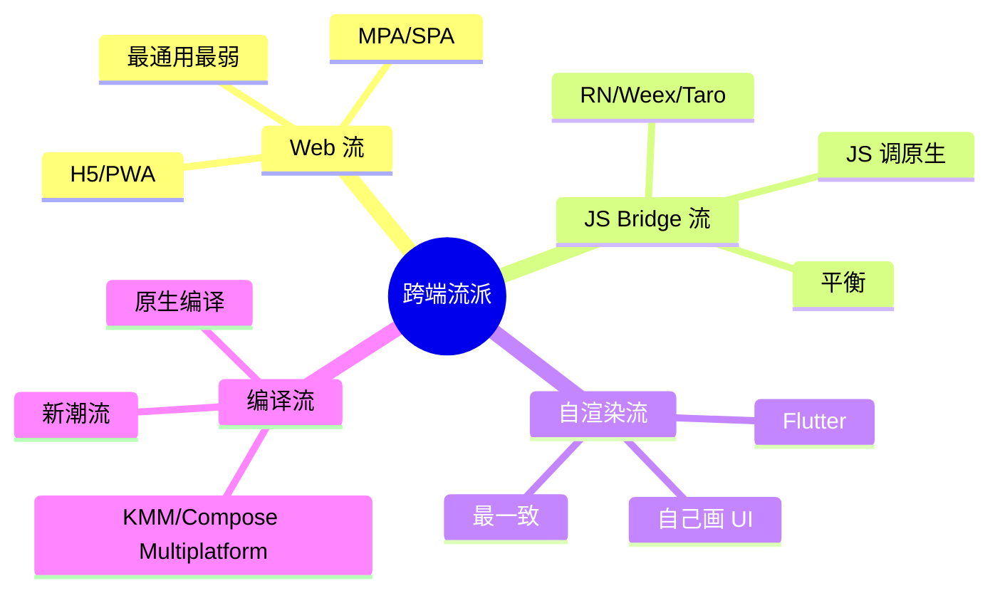

### 03.2 横向对比矩阵

| 维度 | RN | Flutter | Taro | KMM | H5 |
|---|---|---|---|---|---|
| **覆盖端** | iOS/Android | 全平台 | 小程序为主 | iOS/Android | 全平台 |
| **一致性** | ⭐⭐⭐⭐ | ⭐⭐⭐⭐⭐ | ⭐⭐⭐⭐ | ⭐⭐⭐⭐ | ⭐⭐⭐⭐⭐ |
| **性能** | ⭐⭐⭐⭐ | ⭐⭐⭐⭐⭐ | ⭐⭐⭐ | ⭐⭐⭐⭐⭐ | ⭐⭐ |
| **学习成本** | 中 | 中 | 低 | 中 | 低 |
| **包增量** | 5MB+ | 4MB+ | - | 0 | 0 |
| **典型用户** | 京东/携程 | 阿里/字节 | 京东 | Netflix | 全员 |

### 03.3 一致性维度

**真正的"一致"是分层的**：

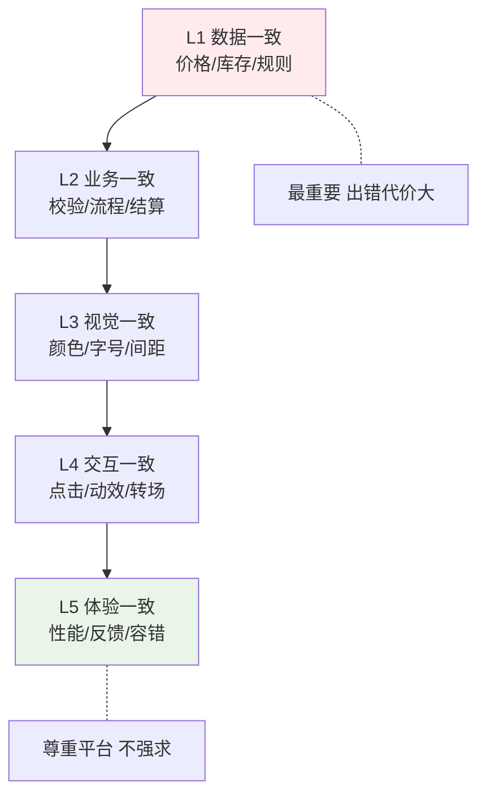

## 04.设计核心原则

### 04.1 数据一致原则

**铁律**：**数据从同一个源头来**。

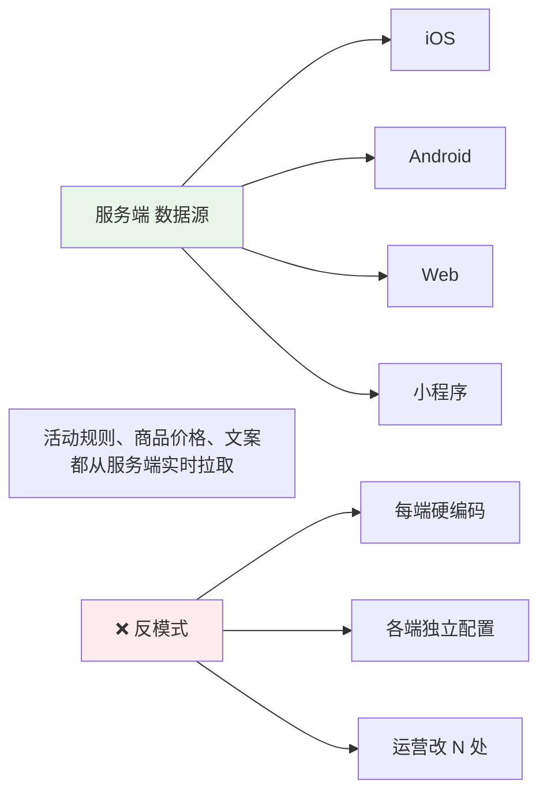

### 04.2 业务逻辑下沉

**业务规则放在服务端 / BFF 层，客户端只做"展示和上报"**。

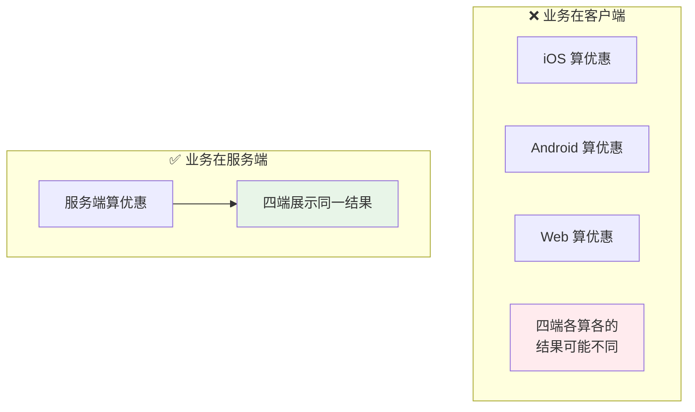

### 04.3 设计规范统一

**Design Tokens（设计令牌）**：把颜色、字号、间距等设计变量抽象成"令牌"。

```json
{
    "color": {
        "primary": "#FF4B33",
        "warning": "#FF9500",
        "success": "#52C41A"
    },
    "spacing": {
        "xs": 4,
        "sm": 8,
        "md": 16,
        "lg": 24
    },
    "fontSize": {
        "title": 18,
        "body": 14,
        "caption": 12
    }
}
```

**好处**：
- 设计师改一个值 → 所有端同步更新
- 各端工程师从同一份 Token 读
- 自动化对齐

### 04.4 平台特性尊重

**关键边界**：哪些"必须一致"，哪些"必须平台化"。

| 维度 | 一致性方向 |
|---|---|
| **品牌色** | ✅ 完全一致 |
| **业务规则** | ✅ 完全一致 |
| **数据展示** | ✅ 完全一致 |
| **导航栏样式** | ⚠️ 尊重平台 |
| **返回手势** | ⚠️ 尊重平台 |
| **键盘/输入框** | ⚠️ 尊重平台 |
| **分享菜单** | ⚠️ 尊重平台 |

## 05.方案落地实战

### 05.1 整体架构

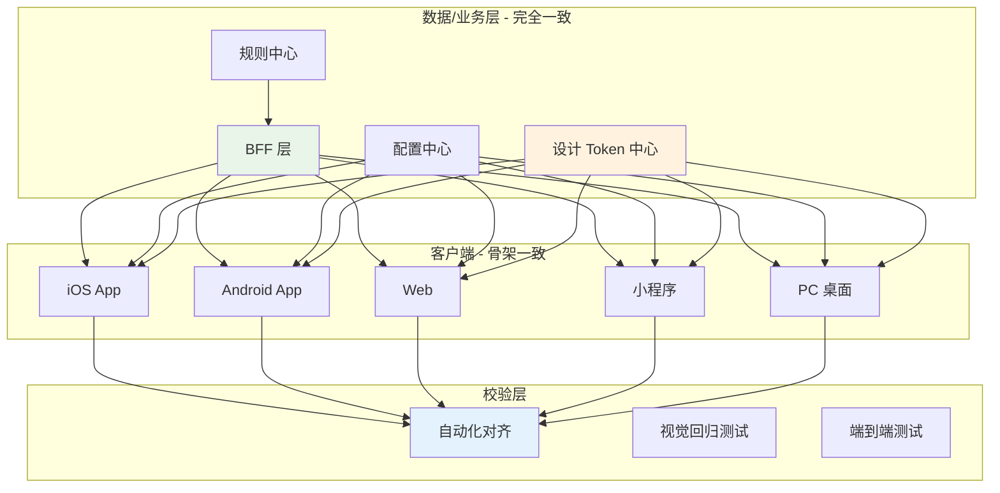

### 05.2 数据层一致

**BFF（Backend For Frontend）模式**：

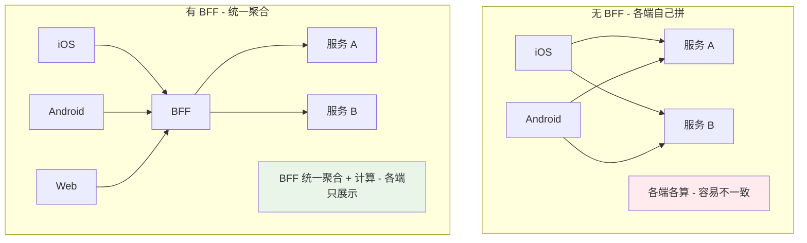

### 05.3 业务层一致

**关键业务规则统一引擎**：

```yaml
# 同一份规则定义
promotion:
  id: "double11_2024"
  rule:
    type: "FULL_REDUCTION"
    threshold: 200
    discount: 50
  scope:
    platforms: [iOS, Android, Web, MiniProgram]
  validFrom: "2024-11-11 00:00:00"
  validTo: "2024-11-12 00:00:00"
  
# 任何端访问 /promotion/active
# 都返回这一份规则 → 客户端只展示
```

### 05.4 UI 层一致

**多端组件库统一**：

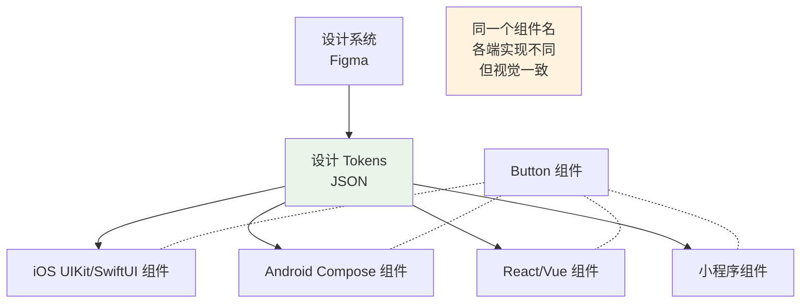

**业界代表**：
- 阿里 Ant Design / Fusion
- 字节 ArcoDesign
- 腾讯 TDesign
- 美团 Bee Design

### 05.5 体验层一致

**统一交互范式**：

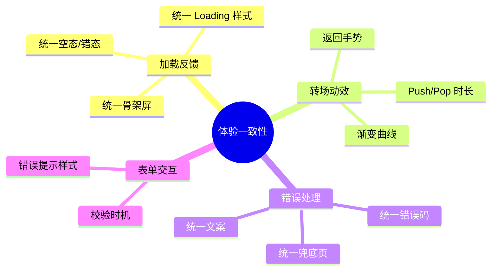

## 06.关键问题解决

### 06.1 平台差异处理

**抽象思路**：**接口一致，实现平台化**。

```kotlin
// 平台无关接口
interface ImagePicker {
    suspend fun pick(): Uri?
}

// iOS 实现
class IOSImagePicker : ImagePicker {
    override suspend fun pick(): Uri? = UIImagePickerController...
}

// Android 实现  
class AndroidImagePicker : ImagePicker {
    override suspend fun pick(): Uri? = ActivityResultContracts...
}

// 业务代码两边一样写
val uri = imagePicker.pick()
```

### 06.2 设计 Token 体系

**完整 Token 体系示例**：

```json
{
    "global": {
        "color": { "brand": "#FF4B33", "...": "..." },
        "spacing": { "xs": 4, "sm": 8, "..." : "..." },
        "fontSize": { "h1": 24, "body": 14 }
    },
    "alias": {
        "button.primary.bg": "{global.color.brand}",
        "button.primary.text": "#FFFFFF"
    },
    "platform": {
        "ios": { "fontFamily": "PingFang SC" },
        "android": { "fontFamily": "Noto Sans CJK SC" }
    }
}
```

### 06.3 自动化校验

**三种自动化校验**：

| 校验类型 | 工具 | 用途 |
|---|---|---|
| **视觉回归** | Storybook + Chromatic / Applitools | 对比每个组件在各端的截图 |
| **数据一致** | 接口契约测试 | 同一接口各端调用结果一致 |
| **端到端** | Detox / Appium | 关键流程在各端结果一致 |

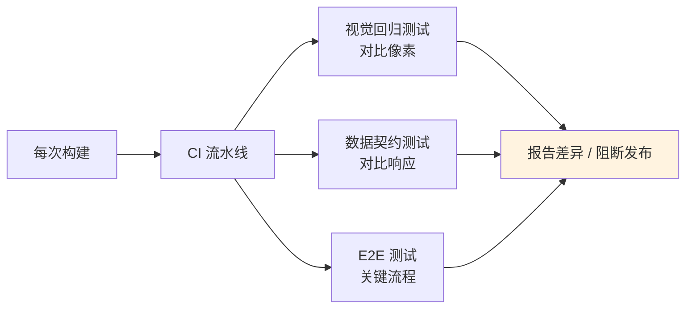

## 07.常见陷阱与反例

### 07.1 一份代码全跑反例

**反例**：用 H5 一份代码跑所有端 → **小程序限制（API 不全）、性能问题**层出不穷。

**教训**：
- 完全一份代码不现实
- 至少分"核心业务统一 + 平台适配层"
- 用 Taro / uni-app 等做编译时平台适配

### 07.2 设计稿无 Token 反例

**反例**：设计稿每个页面颜色、字号都自己定 → **同一个红色有 6 种十六进制值**——各端工程师抄哪个都对，各端不一致。

**教训**：
- 设计师必须用 Token 系统
- 工程师不能写"魔法数字"
- 建立"设计-研发"对齐机制

### 07.3 各端独立排期反例

**反例**：iOS 排了 V2.0，Android 排了 V1.8，Web 还是 V1.5 —— 用户在不同端看到的功能完全不同。

**教训**：
- 多端必须同步规划
- 关键功能"齐步走"
- 配置项可以用动态化补齐版本差异

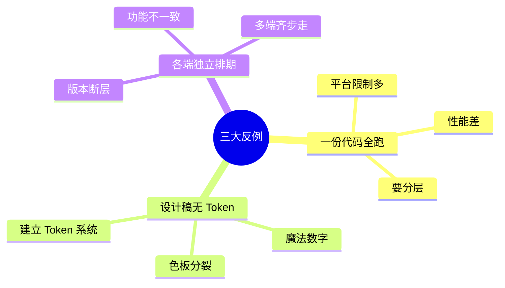

## 08.演进路线

### 08.1 V1 各端独立

**特征**：业务起步、各端独立开发。

**做法**：
- 各端各自实现
- 文档共享业务规则
- 人工对齐

**适用阶段**：< 1000 用户

### 08.2 V2 共享底层

**特征**：业务规模化、需要统一。

**做法**：
- BFF 层统一数据
- 设计 Token 系统
- 多端组件库
- 视觉回归测试

**适用阶段**：中型产品

### 08.3 V3 全栈一致

**特征**：超大规模 / 多业务线。

**做法**：
- 业务规则引擎下沉
- 全链路设计系统
- 自动化校验
- 跨端框架（如 KMM）共享业务逻辑

**适用阶段**：头部产品

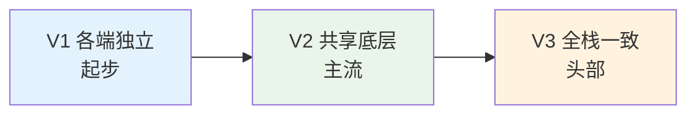

## 09.总结与决策

### 09.1 上线检查表

跨端项目上线前对照：

- [ ] BFF 层统一数据
- [ ] 业务规则在服务端
- [ ] 设计 Token 系统建立
- [ ] 各端组件库对齐
- [ ] 多端版本规划同步
- [ ] 关键业务规则在所有端一致
- [ ] 平台特性尊重（导航 / 手势）
- [ ] 视觉回归测试
- [ ] 数据契约测试
- [ ] 端到端测试覆盖关键路径
- [ ] 监控覆盖各端（错误率、性能）
- [ ] 设计-研发对齐流程

### 09.2 选型决策树

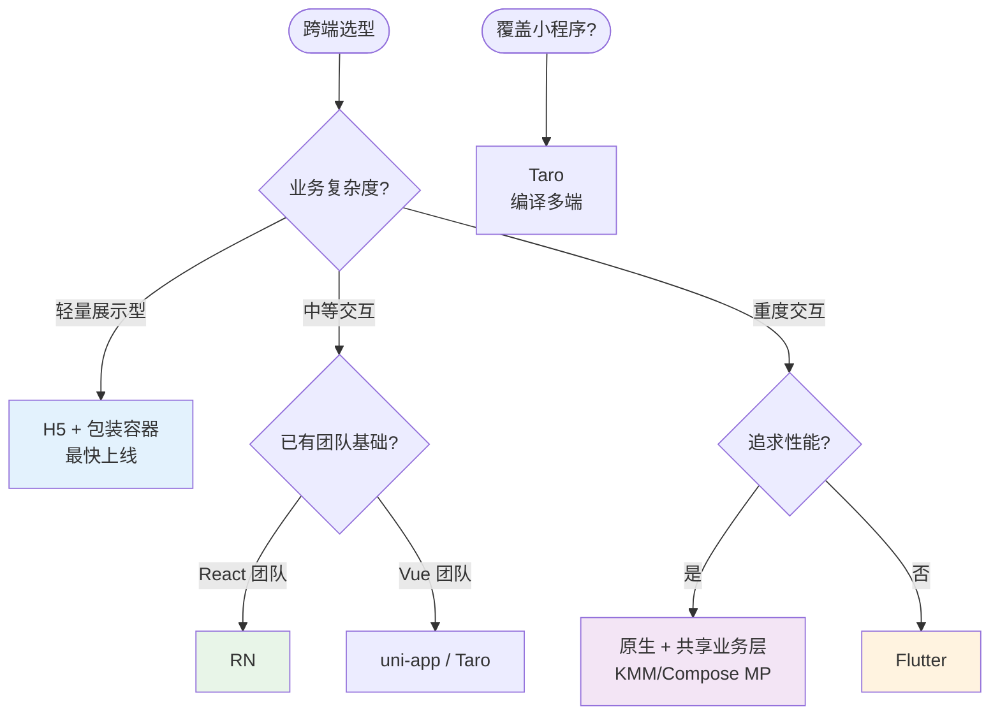

**最后一句话**：跨端一致性的难点不在技术——而在 **组织能不能让"业务、设计、研发"在多端形成同一节奏**。开篇四端不一致投诉的根因，就是没有"统一规则中心"。

> 好的跨端一致 = **数据下沉、设计统一、骨架一致、平台尊重**。
