# 26.离线包与预加载方案

> **本篇定位**：离线包和预加载是 H5/Hybrid 性能的"加速器"——同样是打开一个 H5 页面，秒开和 3 秒白屏的差距就在这里。本文从一次"H5 页面 5 秒白屏被骂"的故事讲起，回答三个核心问题——**离线包究竟解决了什么？预加载有哪几种姿势？怎么设计一套秒开级别的资源体系？**

#### 目录介绍
- [01.5 秒白屏的差评](#015-秒白屏的差评)
  - [1.1 用户骂"App 卡爆了"](#11-用户骂app-卡爆了)
  - [1.2 性能瓶颈拆解](#12-性能瓶颈拆解)
  - [1.3 反思离线方案](#13-反思离线方案)
- [02.要解决的核心矛盾](#02要解决的核心矛盾)
  - [2.1 秒开是基本盘](#21-秒开是基本盘)
  - [2.2 包大小与覆盖](#22-包大小与覆盖)
  - [2.3 实时与稳定](#23-实时与稳定)
  - [2.4 离线包的本质](#24-离线包的本质)
- [03.业界主流方案](#03业界主流方案)
  - [03.1 主流离线包方案](#031-主流离线包方案)
  - [03.2 横向对比矩阵](#032-横向对比矩阵)
  - [03.3 预加载分类](#033-预加载分类)
- [04.设计核心原则](#04设计核心原则)
  - [04.1 边走边下原则](#041-边走边下原则)
  - [04.2 增量更新原则](#042-增量更新原则)
  - [04.3 安全校验原则](#043-安全校验原则)
  - [04.4 命中率优先原则](#044-命中率优先原则)
- [05.方案落地实战](#05方案落地实战)
  - [05.1 整体架构](#051-整体架构)
  - [05.2 离线包结构](#052-离线包结构)
  - [05.3 资源拦截加载](#053-资源拦截加载)
  - [05.4 增量包设计](#054-增量包设计)
  - [05.5 预加载策略](#055-预加载策略)
- [06.关键问题解决](#06关键问题解决)
  - [06.1 包冲突管理](#061-包冲突管理)
  - [06.2 流量与电量](#062-流量与电量)
  - [06.3 命中率优化](#063-命中率优化)
- [07.常见陷阱与反例](#07常见陷阱与反例)
  - [07.1 全量打包反例](#071-全量打包反例)
  - [07.2 不限并发反例](#072-不限并发反例)
  - [07.3 没监控反例](#073-没监控反例)
- [08.演进路线](#08演进路线)
  - [08.1 V1 简单缓存](#081-v1-简单缓存)
  - [08.2 V2 离线包系统](#082-v2-离线包系统)
  - [08.3 V3 智能预加载](#083-v3-智能预加载)
- [09.总结与决策](#09总结与决策)
  - [09.1 上线检查表](#091-上线检查表)
  - [09.2 选型决策树](#092-选型决策树)


## 01.5 秒白屏的差评

### 1.1 用户骂"App 卡爆了"

某电商 App 双 11 大促主会场用 H5 写——**用户点击后白屏 5 秒**。社交媒体上炸开锅：

> "什么垃圾 App，点个活动等 5 秒"
> "网络好的时候都这么慢，4G 直接转圈"
> "京东淘宝秒开，你们这是石器时代？"

监控数据令人震惊：
- **首屏白屏：P50 = 3.2s，P99 = 8.5s**
- **白屏率（5s 内未渲染）：18%**
- **跳出率：32%**——三分之一用户没等到加载完就走了

```mermaid
gantt
    title H5 加载耗时拆解
    dateFormat X
    axisFormat %s s
    
    section 网络
    DNS + TCP    :a, 0, 500
    TLS 握手     :b, 500, 800
    HTML 下载    :c, 800, 1500
    解析 HTML    :d, 1500, 1800
    
    section 资源
    JS 下载      :e, 1800, 3500
    CSS 下载     :f, 1800, 2300
    图片下载     :g, 2300, 4500
    
    section 渲染
    JS 执行      :h, 3500, 4500
    首屏渲染     :crit, i, 4500, 100
```

### 1.2 性能瓶颈拆解

**白屏 5 秒分布**：

| 阶段 | 耗时 | 占比 |
|---|---|---|
| 网络（DNS + TCP + TLS） | 800ms | 16% |
| HTML 下载 + 解析 | 700ms | 14% |
| JS / CSS 下载 | 1.7s | 34% |
| 图片下载 | 1.2s | 24% |
| JS 执行 + 渲染 | 600ms | 12% |
| **合计** | **5s** | **100%** |

**根因**：**所有资源每次都要从远端下**——明明是同一个活动页，1000 万人访问就下载 1000 万次。

### 1.3 反思离线方案

事后这个团队总结了三个最深刻的教训：

1. **离线包能省掉 80% 的网络耗时**——HTML/CSS/JS/图片都内置
2. **WebView 预热能省掉冷启动时间**——300-800ms
3. **接口预请求能并行化**——把"打开后再请求"提前到"打开前请求"

> 离线包的本质就是 **把"网络下载"换成"本地读取"**——速度差 100 倍以上。

## 02.要解决的核心矛盾

### 2.1 秒开是基本盘

**业界 H5 秒开标准**：

| 指标 | 优秀 | 良好 | 及格 |
|---|---|---|---|
| **白屏时间** | < 500ms | < 1s | < 2s |
| **首屏可见** | < 1s | < 2s | < 3s |
| **可交互** | < 2s | < 3s | < 5s |
| **白屏率** | < 1% | < 5% | < 10% |

### 2.2 包大小与覆盖

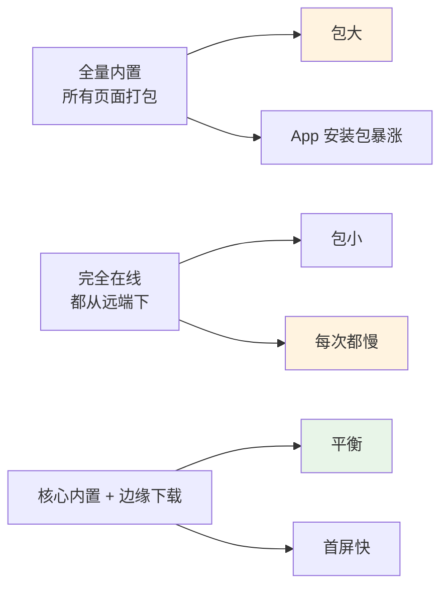

**实战经验**：核心 5-10 个高频页面打入安装包，其他页面用"在用户下次访问前预下载"。

### 2.3 实时与稳定

| 维度 | 全量更新 | 增量更新 |
|---|---|---|
| **包大小** | 大（每次完整下载） | 小（只下载差异） |
| **更新速度** | 慢 | 快 |
| **流量消耗** | 高 | 低 |
| **失败容错** | 容易回滚 | 复杂 |
| **典型节省** | - | 80%-95% |

### 2.4 离线包的本质

> **离线包 = 把网页"装"进 App 安装包/缓存里**

它的核心价值 = **WebView 加载本地文件比加载网络快 10-100 倍**。

## 03.业界主流方案

### 03.1 主流离线包方案

| 方案 | 厂商 | 特点 |
|---|---|---|
| **支付宝 Nebula** | 蚂蚁 | 原生集成、能力强 |
| **微信小程序框架** | 腾讯 | 严格沙箱 |
| **手淘 ZCache** | 阿里 | 大规模实战 |
| **美团 Knb** | 美团 | 集成 H5 容器 |
| **JS Service Worker** | 浏览器原生 | PWA 标准 |
| **Cordova/Ionic 的 webview-cache** | 开源 | 简单 |

### 03.2 横向对比矩阵

| 维度 | 安装内置 | 启动预下载 | 用户访问时下 | Service Worker |
|---|---|---|---|---|
| **首次访问速度** | ⭐⭐⭐⭐⭐ | ⭐⭐⭐⭐ | ⭐ | ⭐⭐ |
| **后续访问速度** | ⭐⭐⭐⭐⭐ | ⭐⭐⭐⭐⭐ | ⭐⭐⭐ | ⭐⭐⭐⭐ |
| **包大小代价** | 大 | 小 | 0 | 0 |
| **更新延迟** | 发版 | 启动后 | 实时 | 实时 |
| **典型场景** | 核心页 | 高频页 | 长尾页 | Web 页 |

### 03.3 预加载分类

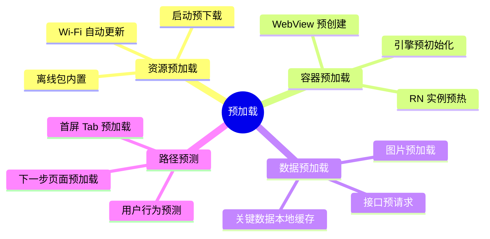

## 04.设计核心原则

### 04.1 边走边下原则

**铁律**：**用户使用时不让他等**——下载在用户没察觉的时候完成。

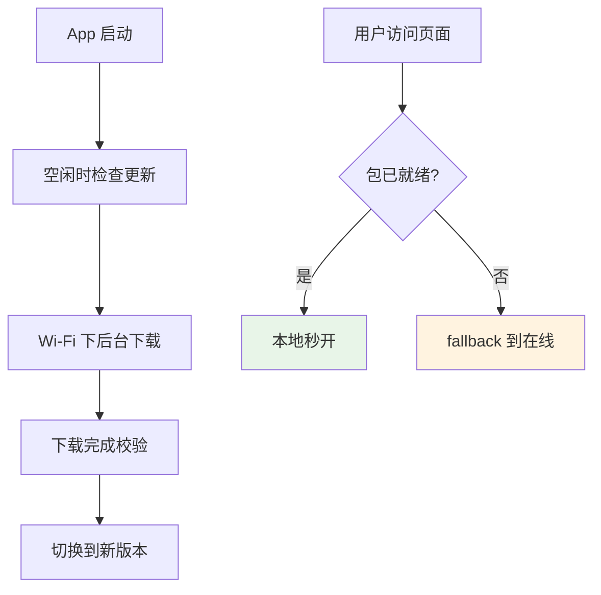

### 04.2 增量更新原则

**只下载变化的部分**——bsdiff、xdelta 等算法。

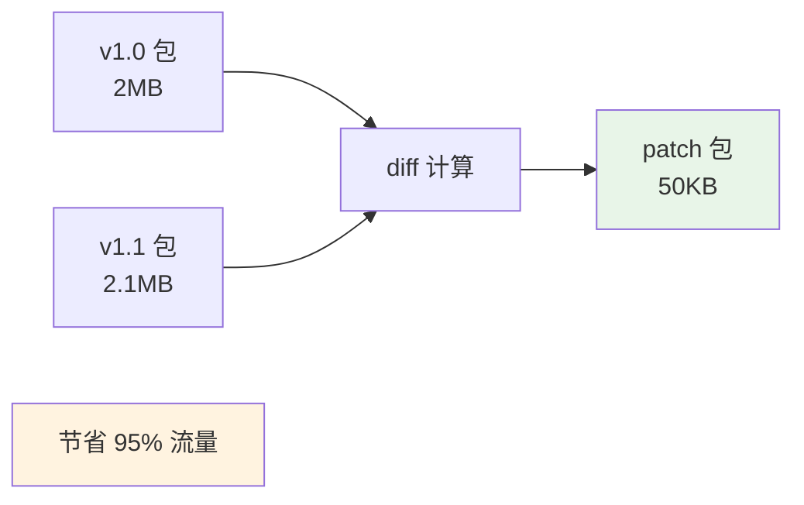

**典型节省**：

| 包大小变化 | 全量 | 增量 | 节省 |
|---|---|---|---|
| 2MB → 2.1MB | 2.1MB | 50KB | 97% |
| 5MB → 5.5MB | 5.5MB | 200KB | 96% |

### 04.3 安全校验原则

**离线包必须签名校验**——防止中间人替换。

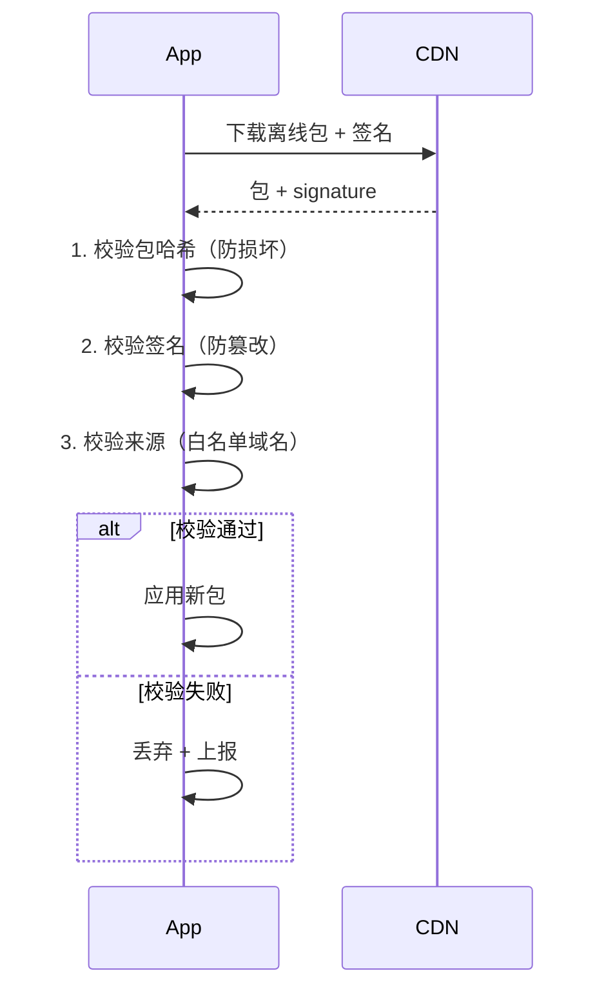

### 04.4 命中率优先原则

**命中率 = 离线包成功命中 / 页面访问总数**——业界优秀水平 > 90%。

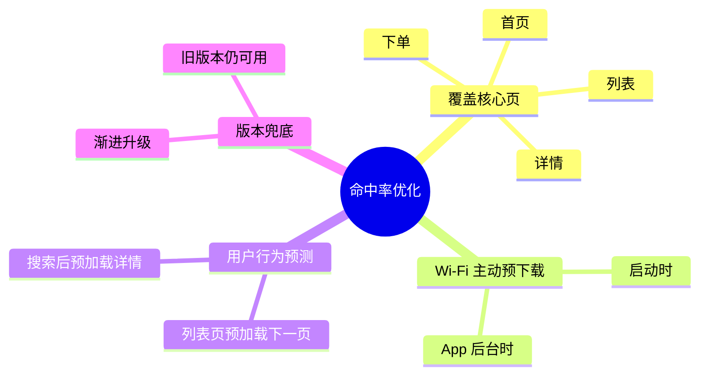

## 05.方案落地实战

### 05.1 整体架构

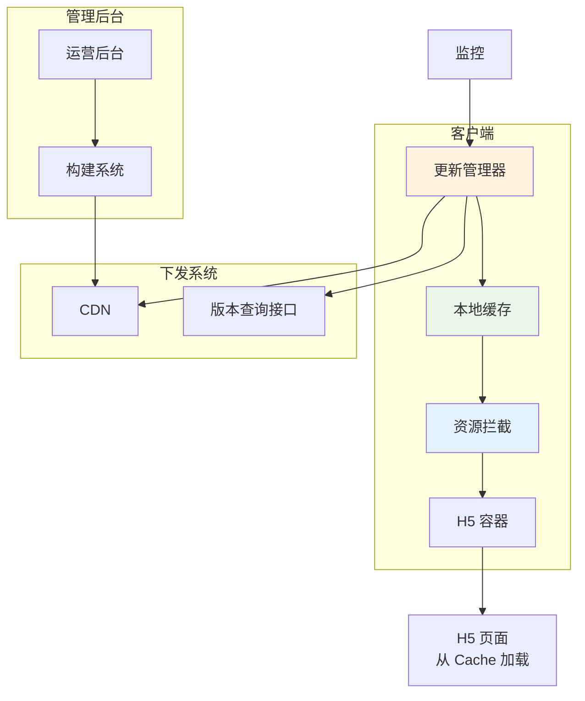

### 05.2 离线包结构

**典型离线包结构**：

```
offline-pkg-v1.2.zip
├── manifest.json          ← 包描述（版本、入口、签名）
├── index.html             ← 页面 HTML
├── assets/
│   ├── main.js
│   ├── main.css
│   └── img/
│       ├── banner.png
│       └── icons.png
└── pages/                 ← 多页面应用
    ├── list.html
    └── detail.html
```

**manifest.json 示例**：

```json
{
    "name": "promotion-page",
    "version": "1.2.0",
    "appId": "promotion",
    "entry": "index.html",
    "files": {
        "index.html": "sha256:abc...",
        "assets/main.js": "sha256:def...",
        "assets/main.css": "sha256:ghi..."
    },
    "signature": "RSA-SHA256-encoded-signature"
}
```

### 05.3 资源拦截加载

**WebView 拦截网络请求，从本地加载**：

```kotlin
class OfflinePackageInterceptor(private val pkg: OfflinePackage) {
    
    fun shouldInterceptRequest(view: WebView, req: WebResourceRequest): WebResourceResponse? {
        val url = req.url.toString()
        val path = extractPath(url)
        
        // 1. 检查是否在离线包里
        val localFile = pkg.findFile(path) ?: return null
        
        // 2. 校验完整性
        if (!verifyHash(localFile, pkg.manifest.files[path])) {
            return null  // fallback 到在线
        }
        
        // 3. 返回本地资源
        return WebResourceResponse(
            getMimeType(path),
            "UTF-8",
            FileInputStream(localFile)
        )
    }
}
```

### 05.4 增量包设计

**bsdiff 增量包流程**：

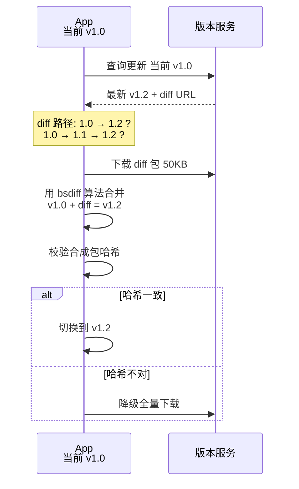

### 05.5 预加载策略

**多层预加载组合**：

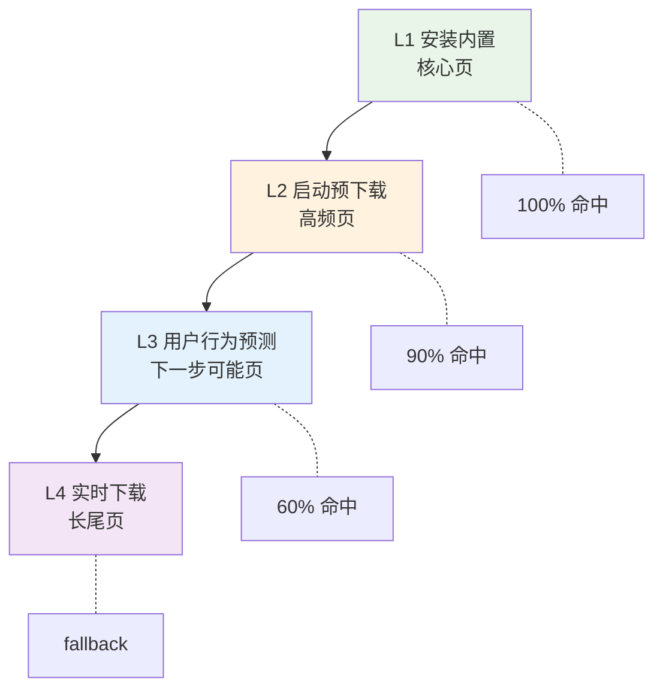

**接口预请求 + 数据预加载**：

```kotlin
// 用户在列表页时，预测下一步操作
class PreloadManager {
    
    fun onListPageVisible(items: List<Item>) {
        // 预加载前 3 个详情接口数据
        items.take(3).forEach { item ->
            scope.launch {
                val data = api.getDetail(item.id)
                cache.put("detail:${item.id}", data)
            }
        }
    }
    
    fun onDetailPageOpen(itemId: String): Item {
        // 优先用预加载的数据
        return cache.get("detail:$itemId") 
            ?: api.getDetail(itemId)
    }
}
```

## 06.关键问题解决

### 06.1 包冲突管理

**多业务团队各自做离线包，可能冲突**：

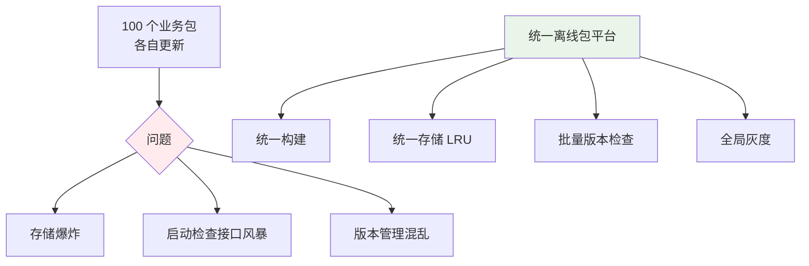

### 06.2 流量与电量

**用户流量敏感的考虑**：

| 策略 | 描述 |
|---|---|
| **Wi-Fi 优先** | 默认仅 Wi-Fi 下载 |
| **大包警告** | > 10MB 提示用户 |
| **分时段** | 夜间静默更新 |
| **流量上限** | 每月最多 N MB 后台下载 |
| **电量阈值** | 低电量时停止下载 |

### 06.3 命中率优化

**命中率监控指标**：

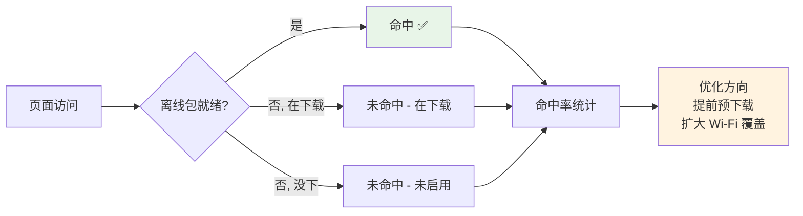

## 07.常见陷阱与反例

### 07.1 全量打包反例

**反例**：某电商把 50 个 H5 页面全部打入安装包 → **App 包从 50MB 涨到 120MB** → 安装转化率掉 25%。

**教训**：
- 只内置真正的"高频核心页"
- 边缘页面用"动态下载"
- 安装包大小 > 100MB 是大忌

### 07.2 不限并发反例

**反例**：App 启动后，**100 个业务包同时请求 CDN** → 网关被打、用户主流程加载慢。

**教训**：
- 控制并发（最多 3-5 个）
- 优先级排队（核心包优先）
- 主流程加载完才下载离线包

### 07.3 没监控反例

**反例**：上线了离线包系统，但**不知道命中率**——以为效果很好，其实命中率才 30%。

**教训**：必须监控：
- 离线包命中率
- 加载耗时
- 失败率（哈希校验失败、解压失败）
- 流量消耗

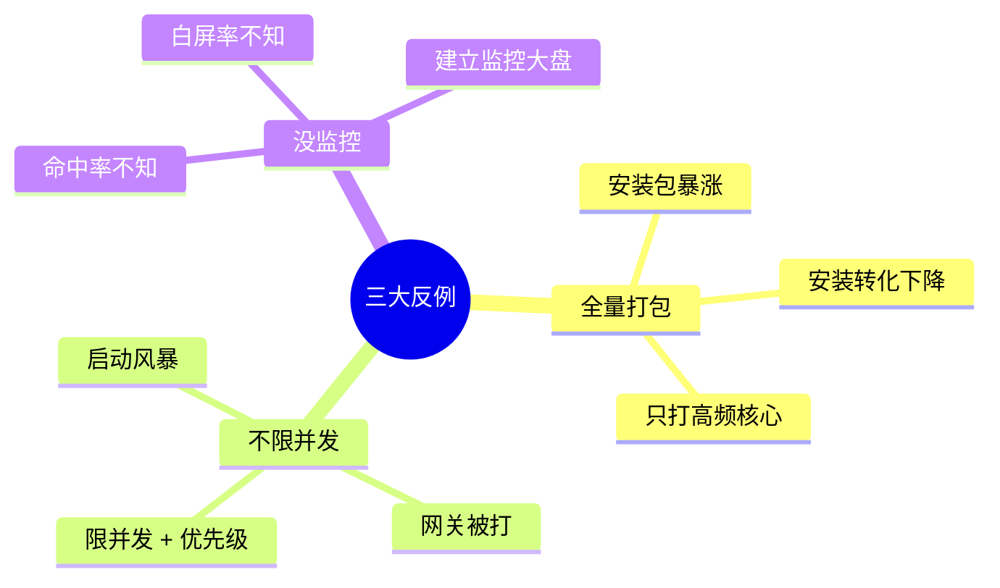

## 08.演进路线

### 08.1 V1 简单缓存

**特征**：业务起步、H5 不多。

**做法**：
- WebView 默认缓存
- HTTP cache-control
- 无主动管理

**适用阶段**：少量 H5 页面

### 08.2 V2 离线包系统

**特征**：H5 业务规模化。

**做法**：
- 离线包 + manifest
- 资源拦截加载
- 全量包下发
- WebView 预创建池

**适用阶段**：中型 App

### 08.3 V3 智能预加载

**特征**：超大规模 / 极致体验追求。

**做法**：
- 增量更新（bsdiff）
- 用户行为预测
- 接口预请求
- AI 辅助命中率优化
- 全链路监控

**适用阶段**：头部 App / 电商大促


## 09.总结与决策

### 09.1 上线检查表

离线包系统上线前对照：

- [ ] 包结构标准化（manifest + 资源）
- [ ] 包签名 + 哈希校验
- [ ] WebView 资源拦截
- [ ] 增量更新机制
- [ ] Wi-Fi 优先下载
- [ ] 并发控制（最多 N 个）
- [ ] LRU 存储管理（不无限膨胀）
- [ ] 灰度发布机制
- [ ] 失败回退在线版本
- [ ] WebView 预创建池
- [ ] 接口预请求
- [ ] 命中率监控
- [ ] 白屏率 / 加载耗时监控
- [ ] 流量消耗监控

### 09.2 选型决策树

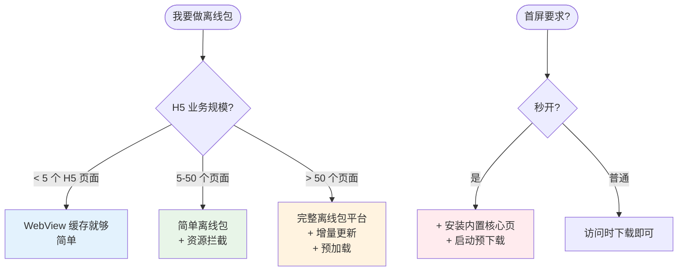

**最后一句话**：离线包是 H5 性能的"作弊器"——开篇 5 秒白屏的根因，就是把"网络下载"放在了"用户等待"的关键路径上。

> 好的离线包方案 = **核心内置、增量更新、安全可靠、命中率高**。
